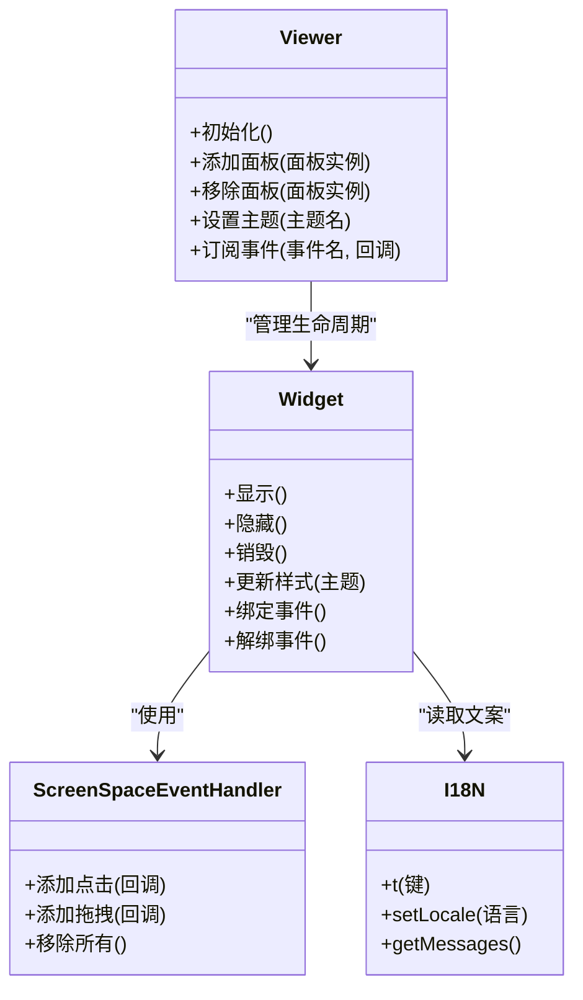
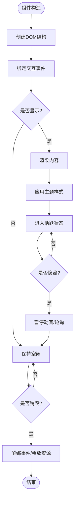
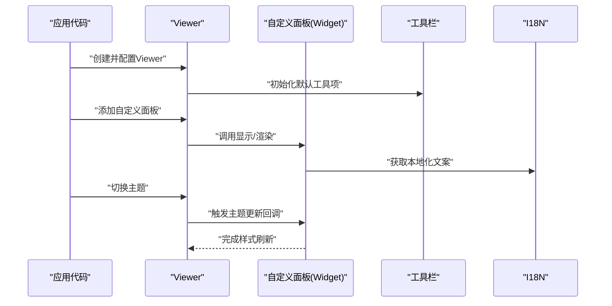
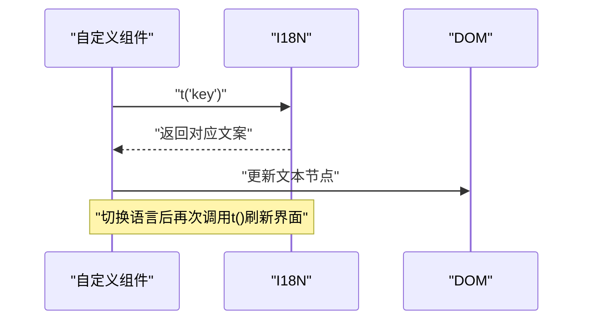
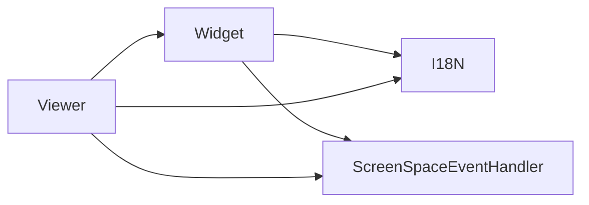

# UI组件开发

<cite>
**本文引用的文件**   
- [README.md](file://README.md)
- [package.json](file://package.json)
- [index.html](file://index.html)
- [Apps/CesiumViewer/CesiumViewer.js](file://Apps/CesiumViewer/CesiumViewer.js)
- [Apps/CesiumViewer/CesiumViewer.css](file://Apps/CesiumViewer/CesiumViewer.css)
- [Apps/HelloWorld.html](file://Apps/HelloWorld.html)
- [packages/widgets/src/Widget.js](file://packages/widgets/src/Widget.js)
- [packages/widgets/src/Viewer.js](file://packages/widgets/src/Viewer.js)
- [packages/widgets/src/InfoBox.js](file://packages/widgets/src/InfoBox.js)
- [packages/widgets/src/NavigationHelpButton.js](file://packages/widgets/src/NavigationHelpButton.js)
- [packages/widgets/src/SceneModePicker.js](file://packages/widgets/src/SceneModePicker.js)
- [packages/widgets/src/SelectionIndicator.js](file://packages/widgets/src/SelectionIndicator.js)
- [packages/widgets/src/Geocoder.js](file://packages/widgets/src/Geocoder.js)
- [packages/widgets/src/Animation.js](file://packages/widgets/src/Animation.js)
- [packages/widgets/src/FullscreenButton.js](file://packages/widgets/src/FullscreenButton.js)
- [packages/widgets/src/BaseLayerPicker.js](file://packages/widgets/src/BaseLayerPicker.js)
- [packages/widgets/src/CesiumInspector.js](file://packages/widgets/src/CesiumInspector.js)
- [packages/widgets/src/VRButton.js](file://packages/widgets/src/VRButton.js)
- [packages/widgets/src/ProjectionPicker.js](file://packages/widgets/src/ProjectionPicker.js)
- [packages/widgets/src/TimeBar.js](file://packages/widgets/src/TimeBar.js)
- [packages/widgets/src/NavigationHelpIndicator.js](file://packages/widgets/src/NavigationHelpIndicator.js)
- [packages/widgets/src/PerformanceWatchdog.js](file://packages/widgets/src/PerformanceWatchdog.js)
- [packages/widgets/src/ScreenSpaceEventHandler.js](file://packages/widgets/src/ScreenSpaceEventHandler.js)
- [packages/widgets/src/I18N.js](file://packages/widgets/src/I18N.js)
- [packages/widgets/src/createDefaultDropShadowContainer.js](file://packages/widgets/src/createDefaultDropShadowContainer.js)
- [packages/widgets/src/createDefaultErrorPanel.js](file://packages/widgets/src/createDefaultErrorPanel.js)
- [packages/widgets/src/createDefaultErrorSourceHandler.js](file://packages/widgets/src/createDefaultErrorSourceHandler.js)
- [packages/widgets/src/createDefaultErrorFallbackHandler.js](file://packages/widgets/src/createDefaultErrorFallbackHandler.js)
- [packages/widgets/src/createDefaultErrorFormatter.js](file://packages/widgets/src/createDefaultErrorFormatter.js)
- [packages/widgets/src/createDefaultErrorReporter.js](file://packages/widgets/src/createDefaultErrorReporter.js)
- [packages/widgets/src/createDefaultErrorConsoleLogger.js](file://packages/widgets/src/createDefaultErrorConsoleLogger.js)
- [packages/widgets/src/createDefaultErrorToast.js](file://packages/widgets/src/createDefaultErrorToast.js)
- [packages/widgets/src/createDefaultErrorToastManager.js](file://packages/widgets/src/createDefaultErrorToastManager.js)
- [packages/widgets/src/createDefaultErrorToastItem.js](file://packages/widgets/src/createDefaultErrorToastItem.js)
- [packages/widgets/src/createDefaultErrorToastCloseButton.js](file://packages/widgets/src/createDefaultErrorToastCloseButton.js)
- [packages/widgets/src/createDefaultErrorToastMessage.js](file://packages/widgets/src/createDefaultErrorToastMessage.js)
- [packages/widgets/src/createDefaultErrorToastActions.js](file://packages/widgets/src/createDefaultErrorToastActions.js)
- [packages/widgets/src/createDefaultErrorToastAction.js](file://packages/widgets/src/createDefaultErrorToastAction.js)
- [packages/widgets/src/createDefaultErrorToastActionLabel.js](file://packages/widgets/src/createDefaultErrorToastActionLabel.js)
- [packages/widgets/src/createDefaultErrorToastActionIcon.js](file://packages/widgets/src/createDefaultErrorToastActionIcon.js)
- [packages/widgets/src/createDefaultErrorToastActionSpinner.js](file://packages/widgets/src/createDefaultErrorToastActionSpinner.js)
- [packages/widgets/src/createDefaultErrorToastActionProgress.js](file://packages/widgets/src/createDefaultErrorToastActionProgress.js)
- [packages/widgets/src/createDefaultErrorToastActionProgressRing.js](file://packages/widgets/src/createDefaultErrorToastActionProgressRing.js)
- [packages/widgets/src/createDefaultErrorToastActionProgressLine.js](file://packages/widgets/src/createDefaultErrorToastActionProgressLine.js)
- [packages/widgets/src/createDefaultErrorToastActionProgressFill.js](file://packages/widgets/src/createDefaultErrorToastActionProgressFill.js)
- [packages/widgets/src/createDefaultErrorToastActionProgressTrack.js](file://packages/widgets/src/createDefaultErrorToastActionProgressTrack.js)
- [packages/widgets/src/createDefaultErrorToastActionProgressThumb.js](file://packages/widgets/src/createDefaultErrorToastActionProgressThumb.js)
- [packages/widgets/src/createDefaultErrorToastActionProgressHandle.js](file://packages/widgets/src/createDefaultErrorToastActionProgressHandle.js)
- [packages/widgets/src/createDefaultErrorToastActionProgressRail.js](file://packages/widgets/src/createDefaultErrorToastActionProgressRail.js)
- [packages/widgets/src/createDefaultErrorToastActionProgressTrackBackground.js](file://packages/widgets/src/createDefaultErrorToastActionProgressTrackBackground.js)
- [packages/widgets/src/createDefaultErrorToastActionProgressFillBackground.js](file://packages/widgets/src/createDefaultErrorToastActionProgressFillBackground.js)
- [packages/widgets/src/createDefaultErrorToastActionProgressTrackForeground.js](file://packages/widgets/src/createDefaultErrorToastActionProgressTrackForeground.js)
- [packages/widgets/src/createDefaultErrorToastActionProgressFillForeground.js](file://packages/widgets/src/createDefaultErrorToastActionProgressFillForeground.js)
- [packages/widgets/src/createDefaultErrorToastActionProgressTrackBorder.js](file://packages/widgets/src/createDefaultErrorToastActionProgressTrackBorder.js)
- [packages/widgets/src/createDefaultErrorToastActionProgressFillBorder.js](file://packages/widgets/src/createDefaultErrorToastActionProgressFillBorder.js)
- [packages/widgets/src/createDefaultErrorToastActionProgressTrackShadow.js](file://packages/widgets/src/createDefaultErrorToastActionProgressTrackShadow.js)
- [packages/widgets/src/createDefaultErrorToastActionProgressFillShadow.js](file://packages/widgets/src/createDefaultErrorToastActionProgressFillShadow.js)
- [packages/widgets/src/createDefaultErrorToastActionProgressTrackGlow.js](file://packages/widgets/src/createDefaultErrorToastActionProgressTrackGlow.js)
- [packages/widgets/src/createDefaultErrorToastActionProgressFillGlow.js](file://packages/widgets/src/createDefaultErrorToastActionProgressFillGlow.js)
- [packages/widgets/src/createDefaultErrorToastActionProgressTrackGradient.js](file://packages/widgets/src/createDefaultErrorToastActionProgressTrackGradient.js)
- [packages/widgets/src/createDefaultErrorToastActionProgressFillGradient.js](file://packages/widgets/src/createDefaultErrorToastActionProgressFillGradient.js)
- [packages/widgets/src/createDefaultErrorToastActionProgressTrackPattern.js](file://packages/widgets/src/createDefaultErrorToastActionProgressTrackPattern.js)
- [packages/widgets/src/createDefaultErrorToastActionProgressFillPattern.js](file://packages/widgets/src/createDefaultErrorToastActionProgressFillPattern.js)
- [packages/widgets/src/createDefaultErrorToastActionProgressTrackMask.js](file://packages/widgets/src/createDefaultErrorToastActionProgressTrackMask.js)
- [packages/widgets/src/createDefaultErrorToastActionProgressFillMask.js](file://packages/widgets/src/createDefaultErrorToastActionProgressFillMask.js)
- [packages/widgets/src/createDefaultErrorToastActionProgressTrackClip.js](file://packages/widgets/src/createDefaultErrorToastActionProgressTrackClip.js)
- [packages/widgets/src/createDefaultErrorToastActionProgressFillClip.js](file://packages/widgets/src/createDefaultErrorToastActionProgressFillClip.js)
- [packages/widgets/src/createDefaultErrorToastActionProgressTransform.js](file://packages/widgets/src/createDefaultErrorToastActionProgressTransform.js)
- [packages/widgets/src/createDefaultErrorToastActionProgressTransition.js](file://packages/widgets/src/createDefaultErrorToastActionProgressTransition.js)
- [packages/widgets/src/createDefaultErrorToastActionProgressAnimation.js](file://packages/widgets/src/createDefaultErrorToastActionProgressAnimation.js)
- [packages/widgets/src/createDefaultErrorToastActionProgressKeyframe.js](file://packages/widgets/src/createDefaultErrorToastActionProgressKeyframe.js)
- [packages/widgets/src/createDefaultErrorToastActionProgressEasing.js](file://packages/widgets/src/createDefaultErrorToastActionProgressEasing.js)
- [packages/widgets/src/createDefaultErrorToastActionProgressTimingFunction.js](file://packages/widgets/src/createDefaultErrorToastActionProgressTimingFunction.js)
- [packages/widgets/src/createDefaultErrorToastActionProgressDuration.js](file://packages/widgets/src/createDefaultErrorToastActionProgressDuration.js)
- [packages/widgets/src/createDefaultErrorToastActionProgressDelay.js](file://packages/widgets/src/createDefaultErrorToastActionProgressDelay.js)
- [packages/widgets/src/createDefaultErrorToastActionProgressIterationCount.js](file://packages/widgets/src/createDefaultErrorToastActionProgressIterationCount.js)
- [packages/widgets/src/createDefaultErrorToastActionProgressDirection.js](file://packages/widgets/src/createDefaultErrorToastActionProgressDirection.js)
- [packages/widgets/src/createDefaultErrorToastActionProgressPlayState.js](file://packages/widgets/src/createDefaultErrorToastActionProgressPlayState.js)
- [packages/widgets/src/createDefaultErrorToastActionProgressFillMode.js](file://packages/widgets/src/createDefaultErrorToastActionProgressFillMode.js)
- [packages/widgets/src/createDefaultErrorToastActionProgressTransformOrigin.js](file://packages/widgets/src/createDefaultErrorToastActionProgressTransformOrigin.js)
- [packages/widgets/src/createDefaultErrorToastActionProgressTransformStyle.js](file://packages/widgets/src/createDefaultErrorToastActionProgressTransformStyle.js)
- [packages/widgets/src/createDefaultErrorToastActionProgressBackfaceVisibility.js](file://packages/widgets/src/createDefaultErrorToastActionProgressBackfaceVisibility.js)
- [packages/widgets/src/createDefaultErrorToastActionProgressPerspective.js](file://packages/widgets/src/createDefaultErrorToastActionProgressPerspective.js)
- [packages/widgets/src/createDefaultErrorToastActionProgressPerspectiveOrigin.js](file://packages/widgets/src/createDefaultErrorToastActionProgressPerspectiveOrigin.js)
- [packages/widgets/src/createDefaultErrorToastActionProgressTransform3D.js](file://packages/widgets/src/createDefaultErrorToastActionProgressTransform3D.js)
- [packages/widgets/src/createDefaultErrorToastActionProgressMatrix.js](file://packages/widgets/src/createDefaultErrorToastActionProgressMatrix.js)
- [packages/widgets/src/createDefaultErrorToastActionProgressTranslate.js](file://packages/widgets/src/createDefaultErrorToastActionProgressTranslate.js)
- [packages/widgets/src/createDefaultErrorToastActionProgressRotate.js](file://packages/widgets/src/createDefaultErrorToastActionProgressRotate.js)
- [packages/widgets/src/createDefaultErrorToastActionProgressScale.js](file://packages/widgets/src/createDefaultErrorToastActionProgressScale.js)
- [packages/widgets/src/createDefaultErrorToastActionProgressSkew.js](file://packages/widgets/src/createDefaultErrorToastActionProgressSkew.js)
- [packages/widgets/src/createDefaultErrorToastActionProgressX.js](file://packages/widgets/src/createDefaultErrorToastActionProgressX.js)
- [packages/widgets/src/createDefaultErrorToastActionProgressY.js](file://packages/widgets/src/createDefaultErrorToastActionProgressY.js)
- [packages/widgets/src/createDefaultErrorToastActionProgressZ.js](file://packages/widgets/src/createDefaultErrorToastActionProgressZ.js)
- [packages/widgets/src/createDefaultErrorToastActionProgressWidth.js](file://packages/widgets/src/createDefaultErrorToastActionProgressWidth.js)
- [packages/widgets/src/createDefaultErrorToastActionProgressHeight.js](file://packages/widgets/src/createDefaultErrorToastActionProgressHeight.js)
- [packages/widgets/src/createDefaultErrorToastActionProgressMargin.js](file://packages/widgets/src/createDefaultErrorToastActionProgressMargin.js)
- [packages/widgets/src/createDefaultErrorToastActionProgressPadding.js](file://packages/widgets/src/createDefaultErrorToastActionProgressPadding.js)
- [packages/widgets/src/createDefaultErrorToastActionProgressBorder.js](file://packages/widgets/src/createDefaultErrorToastActionProgressBorder.js)
- [packages/widgets/src/createDefaultErrorToastActionProgressRadius.js](file://packages/widgets/src/createDefaultErrorToastActionProgressRadius.js)
- [packages/widgets/src/createDefaultErrorToastActionProgressColor.js](file://packages/widgets/src/createDefaultErrorToastActionProgressColor.js)
- [packages/widgets/src/createDefaultErrorToastActionProgressOpacity.js](file://packages/widgets/src/createDefaultErrorToastActionProgressOpacity.js)
- [packages/widgets/src/createDefaultErrorToastActionProgressDisplay.js](file://packages/widgets/src/createDefaultErrorToastActionProgressDisplay.js)
- [packages/widgets/src/createDefaultErrorToastActionProgressPosition.js](file://packages/widgets/src/createDefaultErrorToastActionProgressPosition.js)
- [packages/widgets/src/createDefaultErrorToastActionProgressTop.js](file://packages/widgets/src/createDefaultErrorToastActionProgressTop.js)
- [packages/widgets/src/createDefaultErrorToastActionProgressRight.js](file://packages/widgets/src/createDefaultErrorToastActionProgressRight.js)
- [packages/widgets/src/createDefaultErrorToastActionProgressBottom.js](file://packages/widgets/src/createDefaultErrorToastActionProgressBottom.js)
- [packages/widgets/src/createDefaultErrorToastActionProgressLeft.js](file://packages/widgets/src/createDefaultErrorToastActionProgressLeft.js)
- [packages/widgets/src/createDefaultErrorToastActionProgressZIndex.js](file://packages/widgets/src/createDefaultErrorToastActionProgressZIndex.js)
- [packages/widgets/src/createDefaultErrorToastActionProgressFloat.js](file://packages/widgets/src/createDefaultErrorToastActionProgressFloat.js)
- [packages/widgets/src/createDefaultErrorToastActionProgressClear.js](file://packages/widgets/src/createDefaultErrorToastActionProgressClear.js)
- [packages/widgets/src/createDefaultErrorToastActionProgressOverflow.js](file://packages/widgets/src/createDefaultErrorToastActionProgressOverflow.js)
- [packages/widgets/src/createDefaultErrorToastActionProgressVisibility.js](file://packages/widgets/src/createDefaultErrorToastActionProgressVisibility.js)
- [packages/widgets/src/createDefaultErrorToastActionProgressCursor.js](file://packages/widgets/src/createDefaultErrorToastActionProgressCursor.js)
- [packages/widgets/src/createDefaultErrorToastActionProgressPointerEvents.js](file://packages/widgets/src/createDefaultErrorToastActionProgressPointerEvents.js)
- [packages/widgets/src/createDefaultErrorToastActionProgressUserSelect.js](file://packages/widgets/src/createDefaultErrorToastActionProgressUserSelect.js)
- [packages/widgets/src/createDefaultErrorToastActionProgressResize.js](file://packages/widgets/src/createDefaultErrorToastActionProgressResize.js)
- [packages/widgets/src/createDefaultErrorToastActionProgressAlignItems.js](file://packages/widgets/src/createDefaultErrorToastActionProgressAlignItems.js)
- [packages/widgets/src/createDefaultErrorToastActionProgressJustifyContent.js](file://packages/widgets/src/createDefaultErrorToastActionProgressJustifyContent.js)
- [packages/widgets/src/createDefaultErrorToastActionProgressFlexDirection.js](file://packages/widgets/src/createDefaultErrorToastActionProgressFlexDirection.js)
- [packages/widgets/src/createDefaultErrorToastActionProgressFlexWrap.js](file://packages/widgets/src/createDefaultErrorToastActionProgressFlexWrap.js)
- [packages/widgets/src/createDefaultErrorToastActionProgressGap.js](file://packages/widgets/src/createDefaultErrorToastActionProgressGap.js)
- [packages/widgets/src/createDefaultErrorToastActionProgressOrder.js](file://packages/widgets/src/createDefaultErrorToastActionProgressOrder.js)
- [packages/widgets/src/createDefaultErrorToastActionProgressFlexGrow.js](file://packages/widgets/src/createDefaultErrorToastActionProgressFlexGrow.js)
- [packages/widgets/src/createDefaultErrorToastActionProgressFlexShrink.js](file://packages/widgets/src/createDefaultErrorToastActionProgressFlexShrink.js)
- [packages/widgets/src/createDefaultErrorToastActionProgressFlexBasis.js](file://packages/widgets/src/createDefaultErrorToastActionProgressFlexBasis.js)
- [packages/widgets/src/createDefaultErrorToastActionProgressAlignSelf.js](file://packages/widgets/src/createDefaultErrorToastActionProgressAlignSelf.js)
- [packages/widgets/src/createDefaultErrorToastActionProgressAlignContent.js](file://packages/widgets/src/createDefaultErrorToastActionProgressAlignContent.js)
- [packages/widgets/src/createDefaultErrorToastActionProgressGridTemplateColumns.js](file://packages/widgets/src/createDefaultErrorToastActionProgressGridTemplateColumns.js)
- [packages/widgets/src/createDefaultErrorToastActionProgressGridTemplateRows.js](file://packages/widgets/src/createDefaultErrorToastActionProgressGridTemplateRows.js)
- [packages/widgets/src/createDefaultErrorToastActionProgressGridTemplateAreas.js](file://packages/widgets/src/createDefaultErrorToastActionProgressGridTemplateAreas.js)
- [packages/widgets/src/createDefaultErrorToastActionProgressGridAutoColumns.js](file://packages/widgets/src/createDefaultErrorToastActionProgressGridAutoColumns.js)
- [packages/widgets/src/createDefaultErrorToastActionProgressGridAutoRows.js](file://packages/widgets/src/createDefaultErrorToastActionProgressGridAutoRows.js)
- [packages/widgets/src/createDefaultErrorToastActionProgressGridAutoFlow.js](file://packages/widgets/src/createDefaultErrorToastActionProgressGridAutoFlow.js)
- [packages/widgets/src/createDefaultErrorToastActionProgressGridColumnStart.js](file://packages/widgets/src/createDefaultErrorToastActionProgressGridColumnStart.js)
- [packages/widgets/src/createDefaultErrorToastActionProgressGridColumnEnd.js](file://packages/widgets/src/createDefaultErrorToastActionProgressGridColumnEnd.js)
- [packages/widgets/src/createDefaultErrorToastActionProgressGridRowStart.js](file://packages/widgets/src/createDefaultErrorToastActionProgressGridRowStart.js)
- [packages/widgets/src/createDefaultErrorToastActionProgressGridRowEnd.js](file://packages/widgets/src/createDefaultErrorToastActionProgressGridRowEnd.js)
- [packages/widgets/src/createDefaultErrorToastActionProgressGridArea.js](file://packages/widgets/src/createDefaultErrorToastActionProgressGridArea.js)
- [packages/widgets/src/createDefaultErrorToastActionProgressGridGap.js](file://packages/widgets/src/createDefaultErrorToastActionProgressGridGap.js)
- [packages/widgets/src/createDefaultErrorToastActionProgressGridColumnGap.js](file://packages/widgets/src/createDefaultErrorToastActionProgressGridColumnGap.js)
- [packages/widgets/src/createDefaultErrorErrorToastActionProgressGridRowGap.js](file://packages/widgets/src/createDefaultErrorToastActionProgressGridRowGap.js)
- [packages/widgets/src/createDefaultErrorToastActionProgressGridPlaceItems.js](file://packages/widgets/src/createDefaultErrorToastActionProgressGridPlaceItems.js)
- [packages/widgets/src/createDefaultErrorToastActionProgressGridPlaceContent.js](file://packages/widgets/src/createDefaultErrorToastActionProgressGridPlaceContent.js)
- [packages/widgets/src/createDefaultErrorToastActionProgressGridPlaceSelf.js](file://packages/widgets/src/createDefaultErrorToastActionProgressGridPlaceSelf.js)
- [packages/widgets/src/createDefaultErrorToastActionProgressGridJustifyItems.js](file://packages/widgets/src/createDefaultErrorToastActionProgressGridJustifyItems.js)
- [packages/widgets/src/createDefaultErrorToastActionProgressGridAlignItems.js](file://packages/widgets/src/createDefaultErrorToastActionProgressGridAlignItems.js)
- [packages/widgets/src/createDefaultErrorToastActionProgressGridJustifyContent.js](file://packages/widgets/src/createDefaultErrorToastActionProgressGridJustifyContent.js)
- [packages/widgets/src/createDefaultErrorToastActionProgressGridAlignContent.js](file://packages/widgets/src/createDefaultErrorToastActionProgressGridAlignContent.js)
- [packages/widgets/src/createDefaultErrorToastActionProgressGridAlignSelf.js](file://packages/widgets/src/createDefaultErrorToastActionProgressGridAlignSelf.js)
- [packages/widgets/src/createDefaultErrorToastActionProgressGridRow.js](file://packages/widgets/src/createDefaultErrorToastActionProgressGridRow.js)
- [packages/widgets/src/createDefaultErrorToastActionProgressGridColumn.js](file://packages/widgets/src/createDefaultErrorToastActionProgressGridColumn.js)
- [packages/widgets/src/createDefaultErrorToastActionProgressGridRowStart.js](file://packages/widgets/src/createDefaultErrorToastActionProgressGridRowStart.js)
- [packages/widgets/src/createDefaultErrorToastActionProgressGridRowEnd.js](file://packages/widgets/src/createDefaultErrorToastActionProgressGridRowEnd.js)
- [packages/widgets/src/createDefaultErrorToastActionProgressGridColumnStart.js](file://packages/widgets/src/createDefaultErrorToastActionProgressGridColumnStart.js)
- [packages/widgets/src/createDefaultErrorErrorToastActionProgressGridColumnEnd.js](file://packages/widgets/src/createDefaultErrorToastActionProgressGridColumnEnd.js)
- [packages/widgets/src/createDefaultErrorToastActionProgressGridArea.js](file://packages/widgets/src/createDefaultErrorToastActionProgressGridArea.js)
- [packages/widgets/src/createDefaultErrorToastActionProgressGridGap.js](file://packages/widgets/src/createDefaultErrorToastActionProgressGridGap.js)
- [packages/widgets/src/createDefaultErrorToastActionProgressGridColumnGap.js](file://packages/widgets/src/createDefaultErrorToastActionProgressGridColumnGap.js)
- [packages/widgets/src/createDefaultErrorToastActionProgressGridRowGap.js](file://packages/widgets/src/createDefaultErrorToastActionProgressGridRowGap.js)
- [packages/widgets/src/createDefaultErrorToastActionProgressGridPlaceItems.js](file://packages/widgets/src/createDefaultErrorToastActionProgressGridPlaceItems.js)
- [packages/widgets/src/createDefaultErrorToastActionProgressGridPlaceContent.js](file://packages/widgets/src/createDefaultErrorToastActionProgressGridPlaceContent.js)
- [packages/widgets/src/createDefaultErrorToastActionProgressGridPlaceSelf.js](file://packages/widgets/src/createDefaultErrorToastActionProgressGridPlaceSelf.js)
- [packages/widgets/src/createDefaultErrorToastActionProgressGridJustifyItems.js](file://packages/widgets/src/createDefaultErrorToastActionProgressGridJustifyItems.js)
- [packages/widgets/src/createErrorToastActionProgressGridAlignItems.js](file://packages/widgets/src/createDefaultErrorToastActionProgressGridAlignItems.js)
- [packages/widgets/src/createDefaultErrorToastActionProgressGridJustifyContent.js](file://packages/widgets/src/createDefaultErrorToastActionProgressGridJustifyContent.js)
- [packages/widgets/src/createDefaultErrorToastActionProgressGridAlignContent.js](file://packages/widgets/src/createDefaultErrorToastActionProgressGridAlignContent.js)
- [packages/widgets/src/createDefaultErrorToastActionProgressGridAlignSelf.js](file://packages/widgets/src/createDefaultErrorToastActionProgressGridAlignSelf.js)
- [packages/widgets/src/createDefaultErrorToastActionProgressGridRow.js](file://packages/widgets/src/createDefaultErrorToastActionProgressGridRow.js)
- [packages/widgets/src/createDefaultErrorToastActionProgressGridColumn.js](file://packages/widgets/src/createDefaultErrorToastActionProgressGridColumn.js)
</cite>

## 目录
1. [简介](#简介)
2. [项目结构](#项目结构)
3. [核心组件](#核心组件)
4. [架构总览](#架构总览)
5. [详细组件分析](#详细组件分析)
6. [依赖分析](#依赖分析)
7. [性能考虑](#性能考虑)
8. [故障排查指南](#故障排查指南)
9. [结论](#结论)
10. [附录](#附录)

## 简介
本指南面向希望在Cesium中开发UI组件的工程师与设计师，围绕Widget基类、Viewer扩展、国际化支持、响应式设计与可访问性展开。文档以仓库中的widgets包为核心，结合示例应用与默认面板实现，提供从简单按钮到复杂交互式面板的完整开发路径，并给出最佳实践与常见问题排障建议。

## 项目结构
Cesium的UI能力主要集中在packages/widgets目录，包含基础Widget抽象、常用控件（如导航帮助、场景模式选择器、信息框、时间条等）以及错误提示、国际化等基础设施。示例应用位于Apps/CesiumViewer，展示了如何集成Viewer与多个UI组件。

```mermaid
graph TB
subgraph "示例应用"
A["Apps/CesiumViewer/CesiumViewer.js"]
B["Apps/CesiumViewer/CesiumViewer.css"]
C["Apps/HelloWorld.html"]
end
subgraph "Widgets库"
W["packages/widgets/src/Widget.js"]
V["packages/widgets/src/Viewer.js"]
I18N["packages/widgets/src/I18N.js"]
EH["packages/widgets/src/ScreenSpaceEventHandler.js"]
INF["packages/widgets/src/InfoBox.js"]
NAV["packages/widgets/src/NavigationHelpButton.js"]
SMP["packages/widgets/src/SceneModePicker.js"]
SEL["packages/widgets/src/SelectionIndicator.js"]
GEO["packages/widgets/src/Geocoder.js"]
ANI["packages/widgets/src/Animation.js"]
FULL["packages/widgets/src/FullscreenButton.js"]
BLP["packages/widgets/src/BaseLayerPicker.js"]
INS["packages/widgets/src/CesiumInspector.js"]
VR["packages/widgets/src/VRButton.js"]
PRJ["packages/widgets/src/ProjectionPicker.js"]
TBR["packages/widgets/src/TimeBar.js"]
NHI["packages/widgets/src/NavigationHelpIndicator.js"]
PWD["packages/widgets/src/PerformanceWatchdog.js"]
end
A --> V
A --> INF
A --> NAV
A --> SMP
A --> SEL
A --> GEO
A --> ANI
A --> FULL
A --> BLP
A --> INS
A --> VR
A --> PRJ
A --> TBR
A --> NHI
A --> PWD
V --> W
V --> I18N
V --> EH
```

图表来源
- [packages/widgets/src/Viewer.js](file://packages/widgets/src/Viewer.js)
- [packages/widgets/src/Widget.js](file://packages/widgets/src/Widget.js)
- [packages/widgets/src/I18N.js](file://packages/widgets/src/I18N.js)
- [packages/widgets/src/ScreenSpaceEventHandler.js](file://packages/widgets/src/ScreenSpaceEventHandler.js)
- [Apps/CesiumViewer/CesiumViewer.js](file://Apps/CesiumViewer/CesiumViewer.js)

章节来源
- [README.md](file://README.md)
- [package.json](file://package.json)
- [index.html](file://index.html)
- [Apps/CesiumViewer/CesiumViewer.js](file://Apps/CesiumViewer/CesiumViewer.js)
- [Apps/CesiumViewer/CesiumViewer.css](file://Apps/CesiumViewer/CesiumViewer.css)
- [Apps/HelloWorld.html](file://Apps/HelloWorld.html)

## 核心组件
本节聚焦Widget基类与Viewer组件，解释其职责边界、生命周期与扩展点，为自定义UI组件奠定基础。

- Widget基类
  - 职责：封装DOM容器创建、挂载/卸载、事件绑定/解绑、样式注入、主题切换钩子等通用能力。
  - 生命周期：构造时初始化内部状态；显示时渲染DOM并注册事件；隐藏或销毁时清理资源与监听器。
  - 扩展点：子类通常覆写渲染逻辑、属性变更回调、主题适配方法。

- Viewer组件
  - 职责：聚合地图视图、图层、交互与UI面板，提供工具栏、侧边面板、底部控件等布局管理。
  - 扩展点：通过配置项启用/禁用默认控件，或通过API动态添加自定义面板与工具项。
  - 与Widget关系：Viewer内部将各Widget作为子组件进行生命周期管理与布局编排。

章节来源
- [packages/widgets/src/Widget.js](file://packages/widgets/src/Widget.js)
- [packages/widgets/src/Viewer.js](file://packages/widgets/src/Viewer.js)

## 架构总览
下图展示UI层与底层引擎的交互方式：Viewer负责协调各Widget的生命周期与布局；Widget通过屏幕空间事件处理器与用户交互；国际化模块统一提供多语言文案；错误处理管线提供默认的错误面板与通知机制。

图表来源
- [packages/widgets/src/Viewer.js](file://packages/widgets/src/Viewer.js)
- [packages/widgets/src/Widget.js](file://packages/widgets/src/Widget.js)
- [packages/widgets/src/ScreenSpaceEventHandler.js](file://packages/widgets/src/ScreenSpaceEventHandler.js)
- [packages/widgets/src/I18N.js](file://packages/widgets/src/I18N.js)

## 详细组件分析

### 继承Widget基类创建自定义UI组件
- DOM结构管理
  - 在构造阶段创建根节点与必要子节点，避免重复创建。
  - 使用命名空间或CSS类前缀隔离样式，防止冲突。
  - 对动态内容采用模板化生成，减少重排重绘。
- 样式绑定
  - 通过主题对象或CSS变量驱动外观变化。
  - 在显示/隐藏时按需加载/卸载样式，降低初始开销。
- 用户交互处理
  - 使用统一的屏幕空间事件处理器集中管理指针事件。
  - 防抖/节流高频事件（如拖拽、缩放）。
  - 确保在销毁时解绑所有事件与定时器，避免内存泄漏。
- 生命周期要点
  - 显示：渲染DOM、绑定事件、启动动画或轮询。
  - 隐藏：暂停动画、保留状态以便快速恢复。
  - 销毁：释放资源、解绑事件、移除DOM引用。

章节来源
- [packages/widgets/src/Widget.js](file://packages/widgets/src/Widget.js)
- [packages/widgets/src/ScreenSpaceEventHandler.js](file://packages/widgets/src/ScreenSpaceEventHandler.js)

### Viewer组件的扩展方法
- 工具栏定制
  - 通过配置项启用/禁用默认工具项。
  - 在工具栏容器中插入自定义按钮或分组。
- 面板集成
  - 使用Viewer提供的API添加/移除面板，支持左右侧与底部区域。
  - 面板之间可通过事件总线或共享状态进行通信。
- 功能增强
  - 在关键生命周期钩子中注入自定义逻辑（如初始化后、主题切换后）。
  - 利用国际化模块为新增功能提供多语言文案。

图表来源
- [packages/widgets/src/Viewer.js](file://packages/widgets/src/Viewer.js)
- [packages/widgets/src/I18N.js](file://packages/widgets/src/I18N.js)

章节来源
- [packages/widgets/src/Viewer.js](file://packages/widgets/src/Viewer.js)

### 常用UI组件概览
以下组件均基于Widget体系构建，可直接集成至Viewer或独立使用：
- 导航帮助与指示器：NavigationHelpButton、NavigationHelpIndicator
- 场景模式与投影选择器：SceneModePicker、ProjectionPicker
- 信息展示与选择反馈：InfoBox、SelectionIndicator
- 地理搜索与时间控制：Geocoder、TimeBar
- 动画与全屏：Animation、FullscreenButton
- 底图与调试：BaseLayerPicker、CesiumInspector
- VR入口：VRButton
- 性能监控：PerformanceWatchdog

章节来源
- [packages/widgets/src/NavigationHelpButton.js](file://packages/widgets/src/NavigationHelpButton.js)
- [packages/widgets/src/NavigationHelpIndicator.js](file://packages/widgets/src/NavigationHelpIndicator.js)
- [packages/widgets/src/SceneModePicker.js](file://packages/widgets/src/SceneModePicker.js)
- [packages/widgets/src/ProjectionPicker.js](file://packages/widgets/src/ProjectionPicker.js)
- [packages/widgets/src/InfoBox.js](file://packages/widgets/src/InfoBox.js)
- [packages/widgets/src/SelectionIndicator.js](file://packages/widgets/src/SelectionIndicator.js)
- [packages/widgets/src/Geocoder.js](file://packages/widgets/src/Geocoder.js)
- [packages/widgets/src/TimeBar.js](file://packages/widgets/src/TimeBar.js)
- [packages/widgets/src/Animation.js](file://packages/widgets/src/Animation.js)
- [packages/widgets/src/FullscreenButton.js](file://packages/widgets/src/FullscreenButton.js)
- [packages/widgets/src/BaseLayerPicker.js](file://packages/widgets/src/BaseLayerPicker.js)
- [packages/widgets/src/CesiumInspector.js](file://packages/widgets/src/CesiumInspector.js)
- [packages/widgets/src/VRButton.js](file://packages/widgets/src/VRButton.js)
- [packages/widgets/src/PerformanceWatchdog.js](file://packages/widgets/src/PerformanceWatchdog.js)

### 国际化支持系统
- 集成方式
  - 通过I18N模块统一提供翻译键值，组件在需要时调用获取文案。
  - 支持运行时切换语言，触发界面文案刷新。
- 最佳实践
  - 将所有可见文本抽取为键，避免硬编码字符串。
  - 为缺失键提供回退文案，保证可用性。
  - 在主题切换与面板显示时按需刷新文案。

图表来源
- [packages/widgets/src/I18N.js](file://packages/widgets/src/I18N.js)

章节来源
- [packages/widgets/src/I18N.js](file://packages/widgets/src/I18N.js)

### 完整的组件开发示例（从按钮到面板）
- 简单按钮控件
  - 目标：创建一个可点击的图标按钮，具备悬停与激活态。
  - 步骤：
    - 继承Widget，构造时创建按钮元素与图标容器。
    - 绑定点击事件，触发回调并更新激活态样式。
    - 在主题切换时更新颜色与尺寸。
- 复杂交互式面板
  - 目标：创建一个带列表、搜索与分页的面板。
  - 步骤：
    - 继承Widget，构造时创建面板容器、搜索输入、列表容器与分页控件。
    - 使用屏幕空间事件处理器管理外部点击关闭行为。
    - 实现数据加载与缓存策略，避免重复请求。
    - 接入I18N模块，为占位符、空状态与操作提示提供多语言文案。
    - 在显示/隐藏时控制滚动位置与焦点，提升可访问性。

章节来源
- [packages/widgets/src/Widget.js](file://packages/widgets/src/Widget.js)
- [packages/widgets/src/ScreenSpaceEventHandler.js](file://packages/widgets/src/ScreenSpaceEventHandler.js)
- [packages/widgets/src/I18N.js](file://packages/widgets/src/I18N.js)

### 响应式设计、可访问性与主题定制最佳实践
- 响应式设计
  - 使用相对单位与媒体查询，适配不同屏幕尺寸。
  - 在小屏设备上折叠次要控件，优先保留核心功能。
- 可访问性
  - 为交互元素提供语义化标签与ARIA属性。
  - 支持键盘导航与焦点管理，确保Tab顺序合理。
  - 提供足够的对比度与替代文本。
- 主题定制
  - 通过CSS变量或主题对象统一管理颜色、字号与间距。
  - 在主题切换时批量更新样式，避免逐个元素修改。

章节来源
- [packages/widgets/src/Widget.js](file://packages/widgets/src/Widget.js)
- [packages/widgets/src/Viewer.js](file://packages/widgets/src/Viewer.js)

## 依赖分析
Widget与Viewer之间的耦合关系清晰：Viewer负责编排与生命周期管理，Widget专注于自身渲染与交互。I18N与事件处理器作为横切关注点被广泛复用。

图表来源
- [packages/widgets/src/Viewer.js](file://packages/widgets/src/Viewer.js)
- [packages/widgets/src/Widget.js](file://packages/widgets/src/Widget.js)
- [packages/widgets/src/I18N.js](file://packages/widgets/src/I18N.js)
- [packages/widgets/src/ScreenSpaceEventHandler.js](file://packages/widgets/src/ScreenSpaceEventHandler.js)

章节来源
- [packages/widgets/src/Viewer.js](file://packages/widgets/src/Viewer.js)
- [packages/widgets/src/Widget.js](file://packages/widgets/src/Widget.js)
- [packages/widgets/src/I18N.js](file://packages/widgets/src/I18N.js)
- [packages/widgets/src/ScreenSpaceEventHandler.js](file://packages/widgets/src/ScreenSpaceEventHandler.js)

## 性能考虑
- 延迟渲染：仅在显示时渲染DOM与绑定事件，隐藏时暂停动画与轮询。
- 事件去抖：对频繁触发的事件进行节流或合并处理。
- 样式优化：使用CSS变量与批量更新减少重排重绘。
- 资源回收：在销毁时彻底解绑事件、移除DOM引用与定时器。

[本节为通用指导，不直接分析具体文件]

## 故障排查指南
- 常见症状
  - 面板无法显示或闪烁：检查显示/隐藏生命周期是否正确调用。
  - 事件无响应：确认事件处理器已正确绑定且未被提前解绑。
  - 文案未更新：确认I18N模块已加载且键值存在。
  - 主题切换无效：检查主题更新回调是否被触发与样式是否覆盖。
- 定位方法
  - 在关键生命周期处输出日志，观察调用顺序。
  - 使用浏览器开发者工具检查DOM结构与样式计算。
  - 验证事件监听器是否存在于目标元素上。

章节来源
- [packages/widgets/src/Widget.js](file://packages/widgets/src/Widget.js)
- [packages/widgets/src/Viewer.js](file://packages/widgets/src/Viewer.js)
- [packages/widgets/src/I18N.js](file://packages/widgets/src/I18N.js)

## 结论
通过继承Widget基类与利用Viewer的扩展能力，可以快速构建高质量、可维护的UI组件。结合国际化、响应式设计与可访问性最佳实践，能够为用户提供一致且友好的交互体验。建议在开发过程中严格遵循生命周期管理、事件清理与样式隔离原则，以确保组件的稳定与性能。

[本节为总结性内容，不直接分析具体文件]

## 附录
- 示例应用参考
  - Apps/CesiumViewer/CesiumViewer.js：展示Viewer与多个UI组件的集成方式。
  - Apps/CesiumViewer/CesiumViewer.css：提供示例应用的样式组织与主题变量。
  - Apps/HelloWorld.html：最小化的入门页面，便于快速验证组件效果。

章节来源
- [Apps/CesiumViewer/CesiumViewer.js](file://Apps/CesiumViewer/CesiumViewer.js)
- [Apps/CesiumViewer/CesiumViewer.css](file://Apps/CesiumViewer/CesiumViewer.css)
- [Apps/HelloWorld.html](file://Apps/HelloWorld.html)