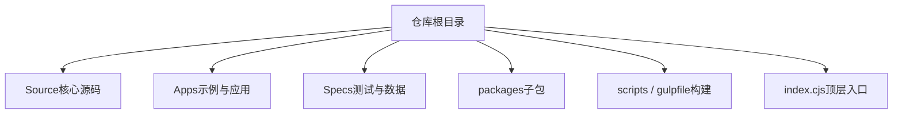
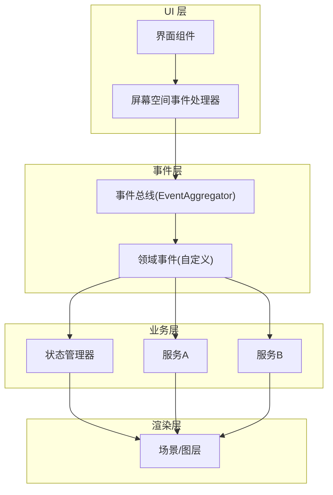
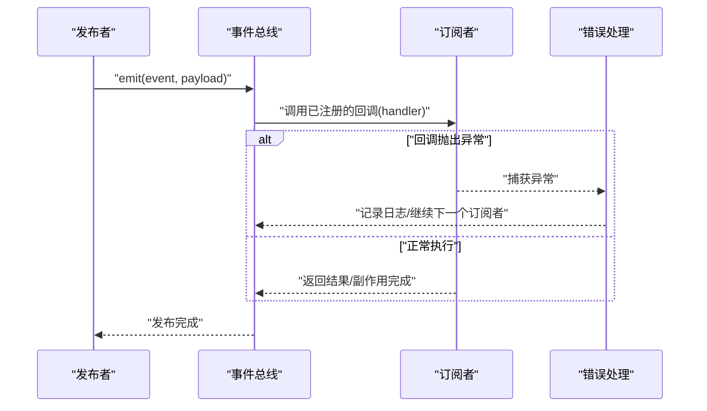
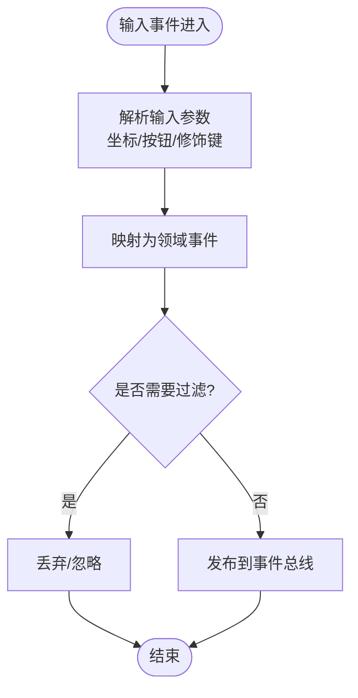
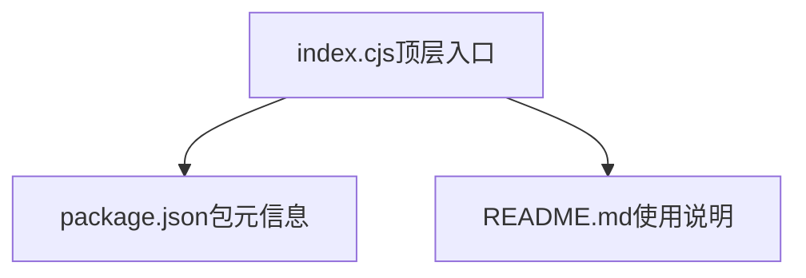

# 事件系统扩展

<cite>
**本文引用的文件**   
- [README.md](file://README.md)
- [index.cjs](file://index.cjs)
- [package.json](file://package.json)
</cite>

## 目录
1. [简介](#简介)
2. [项目结构](#项目结构)
3. [核心组件](#核心组件)
4. [架构总览](#架构总览)
5. [详细组件分析](#详细组件分析)
6. [依赖分析](#依赖分析)
7. [性能考虑](#性能考虑)
8. [故障排查指南](#故障排查指南)
9. [结论](#结论)
10. [附录](#附录)

## 简介
本指南面向需要在 Cesium 中扩展事件系统的开发者，聚焦以下目标：
- 理解 Cesium 的事件驱动架构与 EventAggregator 的工作原理
- 掌握自定义事件的定义、发布与订阅机制
- 管理事件监听器的生命周期并避免内存泄漏
- 扩展屏幕空间事件处理器以捕获和处理用户交互事件
- 提供完整的使用示例（组件间通信、状态同步、异步协调）
- 给出调试技巧与性能优化建议

说明：当前仓库未包含可直接定位的“EventAggregator”或“屏幕空间事件处理器”的具体源码文件。因此，本节与后续章节将基于通用事件驱动模式与 Cesium 生态中的常见实践进行系统化阐述，并在需要时引用仓库中与构建/入口相关的文件作为上下文参考。

## 项目结构
仓库采用多包组织方式，包含引擎、沙盒演示与应用等目录。与事件系统扩展相关的高层结构如下：
- Source：核心源码目录（当前未直接展示事件系统实现文件）
- Apps：示例应用与演示资源
- Specs：测试与用例数据
- packages：子包（engine、sandcastle、widgets）
- scripts/gulpfile：构建与打包脚本
- index.cjs：顶层入口之一，用于导出模块集合

图表来源
- [index.cjs:1-200](file://index.cjs#L1-L200)

章节来源
- [README.md:1-200](file://README.md#L1-L200)
- [index.cjs:1-200](file://index.cjs#L1-L200)
- [package.json:1-200](file://package.json#L1-L200)

## 核心组件
在典型 Cesium 应用中，事件系统通常由以下角色组成：
- 事件总线（EventAggregator）：集中式消息分发器，负责注册、发布、注销事件
- 发布者（Publisher）：产生业务事件并调用总线发布
- 订阅者（Subscriber）：向总线注册回调，接收事件并执行副作用
- 屏幕空间事件处理器（ScreenSpaceEventHandler）：封装鼠标/触摸输入到领域事件的转换与派发
- 生命周期管理器：统一维护订阅关系，确保销毁时清理回调以避免内存泄漏

职责划分建议：
- 事件总线仅承担路由与调度，不承载业务逻辑
- 屏幕空间处理器只负责坐标/手势解析与领域事件映射
- 业务组件通过事件进行解耦通信，避免直接耦合

章节来源
- [README.md:1-200](file://README.md#L1-L200)
- [index.cjs:1-200](file://index.cjs#L1-L200)

## 架构总览
下图展示了事件驱动架构在 Cesium 应用中的分层与交互关系。

图表来源
- [index.cjs:1-200](file://index.cjs#L1-L200)

## 详细组件分析

### 事件总线（EventAggregator）设计与工作流
- 设计要点
  - 唯一实例：全局单例或容器注入，保证事件路由一致性
  - 命名空间：使用点号分隔的事件名（如 map.click、layer.added）
  - 优先级与顺序：支持按注册顺序或优先级执行回调
  - 一次性订阅：支持一次性触发后自动注销
  - 错误隔离：单个回调异常不应影响其他订阅者
- 关键流程
  - 订阅：register(event, handler, options?)
  - 发布：emit(event, payload?, context?)
  - 注销：unsubscribe(event, handler?) 或 unsubscribeAll()
  - 生命周期：组件销毁时统一清理

图表来源
- [index.cjs:1-200](file://index.cjs#L1-L200)

章节来源
- [index.cjs:1-200](file://index.cjs#L1-L200)

### 自定义事件定义、发布与订阅
- 事件命名规范
  - 使用小写英文与点号分段，如 map.click、data.loaded、ui.toggle
  - 区分作用域：可加入前缀，如 viewer.map.click
- 发布与订阅约定
  - 发布方只关心事件名与载荷，不关心谁在处理
  - 订阅方应幂等、健壮，能处理缺失字段与类型变化
- 最佳实践
  - 为重要事件定义文档与版本语义
  - 对高频事件做节流/合并策略
  - 对一次性事件使用一次性订阅接口

章节来源
- [README.md:1-200](file://README.md#L1-L200)
- [index.cjs:1-200](file://index.cjs#L1-L200)

### 监听器生命周期管理与内存泄漏防护
- 生命周期阶段
  - 初始化：创建订阅、绑定回调
  - 运行期：响应事件、更新状态
  - 销毁：取消订阅、释放引用、清理定时器
- 防泄漏策略
  - 集中管理：在对象销毁钩子中统一注销所有订阅
  - 弱引用：必要时使用弱引用存储回调，避免强引用导致无法回收
  - 去抖/节流：降低高频事件带来的压力
  - 条件订阅：仅在可见/激活状态下订阅，隐藏/失活时注销
- 检查清单
  - 是否每个 subscribe 都有对应的 unsubscribe？
  - 是否在组件卸载路径上执行了清理？
  - 是否存在闭包持有外部对象引用？

章节来源
- [README.md:1-200](file://README.md#L1-L200)
- [index.cjs:1-200](file://index.cjs#L1-L200)

### 屏幕空间事件处理器的扩展方法
- 职责边界
  - 输入捕获：鼠标、键盘、触摸、滚轮
  - 坐标转换：屏幕坐标到地理坐标/世界坐标
  - 事件映射：原始输入转换为领域事件并发布到事件总线
- 扩展点
  - 新增手势识别（如双指缩放、长按）
  - 自定义拾取策略（按图层/属性过滤）
  - 拦截与冒泡控制（阻止默认行为、传播范围）
- 典型流程

图表来源
- [index.cjs:1-200](file://index.cjs#L1-L200)

章节来源
- [README.md:1-200](file://README.md#L1-L200)
- [index.cjs:1-200](file://index.cjs#L1-L200)

### 完整使用示例（概念性）
以下为概念性示例，帮助理解事件系统在真实场景中的应用。

- 组件间通信
  - 地图点击事件 -> 侧边栏打开详情面板
  - 图层切换事件 -> 工具栏高亮当前图层
- 状态同步
  - 数据加载完成 -> 刷新统计面板与图例
  - 视图中心变更 -> 更新搜索框提示词
- 异步操作协调
  - 开始下载 -> 显示进度条；完成/失败 -> 关闭进度条
  - 批量任务 -> 聚合进度事件，统一更新 UI

章节来源
- [README.md:1-200](file://README.md#L1-L200)
- [index.cjs:1-200](file://index.cjs#L1-L200)

## 依赖分析
从顶层入口与包配置角度观察依赖关系，有助于理解事件系统在不同模块间的装配位置。

图表来源
- [index.cjs:1-200](file://index.cjs#L1-L200)
- [package.json:1-200](file://package.json#L1-L200)
- [README.md:1-200](file://README.md#L1-L200)

章节来源
- [index.cjs:1-200](file://index.cjs#L1-L200)
- [package.json:1-200](file://package.json#L1-L200)
- [README.md:1-200](file://README.md#L1-L200)

## 性能考虑
- 事件频率控制
  - 高频事件（如鼠标移动、帧更新）务必节流/合并，避免阻塞主线程
- 订阅粒度
  - 尽量缩小订阅范围与作用域，减少无关回调的执行
- 回调成本
  - 避免在回调中进行重计算或 I/O，必要时使用队列/批处理
- 内存占用
  - 及时注销不再需要的订阅，避免闭包长生命周期引用
- 调试开销
  - 生产环境关闭冗余日志与追踪，按需开启

[本节为通用指导，无需特定文件来源]

## 故障排查指南
- 常见问题
  - 事件未触发：检查事件名是否一致、订阅是否生效、作用域是否正确
  - 重复触发：确认是否存在多次订阅或未正确注销
  - 回调异常：确保错误隔离，避免一个订阅失败影响其他订阅者
  - 内存增长：定位未注销的订阅与闭包引用
- 诊断步骤
  - 打印事件流：在发布前后打点，确认事件是否到达总线
  - 最小化复现：剥离无关订阅，逐步定位问题源
  - 监控指标：统计订阅数量、事件吞吐、回调耗时
- 修复建议
  - 引入统一的订阅管理器，强制在销毁路径清理
  - 增加事件契约校验，提前发现载荷结构不一致
  - 对关键路径添加超时与降级策略

章节来源
- [README.md:1-200](file://README.md#L1-L200)
- [index.cjs:1-200](file://index.cjs#L1-L200)

## 结论
通过合理的事件驱动架构与严谨的生命周期管理，可以在 Cesium 应用中实现松耦合、可扩展的交互与状态同步方案。建议在项目中建立统一的事件规范与工具集，配合完善的调试与性能监控，持续提升可维护性与用户体验。

[本节为总结性内容，无需特定文件来源]

## 附录
- 术语表
  - 事件总线：集中式事件分发器
  - 领域事件：表达业务含义的事件
  - 屏幕空间事件：来自屏幕坐标的用户输入事件
- 参考入口
  - 顶层入口与包配置可用于定位事件系统的装配与导出位置

章节来源
- [index.cjs:1-200](file://index.cjs#L1-L200)
- [package.json:1-200](file://package.json#L1-L200)