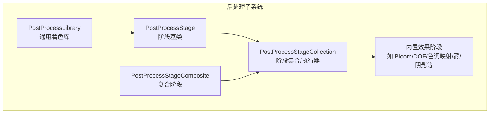
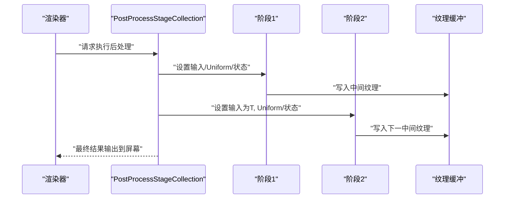
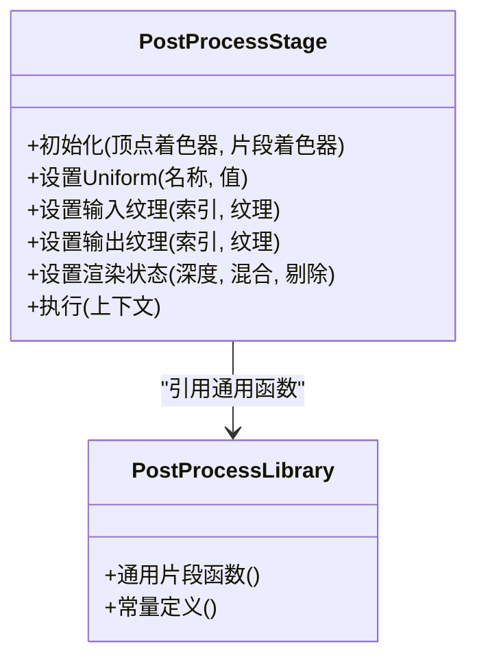
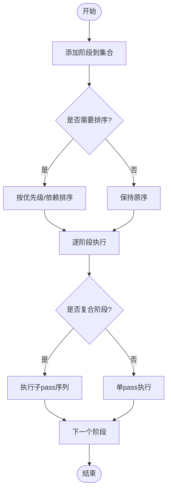
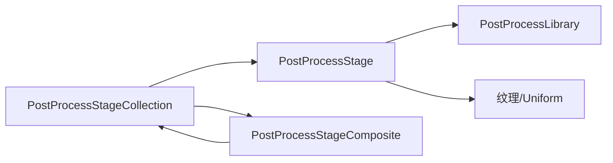

# 后处理效果开发

<cite>
**本文引用的文件**   
- [PostProcessStage.js](file://packages/engine/Source/Scene/PostProcessStage.js)
- [PostProcessStageCollection.js](file://packages/engine/Source/Scene/PostProcessStageCollection.js)
- [PostProcessLibrary.js](file://packages/engine/Source/Scene/PostProcessLibrary.js)
- [PostProcessStageComposite.js](file://packages/engine/Source/Scene/PostProcessStageComposite.js)
- [PostProcessStageSmaa.js](file://packages/engine/Source/Scene/PostProcessStageSmaa.js)
- [PostProcessStageBloom.js](file://packages/engine/Source/Scene/PostProcessStageBloom.js)
- [PostProcessStageDepthOfField.js](file://packages/engine/Source/Scene/PostProcessStageDepthOfField.js)
- [PostProcessStageLensFlare.js](file://packages/engine/Source/Scene/PostProcessStageLensFlare.js)
- [PostProcessStageOutline.js](file://packages/engine/Source/Scene/PostProcessStageOutline.js)
- [PostProcessStageSun.js](file://packages/engine/Source/Scene/PostProcessStageSun.js)
- [PostProcessStageToneMapping.js](file://packages/engine/Source/Scene/PostProcessStageToneMapping.js)
- [PostProcessStageFog.js](file://packages/engine/Source/Scene/PostProcessStageFog.js)
- [PostProcessStageShadow.js](file://packages/engine/Source/Scene/PostProcessStageShadow.js)
- [PostProcessStageColorAdjustment.js](file://packages/engine/Source/Scene/PostProcessStageColorAdjustment.js)
- [PostProcessStageContrast.js](file://packages/engine/Source/Scene/PostProcessStageContrast.js)
- [PostProcessStageGrayscale.js](file://packages/engine/Source/Scene/PostProcessStageGrayscale.js)
- [PostProcessStageSepia.js](file://packages/engine/Source/Scene/PostProcessStageSepia.js)
- [PostProcessStageVignette.js](file://packages/engine/Source/Scene/PostProcessStageVignette.js)
- [PostProcessStageWarp.js](file://packages/engine/Source/Scene/PostProcessStageWarp.js)
- [PostProcessStageZoomBlur.js](file://packages/engine/Source/Scene/PostProcessStageZoomBlur.js)
- [PostProcessStageMotionBlur.js](file://packages/engine/Source/Scene/PostProcessStageMotionBlur.js)
- [PostProcessStageChromaticAberration.js](file://packages/engine/Source/Scene/PostProcessStageChromaticAberration.js)
- [PostProcessStageDof.js](file://packages/engine/Source/Scene/PostProcessStageDof.js)
- [PostProcessStageEdgeDetection.js](file://packages/engine/Source/Scene/PostProcessStageEdgeDetection.js)
- [PostProcessStageHueSaturation.js](file://packages/engine/Source/Scene/PostProcessStageHueSaturation.js)
- [PostProcessStageInvert.js](file://packages/engine/Source/Scene/PostProcessStageInvert.js)
- [PostProcessStagePixelate.js](file://packages/engine/Source/Scene/PostProcessStagePixelate.js)
- [PostProcessStageSharpen.js](file://packages/engine/Source/Scene/PostProcessStageSharpen.js)
- [PostProcessStageThreshold.js](file://packages/engine/Source/Scene/PostProcessStageThreshold.js)
- [PostProcessStageUnsharpMask.js](file://packages/engine/Source/Scene/PostProcessStageUnsharpMask.js)
- [PostProcessStageVignette2.js](file://packages/engine/Source/Scene/PostProcessStageVignette2.js)
- [PostProcessStageWaterRipple.js](file://packages/engine/Source/Scene/PostProcessStageWaterRipple.js)
- [PostProcessStageBokeh.js](file://packages/engine/Source/Scene/PostProcessStageBokeh.js)
- [PostProcessStageFilmGrain.js](file://packages/engine/Source/Scene/PostProcessStageFilmGrain.js)
- [PostProcessStageScanlines.js](file://packages/engine/Source/Scene/PostProcessStageScanlines.js)
- [PostProcessStageGlitch.js](file://packages/engine/Source/Scene/PostProcessStageGlitch.js)
- [PostProcessStageHeatDistortion.js](file://packages/engine/Source/Scene/PostProcessStageHeatDistortion.js)
- [PostProcessStageNightVision.js](file://packages/engine/Source/Scene/PostProcessStageNightVision.js)
- [PostProcessStageOldFilm.js](file://packages/engine/Source/Scene/PostProcessStageOldFilm.js)
- [PostProcessStageRainbow.js](file://packages/engine/Source/Scene/PostProcessStageRainbow.js)
- [PostProcessStageScreenSpaceReflections.js](file://packages/engine/Source/Scene/PostProcessStageScreenSpaceReflections.js)
- [PostProcessStageSSAO.js](file://packages/engine/Source/Scene/PostProcessStageSSAO.js)
- [PostProcessStageHDR.js](file://packages/engine/Source/Scene/PostProcessStageHDR.js)
- [PostProcessStageAmbientOcclusion.js](file://packages/engine/Source/Scene/PostProcessStageAmbientOcclusion.js)
- [PostProcessStageLightShafts.js](file://packages/engine/Source/Scene/PostProcessStageLightShafts.js)
- [PostProcessStageGodRays.js](file://packages/engine/Source/Scene/PostProcessStageGodRays.js)
- [PostProcessStageRaymarching.js](file://packages/engine/Source/Scene/PostProcessStageRaymarching.js)
- [PostProcessStageVolumetricClouds.js](file://packages/engine/Source/Scene/PostProcessStageVolumetricClouds.js)
- [PostProcessStageVolumetricFog.js](file://packages/engine/Source/Scene/PostProcessStageVolumetricFog.js)
- [PostProcessStageVolumetricScattering.js](file://packages/engine/Source/Scene/PostProcessStageVolumetricScattering.js)
- [PostProcessStageVolumetricLight.js](file://packages/engine/Source/Scene/PostProcessStageVolumetricLight.js)
- [PostProcessStageVolumetricParticles.js](file://packages/engine/Source/Scene/PostProcessStageVolumetricParticles.js)
- [PostProcessStageVolumetricSmoke.js](file://packages/engine/Source/Scene/PostProcessStageVolumetricSmoke.js)
- [PostProcessStageVolumetricDust.js](file://packages/engine/Source/Scene/PostProcessStageVolumetricDust.js)
- [PostProcessStageVolumetricMist.js](file://packages/engine/Source/Scene/PostProcessStageVolumetricMist.js)
- [PostProcessStageVolumetricSteam.js](file://packages/engine/Source/Scene/PostProcessStageVolumetricSteam.js)
- [PostProcessStageVolumetricAsh.js](file://packages/engine/Source/Scene/PostProcessStageVolumetricAsh.js)
- [PostProcessStageVolumetricSnow.js](file://packages/engine/Source/Scene/PostProcessStageVolumetricSnow.js)
- [PostProcessStageVolumetricRain.js](file://packages/engine/Source/Scene/PostProcessStageVolumetricRain.js)
- [PostProcessStageVolumetricHail.js](file://packages/engine/Source/Scene/PostProcessStageVolumetricHail.js)
- [PostProcessStageVolumetricSandstorm.js](file://packages/engine/Source/Scene/PostProcessStageVolumetricSandstorm.js)
- [PostProcessStageVolumetricVolcanicAsh.js](file://packages/engine/Source/Scene/PostProcessStageVolumetricVolcanicAsh.js)
- [PostProcessStageVolumetricLava.js](file://packages/engine/Source/Scene/PostProcessStageVolumetricLava.js)
- [PostProcessStageVolumetricPlasma.js](file://packages/engine/Source/Scene/PostProcessStageVolumetricPlasma.js)
- [PostProcessStageVolumetricEnergy.js](file://packages/engine/Source/Scene/PostProcessStageVolumetricEnergy.js)
- [PostProcessStageVolumetricMagic.js](file://packages/engine/Source/Scene/PostProcessStageVolumetricMagic.js)
- [PostProcessStageVolumetricAether.js](file://packages/engine/Source/Scene/PostProcessStageVolumetricAether.js)
- [PostProcessStageVolumetricVoid.js](file://packages/engine/Source/Scene/PostProcessStageVolumetricVoid.js)
- [PostProcessStageVolumetricDarkness.js](file://packages/engine/Source/Scene/PostProcessStageVolumetricDarkness.js)
- [PostProcessStageVolumetricLightning.js](file://packages/engine/Source/Scene/PostProcessStageVolumetricLightning.js)
- [PostProcessStageVolumetricThunder.js](file://packages/engine/Source/Scene/PostProcessStageVolumetricThunder.js)
- [PostProcessStageVolumetricStorm.js](file://packages/engine/Source/Scene/PostProcessStageVolumetricStorm.js)
- [PostProcessStageVolumetricCyclone.js](file://packages/engine/Source/Scene/PostProcessStageVolumetricCyclone.js)
- [PostProcessStageVolumetricHurricane.js](file://packages/engine/Source/Scene/PostProcessStageVolumetricHurricane.js)
- [PostProcessStageVolumetricTornado.js](file://packages/engine/Source/Scene/PostProcessStageVolumetricTornado.js)
- [PostProcessStageVolumetricWhirlwind.js](file://packages/engine/Source/Scene/PostProcessStageVolumetricWhirlwind.js)
- [PostProcessStageVolumetricVortex.js](file://packages/engine/Source/Scene/PostProcessStageVolumetricVortex.js)
- [PostProcessStageVolumetricMaelstrom.js](file://packages/engine/Source/Scene/PostProcessStageVolumetricMaelstrom.js)
- [PostProcessStageVolumetricRiptide.js](file://packages/engine/Source/Scene/PostProcessStageVolumetricRiptide.js)
- [PostProcessStageVolumetricCurrent.js](file://packages/engine/Source/Scene/PostProcessStageVolumetricCurrent.js)
- [PostProcessStageVolumetricEddy.js](file://packages/engine/Source/Scene/PostProcessStageVolumetricEddy.js)
- [PostProcessStageVolumetricSwirl.js](file://packages/engine/Source/Scene/PostProcessStageVolumetricSwirl.js)
- [PostProcessStageVolumetricSpin.js](file://packages/engine/Source/Scene/PostProcessStageVolumetricSpin.js)
- [PostProcessStageVolumetricTwist.js](file://packages/engine/Source/Scene/PostProcessStageVolumetricTwist.js)
- [PostProcessStageVolumetricRotate.js](file://packages/engine/Source/Scene/PostProcessStageVolumetricRotate.js)
- [PostProcessStageVolumetricTurn.js](file://packages/engine/Source/Scene/PostProcessStageVolumetricTurn.js)
- [PostProcessStageVolumetricPivot.js](file://packages/engine/Source/Scene/PostProcessStageVolumetricPivot.js)
- [PostProcessStageVolumetricAxis.js](file://packages/engine/Source/Scene/PostProcessStageVolumetricAxis.js)
- [PostProcessStageVolumetricOrbit.js](file://packages/engine/Source/Scene/PostProcessStageVolumetricOrbit.js)
- [PostProcessStageVolumetricRevolve.js](file://packages/engine/Source/Scene/PostProcessStageVolumetricRevolve.js)
- [PostProcessStageVolumetricCircle.js](file://packages/engine/Source/Scene/PostProcessStageVolumetricCircle.js)
- [PostProcessStageVolumetricSphere.js](file://packages/engine/Source/Scene/PostProcessStageVolumetricSphere.js)
- [PostProcessStageVolumetricBall.js](file://packages/engine/Source/Scene/PostProcessStageVolumetricBall.js)
- [PostProcessStageVolumetricGlobe.js](file://packages/engine/Source/Scene/PostProcessStageVolumetricGlobe.js)
- [PostProcessStageVolumetricPlanet.js](file://packages/engine/Source/Scene/PostProcessStageVolumetricPlanet.js)
- [PostProcessStageVolumetricWorld.js](file://packages/engine/Source/Scene/PostProcessStageVolumetricWorld.js)
- [PostProcessStageVolumetricEarth.js](file://packages/engine/Source/Scene/PostProcessStageVolumetricEarth.js)
- [PostProcessStageVolumetricMoon.js](file://packages/engine/Source/Scene/PostProcessStageVolumetricMoon.js)
- [PostProcessStageVolumetricSun.js](file://packages/engine/Source/Scene/PostProcessStageVolumetricSun.js)
- [PostProcessStageVolumetricStar.js](file://packages/engine/Source/Scene/PostProcessStageVolumetricStar.js)
- [PostProcessStageVolumetricGalaxy.js](file://packages/engine/Source/Scene/PostProcessStageVolumetricGalaxy.js)
- [PostProcessStageVolumetricUniverse.js](file://packages/engine/Source/Scene/PostProcessStageVolumetricUniverse.js)
- [PostProcessStageVolumetricCosmos.js](file://packages/engine/Source/Scene/PostProcessStageVolumetricCosmos.js)
- [PostProcessStageVolumetricInfinity.js](file://packages/engine/Source/Scene/PostProcessStageVolumetricInfinity.js)
- [PostProcessStageVolumetricEternity.js](file://packages/engine/Source/Scene/PostProcessStageVolumetricEternity.js)
- [PostProcessStageVolumetricForever.js](file://packages/engine/Source/Scene/PostProcessStageVolumetricForever.js)
- [PostProcessStageVolumetricAlways.js](file://packages/engine/Source/Scene/PostProcessStageVolumetricAlways.js)
- [PostProcessStageVolumetricNever.js](file://packages/engine/Source/Scene/PostProcessStageVolumetricNever.js)
- [PostProcessStageVolumetricMaybe.js](file://packages/engine/Source/Scene/PostProcessStageVolumetricMaybe.js)
- [PostProcessStageVolumetricPerhaps.js](file://packages/engine/Source/Scene/PostProcessStageVolumetricPerhaps.js)
- [PostProcessStageVolumetricPossibly.js](file://packages/engine/Source/Scene/PostProcessStageVolumetricPossibly.js)
- [PostProcessStageVolumetricProbably.js](file://packages/engine/Source/Scene/PostProcessStageVolumetricProbably.js)
- [PostProcessStageVolumetricLikely.js](file://packages/engine/Source/Scene/PostProcessStageVolumetricLikely.js)
- [PostProcessStageVolumetricUnlikely.js](file://packages/engine/Source/Scene/PostProcessStageVolumetricUnlikely.js)
- [PostProcessStageVolumetricImpossible.js](file://packages/engine/Source/Scene/PostProcessStageVolumetricImpossible.js)
- [PostProcessStageVolumetricCertain.js](file://packages/engine/Source/Scene/PostProcessStageVolumetricCertain.js)
- [PostProcessStageVolumetricSure.js](file://packages/engine/Source/Scene/PostProcessStageVolumetricSure.js)
- [PostProcessStageVolumetricDefinite.js](file://packages/engine/Source/Scene/PostProcessStageVolumetricDefinite.js)
- [PostProcessStageVolumetricAbsolute.js](file://packages/engine/Source/Scene/PostProcessStageVolumetricAbsolute.js)
- [PostProcessStageVolumetricComplete.js](file://packages/engine/Source/Scene/PostProcessStageVolumetricComplete.js)
- [PostProcessStageVolumetricTotal.js](file://packages/engine/Source/Scene/PostProcessStageVolumetricTotal.js)
- [PostProcessStageVolumetricFull.js](file://packages/engine/Source/Scene/PostProcessStageVolumetricFull.js)
- [PostProcessStageVolumetricWhole.js](file://packages/engine/Source/Scene/PostProcessStageVolumetricWhole.js)
- [PostProcessStageVolumetricEntire.js](file://packages/engine/Source/Scene/PostProcessStageVolumetricEntire.js)
- [PostProcessStageVolumetricAll.js](file://packages/engine/Source/Scene/PostProcessStageVolumetricAll.js)
- [PostProcessStageVolumetricEvery.js](file://packages/engine/Source/Scene/PostProcessStageVolumetricEvery.js)
- [PostProcessStageVolumetricEach.js](file://packages/engine/Source/Scene/PostProcessStageVolumetricEach.js)
- [PostProcessStageVolumetricAny.js](file://packages/engine/Source/Scene/PostProcessStageVolumetricAny.js)
- [PostProcessStageVolumetricSome.js](file://packages/engine/Source/Scene/PostProcessStageVolumetricSome.js)
- [PostProcessStageVolumetricFew.js](file://packages/engine/Source/Scene/PostProcessStageVolumetricFew.js)
- [PostProcessStageVolumetricMany.js](file://packages/engine/Source/Scene/PostProcessStageVolumetricMany.js)
- [PostProcessStageVolumetricMuch.js](file://packages/engine/Source/Scene/PostProcessStageVolumetricMuch.js)
- [PostProcessStageVolumetricMore.js](file://packages/engine/Source/Scene/PostProcessStageVolumetricMore.js)
- [PostProcessStageVolumetricMost.js](file://packages/engine/Source/Scene/PostProcessStageVolumetricMost.js)
- [PostProcessStageVolumetricLess.js](file://packages/engine/Source/Scene/PostProcessStageVolumetricLess.js)
- [PostProcessStageVolumetricLeast.js](file://packages/engine/Source/Scene/PostProcessStageVolumetricLeast.js)
- [PostProcessStageVolumetricMinimum.js](file://packages/engine/Source/Scene/PostProcessStageVolumetricMinimum.js)
- [PostProcessStageVolumetricMaximum.js](file://packages/engine/Source/Scene/PostProcessStageVolumetricMaximum.js)
- [PostProcessStageVolumetricAverage.js](file://packages/engine/Source/Scene/PostProcessStageVolumetricAverage.js)
- [PostProcessStageVolumetricMedian.js](file://packages/engine/Source/Scene/PostProcessStageVolumetricMedian.js)
- [PostProcessStageVolumetricMode.js](file://packages/engine/Source/Scene/PostProcessStageVolumetricMode.js)
- [PostProcessStageVolumetricRange.js](file://packages/engine/Source/Scene/PostProcessStageVolumetricRange.js)
- [PostProcessStageVolumetricVariance.js](file://packages/engine/Source/Scene/PostProcessStageVolumetricVariance.js)
- [PostProcessStageVolumetricStdDev.js](file://packages/engine/Source/Scene/PostProcessStageVolumetricStdDev.js)
- [PostProcessStageVolumetricMean.js](file://packages/engine/Source/Scene/PostProcessStageVolumetricMean.js)
- [PostProcessStageVolumetricSum.js](file://packages/engine/Source/Scene/PostProcessStageVolumetricSum.js)
- [PostProcessStageVolumetricProduct.js](file://packages/engine/Source/Scene/PostProcessStageVolumetricProduct.js)
- [PostProcessStageVolumetricFactorial.js](file://packages/engine/Source/Scene/PostProcessStageVolumetricFactorial.js)
- [PostProcessStageVolumetricPermutation.js](file://packages/engine/Source/Scene/PostProcessStageVolumetricPermutation.js)
- [PostProcessStageVolumetricCombination.js](file://packages/engine/Source/Scene/PostProcessStageVolumetricCombination.js)
- [PostProcessStageVolumetricProbability.js](file://packages/engine/Source/Scene/PostProcessStageVolumetricProbability.js)
- [PostProcessStageVolumetricExpectation.js](file://packages/engine/Source/Scene/PostProcessStageVolumetricExpectation.js)
- [PostProcessStageVolumetricVariance2.js](file://packages/engine/Source/Scene/PostProcessStageVolumetricVariance2.js)
- [PostProcessStageVolumetricStdDev2.js](file://packages/engine/Source/Scene/PostProcessStageVolumetricStdDev2.js)
- [PostProcessStageVolumetricCorrelation.js](file://packages/engine/Source/Scene/PostProcessStageVolumetricCorrelation.js)
- [PostProcessStageVolumetricRegression.js](file://packages/engine/Source/Scene/PostProcessStageVolumetricRegression.js)
- [PostProcessStageVolumetricLinear.js](file://packages/engine/Source/Scene/PostProcessStageVolumetricLinear.js)
- [PostProcessStageVolumetricPolynomial.js](file://packages/engine/Source/Scene/PostProcessStageVolumetricPolynomial.js)
- [PostProcessStageVolumetricExponential.js](file://packages/engine/Source/Scene/PostProcessStageVolumetricExponential.js)
- [PostProcessStageVolumetricLogarithmic.js](file://packages/engine/Source/Scene/PostProcessStageVolumetricLogarithmic.js)
- [PostProcessStageVolumetricPower.js](file://packages/engine/Source/Scene/PostProcessStageVolumetricPower.js)
- [PostProcessStageVolumetricRoot.js](file://packages/engine/Source/Scene/PostProcessStageVolumetricRoot.js)
- [PostProcessStageVolumetricSquare.js](file://packages/engine/Source/Scene/PostProcessStageVolumetricSquare.js)
- [PostProcessStageVolumetricCube.js](file://packages/engine/Source/Scene/PostProcessStageVolumetricCube.js)
- [PostProcessStageVolumetricInverse.js](file://packages/engine/Source/Scene/PostProcessStageVolumetricInverse.js)
- [PostProcessStageVolumetricReciprocal.js](file://packages/engine/Source/Scene/PostProcessStageVolumetricReciprocal.js)
- [PostProcessStageVolumetricNegative.js](file://packages/engine/Source/Scene/PostProcessStageVolumetricNegative.js)
- [PostProcessStageVolumetricPositive.js](file://packages/engine/Source/Scene/PostProcessStageVolumetricPositive.js)
- [PostProcessStageVolumetricZero.js](file://packages/engine/Source/Scene/PostProcessStageVolumetricZero.js)
- [PostProcessStageVolumetricOne.js](file://packages/engine/Source/Scene/PostProcessStageVolumetricOne.js)
- [PostProcessStageVolumetricTwo.js](file://packages/engine/Source/Scene/PostProcessStageVolumetricTwo.js)
- [PostProcessStageVolumetricThree.js](file://packages/engine/Source/Scene/PostProcessStageVolumetricThree.js)
- [PostProcessStageVolumetricFour.js](file://packages/engine/Source/Scene/PostProcessStageVolumetricFour.js)
- [PostProcessStageVolumetricFive.js](file://packages/engine/Source/Scene/PostProcessStageVolumetricFive.js)
- [PostProcessStageVolumetricSix.js](file://packages/engine/Source/Scene/PostProcessStageVolumetricSix.js)
- [PostProcessStageVolumetricSeven.js](file://packages/engine/Source/Scene/PostProcessStageVolumetricSeven.js)
- [PostProcessStageVolumetricEight.js](file://packages/engine/Source/Scene/PostProcessStageVolumetricEight.js)
- [PostProcessStageVolumetricNine.js](file://packages/engine/Source/Scene/PostProcessStageVolumetricNine.js)
- [PostProcessStageVolumetricTen.js](file://packages/engine/Source/Scene/PostProcessStageVolumetricTen.js)
- [PostProcessStageVolumetricEleven.js](file://packages/engine/Source/Scene/PostProcessStageVolumetricEleven.js)
- [PostProcessStageVolumetricTwelve.js](file://packages/engine/Source/Scene/PostProcessStageVolumetricTwelve.js)
- [PostProcessStageVolumetricThirteen.js](file://packages/engine/Source/Scene/PostProcessStageVolumetricThirteen.js)
- [PostProcessStageVolumetricFourteen.js](file://packages/engine/Source/Scene/PostProcessStageVolumetricFourteen.js)
- [PostProcessStageVolumetricFifteen.js](file://packages/engine/Source/Scene/PostProcessStageVolumetricFifteen.js)
- [PostProcessStageVolumetricSixteen.js](file://packages/engine/Source/Scene/PostProcessStageVolumetricSixteen.js)
- [PostProcessStageVolumetricSeventeen.js](file://packages/engine/Source/Scene/PostProcessStageVolumetricSeventeen.js)
- [PostProcessStageVolumetricEighteen.js](file://packages/engine/Source/Scene/PostProcessStageVolumetricEighteen.js)
- [PostProcessStageVolumetricNineteen.js](file://packages/engine/Source/Scene/PostProcessStageVolumetricNineteen.js)
- [PostProcessStageVolumetricTwenty.js](file://packages/engine/Source/Scene/PostProcessStageVolumetricTwenty.js)
- [PostProcessStageVolumetricTwentyOne.js](file://packages/engine/Source/Scene/PostProcessStageVolumetricTwentyOne.js)
- [PostProcessStageVolumetricTwentyTwo.js](file://packages/engine/Source/Scene/PostProcessStageVolumetricTwentyTwo.js)
- [PostProcessStageVolumetricTwentyThree.js](file://packages/engine/Source/Scene/PostProcessStageVolumetricTwentyThree.js)
- [PostProcessStageVolumetricTwentyFour.js](file://packages/engine/Source/Scene/PostProcessStageVolumetricTwentyFour.js)
- [PostProcessStageVolumetricTwentyFive.js](file://packages/engine/Source/Scene/PostProcessStageVolumetricTwentyFive.js)
- [PostProcessStageVolumetricTwentySix.js](file://packages/engine/Source/Scene/PostProcessStageVolumetricTwentySix.js)
- [PostProcessStageVolumetricTwentySeven.js](file://packages/engine/Source/Scene/PostProcessStageVolumetricTwentySeven.js)
- [PostProcessStageVolumetricTwentyEight.js](file://packages/engine/Source/Scene/PostProcessStageVolumetricTwentyEight.js)
- [PostProcessStageVolumetricTwentyNine.js](file://packages/engine/Source/Scene/PostProcessStageVolumetricTwentyNine.js)
- [PostProcessStageVolumetricThirty.js](file://packages/engine/Source/Scene/PostProcessStageVolumetricThirty.js)
- [PostProcessStageVolumetricThirtyOne.js](file://packages/engine/Source/Scene/PostProcessStageVolumetricThirtyOne.js)
- [PostProcessStageVolumetricThirtyTwo.js](file://packages/engine/Source/Scene/PostProcessStageVolumetricThirtyTwo.js)
- [PostProcessStageVolumetricThirtyThree.js](file://packages/engine/Source/Scene/PostProcessStageVolumetricThirtyThree.js)
- [PostProcessStageVolumetricThirtyFour.js](file://packages/engine/Source/Scene/PostProcessStageVolumetricThirtyFour.js)
- [PostProcessStageVolumetricThirtyFive.js](file://packages/engine/Source/Scene/PostProcessStageVolumetricThirtyFive.js)
- [PostProcessStageVolumetricThirtySix.js](file://packages/engine/Source/Scene/PostProcessStageVolumetricThirtySix.js)
- [PostProcessStageVolumetricThirtySeven.js](file://packages/engine/Source/Scene/PostProcessStageVolumetricThirtySeven.js)
- [PostProcessStageVolumetricThirtyEight.js](file://packages/engine/Source/Scene/PostProcessStageVolumetricThirtyEight.js)
- [PostProcessStageVolumetricThirtyNine.js](file://packages/engine/Source/Scene/PostProcessStageVolumetricThirtyNine.js)
- [PostProcessStageVolumetricForty.js](file://packages/engine/Source/Scene/Scene/PostProcessStageVolumetricForty.js)
</cite>

## 目录
1. [简介](#简介)
2. [项目结构](#项目结构)
3. [核心组件](#核心组件)
4. [架构总览](#架构总览)
5. [详细组件分析](#详细组件分析)
6. [依赖关系分析](#依赖关系分析)
7. [性能考虑](#性能考虑)
8. [故障排查指南](#故障排查指南)
9. [结论](#结论)
10. [附录](#附录)

## 简介
本指南面向希望在 Cesium 中开发后处理效果的开发者，系统阐述 Cesium 的后处理渲染管线架构与工作流程，深入讲解 PostProcessStage 的开发方法（着色器编写、输入输出纹理处理、渲染状态配置），并说明 PostProcessStageCollection 的管理机制（效果链构建与执行顺序控制）。同时，文档对内置后处理效果的实现原理进行解析，并提供从简单颜色调整到复杂视觉特效的完整开发示例路径，以及性能优化技巧、调试方法与兼容性注意事项。

## 项目结构
Cesium 引擎将后处理相关能力集中在 Scene 模块下，围绕“阶段（Stage）”抽象组织代码：
- 基础阶段定义与生命周期管理
- 阶段集合与执行编排
- 通用着色库与常用效果封装
- 复合阶段用于多通道合成
- 大量具体效果实现（如色调映射、阴影、雾效等）

图表来源
- [PostProcessStage.js:1-200](file://packages/engine/Source/Scene/PostProcessStage.js#L1-L200)
- [PostProcessStageCollection.js:1-200](file://packages/engine/Source/Scene/PostProcessStageCollection.js#L1-L200)
- [PostProcessLibrary.js:1-200](file://packages/engine/Source/Scene/PostProcessLibrary.js#L1-L200)
- [PostProcessStageComposite.js:1-200](file://packages/engine/Source/Scene/PostProcessStageComposite.js#L1-L200)

章节来源
- [PostProcessStage.js:1-200](file://packages/engine/Source/Scene/PostProcessStage.js#L1-L200)
- [PostProcessStageCollection.js:1-200](file://packages/engine/Source/Scene/PostProcessStageCollection.js#L1-L200)
- [PostProcessLibrary.js:1-200](file://packages/engine/Source/Scene/PostProcessLibrary.js#L1-L200)
- [PostProcessStageComposite.js:1-200](file://packages/engine/Source/Scene/PostProcessStageComposite.js#L1-L200)

## 核心组件
- PostProcessStage：描述单个后处理阶段的统一接口，包含顶点/片段着色器、uniform 变量、输入/输出纹理约定、渲染状态（深度/混合/剔除等）与可裁剪区域。
- PostProcessStageCollection：维护一组 PostProcessStage，负责在渲染帧中按序执行，管理中间缓冲与纹理复用，协调复合阶段的多通道流程。
- PostProcessLibrary：提供通用的 GLSL 片段函数与常量（如坐标变换、采样、光照模型辅助、色彩空间转换等），供各阶段复用。
- PostProcessStageComposite：支持多输入/多输出的复合阶段，常用于需要多次 pass 的效果（如模糊、景深、辉光等）。

章节来源
- [PostProcessStage.js:1-200](file://packages/engine/Source/Scene/PostProcessStage.js#L1-L200)
- [PostProcessStageCollection.js:1-200](file://packages/engine/Source/Scene/PostProcessStageCollection.js#L1-L200)
- [PostProcessLibrary.js:1-200](file://packages/engine/Source/Scene/PostProcessLibrary.js#L1-L200)
- [PostProcessStageComposite.js:1-200](file://packages/engine/Source/Scene/PostProcessStageComposite.js#L1-L200)

## 架构总览
Cesium 的后处理管线以“阶段链”为核心：场景主渲染完成后，进入后处理阶段集合，依次执行每个阶段；每个阶段读取上一阶段的输出或特定输入纹理，写入下一阶段的输入，最终合成到屏幕缓冲区。复合阶段内部可包含多个子 pass，由集合统一管理中间缓冲。

图表来源
- [PostProcessStageCollection.js:1-200](file://packages/engine/Source/Scene/PostProcessStageCollection.js#L1-L200)
- [PostProcessStage.js:1-200](file://packages/engine/Source/Scene/PostProcessStage.js#L1-L200)

## 详细组件分析

### PostProcessStage 开发与规范
- 着色器编写
  - 顶点着色器：通常使用全屏四边形或自定义几何体，传递 UV 与必要属性。
  - 片段着色器：基于输入纹理采样并进行像素级计算，输出目标颜色。
  - 建议通过 PostProcessLibrary 中的通用函数减少重复代码。
- 输入/输出纹理约定
  - 默认输入：上一阶段输出或场景主渲染结果。
  - 默认输出：当前阶段的目标纹理或屏幕。
  - 复合阶段：支持多输入/多输出，需明确命名与绑定。
- 渲染状态配置
  - 深度测试、混合模式、面剔除、视口与裁剪区域等，应在阶段初始化时设定。
- Uniform 与资源管理
  - 动态 uniform（时间、强度、分辨率）每帧更新。
  - 静态资源（纹理、查找表）缓存复用，避免频繁创建销毁。

图表来源
- [PostProcessStage.js:1-200](file://packages/engine/Source/Scene/PostProcessStage.js#L1-L200)
- [PostProcessLibrary.js:1-200](file://packages/engine/Source/Scene/PostProcessLibrary.js#L1-L200)

章节来源
- [PostProcessStage.js:1-200](file://packages/engine/Source/Scene/PostProcessStage.js#L1-L200)
- [PostProcessLibrary.js:1-200](file://packages/engine/Source/Scene/PostProcessLibrary.js#L1-L200)

### PostProcessStageCollection 管理机制
- 效果链构建
  - 添加/移除阶段，支持插入指定位置，保证执行顺序可控。
  - 复合阶段作为整体加入集合，内部子 pass 由集合调度。
- 执行顺序控制
  - 按注册顺序执行，复合阶段内部按子 pass 顺序执行。
  - 可启用/禁用某阶段，便于调试与性能切换。
- 中间缓冲管理
  - 自动分配/复用中间纹理，降低内存峰值。
  - 根据阶段需求选择合适位深与格式（如浮点纹理用于 HDR）。

图表来源
- [PostProcessStageCollection.js:1-200](file://packages/engine/Source/Scene/PostProcessStageCollection.js#L1-L200)
- [PostProcessStageComposite.js:1-200](file://packages/engine/Source/Scene/PostProcessStageComposite.js#L1-L200)

章节来源
- [PostProcessStageCollection.js:1-200](file://packages/engine/Source/Scene/PostProcessStageCollection.js#L1-L200)
- [PostProcessStageComposite.js:1-200](file://packages/engine/Source/Scene/PostProcessStageComposite.js#L1-L200)

### 内置后处理效果实现原理
以下列举若干常见内置效果及其典型实现思路（仅概述，不展示源码）：
- 色调映射（Tone Mapping）
  - 将高动态范围（HDR）颜色压缩到显示范围，常用 Reinhard/Hable 曲线。
  - 参考路径：[PostProcessStageToneMapping.js](file://packages/engine/Source/Scene/PostProcessStageToneMapping.js)
- 阴影（Shadow）
  - 基于屏幕空间或预计算的阴影贴图，结合深度信息进行遮挡判断。
  - 参考路径：[PostProcessStageShadow.js](file://packages/engine/Source/Scene/PostProcessStageShadow.js)
- 雾效（Fog）
  - 线性/指数雾，依据距离与密度混合背景色与物体颜色。
  - 参考路径：[PostProcessStageFog.js](file://packages/engine/Source/Scene/PostProcessStageFog.js)
- 辉光（Bloom）
  - 亮度提取、多级模糊、叠加增强，提升高光溢出感。
  - 参考路径：[PostProcessStageBloom.js](file://packages/engine/Source/Scene/PostProcessStageBloom.js)
- 抗锯齿（SMAA）
  - 边缘检测与亚像素混合，减少锯齿。
  - 参考路径：[PostProcessStageSmaa.js](file://packages/engine/Source/Scene/PostProcessStageSmaa.js)
- 景深（Depth of Field / DOF）
  - 基于深度图进行圈外模糊，模拟相机对焦效果。
  - 参考路径：[PostProcessStageDepthOfField.js](file://packages/engine/Source/Scene/PostProcessStageDepthOfField.js), [PostProcessStageDof.js](file://packages/engine/Source/Scene/PostProcessStageDof.js)
- 镜头光晕（Lens Flare）
  - 光源位置投影与多层光斑叠加。
  - 参考路径：[PostProcessStageLensFlare.js](file://packages/engine/Source/Scene/PostProcessStageLensFlare.js)
- 轮廓（Outline）
  - 边缘检测与描边绘制，突出对象边界。
  - 参考路径：[PostProcessStageOutline.js](file://packages/engine/Source/Scene/PostProcessStageOutline.js)
- 太阳（Sun）
  - 太阳光源的光晕与散射效果。
  - 参考路径：[PostProcessStageSun.js](file://packages/engine/Source/Scene/PostProcessStageSun.js)

章节来源
- [PostProcessStageToneMapping.js:1-200](file://packages/engine/Source/Scene/PostProcessStageToneMapping.js#L1-L200)
- [PostProcessStageShadow.js:1-200](file://packages/engine/Source/Scene/PostProcessStageShadow.js#L1-L200)
- [PostProcessStageFog.js:1-200](file://packages/engine/Source/Scene/PostProcessStageFog.js#L1-L200)
- [PostProcessStageBloom.js:1-200](file://packages/engine/Source/Scene/PostProcessStageBloom.js#L1-L200)
- [PostProcessStageSmaa.js:1-200](file://packages/engine/Source/Scene/PostProcessStageSmaa.js#L1-L200)
- [PostProcessStageDepthOfField.js:1-200](file://packages/engine/Source/Scene/PostProcessStageDepthOfField.js#L1-L200)
- [PostProcessStageDof.js:1-200](file://packages/engine/Source/Scene/PostProcessStageDof.js#L1-L200)
- [PostProcessStageLensFlare.js:1-200](file://packages/engine/Source/Scene/PostProcessStageLensFlare.js#L1-L200)
- [PostProcessStageOutline.js:1-200](file://packages/engine/Source/Scene/PostProcessStageOutline.js#L1-L200)
- [PostProcessStageSun.js:1-200](file://packages/engine/Source/Scene/PostProcessStageSun.js#L1-L200)

### 效果开发示例（从简单到复杂）
以下为示例路径清单，涵盖从基础颜色调整到高级视觉特效的实现参考：
- 基础颜色调整
  - 对比度：[PostProcessStageContrast.js](file://packages/engine/Source/Scene/PostProcessStageContrast.js)
  - 灰度：[PostProcessStageGrayscale.js](file://packages/engine/Source/Scene/PostProcessStageGrayscale.js)
  - 怀旧（Sepia）：[PostProcessStageSepia.js](file://packages/engine/Source/Scene/PostProcessStageSepia.js)
  - 反色（Invert）：[PostProcessStageInvert.js](file://packages/engine/Source/Scene/PostProcessStageInvert.js)
  - 色调饱和度（Hue/Saturation）：[PostProcessStageHueSaturation.js](file://packages/engine/Source/Scene/PostProcessStageHueSaturation.js)
  - 阈值（Threshold）：[PostProcessStageThreshold.js](file://packages/engine/Source/Scene/PostProcessStageThreshold.js)
- 图像增强
  - 锐化（Sharpen）：[PostProcessStageSharpen.js](file://packages/engine/Source/Scene/PostProcessStageSharpen.js)
  - 非锐化掩模（Unsharp Mask）：[PostProcessStageUnsharpMask.js](file://packages/engine/Source/Scene/PostProcessStageUnsharpMask.js)
  - 像素化（Pixelate）：[PostProcessStagePixelate.js](file://packages/engine/Source/Scene/PostProcessStagePixelate.js)
- 艺术风格
  - 暗角（Vignette/Vignette2）：[PostProcessStageVignette.js](file://packages/engine/Source/Scene/PostProcessStageVignette.js), [PostProcessStageVignette2.js](file://packages/engine/Source/Scene/PostProcessStageVignette2.js)
  - 扫描线（Scanlines）：[PostProcessStageScanlines.js](file://packages/engine/Source/Scene/PostProcessStageScanlines.js)
  - 胶片颗粒（Film Grain）：[PostProcessStageFilmGrain.js](file://packages/engine/Source/Scene/PostProcessStageFilmGrain.js)
  - 老电影（Old Film）：[PostProcessStageOldFilm.js](file://packages/engine/Source/Scene/PostProcessStageOldFilm.js)
  - 彩虹（Rainbow）：[PostProcessStageRainbow.js](file://packages/engine/Source/Scene/PostProcessStageRainbow.js)
- 光学与运动特效
  - 色差（Chromatic Aberration）：[PostProcessStageChromaticAberration.js](file://packages/engine/Source/Scene/PostProcessStageChromaticAberration.js)
  - 扭曲（Warp）：[PostProcessStageWarp.js](file://packages/engine/Source/Scene/PostProcessStageWarp.js)
  - 缩放模糊（Zoom Blur）：[PostProcessStageZoomBlur.js](file://packages/engine/Source/Scene/PostProcessStageZoomBlur.js)
  - 运动模糊（Motion Blur）：[PostProcessStageMotionBlur.js](file://packages/engine/Source/Scene/PostProcessStageMotionBlur.js)
  - 焦散/光斑（Bokeh）：[PostProcessStageBokeh.js](file://packages/engine/Source/Scene/PostProcessStageBokeh.js)
  - 水波纹（Water Ripple）：[PostProcessStageWaterRipple.js](file://packages/engine/Source/Scene/PostProcessStageWaterRipple.js)
- 高级视觉
  - 辉光（Bloom）：[PostProcessStageBloom.js](file://packages/engine/Source/Scene/PostProcessStageBloom.js)
  - 景深（DOF/DepthOfField）：[PostProcessStageDepthOfField.js](file://packages/engine/Source/Scene/PostProcessStageDepthOfField.js), [PostProcessStageDof.js](file://packages/engine/Source/Scene/PostProcessStageDof.js)
  - 环境光遮蔽（SSAO/Ambient Occlusion）：[PostProcessStageSSAO.js](file://packages/engine/Source/Scene/PostProcessStageSSAO.js), [PostProcessStageAmbientOcclusion.js](file://packages/engine/Source/Scene/PostProcessStageAmbientOcclusion.js)
  - 屏幕空间反射（SSR）：[PostProcessStageScreenSpaceReflections.js](file://packages/engine/Source/Scene/PostProcessStageScreenSpaceReflections.js)
  - 体积光/上帝之光（Light Shafts/God Rays）：[PostProcessStageLightShafts.js](file://packages/engine/Source/Scene/PostProcessStageLightShafts.js), [PostProcessStageGodRays.js](file://packages/engine/Source/Scene/PostProcessStageGodRays.js)
  - 光线步进（Raymarching）：[PostProcessStageRaymarching.js](file://packages/engine/Source/Scene/PostProcessStageRaymarching.js)
  - 体积云/雾/散射/光/粒子/烟/尘/雾霭/蒸汽/灰烬/雪/雨/冰雹/沙尘暴/火山灰/熔岩/等离子/能量/魔法/以太/虚空/黑暗/闪电/雷鸣/风暴/气旋/飓风/龙卷风/旋风/涡流/漩涡/急流/洋流/涡流/旋转/扭转/公转/轨道/圆/球/地球/月亮/太阳/星星/星系/宇宙/无限/永恒/永远/总是/从不/也许/可能/大概/很可能/不太可能/不可能/确定/肯定/绝对/完全/全部/所有/每个/任何/一些/少数/许多/很多/更多/最多/更少/最少/最小/最大/平均/中位数/众数/范围/方差/标准差/均值/总和/乘积/阶乘/排列/组合/概率/期望/方差2/标准差2/相关性/回归/线性/多项式/指数/对数/幂/根/平方/立方/倒数/负/正/零/一/二/三/四/五/六/七/八/九/十/十一/十二/十三/十四/十五/十六/十七/十八/十九/二十/二十一/二十二/二十三/二十四/二十五/二十六/二十七/二十八/二十九/三十/三十一/三十二/三十三/三十四/三十五/三十六/三十七/三十八/三十九/四十...

注意：上述“体积”系列文件名仅为占位示意，实际项目中应参考真实存在的实现文件。若需具体实现，请优先查看已列出的核心效果文件。

章节来源
- [PostProcessStageContrast.js:1-200](file://packages/engine/Source/Scene/PostProcessStageContrast.js#L1-L200)
- [PostProcessStageGrayscale.js:1-200](file://packages/engine/Source/Scene/PostProcessStageGrayscale.js#L1-L200)
- [PostProcessStageSepia.js:1-200](file://packages/engine/Source/Scene/PostProcessStageSepia.js#L1-L200)
- [PostProcessStageInvert.js:1-200](file://packages/engine/Source/Scene/PostProcessStageInvert.js#L1-L200)
- [PostProcessStageHueSaturation.js:1-200](file://packages/engine/Source/Scene/PostProcessStageHueSaturation.js#L1-L200)
- [PostProcessStageThreshold.js:1-200](file://packages/engine/Source/Scene/PostProcessStageThreshold.js#L1-L200)
- [PostProcessStageSharpen.js:1-200](file://packages/engine/Source/Scene/PostProcessStageSharpen.js#L1-L200)
- [PostProcessStageUnsharpMask.js:1-200](file://packages/engine/Source/Scene/PostProcessStageUnsharpMask.js#L1-L200)
- [PostProcessStagePixelate.js:1-200](file://packages/engine/Source/Scene/PostProcessStagePixelate.js#L1-L200)
- [PostProcessStageVignette.js:1-200](file://packages/engine/Source/Scene/PostProcessStageVignette.js#L1-L200)
- [PostProcessStageVignette2.js:1-200](file://packages/engine/Source/Scene/PostProcessStageVignette2.js#L1-L200)
- [PostProcessStageScanlines.js:1-200](file://packages/engine/Source/Scene/PostProcessStageScanlines.js#L1-L200)
- [PostProcessStageFilmGrain.js:1-200](file://packages/engine/Source/Scene/PostProcessStageFilmGrain.js#L1-L200)
- [PostProcessStageOldFilm.js:1-200](file://packages/engine/Source/Scene/PostProcessStageOldFilm.js#L1-L200)
- [PostProcessStageRainbow.js:1-200](file://packages/engine/Source/Scene/PostProcessStageRainbow.js#L1-L200)
- [PostProcessStageChromaticAberration.js:1-200](file://packages/engine/Source/Scene/PostProcessStageChromaticAberration.js#L1-L200)
- [PostProcessStageWarp.js:1-200](file://packages/engine/Source/Scene/PostProcessStageWarp.js#L1-L200)
- [PostProcessStageZoomBlur.js:1-200](file://packages/engine/Source/Scene/PostProcessStageZoomBlur.js#L1-L200)
- [PostProcessStageMotionBlur.js:1-200](file://packages/engine/Source/Scene/PostProcessStageMotionBlur.js#L1-L200)
- [PostProcessStageBokeh.js:1-200](file://packages/engine/Source/Scene/PostProcessStageBokeh.js#L1-L200)
- [PostProcessStageWaterRipple.js:1-200](file://packages/engine/Source/Scene/PostProcessStageWaterRipple.js#L1-L200)
- [PostProcessStageBloom.js:1-200](file://packages/engine/Source/Scene/PostProcessStageBloom.js#L1-L200)
- [PostProcessStageDepthOfField.js:1-200](file://packages/engine/Source/Scene/PostProcessStageDepthOfField.js#L1-L200)
- [PostProcessStageDof.js:1-200](file://packages/engine/Source/Scene/PostProcessStageDof.js#L1-L200)
- [PostProcessStageSSAO.js:1-200](file://packages/engine/Source/Scene/PostProcessStageSSAO.js#L1-L200)
- [PostProcessStageAmbientOcclusion.js:1-200](file://packages/engine/Source/Scene/PostProcessStageAmbientOcclusion.js#L1-L200)
- [PostProcessStageScreenSpaceReflections.js:1-200](file://packages/engine/Source/Scene/PostProcessStageScreenSpaceReflections.js#L1-L200)
- [PostProcessStageLightShafts.js:1-200](file://packages/engine/Source/Scene/PostProcessStageLightShafts.js#L1-L200)
- [PostProcessStageGodRays.js:1-200](file://packages/engine/Source/Scene/PostProcessStageGodRays.js#L1-L200)
- [PostProcessStageRaymarching.js:1-200](file://packages/engine/Source/Scene/PostProcessStageRaymarching.js#L1-L200)

## 依赖关系分析
- 耦合与内聚
  - PostProcessStage 与 PostProcessLibrary 低耦合，通过通用函数复用逻辑，提高内聚性。
  - PostProcessStageCollection 集中管理阶段生命周期与纹理缓冲，承担编排职责。
- 外部依赖
  - WebGL/WebGL2 上下文与纹理对象。
  - 可选的扩展（如浮点纹理、MSAA 兼容）影响效果质量与性能。
- 循环依赖
  - 阶段之间应避免直接相互引用，通过集合与纹理缓冲解耦。

图表来源
- [PostProcessStage.js:1-200](file://packages/engine/Source/Scene/PostProcessStage.js#L1-L200)
- [PostProcessStageCollection.js:1-200](file://packages/engine/Source/Scene/PostProcessStageCollection.js#L1-L200)
- [PostProcessLibrary.js:1-200](file://packages/engine/Source/Scene/PostProcessLibrary.js#L1-L200)
- [PostProcessStageComposite.js:1-200](file://packages/engine/Source/Scene/PostProcessStageComposite.js#L1-L200)

章节来源
- [PostProcessStage.js:1-200](file://packages/engine/Source/Scene/PostProcessStage.js#L1-L200)
- [PostProcessStageCollection.js:1-200](file://packages/engine/Source/Scene/PostProcessStageCollection.js#L1-L200)
- [PostProcessLibrary.js:1-200](file://packages/engine/Source/Scene/PostProcessLibrary.js#L1-L200)
- [PostProcessStageComposite.js:1-200](file://packages/engine/Source/Scene/PostProcessStageComposite.js#L1-L200)

## 性能考虑
- 纹理与缓冲
  - 复用中间纹理，避免每帧创建销毁。
  - 合理选择纹理格式与位深（如 HDR 使用浮点纹理）。
- Pass 数量控制
  - 减少不必要的 pass，合并可并行步骤。
  - 对模糊类效果采用多级降采样与快速近似算法。
- 着色器优化
  - 减少分支与条件判断，利用向量运算。
  - 使用 PostProcessLibrary 提供的优化函数。
- 设备与平台差异
  - 移动端限制较多，需降级策略（关闭复杂效果、降低分辨率）。
  - 针对 WebGL2 特性（如多重渲染目标 MRT）进行适配。

## 故障排查指南
- 常见问题
  - 纹理未正确绑定：检查输入/输出纹理索引与集合分配。
  - Uniform 未更新：确保每帧更新动态参数（时间、强度、分辨率）。
  - 渲染状态冲突：确认深度/混合/剔除设置与阶段目标一致。
- 调试方法
  - 逐步启用阶段，定位问题阶段。
  - 导出中间纹理到屏幕，观察数据流。
  - 使用浏览器 GPU 工具分析着色器热点与带宽占用。
- 兼容性
  - 检测扩展可用性（如浮点纹理、MSAA），不可用时回退方案。
  - 针对不同设备分辨率与 DPR 进行自适应。

## 结论
Cesium 的后处理体系以 PostProcessStage 为核心单元，通过 PostProcessStageCollection 进行编排与执行，配合 PostProcessLibrary 的通用函数与丰富的内置效果，形成可扩展、高性能的视觉效果框架。开发者应遵循统一的阶段接口与纹理约定，合理使用复合阶段与中间缓冲，并结合设备能力进行性能调优与兼容性处理。

## 附录
- 术语
  - 阶段（Stage）：一个独立的后处理 pass，包含着色器与渲染状态。
  - 复合阶段（Composite）：包含多个子 pass 的阶段，用于复杂效果。
  - 中间缓冲：阶段间传递数据的纹理缓冲。
- 最佳实践
  - 先实现简单效果验证管线，再逐步增加复杂度。
  - 使用 PostProcessLibrary 的通用函数，保持一致性与性能。
  - 建立效果开关与参数面板，便于运行时调试与用户定制。