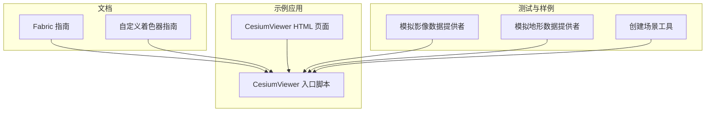
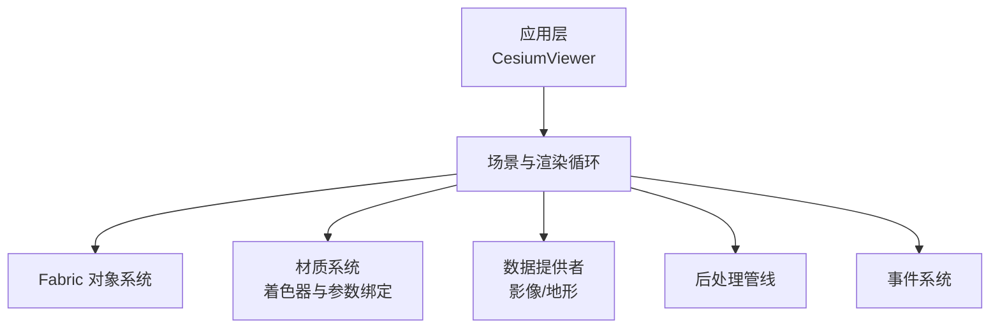
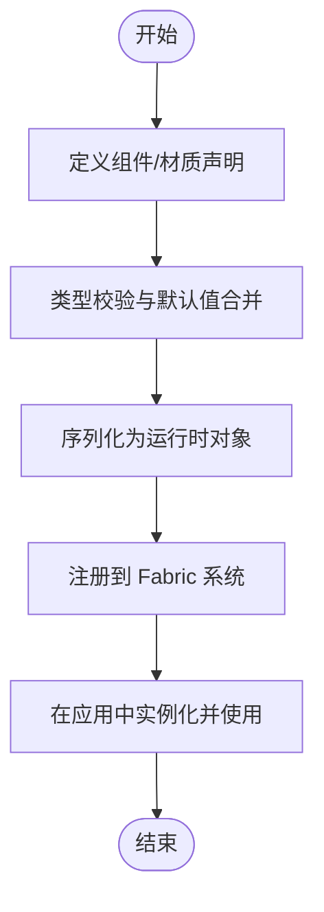
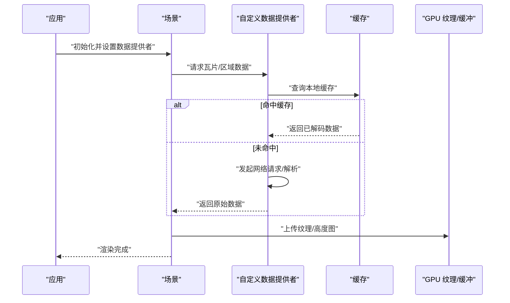
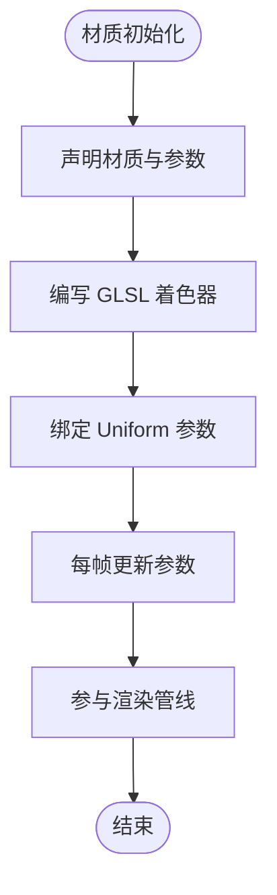
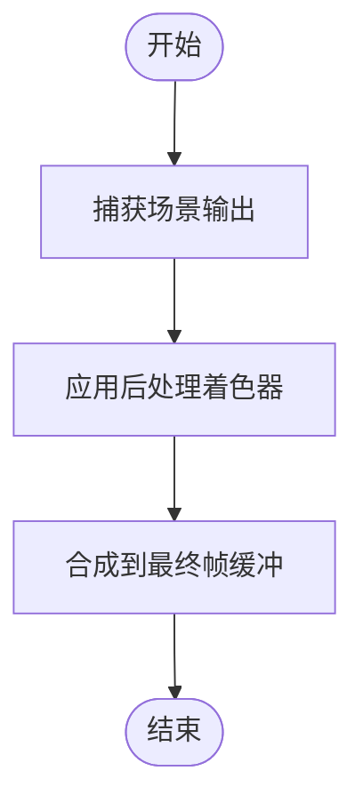
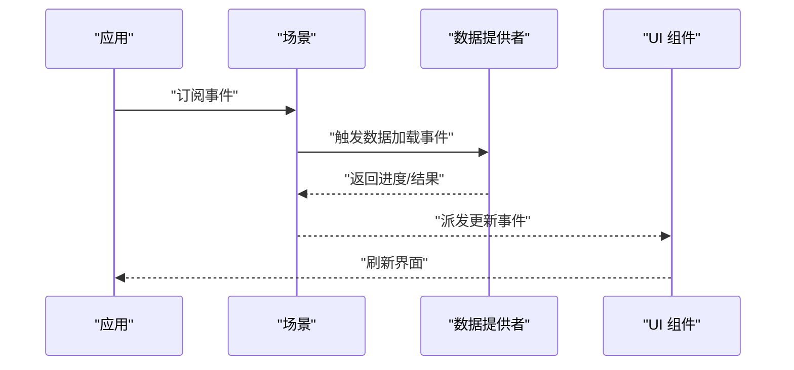
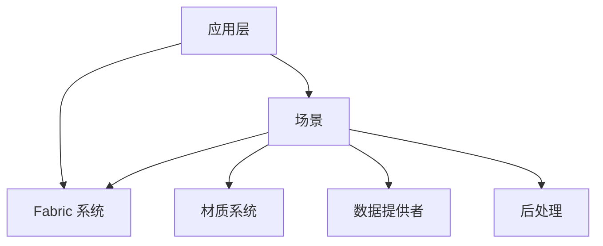

# 扩展开发

<cite>
**本文引用的文件**   
- [README.md](file://README.md)
- [Documentation/CustomShaderGuide/README.md](file://Documentation/CustomShaderGuide/README.md)
- [Documentation/FabricGuide/README.md](file://Documentation/FabricGuide/README.md)
- [Apps/CesiumViewer/CesiumViewer.js](file://Apps/CesiumViewer/CesiumViewer.js)
- [Apps/CesiumViewer/index.html](file://Apps/CesiumViewer/index.html)
- [Specs/MockImageryProvider.js](file://Specs/MockImageryProvider.js)
- [Specs/MockTerrainProvider.js](file://Specs/MockTerrainProvider.js)
- [Specs/createScene.js](file://Specs/createScene.js)
</cite>

## 目录
1. [简介](#简介)
2. [项目结构](#项目结构)
3. [核心组件](#核心组件)
4. [架构总览](#架构总览)
5. [详细组件分析](#详细组件分析)
6. [依赖分析](#依赖分析)
7. [性能考虑](#性能考虑)
8. [故障排查指南](#故障排查指南)
9. [结论](#结论)
10. [附录](#附录)

## 简介
本指南面向希望在 Cesium 中进行扩展开发的工程师与研究者，围绕插件化架构、类继承与属性系统、自定义数据提供者、自定义材质（含着色器与参数绑定）、后处理效果、事件系统扩展以及从简单到复杂的渐进式示例展开。文档以仓库中的官方文档与示例为权威来源，帮助读者快速定位扩展点并掌握最佳实践。

## 项目结构
Cesium 仓库采用多包与示例分离的组织方式：
- Source：引擎源码（未在本仓库中直接展示）
- Documentation：官方文档，包括 Fabric 与自定义着色器指南
- Apps：示例应用，如 CesiumViewer
- Specs：测试与样例实现，包含模拟的数据提供者与场景创建工具
- packages：子包（engine、sandcastle、widgets）

下图给出与本指南相关的顶层结构与角色划分：

图表来源
- [Documentation/FabricGuide/README.md](file://Documentation/FabricGuide/README.md)
- [Documentation/CustomShaderGuide/README.md](file://Documentation/CustomShaderGuide/README.md)
- [Apps/CesiumViewer/CesiumViewer.js](file://Apps/CesiumViewer/CesiumViewer.js)
- [Apps/CesiumViewer/index.html](file://Apps/CesiumViewer/index.html)
- [Specs/MockImageryProvider.js](file://Specs/MockImageryProvider.js)
- [Specs/MockTerrainProvider.js](file://Specs/MockTerrainProvider.js)
- [Specs/createScene.js](file://Specs/createScene.js)

章节来源
- [README.md](file://README.md)
- [Documentation/FabricGuide/README.md](file://Documentation/FabricGuide/README.md)
- [Documentation/CustomShaderGuide/README.md](file://Documentation/CustomShaderGuide/README.md)
- [Apps/CesiumViewer/CesiumViewer.js](file://Apps/CesiumViewer/CesiumViewer.js)
- [Apps/CesiumViewer/index.html](file://Apps/CesiumViewer/index.html)
- [Specs/MockImageryProvider.js](file://Specs/MockImageryProvider.js)
- [Specs/MockTerrainProvider.js](file://Specs/MockTerrainProvider.js)
- [Specs/createScene.js](file://Specs/createScene.js)

## 核心组件
本节聚焦扩展开发的关键能力与扩展点：
- 类系统与属性定义机制：通过 Fabric 体系进行声明式对象构建与属性管理
- 自定义数据提供者：实现影像与地形提供者的接口契约，完成注册与使用
- 自定义材质：基于 Fabric 与着色器管线，编写 GLSL 片段/顶点着色器并绑定 Uniform
- 后处理效果：在渲染管线中插入后处理阶段，实现全局视觉增强
- 事件系统：监听与分发关键生命周期事件，驱动交互与状态同步

章节来源
- [Documentation/FabricGuide/README.md](file://Documentation/FabricGuide/README.md)
- [Documentation/CustomShaderGuide/README.md](file://Documentation/CustomShaderGuide/README.md)
- [Specs/MockImageryProvider.js](file://Specs/MockImageryProvider.js)
- [Specs/MockTerrainProvider.js](file://Specs/MockTerrainProvider.js)
- [Specs/createScene.js](file://Specs/createScene.js)

## 架构总览
下图展示了扩展点在 Cesium 渲染与数据流中的位置关系：

图表来源
- [Apps/CesiumViewer/CesiumViewer.js](file://Apps/CesiumViewer/CesiumViewer.js)
- [Documentation/FabricGuide/README.md](file://Documentation/FabricGuide/README.md)
- [Documentation/CustomShaderGuide/README.md](file://Documentation/CustomShaderGuide/README.md)
- [Specs/MockImageryProvider.js](file://Specs/MockImageryProvider.js)
- [Specs/MockTerrainProvider.js](file://Specs/MockTerrainProvider.js)
- [Specs/createScene.js](file://Specs/createScene.js)

## 详细组件分析

### 类系统与属性定义（Fabric）
- 设计要点
  - 使用 Fabric 的组件/材质声明式语法定义对象结构与默认值
  - 通过类型校验、序列化与反序列化支持配置持久化
  - 利用继承与组合复用已有组件，减少样板代码
- 扩展步骤
  - 参考 Fabric 指南了解组件模型与属性系统
  - 在应用中通过 Fabric 注册新组件或材质
  - 在渲染前将配置转换为运行时对象，供渲染管线消费
- 典型流程（概念图）

章节来源
- [Documentation/FabricGuide/README.md](file://Documentation/FabricGuide/README.md)

### 自定义数据提供者（影像与地形）
- 目标
  - 实现统一的影像/地形数据加载接口，使 Cesium 能按需请求瓦片或区域数据
- 关键职责
  - 计算可见性与请求队列
  - 解析远程资源并返回纹理/高度图
  - 处理缓存、错误重试与降级策略
- 参考实现
  - 使用 Specs 中的 Mock 提供者作为最小可用实现模板
- 注册与使用
  - 在场景初始化时注入自定义提供者
  - 通过 Viewer 或 Scene API 切换/叠加不同数据源

章节来源
- [Specs/MockImageryProvider.js](file://Specs/MockImageryProvider.js)
- [Specs/MockTerrainProvider.js](file://Specs/MockTerrainProvider.js)
- [Specs/createScene.js](file://Specs/createScene.js)

### 自定义材质（着色器与参数绑定）
- 设计要点
  - 使用 Fabric 材质声明描述输入属性与 Uniform
  - 编写 GLSL 片段/顶点着色器实现视觉效果
  - 将运行时参数映射到着色器 Uniform，确保每帧更新
- 开发步骤
  - 依据自定义着色器指南准备着色器代码
  - 在 Fabric 中声明材质类型与参数
  - 在渲染前将参数写入 GPU 缓冲区
- 参数绑定流程（概念图）

章节来源
- [Documentation/CustomShaderGuide/README.md](file://Documentation/CustomShaderGuide/README.md)
- [Documentation/FabricGuide/README.md](file://Documentation/FabricGuide/README.md)

### 后处理效果
- 原理
  - 在场景渲染完成后对全屏图像执行额外着色器处理，实现模糊、色调映射、景深等效果
- 开发步骤
  - 在后处理阶段注册新的 Pass
  - 编写全屏四边形与对应着色器
  - 将输入输出纹理链接至渲染目标
- 流程示意（概念图）

[本节为概念性说明，不直接分析具体文件]

### 事件系统扩展
- 作用
  - 监听场景生命周期、用户交互与数据加载事件，驱动 UI 与业务逻辑
- 使用方法
  - 在应用初始化时订阅关键事件
  - 在数据提供者与渲染管线中触发相应事件
- 交互时序（概念图）

[本节为概念性说明，不直接分析具体文件]

### 渐进式扩展示例
- 入门级：在 CesiumViewer 中启用一个自定义材质
  - 在 HTML 页面引入应用脚本
  - 在应用脚本中通过 Fabric 注册材质并在场景中应用
- 进阶级：接入自定义影像/地形数据源
  - 参考 Mock 提供者实现最小可用版本
  - 在场景初始化时替换默认提供者
- 高级级：集成后处理与事件联动
  - 在后处理阶段添加自定义 Pass
  - 通过事件系统协调 UI 与渲染状态

章节来源
- [Apps/CesiumViewer/index.html](file://Apps/CesiumViewer/index.html)
- [Apps/CesiumViewer/CesiumViewer.js](file://Apps/CesiumViewer/CesiumViewer.js)
- [Specs/MockImageryProvider.js](file://Specs/MockImageryProvider.js)
- [Specs/MockTerrainProvider.js](file://Specs/MockTerrainProvider.js)
- [Specs/createScene.js](file://Specs/createScene.js)

## 依赖分析
- 模块耦合
  - 应用层依赖 Fabric 与材质系统
  - 数据提供者与场景解耦，通过统一接口通信
  - 后处理与渲染管线松耦合，按 Pass 顺序执行
- 外部依赖
  - 浏览器 WebGL/WebGL2 环境
  - 网络资源访问（影像/地形服务）
- 潜在风险
  - 循环依赖应避免，尽量通过事件与回调解耦
  - 大纹理与频繁上传需关注内存与带宽

图表来源
- [Apps/CesiumViewer/CesiumViewer.js](file://Apps/CesiumViewer/CesiumViewer.js)
- [Documentation/FabricGuide/README.md](file://Documentation/FabricGuide/README.md)
- [Documentation/CustomShaderGuide/README.md](file://Documentation/CustomShaderGuide/README.md)
- [Specs/MockImageryProvider.js](file://Specs/MockImageryProvider.js)
- [Specs/MockTerrainProvider.js](file://Specs/MockTerrainProvider.js)
- [Specs/createScene.js](file://Specs/createScene.js)

章节来源
- [Apps/CesiumViewer/CesiumViewer.js](file://Apps/CesiumViewer/CesiumViewer.js)
- [Documentation/FabricGuide/README.md](file://Documentation/FabricGuide/README.md)
- [Documentation/CustomShaderGuide/README.md](file://Documentation/CustomShaderGuide/README.md)
- [Specs/MockImageryProvider.js](file://Specs/MockImageryProvider.js)
- [Specs/MockTerrainProvider.js](file://Specs/MockTerrainProvider.js)
- [Specs/createScene.js](file://Specs/createScene.js)

## 性能考虑
- 纹理与几何体
  - 合理选择分辨率与压缩格式，避免重复上传
  - 使用批处理与实例化减少绘制调用
- 数据提供者
  - 实现多级缓存与增量更新
  - 控制并发请求数量，避免雪崩
- 材质与着色器
  - 减少复杂分支与高精度运算
  - 批量更新 Uniform，降低 CPU-GPU 同步开销
- 后处理
  - 限制 Pass 数量与分辨率缩放
  - 复用中间缓冲，避免频繁分配

[本节提供通用指导，不直接分析具体文件]

## 故障排查指南
- 常见问题
  - 材质参数未生效：检查 Fabric 声明与 Uniform 绑定路径
  - 数据提供者无响应：确认 URL、跨域与协议一致性
  - 后处理黑屏：验证输入输出纹理尺寸与采样器绑定
- 调试建议
  - 使用控制台日志与断点定位事件触发链
  - 借助浏览器开发者工具查看 GPU 资源占用
  - 逐步简化材质与 Pass，隔离问题范围

章节来源
- [Specs/MockImageryProvider.js](file://Specs/MockImageryProvider.js)
- [Specs/MockTerrainProvider.js](file://Specs/MockTerrainProvider.js)
- [Specs/createScene.js](file://Specs/createScene.js)

## 结论
通过 Fabric 对象系统、数据提供者接口、材质与着色器管线、后处理与事件系统的协同，Cesium 提供了强大的扩展能力。遵循本文档的架构与流程，开发者可以高效地实现从简单插件到复杂模块的渐进式扩展，并确保性能与可维护性。

[本节为总结性内容，不直接分析具体文件]

## 附录
- 相关文档
  - Fabric 指南：用于理解组件与材质声明式建模
  - 自定义着色器指南：用于编写与绑定 GLSL 着色器
- 示例入口
  - CesiumViewer 应用：演示如何在实际项目中集成扩展

章节来源
- [Documentation/FabricGuide/README.md](file://Documentation/FabricGuide/README.md)
- [Documentation/CustomShaderGuide/README.md](file://Documentation/CustomShaderGuide/README.md)
- [Apps/CesiumViewer/index.html](file://Apps/CesiumViewer/index.html)
- [Apps/CesiumViewer/CesiumViewer.js](file://Apps/CesiumViewer/CesiumViewer.js)