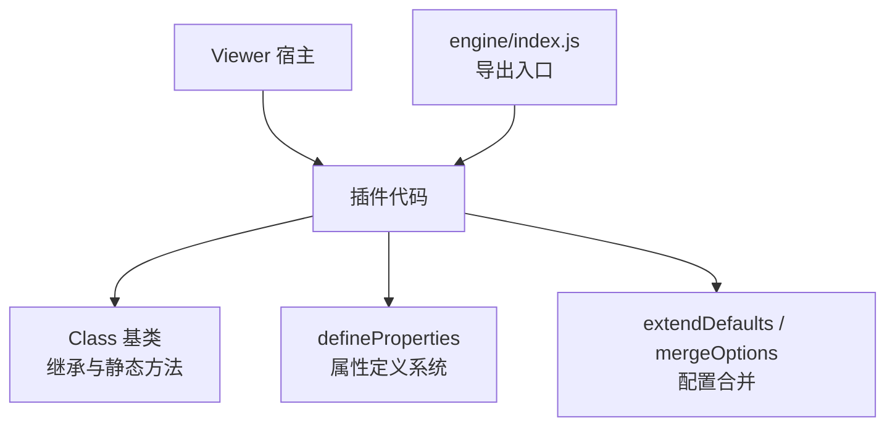
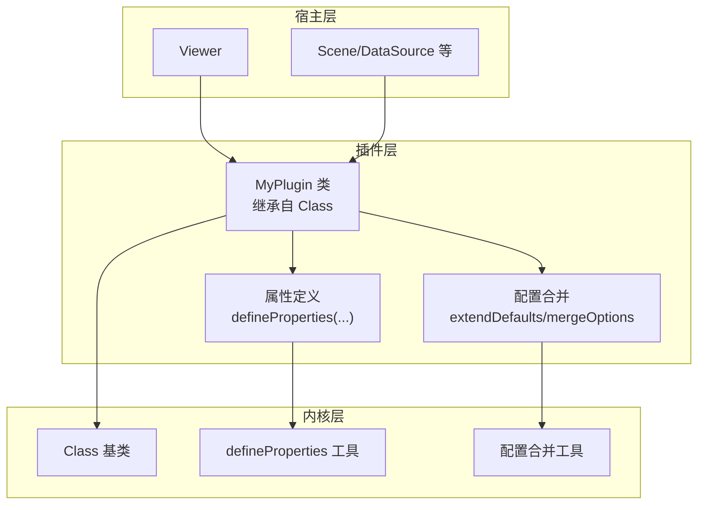
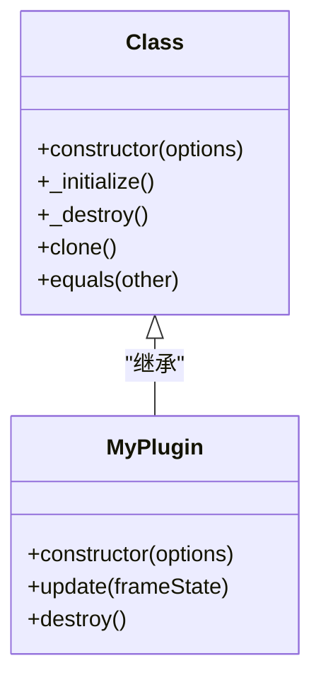
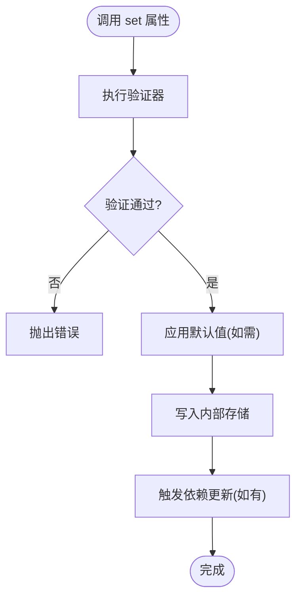
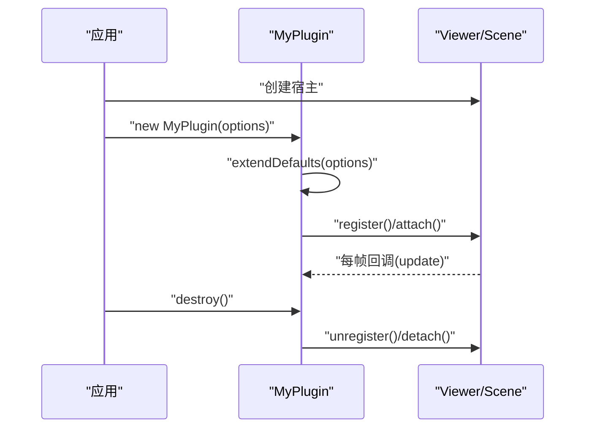
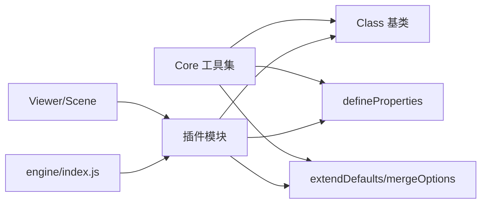

# 插件架构设计

<cite>
**本文引用的文件**   
- [Class.js](file://Source/Core/Class.js)
- [defineProperties.js](file://Source/Core/defineProperties.js)
- [extendDefaults.js](file://Source/Core/extendDefaults.js)
- [mergeOptions.js](file://Source/Core/mergeOptions.js)
- [Viewer.js](file://Source/Widgets/Viewer/Viewer.js)
- [index.js](file://packages/engine/index.js)
</cite>

## 目录
1. [简介](#简介)
2. [项目结构](#项目结构)
3. [核心组件](#核心组件)
4. [架构总览](#架构总览)
5. [详细组件分析](#详细组件分析)
6. [依赖关系分析](#依赖关系分析)
7. [性能考量](#性能考量)
8. [故障排查指南](#故障排查指南)
9. [结论](#结论)
10. [附录](#附录)

## 简介
本文件面向Cesium插件开发者，系统化阐述Cesium的类继承系统与对象模型，重点解析Class基类的核心机制与属性定义系统（defineProperties），并给出从简单工具函数到复杂功能模块的渐进式开发模板。文档同时覆盖插件注册、依赖管理与版本兼容性处理的最佳实践，帮助读者在保持与Cesium内核一致性的前提下，构建可维护、可扩展的插件体系。

## 项目结构
Cesium的核心类型系统与扩展能力集中在Source/Core目录中，其中：
- Class.js：提供统一的类创建与继承机制，支持静态方法继承、原型链扩展与生命周期钩子。
- defineProperties.js：声明式属性定义系统，统一实现getter/setter、默认值、验证与只读控制。
- extendDefaults.js / mergeOptions.js：配置合并与默认值扩展工具，用于插件选项的统一管理。
- Viewer.js：UI层入口，展示插件如何与宿主环境集成。
- packages/engine/index.js：引擎导出入口，便于插件按需引入与打包优化。

图表来源
- [Class.js](file://Source/Core/Class.js)
- [defineProperties.js](file://Source/Core/defineProperties.js)
- [extendDefaults.js](file://Source/Core/extendDefaults.js)
- [mergeOptions.js](file://Source/Core/mergeOptions.js)
- [Viewer.js](file://Source/Widgets/Viewer/Viewer.js)
- [index.js](file://packages/engine/index.js)

章节来源
- [Class.js](file://Source/Core/Class.js)
- [defineProperties.js](file://Source/Core/defineProperties.js)
- [extendDefaults.js](file://Source/Core/extendDefaults.js)
- [mergeOptions.js](file://Source/Core/mergeOptions.js)
- [Viewer.js](file://Source/Widgets/Viewer/Viewer.js)
- [index.js](file://packages/engine/index.js)

## 核心组件
- Class 基类
  - 作用：统一类创建、继承、静态方法复制、构造器调用顺序与可选的生命周期钩子。
  - 关键点：子类构造函数需显式调用父类构造；静态方法通过工具复制至子类；支持在构造前后注入逻辑。
- defineProperties 属性系统
  - 作用：以声明式方式为实例添加受控属性，自动装配getter/setter、默认值、验证规则与只读标记。
  - 关键点：属性描述对象包含类型、默认值、验证器、是否只读等元信息；运行时按描述生成访问器。
- 配置合并工具
  - extendDefaults：将用户传入的配置与内置默认值合并，保证向后兼容与最小侵入。
  - mergeOptions：通用深/浅合并策略，供不同场景选择。
- 宿主与导出
  - Viewer：作为UI宿主，演示插件如何挂载到场景或控件树。
  - engine/index.js：集中导出核心API，便于插件按需引用与Tree Shaking。

章节来源
- [Class.js](file://Source/Core/Class.js)
- [defineProperties.js](file://Source/Core/defineProperties.js)
- [extendDefaults.js](file://Source/Core/extendDefaults.js)
- [mergeOptions.js](file://Source/Core/mergeOptions.js)
- [Viewer.js](file://Source/Widgets/Viewer/Viewer.js)
- [index.js](file://packages/engine/index.js)

## 架构总览
下图展示了插件在Cesium中的典型位置与交互路径：插件通过Class继承获得一致的构造与静态行为，使用defineProperties暴露稳定API，借助配置合并工具管理选项，最终挂载到Viewer或Scene等宿主对象上。

图表来源
- [Class.js](file://Source/Core/Class.js)
- [defineProperties.js](file://Source/Core/defineProperties.js)
- [extendDefaults.js](file://Source/Core/extendDefaults.js)
- [mergeOptions.js](file://Source/Core/mergeOptions.js)
- [Viewer.js](file://Source/Widgets/Viewer/Viewer.js)

## 详细组件分析

### Class 基类与继承模式
- 继承要点
  - 子类必须在其构造函数中调用父类构造，以确保父类初始化逻辑执行。
  - 静态方法可通过工具复制到子类，避免重复实现。
  - 若需要扩展构造流程，可在子类构造前后插入自定义逻辑。
- 最佳实践
  - 将公共静态方法放在基类中并通过工具复制，减少样板代码。
  - 对构造参数进行严格校验，尽早失败，避免后续状态不一致。
  - 为关键生命周期（如初始化、销毁）预留钩子，便于插件组合。

图表来源
- [Class.js](file://Source/Core/Class.js)

章节来源
- [Class.js](file://Source/Core/Class.js)

### defineProperties 属性定义系统
- 属性描述对象的关键字段
  - 名称：属性名。
  - 类型：期望的数据类型或自定义校验器。
  - 默认值：未提供时的初始值。
  - 只读：是否允许外部修改。
  - 验证器：自定义校验逻辑，返回布尔或抛出错误。
- 运行时行为
  - 根据描述动态为实例装配getter/setter。
  - 设置时触发验证与默认值填充。
  - 支持派生属性（由其他属性计算得出）。
- 最佳实践
  - 优先使用类型与默认值约束，减少手动校验。
  - 对敏感属性启用只读，防止意外篡改。
  - 将复杂校验封装为独立函数，提升可读性与复用性。

图表来源
- [defineProperties.js](file://Source/Core/defineProperties.js)

章节来源
- [defineProperties.js](file://Source/Core/defineProperties.js)

### 配置合并与默认值扩展
- extendDefaults
  - 将用户配置与内置默认值合并，确保新增字段不会破坏旧版用法。
  - 适合“渐进增强”的API演进策略。
- mergeOptions
  - 提供灵活的合并策略（深/浅），适用于不同层级对象的合并需求。
- 建议
  - 在插件入口处统一合并配置，对外暴露稳定的options接口。
  - 对必填项进行前置校验，并提供清晰的错误提示。

章节来源
- [extendDefaults.js](file://Source/Core/extendDefaults.js)
- [mergeOptions.js](file://Source/Core/mergeOptions.js)

### 插件与宿主的集成
- 挂载点
  - 将插件实例添加到Viewer或Scene，使其参与渲染或事件循环。
- 生命周期
  - 初始化阶段：读取配置、建立资源、注册回调。
  - 运行阶段：每帧更新、响应事件、与场景交互。
  - 销毁阶段：释放资源、解绑事件、清理引用。
- 示例流程（概念图）

图表来源
- [Viewer.js](file://Source/Widgets/Viewer/Viewer.js)

章节来源
- [Viewer.js](file://Source/Widgets/Viewer/Viewer.js)

### 插件开发模板（渐进式）
- 步骤一：工具函数
  - 目标：无状态、纯函数、易测试。
  - 组织：按领域拆分模块，避免全局污染。
- 步骤二：轻量插件
  - 目标：基于Class继承，提供基础生命周期与配置合并。
  - 要点：明确输入输出，做好错误边界。
- 步骤三：完整插件
  - 目标：使用defineProperties暴露受控API，与宿主深度集成。
  - 要点：资源管理、事件总线、版本兼容与降级策略。
- 步骤四：发布与集成
  - 目标：通过engine/index.js按需导出，配合构建工具做Tree Shaking。
  - 要点：语义化版本、变更日志、向后兼容矩阵。

[本节为概念性指导，不直接分析具体文件]

## 依赖关系分析
- 组件耦合
  - 插件强依赖Class与defineProperties，弱依赖宿主（Viewer/Scene）。
  - 配置合并工具被多处复用，属于横切关注点。
- 外部依赖
  - 引擎导出入口集中管理，利于按需加载与版本对齐。
- 潜在风险
  - 过度依赖宿主内部实现可能导致升级脆弱性。
  - 属性过多且相互依赖会增加复杂度，应分层抽象。

图表来源
- [Class.js](file://Source/Core/Class.js)
- [defineProperties.js](file://Source/Core/defineProperties.js)
- [extendDefaults.js](file://Source/Core/extendDefaults.js)
- [mergeOptions.js](file://Source/Core/mergeOptions.js)
- [Viewer.js](file://Source/Widgets/Viewer/Viewer.js)
- [index.js](file://packages/engine/index.js)

章节来源
- [Class.js](file://Source/Core/Class.js)
- [defineProperties.js](file://Source/Core/defineProperties.js)
- [extendDefaults.js](file://Source/Core/extendDefaults.js)
- [mergeOptions.js](file://Source/Core/mergeOptions.js)
- [Viewer.js](file://Source/Widgets/Viewer/Viewer.js)
- [index.js](file://packages/engine/index.js)

## 性能考量
- 属性访问
  - 合理使用只读与缓存，避免频繁setter触发重算。
- 构造开销
  - 延迟初始化昂贵资源，按需加载。
- 合并成本
  - 大对象合并尽量使用浅合并或增量更新策略。
- 宿主交互
  - 减少每帧操作，批量更新，避免阻塞主线程。

[本节提供通用指导，不直接分析具体文件]

## 故障排查指南
- 常见问题
  - 构造顺序错误：子类未正确调用父类构造导致状态缺失。
  - 属性验证失败：类型或范围不符合预期，检查默认值与验证器。
  - 配置冲突：同名键覆盖导致行为异常，确认合并策略与优先级。
  - 资源泄漏：未正确销毁导致内存增长，检查destroy流程。
- 定位技巧
  - 在关键路径打印配置快照与属性变化。
  - 使用最小复现用例隔离问题。
  - 对比宿主版本与插件兼容矩阵。

章节来源
- [Class.js](file://Source/Core/Class.js)
- [defineProperties.js](file://Source/Core/defineProperties.js)
- [extendDefaults.js](file://Source/Core/extendDefaults.js)
- [mergeOptions.js](file://Source/Core/mergeOptions.js)

## 结论
通过统一继承机制与声明式属性系统，Cesium为插件生态提供了稳定而强大的扩展底座。遵循本文的架构与最佳实践，可以在保持与内核一致性的同时，快速构建高质量、可维护的插件。建议在迭代过程中持续完善配置合并策略、版本兼容矩阵与性能基准，确保插件长期可用。

[本节为总结性内容，不直接分析具体文件]

## 附录
- 术语
  - 插件：基于Cesium扩展能力的独立功能模块。
  - 宿主：承载插件运行的环境，如Viewer或Scene。
  - 属性系统：基于defineProperties的受控属性集合。
- 参考入口
  - 引擎导出：packages/engine/index.js
  - UI宿主：Widgets/Viewer/Viewer.js
  - 核心工具：Source/Core/*

[本节为补充说明，不直接分析具体文件]