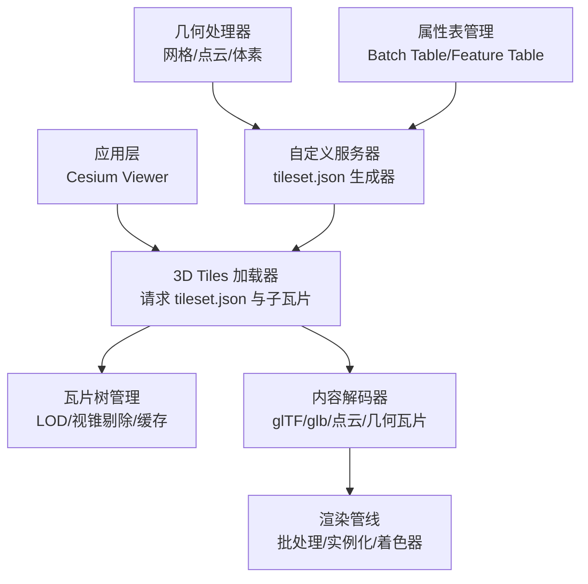
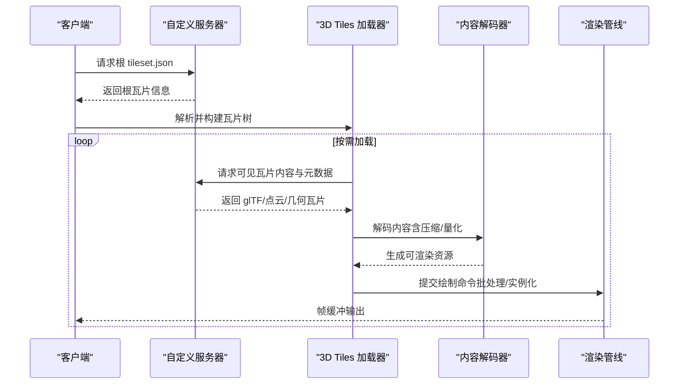
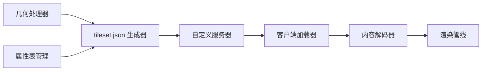

# 自定义3D Tiles提供者

<cite>
**本文引用的文件**   
- [Apps/SampleData/Cesium3DTiles/Tilesets/Tileset/tileset.json](file://Apps/SampleData/Cesium3DTiles/Tilesets/Tileset/tileset.json)
- [Apps/SampleData/Cesium3DTiles/PointCloud/PointCloudRGB/tileset.json](file://Apps/SampleData/Cesium3DTiles/PointCloud/PointCloudRGB/tileset.json)
- [Apps/SampleData/Cesium3DTiles/Batched/BatchedWithBatchTable/tileset.json](file://Apps/SampleData/Cesium3DTiles/Batched/BatchedWithBatchTable/tileset.json)
- [Apps/SampleData/Cesium3DTiles/Instanced/InstancedWithBatchTable/tileset.json](file://Apps/SampleData/Cesium3DTiles/Instanced/InstancedWithBatchTable/tileset.json)
- [Apps/SampleData/Cesium3DTiles/Implicit/ImplicitRoot/tileset.json](file://Apps/SampleData/Cesium3DTiles/Implicit/ImplicitRoot/tileset.json)
- [Apps/SampleData/Cesium3DTiles/Style/style.json](file://Apps/SampleData/Cesium3DTiles/Style/style.json)
- [Apps/SampleData/Cesium3DTiles/PointCloud/PointCloudTimeDynamic/tileset.json](file://Apps/SampleData/Cesium3DTiles/PointCloud/PointCloudTimeDynamic/tileset.json)
- [Specs/Data/Cesium3DTiles/Tilesets/Tileset/tileset.json](file://Specs/Data/Cesium3DTiles/Tilesets/Tileset/tileset.json)
- [Specs/Data/Cesium3DTiles/PointCloud/PointCloudRGB/tileset.json](file://Specs/Data/Cesium3DTiles/PointCloud/PointCloudRGB/tileset.json)
- [Specs/Data/Cesium3DTiles/Batched/BatchedWithBatchTable/tileset.json](file://Specs/Data/Cesium3DTiles/Batched/BatchedWithBatchTable/tileset.json)
- [Specs/Data/Cesium3DTiles/Instanced/InstancedWithBatchTable/tileset.json](file://Specs/Data/Cesium3DTiles/Instanced/InstancedWithBatchTable/tileset.json)
- [Specs/Data/Cesium3DTiles/Implicit/ImplicitRoot/tileset.json](file://Specs/Data/Cesium3DTiles/Implicit/ImplicitRoot/tileset.json)
- [Specs/Data/Cesium3DTiles/Style/style.json](file://Specs/Data/Cesium3DTiles/Style/style.json)
- [Specs/Data/Cesium3DTiles/PointCloud/PointCloudTimeDynamic/tileset.json](file://Specs/Data/Cesium3DTiles/PointCloud/PointCloudTimeDynamic/tileset.json)
</cite>

## 目录
1. [简介](#简介)
2. [项目结构](#项目结构)
3. [核心组件](#核心组件)
4. [架构总览](#架构总览)
5. [详细组件分析](#详细组件分析)
6. [依赖关系分析](#依赖关系分析)
7. [性能考虑](#性能考虑)
8. [故障排除指南](#故障排除指南)
9. [结论](#结论)
10. [附录](#附录)

## 简介
本指南面向希望实现“自定义3D Tiles提供者”的开发者，目标是：
- 理解3D Tiles规范与数据格式（tileset.json、几何组织、元数据）
- 掌握服务端生成与客户端加载机制
- 处理点云、批处理模型与实例化渲染的数据流
- 提供tileset.json生成器、几何处理器与属性表管理的实现思路
- 设计LOD策略、视锥剔除与动态加载优化
- 支持时间动态数据、分类渲染与样式化显示
- 给出性能调优与故障排除方法

## 项目结构
仓库中包含大量3D Tiles示例与测试数据，覆盖多种内容类型与特性。对于自定义提供者开发，建议优先参考以下目录：
- Apps/SampleData/Cesium3DTiles：官方示例数据集，包含点云、批处理、实例化、隐式瓦片、样式等
- Specs/Data/Cesium3DTiles：测试用例数据，用于验证解析与渲染行为

图表来源
- [Apps/SampleData/Cesium3DTiles/Tilesets/Tileset/tileset.json](file://Apps/SampleData/Cesium3DTiles/Tilesets/Tileset/tileset.json)
- [Specs/Data/Cesium3DTiles/Tilesets/Tileset/tileset.json](file://Specs/Data/Cesium3DTiles/Tilesets/Tileset/tileset.json)

章节来源
- [Apps/SampleData/Cesium3DTiles/Tilesets/Tileset/tileset.json](file://Apps/SampleData/Cesium3DTiles/Tilesets/Tileset/tileset.json)
- [Specs/Data/Cesium3DTiles/Tilesets/Tileset/tileset.json](file://Specs/Data/Cesium3DTiles/Tilesets/Tileset/tileset.json)

## 核心组件
- tileset.json 根节点：描述瓦片树根、几何误差、边界体积、内容引用、扩展与元数据
- 瓦片节点：递归定义子瓦片、内容URL、几何误差、边界体积、可选显式/隐式子瓦片
- 内容类型：
  - glTF/glB：批处理模型、实例化模型
  - 点云：二进制或Draco压缩的点集
  - 几何瓦片：内置几何（球、椭球、圆柱、盒）
  - 复合瓦片：组合多个内容
- 元数据与属性：
  - Batch Table / Feature Table：属性表与层级
  - 结构化元数据：Schema、Property、Group、Content/Tile/Tileset 级别
- 样式与分类：
  - style.json：基于属性的表达式控制颜色、透明度、大小等
  - 分类：通过属性或类别ID进行分层渲染

章节来源
- [Apps/SampleData/Cesium3DTiles/Tilesets/Tileset/tileset.json](file://Apps/SampleData/Cesium3DTiles/Tilesets/Tileset/tileset.json)
- [Apps/SampleData/Cesium3DTiles/PointCloud/PointCloudRGB/tileset.json](file://Apps/SampleData/Cesium3DTiles/PointCloud/PointCloudRGB/tileset.json)
- [Apps/SampleData/Cesium3DTiles/Batched/BatchedWithBatchTable/tileset.json](file://Apps/SampleData/Cesium3DTiles/Batched/BatchedWithBatchTable/tileset.json)
- [Apps/SampleData/Cesium3DTiles/Instanced/InstancedWithBatchTable/tileset.json](file://Apps/SampleData/Cesium3DTiles/Instanced/InstancedWithBatchTable/tileset.json)
- [Apps/SampleData/Cesium3DTiles/Implicit/ImplicitRoot/tileset.json](file://Apps/SampleData/Cesium3DTiles/Implicit/ImplicitRoot/tileset.json)
- [Apps/SampleData/Cesium3DTiles/Style/style.json](file://Apps/SampleData/Cesium3DTiles/Style/style.json)
- [Apps/SampleData/Cesium3DTiles/PointCloud/PointCloudTimeDynamic/tileset.json](file://Apps/SampleData/Cesium3DTiles/PointCloud/PointCloudTimeDynamic/tileset.json)
- [Specs/Data/Cesium3DTiles/Tilesets/Tileset/tileset.json](file://Specs/Data/Cesium3DTiles/Tilesets/Tileset/tileset.json)
- [Specs/Data/Cesium3DTiles/PointCloud/PointCloudRGB/tileset.json](file://Specs/Data/Cesium3DTiles/PointCloud/PointCloudRGB/tileset.json)
- [Specs/Data/Cesium3DTiles/Batched/BatchedWithBatchTable/tileset.json](file://Specs/Data/Cesium3DTiles/Batched/BatchedWithBatchTable/tileset.json)
- [Specs/Data/Cesium3DTiles/Instanced/InstancedWithBatchTable/tileset.json](file://Specs/Data/Cesium3DTiles/Instanced/InstancedWithBatchTable/tileset.json)
- [Specs/Data/Cesium3DTiles/Implicit/ImplicitRoot/tileset.json](file://Specs/Data/Cesium3DTiles/Implicit/ImplicitRoot/tileset.json)
- [Specs/Data/Cesium3DTiles/Style/style.json](file://Specs/Data/Cesium3DTiles/Style/style.json)
- [Specs/Data/Cesium3DTiles/PointCloud/PointCloudTimeDynamic/tileset.json](file://Specs/Data/Cesium3DTiles/PointCloud/PointCloudTimeDynamic/tileset.json)

## 架构总览
下图展示从自定义服务器到客户端渲染的关键流程：

图表来源
- [Apps/SampleData/Cesium3DTiles/Tilesets/Tileset/tileset.json](file://Apps/SampleData/Cesium3DTiles/Tilesets/Tileset/tileset.json)
- [Specs/Data/Cesium3DTiles/Tilesets/Tileset/tileset.json](file://Specs/Data/Cesium3DTiles/Tilesets/Tileset/tileset.json)

## 详细组件分析

### tileset.json 结构与字段要点
- 根级关键字：
  - asset：版本与作者信息
  - geometricError：根瓦片几何误差阈值
  - boundingVolume：根瓦片边界体积（box/sphere/region）
  - contents：内容数组（glTF/glB/点云/几何瓦片/复合）
  - extensions/extensionsRequired：扩展声明
  - metadata：瓦片集级别的元数据（schema、propertyDefinitions等）
- 瓦片节点关键字：
  - geometricError：子瓦片误差阈值
  - boundingVolume：子瓦片边界体积
  - content：单个内容引用（url/buffer）
  - contents：多个内容引用（复合瓦片）
  - children：子瓦片列表
  - implicitSubdivision：隐式瓦片规则（如四叉树/八叉树）
  - metadata：瓦片级元数据（content/tile 级别）
- 内容关键字（以glTF为例）：
  - url：相对路径或绝对URL
  - batchId：批处理ID（若使用批处理）
  - rtcCenter：RTC中心偏移（大坐标场景）
  - transform：瓦片变换矩阵
- 扩展与元数据：
  - EXT_structured_metadata：结构化元数据
  - EXT_feature_metadata：要素级元数据
  - EXT_instance_features：实例化特征
  - EXT_mesh_gpu_instancing：GPU实例化
  - EXT_draco_point_compression：点云压缩

章节来源
- [Apps/SampleData/Cesium3DTiles/Tilesets/Tileset/tileset.json](file://Apps/SampleData/Cesium3DTiles/Tilesets/Tileset/tileset.json)
- [Specs/Data/Cesium3DTiles/Tilesets/Tileset/tileset.json](file://Specs/Data/Cesium3DTiles/Tilesets/Tileset/tileset.json)

### 几何体组织与数据类型
- 批处理模型（Batched）：
  - 将多个对象合并为单一绘制调用，提升性能
  - 通过batchIds映射顶点/索引到对象
  - 适合静态或低频更新场景
- 实例化模型（Instanced）：
  - 复用同一mesh多次绘制，不同变换/属性
  - 适合重复元素（树木、路灯、车辆）
- 点云（PointCloud）：
  - 支持RGB、法线、量化坐标、Oct编码法线、Draco压缩
  - 支持每点属性（位置、颜色、强度、分类）
- 几何瓦片（Geometry Tile）：
  - 内置基本几何（球、椭球、圆柱、盒），无需外部模型
  - 适合简单可视化与快速原型

章节来源
- [Apps/SampleData/Cesium3DTiles/Batched/BatchedWithBatchTable/tileset.json](file://Apps/SampleData/Cesium3DTiles/Batched/BatchedWithBatchTable/tileset.json)
- [Apps/SampleData/Cesium3DTiles/Instanced/InstancedWithBatchTable/tileset.json](file://Apps/SampleData/Cesium3DTiles/Instanced/InstancedWithBatchTable/tileset.json)
- [Apps/SampleData/Cesium3DTiles/PointCloud/PointCloudRGB/tileset.json](file://Apps/SampleData/Cesium3DTiles/PointCloud/PointCloudRGB/tileset.json)
- [Specs/Data/Cesium3DTiles/Batched/BatchedWithBatchTable/tileset.json](file://Specs/Data/Cesium3DTiles/Batched/BatchedWithBatchTable/tileset.json)
- [Specs/Data/Cesium3DTiles/Instanced/InstancedWithBatchTable/tileset.json](file://Specs/Data/Cesium3DTiles/Instanced/InstancedWithBatchTable/tileset.json)
- [Specs/Data/Cesium3DTiles/PointCloud/PointCloudRGB/tileset.json](file://Specs/Data/Cesium3DTiles/PointCloud/PointCloudRGB/tileset.json)

### 元数据与属性表管理
- Batch Table / Feature Table：
  - 存储对象/要素的属性（名称、类型、时间戳等）
  - 支持标量、向量、纹理属性
- 结构化元数据（EXT_structured_metadata）：
  - Schema定义属性类型、单位、枚举
  - Property/Group/Content/Tile/Tileset 多级元数据
- 实例化特征（EXT_instance_features）：
  - 为每个实例绑定独立属性
- 推荐实践：
  - 在tileset.json中声明metadata.schema与propertyDefinitions
  - 在content/tile节点附加具体元数据
  - 使用属性驱动样式与交互

章节来源
- [Apps/SampleData/Cesium3DTiles/PointCloud/PointCloudWithPerPointProperties/tileset.json](file://Apps/SampleData/Cesium3DTiles/PointCloud/PointCloudWithPerPointProperties/tileset.json)
- [Specs/Data/Cesium3DTiles/PointCloud/PointCloudWithPerPointProperties/tileset.json](file://Specs/Data/Cesium3DTiles/PointCloud/PointCloudWithPerPointProperties/tileset.json)

### 样式化与分类渲染
- style.json：
  - 基于属性的表达式控制颜色、透明度、点大小、线宽等
  - 支持条件分支、数学运算、字符串操作
- 分类渲染：
  - 通过属性值或类别ID进行分层显示
  - 结合元数据实现动态筛选与高亮

章节来源
- [Apps/SampleData/Cesium3DTiles/Style/style.json](file://Apps/SampleData/Cesium3DTiles/Style/style.json)
- [Specs/Data/Cesium3DTiles/Style/style.json](file://Specs/Data/Cesium3DTiles/Style/style.json)

### 时间动态数据
- 时间序列属性：
  - 在属性表中定义时间范围与采样间隔
  - 客户端按当前时间插值或切换关键帧
- 点云时间动态：
  - 多帧点云数据，支持增量更新
  - 适合交通流、气象变化等场景

章节来源
- [Apps/SampleData/Cesium3DTiles/PointCloud/PointCloudTimeDynamic/tileset.json](file://Apps/SampleData/Cesium3DTiles/PointCloud/PointCloudTimeDynamic/tileset.json)
- [Specs/Data/Cesium3DTiles/PointCloud/PointCloudTimeDynamic/tileset.json](file://Specs/Data/Cesium3DTiles/PointCloud/PointCloudTimeDynamic/tileset.json)

### 隐式瓦片与生成器
- 隐式瓦片（Implicit Tiling）：
  - 不显式列出子瓦片，通过规则（四叉树/八叉树）动态生成
  - 降低tileset.json体积，提高可扩展性
- 生成器职责：
  - 根据视距/分辨率计算几何误差
  - 生成边界体积与内容URL
  - 维护元数据与属性表一致性

章节来源
- [Apps/SampleData/Cesium3DTiles/Implicit/ImplicitRoot/tileset.json](file://Apps/SampleData/Cesium3DTiles/Implicit/ImplicitRoot/tileset.json)
- [Specs/Data/Cesium3DTiles/Implicit/ImplicitRoot/tileset.json](file://Specs/Data/Cesium3DTiles/Implicit/ImplicitRoot/tileset.json)

## 依赖关系分析
- 服务端依赖：
  - 几何处理器：网格/点云/体素转换与压缩
  - 属性表管理器：Batch Table/Feature Table构建与维护
  - tileset.json生成器：瓦片树构建、元数据注入、扩展声明
- 客户端依赖：
  - 3D Tiles加载器：解析tileset.json、调度网络请求
  - 内容解码器：glTF/点云/几何瓦片解码
  - 渲染管线：批处理/实例化/着色器优化

图表来源
- [Apps/SampleData/Cesium3DTiles/Tilesets/Tileset/tileset.json](file://Apps/SampleData/Cesium3DTiles/Tilesets/Tileset/tileset.json)
- [Specs/Data/Cesium3DTiles/Tilesets/Tileset/tileset.json](file://Specs/Data/Cesium3DTiles/Tilesets/Tileset/tileset.json)

## 性能考虑
- LOD策略：
  - 合理设置geometricError，避免过度细分
  - 使用隐式瓦片减少元数据开销
- 视锥剔除：
  - 利用boundingVolume快速判断可见性
  - 结合viewerRequestVolume优化加载区域
- 动态加载：
  - 延迟加载非关键内容
  - 预取相邻瓦片提升流畅度
- 压缩与量化：
  - 点云使用Draco/Oct编码
  - 坐标量化减少内存占用
- 批处理与实例化：
  - 合并静态对象减少绘制调用
  - 复用mesh与材质提升GPU效率

[本节为通用指导，不涉及具体文件分析]

## 故障排除指南
- tileset.json解析失败：
  - 检查必填字段（asset、geometricError、boundingVolume、contents/children）
  - 确认扩展声明与实际使用一致
- 内容加载错误：
  - 验证URL路径与MIME类型
  - 检查压缩格式（Draco/KTX2）是否受支持
- 渲染异常：
  - 确认batchIds/instanceIds与属性表对齐
  - 检查transform与rtcCenter是否正确
- 性能问题：
  - 监控瓦片数量与绘制调用次数
  - 调整LOD阈值与视锥参数

章节来源
- [Apps/SampleData/Cesium3DTiles/Tilesets/Tileset/tileset.json](file://Apps/SampleData/Cesium3DTiles/Tilesets/Tileset/tileset.json)
- [Specs/Data/Cesium3DTiles/Tilesets/Tileset/tileset.json](file://Specs/Data/Cesium3DTiles/Tilesets/Tileset/tileset.json)

## 结论
通过本指南，开发者可以：
- 理解3D Tiles规范与数据格式
- 实现自定义服务器端生成与客户端加载
- 处理点云、批处理与实例化渲染
- 设计高效LOD与动态加载策略
- 支持时间动态、分类与样式化显示
- 进行性能调优与故障排除

[本节为总结，不涉及具体文件分析]

## 附录
- 参考示例：
  - Apps/SampleData/Cesium3DTiles：丰富示例数据集
  - Specs/Data/Cesium3DTiles：测试用例与边界情况
- 最佳实践清单：
  - 明确元数据Schema与属性定义
  - 合理使用扩展与压缩格式
  - 持续监控性能指标并迭代优化

[本节为补充信息，不涉及具体文件分析]