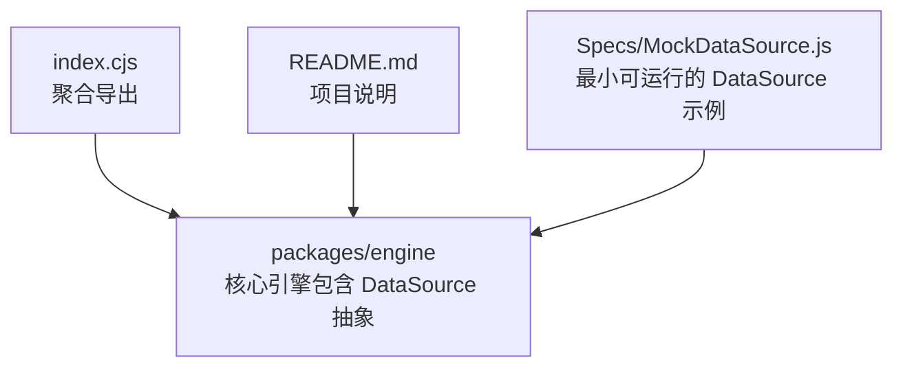
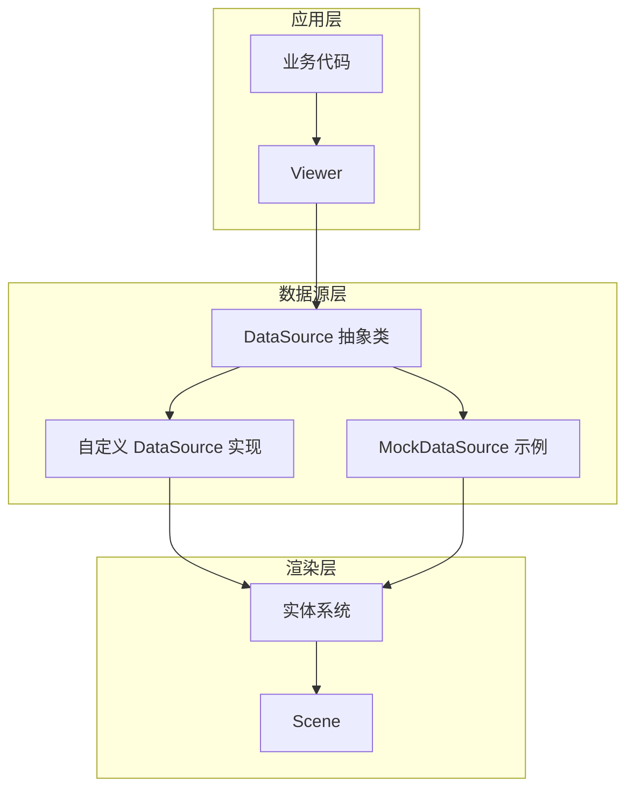
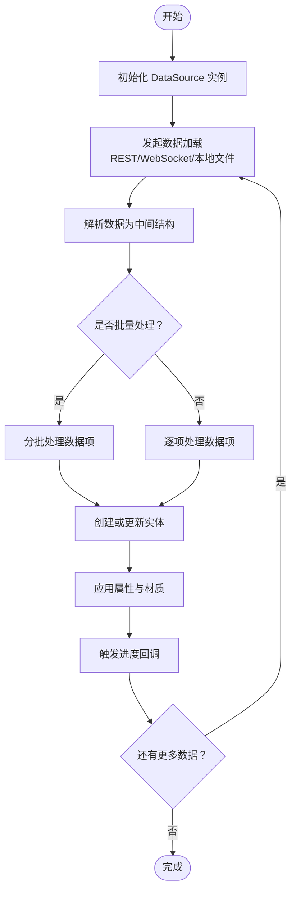
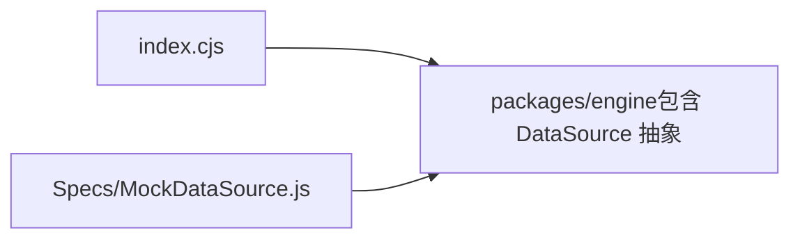

# 自定义DataSource提供者

<cite>
**本文引用的文件**   
- [README.md](file://README.md)
- [index.cjs](file://index.cjs)
- [MockDataSource.js](file://Specs/MockDataSource.js)
</cite>

## 目录
1. [简介](#简介)
2. [项目结构](#项目结构)
3. [核心组件](#核心组件)
4. [架构总览](#架构总览)
5. [详细组件分析](#详细组件分析)
6. [依赖分析](#依赖分析)
7. [性能考虑](#性能考虑)
8. [故障排查指南](#故障排查指南)
9. [结论](#结论)
10. [附录](#附录)

## 简介
本指南面向希望为 CesiumJS 实现自定义 DataSource 提供者的开发者。内容围绕 DataSource 抽象类的设计与实现原理，系统阐述数据加载生命周期、实体管理系统与属性更新机制；并给出异步数据加载、错误处理与进度回调的实现要点。同时覆盖实体的创建、更新与销毁流程（含几何体生成、材质应用与动画支持），并提供从 REST API、WebSocket 或本地文件加载数据并转换为 Cesium 实体的完整示例路径。最后总结批量处理、缓存策略与内存管理等性能优化实践。

## 项目结构
仓库采用多包组织方式，核心引擎位于 packages/engine，示例与测试位于 Apps 与 Specs 等目录。对于自定义 DataSource 开发，重点参考：
- 入口与导出：index.cjs 用于聚合导出模块，便于定位 DataSource 相关类型与工具。
- 文档说明：README.md 提供项目概览与构建/运行指引。
- 参考实现：Specs/MockDataSource.js 提供了最小可用的 DataSource 实现样例，可作为自定义实现的模板。

图表来源
- [index.cjs:1-200](file://index.cjs#L1-L200)
- [README.md:1-200](file://README.md#L1-L200)
- [MockDataSource.js:1-200](file://Specs/MockDataSource.js#L1-L200)

章节来源
- [README.md:1-200](file://README.md#L1-L200)
- [index.cjs:1-200](file://index.cjs#L1-L200)

## 核心组件
- DataSource 抽象类
  - 职责：封装“数据源”的通用能力，包括加载生命周期管理、实体集合维护、属性变更通知、可见性与时间范围控制等。
  - 关键概念：
    - 加载生命周期：初始化、开始加载、增量更新、完成、销毁。
    - 实体管理：添加、更新、移除实体；实体 ID 唯一性；父子层级关系。
    - 属性更新：通过属性对象驱动可视化变化（位置、颜色、透明度、模型姿态等）。
- MockDataSource 示例
  - 作用：演示如何继承 DataSource 抽象类，实现最简的数据加载与实体管理流程，供扩展参考。

章节来源
- [MockDataSource.js:1-200](file://Specs/MockDataSource.js#L1-L200)

## 架构总览
下图展示了自定义 DataSource 在 Cesium 中的典型交互关系：应用层通过 Viewer 管理多个 DataSource；每个 DataSource 负责将外部数据转换为 Cesium 实体，并在需要时触发渲染更新。

图表来源
- [index.cjs:1-200](file://index.cjs#L1-L200)
- [MockDataSource.js:1-200](file://Specs/MockDataSource.js#L1-L200)

## 详细组件分析

### DataSource 抽象类设计与实现原理
- 设计目标
  - 统一数据源的加载接口与生命周期，屏蔽具体数据格式差异。
  - 以“实体”为中心进行可视化管理，解耦数据解析与渲染。
  - 提供属性驱动的更新机制，减少手动操作渲染状态。
- 数据加载生命周期
  - 初始化：构造实例、注册事件、准备资源。
  - 开始加载：发起网络请求或读取本地数据，发出进度事件。
  - 增量更新：分批解析数据，逐步创建/更新实体，持续上报进度。
  - 完成：所有数据就绪，标记加载完成，触发最终事件。
  - 销毁：释放资源、清理监听器、清空实体集合。
- 实体管理系统
  - 实体容器：内部维护实体集合，保证 ID 唯一与层次关系正确。
  - 创建流程：根据数据项生成实体，设置初始属性（位置、名称、标签等）。
  - 更新流程：基于属性对象更新可视化属性，必要时重建几何体或材质。
  - 销毁流程：按 ID 移除实体，释放关联资源（纹理、模型、缓冲区等）。
- 属性更新机制
  - 使用属性对象描述随时间变化的值（如位置轨迹、颜色渐变）。
  - 在帧循环中由引擎采样属性值并应用到对应可视化组件。
  - 支持常量、表达式、采样器等不同属性类型。

章节来源
- [MockDataSource.js:1-200](file://Specs/MockDataSource.js#L1-L200)

### 异步数据加载、错误处理与进度回调
- 异步加载
  - 推荐使用 Promise/async-await 模式组织加载逻辑，避免阻塞主线程。
  - 对大文件或分片数据采用流式/分页读取，结合进度事件反馈。
- 错误处理
  - 捕获网络异常、解析失败、资源缺失等错误，向上抛出或记录日志。
  - 提供重试策略与降级方案（例如回退到默认样式或空数据集）。
- 进度回调
  - 在每次成功解析一批数据后触发进度事件，包含已处理数量与总数。
  - 前端据此显示加载条或提示用户当前状态。

章节来源
- [MockDataSource.js:1-200](file://Specs/MockDataSource.js#L1-L200)

### 实体的创建、更新与销毁流程
- 创建
  - 依据数据项生成实体，分配唯一 ID。
  - 设置基础属性：位置、名称、标签、可见性等。
  - 若需复杂几何体或模型，按需创建 GeometryInstance 或 Model 资源。
- 更新
  - 当数据刷新时，对比新旧数据，仅更新发生变化的实体。
  - 通过属性对象驱动变化，避免频繁重建实体。
- 销毁
  - 根据 ID 移除实体，确保引用被清除。
  - 释放纹理、模型、几何体等资源，防止内存泄漏。

章节来源
- [MockDataSource.js:1-200](file://Specs/MockDataSource.js#L1-L200)

### 几何体生成、材质应用与动画支持
- 几何体生成
  - 简单形状：点、线、面、球体、椭球体、圆柱体等。
  - 复杂形状：从 GeoJSON/CZML/3DTiles 等解析为几何体或图元集合。
- 材质应用
  - 内置材质：纯色、图像贴图、高度图、法线贴图等。
  - 自定义材质：通过 ShaderMaterial 或 Fabric 定义高级效果。
- 动画支持
  - 使用 Property 对象描述时间序列（如位置轨迹、旋转、缩放）。
  - 在指定时间范围内播放动画，支持循环与缓动。

章节来源
- [MockDataSource.js:1-200](file://Specs/MockDataSource.js#L1-L200)

### 从 REST API、WebSocket 或本地文件加载数据的完整示例路径
- REST API
  - 步骤：发起 GET/POST 请求 → 解析 JSON/GeoJSON → 映射为实体属性 → 调用实体管理器创建/更新。
  - 示例参考：[MockDataSource.js:1-200](file://Specs/MockDataSource.js#L1-L200)
- WebSocket
  - 步骤：建立连接 → 订阅消息通道 → 收到消息后增量更新实体 → 断线重连与错误恢复。
  - 示例参考：[MockDataSource.js:1-200](file://Specs/MockDataSource.js#L1-L200)
- 本地文件
  - 步骤：读取本地文件（FileReader 或 Node fs）→ 解析文本/二进制 → 转换为实体 → 加入集合。
  - 示例参考：[MockDataSource.js:1-200](file://Specs/MockDataSource.js#L1-L200)

章节来源
- [MockDataSource.js:1-200](file://Specs/MockDataSource.js#L1-L200)

### 自定义 DataSource 实现流程图

图表来源
- [MockDataSource.js:1-200](file://Specs/MockDataSource.js#L1-L200)

## 依赖分析
- 模块导出
  - index.cjs 聚合导出核心模块，便于应用直接引入 DataSource 及相关工具。
- 参考实现依赖
  - MockDataSource.js 作为最小实现，依赖 DataSource 抽象类与实体系统，展示标准用法。

图表来源
- [index.cjs:1-200](file://index.cjs#L1-L200)
- [MockDataSource.js:1-200](file://Specs/MockDataSource.js#L1-L200)

章节来源
- [index.cjs:1-200](file://index.cjs#L1-L200)
- [MockDataSource.js:1-200](file://Specs/MockDataSource.js#L1-L200)

## 性能考虑
- 批量处理
  - 将大量数据项分组处理，减少频繁的属性写入与渲染同步开销。
- 缓存策略
  - 对已解析的中间结构与常用资源（纹理、模型）进行缓存，避免重复解析与下载。
- 内存管理
  - 及时释放不再使用的实体与资源；避免持有全局强引用导致无法回收。
- 增量更新
  - 仅更新发生变化的实体与属性，降低每帧计算量。
- 异步与分片
  - 使用异步加载与分片读取，避免主线程阻塞；配合进度回调提升用户体验。

## 故障排查指南
- 常见问题
  - 数据未显示：检查实体 ID 是否冲突、位置坐标是否正确、可见性是否开启。
  - 性能抖动：确认是否存在频繁重建实体或材质；启用批量处理与缓存。
  - 内存泄漏：检查是否在销毁时释放了纹理、模型与监听器。
- 调试建议
  - 打印进度与错误信息，定位失败阶段。
  - 使用最小数据集验证流程，再逐步扩大规模。
  - 监控内存占用与帧率，评估优化效果。

章节来源
- [MockDataSource.js:1-200](file://Specs/MockDataSource.js#L1-L200)

## 结论
通过继承 DataSource 抽象类，开发者可以构建灵活、可扩展的数据源提供者，将任意数据源无缝接入 Cesium 的实体系统。遵循统一的加载生命周期、属性更新机制与资源管理最佳实践，可实现高性能、低耦合的可视化数据管线。

## 附录
- 快速上手
  - 参考 MockDataSource.js 的最小实现，复制并替换数据加载逻辑即可快速起步。
- 进一步阅读
  - README.md 提供项目构建与运行说明，有助于搭建本地开发环境。

章节来源
- [README.md:1-200](file://README.md#L1-L200)
- [MockDataSource.js:1-200](file://Specs/MockDataSource.js#L1-L200)