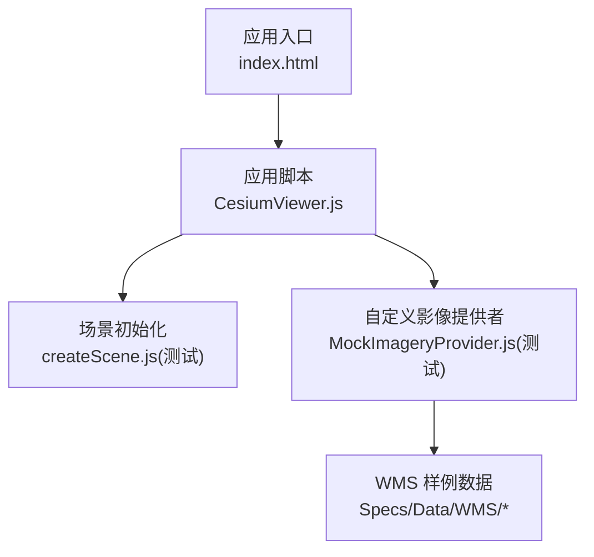
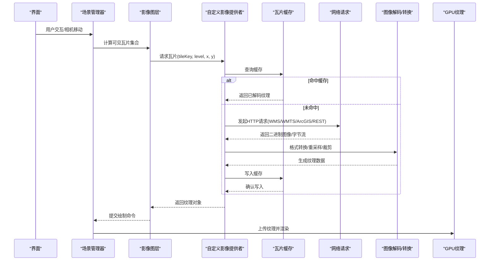
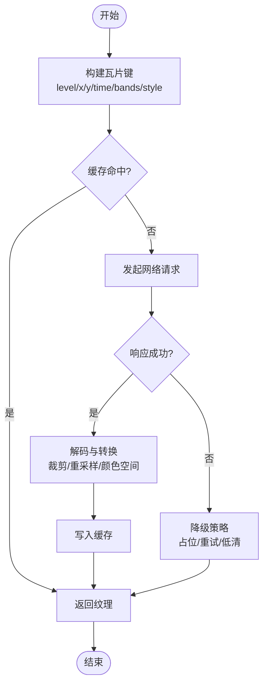
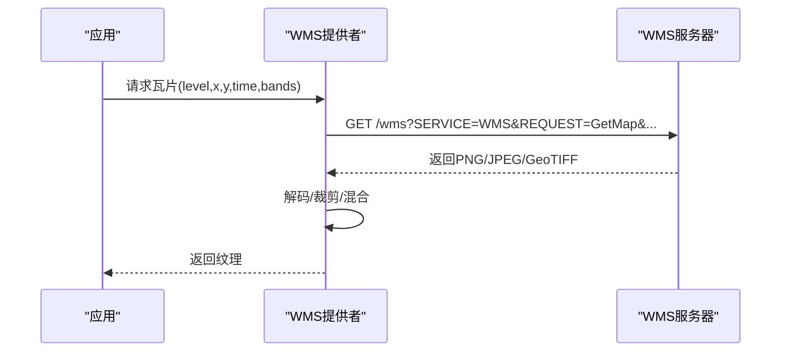
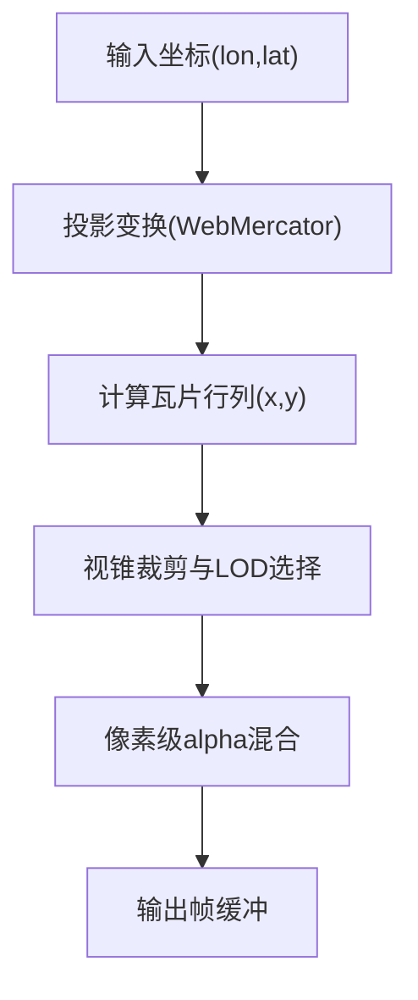
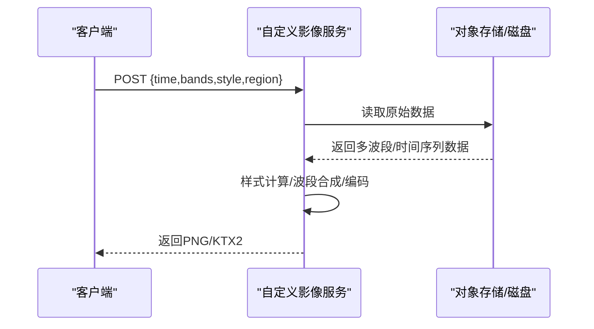
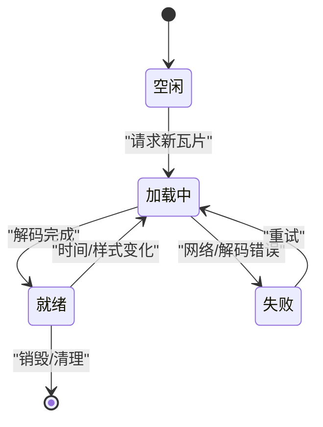
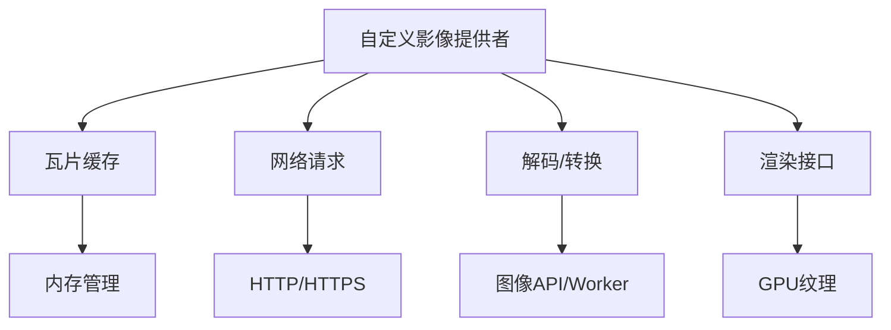

# 自定义ImageryProvider提供者

<cite>
**本文引用的文件**   
- [README.md](file://README.md)
- [package.json](file://package.json)
- [index.cjs](file://index.cjs)
- [Apps/CesiumViewer/CesiumViewer.js](file://Apps/CesiumViewer/CesiumViewer.js)
- [Apps/CesiumViewer/index.html](file://Apps/CesiumViewer/index.html)
- [Specs/MockImageryProvider.js](file://Specs/MockImageryProvider.js)
- [Specs/createScene.js](file://Specs/createScene.js)
- [Specs/Data/WMS/GetFeatureInfo-Custom.json](file://Specs/Data/WMS/GetFeatureInfo-Custom.json)
- [Specs/Data/WMS/GetFeatureInfo-Esri.xml](file://Specs/Data/WMS/GetFeatureInfo-Esri.xml)
- [Specs/Data/WMS/GetFeatureInfo-GeoJSON.json](file://Specs/Data/WMS/GetFeatureInfo-GeoJSON.json)
- [Specs/Data/WMS/GetFeatureInfo-MapInfoMXP.xml](file://Specs/Data/WMS/GetFeatureInfo-MapInfoMXP.xml)
- [Specs/Data/WMS/GetFeatureInfo-THREDDS.xml](file://Specs/Data/WMS/GetFeatureInfo-THREDDS.xml)
- [Specs/Data/WMS/GetFeatureInfo-Unknown.xml](file://Specs/Data/WMS/GetFeatureInfo-Unknown.xml)
- [Specs/Data/WMS/GetFeatureInfo-msGMLOutput.xml](file://Specs/Data/WMS/GetFeatureInfo-msGMLOutput.xml)
</cite>

## 目录
1. [简介](#简介)
2. [项目结构](#项目结构)
3. [核心组件](#核心组件)
4. [架构总览](#架构总览)
5. [详细组件分析](#详细组件分析)
6. [依赖关系分析](#依赖关系分析)
7. [性能考虑](#性能考虑)
8. [故障排查指南](#故障排查指南)
9. [结论](#结论)
10. [附录](#附录)

## 简介
本指南面向希望基于 CesiumJS 构建自定义影像提供者（ImageryProvider）的开发者，系统阐述影像提供者的设计模式、瓦片渲染管线与优化策略，并给出多源影像集成（WMS、WMTS、ArcGIS等）、坐标映射与裁剪、透明度混合、REST API 调用与动态样式、时间序列与多波段处理、实时流式影像以及性能优化（预取、纹理压缩、GPU加速）等高级主题。文档以仓库中的示例与测试数据为依据，帮助读者快速上手并实现高性能、可扩展的影像服务。

## 项目结构
CesiumJS 仓库采用分层组织：应用示例位于 Apps，核心引擎与扩展位于 Source 与 packages，测试与样例数据位于 Specs。对于自定义 ImageryProvider 的开发，建议参考以下关键位置：
- 应用入口与示例：Apps/CesiumViewer 下的 HTML 与 JS 文件，展示如何创建 Viewer 并添加影像层。
- 测试与模拟：Specs/MockImageryProvider.js 提供了最小可用的影像提供者实现范式，便于对照扩展。
- WMS 样例数据：Specs/Data/WMS 下包含多种 GetFeatureInfo 响应样例，有助于理解协议交互与解析。

图表来源
- [Apps/CesiumViewer/index.html](file://Apps/CesiumViewer/index.html)
- [Apps/CesiumViewer/CesiumViewer.js](file://Apps/CesiumViewer/CesiumViewer.js)
- [Specs/createScene.js](file://Specs/createScene.js)
- [Specs/MockImageryProvider.js](file://Specs/MockImageryProvider.js)
- [Specs/Data/WMS/GetFeatureInfo-Custom.json](file://Specs/Data/WMS/GetFeatureInfo-Custom.json)

章节来源
- [README.md](file://README.md)
- [package.json](file://package.json)
- [index.cjs](file://index.cjs)
- [Apps/CesiumViewer/CesiumViewer.js](file://Apps/CesiumViewer/CesiumViewer.js)
- [Apps/CesiumViewer/index.html](file://Apps/CesiumViewer/index.html)
- [Specs/MockImageryProvider.js](file://Specs/MockImageryProvider.js)
- [Specs/createScene.js](file://Specs/createScene.js)
- [Specs/Data/WMS/GetFeatureInfo-Custom.json](file://Specs/Data/WMS/GetFeatureInfo-Custom.json)
- [Specs/Data/WMS/GetFeatureInfo-Esri.xml](file://Specs/Data/WMS/GetFeatureInfo-Esri.xml)
- [Specs/Data/WMS/GetFeatureInfo-GeoJSON.json](file://Specs/Data/WMS/GetFeatureInfo-GeoJSON.json)
- [Specs/Data/WMS/GetFeatureInfo-MapInfoMXP.xml](file://Specs/Data/WMS/GetFeatureInfo-MapInfoMXP.xml)
- [Specs/Data/WMS/GetFeatureInfo-THREDDS.xml](file://Specs/Data/WMS/GetFeatureInfo-THREDDS.xml)
- [Specs/Data/WMS/GetFeatureInfo-Unknown.xml](file://Specs/Data/WMS/GetFeatureInfo-Unknown.xml)
- [Specs/Data/WMS/GetFeatureInfo-msGMLOutput.xml](file://Specs/Data/WMS/GetFeatureInfo-msGMLOutput.xml)

## 核心组件
- 影像提供者接口契约
  - 作为图层的数据源，需提供瓦片请求、缓存管理、元数据（如版权、最大/最小级别、矩形范围）与更新通知能力。
  - 在 CesiumJS 中，通常通过继承或组合基础类来实现，确保与渲染管线的兼容性。
- 瓦片生命周期
  - 生成瓦片键（tileKey）→ 查询缓存 → 若缺失则发起网络请求 → 解码与格式转换 → 写入纹理缓存 → 提交渲染。
- 渲染管线关键点
  - 瓦片裁剪与边界检测：根据视锥与层级剔除不可见瓦片。
  - 透明度混合：按像素级 alpha 合成，支持多源叠加。
  - 纹理压缩与 GPU 加速：优先使用 KTX2/Basis 等现代压缩格式，减少带宽与显存占用。

章节来源
- [Specs/MockImageryProvider.js](file://Specs/MockImageryProvider.js)
- [Specs/createScene.js](file://Specs/createScene.js)

## 架构总览
下图展示了从应用到影像提供者的整体流程，包括瓦片下载、缓存、解码与渲染的关键节点。

图表来源
- [Apps/CesiumViewer/CesiumViewer.js](file://Apps/CesiumViewer/CesiumViewer.js)
- [Specs/MockImageryProvider.js](file://Specs/MockImageryProvider.js)

## 详细组件分析

### 自定义影像提供者实现要点
- 基本职责
  - 定义瓦片坐标系与投影（如 Web Mercator），维护最大/最小级别与可用区域。
  - 实现瓦片 URL 模板或参数构造逻辑，支持查询参数（如 time、bands、style）。
  - 处理并发与重试，保证稳定性与用户体验。
- 缓存策略
  - 基于 tileKey 的 LRU 或容量限制缓存，避免内存泄漏。
  - 区分“待下载”、“下载中”、“已完成”状态，防止重复请求。
- 错误处理
  - 对网络超时、404、服务端异常进行降级（占位图、空瓦片、回退至低分辨率）。
  - 记录日志与指标，便于定位问题。

图表来源
- [Specs/MockImageryProvider.js](file://Specs/MockImageryProvider.js)

章节来源
- [Specs/MockImageryProvider.js](file://Specs/MockImageryProvider.js)

### 多源影像集成（WMS、WMTS、ArcGIS）
- WMS
  - 典型参数：SERVICE=WMS、REQUEST=GetMap、VERSION、LAYERS、STYLES、FORMAT、CRS/SRS、BBOX、WIDTH/HEIGHT。
  - 结合 GetFeatureInfo 样例数据，可演示点击查询与属性解析。
- WMTS
  - 通过 GetCapabilities 获取 TileMatrixSet、TileMatrix、ResourceURL 模板，按矩阵索引计算瓦片坐标。
- ArcGIS
  - 支持 MapServer/FeatureServer 的 REST 端点，利用 tileInfo 与 dynamic layers 参数实现动态样式与过滤。

图表来源
- [Specs/Data/WMS/GetFeatureInfo-Custom.json](file://Specs/Data/WMS/GetFeatureInfo-Custom.json)
- [Specs/Data/WMS/GetFeatureInfo-Esri.xml](file://Specs/Data/WMS/GetFeatureInfo-Esri.xml)
- [Specs/Data/WMS/GetFeatureInfo-GeoJSON.json](file://Specs/Data/WMS/GetFeatureInfo-GeoJSON.json)
- [Specs/Data/WMS/GetFeatureInfo-MapInfoMXP.xml](file://Specs/Data/WMS/GetFeatureInfo-MapInfoMXP.xml)
- [Specs/Data/WMS/GetFeatureInfo-THREDDS.xml](file://Specs/Data/WMS/GetFeatureInfo-THREDDS.xml)
- [Specs/Data/WMS/GetFeatureInfo-Unknown.xml](file://Specs/Data/WMS/GetFeatureInfo-Unknown.xml)
- [Specs/Data/WMS/GetFeatureInfo-msGMLOutput.xml](file://Specs/Data/WMS/GetFeatureInfo-msGMLOutput.xml)

章节来源
- [Specs/Data/WMS/GetFeatureInfo-Custom.json](file://Specs/Data/WMS/GetFeatureInfo-Custom.json)
- [Specs/Data/WMS/GetFeatureInfo-Esri.xml](file://Specs/Data/WMS/GetFeatureInfo-Esri.xml)
- [Specs/Data/WMS/GetFeatureInfo-GeoJSON.json](file://Specs/Data/WMS/GetFeatureInfo-GeoJSON.json)
- [Specs/Data/WMS/GetFeatureInfo-MapInfoMXP.xml](file://Specs/Data/WMS/GetFeatureInfo-MapInfoMXP.xml)
- [Specs/Data/WMS/GetFeatureInfo-THREDDS.xml](file://Specs/Data/WMS/GetFeatureInfo-THREDDS.xml)
- [Specs/Data/WMS/GetFeatureInfo-Unknown.xml](file://Specs/Data/WMS/GetFeatureInfo-Unknown.xml)
- [Specs/Data/WMS/GetFeatureInfo-msGMLOutput.xml](file://Specs/Data/WMS/GetFeatureInfo-msGMLOutput.xml)

### 坐标映射、裁剪与透明度混合
- 坐标映射
  - 将经纬度或平面坐标转换为瓦片行列号（x/y），再根据缩放级别映射到屏幕像素。
  - 注意不同投影（Web Mercator、UTM、地理坐标）与瓦片原点差异。
- 裁剪处理
  - 依据瓦片边界与视锥进行早剪枝，减少无效渲染。
  - 对边缘瓦片做羽化或重叠拼接，避免接缝。
- 透明度混合
  - 使用标准 alpha 合成公式，支持多层叠加与深度排序。
  - 针对半透明瓦片，需考虑渲染顺序与批处理策略。

[此图为概念性流程图，不直接对应具体源码文件]

### 自定义影像服务示例（REST API、格式转换、动态样式）
- REST 调用
  - 构造带参数的 URL（time、bands、style、format），支持并发与重试。
  - 使用 fetch/XMLHttpRequest 获取二进制数据，设置合适的超时与取消令牌。
- 图像格式转换
  - 将 GeoTIFF/NetCDF 切片转为 PNG/JPEG/KTX2；必要时进行重采样与色彩空间校正。
- 动态样式
  - 通过 style 参数或后端样式服务（如 SLD/JSON）实现按需渲染。
  - 前端可对结果进行后处理（对比度、阈值、伪彩色）。

[此图为概念性流程图，不直接对应具体源码文件]

### 高级功能：时间序列、多波段与实时流
- 时间序列
  - 为每个时间点生成独立瓦片集，或使用单瓦片内嵌时间维度（需后端支持）。
  - 前端提供时间轴控件，触发瓦片重新加载与过渡动画。
- 多波段处理
  - 支持 NDVI、热红外等指数计算，可在后端预处理或前端 Canvas/WebGL 计算。
  - 注意带宽与解码开销，优先使用压缩格式与分块传输。
- 实时流
  - 基于 WebSocket/SSE 推送增量更新，前端合并新旧瓦片并保持一致性。
  - 引入去抖与节流，避免频繁重建纹理。

[此图为概念性状态图，不直接对应具体源码文件]

## 依赖关系分析
- 模块耦合
  - 影像提供者与场景管理器解耦，通过统一接口交换瓦片与元数据。
  - 缓存层独立于网络与解码，便于替换与测试。
- 外部依赖
  - 浏览器原生 API（fetch、Canvas、ImageBitmap）用于网络与图像处理。
  - 可选第三方库用于 KTX2/Basis 解码与压缩。

[此图为概念性依赖图，不直接对应具体源码文件]

## 性能考虑
- 瓦片预取
  - 基于相机运动预测相邻层级与周边瓦片，提前入队请求。
  - 控制并发数与优先级，避免阻塞主线程。
- 纹理压缩
  - 优先使用 KTX2/Basis 等 GPU 友好格式，降低带宽与显存占用。
  - 对移动端设备启用更激进的压缩与更低分辨率。
- GPU 加速
  - 批量上传纹理，减少上下文切换。
  - 使用 WebGL2 特性（如纹理数组、实例化）提升绘制效率。
- 缓存与淘汰
  - 基于 LRU 或容量上限的缓存策略，定期清理长时间未访问的瓦片。
  - 区分“热瓦片”与“冷瓦片”，提高命中率。

[本节为通用指导，无需源码引用]

## 故障排查指南
- 常见问题
  - 瓦片空白或错位：检查坐标映射与投影参数，确认 BBOX/CRS 配置正确。
  - 透明度异常：确认 alpha 通道存在且混合模式正确，避免多次覆盖导致反色。
  - 性能抖动：监控网络并发与解码耗时，适当增加 Worker 与缓存大小。
- 调试技巧
  - 开启瓦片边界可视化，观察裁剪与 LOD 切换。
  - 记录请求时间与错误码，定位慢请求与失败原因。
  - 使用浏览器开发者工具的网络面板与性能面板进行分析。

[本节为通用指导，无需源码引用]

## 结论
通过遵循统一的影像提供者接口契约、合理的瓦片生命周期管理与高效的渲染管线，开发者可以构建出高性能、可扩展的自定义影像服务。结合多源协议支持、动态样式与高级功能（时间序列、多波段、实时流），并在预取、压缩与 GPU 加速方面持续优化，能够在复杂业务场景中提供流畅的地图体验。

[本节为总结性内容，无需源码引用]

## 附录
- 参考示例与数据
  - 应用入口与示例：Apps/CesiumViewer
  - 最小可用提供者实现：Specs/MockImageryProvider.js
  - WMS GetFeatureInfo 样例：Specs/Data/WMS/*

章节来源
- [Apps/CesiumViewer/CesiumViewer.js](file://Apps/CesiumViewer/CesiumViewer.js)
- [Apps/CesiumViewer/index.html](file://Apps/CesiumViewer/index.html)
- [Specs/MockImageryProvider.js](file://Specs/MockImageryProvider.js)
- [Specs/Data/WMS/GetFeatureInfo-Custom.json](file://Specs/Data/WMS/GetFeatureInfo-Custom.json)
- [Specs/Data/WMS/GetFeatureInfo-Esri.xml](file://Specs/Data/WMS/GetFeatureInfo-Esri.xml)
- [Specs/Data/WMS/GetFeatureInfo-GeoJSON.json](file://Specs/Data/WMS/GetFeatureInfo-GeoJSON.json)
- [Specs/Data/WMS/GetFeatureInfo-MapInfoMXP.xml](file://Specs/Data/WMS/GetFeatureInfo-MapInfoMXP.xml)
- [Specs/Data/WMS/GetFeatureInfo-THREDDS.xml](file://Specs/Data/WMS/GetFeatureInfo-THREDDS.xml)
- [Specs/Data/WMS/GetFeatureInfo-Unknown.xml](file://Specs/Data/WMS/GetFeatureInfo-Unknown.xml)
- [Specs/Data/WMS/GetFeatureInfo-msGMLOutput.xml](file://Specs/Data/WMS/GetFeatureInfo-msGMLOutput.xml)