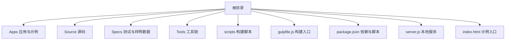
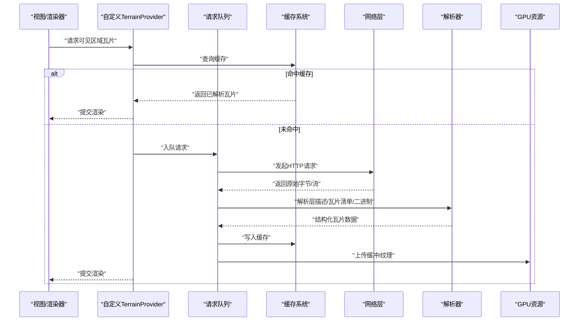
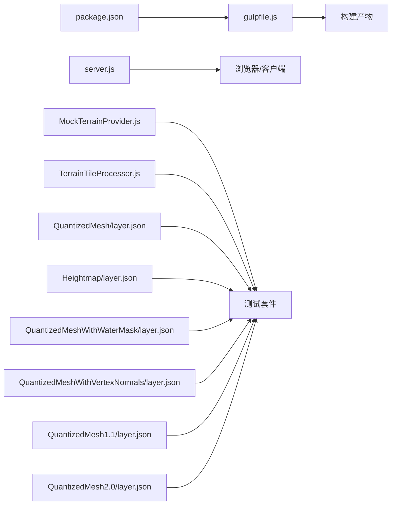

# 自定义TerrainProvider提供者

<cite>
**本文引用的文件**   
- [README.md](file://README.md)
- [index.html](file://index.html)
- [server.js](file://server.js)
- [gulpfile.js](file://gulpfile.js)
- [package.json](file://package.json)
- [Specs/MockTerrainProvider.js](file://Specs/MockTerrainProvider.js)
- [Specs/TerrainTileProcessor.js](file://Specs/TerrainTileProcessor.js)
- [Specs/Data/CesiumTerrainTileJson/QuantizedMesh/layer.json](file://Specs/Data/CesiumTerrainTileJson/QuantizedMesh/layer.json)
- [Specs/Data/CesiumTerrainTileJson/Heightmap/layer.json](file://Specs/Data/CesiumTerrainTileJson/Heightmap/layer.json)
- [Specs/Data/CesiumTerrainTileJson/QuantizedMeshWithWaterMask/layer.json](file://Specs/Data/CesiumTerrainTileJson/QuantizedMeshWithWaterMask/layer.json)
- [Specs/Data/CesiumTerrainTileJson/QuantizedMeshWithVertexNormals/layer.json](file://Specs/Data/CesiumTerrainTileJson/QuantizedMeshWithVertexNormals/layer.json)
- [Specs/Data/CesiumTerrainTileJson/QuantizedMesh1.1/layer.json](file://Specs/Data/CesiumTerrainTileJson/QuantizedMesh1.1/layer.json)
- [Specs/Data/CesiumTerrainTileJson/QuantizedMesh2.0/layer.json](file://Specs/Data/CesiumTerrainTileJson/QuantizedMesh2.0/layer.json)
</cite>

## 目录
1. [简介](#简介)
2. [项目结构](#项目结构)
3. [核心组件](#核心组件)
4. [架构总览](#架构总览)
5. [详细组件分析](#详细组件分析)
6. [依赖关系分析](#依赖关系分析)
7. [性能考虑](#性能考虑)
8. [故障排查指南](#故障排查指南)
9. [结论](#结论)
10. [附录](#附录)

## 简介
本指南面向希望实现自定义地形提供者（TerrainProvider）的开发者，围绕Cesium仓库中的相关示例与测试数据，系统阐述地形提供者的架构设计、瓦片管理机制（请求队列、缓存、LOD）、下载解析流程、高度图数据处理、坐标系统与投影变换、瓦片边界计算、REST API集成、二进制格式解析与压缩解码、错误重试与超时处理、离线模式支持，以及预加载、内存池与GPU资源优化等实践要点。

## 项目结构
仓库采用多包与示例分离的组织方式：
- 应用与示例位于 Apps 目录，包含基础页面与服务端启动脚本
- 源码主体位于 Source 目录（本仓库中仅保留版权头）
- 测试与样例数据位于 Specs 目录，其中包含大量地形瓦片元数据与层描述文件
- 构建与打包工具位于 gulpfile.js 与 scripts 目录
- 根级 package.json 管理依赖与脚本

图表来源
- [package.json:1-50](file://package.json#L1-L50)
- [gulpfile.js:1-50](file://gulpfile.js#L1-L50)
- [server.js:1-50](file://server.js#L1-L50)
- [index.html:1-50](file://index.html#L1-L50)

章节来源
- [README.md:1-100](file://README.md#L1-L100)
- [package.json:1-120](file://package.json#L1-L120)
- [gulpfile.js:1-120](file://gulpfile.js#L1-L120)
- [server.js:1-120](file://server.js#L1-L120)
- [index.html:1-120](file://index.html#L1-L120)

## 核心组件
- 自定义地形提供者接口与实现参考
  - 基于 Specs 中的 MockTerrainProvider 可了解最小可用实现与生命周期方法约定
- 地形瓦片处理器
  - TerrainTileProcessor 用于在测试环境中对地形瓦片进行预处理与验证
- 地形层描述与瓦片清单
  - layer.json 定义地形服务的元信息、瓦片集合与可选扩展（如水位掩码、顶点法线、索引类型等）

章节来源
- [Specs/MockTerrainProvider.js:1-200](file://Specs/MockTerrainProvider.js#L1-L200)
- [Specs/TerrainTileProcessor.js:1-200](file://Specs/TerrainTileProcessor.js#L1-L200)
- [Specs/Data/CesiumTerrainTileJson/QuantizedMesh/layer.json:1-200](file://Specs/Data/CesiumTerrainTileJson/QuantizedMesh/layer.json#L1-L200)

## 架构总览
自定义地形提供者的典型调用链如下：
- 渲染管线根据视锥体与LOD策略生成待加载瓦片列表
- 提供者内部维护请求队列与缓存，按优先级调度网络请求
- 下载完成后进入解析阶段：读取层描述、解析瓦片清单、解码二进制或压缩数据
- 将结果转换为内部几何表示并上传至GPU缓冲
- 渲染器使用已就绪的瓦片进行绘制

图表来源
- [Specs/MockTerrainProvider.js:1-200](file://Specs/MockTerrainProvider.js#L1-L200)
- [Specs/TerrainTileProcessor.js:1-200](file://Specs/TerrainTileProcessor.js#L1-L200)
- [Specs/Data/CesiumTerrainTileJson/QuantizedMesh/layer.json:1-200](file://Specs/Data/CesiumTerrainTileJson/QuantizedMesh/layer.json#L1-L200)

## 详细组件分析

### 自定义地形提供者（接口与实现要点）
- 关键职责
  - 暴露统一的获取瓦片接口，供渲染管线按需拉取
  - 管理请求并发度、失败重试与超时
  - 维护内存中的瓦片缓存与过期策略
  - 协调LOD选择与瓦片边界计算
- 建议能力
  - 分层元数据管理：从 layer.json 读取服务版本、坐标系、范围、最大/最小级别、内容格式等
  - 瓦片键空间：以层级(x,y)或四叉树/八叉树键组织
  - 异步任务编排：基于Promise/Future的任务图，避免重复请求与死锁
  - 错误分类与降级：网络错误、解析错误、数据不完整时的回退策略

章节来源
- [Specs/MockTerrainProvider.js:1-200](file://Specs/MockTerrainProvider.js#L1-L200)

### 瓦片管理与请求队列
- 请求队列
  - 优先级：当前可视区域 > 邻近区域 > 预加载区域
  - 去重：相同键的请求合并为一次
  - 限流：限制并发数，避免打满带宽或服务器
- 缓存系统
  - 多级缓存：内存缓存 + 磁盘缓存（IndexedDB/文件系统）
  - 淘汰策略：LRU/LFU + 时间戳TTL
  - 一致性：更新时失效旧版本，保证渲染稳定
- LOD策略
  - 基于距离与屏幕误差阈值动态选择层级
  - 父瓦片与子瓦片的替换/融合策略，避免闪烁

章节来源
- [Specs/MockTerrainProvider.js:1-200](file://Specs/MockTerrainProvider.js#L1-L200)

### 瓦片下载、解析与高度图数据处理
- 下载
  - REST API：GET /tiles/{z}/{x}/{y}.bin 或类似路径
  - 批量清单：先获取 layer.json 或 tileset.json，再并行下载具体瓦片
- 解析
  - 层描述：解析坐标系、范围、级别、内容格式、扩展字段
  - 瓦片清单：解析瓦片ID到URL映射、可用性掩码、元数据
  - 二进制：根据格式（如量化网格、高度图）解码顶点、索引、法线、水位掩码等
- 高度图数据处理
  - 浮点/整型转换、缩放与偏移还原
  - 缺失值填充与平滑滤波
  - 法线重建与水面标记处理

章节来源
- [Specs/Data/CesiumTerrainTileJson/QuantizedMesh/layer.json:1-200](file://Specs/Data/CesiumTerrainTileJson/QuantizedMesh/layer.json#L1-L200)
- [Specs/Data/CesiumTerrainTileJson/Heightmap/layer.json:1-200](file://Specs/Data/CesiumTerrainTileJson/Heightmap/layer.json#L1-L200)
- [Specs/Data/CesiumTerrainTileJson/QuantizedMeshWithWaterMask/layer.json:1-200](file://Specs/Data/CesiumTerrainTileJson/QuantizedMeshWithWaterMask/layer.json#L1-L200)
- [Specs/Data/CesiumTerrainTileJson/QuantizedMeshWithVertexNormals/layer.json:1-200](file://Specs/Data/CesiumTerrainTileJson/QuantizedMeshWithVertexNormals/layer.json#L1-L200)
- [Specs/Data/CesiumTerrainTileJson/QuantizedMesh1.1/layer.json:1-200](file://Specs/Data/CesiumTerrainTileJson/QuantizedMesh1.1/layer.json#L1-L200)
- [Specs/Data/CesiumTerrainTileJson/QuantizedMesh2.0/layer.json:1-200](file://Specs/Data/CesiumTerrainTileJson/QuantizedMesh2.0/layer.json#L1-L200)

### 坐标系统转换、投影变换与瓦片边界计算
- 坐标系统
  - WGS84经纬度与Web墨卡托投影之间的转换
  - 局部平面坐标与地心坐标的转换（必要时）
- 投影变换
  - 将经纬度映射到瓦片行列号（x,y,z）
  - 反算瓦片边界经纬度范围
- 瓦片边界计算
  - 根据层级与行列号计算地理边界
  - 结合视锥体裁剪，减少无效请求

章节来源
- [Specs/Data/CesiumTerrainTileJson/QuantizedMesh/layer.json:1-200](file://Specs/Data/CesiumTerrainTileJson/QuantizedMesh/layer.json#L1-L200)

### 自定义地形服务实现示例（REST API、二进制解析、压缩解码）
- REST API集成
  - 服务端提供层描述与瓦片资源
  - 客户端通过统一基址拼接瓦片路径
- 二进制格式解析
  - 量化网格：解析顶点坐标、索引、法线、水位掩码等
  - 高度图：解析像素矩阵并还原高程
- 压缩数据解码
  - 支持gzip/deflate解压后再解析
  - 流式解压以降低峰值内存

章节来源
- [Specs/Data/CesiumTerrainTileJson/QuantizedMesh/layer.json:1-200](file://Specs/Data/CesiumTerrainTileJson/QuantizedMesh/layer.json#L1-L200)
- [Specs/Data/CesiumTerrainTileJson/Heightmap/layer.json:1-200](file://Specs/Data/CesiumTerrainTileJson/Heightmap/layer.json#L1-L200)

### 错误重试机制、网络超时与离线模式
- 重试机制
  - 指数退避与抖动，避免雪崩
  - 区分可重试与不可重试错误
- 超时处理
  - 请求级超时与整体加载超时
  - 长连接与分块传输的超时控制
- 离线模式
  - 优先从磁盘缓存读取
  - 无网络时降级为低精度或默认地形

章节来源
- [Specs/MockTerrainProvider.js:1-200](file://Specs/MockTerrainProvider.js#L1-L200)

### 性能优化：预加载、内存池与GPU资源优化
- 预加载
  - 基于相机运动预测与LOD梯度预取相邻层级
  - 空闲时段后台预取
- 内存池
  - 复用缓冲区与对象，减少GC压力
  - 大数组分块处理与零拷贝
- GPU资源优化
  - 批量上传与合并Draw Call
  - 纹理与缓冲的共享与复用
  - 按需释放离屏瓦片

章节来源
- [Specs/MockTerrainProvider.js:1-200](file://Specs/MockTerrainProvider.js#L1-L200)

## 依赖关系分析
- 外部依赖
  - 构建与打包：gulpfile.js 与 package.json 定义的脚本与插件
  - 本地开发服务：server.js 提供的静态资源服务
- 内部模块
  - 测试与示例：MockTerrainProvider 与 TerrainTileProcessor 作为参考实现
  - 样例数据：layer.json 系列文件用于驱动测试与演示

图表来源
- [package.json:1-120](file://package.json#L1-L120)
- [gulpfile.js:1-120](file://gulpfile.js#L1-L120)
- [server.js:1-120](file://server.js#L1-L120)
- [Specs/MockTerrainProvider.js:1-200](file://Specs/MockTerrainProvider.js#L1-L200)
- [Specs/TerrainTileProcessor.js:1-200](file://Specs/TerrainTileProcessor.js#L1-L200)
- [Specs/Data/CesiumTerrainTileJson/QuantizedMesh/layer.json:1-200](file://Specs/Data/CesiumTerrainTileJson/QuantizedMesh/layer.json#L1-L200)
- [Specs/Data/CesiumTerrainTileJson/Heightmap/layer.json:1-200](file://Specs/Data/CesiumTerrainTileJson/Heightmap/layer.json#L1-L200)
- [Specs/Data/CesiumTerrainTileJson/QuantizedMeshWithWaterMask/layer.json:1-200](file://Specs/Data/CesiumTerrainTileJson/QuantizedMeshWithWaterMask/layer.json#L1-L200)
- [Specs/Data/CesiumTerrainTileJson/QuantizedMeshWithVertexNormals/layer.json:1-200](file://Specs/Data/CesiumTerrainTileJson/QuantizedMeshWithVertexNormals/layer.json#L1-L200)
- [Specs/Data/CesiumTerrainTileJson/QuantizedMesh1.1/layer.json:1-200](file://Specs/Data/CesiumTerrainTileJson/QuantizedMesh1.1/layer.json#L1-L200)
- [Specs/Data/CesiumTerrainTileJson/QuantizedMesh2.0/layer.json:1-200](file://Specs/Data/CesiumTerrainTileJson/QuantizedMesh2.0/layer.json#L1-L200)

章节来源
- [package.json:1-120](file://package.json#L1-L120)
- [gulpfile.js:1-120](file://gulpfile.js#L1-L120)
- [server.js:1-120](file://server.js#L1-L120)
- [Specs/MockTerrainProvider.js:1-200](file://Specs/MockTerrainProvider.js#L1-L200)
- [Specs/TerrainTileProcessor.js:1-200](file://Specs/TerrainTileProcessor.js#L1-L200)
- [Specs/Data/CesiumTerrainTileJson/QuantizedMesh/layer.json:1-200](file://Specs/Data/CesiumTerrainTileJson/QuantizedMesh/layer.json#L1-L200)

## 性能考虑
- 网络侧
  - 合理设置并发与超时，启用HTTP/2与CDN缓存
  - 使用ETag/Last-Modified减少重复传输
- 解析侧
  - 流式解析与增量构建，降低峰值内存
  - 批处理与向量化运算提升CPU效率
- 渲染侧
  - 合并几何与材质批次，减少状态切换
  - 使用Instancing与VAO/VBO复用
- 存储侧
  - 磁盘缓存分级与压缩存储
  - 定期清理与容量监控

[本节为通用指导，不直接分析具体文件]

## 故障排查指南
- 常见问题定位
  - 瓦片无法加载：检查层描述与瓦片路径是否正确
  - 解析失败：确认二进制格式与扩展字段是否匹配
  - 渲染异常：核对坐标转换与边界计算
- 调试手段
  - 开启详细日志，记录请求与响应大小、耗时
  - 使用离线数据回放，复现问题
  - 逐步禁用扩展（如水掩码、法线）缩小范围

章节来源
- [Specs/MockTerrainProvider.js:1-200](file://Specs/MockTerrainProvider.js#L1-L200)
- [Specs/TerrainTileProcessor.js:1-200](file://Specs/TerrainTileProcessor.js#L1-L200)

## 结论
通过参考仓库中的测试与样例数据，可以构建一个高可用、高性能的自定义地形提供者。关键在于清晰的接口契约、稳健的队列与缓存、正确的坐标与投影处理、高效的解析与GPU上传，以及完善的错误恢复与离线支持。配合预加载与资源复用，可在大规模场景下获得流畅的地形体验。

[本节为总结性内容，不直接分析具体文件]

## 附录
- 快速开始
  - 安装依赖与启动本地服务后，打开 index.html 查看示例
- 参考实现
  - 阅读 Specs 下的 MockTerrainProvider 与 TerrainTileProcessor，理解最小可用实现与处理流程
- 数据格式
  - 参考 layer.json 系列文件，了解不同地形格式的元数据与扩展

章节来源
- [index.html:1-120](file://index.html#L1-L120)
- [server.js:1-120](file://server.js#L1-L120)
- [Specs/MockTerrainProvider.js:1-200](file://Specs/MockTerrainProvider.js#L1-L200)
- [Specs/TerrainTileProcessor.js:1-200](file://Specs/TerrainTileProcessor.js#L1-L200)
- [Specs/Data/CesiumTerrainTileJson/QuantizedMesh/layer.json:1-200](file://Specs/Data/CesiumTerrainTileJson/QuantizedMesh/layer.json#L1-L200)