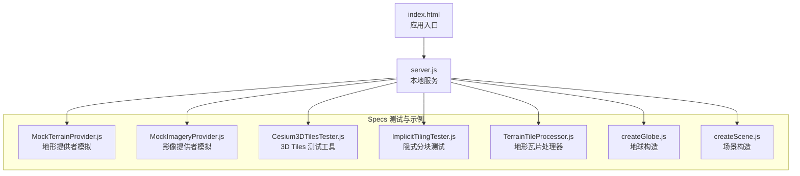
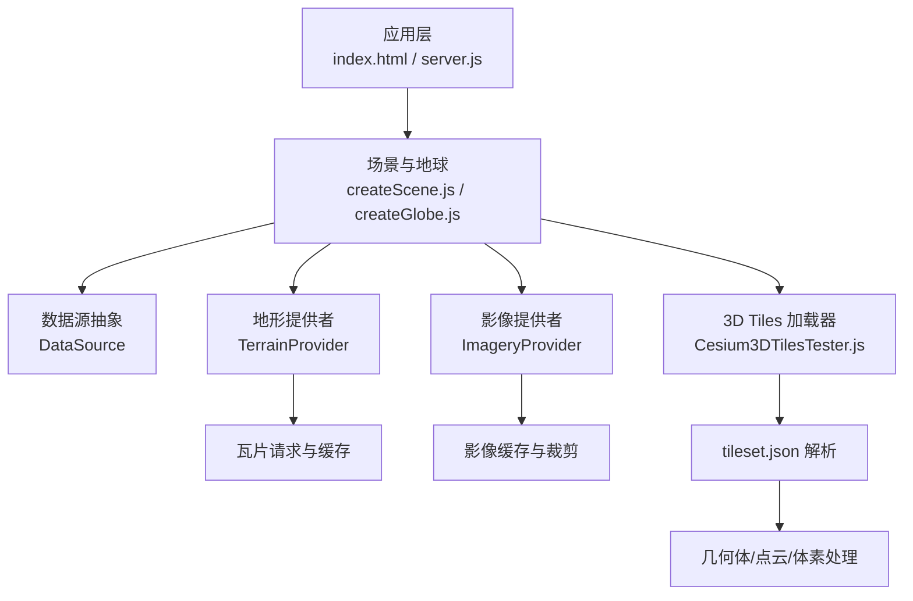
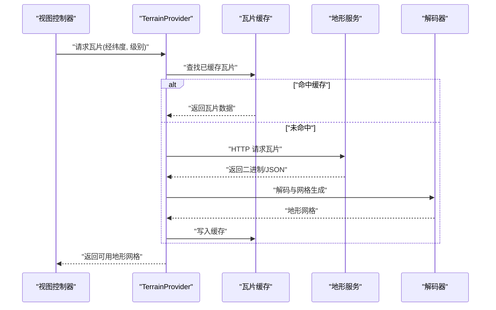
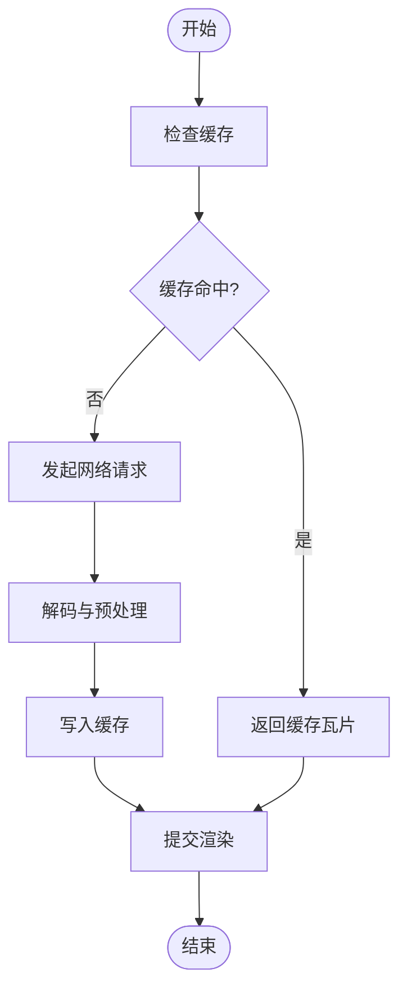
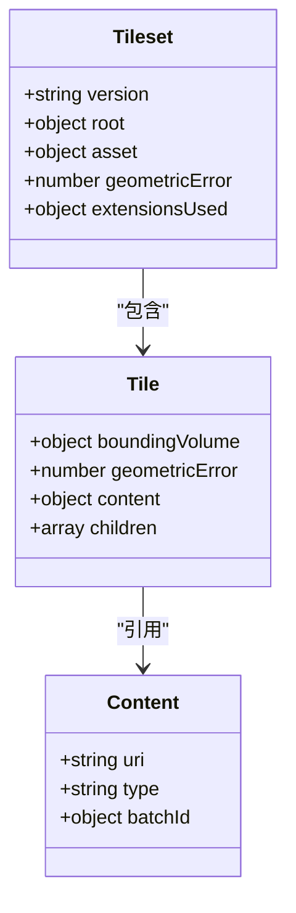
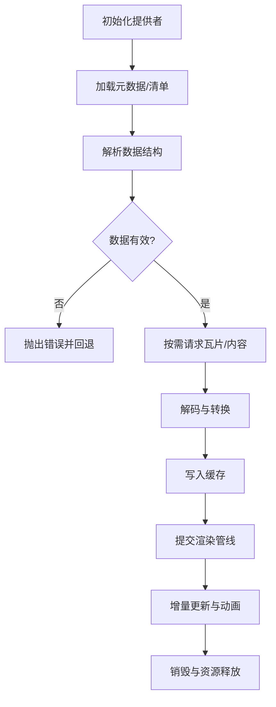
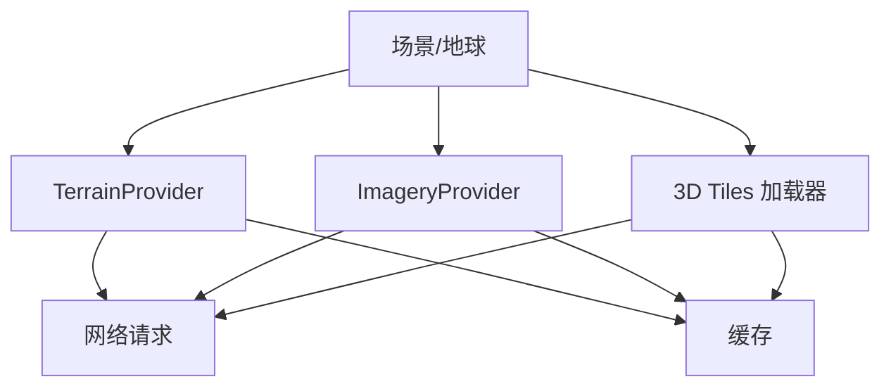

# 自定义数据提供者

<cite>
**本文引用的文件**   
- [README.md](file://README.md)
- [MockTerrainProvider.js](file://Specs/MockTerrainProvider.js)
- [MockImageryProvider.js](file://Specs/MockImageryProvider.js)
- [Cesium3DTilesTester.js](file://Specs/Cesium3DTilesTester.js)
- [ImplicitTilingTester.js](file://Specs/ImplicitTilingTester.js)
- [TerrainTileProcessor.js](file://Specs/TerrainTileProcessor.js)
- [createGlobe.js](file://Specs/createGlobe.js)
- [createScene.js](file://Specs/createScene.js)
- [index.html](file://index.html)
- [server.js](file://server.js)
</cite>

## 目录
1. [简介](#简介)
2. [项目结构](#项目结构)
3. [核心组件](#核心组件)
4. [架构总览](#架构总览)
5. [详细组件分析](#详细组件分析)
6. [依赖关系分析](#依赖关系分析)
7. [性能考量](#性能考量)
8. [故障排查指南](#故障排查指南)
9. [结论](#结论)
10. [附录](#附录)

## 简介
本指南面向需要在 CesiumJS 中扩展数据源与渲染能力的开发者，系统阐述如何构建自定义数据提供者。内容覆盖：
- 抽象接口设计与生命周期管理（DataSource、TerrainProvider、ImageryProvider）
- 自定义 DataSource 的实现要点（数据加载、解析、实体创建与更新）
- TerrainProvider 开发方法（地形瓦片请求、高度图处理、LOD 策略）
- ImageryProvider 扩展方式（影像瓦片下载、缓存管理与渲染优化）
- 3D Tiles 自定义提供者的实现示例（tileset.json 生成与几何体数据处理）
- 错误处理、性能优化与内存管理的最佳实践

## 项目结构
仓库包含应用示例、测试规范与工具脚本等。与“自定义数据提供者”主题直接相关的代码主要位于 Specs 目录下的测试与模拟实现，以及根目录的入口与服务脚本。

图表来源 
- [index.html](file://index.html)
- [server.js](file://server.js)
- [MockTerrainProvider.js](file://Specs/MockTerrainProvider.js)
- [MockImageryProvider.js](file://Specs/MockImageryProvider.js)
- [Cesium3DTilesTester.js](file://Specs/Cesium3DTilesTester.js)
- [ImplicitTilingTester.js](file://Specs/ImplicitTilingTester.js)
- [TerrainTileProcessor.js](file://Specs/TerrainTileProcessor.js)
- [createGlobe.js](file://Specs/createGlobe.js)
- [createScene.js](file://Specs/createScene.js)

章节来源
- [README.md](file://README.md)
- [index.html](file://index.html)
- [server.js](file://server.js)

## 核心组件
- DataSource：统一的数据源抽象，负责数据的加载、解析与实体生命周期管理（创建、更新、销毁）。
- TerrainProvider：地形数据提供者，负责地形瓦片的请求、解码、网格生成与 LOD 控制。
- ImageryProvider：影像数据提供者，负责影像瓦片的下载、缓存、裁剪与渲染。
- 3D Tiles Provider：基于 tileset.json 的层级化三维数据加载器，支持几何体、点云、体素等内容类型。

章节来源
- [MockTerrainProvider.js](file://Specs/MockTerrainProvider.js)
- [MockImageryProvider.js](file://Specs/MockImageryProvider.js)
- [Cesium3DTilesTester.js](file://Specs/Cesium3DTilesTester.js)
- [ImplicitTilingTester.js](file://Specs/ImplicitTilingTester.js)

## 架构总览
下图展示了自定义数据提供者在 CesiumJS 中的整体交互关系：应用层通过 Scene/Globe 调度各类 Provider，Provider 负责从后端或本地资源获取数据并转换为可渲染对象。

图表来源 
- [createScene.js](file://Specs/createScene.js)
- [createGlobe.js](file://Specs/createGlobe.js)
- [MockTerrainProvider.js](file://Specs/MockTerrainProvider.js)
- [MockImageryProvider.js](file://Specs/MockImageryProvider.js)
- [Cesium3DTilesTester.js](file://Specs/Cesium3DTilesTester.js)

## 详细组件分析

### 自定义 DataSource：抽象接口与生命周期
- 设计目标
  - 统一接入不同数据格式（如 CZML、GeoJSON、KML、自定义协议）
  - 将外部数据转换为 Cesium 实体（Entity）或几何体，并提供属性查询与时间动态能力
- 关键职责
  - 数据加载：异步拉取原始数据，支持增量更新与版本控制
  - 数据解析：校验与转换数据结构，建立实体映射
  - 实体创建与更新：按需创建 Entity，维护时间线、位置、样式等属性
  - 生命周期管理：初始化、销毁、清理资源，避免内存泄漏
- 实现建议
  - 使用事件驱动通知变更（如 dataChanged、errorOccurred）
  - 对大数据集采用分页/懒加载与批处理
  - 为频繁更新的实体提供批量更新接口，减少重绘开销

章节来源
- [MockTerrainProvider.js](file://Specs/MockTerrainProvider.js)
- [MockImageryProvider.js](file://Specs/MockImageryProvider.js)

### TerrainProvider：地形瓦片与 LOD 策略
- 设计目标
  - 按视锥与距离自适应地加载地形瓦片，保证流畅渲染与低延迟
- 关键职责
  - 瓦片请求：根据经纬度与级别计算瓦片键，发起 HTTP 请求
  - 高度图处理：解码量化网格（QuantizedMesh）、高度图或点云，生成地形网格
  - LOD 策略：依据几何误差与屏幕空间误差选择合适细节
  - 缓存管理：LRU 或容量限制缓存，避免重复下载与内存膨胀
- 实现建议
  - 并行请求与去重，避免同一瓦片多次下载
  - 使用 Web Worker 进行解码与网格生成，避免阻塞主线程
  - 合理设置最大并发数与缓存大小，平衡带宽与内存

图表来源 
- [MockTerrainProvider.js](file://Specs/MockTerrainProvider.js)
- [TerrainTileProcessor.js](file://Specs/TerrainTileProcessor.js)

章节来源
- [MockTerrainProvider.js](file://Specs/MockTerrainProvider.js)
- [TerrainTileProcessor.js](file://Specs/TerrainTileProcessor.js)

### ImageryProvider：影像瓦片与渲染优化
- 设计目标
  - 高效加载与合成多源影像（卫星、航拍、矢量切片），支持投影变换与透明度混合
- 关键职责
  - 瓦片下载：按瓦片键组织 URL，支持多 URL 冗余与重试
  - 缓存管理：内存与磁盘缓存，LRU 淘汰策略
  - 渲染优化：裁剪、合并、纹理压缩（如 KTX2）、GPU 加速
- 实现建议
  - 使用请求队列与优先级，优先加载可见区域
  - 对大图瓦片进行分块与渐进式加载
  - 利用离屏 Canvas 进行预处理，降低主线程压力

图表来源 
- [MockImageryProvider.js](file://Specs/MockImageryProvider.js)

章节来源
- [MockImageryProvider.js](file://Specs/MockImageryProvider.js)

### 3D Tiles 自定义提供者：tileset.json 与几何体处理
- 设计目标
  - 基于 tileset.json 描述层级结构与内容引用，按需加载几何体、点云或体素
- 关键职责
  - tileset.json 生成：定义根节点、子节点、边界体积、几何误差与内容路径
  - 几何体数据处理：解析 glTF/GLB、点云、体素，并进行实例化与批处理
  - 隐式分块：根据规则动态生成子节点，减少静态清单规模
- 实现建议
  - 使用预计算边界与几何误差，提升 LOD 判定效率
  - 对大模型进行 Draco 压缩与纹理图集优化
  - 结合 ImplicitTiling 规则，按需生成与卸载子节点

图表来源 
- [Cesium3DTilesTester.js](file://Specs/Cesium3DTilesTester.js)
- [ImplicitTilingTester.js](file://Specs/ImplicitTilingTester.js)

章节来源
- [Cesium3DTilesTester.js](file://Specs/Cesium3DTilesTester.js)
- [ImplicitTilingTester.js](file://Specs/ImplicitTilingTester.js)

### 概念总览
以下流程图展示自定义数据提供者的通用工作流，适用于 DataSource、TerrainProvider、ImageryProvider 与 3D Tiles 提供者。

[此图为概念性流程，不直接映射具体源码文件]

## 依赖关系分析
- 模块耦合
  - Scene/Globe 作为调度中心，依赖各 Provider 的接口一致性
  - Provider 之间无强耦合，但共享缓存与资源管理机制
- 外部依赖
  - 网络请求库（HTTP/HTTPS）
  - 解码库（WebAssembly/Worker）
  - 图形 API（WebGL/WebGPU）
- 潜在循环依赖
  - 应避免 Provider 间互相调用，通过事件或回调解耦

图表来源 
- [createScene.js](file://Specs/createScene.js)
- [createGlobe.js](file://Specs/createGlobe.js)
- [MockTerrainProvider.js](file://Specs/MockTerrainProvider.js)
- [MockImageryProvider.js](file://Specs/MockImageryProvider.js)
- [Cesium3DTilesTester.js](file://Specs/Cesium3DTilesTester.js)

章节来源
- [createScene.js](file://Specs/createScene.js)
- [createGlobe.js](file://Specs/createGlobe.js)

## 性能考量
- 并发与限流
  - 限制同时进行的瓦片请求数量，避免拥塞
  - 对高优先级区域（视口内）提高请求权重
- 缓存策略
  - 使用 LRU 或容量上限，及时淘汰冷数据
  - 区分热区与冷区，采用分层缓存
- 解码与处理
  - 在 Web Worker 中执行耗时解码，避免主线程卡顿
  - 使用 GPU 友好的数据结构（如纹理、缓冲）
- 内存管理
  - 及时释放不再使用的瓦片与中间缓冲区
  - 监控内存峰值，设置告警阈值

[本节为通用指导，不直接分析具体文件]

## 故障排查指南
- 常见问题
  - 瓦片加载失败：检查 URL、跨域配置、服务器状态码
  - 解码异常：确认数据格式与编码参数一致
  - 内存溢出：减少并发、缩小缓存、启用压缩
- 调试技巧
  - 启用日志与性能计数器，定位瓶颈
  - 使用浏览器开发者工具的 Network 与 Memory 面板
- 错误处理
  - 捕获并上报异常，提供回退机制（如降级分辨率）
  - 对用户友好提示，避免崩溃

章节来源
- [MockTerrainProvider.js](file://Specs/MockTerrainProvider.js)
- [MockImageryProvider.js](file://Specs/MockImageryProvider.js)

## 结论
通过统一的抽象接口与清晰的职责划分，CesiumJS 为自定义数据提供者提供了强大的扩展能力。开发者应重点关注数据加载、解析、缓存与渲染的全链路优化，结合错误处理与内存管理，构建高性能、稳定的数据提供者。

[本节为总结性内容，不直接分析具体文件]

## 附录
- 参考入口与服务
  - [index.html](file://index.html)
  - [server.js](file://server.js)
- 测试与示例
  - [MockTerrainProvider.js](file://Specs/MockTerrainProvider.js)
  - [MockImageryProvider.js](file://Specs/MockImageryProvider.js)
  - [Cesium3DTilesTester.js](file://Specs/Cesium3DTilesTester.js)
  - [ImplicitTilingTester.js](file://Specs/ImplicitTilingTester.js)
  - [TerrainTileProcessor.js](file://Specs/TerrainTileProcessor.js)
  - [createGlobe.js](file://Specs/createGlobe.js)
  - [createScene.js](file://Specs/createScene.js)