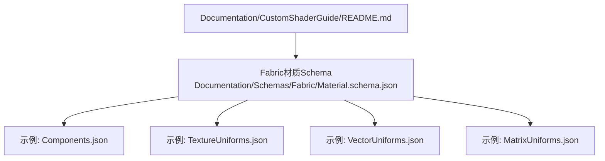
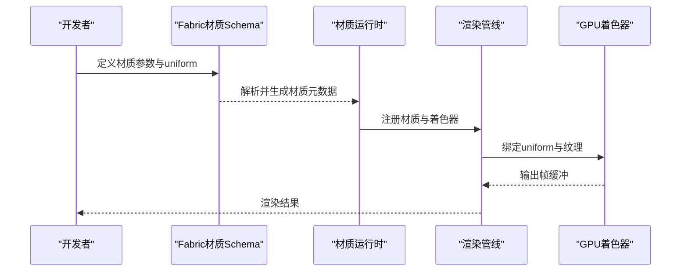
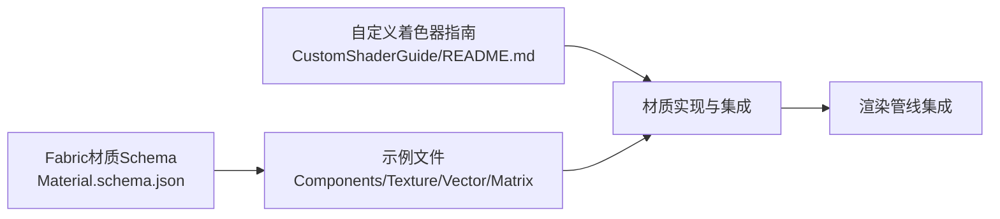

# 自定义材质开发

<cite>
**本文引用的文件**   
- [README.md](file://Documentation/CustomShaderGuide/README.md)
- [Material.schema.json](file://Documentation/Schemas/Fabric/Material.schema.json)
- [Components.json](file://Documentation/Schemas/Fabric/Examples/Components.json)
- [TextureUniforms.json](file://Documentation/Schemas/Fabric/Examples/TextureUniforms.json)
- [VectorUniforms.json](file://Documentation/Schemas/Fabric/Examples/VectorUniforms.json)
- [MatrixUniforms.json](file://Documentation/Schemas/Fabric/Examples/MatrixUniforms.json)
</cite>

## 目录
1. [简介](#简介)
2. [项目结构](#项目结构)
3. [核心组件](#核心组件)
4. [架构总览](#架构总览)
5. [详细组件分析](#详细组件分析)
6. [依赖关系分析](#依赖关系分析)
7. [性能考虑](#性能考虑)
8. [故障排查指南](#故障排查指南)
9. [结论](#结论)
10. [附录](#附录)

## 简介
本指南面向希望基于Cesium材质系统实现自定义材质的开发者，系统性阐述材质系统的设计原理、与渲染管线的集成方式、Material基类的继承方法、着色器编写规范（顶点与片段）、参数定义与绑定机制（uniform传递与动态更新）、纹理系统集成（加载、采样与变换），并提供从简单颜色材质到复杂物理材质的完整开发示例路径。同时包含GLSL编程技巧、性能优化策略与跨平台兼容性处理建议。

## 项目结构
Cesium的材质与着色器相关文档与Schema位于Documentation目录下，其中：
- CustomShaderGuide提供自定义着色器的总体指导
- Fabric Schema定义了材质声明的JSON结构与示例，用于描述uniform、纹理等参数的类型与用法

图表来源
- [README.md:1-200](file://Documentation/CustomShaderGuide/README.md#L1-L200)
- [Material.schema.json:1-200](file://Documentation/Schemas/Fabric/Material.schema.json#L1-L200)
- [Components.json:1-200](file://Documentation/Schemas/Fabric/Examples/Components.json#L1-L200)
- [TextureUniforms.json:1-200](file://Documentation/Schemas/Fabric/Examples/TextureUniforms.json#L1-L200)
- [VectorUniforms.json:1-200](file://Documentation/Schemas/Fabric/Examples/VectorUniforms.json#L1-L200)
- [MatrixUniforms.json:1-200](file://Documentation/Schemas/Fabric/Examples/MatrixUniforms.json#L1-L200)

章节来源
- [README.md:1-200](file://Documentation/CustomShaderGuide/README.md#L1-L200)
- [Material.schema.json:1-200](file://Documentation/Schemas/Fabric/Material.schema.json#L1-L200)
- [Components.json:1-200](file://Documentation/Schemas/Fabric/Examples/Components.json#L1-L200)
- [TextureUniforms.json:1-200](file://Documentation/Schemas/Fabric/Examples/TextureUniforms.json#L1-L200)
- [VectorUniforms.json:1-200](file://Documentation/Schemas/Fabric/Examples/VectorUniforms.json#L1-L200)
- [MatrixUniforms.json:1-200](file://Documentation/Schemas/Fabric/Examples/MatrixUniforms.json#L1-L200)

## 核心组件
- 材质声明与Schema
  - 通过Fabric材质Schema定义材质的属性、uniform类型、默认值与约束，确保材质在运行时可被正确解析与编译。
  - 示例文件展示了如何声明向量、矩阵、纹理等uniform，以及如何在材质中组合使用这些参数。
- 自定义着色器指南
  - 提供编写顶点与片段着色器的规范，包括输入输出约定、内置变量、精度控制与跨平台注意事项。
- 材质参数与绑定
  - uniform变量的类型映射、命名约定、生命周期管理与动态更新策略由材质系统与渲染管线共同保障。
- 纹理系统集成
  - 纹理资源的加载、缓存、采样模式与坐标变换在材质声明中通过纹理uniform进行配置，并在渲染阶段由引擎注入。

章节来源
- [README.md:1-200](file://Documentation/CustomShaderGuide/README.md#L1-L200)
- [Material.schema.json:1-200](file://Documentation/Schemas/Fabric/Material.schema.json#L1-L200)
- [Components.json:1-200](file://Documentation/Schemas/Fabric/Examples/Components.json#L1-L200)
- [TextureUniforms.json:1-200](file://Documentation/Schemas/Fabric/Examples/TextureUniforms.json#L1-L200)
- [VectorUniforms.json:1-200](file://Documentation/Schemas/Fabric/Examples/VectorUniforms.json#L1-L200)
- [MatrixUniforms.json:1-200](file://Documentation/Schemas/Fabric/Examples/MatrixUniforms.json#L1-L200)

## 架构总览
下图展示材质系统在Cesium中的高层流程：材质声明经Schema校验后生成着色器程序，渲染时由引擎将uniform与纹理资源绑定至GPU，最终在顶点与片段阶段完成像素计算与输出。

图表来源
- [README.md:1-200](file://Documentation/CustomShaderGuide/README.md#L1-L200)
- [Material.schema.json:1-200](file://Documentation/Schemas/Fabric/Material.schema.json#L1-L200)

## 详细组件分析

### 材质参数与uniform绑定机制
- 参数类型与映射
  - 向量uniform：支持float、vec2、vec3、vec4等类型，适合表示颜色、方向、强度等标量或矢量数据。
  - 矩阵uniform：支持mat2、mat3、mat4等类型，常用于模型视图投影矩阵、法线变换矩阵等。
  - 纹理uniform：支持2D、立方体贴图等，用于采样贴图、法线贴图、环境贴图。
- 动态更新策略
  - 每帧更新：适用于时间相关的动画、相机矩阵、光照参数等。
  - 条件更新：仅在参数变化时更新，减少CPU-GPU同步开销。
  - 批量更新：对多个对象共享的uniform进行合并更新，降低状态切换成本。
- 命名与可见性
  - 遵循统一的命名约定，避免与内置变量冲突。
  - 通过Schema明确uniform的访问范围与默认值，提升可维护性。

章节来源
- [VectorUniforms.json:1-200](file://Documentation/Schemas/Fabric/Examples/VectorUniforms.json#L1-L200)
- [MatrixUniforms.json:1-200](file://Documentation/Schemas/Fabric/Examples/MatrixUniforms.json#L1-L200)
- [TextureUniforms.json:1-200](file://Documentation/Schemas/Fabric/Examples/TextureUniforms.json#L1-L200)
- [Material.schema.json:1-200](file://Documentation/Schemas/Fabric/Material.schema.json#L1-L200)

### 纹理系统集成
- 纹理加载与缓存
  - 通过纹理uniform引用已加载的资源，引擎负责纹理的创建、复用与释放。
  - 支持多种压缩格式与KTX2等现代纹理格式，提升带宽利用率。
- 采样与变换
  - 在片段着色器中使用纹理采样函数获取颜色或法线等信息。
  - 通过纹理坐标变换实现平铺、偏移、旋转等效果。
- 多通道与混合
  - 支持多纹理通道叠加，结合alpha混合实现半透明、遮罩等效果。

章节来源
- [TextureUniforms.json:1-200](file://Documentation/Schemas/Fabric/Examples/TextureUniforms.json#L1-L200)
- [Material.schema.json:1-200](file://Documentation/Schemas/Fabric/Material.schema.json#L1-L200)

### 着色器编写规范
- 顶点着色器
  - 输入：位置、法线、切线、UV等几何属性。
  - 输出：传递给片段阶段的插值变量（如UV、法线、世界空间位置）。
  - 注意：保持高精度计算，避免不必要的分支与函数调用。
- 片段着色器
  - 输入：来自顶点阶段的插值变量与uniform参数。
  - 输出：最终颜色与深度值。
  - 注意：合理使用内置函数，避免过度复杂的数学运算。
- 跨平台兼容性
  - 针对不同GPU后端（WebGL/WebGL2）调整精度限定符与扩展使用。
  - 避免使用未广泛支持的GLSL特性，必要时提供降级方案。

章节来源
- [README.md:1-200](file://Documentation/CustomShaderGuide/README.md#L1-L200)

### 材质开发示例路径
- 简单颜色材质
  - 目标：实现基础纯色材质，验证uniform传递与片段着色器输出。
  - 步骤：定义颜色uniform -> 在片段着色器中直接输出 -> 绑定到材质实例。
- 纹理贴图材质
  - 目标：实现带纹理的材质，支持UV采样与基本变换。
  - 步骤：定义纹理uniform -> 在片段着色器中采样纹理 -> 应用纹理坐标变换。
- 物理材质（PBR）
  - 目标：实现基于物理的渲染材质，支持漫反射、镜面反射、粗糙度、金属度等。
  - 步骤：定义PBR参数uniform -> 实现BRDF计算 -> 整合光照模型与环境贴图。

章节来源
- [Components.json:1-200](file://Documentation/Schemas/Fabric/Examples/Components.json#L1-L200)
- [TextureUniforms.json:1-200](file://Documentation/Schemas/Fabric/Examples/TextureUniforms.json#L1-L200)
- [VectorUniforms.json:1-200](file://Documentation/Schemas/Fabric/Examples/VectorUniforms.json#L1-L200)
- [MatrixUniforms.json:1-200](file://Documentation/Schemas/Fabric/Examples/MatrixUniforms.json#L1-L200)

## 依赖关系分析
材质系统依赖以下关键组件：
- Fabric材质Schema：定义材质声明的结构与约束
- 自定义着色器指南：提供着色器编写规范与最佳实践
- 示例文件：展示uniform与纹理的使用方式

图表来源
- [Material.schema.json:1-200](file://Documentation/Schemas/Fabric/Material.schema.json#L1-L200)
- [README.md:1-200](file://Documentation/CustomShaderGuide/README.md#L1-L200)
- [Components.json:1-200](file://Documentation/Schemas/Fabric/Examples/Components.json#L1-L200)
- [TextureUniforms.json:1-200](file://Documentation/Schemas/Fabric/Examples/TextureUniforms.json#L1-L200)
- [VectorUniforms.json:1-200](file://Documentation/Schemas/Fabric/Examples/VectorUniforms.json#L1-L200)
- [MatrixUniforms.json:1-200](file://Documentation/Schemas/Fabric/Examples/MatrixUniforms.json#L1-L200)

## 性能考虑
- 减少状态切换：合并相同材质的绘制批次，降低uniform与纹理切换成本。
- 优化着色器复杂度：避免在片段着色器中进行高代价计算，尽量在CPU端预处理。
- 纹理压缩与Mipmap：使用合适的纹理格式与Mipmap层级，减少内存占用与带宽消耗。
- 动态更新频率：对高频更新的uniform采用增量更新策略，避免全量重算。
- 跨平台适配：针对不同GPU能力选择适当的精度与特性集，确保稳定运行。

## 故障排查指南
- 着色器编译失败
  - 检查GLSL语法与精度限定符是否符合目标平台要求。
  - 确认uniform名称与类型与Schema定义一致。
- 纹理未显示或异常
  - 验证纹理资源路径与加载状态。
  - 检查纹理坐标与采样模式是否正确。
- 性能瓶颈
  - 使用性能分析工具定位热点函数与状态切换。
  - 简化着色器逻辑，减少分支与函数调用。

## 结论
通过遵循Cesium材质系统的Schema规范与着色器编写指南，开发者可以高效地实现从简单到复杂的自定义材质。合理管理uniform与纹理资源、优化着色器性能并确保跨平台兼容性，是构建高质量渲染效果的关键。

## 附录
- 参考文件清单
  - 材质Schema与示例：用于理解参数定义与绑定方式
  - 自定义着色器指南：用于掌握着色器编写规范与最佳实践