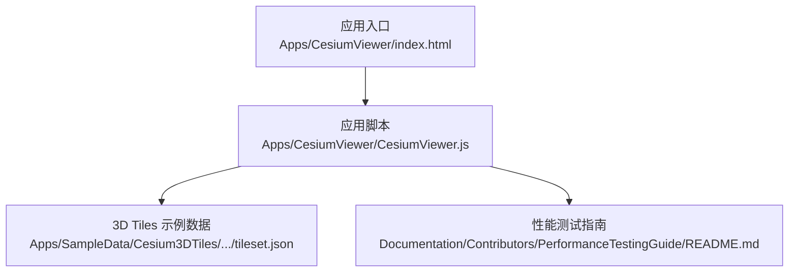
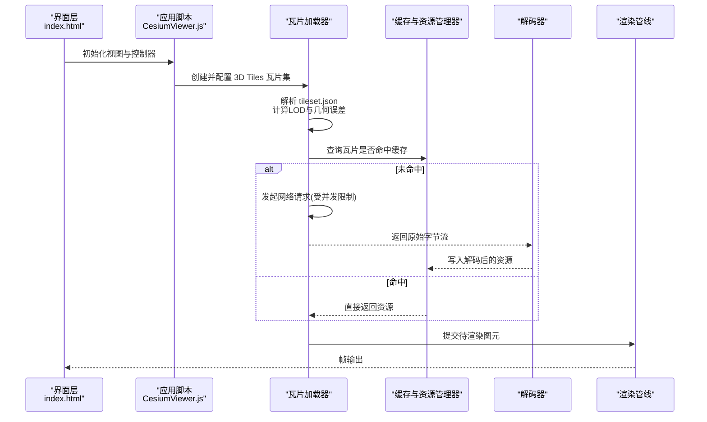
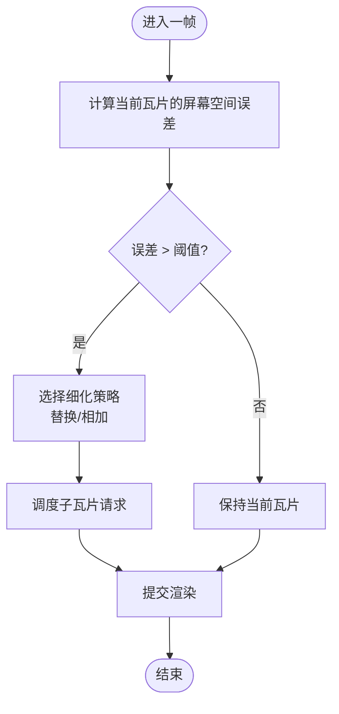
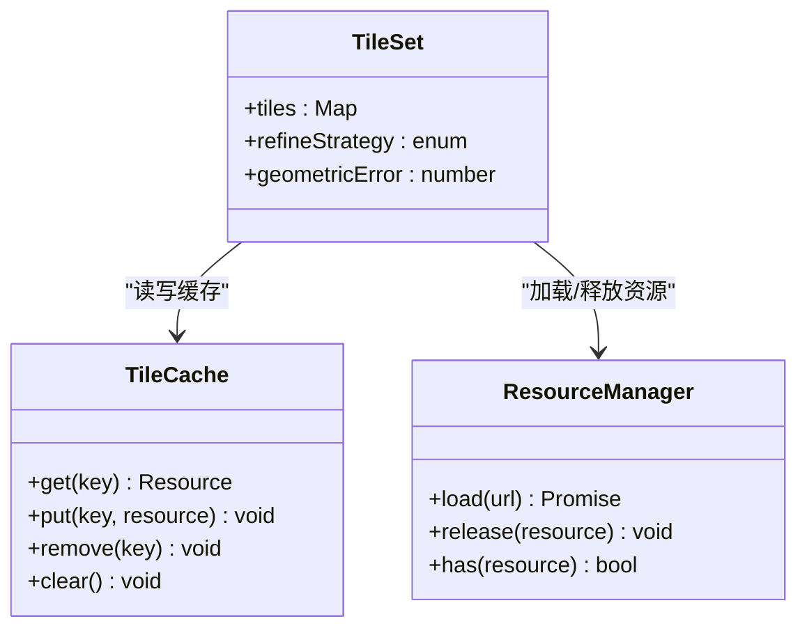
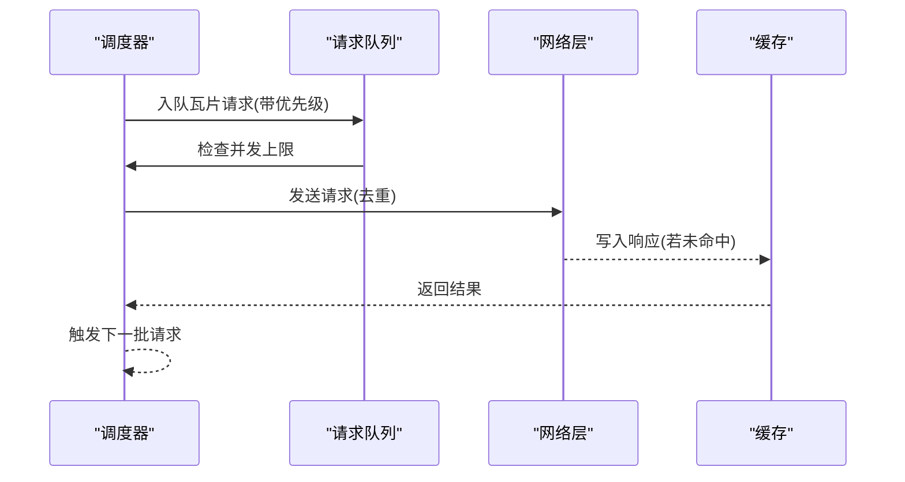
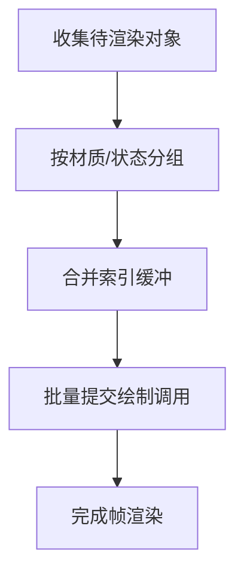
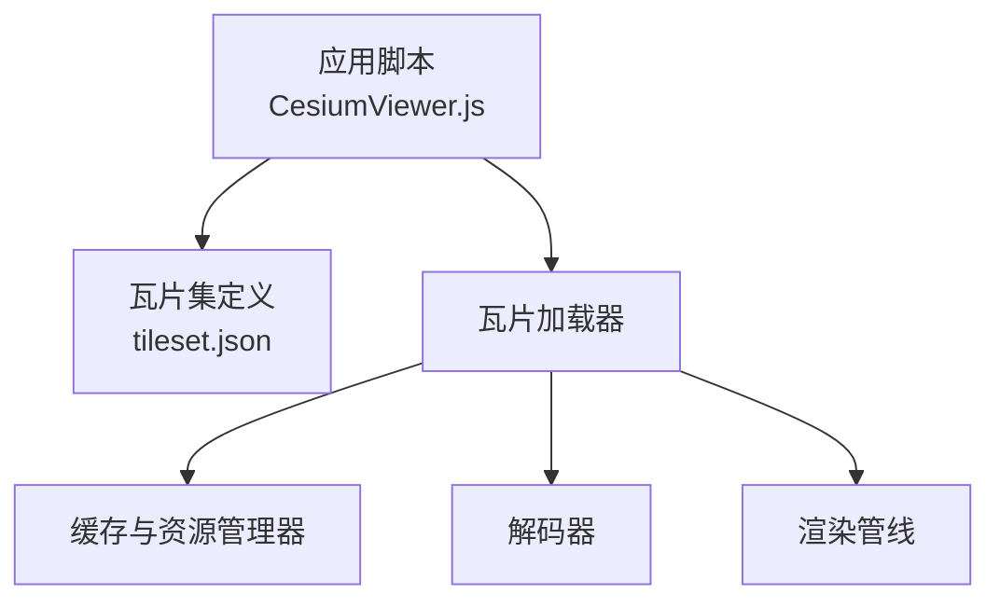

# 3D Tiles性能优化

<cite>
**本文引用的文件**   
- [README.md](file://README.md)
- [CesiumViewer.js](file://Apps/CesiumViewer/CesiumViewer.js)
- [index.html](file://Apps/CesiumViewer/index.html)
- [tileset.json](file://Apps/SampleData/Cesium3DTiles/Tilesets/Tileset/tileset.json)
- [PerformanceTestingGuide/README.md](file://Documentation/Contributors/PerformanceTestingGuide/README.md)
</cite>

## 目录
1. [简介](#简介)
2. [项目结构](#项目结构)
3. [核心组件](#核心组件)
4. [架构总览](#架构总览)
5. [详细组件分析](#详细组件分析)
6. [依赖分析](#依赖分析)
7. [性能考虑](#性能考虑)
8. [故障排查指南](#故障排查指南)
9. [结论](#结论)
10. [附录](#附录)

## 简介
本技术文档聚焦于在 Cesium 中加载与渲染 3D Tiles 时的性能优化，覆盖以下关键主题：
- LOD（多细节层次）策略配置与几何误差阈值设置
- 瓦片缓存机制与资源卸载策略
- 网络传输优化：并发控制与增量更新
- GPU 资源优化：批处理合并与状态改变最小化
- 性能监控工具与基准测试方法
- 常见性能问题的诊断与解决方案

目标读者包括前端开发者、图形工程师以及需要在大场景下高效展示 3D Tiles 的工程师。

## 项目结构
仓库包含示例应用、示例数据、文档与测试等。与 3D Tiles 性能相关的关键位置如下：
- 示例应用入口与初始化逻辑位于 Apps/CesiumViewer 目录
- 3D Tiles 示例数据位于 Apps/SampleData/Cesium3DTiles 下的多个 tileset.json 与内容资源
- 性能测试指南位于 Documentation/Contributors/PerformanceTestingGuide

图表来源
- [index.html](file://Apps/CesiumViewer/index.html)
- [CesiumViewer.js](file://Apps/CesiumViewer/CesiumViewer.js)
- [tileset.json](file://Apps/SampleData/Cesium3DTiles/Tilesets/Tileset/tileset.json)
- [PerformanceTestingGuide/README.md](file://Documentation/Contributors/PerformanceTestingGuide/README.md)

章节来源
- [README.md](file://README.md)
- [CesiumViewer.js](file://Apps/CesiumViewer/CesiumViewer.js)
- [index.html](file://Apps/CesiumViewer/index.html)
- [tileset.json](file://Apps/SampleData/Cesium3DTiles/Tilesets/Tileset/tileset.json)
- [PerformanceTestingGuide/README.md](file://Documentation/Contributors/PerformanceTestingGuide/README.md)

## 核心组件
围绕 3D Tiles 的性能优化，涉及以下核心方面：
- 瓦片集与层级管理：通过 tileset.json 描述根瓦片、子瓦片、边界体与几何误差等元信息
- 视锥剔除与距离评估：根据相机位置与瓦片边界体进行可见性判断
- 调度与加载：按优先级调度瓦片请求，支持并发限制与去重
- 解码与构建：将二进制或压缩格式解码为可渲染资源
- 渲染与批处理：合并绘制调用，减少状态切换
- 内存与缓存：管理已加载瓦片与资源的生命周期，按需释放

章节来源
- [tileset.json](file://Apps/SampleData/Cesium3DTiles/Tilesets/Tileset/tileset.json)
- [CesiumViewer.js](file://Apps/CesiumViewer/CesiumViewer.js)

## 架构总览
下图展示了从应用启动到瓦片加载、解码与渲染的整体流程，并标注了与性能相关的环节。

图表来源
- [index.html](file://Apps/CesiumViewer/index.html)
- [CesiumViewer.js](file://Apps/CesiumViewer/CesiumViewer.js)
- [tileset.json](file://Apps/SampleData/Cesium3DTiles/Tilesets/Tileset/tileset.json)

## 详细组件分析

### LOD 策略与几何误差阈值
- 几何误差阈值用于衡量瓦片在屏幕空间的近似误差，结合相机距离与视场角决定是否需要细化到子瓦片
- 常见的细化策略包括替换（用子瓦片替代父瓦片）与相加（同时显示父与子），具体由瓦片集的元数据与应用配置共同决定
- 合理设置几何误差阈值可在保证视觉质量的同时降低渲染压力

章节来源
- [tileset.json](file://Apps/SampleData/Cesium3DTiles/Tilesets/Tileset/tileset.json)

### 瓦片缓存与资源卸载
- 缓存策略通常基于瓦片键（如坐标、级别、内容标识）进行存储，避免重复下载与解码
- 资源卸载需考虑引用计数与使用频率，对长时间不可见且占用较大的资源优先释放
- 建议为不同数据类型（几何、纹理、材质）分别管理缓存，便于精细化控制

图表来源
- [CesiumViewer.js](file://Apps/CesiumViewer/CesiumViewer.js)
- [tileset.json](file://Apps/SampleData/Cesium3DTiles/Tilesets/Tileset/tileset.json)

### 网络传输优化
- 并发控制：限制同一时间内的瓦片请求数量，避免浏览器连接池耗尽与服务器过载
- 去重与优先级：对相同瓦片请求进行去重；根据距离与重要性分配优先级，优先加载近处与高价值瓦片
- 增量更新：利用瓦片的时间戳或版本字段实现增量拉取，减少不必要的全量下载

章节来源
- [CesiumViewer.js](file://Apps/CesiumViewer/CesiumViewer.js)

### GPU 资源优化
- 批处理合并：将具有相同材质与状态的图元合并绘制，减少 draw call
- 状态改变最小化：尽量复用纹理、着色器与缓冲区，避免频繁切换状态
- 实例化与索引缓冲：对重复几何使用实例化渲染，提升吞吐

章节来源
- [CesiumViewer.js](file://Apps/CesiumViewer/CesiumViewer.js)

### 性能监控与基准测试
- 指标采集：帧率、瓦片加载耗时、解码耗时、GPU 绘制次数与顶点数、内存占用
- 基准测试方法：固定相机路径与视角变化，记录关键指标随时间的变化曲线
- 对比实验：在不同几何误差阈值、并发上限与缓存策略下进行对比，量化收益

章节来源
- [PerformanceTestingGuide/README.md](file://Documentation/Contributors/PerformanceTestingGuide/README.md)

## 依赖分析
3D Tiles 性能优化涉及的模块关系如下：
- 应用脚本负责初始化与参数配置
- 瓦片集定义提供层级结构与误差阈值
- 加载器与缓存协同工作，控制网络与内存
- 解码器与渲染管线负责最终呈现

图表来源
- [CesiumViewer.js](file://Apps/CesiumViewer/CesiumViewer.js)
- [tileset.json](file://Apps/SampleData/Cesium3DTiles/Tilesets/Tileset/tileset.json)

章节来源
- [CesiumViewer.js](file://Apps/CesiumViewer/CesiumViewer.js)
- [tileset.json](file://Apps/SampleData/Cesium3DTiles/Tilesets/Tileset/tileset.json)

## 性能考虑
- 几何误差阈值调优：在移动设备上适当提高阈值以降低复杂度；在桌面端可适当降低以提升细节
- 并发上限：根据设备与网络状况动态调整，避免阻塞主线程
- 缓存大小：依据可用内存与显存容量设定上限，防止 OOM
- 批处理粒度：在保证正确性的前提下尽可能合并绘制，减少状态切换
- 增量更新：启用版本或时间戳字段，减少带宽与解码开销

[本节为通用指导，不直接分析具体文件]

## 故障排查指南
常见问题与定位思路：
- 卡顿与掉帧：检查瓦片加载峰值与解码耗时，确认是否因并发过高导致网络拥塞
- 内存泄漏：观察缓存增长趋势，确认资源是否正确释放与引用计数是否准确
- 闪烁与抖动：检查 LOD 切换时机与几何误差阈值是否过于敏感
- 渲染异常：核对批处理分组与状态切换顺序，确保材质与纹理绑定一致

章节来源
- [PerformanceTestingGuide/README.md](file://Documentation/Contributors/PerformanceTestingGuide/README.md)

## 结论
通过在瓦片集层面合理设置几何误差阈值与细化策略，配合高效的缓存与网络调度，并在渲染阶段进行批处理与状态最小化，可以显著提升 3D Tiles 的大场景加载与渲染性能。建议结合基准测试持续监控关键指标，并根据目标设备与网络环境进行差异化调优。

[本节为总结，不直接分析具体文件]

## 附录
- 示例数据与入口：
  - 应用入口与初始化脚本：[index.html](file://Apps/CesiumViewer/index.html)、[CesiumViewer.js](file://Apps/CesiumViewer/CesiumViewer.js)
  - 瓦片集定义示例：[tileset.json](file://Apps/SampleData/Cesium3DTiles/Tilesets/Tileset/tileset.json)
- 性能测试参考：
  - 性能测试指南：[PerformanceTestingGuide/README.md](file://Documentation/Contributors/PerformanceTestingGuide/README.md)