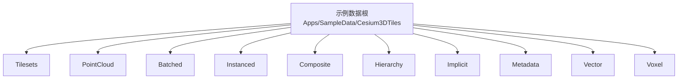
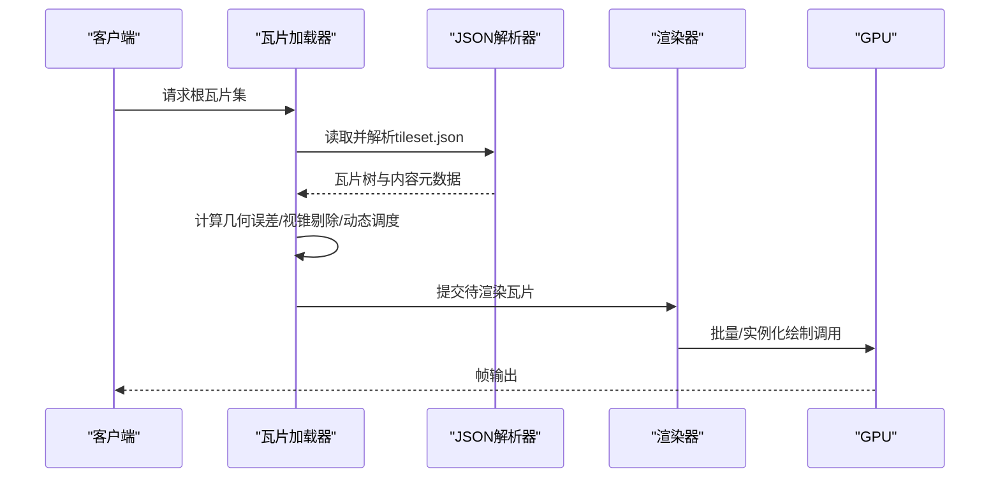
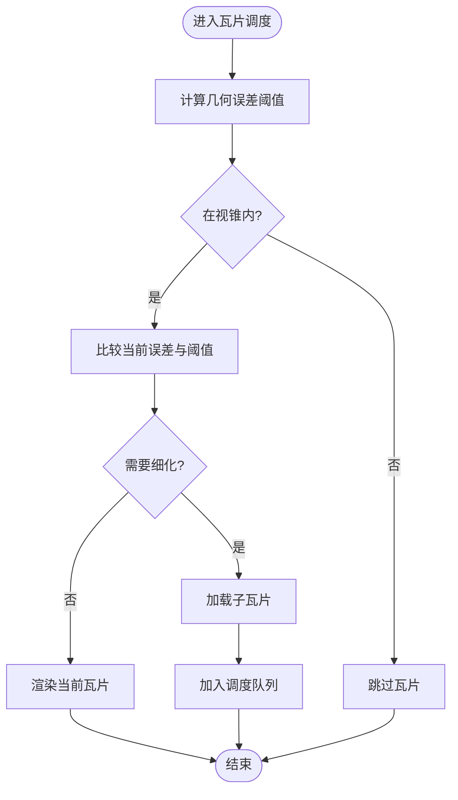
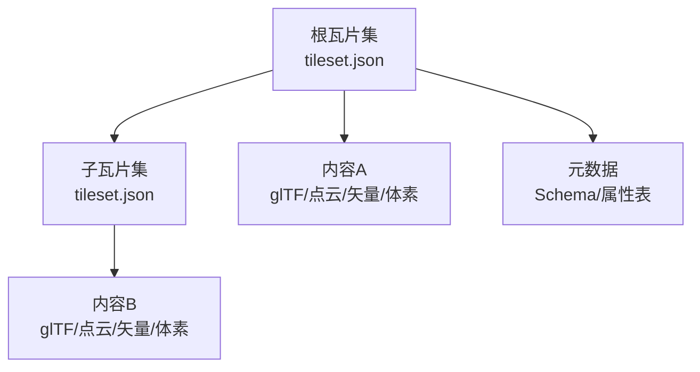

# 3D Tiles数据提供者

<cite>
**本文引用的文件**   
- [Apps/SampleData/Cesium3DTiles/Tilesets/Tileset/tileset.json](file://Apps/SampleData/Cesium3DTiles/Tilesets/Tileset/tileset.json)
- [Apps/SampleData/Cesium3DTiles/PointCloud/PointCloudRGB/tileset.json](file://Apps/SampleData/Cesium3DTiles/PointCloud/PointCloudRGB/tileset.json)
- [Apps/SampleData/Cesium3DTiles/PointCloud/PointCloudNormals/tileset.json](file://Apps/SampleData/Cesium3DTiles/PointCloud/PointCloudNormals/tileset.json)
- [Apps/SampleData/Cesium3DTiles/PointCloud/PointCloudWithPerPointProperties/tileset.json](file://Apps/SampleData/Cesium3DTiles/PointCloud/PointCloudWithPerPointProperties/tileset.json)
- [Apps/SampleData/Cesium3DTiles/Batched/BatchedWithBatchTable/tileset.json](file://Apps/SampleData/Cesium3DTiles/Batched/BatchedWithBatchTable/tileset.json)
- [Apps/SampleData/Cesium3DTiles/Instanced/InstancedWithBatchTable/tileset.json](file://Apps/SampleData/Cesium3DTiles/Instanced/InstancedWithBatchTable/tileset.json)
- [Apps/SampleData/Cesium3DTiles/Composite/Composite/tileset.json](file://Apps/SampleData/Cesium3DTiles/Composite/Composite/tileset.json)
- [Apps/SampleData/Cesium3DTiles/Hierarchy/BatchTableHierarchy/tileset.json](file://Apps/SampleData/Cesium3DTiles/Hierarchy/BatchTableHierarchy/tileset.json)
- [Apps/SampleData/Cesium3DTiles/Implicit/ImplicitRootTile/tileset.json](file://Apps/SampleData/Cesium3DTiles/Implicit/ImplicitRootTile/tileset.json)
- [Apps/SampleData/Cesium3DTiles/Implicit/ImplicitMultipleContents/tileset.json](file://Apps/SampleData/Cesium3DTiles/Implicit/ImplicitMultipleContents/tileset.json)
- [Apps/SampleData/Cesium3DTiles/Metadata/AllMetadataTypes/tileset.json](file://Apps/SampleData/Cesium3DTiles/Metadata/AllMetadataTypes/tileset.json)
- [Apps/SampleData/Cesium3DTiles/Metadata/ExternalSchema/tileset.json](file://Apps/SampleData/Cesium3DTiles/Metadata/ExternalSchema/tileset.json)
- [Apps/SampleData/Cesium3DTiles/Metadata/PropertyAttributesPointCloud/tileset.json](file://Apps/SampleData/Cesium3DTiles/Metadata/PropertyAttributesPointCloud/tileset.json)
- [Apps/SampleData/Cesium3DTiles/Vector/VectorTilePoints/tileset.json](file://Apps/SampleData/Cesium3DTiles/Vector/VectorTilePoints/tileset.json)
- [Apps/SampleData/Cesium3DTiles/Voxel/VoxelBox3DTiles/tileset.json](file://Apps/SampleData/Cesium3DTiles/Voxel/VoxelBox3DTiles/tileset.json)
</cite>

## 目录
1. [简介](#简介)
2. [项目结构](#项目结构)
3. [核心组件](#核心组件)
4. [架构总览](#架构总览)
5. [详细组件分析](#详细组件分析)
6. [依赖关系分析](#依赖关系分析)
7. [性能考量](#性能考量)
8. [故障排查指南](#故障排查指南)
9. [结论](#结论)
10. [附录](#附录)

## 简介
本技术文档面向“3D Tiles数据提供者”的实现与使用，聚焦以下目标：
- 解释3D Tiles格式规范与层级组织方式，包括tileset.json的完整语法与语义。
- 深入阐述LOD系统实现：几何误差、视锥剔除与动态加载策略。
- 说明批处理渲染机制（Batched与Instanced）及性能优化要点。
- 解析点云数据处理流程：RGB颜色、法向量与属性表支持。
- 提供3D Tiles数据生成工具链与最佳实践指南。

## 项目结构
仓库中包含大量3D Tiles示例数据，覆盖多种内容类型与元数据场景，便于理解不同tileset.json配置与数据组织方式。关键目录与用途如下：
- Tilesets：根级与子级tileset组合、替换、外部资源等场景。
- PointCloud：点云数据（RGB、法向、量化、时间动态、Draco压缩等）。
- Batched/Instanced：批处理与实例化模型集合。
- Composite：复合瓦片集。
- Hierarchy：基于Batch Table的层次结构。
- Implicit：隐式瓦片树与多内容瓦片。
- Metadata：结构化元数据、外部Schema、属性表等。
- Vector：矢量瓦片（点、线、面）。
- Voxel：体素瓦片。

[本节为概念性概述，不直接分析具体文件]

## 核心组件
- tileset.json：描述瓦片集根节点、子瓦片、内容、边界体积、几何误差、变换、过期策略、元数据等。
- 瓦片内容：glTF/glb、点云、矢量、体素等。
- 元数据与属性表：Batch Table、Structural Metadata、外部Schema。
- 隐式瓦片树：通过规则自动生成子瓦片与内容路径。
- 复合瓦片集：组合多个瓦片集或内容源。

本节为总体说明，不直接分析具体文件

## 架构总览
从数据到渲染的关键链路：
- 客户端请求根tileset.json，解析层级与LOD信息。
- 根据相机位置、视锥与几何误差进行瓦片选择与动态加载。
- 对Batched/Instanced内容进行批处理合并与GPU高效绘制。
- 对点云数据进行着色与属性映射，必要时应用法向与颜色。
- 对矢量与体素数据进行专用管线渲染。

[本图为概念性流程图，不直接映射具体源码文件]

## 详细组件分析

### tileset.json 语法与语义
- 根字段：version、asset、geometricError、transform、boundingVolume、content、children、extras、extensions、extensionRequired、availability、viewerRequestVolume、refine、batchId、batchTable、hierarchy、metadata、subtrees等。
- 内容类型：gltfContent、pointContent、vectorContent、voxelContent、compositeContent等。
- 边界体积：box、region、sphere。
- 元数据：structuralMetadata、externalSchemas、propertyAttributes等。
- 隐式瓦片：implicitTiling、implicitContent等。
- 复合瓦片：compositions、contents等。

参考示例路径（用于对照字段与用法）：
- [Apps/SampleData/Cesium3DTiles/Tilesets/Tileset/tileset.json](file://Apps/SampleData/Cesium3DTiles/Tilesets/Tileset/tileset.json)
- [Apps/SampleData/Cesium3DTiles/Composite/Composite/tileset.json](file://Apps/SampleData/Cesium3DTiles/Composite/Composite/tileset.json)
- [Apps/SampleData/Cesium3DTiles/Hierarchy/BatchTableHierarchy/tileset.json](file://Apps/SampleData/Cesium3DTiles/Hierarchy/BatchTableHierarchy/tileset.json)
- [Apps/SampleData/Cesium3DTiles/Implicit/ImplicitRootTile/tileset.json](file://Apps/SampleData/Cesium3DTiles/Implicit/ImplicitRootTile/tileset.json)
- [Apps/SampleData/Cesium3DTiles/Implicit/ImplicitMultipleContents/tileset.json](file://Apps/SampleData/Cesium3DTiles/Implicit/ImplicitMultipleContents/tileset.json)
- [Apps/SampleData/Cesium3DTiles/Metadata/AllMetadataTypes/tileset.json](file://Apps/SampleData/Cesium3DTiles/Metadata/AllMetadataTypes/tileset.json)
- [Apps/SampleData/Cesium3DTiles/Metadata/ExternalSchema/tileset.json](file://Apps/SampleData/Cesium3DTiles/Metadata/ExternalSchema/tileset.json)
- [Apps/SampleData/Cesium3DTiles/Metadata/PropertyAttributesPointCloud/tileset.json](file://Apps/SampleData/Cesium3DTiles/Metadata/PropertyAttributesPointCloud/tileset.json)
- [Apps/SampleData/Cesium3DTiles/Vector/VectorTilePoints/tileset.json](file://Apps/SampleData/Cesium3DTiles/Vector/VectorTilePoints/tileset.json)
- [Apps/SampleData/Cesium3DTiles/Voxel/VoxelBox3DTiles/tileset.json](file://Apps/SampleData/Cesium3DTiles/Voxel/VoxelBox3DTiles/tileset.json)

章节来源
- [Apps/SampleData/Cesium3DTiles/Tilesets/Tileset/tileset.json](file://Apps/SampleData/Cesium3DTiles/Tilesets/Tileset/tileset.json)
- [Apps/SampleData/Cesium3DTiles/Composite/Composite/tileset.json](file://Apps/SampleData/Cesium3DTiles/Composite/Composite/tileset.json)
- [Apps/SampleData/Cesium3DTiles/Hierarchy/BatchTableHierarchy/tileset.json](file://Apps/SampleData/Cesium3DTiles/Hierarchy/BatchTableHierarchy/tileset.json)
- [Apps/SampleData/Cesium3DTiles/Implicit/ImplicitRootTile/tileset.json](file://Apps/SampleData/Cesium3DTiles/Implicit/ImplicitRootTile/tileset.json)
- [Apps/SampleData/Cesium3DTiles/Implicit/ImplicitMultipleContents/tileset.json](file://Apps/SampleData/Cesium3DTiles/Implicit/ImplicitMultipleContents/tileset.json)
- [Apps/SampleData/Cesium3DTiles/Metadata/AllMetadataTypes/tileset.json](file://Apps/SampleData/Cesium3DTiles/Metadata/AllMetadataTypes/tileset.json)
- [Apps/SampleData/Cesium3DTiles/Metadata/ExternalSchema/tileset.json](file://Apps/SampleData/Cesium3DTiles/Metadata/ExternalSchema/tileset.json)
- [Apps/SampleData/Cesium3DTiles/Metadata/PropertyAttributesPointCloud/tileset.json](file://Apps/SampleData/Cesium3DTiles/Metadata/PropertyAttributesPointCloud/tileset.json)
- [Apps/SampleData/Cesium3DTiles/Vector/VectorTilePoints/tileset.json](file://Apps/SampleData/Cesium3DTiles/Vector/VectorTilePoints/tileset.json)
- [Apps/SampleData/Cesium3DTiles/Voxel/VoxelBox3DTiles/tileset.json](file://Apps/SampleData/Cesium3DTiles/Voxel/VoxelBox3DTiles/tileset.json)

### LOD系统：几何误差、视锥剔除与动态加载
- 几何误差：控制瓦片细化阈值，结合相机距离与屏幕空间误差评估决定是否加载子瓦片。
- 视锥剔除：基于瓦片边界体积（box/region/sphere）快速判断是否可见。
- 动态加载：按优先级队列调度瓦片下载与解码，避免卡顿；支持过期与缓存策略。

[本图为概念性流程图，不直接映射具体源码文件]

### 批处理渲染：Batched与Instanced
- Batched：将多个图元合并为单一绘制调用，减少状态切换，适合静态或低频更新对象集合。
- Instanced：复用同一网格多次绘制，支持每实例变换、缩放、旋转与可选属性，适合重复元素（如树木、路灯）。
- 性能优化要点：
  - 合理划分批次大小，避免单批次过大导致内存与带宽瓶颈。
  - 共享材质与纹理图集，降低状态切换。
  - 使用量化坐标与紧凑属性布局，提升缓存命中。
  - 对透明与不透明混合场景分通道渲染。

参考示例路径：
- [Apps/SampleData/Cesium3DTiles/Batched/BatchedWithBatchTable/tileset.json](file://Apps/SampleData/Cesium3DTiles/Batched/BatchedWithBatchTable/tileset.json)
- [Apps/SampleData/Cesium3DTiles/Instanced/InstancedWithBatchTable/tileset.json](file://Apps/SampleData/Cesium3DTiles/Instanced/InstancedWithBatchTable/tileset.json)

章节来源
- [Apps/SampleData/Cesium3DTiles/Batched/BatchedWithBatchTable/tileset.json](file://Apps/SampleData/Cesium3DTiles/Batched/BatchedWithBatchTable/tileset.json)
- [Apps/SampleData/Cesium3DTiles/Instanced/InstancedWithBatchTable/tileset.json](file://Apps/SampleData/Cesium3DTiles/Instanced/InstancedWithBatchTable/tileset.json)

### 点云数据处理：RGB、法向量与属性表
- RGB颜色：支持标准RGBA/RGB565等编码，可直接作为顶点颜色。
- 法向量：支持显式法向或八叉编码法向，改善光照与视觉质量。
- 属性表：每个点可携带自定义属性（如强度、分类、时间戳），通过属性表与索引关联。
- 压缩与量化：支持Draco压缩与坐标量化，减小体积并加速传输。

参考示例路径：
- [Apps/SampleData/Cesium3DTiles/PointCloud/PointCloudRGB/tileset.json](file://Apps/SampleData/Cesium3DTiles/PointCloud/PointCloudRGB/tileset.json)
- [Apps/SampleData/Cesium3DTiles/PointCloud/PointCloudNormals/tileset.json](file://Apps/SampleData/Cesium3DTiles/PointCloud/PointCloudNormals/tileset.json)
- [Apps/SampleData/Cesium3DTiles/PointCloud/PointCloudWithPerPointProperties/tileset.json](file://Apps/SampleData/Cesium3DTiles/PointCloud/PointCloudWithPerPointProperties/tileset.json)
- [Apps/SampleData/Cesium3DTiles/Metadata/PropertyAttributesPointCloud/tileset.json](file://Apps/SampleData/Cesium3DTiles/Metadata/PropertyAttributesPointCloud/tileset.json)

章节来源
- [Apps/SampleData/Cesium3DTiles/PointCloud/PointCloudRGB/tileset.json](file://Apps/SampleData/Cesium3DTiles/PointCloud/PointCloudRGB/tileset.json)
- [Apps/SampleData/Cesium3DTiles/PointCloud/PointCloudNormals/tileset.json](file://Apps/SampleData/Cesium3DTiles/PointCloud/PointCloudNormals/tileset.json)
- [Apps/SampleData/Cesium3DTiles/PointCloud/PointCloudWithPerPointProperties/tileset.json](file://Apps/SampleData/Cesium3DTiles/PointCloud/PointCloudWithPerPointProperties/tileset.json)
- [Apps/SampleData/Cesium3DTiles/Metadata/PropertyAttributesPointCloud/tileset.json](file://Apps/SampleData/Cesium3DTiles/Metadata/PropertyAttributesPointCloud/tileset.json)

### 矢量与体素瓦片
- 矢量瓦片：包含点、线、面等几何，支持样式与属性表，适合地图要素展示与分析。
- 体素瓦片：以三维栅格存储密度或类别信息，适用于地质、医学与科学可视化。

参考示例路径：
- [Apps/SampleData/Cesium3DTiles/Vector/VectorTilePoints/tileset.json](file://Apps/SampleData/Cesium3DTiles/Vector/VectorTilePoints/tileset.json)
- [Apps/SampleData/Cesium3DTiles/Voxel/VoxelBox3DTiles/tileset.json](file://Apps/SampleData/Cesium3DTiles/Voxel/VoxelBox3DTiles/tileset.json)

章节来源
- [Apps/SampleData/Cesium3DTiles/Vector/VectorTilePoints/tileset.json](file://Apps/SampleData/Cesium3DTiles/Vector/VectorTilePoints/tileset.json)
- [Apps/SampleData/Cesium3DTiles/Voxel/VoxelBox3DTiles/tileset.json](file://Apps/SampleData/Cesium3DTiles/Voxel/VoxelBox3DTiles/tileset.json)

### 元数据与外部Schema
- Structural Metadata：定义属性类型、枚举、范围等，增强数据自描述能力。
- External Schemas：将Schema外置，便于跨数据集共享与版本管理。
- Property Attributes：为点云或图元附加属性，支持查询与样式驱动。

参考示例路径：
- [Apps/SampleData/Cesium3DTiles/Metadata/AllMetadataTypes/tileset.json](file://Apps/SampleData/Cesium3DTiles/Metadata/AllMetadataTypes/tileset.json)
- [Apps/SampleData/Cesium3DTiles/Metadata/ExternalSchema/tileset.json](file://Apps/SampleData/Cesium3DTiles/Metadata/ExternalSchema/tileset.json)
- [Apps/SampleData/Cesium3DTiles/Metadata/PropertyAttributesPointCloud/tileset.json](file://Apps/SampleData/Cesium3DTiles/Metadata/PropertyAttributesPointCloud/tileset.json)

章节来源
- [Apps/SampleData/Cesium3DTiles/Metadata/AllMetadataTypes/tileset.json](file://Apps/SampleData/Cesium3DTiles/Metadata/AllMetadataTypes/tileset.json)
- [Apps/SampleData/Cesium3DTiles/Metadata/ExternalSchema/tileset.json](file://Apps/SampleData/Cesium3DTiles/Metadata/ExternalSchema/tileset.json)
- [Apps/SampleData/Cesium3DTiles/Metadata/PropertyAttributesPointCloud/tileset.json](file://Apps/SampleData/Cesium3DTiles/Metadata/PropertyAttributesPointCloud/tileset.json)

### 隐式瓦片树与多内容瓦片
- 隐式瓦片：通过规则（如四叉树/八叉树）与偏移量自动生成子瓦片路径，无需显式声明所有子节点。
- 多内容瓦片：单个瓦片包含多种内容（如glTF+点云），提高组织灵活性。

参考示例路径：
- [Apps/SampleData/Cesium3DTiles/Implicit/ImplicitRootTile/tileset.json](file://Apps/SampleData/Cesium3DTiles/Implicit/ImplicitRootTile/tileset.json)
- [Apps/SampleData/Cesium3DTiles/Implicit/ImplicitMultipleContents/tileset.json](file://Apps/SampleData/Cesium3DTiles/Implicit/ImplicitMultipleContents/tileset.json)

章节来源
- [Apps/SampleData/Cesium3DTiles/Implicit/ImplicitRootTile/tileset.json](file://Apps/SampleData/Cesium3DTiles/Implicit/ImplicitRootTile/tileset.json)
- [Apps/SampleData/Cesium3DTiles/Implicit/ImplicitMultipleContents/tileset.json](file://Apps/SampleData/Cesium3DTiles/Implicit/ImplicitMultipleContents/tileset.json)

## 依赖关系分析
- 瓦片集依赖：根瓦片集可能引用子瓦片集（复合瓦片），形成组合关系。
- 内容依赖：瓦片内容指向glTF/glb、点云、矢量或体素文件。
- 元数据依赖：外部Schema与属性表独立于瓦片内容，但被瓦片引用。

[本图为概念性依赖图，不直接映射具体源码文件]

## 性能考量
- 瓦片粒度：平衡瓦片数量与单瓦片大小，避免过多小瓦片导致频繁IO与状态切换。
- 几何误差调优：根据场景尺度与显示设备调整阈值，确保近处细节与远处概览的平衡。
- 批处理规模：合理合并图元，避免单次绘制调用过大造成内存峰值。
- 压缩与量化：优先使用Draco与量化格式，降低网络与显存占用。
- 缓存策略：启用HTTP缓存与本地缓存，减少重复下载。
- 异步调度：采用优先级队列与预取策略，平滑加载曲线。

[本节为通用指导，不直接分析具体文件]

## 故障排查指南
- tileset.json校验失败：检查必填字段（version、asset、geometricError、boundingVolume、content/children）、路径相对性与引用完整性。
- 瓦片无法加载：确认服务器CORS与MIME类型正确，路径可达且未被拦截。
- 渲染异常（闪烁/缺失）：核查几何误差与视锥剔除参数，检查边界体积是否过小或过大。
- 点云颜色/法向异常：确认编码格式与属性表索引一致，检查量化与压缩参数。
- 元数据不可用：验证外部Schema路径与版本兼容，确保属性ID与类型匹配。

[本节为通用指导，不直接分析具体文件]

## 结论
3D Tiles通过标准化的瓦片组织与元数据体系，实现了大规模三维数据的可扩展、高性能呈现。结合合理的LOD策略、批处理与实例化渲染、以及点云与矢量/体素的专用管线，可在复杂场景中取得良好的交互体验与渲染效率。遵循本文的最佳实践与工具链建议，有助于构建稳定高效的3D Tiles数据提供者。

[本节为总结性内容，不直接分析具体文件]

## 附录
- 生成工具链建议：
  - glTF转3D Tiles：使用官方转换工具链，设置合适的瓦片尺寸与几何误差。
  - 点云处理：使用LAS/LAZ转点云瓦片工具，启用Draco压缩与量化。
  - 矢量瓦片：将GeoJSON/Shapefile转换为矢量瓦片，配置样式与属性表。
  - 体素瓦片：使用体素化工具生成3D栅格，并按层级切块。
- 最佳实践清单：
  - 统一坐标系与基准椭球，确保地理定位准确。
  - 分层组织数据，按主题或区域拆分瓦片集。
  - 使用外部Schema集中管理属性定义，便于维护与复用。
  - 定期校验瓦片集与内容一致性，自动化测试覆盖率。

[本节为补充信息，不直接分析具体文件]