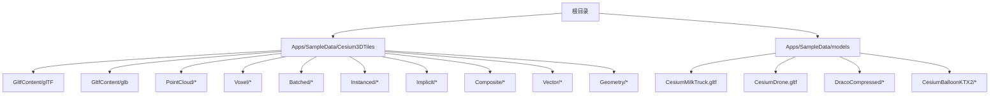
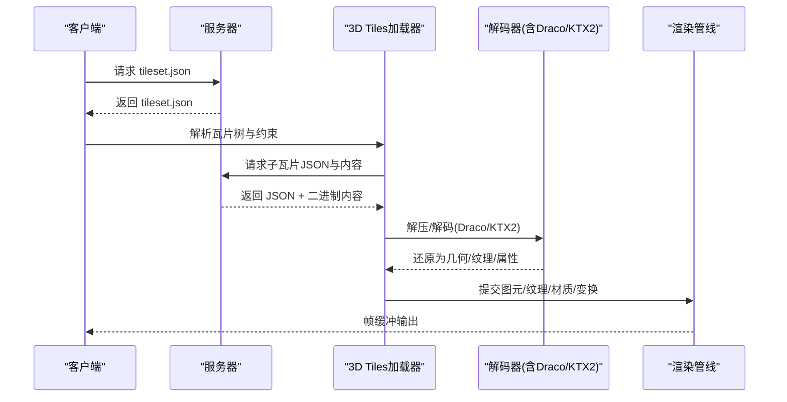
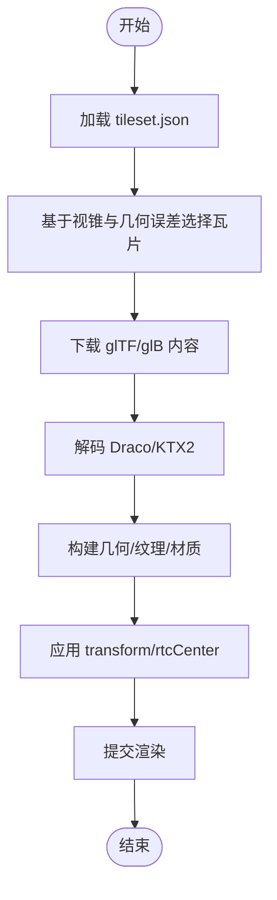
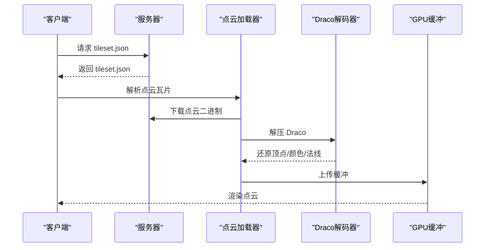
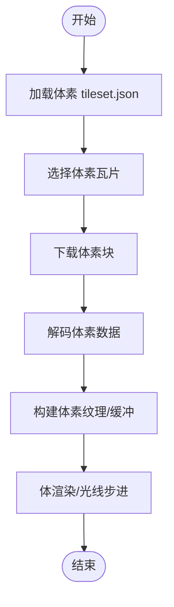
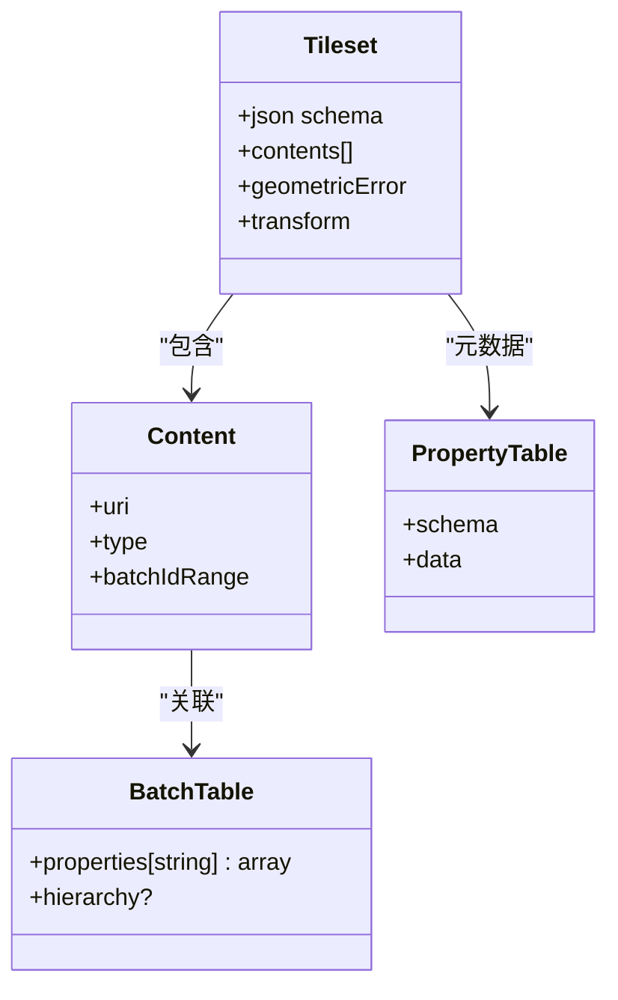
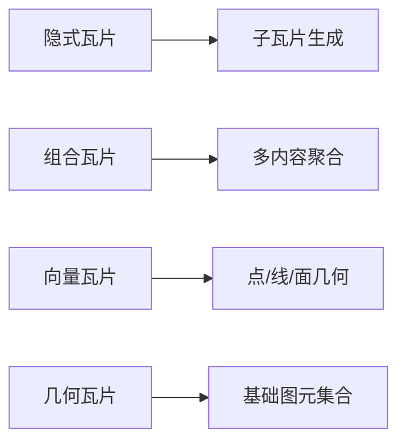
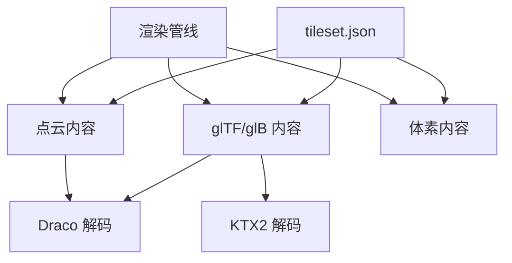

# 3D Tiles数据类型

<cite>
**本文引用的文件**   
- [README.md](file://README.md)
- [Apps/SampleData/Cesium3DTiles/PointCloud/PointCloudDraco/tileset.json](file://Apps/SampleData/Cesium3DTiles/PointCloud/PointCloudDraco/tileset.json)
- [Apps/SampleData/Cesium3DTiles/PointCloud/PointCloudRGB/tileset.json](file://Apps/SampleData/Cesium3DTiles/PointCloud/PointCloudRGB/tileset.json)
- [Apps/SampleData/Cesium3DTiles/Voxel/VoxelBox3DTiles/tileset.json](file://Apps/SampleData/Cesium3DTiles/Voxel/VoxelBox3DTiles/tileset.json)
- [Apps/SampleData/models/CesiumMilkTruck/CesiumMilkTruck.gltf](file://Apps/SampleData/models/CesiumMilkTruck/CesiumMilkTruck.gltf)
- [Apps/SampleData/models/CesiumDrone/CesiumDrone.gltf](file://Apps/SampleData/models/CesiumDrone/CesiumDrone.gltf)
- [Apps/SampleData/models/DracoCompressed/CesiumMilkTruck.gltf](file://Apps/SampleData/models/DracoCompressed/CesiumMilkTruck.gltf)
- [Apps/SampleData/models/CesiumBalloonKTX2/CesiumBalloonKTX2.gltf](file://Apps/SampleData/models/CesiumBalloonKTX2/CesiumBalloonKTX2.gltf)
- [Apps/SampleData/Cesium3DTiles/GltfContent/glTF/tileset_1.1.json](file://Apps/SampleData/Cesium3DTiles/GltfContent/glTF/tileset_1.1.json)
- [Apps/SampleData/Cesium3DTiles/GltfContent/glb/tileset_1.1.json](file://Apps/SampleData/Cesium3DTiles/GltfContent/glb/tileset_1.1.json)
- [Apps/SampleData/Cesium3DTiles/Batched/BatchedWithBatchTable/tileset.json](file://Apps/SampleData/Cesium3DTiles/Batched/BatchedWithBatchTable/tileset.json)
- [Apps/SampleData/Cesium3DTiles/Instanced/InstancedWithBatchTable/tileset.json](file://Apps/SampleData/Cesium3DTiles/Instanced/InstancedWithBatchTable/tileset.json)
- [Apps/SampleData/Cesium3DTiles/PointCloud/PointCloudWithPerPointProperties/tileset.json](file://Apps/SampleData/Cesium3DTiles/PointCloud/PointCloudWithPerPointProperties/tileset.json)
- [Apps/SampleData/Cesium3DTiles/PointCloud/PointCloudTimeDynamic/tileset.json](file://Apps/SampleData/Cesium3DTiles/PointCloud/PointCloudTimeDynamic/tileset.json)
- [Apps/SampleData/Cesium3DTiles/Hierarchy/BatchTableHierarchy/tileset.json](file://Apps/SampleData/Cesium3DTiles/Hierarchy/BatchTableHierarchy/tileset.json)
- [Apps/SampleData/Cesium3DTiles/Metadata/AllMetadataTypes/tileset.json](file://Apps/SampleData/Cesium3DTiles/Metadata/AllMetadataTypes/tileset.json)
- [Apps/SampleData/Cesium3DTiles/Implicit/ImplicitTileset/tileset.json](file://Apps/SampleData/Cesium3DTiles/Implicit/ImplicitTileset/tileset.json)
- [Apps/SampleData/Cesium3DTiles/Implicit/ImplicitMultipleContents/tileset.json](file://Apps/SampleData/Cesium3DTiles/Implicit/ImplicitMultipleContents/tileset.json)
- [Apps/SampleData/Cesium3DTiles/Composite/Composite/tileset.json](file://Apps/SampleData/Cesium3DTiles/Composite/Composite/tileset.json)
- [Apps/SampleData/Cesium3DTiles/Vector/VectorTilePoints/tileset.json](file://Apps/SampleData/Cesium3DTiles/Vector/VectorTilePoints/tileset.json)
- [Apps/SampleData/Cesium3DTiles/Geometry/GeometryTileAll/tileset.json](file://Apps/SampleData/Cesium3DTiles/Geometry/GeometryTileAll/tileset.json)
</cite>

## 目录
1. [简介](#简介)
2. [项目结构](#项目结构)
3. [核心组件](#核心组件)
4. [架构总览](#架构总览)
5. [详细组件分析](#详细组件分析)
6. [依赖关系分析](#依赖关系分析)
7. [性能考虑](#性能考虑)
8. [故障排查指南](#故障排查指南)
9. [结论](#结论)
10. [附录](#附录)

## 简介
本技术文档聚焦于3D Tiles的三种主要数据类型：3D模型（glTF）、点云数据与体素数据。文档从格式规范、加载流程、特性支持（动画、材质、属性、变换矩阵）、压缩与传输优化（Draco、Basis Universal/KTX2）、特征表与属性表的数据结构与查询接口，以及生成工具与转换脚本等维度进行系统化阐述。读者可据此理解Cesium仓库中3D Tiles相关样例的结构与用法，并指导实际工程中的生产与消费流程。

## 项目结构
仓库中与3D Tiles相关的资源主要集中在以下路径：
- 示例数据：Apps/SampleData/Cesium3DTiles 下按数据类型与能力划分子目录，包含tileset.json与各子资源（如glTF、二进制内容、纹理等）。
- glTF模型：Apps/SampleData/models 下提供多种glTF样例，包括Draco压缩与KTX2纹理样例。
- 测试与规格：Specs/Data/Cesium3DTiles 下覆盖更多边界用例与扩展能力（元数据、隐式瓦片、组合、向量/几何瓦片等）。

图表来源
- [README.md:1-200](file://README.md#L1-L200)

章节来源
- [README.md:1-200](file://README.md#L1-L200)

## 核心组件
本节概述三类数据在3D Tiles中的角色与关键要素：
- 3D模型（glTF）：以glTF或glb作为内容载体，通过tileset.json组织层级与LOD；支持动画、PBR材质、批处理与实例化、RTC中心与变换矩阵、外部资源引用等。
- 点云：以3D Tiles Point Cloud规范定义，支持颜色、法线、量化编码、Draco压缩、时间动态、每点属性等。
- 体素：以3D Tiles Voxel规范定义，支持规则网格体素块、多通道属性、空间划分与按需加载。

章节来源
- [Apps/SampleData/Cesium3DTiles/GltfContent/glTF/tileset_1.1.json](file://Apps/SampleData/Cesium3DTiles/GltfContent/glTF/tileset_1.1.json)
- [Apps/SampleData/Cesium3DTiles/GltfContent/glb/tileset_1.1.json](file://Apps/SampleData/Cesium3DTiles/GltfContent/glb/tileset_1.1.json)
- [Apps/SampleData/Cesium3DTiles/PointCloud/PointCloudRGB/tileset.json](file://Apps/SampleData/Cesium3DTiles/PointCloud/PointCloudRGB/tileset.json)
- [Apps/SampleData/Cesium3DTiles/PointCloud/PointCloudDraco/tileset.json](file://Apps/SampleData/Cesium3DTiles/PointCloud/PointCloudDraco/tileset.json)
- [Apps/SampleData/Cesium3DTiles/Voxel/VoxelBox3DTiles/tileset.json](file://Apps/SampleData/Cesium3DTiles/Voxel/VoxelBox3DTiles/tileset.json)

## 架构总览
下图展示3D Tiles在应用中的典型加载与渲染流程：客户端请求tileset.json，解析后根据视锥裁剪与几何误差选择子瓦片，按需拉取内容（glTF、点云、体素），并进行解码、构建GPU资源、应用变换与材质、最终绘制。

图表来源
- [Apps/SampleData/Cesium3DTiles/GltfContent/glTF/tileset_1.1.json](file://Apps/SampleData/Cesium3DTiles/GltfContent/glTF/tileset_1.1.json)
- [Apps/SampleData/Cesium3DTiles/PointCloud/PointCloudDraco/tileset.json](file://Apps/SampleData/Cesium3DTiles/PointCloud/PointCloudDraco/tileset.json)
- [Apps/SampleData/Cesium3DTiles/Voxel/VoxelBox3DTiles/tileset.json](file://Apps/SampleData/Cesium3DTiles/Voxel/VoxelBox3DTiles/tileset.json)

## 详细组件分析

### 3D模型（glTF）
- 格式与组织
  - 内容类型：glTF（.gltf）或glb（.glb），由tileset.json的content字段指定。
  - 瓦片树：tileset.json描述根瓦片与子瓦片，包含几何误差、包围盒、可选transform与rtcCenter等。
- 特性支持
  - 动画：glTF动画在3D Tiles中通常随内容一并加载并在运行时播放。
  - 材质：PBR材质、纹理（含KTX2/Basis Universal）与贴图变换。
  - 属性：可通过EXT_feature_metadata或3D Tiles元数据机制附加属性。
  - 变换：支持瓦片级transform与rtcCenter，用于高精度定位与数值稳定性。
- 压缩与优化
  - Draco：对几何与顶点属性进行压缩，显著减小体积。
  - KTX2/Basis Universal：纹理压缩，减少带宽与内存占用。
- 加载流程
  - 读取tileset.json → 选择可见瓦片 → 下载内容 → 解码（Draco/KTX2）→ 构建资源 → 应用变换与材质 → 渲染。

图表来源
- [Apps/SampleData/Cesium3DTiles/GltfContent/glTF/tileset_1.1.json](file://Apps/SampleData/Cesium3DTiles/GltfContent/glTF/tileset_1.1.json)
- [Apps/SampleData/Cesium3DTiles/GltfContent/glb/tileset_1.1.json](file://Apps/SampleData/Cesium3DTiles/GltfContent/glb/tileset_1.1.json)
- [Apps/SampleData/models/DracoCompressed/CesiumMilkTruck.gltf](file://Apps/SampleData/models/DracoCompressed/CesiumMilkTruck.gltf)
- [Apps/SampleData/models/CesiumBalloonKTX2/CesiumBalloonKTX2.gltf]

章节来源
- [Apps/SampleData/models/CesiumMilkTruck/CesiumMilkTruck.gltf](file://Apps/SampleData/models/CesiumMilkTruck/CesiumMilkTruck.gltf)
- [Apps/SampleData/models/CesiumDrone/CesiumDrone.gltf](file://Apps/SampleData/models/CesiumDrone/CesiumDrone.gltf)
- [Apps/SampleData/models/DracoCompressed/CesiumMilkTruck.gltf](file://Apps/SampleData/models/DracoCompressed/CesiumMilkTruck.gltf)
- [Apps/SampleData/models/CesiumBalloonKTX2/CesiumBalloonKTX2.gltf](file://Apps/SampleData/models/CesiumBalloonKTX2/CesiumBalloonKTX2.gltf)
- [Apps/SampleData/Cesium3DTiles/GltfContent/glTF/tileset_1.1.json](file://Apps/SampleData/Cesium3DTiles/GltfContent/glTF/tileset_1.1.json)
- [Apps/SampleData/Cesium3DTiles/GltfContent/glb/tileset_1.1.json](file://Apps/SampleData/Cesium3DTiles/GltfContent/glb/tileset_1.1.json)

### 点云数据
- 格式与组织
  - 使用3D Tiles Point Cloud规范，tileset.json指向点云内容（通常为二进制或带索引的流式格式）。
  - 支持每点颜色、法线、量化编码、Oct编码、时间序列等。
- 特性支持
  - 颜色：RGB/RGBA/R5G6B5等。
  - 法线：原始或Oct编码。
  - 压缩：Draco压缩点云数据。
  - 时间动态：多时间点切片，支持时间轴切换。
  - 属性：每点属性（位置、颜色、法线、自定义属性）。
- 加载流程
  - 读取tileset.json → 选择瓦片 → 下载点云内容 → 解码（Draco）→ 构建GPU缓冲区 → 着色器采样 → 渲染。

图表来源
- [Apps/SampleData/Cesium3DTiles/PointCloud/PointCloudRGB/tileset.json](file://Apps/SampleData/Cesium3DTiles/PointCloud/PointCloudRGB/tileset.json)
- [Apps/SampleData/Cesium3DTiles/PointCloud/PointCloudDraco/tileset.json](file://Apps/SampleData/Cesium3DTiles/PointCloud/PointCloudDraco/tileset.json)
- [Apps/SampleData/Cesium3DTiles/PointCloud/PointCloudWithPerPointProperties/tileset.json](file://Apps/SampleData/Cesium3DTiles/PointCloud/PointCloudWithPerPointProperties/tileset.json)
- [Apps/SampleData/Cesium3DTiles/PointCloud/PointCloudTimeDynamic/tileset.json](file://Apps/SampleData/Cesium3DTiles/PointCloud/PointCloudTimeDynamic/tileset.json)

章节来源
- [Apps/SampleData/Cesium3DTiles/PointCloud/PointCloudRGB/tileset.json](file://Apps/SampleData/Cesium3DTiles/PointCloud/PointCloudRGB/tileset.json)
- [Apps/SampleData/Cesium3DTiles/PointCloud/PointCloudDraco/tileset.json](file://Apps/SampleData/Cesium3DTiles/PointCloud/PointCloudDraco/tileset.json)
- [Apps/SampleData/Cesium3DTiles/PointCloud/PointCloudWithPerPointProperties/tileset.json](file://Apps/SampleData/Cesium3DTiles/PointCloud/PointCloudWithPerPointProperties/tileset.json)
- [Apps/SampleData/Cesium3DTiles/PointCloud/PointCloudTimeDynamic/tileset.json](file://Apps/SampleData/Cesium3DTiles/PointCloud/PointCloudTimeDynamic/tileset.json)

### 体素数据
- 格式与组织
  - 使用3D Tiles Voxel规范，tileset.json描述体素瓦片与存储格式（如规则网格、分块体素）。
  - 支持多通道属性（密度、温度、材质ID等）。
- 特性支持
  - 空间划分：八叉树或规则网格，按需加载。
  - 属性：多通道体素属性，支持标量与向量。
  - 渲染：光线步进或体渲染管线。
- 加载流程
  - 读取tileset.json → 选择可见体素瓦片 → 下载体素块 → 解码 → 构建体素纹理/缓冲 → 体渲染 → 输出。

图表来源
- [Apps/SampleData/Cesium3DTiles/Voxel/VoxelBox3DTiles/tileset.json](file://Apps/SampleData/Cesium3DTiles/Voxel/VoxelBox3DTiles/tileset.json)

章节来源
- [Apps/SampleData/Cesium3DTiles/Voxel/VoxelBox3DTiles/tileset.json](file://Apps/SampleData/Cesium3DTiles/Voxel/VoxelBox3DTiles/tileset.json)

### 特征表（Batch Table）与属性表
- 数据结构
  - Batch Table：为批处理对象（Batched/Instanced）提供逐对象属性，常见字段包括名称、分类、强度等。
  - 属性表：在3D Tiles元数据框架下，可为瓦片、内容、组等实体定义结构化属性与类型信息。
- 查询接口
  - 通过3D Tiles API访问批处理ID与属性映射，实现拾取、筛选与样式化。
  - 结合元数据Schema进行类型校验与查询。
- 示例参考
  - Batched With Batch Table、Instanced With Batch Table、Batch Table Hierarchy、PointCloud With Per Point Properties、Metadata All Types。

图表来源
- [Apps/SampleData/Cesium3DTiles/Batched/BatchedWithBatchTable/tileset.json](file://Apps/SampleData/Cesium3DTiles/Batched/BatchedWithBatchTable/tileset.json)
- [Apps/SampleData/Cesium3DTiles/Instanced/InstancedWithBatchTable/tileset.json](file://Apps/SampleData/Cesium3DTiles/Instanced/InstancedWithBatchTable/tileset.json)
- [Apps/SampleData/Cesium3DTiles/Hierarchy/BatchTableHierarchy/tileset.json](file://Apps/SampleData/Cesium3DTiles/Hierarchy/BatchTableHierarchy/tileset.json)
- [Apps/SampleData/Cesium3DTiles/PointCloud/PointCloudWithPerPointProperties/tileset.json](file://Apps/SampleData/Cesium3DTiles/PointCloud/PointCloudWithPerPointProperties/tileset.json)
- [Apps/SampleData/Cesium3DTiles/Metadata/AllMetadataTypes/tileset.json](file://Apps/SampleData/Cesium3DTiles/Metadata/AllMetadataTypes/tileset.json)

章节来源
- [Apps/SampleData/Cesium3DTiles/Batched/BatchedWithBatchTable/tileset.json](file://Apps/SampleData/Cesium3DTiles/Batched/BatchedWithBatchTable/tileset.json)
- [Apps/SampleData/Cesium3DTiles/Instanced/InstancedWithBatchTable/tileset.json](file://Apps/SampleData/Cesium3DTiles/Instanced/InstancedWithBatchTable/tileset.json)
- [Apps/SampleData/Cesium3DTiles/Hierarchy/BatchTableHierarchy/tileset.json](file://Apps/SampleData/Cesium3DTiles/Hierarchy/BatchTableHierarchy/tileset.json)
- [Apps/SampleData/Cesium3DTiles/PointCloud/PointCloudWithPerPointProperties/tileset.json](file://Apps/SampleData/Cesium3DTiles/PointCloud/PointCloudWithPerPointProperties/tileset.json)
- [Apps/SampleData/Cesium3DTiles/Metadata/AllMetadataTypes/tileset.json](file://Apps/SampleData/Cesium3DTiles/Metadata/AllMetadataTypes/tileset.json)

### 其他重要能力（隐式瓦片、组合、向量/几何瓦片）
- 隐式瓦片：通过算法生成子瓦片，减少显式树规模，提升可扩展性。
- 组合瓦片：将多个内容组合到一个瓦片中，提高批量加载效率。
- 向量/几何瓦片：面向矢量数据的瓦片化表达，支持点、线、面等几何类型与属性。

图表来源
- [Apps/SampleData/Cesium3DTiles/Implicit/ImplicitTileset/tileset.json](file://Apps/SampleData/Cesium3DTiles/Implicit/ImplicitTileset/tileset.json)
- [Apps/SampleData/Cesium3DTiles/Implicit/ImplicitMultipleContents/tileset.json](file://Apps/SampleData/Cesium3DTiles/Implicit/ImplicitMultipleContents/tileset.json)
- [Apps/SampleData/Cesium3DTiles/Composite/Composite/tileset.json](file://Apps/SampleData/Cesium3DTiles/Composite/Composite/tileset.json)
- [Apps/SampleData/Cesium3DTiles/Vector/VectorTilePoints/tileset.json](file://Apps/SampleData/Cesium3DTiles/Vector/VectorTilePoints/tileset.json)
- [Apps/SampleData/Cesium3DTiles/Geometry/GeometryTileAll/tileset.json](file://Apps/SampleData/Cesium3DTiles/Geometry/GeometryTileAll/tileset.json)

章节来源
- [Apps/SampleData/Cesium3DTiles/Implicit/ImplicitTileset/tileset.json](file://Apps/SampleData/Cesium3DTiles/Implicit/ImplicitTileset/tileset.json)
- [Apps/SampleData/Cesium3DTiles/Implicit/ImplicitMultipleContents/tileset.json](file://Apps/SampleData/Cesium3DTiles/Implicit/ImplicitMultipleContents/tileset.json)
- [Apps/SampleData/Cesium3DTiles/Composite/Composite/tileset.json](file://Apps/SampleData/Cesium3DTiles/Composite/Composite/tileset.json)
- [Apps/SampleData/Cesium3DTiles/Vector/VectorTilePoints/tileset.json](file://Apps/SampleData/Cesium3DTiles/Vector/VectorTilePoints/tileset.json)
- [Apps/SampleData/Cesium3DTiles/Geometry/GeometryTileAll/tileset.json](file://Apps/SampleData/Cesium3DTiles/Geometry/GeometryTileAll/tileset.json)

## 依赖关系分析
- 组件耦合
  - tileset.json作为入口，强依赖内容URI与类型声明。
  - 解码器（Draco/KTX2）与渲染管线解耦，通过标准缓冲接口交互。
- 外部依赖
  - glTF生态（KHR_draco_mesh_compression、EXT_texture_ktx2等）。
  - 3D Tiles规范（Point Cloud、Voxel、Metadata、Implicit Tiling等）。
- 潜在循环依赖
  - 瓦片树与内容之间单向依赖，避免循环。

图表来源
- [Apps/SampleData/Cesium3DTiles/GltfContent/glTF/tileset_1.1.json](file://Apps/SampleData/Cesium3DTiles/GltfContent/glTF/tileset_1.1.json)
- [Apps/SampleData/Cesium3DTiles/PointCloud/PointCloudDraco/tileset.json](file://Apps/SampleData/Cesium3DTiles/PointCloud/PointCloudDraco/tileset.json)
- [Apps/SampleData/Cesium3DTiles/Voxel/VoxelBox3DTiles/tileset.json](file://Apps/SampleData/Cesium3DTiles/Voxel/VoxelBox3DTiles/tileset.json)

章节来源
- [Apps/SampleData/Cesium3DTiles/GltfContent/glTF/tileset_1.1.json](file://Apps/SampleData/Cesium3DTiles/GltfContent/glTF/tileset_1.1.json)
- [Apps/SampleData/Cesium3DTiles/PointCloud/PointCloudDraco/tileset.json](file://Apps/SampleData/Cesium3DTiles/PointCloud/PointCloudDraco/tileset.json)
- [Apps/SampleData/Cesium3DTiles/Voxel/VoxelBox3DTiles/tileset.json](file://Apps/SampleData/Cesium3DTiles/Voxel/VoxelBox3DTiles/tileset.json)

## 性能考虑
- 压缩策略
  - 几何：优先使用Draco压缩，权衡压缩比与CPU解码开销。
  - 纹理：使用KTX2/Basis Universal，降低带宽与显存占用。
- 瓦片粒度
  - 合理设置几何误差与可视距离阈值，平衡细节与吞吐。
- 批处理与实例化
  - 合并相似对象，减少Draw Call；使用实例化提升批量渲染效率。
- 属性与元数据
  - 按需加载属性，避免一次性载入全部元数据。
- 网络与缓存
  - 启用HTTP缓存与CDN，利用ETag/Last-Modified减少重复传输。

[本节为通用指导，不直接分析具体文件]

## 故障排查指南
- 常见问题
  - Draco解码失败：检查压缩参数与版本兼容性，确认服务端正确返回二进制内容。
  - KTX2纹理缺失：确认纹理路径与Mipmap链完整，验证KTX2容器头。
  - 属性查询为空：检查Batch Table或Property Table是否随内容一起加载，确认属性ID映射。
  - 变换异常：核对瓦片transform与rtcCenter，确保坐标系一致。
- 调试建议
  - 使用浏览器开发者工具监控网络请求与响应大小。
  - 打印瓦片选择与几何误差决策日志，定位过度细分或未加载问题。
  - 针对点云时间动态，验证时间戳与切片顺序。

[本节为通用指导，不直接分析具体文件]

## 结论
3D Tiles通过统一的瓦片化组织方式，将3D模型（glTF）、点云与体素数据高效地集成到Web端三维场景中。借助Draco与KTX2压缩、批处理与实例化、元数据与属性表、隐式瓦片与组合瓦片等能力，可在保证视觉质量的同时显著提升加载与渲染性能。工程中应结合数据规模与目标平台，选择合适的压缩与瓦片策略，并完善属性查询与样式化能力，以实现高性能、可扩展的3D可视化系统。

[本节为总结性内容，不直接分析具体文件]

## 附录
- 生成工具与转换脚本
  - 官方与社区工具链：建议使用3D Tiles官方工具集与第三方转换器，将源数据（如CityGML、LAS/LAZ、体素网格等）转换为3D Tiles瓦片。
  - glTF转3D Tiles：先导出glTF（必要时启用Draco与KTX2），再使用3D Tiles打包工具生成tileset.json与内容组织。
  - 点云转换：使用LAS/LAZ到3D Tiles Point Cloud的转换脚本，配置Draco与属性映射。
  - 体素转换：将规则网格或八叉树体素数据转换为3D Tiles Voxel瓦片，注意多通道属性与分块策略。
- 参考样例
  - glTF样例：CesiumMilkTruck、CesiumDrone、DracoCompressed、CesiumBalloonKTX2。
  - 点云样例：PointCloudRGB、PointCloudDraco、PointCloudWithPerPointProperties、PointCloudTimeDynamic。
  - 体素样例：VoxelBox3DTiles。
  - 高级能力：Batched/Instanced With Batch Table、Batch Table Hierarchy、Metadata All Types、Implicit、Composite、Vector、Geometry。

章节来源
- [Apps/SampleData/models/CesiumMilkTruck/CesiumMilkTruck.gltf](file://Apps/SampleData/models/CesiumMilkTruck/CesiumMilkTruck.gltf)
- [Apps/SampleData/models/CesiumDrone/CesiumDrone.gltf](file://Apps/SampleData/models/CesiumDrone/CesiumDrone.gltf)
- [Apps/SampleData/models/DracoCompressed/CesiumMilkTruck.gltf](file://Apps/SampleData/models/DracoCompressed/CesiumMilkTruck.gltf)
- [Apps/SampleData/models/CesiumBalloonKTX2/CesiumBalloonKTX2.gltf](file://Apps/SampleData/models/CesiumBalloonKTX2/CesiumBalloonKTX2.gltf)
- [Apps/SampleData/Cesium3DTiles/PointCloud/PointCloudRGB/tileset.json](file://Apps/SampleData/Cesium3DTiles/PointCloud/PointCloudRGB/tileset.json)
- [Apps/SampleData/Cesium3DTiles/PointCloud/PointCloudDraco/tileset.json](file://Apps/SampleData/Cesium3DTiles/PointCloud/PointCloudDraco/tileset.json)
- [Apps/SampleData/Cesium3DTiles/PointCloud/PointCloudWithPerPointProperties/tileset.json](file://Apps/SampleData/Cesium3DTiles/PointCloud/PointCloudWithPerPointProperties/tileset.json)
- [Apps/SampleData/Cesium3DTiles/PointCloud/PointCloudTimeDynamic/tileset.json](file://Apps/SampleData/Cesium3DTiles/PointCloud/PointCloudTimeDynamic/tileset.json)
- [Apps/SampleData/Cesium3DTiles/Voxel/VoxelBox3DTiles/tileset.json](file://Apps/SampleData/Cesium3DTiles/Voxel/VoxelBox3DTiles/tileset.json)
- [Apps/SampleData/Cesium3DTiles/Batched/BatchedWithBatchTable/tileset.json](file://Apps/SampleData/Cesium3DTiles/Batched/BatchedWithBatchTable/tileset.json)
- [Apps/SampleData/Cesium3DTiles/Instanced/InstancedWithBatchTable/tileset.json](file://Apps/SampleData/Cesium3DTiles/Instanced/InstancedWithBatchTable/tileset.json)
- [Apps/SampleData/Cesium3DTiles/Hierarchy/BatchTableHierarchy/tileset.json](file://Apps/SampleData/Cesium3DTiles/Hierarchy/BatchTableHierarchy/tileset.json)
- [Apps/SampleData/Cesium3DTiles/Metadata/AllMetadataTypes/tileset.json](file://Apps/SampleData/Cesium3DTiles/Metadata/AllMetadataTypes/tileset.json)
- [Apps/SampleData/Cesium3DTiles/Implicit/ImplicitTileset/tileset.json](file://Apps/SampleData/Cesium3DTiles/Implicit/ImplicitTileset/tileset.json)
- [Apps/SampleData/Cesium3DTiles/Implicit/ImplicitMultipleContents/tileset.json](file://Apps/SampleData/Cesium3DTiles/Implicit/ImplicitMultipleContents/tileset.json)
- [Apps/SampleData/Cesium3DTiles/Composite/Composite/tileset.json](file://Apps/SampleData/Cesium3DTiles/Composite/Composite/tileset.json)
- [Apps/SampleData/Cesium3DTiles/Vector/VectorTilePoints/tileset.json](file://Apps/SampleData/Cesium3DTiles/Vector/VectorTilePoints/tileset.json)
- [Apps/SampleData/Cesium3DTiles/Geometry/GeometryTileAll/tileset.json](file://Apps/SampleData/Cesium3DTiles/Geometry/GeometryTileAll/tileset.json)