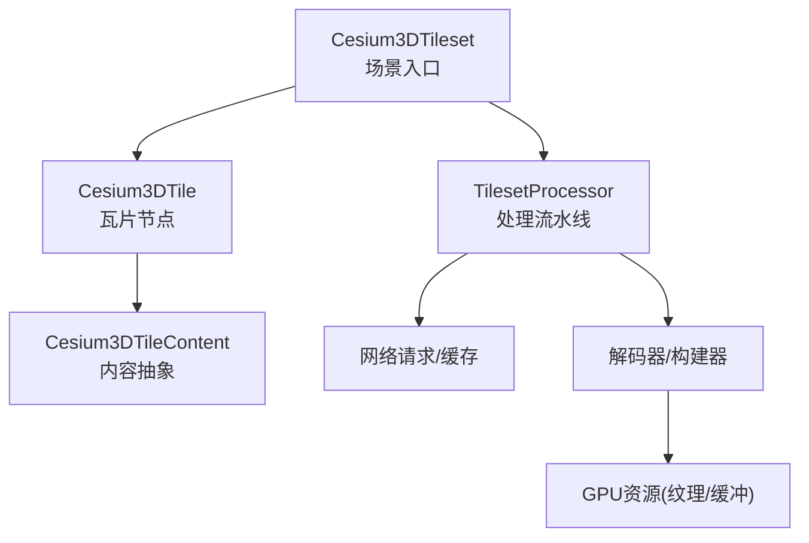
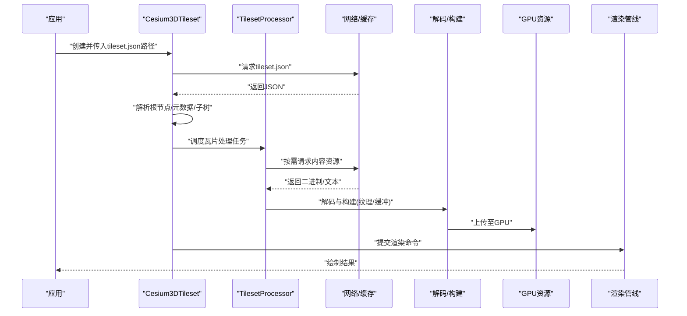
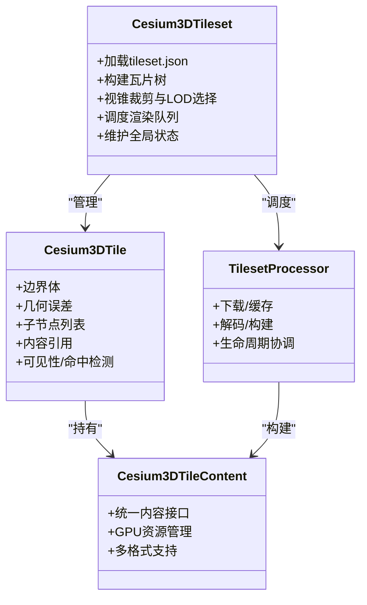
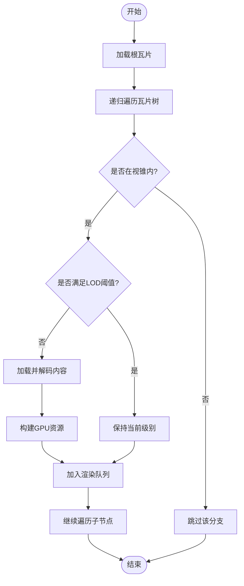
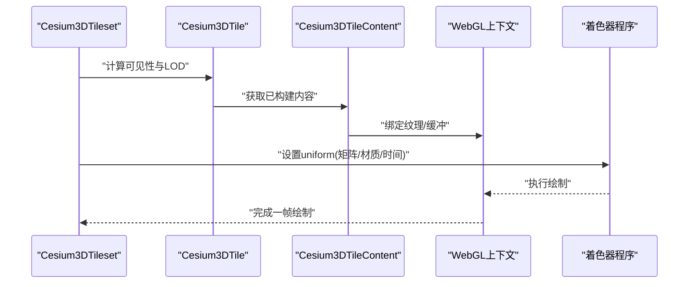
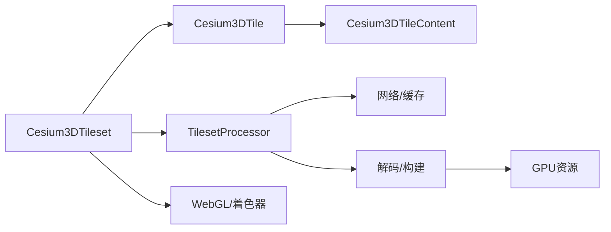

# 3D Tiles核心架构

<cite>
**本文引用的文件**   
- [Cesium3DTileset.js](file://Source/Scene/Cesium3DTileset.js)
- [Cesium3DTile.js](file://Source/Scene/Cesium3DTile.js)
- [Cesium3DTileContent.js](file://Source/Scene/Cesium3DTileContent.js)
- [TilesetProcessor.js](file://Source/Scene/TilesetProcessor.js)
- [ImplicitTilingTester.js](file://Specs/ImplicitTilingTester.js)
- [Cesium3DTilesTester.js](file://Specs/Cesium3DTilesTester.js)
- [tileset.json（示例：Batched）](file://Apps/SampleData/Cesium3DTiles/Batched/BatchedColors/tileset.json)
- [tileset.json（示例：Point Content）](file://Apps/SampleData/Cesium3DTiles/PointCloud/PointCloudRGB/tileset.json)
- [tileset.json（示例：Composite）](file://Apps/SampleData/Cesium3DTiles/Composite/Composite/tileset.json)
- [tileset.json（示例：Hierarchy）](file://Apps/SampleData/Cesium3DTiles/Hierarchy/BatchTableHierarchy/tileset.json)
- [tileset.json（示例：Vector）](file://Apps/SampleData/vector/sample-cities-spain.tileset.json)
- [tileset.json（示例：Voxel Box）](file://Apps/SampleData/Cesium3DTiles/Voxel/VoxelBox3DTiles/tileset.json)
</cite>

## 目录
1. [简介](#简介)
2. [项目结构](#项目结构)
3. [核心组件](#核心组件)
4. [架构总览](#架构总览)
5. [详细组件分析](#详细组件分析)
6. [依赖关系分析](#依赖关系分析)
7. [性能考量](#性能考量)
8. [故障排查指南](#故障排查指南)
9. [结论](#结论)
10. [附录](#附录)

## 简介
本技术文档聚焦于3D Tiles在Cesium中的核心实现，围绕以下目标展开：
- 深入解释 Cesium3DTileset、Cesium3DTile、Cesium3DTileContent 的层次关系与职责分工。
- 详细说明 tileset.json 配置文件的完整语法规范，包括根节点属性、子树结构、内容引用与元数据定义。
- 阐述3D Tiles的层级遍历算法与内存管理机制。
- 解释3D Tiles与WebGL渲染管线的集成方式，包括着色器程序管理与GPU资源分配。
- 提供 tileset.json 验证工具与最佳实践指南。

## 项目结构
仓库中3D Tiles相关源码主要位于 Source/Scene 目录，测试与样例数据位于 Specs 与 Apps/SampleData。核心类与处理器如下：
- Cesium3DTileset：场景级入口，负责加载、组织、调度与渲染3D Tiles集合。
- Cesium3DTile：单个瓦片节点，包含边界体、几何误差、子节点与内容引用等。
- Cesium3DTileContent：瓦片内容抽象，封装具体格式（如glTF、点云、矢量、体素等）的解析与GPU资源管理。
- TilesetProcessor：瓦片处理流水线，协调下载、解码、构建与销毁。

图表来源
- [Cesium3DTileset.js](file://Source/Scene/Cesium3DTileset.js)
- [Cesium3DTile.js](file://Source/Scene/Cesium3DTile.js)
- [Cesium3DTileContent.js](file://Source/Scene/Cesium3DTileContent.js)
- [TilesetProcessor.js](file://Source/Scene/TilesetProcessor.js)

章节来源
- [Cesium3DTileset.js](file://Source/Scene/Cesium3DTileset.js)
- [Cesium3DTile.js](file://Source/Scene/Cesium3DTile.js)
- [Cesium3DTileContent.js](file://Source/Scene/Cesium3DTileContent.js)
- [TilesetProcessor.js](file://Source/Scene/TilesetProcessor.js)

## 核心组件
本节从职责与交互角度概述三大核心类：
- Cesium3DTileset
  - 负责加载 tileset.json，构建瓦片树，执行视锥裁剪与LOD选择，调度渲染队列。
  - 维护全局状态（如相机、帧状态、统计信息），并协调各瓦片的生命周期。
- Cesium3DTile
  - 表示瓦片节点，持有边界体、几何误差、子节点列表、内容引用、可见性与命中检测信息。
  - 参与递归遍历与细化/粗化决策。
- Cesium3DTileContent
  - 封装具体内容的加载与GPU资源管理，提供统一的访问接口供渲染阶段使用。
  - 支持多种内容类型（批处理模型、实例化模型、点云、矢量、体素等）。

章节来源
- [Cesium3DTileset.js](file://Source/Scene/Cesium3DTileset.js)
- [Cesium3DTile.js](file://Source/Scene/Cesium3DTile.js)
- [Cesium3DTileContent.js](file://Source/Scene/Cesium3DTileContent.js)

## 架构总览
下图展示了3D Tiles从配置到渲染的整体流程：从 tileset.json 解析开始，经瓦片树构建、按需加载与解码，最终进入渲染管线。

图表来源
- [Cesium3DTileset.js](file://Source/Scene/Cesium3DTileset.js)
- [TilesetProcessor.js](file://Source/Scene/TilesetProcessor.js)

## 详细组件分析

### 类关系与职责

图表来源
- [Cesium3DTileset.js](file://Source/Scene/Cesium3DTileset.js)
- [Cesium3DTile.js](file://Source/Scene/Cesium3DTile.js)
- [Cesium3DTileContent.js](file://Source/Scene/Cesium3DTileContent.js)
- [TilesetProcessor.js](file://Source/Scene/TilesetProcessor.js)

章节来源
- [Cesium3DTileset.js](file://Source/Scene/Cesium3DTileset.js)
- [Cesium3DTile.js](file://Source/Scene/Cesium3DTile.js)
- [Cesium3DTileContent.js](file://Source/Scene/Cesium3DTileContent.js)
- [TilesetProcessor.js](file://Source/Scene/TilesetProcessor.js)

### 瓦片层级遍历与内存管理
- 遍历策略
  - 基于相机位置与视锥进行裁剪，结合瓦片边界体与几何误差进行LOD选择。
  - 支持显式树（children数组）与隐式树（通过规则生成子节点）两种结构。
- 内存管理
  - 按帧状态与可视需求动态加载/卸载瓦片内容。
  - 对GPU资源进行引用计数与释放，避免重复上传与泄漏。
  - 通过处理器流水线控制并发与优先级，确保稳定帧率。

图表来源
- [Cesium3DTileset.js](file://Source/Scene/Cesium3DTileset.js)
- [Cesium3DTile.js](file://Source/Scene/Cesium3DTile.js)
- [TilesetProcessor.js](file://Source/Scene/TilesetProcessor.js)

章节来源
- [Cesium3DTileset.js](file://Source/Scene/Cesium3DTileset.js)
- [Cesium3DTile.js](file://Source/Scene/Cesium3DTile.js)
- [TilesetProcessor.js](file://Source/Scene/TilesetProcessor.js)

### WebGL渲染管线集成
- 着色器程序管理
  - 根据内容类型与材质特性选择或编译合适的着色器程序。
  - 将瓦片变换矩阵、光照参数、时间变量等作为uniform注入。
- GPU资源分配
  - 纹理、顶点缓冲、索引缓冲等资源由内容层统一申请与管理。
  - 支持共享纹理与批量绘制以减少Draw Call。
- 渲染顺序与混合
  - 透明瓦片采用深度排序与混合模式，保证正确叠加。
  - 可选剔除与遮挡优化以提升性能。

图表来源
- [Cesium3DTileset.js](file://Source/Scene/Cesium3DTileset.js)
- [Cesium3DTile.js](file://Source/Scene/Cesium3DTile.js)
- [Cesium3DTileContent.js](file://Source/Scene/Cesium3DTileContent.js)

章节来源
- [Cesium3DTileset.js](file://Source/Scene/Cesium3DTileset.js)
- [Cesium3DTile.js](file://Source/Scene/Cesium3DTile.js)
- [Cesium3DTileContent.js](file://Source/Scene/Cesium3DTileContent.js)

### tileset.json 语法规范
tileset.json 是3D Tiles的根描述文件，用于声明瓦片树的拓扑、边界体、几何误差、内容引用与元数据。以下为关键要点与常见字段类别（以实际样例为准）：
- 根节点属性
  - 标识与版本：如 schema、version 等。
  - 元数据：如 asset、credit、extensions 等。
  - 根瓦片：如 root 或 tiles 数组（显式树）。
- 子树结构
  - 显式树：每个瓦片节点包含 children 数组，形成明确的父子关系。
  - 隐式树：通过规则（如四叉树/八叉树）与几何误差阈值自动生成子节点。
- 内容引用
  - content 字段指向具体资源（如 glTF/glb、点云、矢量、体素等）。
  - 支持外部资源与相对路径解析。
- 元数据定义
  - 可在瓦片或内容级别附加结构化元数据，便于查询与样式化。

参考样例路径（不同内容类型的典型结构）：
- 批处理模型：[tileset.json（示例：Batched）](file://Apps/SampleData/Cesium3DTiles/Batched/BatchedColors/tileset.json)
- 点云内容：[tileset.json（示例：Point Content）](file://Apps/SampleData/Cesium3DTiles/PointCloud/PointCloudRGB/tileset.json)
- 组合瓦片：[tileset.json（示例：Composite）](file://Apps/SampleData/Cesium3DTiles/Composite/Composite/tileset.json)
- 层次结构：[tileset.json（示例：Hierarchy）](file://Apps/SampleData/Cesium3DTiles/Hierarchy/BatchTableHierarchy/tileset.json)
- 矢量瓦片：[tileset.json（示例：Vector）](file://Apps/SampleData/vector/sample-cities-spain.tileset.json)
- 体素瓦片：[tileset.json（示例：Voxel Box）](file://Apps/SampleData/Cesium3DTiles/Voxel/VoxelBox3DTiles/tileset.json)

章节来源
- [tileset.json（示例：Batched）](file://Apps/SampleData/Cesium3DTiles/Batched/BatchedColors/tileset.json)
- [tileset.json（示例：Point Content）](file://Apps/SampleData/Cesium3DTiles/PointCloud/PointCloudRGB/tileset.json)
- [tileset.json（示例：Composite）](file://Apps/SampleData/Cesium3DTiles/Composite/Composite/tileset.json)
- [tileset.json（示例：Hierarchy）](file://Apps/SampleData/Cesium3DTiles/Hierarchy/BatchTableHierarchy/tileset.json)
- [tileset.json（示例：Vector）](file://Apps/SampleData/vector/sample-cities-spain.tileset.json)
- [tileset.json（示例：Voxel Box）](file://Apps/SampleData/Cesium3DTiles/Voxel/VoxelBox3DTiles/tileset.json)

### 隐式瓦片与测试工具
- 隐式瓦片
  - 通过规则生成子节点，减少显式树规模，提升可扩展性。
  - 常用于大规模地形、点云与体素数据。
- 测试工具
  - ImplicitTilingTester：用于构造与验证隐式瓦片逻辑。
  - Cesium3DTilesTester：用于端到端验证3D Tiles行为。

章节来源
- [ImplicitTilingTester.js](file://Specs/ImplicitTilingTester.js)
- [Cesium3DTilesTester.js](file://Specs/Cesium3DTilesTester.js)

## 依赖关系分析
- 内部依赖
  - Cesium3DTileset 依赖 Cesium3DTile 与 TilesetProcessor。
  - Cesium3DTile 依赖 Cesium3DTileContent 以访问具体资源。
- 外部依赖
  - 网络与缓存模块：用于 tileset.json 与内容资源的请求与复用。
  - 解码器与构建器：针对不同内容格式的解析与GPU资源构建。
  - WebGL上下文与着色器系统：完成最终的绘制调用。

图表来源
- [Cesium3DTileset.js](file://Source/Scene/Cesium3DTileset.js)
- [Cesium3DTile.js](file://Source/Scene/Cesium3DTile.js)
- [Cesium3DTileContent.js](file://Source/Scene/Cesium3DTileContent.js)
- [TilesetProcessor.js](file://Source/Scene/TilesetProcessor.js)

章节来源
- [Cesium3DTileset.js](file://Source/Scene/Cesium3DTileset.js)
- [Cesium3DTile.js](file://Source/Scene/Cesium3DTile.js)
- [Cesium3DTileContent.js](file://Source/Scene/Cesium3DTileContent.js)
- [TilesetProcessor.js](file://Source/Scene/TilesetProcessor.js)

## 性能考量
- 瓦片粒度与几何误差
  - 合理设置几何误差阈值，平衡细节与带宽。
- 资源复用与共享
  - 共享纹理与缓冲，降低内存占用与上传开销。
- 并发与优先级
  - 控制下载与解码并发度，优先加载近景与高重要性瓦片。
- 渲染批次
  - 合并相似材质的绘制，减少Draw Call。
- 内存回收
  - 及时释放不可见瓦片内容与GPU资源，避免峰值内存过高。

## 故障排查指南
- 常见问题
  - tileset.json 解析失败：检查路径与字段完整性。
  - 内容资源未加载：确认URL可达与跨域策略。
  - 渲染异常：检查着色器编译与uniform设置。
  - 内存泄漏：关注瓦片卸载与GPU资源释放。
- 定位方法
  - 使用测试工具验证隐式瓦片与瓦片树结构。
  - 开启调试日志，观察瓦片加载与渲染事件。
  - 监控GPU内存与带宽使用情况。

章节来源
- [ImplicitTilingTester.js](file://Specs/ImplicitTilingTester.js)
- [Cesium3DTilesTester.js](file://Specs/Cesium3DTilesTester.js)

## 结论
3D Tiles在Cesium中的核心实现以 Cesium3DTileset、Cesium3DTile、Cesium3DTileContent 为骨架，配合 TilesetProcessor 完成从配置到渲染的全链路处理。通过合理的瓦片划分、LOD策略与GPU资源管理，可实现大规模三维数据的流畅展示。遵循 tileset.json 规范与最佳实践，有助于提升稳定性与性能。

## 附录
- 验证工具与最佳实践
  - 使用样例 tileset.json 作为基准，逐步扩展字段与结构。
  - 借助测试工具进行端到端验证，覆盖显式与隐式瓦片场景。
  - 在生产环境进行压力测试，评估带宽、内存与帧率表现。