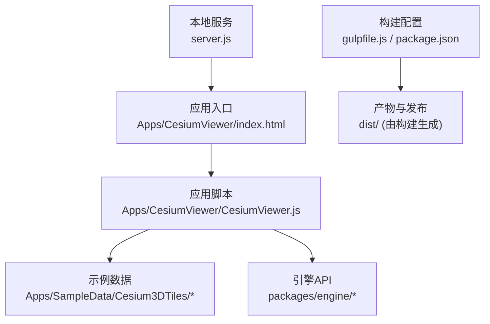
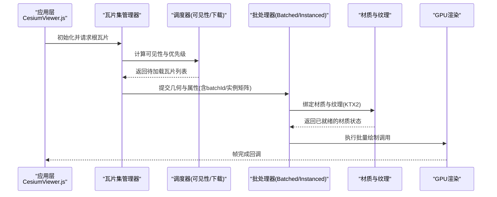
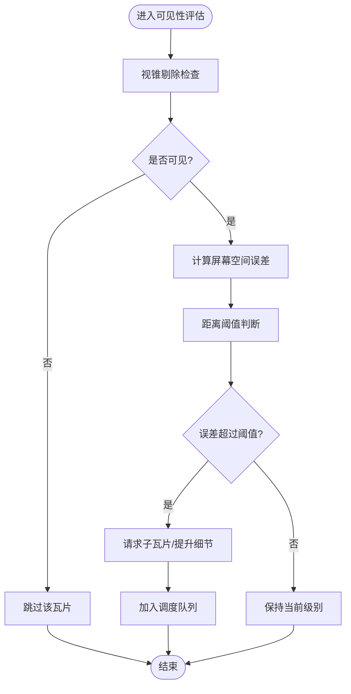
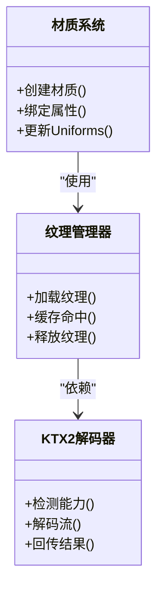
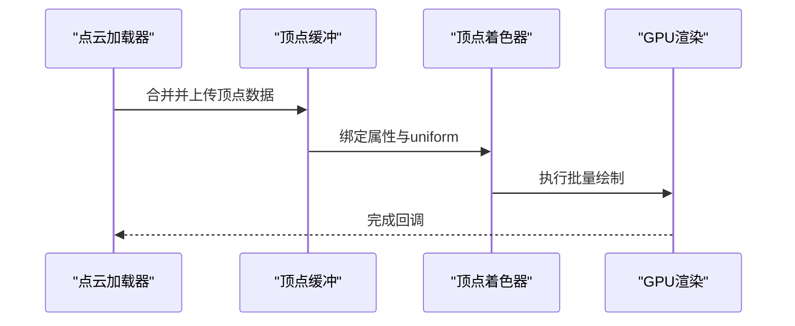
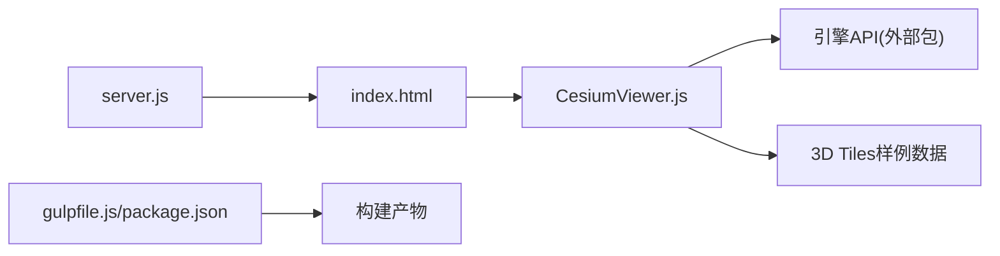

# 3D Tiles渲染系统

<cite>
**本文引用的文件**   
- [README.md](file://README.md)
- [CesiumViewer.js](file://Apps/CesiumViewer/CesiumViewer.js)
- [index.html](file://Apps/CesiumViewer/index.html)
- [package.json](file://package.json)
- [gulpfile.js](file://gulpfile.js)
- [server.js](file://server.js)
</cite>

## 目录
1. [简介](#简介)
2. [项目结构](#项目结构)
3. [核心组件](#核心组件)
4. [架构总览](#架构总览)
5. [详细组件分析](#详细组件分析)
6. [依赖关系分析](#依赖关系分析)
7. [性能考虑](#性能考虑)
8. [故障排查指南](#故障排查指南)
9. [结论](#结论)
10. [附录](#附录)

## 简介
本技术文档聚焦于3D Tiles渲染系统的实现与优化，围绕以下目标展开：
- 批处理渲染机制：深入解析Batched与Instanced两种模式的原理、数据组织与绘制路径差异。
- 几何误差与LOD策略：说明几何误差计算、视锥剔除与距离优化的协同工作。
- 材质系统与纹理管理：阐述材质管线与KTX2压缩纹理的加载、解码与复用策略。
- 点云渲染管线：解释顶点着色器优化与批量绘制调用流程。
- 性能调优与常见问题：提供可操作的优化建议与排障方法。

## 项目结构
仓库采用多包与示例分离的组织方式：
- Source：核心引擎源码（未在本仓库中直接展示）
- Apps：示例应用与演示资源（含3D Tiles样例数据）
- Specs：测试用例与测试数据（包含大量3D Tiles场景）
- Documentation：开发者文档与规范
- packages：子包（engine、sandcastle、widgets等）
- Tools/Scripts：构建、打包与工具链

图表来源
- [index.html](file://Apps/CesiumViewer/index.html)
- [CesiumViewer.js](file://Apps/CesiumViewer/CesiumViewer.js)
- [gulpfile.js](file://gulpfile.js)
- [package.json](file://package.json)
- [server.js](file://server.js)

章节来源
- [README.md](file://README.md)
- [package.json](file://package.json)
- [gulpfile.js](file://gulpfile.js)
- [server.js](file://server.js)

## 核心组件
本节从系统视角梳理3D Tiles渲染的关键子系统及其职责：
- 瓦片集与调度：负责tileset.json解析、层级遍历、可见性判定与下载调度。
- 几何与批处理：将多个图元合并为批次，支持Batched与Instanced两类绘制。
- 材质与纹理：统一材质定义、属性绑定与纹理缓存；支持KTX2等现代压缩格式。
- 点云管线：点云数据的顶点缓冲组织、着色器优化与批量绘制。
- 误差与LOD：基于屏幕空间误差、距离阈值与视锥剔除进行动态细化与降级。

章节来源
- [CesiumViewer.js](file://Apps/CesiumViewer/CesiumViewer.js)
- [index.html](file://Apps/CesiumViewer/index.html)

## 架构总览
下图展示了从应用到渲染器的关键交互路径，涵盖瓦片加载、批处理选择、材质与纹理、以及点云渲染管线。

图表来源
- [CesiumViewer.js](file://Apps/CesiumViewer/CesiumViewer.js)
- [index.html](file://Apps/CesiumViewer/index.html)

## 详细组件分析

### 批处理渲染机制：Batched vs Instanced
- Batched模式
  - 适用场景：同一材质下大量独立图元，通过batchId区分不同对象或属性。
  - 数据组织：将多个图元的顶点与索引合并至单一缓冲区，额外附加batchId属性。
  - 绘制路径：单次draw call，按batchId在着色器内分支处理颜色/属性。
  - 优势：减少状态切换与draw call数量，适合静态或低频更新场景。
  - 局限：当对象间变换差异大时，难以利用GPU实例化加速。

- Instanced模式
  - 适用场景：相同几何重复出现且每实例具有不同变换（平移/旋转/缩放）。
  - 数据组织：基础几何一次上传，实例矩阵作为实例属性传入。
  - 绘制路径：使用实例化绘制接口，GPU侧对每个实例应用变换。
  - 优势：极大降低CPU端数据体积与draw call开销，适合大规模重复元素。
  - 局限：需要几何一致且变换可通过实例矩阵表达。

- 性能差异要点
  - CPU/GPU负载：Instanced显著降低CPU端合并与上传成本；Batched在复杂属性分支上可能增加着色器复杂度。
  - 内存占用：Batched需存储冗余几何；Instanced仅存一份几何+实例矩阵。
  - 状态切换：两者均能减少状态切换，但Instanced在大批量同形对象上更优。

章节来源
- [CesiumViewer.js](file://Apps/CesiumViewer/CesiumViewer.js)

### 几何误差计算与LOD切换策略
- 几何误差
  - 屏幕空间误差：根据相机位置、投影矩阵与瓦片包围体估算像素级误差。
  - 距离阈值：结合相机到瓦片中心的距离与瓦片尺寸，设定细化/降级阈值。
- 视锥剔除
  - 基于相机视锥与瓦片包围体求交，快速排除不可见瓦片，减少后续处理。
- LOD切换
  - 依据误差与阈值比较，决定加载父/子瓦片或维持当前级别。
  - 渐进式加载：优先加载高优先级瓦片，避免卡顿。

章节来源
- [CesiumViewer.js](file://Apps/CesiumViewer/CesiumViewer.js)

### 材质系统与纹理管理（含KTX2）
- 材质系统
  - 统一材质描述：封装PBR参数、贴图通道、透明度与混合模式。
  - 属性绑定：将batchId、实例矩阵、顶点色等属性映射到着色器uniform/attribute。
- 纹理管理
  - 纹理缓存：按URL/指纹去重，避免重复加载与显存浪费。
  - 异步解码：针对KTX2等压缩纹理，后台线程解码后回传主线程。
  - 多级采样：按需生成mipmap，改善过滤质量与带宽利用率。
- KTX2支持
  - 浏览器能力检测：根据WebGL/WebGPU能力选择最佳解码路径。
  - 编码格式适配：BasisU/ETC2/ASTC等后端选择与fallback策略。
  - 内存优化：共享纹理、及时释放不再使用的纹理资源。

章节来源
- [CesiumViewer.js](file://Apps/CesiumViewer/CesiumViewer.js)

### 点云渲染管线
- 数据组织
  - 顶点缓冲：位置、颜色、法线、属性表字段按步长打包。
  - 批量合并：将多个点云瓦片合并为单一缓冲，减少draw call。
- 顶点着色器优化
  - 早裁剪：在顶点阶段进行视锥与距离裁剪，减少片段着色压力。
  - 属性插值最小化：尽量在顶点阶段完成颜色/属性计算。
- 批量绘制调用
  - 使用instanced或batched方式一次性提交所有点，提高吞吐。
  - 分批次按材质/透明度分组，避免不必要的状态切换。

章节来源
- [CesiumViewer.js](file://Apps/CesiumViewer/CesiumViewer.js)

## 依赖关系分析
- 应用层依赖
  - index.html引入构建后的引擎与示例脚本。
  - CesiumViewer.js初始化场景、加载3D Tiles并驱动渲染循环。
- 构建与服务
  - gulpfile.js与package.json定义构建任务与依赖。
  - server.js提供本地开发服务器，便于调试3D Tiles资源。

图表来源
- [index.html](file://Apps/CesiumViewer/index.html)
- [CesiumViewer.js](file://Apps/CesiumViewer/CesiumViewer.js)
- [gulpfile.js](file://gulpfile.js)
- [package.json](file://package.json)
- [server.js](file://server.js)

章节来源
- [package.json](file://package.json)
- [gulpfile.js](file://gulpfile.js)
- [server.js](file://server.js)

## 性能考虑
- 批处理选择
  - 大量同形对象优先使用Instanced；复杂属性分支较多的Batched需谨慎控制着色器复杂度。
- 纹理与KTX2
  - 启用KTX2以减小网络传输与显存占用；确保解码路径可用并合理设置mipmap。
- 瓦片调度
  - 调整误差阈值与最大并发，平衡流畅度与峰值内存。
- 点云优化
  - 合并缓冲、减少状态切换；在顶点阶段做尽可能多的裁剪与计算。
- 监控与度量
  - 统计draw call次数、纹理大小、解码耗时与瓦片加载延迟，定位瓶颈。

[本节为通用指导，不直接分析具体文件]

## 故障排查指南
- 瓦片无法加载
  - 检查网络请求与跨域策略；确认tileset.json路径正确。
  - 查看控制台错误日志，定位JSON解析或内容下载失败原因。
- 渲染异常或闪烁
  - 验证材质与纹理是否正确绑定；检查KTX2解码是否成功。
  - 观察批处理分组是否合理，避免过度状态切换。
- 性能问题
  - 测量draw call与纹理大小；尝试增大Instanced比例或减少批次数量。
  - 调整瓦片误差阈值与并发限制，缓解峰值压力。

章节来源
- [CesiumViewer.js](file://Apps/CesiumViewer/CesiumViewer.js)

## 结论
本系统通过批处理与实例化渲染、精细的瓦片调度与误差控制、完善的材质与纹理管理（包括KTX2），以及高效的点云管线，实现了大规模3D Tiles的高性能渲染。实际应用中应结合数据特征选择合适的批处理模式，持续监控关键指标并进行针对性调优。

[本节为总结性内容，不直接分析具体文件]

## 附录
- 相关示例数据
  - 3D Tiles样例位于Apps/SampleData/Cesium3DTiles目录下，覆盖Batched、Instanced、PointCloud等多种类型，可用于验证与对比不同渲染模式的效果与性能。

章节来源
- [CesiumViewer.js](file://Apps/CesiumViewer/CesiumViewer.js)