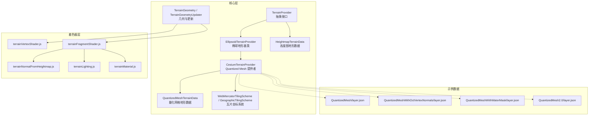
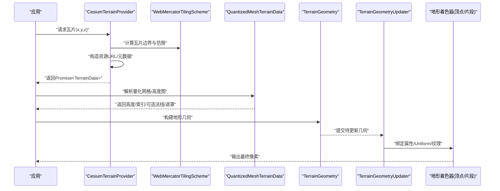
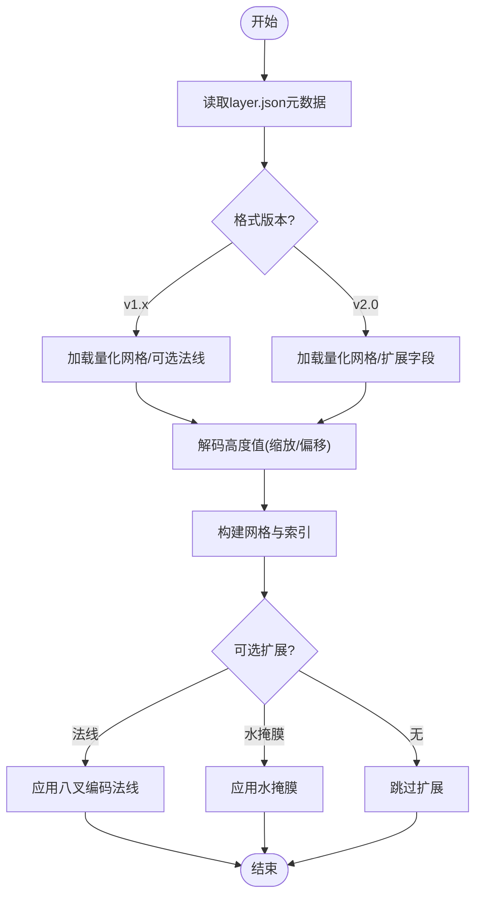
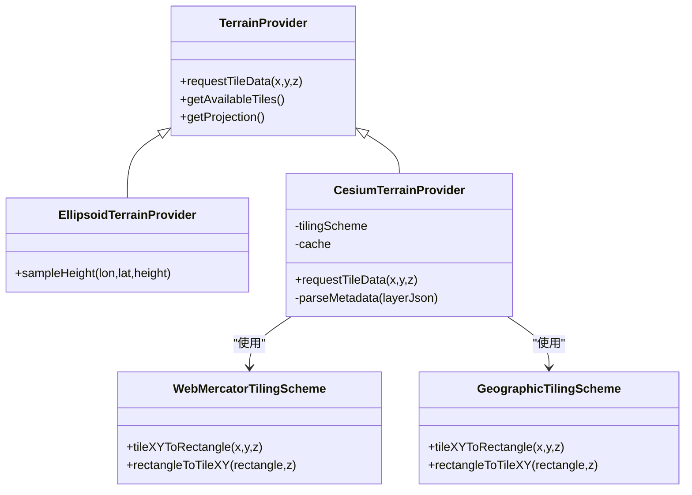
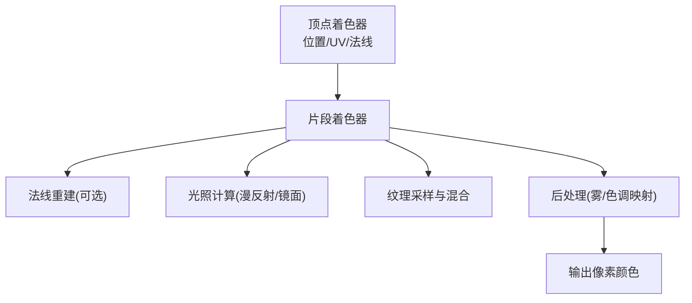
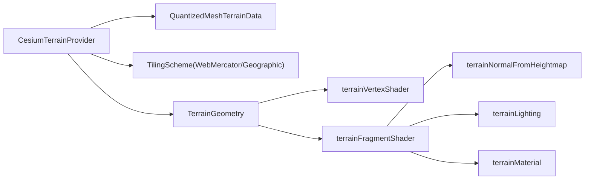

# 地形数据提供者

<cite>
**本文引用的文件**   
- [TerrainProvider.js](file://Source/Core/TerrainProvider.js)
- [EllipsoidTerrainProvider.js](file://Source/Core/EllipsoidTerrainProvider.js)
- [CesiumTerrainProvider.js](file://Source/Core/CesiumTerrainProvider.js)
- [QuantizedMeshTerrainData.js](file://Source/Core/QuantizedMeshTerrainData.js)
- [createTileMapServiceImageryProvider.js](file://Source/Core/createTileMapServiceImageryProvider.js)
- [WebMercatorTilingScheme.js](file://Source/Core/WebMercatorTilingScheme.js)
- [GeographicTilingScheme.js](file://Source/Core/GeographicTilingScheme.js)
- [HeightmapTerrainData.js](file://Source/Core/HeightmapTerrainData.js)
- [TerrainGeometry.js](file://Source/Core/TerrainGeometry.js)
- [TerrainGeometryUpdater.js](file://Source/Core/TerrainGeometryUpdater.js)
- [terrainVertexShader.js](file://Source/Shaders/Terrain/terrainVertexShader.js)
- [terrainFragmentShader.js](file://Source/Shaders/Terrain/terrainFragmentShader.js)
- [terrainNormalFromHeightmap.js](file://Source/Shaders/Terrain/terrainNormalFromHeightmap.js)
- [terrainLighting.js](file://Source/Shaders/Terrain/terrainLighting.js)
- [terrainMaterial.js](file://Source/Shaders/Terrain/terrainMaterial.js)
- [layer.json](file://Specs/Data/CesiumTerrainTileJson/QuantizedMesh/layer.json)
- [layer.json](file://Specs/Data/CesiumTerrainTileJson/QuantizedMeshWithOctVertexNormals/layer.json)
- [layer.json](file://Specs/Data/CesiumTerrainTileJson/QuantizedMeshWithWaterMask/layer.json)
- [layer.json](file://Specs/Data/CesiumTerrainTileJson/QuantizedMesh2.0/layer.json)
</cite>

## 目录
1. [简介](#简介)
2. [项目结构](#项目结构)
3. [核心组件](#核心组件)
4. [架构总览](#架构总览)
5. [详细组件分析](#详细组件分析)
6. [依赖关系分析](#依赖关系分析)
7. [性能考量](#性能考量)
8. [故障排查指南](#故障排查指南)
9. [结论](#结论)
10. [附录](#附录)

## 简介
本技术文档聚焦于 CesiumJS 中的“地形数据提供者”体系，围绕 Quantized Mesh 地形格式的实现原理、全球地形数据的分块加载机制、高程精度与垂直基准面处理、地形着色器（光照、纹理混合、后处理）以及自定义地形数据源开发进行系统化阐述。读者无需深入图形学背景即可理解整体流程，同时为高级用户提供了可落地的优化建议与扩展路径。

## 项目结构
本项目采用分层组织：
- 核心抽象与实现位于 Source/Core，提供地形提供者接口、瓦片调度、几何构建与渲染更新等能力。
- 着色器位于 Source/Shaders/Terrain，包含顶点/片段着色器、法线计算、光照模型与材质组合。
- 测试数据位于 Specs/Data/CesiumTerrainTileJson，覆盖多种 Quantized Mesh 变体与元数据场景。

图表来源
- [TerrainProvider.js](file://Source/Core/TerrainProvider.js)
- [EllipsoidTerrainProvider.js](file://Source/Core/EllipsoidTerrainProvider.js)
- [CesiumTerrainProvider.js](file://Source/Core/CesiumTerrainProvider.js)
- [QuantizedMeshTerrainData.js](file://Source/Core/QuantizedMeshTerrainData.js)
- [HeightmapTerrainData.js](file://Source/Core/HeightmapTerrainData.js)
- [WebMercatorTilingScheme.js](file://Source/Core/WebMercatorTilingScheme.js)
- [GeographicTilingScheme.js](file://Source/Core/GeographicTilingScheme.js)
- [TerrainGeometry.js](file://Source/Core/TerrainGeometry.js)
- [TerrainGeometryUpdater.js](file://Source/Core/TerrainGeometryUpdater.js)
- [terrainVertexShader.js](file://Source/Shaders/Terrain/terrainVertexShader.js)
- [terrainFragmentShader.js](file://Source/Shaders/Terrain/terrainFragmentShader.js)
- [terrainNormalFromHeightmap.js](file://Source/Shaders/Terrain/terrainNormalFromHeightmap.js)
- [terrainLighting.js](file://Source/Shaders/Terrain/terrainLighting.js)
- [terrainMaterial.js](file://Source/Shaders/Terrain/terrainMaterial.js)
- [layer.json](file://Specs/Data/CesiumTerrainTileJson/QuantizedMesh/layer.json)
- [layer.json](file://Specs/Data/CesiumTerrainTileJson/QuantizedMeshWithOctVertexNormals/layer.json)
- [layer.json](file://Specs/Data/CesiumTerrainTileJson/QuantizedMeshWithWaterMask/layer.json)
- [layer.json](file://Specs/Data/CesiumTerrainTileJson/QuantizedMesh2.0/layer.json)

章节来源
- [TerrainProvider.js](file://Source/Core/TerrainProvider.js)
- [EllipsoidTerrainProvider.js](file://Source/Core/EllipsoidTerrainProvider.js)
- [CesiumTerrainProvider.js](file://Source/Core/CesiumTerrainProvider.js)
- [QuantizedMeshTerrainData.js](file://Source/Core/QuantizedMeshTerrainData.js)
- [HeightmapTerrainData.js](file://Source/Core/HeightmapTerrainData.js)
- [WebMercatorTilingScheme.js](file://Source/Core/WebMercatorTilingScheme.js)
- [GeographicTilingScheme.js](file://Source/Core/GeographicTilingScheme.js)
- [TerrainGeometry.js](file://Source/Core/TerrainGeometry.js)
- [TerrainGeometryUpdater.js](file://Source/Core/TerrainGeometryUpdater.js)
- [terrainVertexShader.js](file://Source/Shaders/Terrain/terrainVertexShader.js)
- [terrainFragmentShader.js](file://Source/Shaders/Terrain/terrainFragmentShader.js)
- [terrainNormalFromHeightmap.js](file://Source/Shaders/Terrain/terrainNormalFromHeightmap.js)
- [terrainLighting.js](file://Source/Shaders/Terrain/terrainLighting.js)
- [terrainMaterial.js](file://Source/Shaders/Terrain/terrainMaterial.js)
- [layer.json](file://Specs/Data/CesiumTerrainTileJson/QuantizedMesh/layer.json)
- [layer.json](file://Specs/Data/CesiumTerrainTileJson/QuantizedMeshWithOctVertexNormals/layer.json)
- [layer.json](file://Specs/Data/CesiumTerrainTileJson/QuantizedMeshWithWaterMask/layer.json)
- [layer.json](file://Specs/Data/CesiumTerrainTileJson/QuantizedMesh2.0/layer.json)

## 核心组件
- 地形提供者抽象与基类
  - TerrainProvider：定义请求瓦片、获取可用区域、投影与坐标系等统一接口。
  - EllipsoidTerrainProvider：在椭球体上采样高程的通用实现，作为其他具体提供者的基础。
- Quantized Mesh 提供者
  - CesiumTerrainProvider：负责解析 Quantized Mesh 瓦片、管理瓦片层级与缓存、协调几何构建与渲染。
- 地形数据对象
  - QuantizedMeshTerrainData：解析并存储量化网格的高度、索引、可选的法线与遮罩等。
  - HeightmapTerrainData：基于原始高度图的轻量地形数据表示。
- 瓦片坐标系统
  - WebMercatorTilingScheme / GeographicTilingScheme：分别对应 Web 墨卡托与经纬度两种瓦片切分策略。
- 几何与更新
  - TerrainGeometry / TerrainGeometryUpdater：将地形数据转换为 GPU 可渲染的几何体，并在视口变化时按需更新。

章节来源
- [TerrainProvider.js](file://Source/Core/TerrainProvider.js)
- [EllipsoidTerrainProvider.js](file://Source/Core/EllipsoidTerrainProvider.js)
- [CesiumTerrainProvider.js](file://Source/Core/CesiumTerrainProvider.js)
- [QuantizedMeshTerrainData.js](file://Source/Core/QuantizedMeshTerrainData.js)
- [HeightmapTerrainData.js](file://Source/Core/HeightmapTerrainData.js)
- [WebMercatorTilingScheme.js](file://Source/Core/WebMercatorTilingScheme.js)
- [GeographicTilingScheme.js](file://Source/Core/GeographicTilingScheme.js)
- [TerrainGeometry.js](file://Source/Core/TerrainGeometry.js)
- [TerrainGeometryUpdater.js](file://Source/Core/TerrainGeometryUpdater.js)

## 架构总览
下图展示了从请求到渲染的关键链路：应用通过地形提供者发起瓦片请求，提供者根据瓦片坐标系统定位资源，解析 Quantized Mesh 或高度图数据，生成地形几何，再由几何更新器驱动着色器完成光照与纹理混合。

图表来源
- [CesiumTerrainProvider.js](file://Source/Core/CesiumTerrainProvider.js)
- [WebMercatorTilingScheme.js](file://Source/Core/WebMercatorTilingScheme.js)
- [QuantizedMeshTerrainData.js](file://Source/Core/QuantizedMeshTerrainData.js)
- [TerrainGeometry.js](file://Source/Core/TerrainGeometry.js)
- [TerrainGeometryUpdater.js](file://Source/Core/TerrainGeometryUpdater.js)
- [terrainVertexShader.js](file://Source/Shaders/Terrain/terrainVertexShader.js)
- [terrainFragmentShader.js](file://Source/Shaders/Terrain/terrainFragmentShader.js)

## 详细组件分析

### Quantized Mesh 地形格式与实现原理
- 高度图压缩与量化
  - 使用有符号整型或半精度浮点编码高度值，结合最小/最大高度与缩放因子，实现高压缩比与可控精度。
  - 支持可选的八叉编码法线以节省带宽，提升法线质量的同时降低存储开销。
- 网格细分策略
  - 瓦片内部通常采用规则网格，通过索引缓冲描述三角面；LOD 由上层瓦片层级控制，相邻瓦片间通过接缝处理保证连续性。
- 元数据与可用性
  - layer.json 中声明瓦片 URL 模板、格式版本、是否包含法线/水掩膜等扩展字段，便于动态适配不同数据源。

图表来源
- [layer.json](file://Specs/Data/CesiumTerrainTileJson/QuantizedMesh/layer.json)
- [layer.json](file://Specs/Data/CesiumTerrainTileJson/QuantizedMeshWithOctVertexNormals/layer.json)
- [layer.json](file://Specs/Data/CesiumTerrainTileJson/QuantizedMeshWithWaterMask/layer.json)
- [layer.json](file://Specs/Data/CesiumTerrainTileJson/QuantizedMesh2.0/layer.json)
- [QuantizedMeshTerrainData.js](file://Source/Core/QuantizedMeshTerrainData.js)

章节来源
- [QuantizedMeshTerrainData.js](file://Source/Core/QuantizedMeshTerrainData.js)
- [layer.json](file://Specs/Data/CesiumTerrainTileJson/QuantizedMesh/layer.json)
- [layer.json](file://Specs/Data/CesiumTerrainTileJson/QuantizedMeshWithOctVertexNormals/layer.json)
- [layer.json](file://Specs/Data/CesiumTerrainTileJson/QuantizedMeshWithWaterMask/layer.json)
- [layer.json](file://Specs/Data/CesiumTerrainTileJson/QuantizedMesh2.0/layer.json)

### 全球地形数据的分块加载与瓦片坐标系统
- 瓦片坐标系统
  - WebMercatorTilingScheme：适用于 Web 墨卡托投影，适合全球无缝拼接与快速近似。
  - GeographicTilingScheme：适用于经纬度投影，适合高精度地理参考。
- 动态细节层次（LOD）
  - 根据相机距离、屏幕误差阈值与几何误差选择合适层级；父瓦片与子瓦片之间平滑过渡，避免可见接缝。
- 请求与缓存
  - 按瓦片键（x,y,z）去重与复用，结合内存与磁盘缓存策略减少重复网络请求。

图表来源
- [TerrainProvider.js](file://Source/Core/TerrainProvider.js)
- [EllipsoidTerrainProvider.js](file://Source/Core/EllipsoidTerrainProvider.js)
- [CesiumTerrainProvider.js](file://Source/Core/CesiumTerrainProvider.js)
- [WebMercatorTilingScheme.js](file://Source/Core/WebMercatorTilingScheme.js)
- [GeographicTilingScheme.js](file://Source/Core/GeographicTilingScheme.js)

章节来源
- [CesiumTerrainProvider.js](file://Source/Core/CesiumTerrainProvider.js)
- [WebMercatorTilingScheme.js](file://Source/Core/WebMercatorTilingScheme.js)
- [GeographicTilingScheme.js](file://Source/Core/GeographicTilingScheme.js)

### 高程精度与垂直基准面转换
- 精度处理
  - 量化参数（最小/最大高度、缩放因子）决定还原后的绝对精度；八叉编码法线影响表面法向质量。
- 垂直基准面
  - 椭球高与大地高之间的转换需考虑垂线偏差与大地水准面模型；在椭球地形提供者中可通过配置切换基准面。
- 数据一致性
  - 确保瓦片元数据与实际数据一致，避免高度偏移或单位不一致导致的视觉错位。

章节来源
- [EllipsoidTerrainProvider.js](file://Source/Core/EllipsoidTerrainProvider.js)
- [QuantizedMeshTerrainData.js](file://Source/Core/QuantizedMeshTerrainData.js)

### 地形着色器实现（光照、纹理混合、后处理）
- 顶点着色器
  - 输入位置、UV、可选法线；将局部坐标变换到世界/视图空间，传递至片段阶段。
- 片段着色器
  - 基于法线与光源方向计算漫反射/镜面反射；采样多张纹理并按权重混合；可叠加水掩膜或遮罩效果。
- 法线重建
  - 当缺失顶点法线时，依据高度图梯度重建法线，保持细节表现。
- 材质与后处理
  - terrainMaterial 聚合光照模型与纹理采样参数；可在管线后处理阶段加入雾效、色调映射等。

图表来源
- [terrainVertexShader.js](file://Source/Shaders/Terrain/terrainVertexShader.js)
- [terrainFragmentShader.js](file://Source/Shaders/Terrain/terrainFragmentShader.js)
- [terrainNormalFromHeightmap.js](file://Source/Shaders/Terrain/terrainNormalFromHeightmap.js)
- [terrainLighting.js](file://Source/Shaders/Terrain/terrainLighting.js)
- [terrainMaterial.js](file://Source/Shaders/Terrain/terrainMaterial.js)

章节来源
- [terrainVertexShader.js](file://Source/Shaders/Terrain/terrainVertexShader.js)
- [terrainFragmentShader.js](file://Source/Shaders/Terrain/terrainFragmentShader.js)
- [terrainNormalFromHeightmap.js](file://Source/Shaders/Terrain/terrainNormalFromHeightmap.js)
- [terrainLighting.js](file://Source/Shaders/Terrain/terrainLighting.js)
- [terrainMaterial.js](file://Source/Shaders/Terrain/terrainMaterial.js)

### 自定义地形数据源开发指南
- 数据格式转换
  - 将原始 DEM/栅格数据转换为 Quantized Mesh 或高度图格式；设置合理的量化参数与可选扩展（法线、水掩膜）。
  - 生成 layer.json 元数据，包含瓦片 URL 模板、格式版本、扩展标志位等。
- 性能优化技巧
  - 预计算 LOD 与可用性掩码，减少运行时解析开销。
  - 使用并行解码与异步流水线，避免主线程阻塞。
  - 合理设置缓存大小与淘汰策略，平衡内存占用与命中率。
- 集成步骤
  - 继承 TerrainProvider 或 EllipsoidTerrainProvider，实现 requestTileData 与元数据解析逻辑。
  - 注册到场景中，验证瓦片加载、接缝处理与光照表现。

章节来源
- [CesiumTerrainProvider.js](file://Source/Core/CesiumTerrainProvider.js)
- [EllipsoidTerrainProvider.js](file://Source/Core/EllipsoidTerrainProvider.js)
- [layer.json](file://Specs/Data/CesiumTerrainTileJson/QuantizedMesh/layer.json)
- [layer.json](file://Specs/Data/CesiumTerrainTileJson/QuantizedMesh2.0/layer.json)

## 依赖关系分析
- 组件耦合
  - CesiumTerrainProvider 强依赖瓦片坐标系统与 QuantizedMeshTerrainData；弱依赖 Geometry 与着色器模块。
- 外部依赖
  - 网络请求与缓存策略；GPU 渲染管线（WebGL/WebGPU）。
- 潜在循环依赖
  - 通过抽象接口（TerrainProvider）解耦具体实现，避免循环引用。

图表来源
- [CesiumTerrainProvider.js](file://Source/Core/CesiumTerrainProvider.js)
- [QuantizedMeshTerrainData.js](file://Source/Core/QuantizedMeshTerrainData.js)
- [WebMercatorTilingScheme.js](file://Source/Core/WebMercatorTilingScheme.js)
- [GeographicTilingScheme.js](file://Source/Core/GeographicTilingScheme.js)
- [TerrainGeometry.js](file://Source/Core/TerrainGeometry.js)
- [terrainVertexShader.js](file://Source/Shaders/Terrain/terrainVertexShader.js)
- [terrainFragmentShader.js](file://Source/Shaders/Terrain/terrainFragmentShader.js)
- [terrainNormalFromHeightmap.js](file://Source/Shaders/Terrain/terrainNormalFromHeightmap.js)
- [terrainLighting.js](file://Source/Shaders/Terrain/terrainLighting.js)
- [terrainMaterial.js](file://Source/Shaders/Terrain/terrainMaterial.js)

章节来源
- [CesiumTerrainProvider.js](file://Source/Core/CesiumTerrainProvider.js)
- [QuantizedMeshTerrainData.js](file://Source/Core/QuantizedMeshTerrainData.js)
- [WebMercatorTilingScheme.js](file://Source/Core/WebMercatorTilingScheme.js)
- [GeographicTilingScheme.js](file://Source/Core/GeographicTilingScheme.js)
- [TerrainGeometry.js](file://Source/Core/TerrainGeometry.js)
- [terrainVertexShader.js](file://Source/Shaders/Terrain/terrainVertexShader.js)
- [terrainFragmentShader.js](file://Source/Shaders/Terrain/terrainFragmentShader.js)
- [terrainNormalFromHeightmap.js](file://Source/Shaders/Terrain/terrainNormalFromHeightmap.js)
- [terrainLighting.js](file://Source/Shaders/Terrain/terrainLighting.js)
- [terrainMaterial.js](file://Source/Shaders/Terrain/terrainMaterial.js)

## 性能考量
- 瓦片级 LOD 与屏幕误差控制，避免过度细分。
- 增量更新与几何复用，减少 GPU 上传与状态切换。
- 法线重建仅在必要时启用，权衡质量与成本。
- 纹理图集与批渲染，降低绘制调用次数。
- 缓存命中与并发请求调优，避免抖动与卡顿。

[本节为通用指导，不直接分析具体文件]

## 故障排查指南
- 瓦片无法加载
  - 检查 layer.json 的 URL 模板与格式版本；确认网络可达与跨域策略。
- 高度异常或接缝明显
  - 核对量化参数与基准面配置；验证相邻瓦片边界对齐与索引连续性。
- 法线缺失导致光照异常
  - 启用法线重建或提供八叉编码法线；检查片段着色器中的法线输入。
- 水掩膜无效
  - 确认瓦片包含水掩膜扩展；检查片段着色器中遮罩采样与混合逻辑。

章节来源
- [layer.json](file://Specs/Data/CesiumTerrainTileJson/QuantizedMesh/layer.json)
- [layer.json](file://Specs/Data/CesiumTerrainTileJson/QuantizedMeshWithOctVertexNormals/layer.json)
- [layer.json](file://Specs/Data/CesiumTerrainTileJson/QuantizedMeshWithWaterMask/layer.json)
- [terrainNormalFromHeightmap.js](file://Source/Shaders/Terrain/terrainNormalFromHeightmap.js)
- [terrainFragmentShader.js](file://Source/Shaders/Terrain/terrainFragmentShader.js)

## 结论
CesiumJS 的地形数据提供者体系以抽象接口为核心，结合 Quantized Mesh 的高效压缩与可扩展元数据，实现了全球地形的高性能加载与渲染。通过合理的瓦片坐标系统、LOD 控制与着色器管线优化，能够在不同设备上取得良好的视觉效果与交互体验。开发者可基于现有组件快速构建自定义地形数据源，并通过数据格式转换与性能调优满足多样化业务需求。

[本节为总结性内容，不直接分析具体文件]

## 附录
- 术语表
  - Quantized Mesh：量化网格地形格式，使用整数/半精度编码高度与可选法线。
  - 瓦片坐标系统：将地球表面划分为规则网格的坐标方案，如 Web 墨卡托与经纬度。
  - 垂直基准面：高程参考面，如椭球面或大地水准面。
- 参考数据
  - 示例 layer.json 覆盖 v1.x 与 v2.0 格式，含法线与水掩膜扩展，便于对照实现。

[本节为补充信息，不直接分析具体文件]