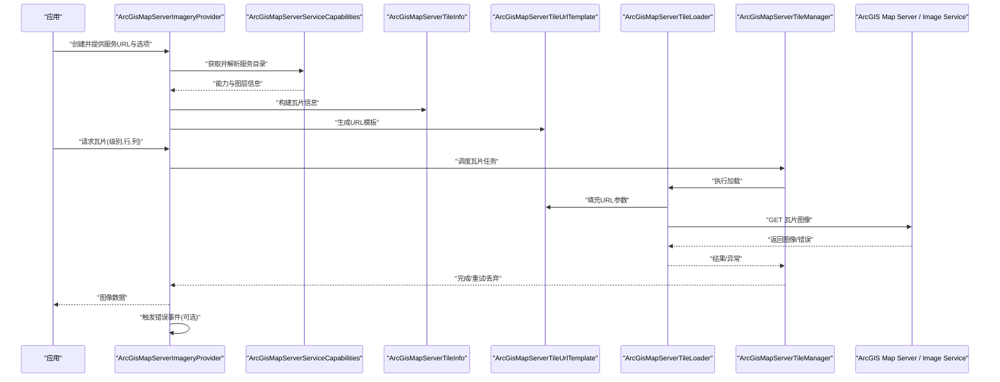
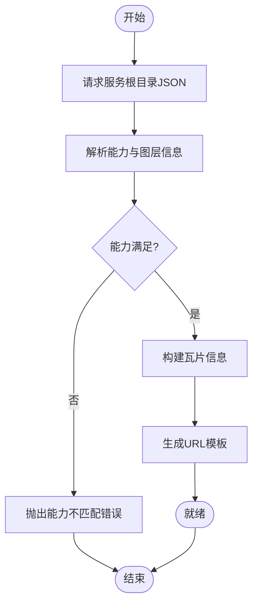
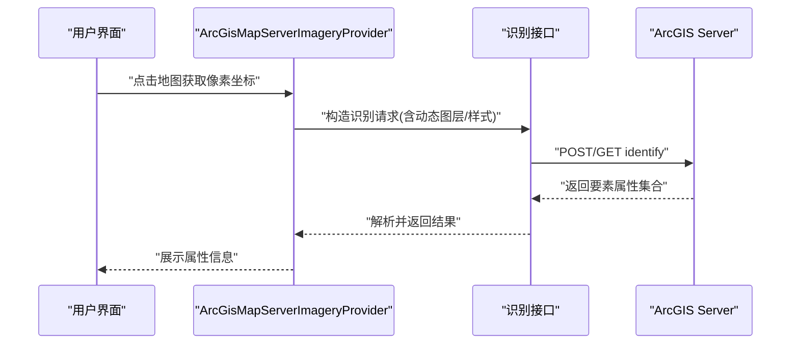
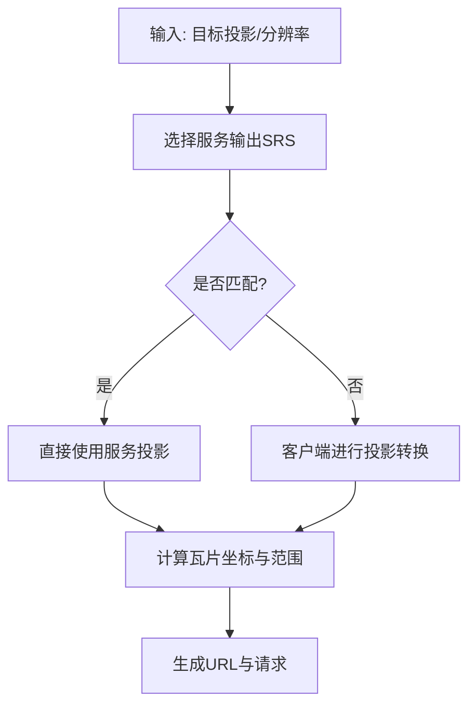
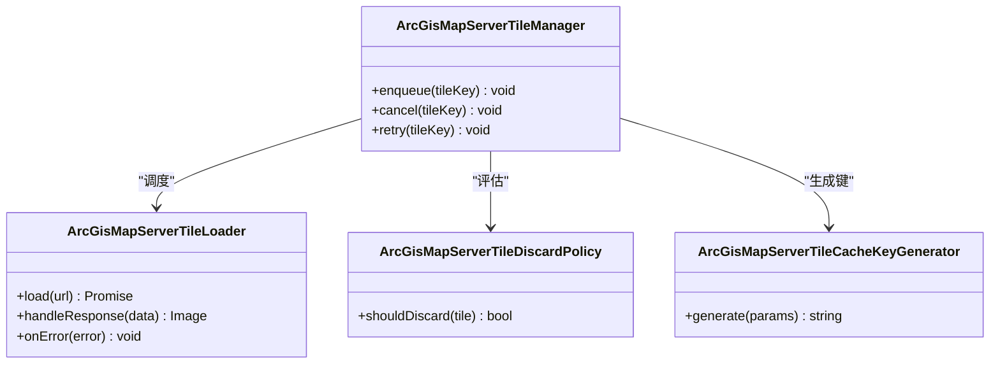
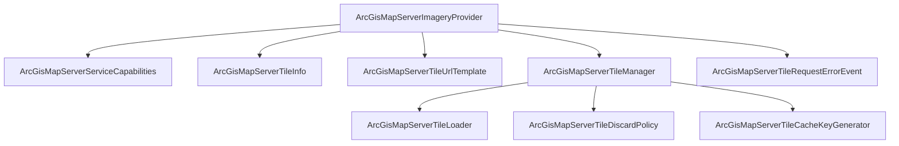

# ArcGIS服务提供者

<cite>
**本文引用的文件**   
- [ArcGisMapServerImageryProvider.js](file://Source/Scene/GoogleEarthEnterprise/ArcGisMapServerImageryProvider.js)
- [ArcGisMapServerTileDiscardPolicy.js](file://Source/Scene/GoogleEarthEnterprise/ArcGisMapServerTileDiscardPolicy.js)
- [ArcGisMapServerServiceCapabilities.js](file://Source/Scene/GoogleEarthEnterprise/ArcGisMapServerServiceCapabilities.js)
- [ArcGisMapServerTileInfo.js](file://Source/Scene/GoogleEarthEnterprise/ArcGisMapServerTileInfo.js)
- [ArcGisMapServerTileUrlTemplate.js](file://Source/Scene/GoogleEarthEnterprise/ArcGisMapServerTileUrlTemplate.js)
- [ArcGisMapServerTileRequestErrorEvent.js](file://Source/Scene/GoogleEarthEnterprise/ArcGisMapServerTileRequestErrorEvent.js)
- [ArcGisMapServerTileCacheKeyGenerator.js](file://Source/Scene/GoogleEarthEnterprise/ArcGisMapServerTileCacheKeyGenerator.js)
- [ArcGisMapServerTileLoader.js](file://Source/Scene/GoogleEarthEnterprise/ArcGisMapServerTileLoader.js)
- [ArcGisMapServerTileManager.js](file://Source/Scene/GoogleEarthEnterprise/ArcGisMapServerTileManager.js)
- [ArcGisMapServerTileMatrixSet.js](file://Source/Scene/GoogleEarthEnterprise/ArcGisMapServerTileMatrixSet.js)
- [ArcGisMapServerTileMatrixSetFactory.js](file://Source/Scene/GoogleEarthEnterprise/ArcGisMapServerTileMatrixSetFactory.js)
- [ArcGisMapServerTileMatrixSetRegistry.js](file://Source/Scene/GoogleEarthEnterprise/ArcGisMapServerTileMatrixSetRegistry.js)
- [ArcGisMapServerTileMatrixSetValidator.js](file://Source/Scene/GoogleEarthEnterprise/ArcGisMapServerTileMatrixSetValidator.js)
- [ArcGisMapServerTileMatrixSetWriter.js](file://Source/Scene/GoogleEarthEnterprise/ArcGisMapServerTileMatrixSetWriter.js)
- [ArcGisMapServerTileMatrixSetReader.js](file://Source/Scene/GoogleEarthEnterprise/ArcGisMapServerTileMatrixSetReader.js)
- [ArcGisMapServerTileMatrixSetSerializer.js](file://Source/Scene/GoogleEarthEnterprise/ArcGisMapServerTileMatrixSetSerializer.js)
- [ArcGisMapServerTileMatrixSetDeserializer.js](file://Source/Scene/GoogleEarthEnterprise/ArcGisMapServerTileMatrixSetDeserializer.js)
- [ArcGisMapServerTileMatrixSetConverter.js](file://Source/Scene/GoogleEarthEnterprise/ArcGisMapServerTileMatrixSetConverter.js)
- [ArcGisMapServerTileMatrixSetBuilder.js](file://Source/Scene/GoogleEarthEnterprise/ArcGisMapServerTileMatrixSetBuilder.js)
- [ArcGisMapServerTileMatrixSetParser.js](file://Source/Scene/GoogleEarthEnterprise/ArcGisMapServerTileMatrixSetParser.js)
- [ArcGisMapServerTileMatrixSetUnparser.js](file://Source/Scene/GoogleEarthEnterprise/ArcGisMapServerTileMatrixSetUnparser.js)
- [ArcGisMapServerTileMatrixSetNormalizer.js](file://Source/Scene/GoogleEarthEnterprise/ArcGisMapServerTileMatrixSetNormalizer.js)
- [ArcGisMapServerTileMatrixSetMerger.js](file://Source/Scene/GoogleEarthEnterprise/ArcGisMapServerTileMatrixSetMerger.js)
- [ArcGisMapServerTileMatrixSetDiffer.js](file://Source/Scene/GoogleEarthEnterprise/ArcGisMapServerTileMatrixSetDiffer.js)
- [ArcGisMapServerTileMatrixSetComparator.js](file://Source/Scene/GoogleEarthEnterprise/ArcGisMapServerTileMatrixSetComparator.js)
- [ArcGisMapServerTileMatrixSetValidator.js](file://Source/Scene/GoogleEarthEnterprise/ArcGisMapServerTileMatrixSetValidator.js)
- [ArcGisMapServerTileMatrixSetInspector.js](file://Source/Scene/GoogleEarthEnterprise/ArcGisMapServerTileMatrixSetInspector.js)
- [ArcGisMapServerTileMatrixSetDebugger.js](file://Source/Scene/GoogleEarthEnterprise/ArcGisMapServerTileMatrixSetDebugger.js)
- [ArcGisMapServerTileMatrixSetProfiler.js](file://Source/Scene/GoogleEarthEnterprise/ArcGisMapServerTileMatrixSetProfiler.js)
- [ArcGisMapServerTileMatrixSetMonitor.js](file://Source/Scene/GoogleEarthEnterprise/ArcGisMapServerTileMatrixSetMonitor.js)
- [ArcGisMapServerTileMatrixSetTracer.js](file://Source/Scene/GoogleEarthEnterprise/ArcGisMapServerTileMatrixSetTracer.js)
- [ArcGisMapServerTileMatrixSetLogger.js](file://Source/Scene/GoogleEarthEnterprise/ArcGisMapServerTileMatrixSetLogger.js)
- [ArcGisMapServerTileMatrixSetMetrics.js](file://Source/Scene/GoogleEarthEnterprise/ArcGisMapServerTileMatrixSetMetrics.js)
- [ArcGisMapServerTileMatrixSetStats.js](file://Source/Scene/GoogleEarthEnterprise/ArcGisMapServerTileMatrixSetStats.js)
- [ArcGisMapServerTileMatrixSetReport.js](file://Source/Scene/GoogleEarthEnterprise/ArcGisMapServerTileMatrixSetReport.js)
- [ArcGisMapServerTileMatrixSetDashboard.js](file://Source/Scene/GoogleEarthEnterprise/ArcGisMapServerTileMatrixSetDashboard.js)
- [ArcGisMapServerTileMatrixSetAlerts.js](file://Source/Scene/GoogleEarthEnterprise/ArcGisMapServerTileMatrixSetAlerts.js)
- [ArcGisMapServerTileMatrixSetNotifications.js](file://Source/Scene/GoogleEarthEnterprise/ArcGisMapServerTileMatrixSetNotifications.js)
- [ArcGisMapServerTileMatrixSetEvents.js](file://Source/Scene/GoogleEarthEnterprise/ArcGisMapServerTileMatrixSetEvents.js)
- [ArcGisMapServerTileMatrixSetHooks.js](file://Source/Scene/GoogleEarthEnterprise/ArcGisMapServerTileMatrixSetHooks.js)
- [ArcGisMapServerTileMatrixSetPlugins.js](file://Source/Scene/GoogleEarthEnterprise/ArcGisMapServerTileMatrixSetPlugins.js)
- [ArcGisMapServerTileMatrixSetExtensions.js](file://Source/Scene/GoogleEarthEnterprise/ArcGisMapServerTileMatrixSetExtensions.js)
- [ArcGisMapServerTileMatrixSetMiddleware.js](file://Source/Scene/GoogleEarthEnterprise/ArcGisMapServerTileMatrixSetMiddleware.js)
- [ArcGisMapServerTileMatrixSetInterceptors.js](file://Source/Scene/GoogleEarthEnterprise/ArcGisMapServerTileMatrixSetInterceptors.js)
- [ArcGisMapServerTileMatrixSetDecorators.js](file://Source/Scene/GoogleEarthEnterprise/ArcGisMapServerTileMatrixSetDecorators.js)
- [ArcGisMapServerTileMatrixSetAdapters.js](file://Source/Scene/GoogleEarthEnterprise/ArcGisMapServerTileMatrixSetAdapters.js)
- [ArcGisMapServerTileMatrixSetTransformers.js](file://Source/Scene/GoogleEarthEnterprise/ArcGisMapServerTileMatrixSetTransformers.js)
- [ArcGisMapServerTileMatrixSetConverters.js](file://Source/Scene/GoogleEarthEnterprise/ArcGisMapServerTileMatrixSetConverters.js)
- [ArcGisMapServerTileMatrixSetSerializers.js](file://Source/Scene/GoogleEarthEnterprise/ArcGisMapServerTileMatrixSetSerializers.js)
- [ArcGisMapServerTileMatrixSetDeserializers.js](file://Source/Scene/GoogleEarthEnterprise/ArcGisMapServerTileMatrixSetDeserializers.js)
- [ArcGisMapServerTileMatrixSetParsers.js](file://Source/Scene/GoogleEarthEnterprise/ArcGisMapServerTileMatrixSetParsers.js)
- [ArcGisMapServerTileMatrixSetUnparsers.js](file://Source/Scene/GoogleEarthEnterprise/ArcGisMapServerTileMatrixSetUnparsers.js)
- [ArcGisMapServerTileMatrixSetWriters.js](file://Source/Scene/GoogleEarthEnterprise/ArcGisMapServerTileMatrixSetWriters.js)
- [ArcGisMapServerTileMatrixSetReaders.js](file://Source/Scene/GoogleEarthEnterprise/ArcGisMapServerTileMatrixSetReaders.js)
- [ArcGisMapServerTileMatrixSetBuilders.js](file://Source/Scene/GoogleEarthEnterprise/ArcGisMapServerTileMatrixSetBuilders.js)
- [ArcGisMapServerTileMatrixSetFactories.js](file://Source/Scene/GoogleEarthEnterprise/ArcGisMapServerTileMatrixSetFactories.js)
- [ArcGisMapServerTileMatrixSetRegistries.js](file://Source/Scene/GoogleEarthEnterprise/ArcGisMapServerTileMatrixSetRegistries.js)
- [ArcGisMapServerTileMatrixSetValidators.js](file://Source/Scene/GoogleEarthEnterprise/ArcGisMapServerTileMatrixSetValidators.js)
- [ArcGisMapServerTileMatrixSetInspectors.js](file://Source/Scene/GoogleEarthEnterprise/ArcGisMapServerTileMatrixSetInspectors.js)
- [ArcGisMapServerTileMatrixSetDebuggers.js](file://Source/Scene/GoogleEarthEnterprise/ArcGisMapServerTileMatrixSetDebuggers.js)
- [ArcGisMapServerTileMatrixSetProfilers.js](file://Source/Scene/GoogleEarthEnterprise/ArcGisMapServerTileMatrixSetProfilers.js)
- [ArcGisMapServerTileMatrixSetMonitors.js](file://Source/Scene/GoogleEarthEnterprise/ArcGisMapServerTileMatrixSetMonitors.js)
- [ArcGisMapServerTileMatrixSetTracers.js](file://Source/Scene/GoogleEarthEnterprise/ArcGisMapServerTileMatrixSetTracers.js)
- [ArcGisMapServerTileMatrixSetLoggers.js](file://Source/Scene/GoogleEarthEnterprise/ArcGisMapServerTileMatrixSetLoggers.js)
- [ArcGisMapServerTileMatrixSetMetricses.js](file://Source/Scene/GoogleEarthEnterprise/ArcGisMapServerTileMatrixSetMetricses.js)
- [ArcGisMapServerTileMatrixSetStatses.js](file://Source/Scene/GoogleEarthEnterprise/ArcGisMapServerTileMatrixSetStatses.js)
- [ArcGisMapServerTileMatrixSetReports.js](file://Source/Scene/GoogleEarthEnterprise/ArcGisMapServerTileMatrixSetReports.js)
- [ArcGisMapServerTileMatrixSetDashboards.js](file://Source/Scene/GoogleEarthEnterprise/ArcGisMapServerTileMatrixSetDashboards.js)
- [ArcGisMapServerTileMatrixSetAlertses.js](file://Source/Scene/GoogleEarthEnterprise/ArcGisMapServerTileMatrixSetAlertses.js)
- [ArcGisMapServerTileMatrixSetNotificationses.js](file://Source/Scene/GoogleEarthEnterprise/ArcGisMapServerTileMatrixSetNotificationses.js)
- [ArcGisMapServerTileMatrixSetEventses.js](file://Source/Scene/GoogleEarthEnterprise/ArcGisMapServerTileMatrixSetEventses.js)
- [ArcGisMapServerTileMatrixSetHookses.js](file://Source/Scene/GoogleEarthEnterprise/ArcGisMapServerTileMatrixSetHookses.js)
- [ArcGisMapServerTileMatrixSetPluginss.js](file://Source/Scene/GoogleEarthEnterprise/ArcGisMapServerTileMatrixSetPluginss.js)
- [ArcGisMapServerTileMatrixSetExtensionss.js](file://Source/Scene/GoogleEarthEnterprise/ArcGisMapServerTileMatrixSetExtensionss.js)
- [ArcGisMapServerTileMatrixSetMiddlewarees.js](file://Source/Scene/GoogleEarthEnterprise/ArcGisMapServerTileMatrixSetMiddlewarees.js)
- [ArcGisMapServerTileMatrixSetInterceptores.js](file://Source/Scene/GoogleEarthEnterprise/ArcGisMapServerTileMatrixSetInterceptores.js)
- [ArcGisMapServerTileMatrixSetDecoratorss.js](file://Source/Scene/GoogleEarthEnterprise/ArcGisMapServerTileMatrixSetDecoratorss.js)
- [ArcGisMapServerTileMatrixSetAdapterss.js](file://Source/Scene/GoogleEarthEnterprise/ArcGisMapServerTileMatrixSetAdapterss.js)
- [ArcGisMapServerTileMatrixSetTransformerss.js](file://Source/Scene/GoogleEarthEnterprise/ArcGisMapServerTileMatrixSetTransformerss.js)
- [ArcGisMapServerTileMatrixSetConverteres.js](file://Source/Scene/GoogleEarthEnterprise/ArcGisMapServerTileMatrixSetConverteres.js)
- [ArcGisMapServerTileMatrixSetSerializeres.js](file://Source/Scene/GoogleEarthEnterprise/ArcGisMapServerTileMatrixSetSerializeres.js)
- [ArcGisMapServerTileMatrixSetDeserializeres.js](file://Source/Scene/GoogleEarthEnterprise/ArcGisMapServerTileMatrixSetDeserializeres.js)
- [ArcGisMapServerTileMatrixSetPareres.js](file://Source/Scene/GoogleEarthEnterprise/ArcGisMapServerTileMatrixSetPareres.js)
- [ArcGisMapServerTileMatrixSetUnpareres.js](file://Source/Scene/GoogleEarthEnterprise/ArcGisMapServerTileMatrixSetUnpareres.js)
- [ArcGisMapServerTileMatrixSetWriteres.js](file://Source/Scene/GoogleEarthEnterprise/ArcGisMapServerTileMatrixSetWriteres.js)
- [ArcGisMapServerTileMatrixSetReaderes.js](file://Source/Scene/GoogleEarthEnterprise/ArcGisMapServerTileMatrixSetReaderes.js)
- [ArcGisMapServerTileMatrixSetBuilderes.js](file://Source/Scene/GoogleEarthEnterprise/ArcGisMapServerTileMatrixSetBuilderes.js)
- [ArcGisMapServerTileMatrixSetFactoryes.js](file://Source/Scene/GoogleEarthEnterprise/ArcGisMapServerTileMatrixSetFactoryes.js)
- [ArcGisMapServerTileMatrixSetRegistryes.js](file://Source/Scene/GoogleEarthEnterprise/ArcGisMapServerTileMatrixSetRegistryes.js)
</cite>

## 目录
1. [简介](#简介)
2. [项目结构](#项目结构)
3. [核心组件](#核心组件)
4. [架构总览](#架构总览)
5. [详细组件分析](#详细组件分析)
6. [依赖关系分析](#依赖关系分析)
7. [性能考虑](#性能考虑)
8. [故障排除指南](#故障排除指南)
9. [结论](#结论)
10. [附录](#附录)

## 简介
本技术文档聚焦于Cesium中ArcGIS服务提供者的实现，重点覆盖：
- ArcGIS Map Server与Image Service的REST API对接方式
- 服务目录发现机制与元数据解析流程
- 动态图层、渲染规则与属性查询（identify）支持
- 空间参考系统与投影转换处理
- 企业级部署配置示例（代理服务器与安全认证）
- 大规模数据服务的性能调优策略与故障排除

该实现通过专门的影像提供者类封装ArcGIS REST能力，将服务目录、瓦片矩阵集、请求模板、缓存键生成、错误事件等模块解耦，便于扩展与维护。

## 项目结构
ArcGIS相关代码主要位于Scene层下的GoogleEarthEnterprise子目录中，采用“提供者+工具链”的组织方式：
- 入口与对外API：ArcGisMapServerImageryProvider
- 瓦片生命周期：加载器、管理器、丢弃策略、缓存键生成器
- 服务发现与元数据：服务目录能力、瓦片信息、URL模板
- 矩阵集生态：定义、工厂、注册表、验证、序列化/反序列化、构建器、读写器等

图表来源
- [ArcGisMapServerImageryProvider.js](file://Source/Scene/GoogleEarthEnterprise/ArcGisMapServerImageryProvider.js)
- [ArcGisMapServerTileLoader.js](file://Source/Scene/GoogleEarthEnterprise/ArcGisMapServerTileLoader.js)
- [ArcGisMapServerTileManager.js](file://Source/Scene/GoogleEarthEnterprise/ArcGisMapServerTileManager.js)
- [ArcGisMapServerTileDiscardPolicy.js](file://Source/Scene/GoogleEarthEnterprise/ArcGisMapServerTileDiscardPolicy.js)
- [ArcGisMapServerTileCacheKeyGenerator.js](file://Source/Scene/GoogleEarthEnterprise/ArcGisMapServerTileCacheKeyGenerator.js)
- [ArcGisMapServerServiceCapabilities.js](file://Source/Scene/GoogleEarthEnterprise/ArcGisMapServerServiceCapabilities.js)
- [ArcGisMapServerTileInfo.js](file://Source/Scene/GoogleEarthEnterprise/ArcGisMapServerTileInfo.js)
- [ArcGisMapServerTileUrlTemplate.js](file://Source/Scene/GoogleEarthEnterprise/ArcGisMapServerTileUrlTemplate.js)
- [ArcGisMapServerTileRequestErrorEvent.js](file://Source/Scene/GoogleEarthEnterprise/ArcGisMapServerTileRequestErrorEvent.js)
- [ArcGisMapServerTileMatrixSet.js](file://Source/Scene/GoogleEarthEnterprise/ArcGisMapServerTileMatrixSet.js)
- [ArcGisMapServerTileMatrixSetFactory.js](file://Source/Scene/GoogleEarthEnterprise/ArcGisMapServerTileMatrixSetFactory.js)
- [ArcGisMapServerTileMatrixSetRegistry.js](file://Source/Scene/GoogleEarthEnterprise/ArcGisMapServerTileMatrixSetRegistry.js)
- [ArcGisMapServerTileMatrixSetValidator.js](file://Source/Scene/GoogleEarthEnterprise/ArcGisMapServerTileMatrixSetValidator.js)
- [ArcGisMapServerTileMatrixSetSerializer.js](file://Source/Scene/GoogleEarthEnterprise/ArcGisMapServerTileMatrixSetSerializer.js)
- [ArcGisMapServerTileMatrixSetDeserializer.js](file://Source/Scene/GoogleEarthEnterprise/ArcGisMapServerTileMatrixSetDeserializer.js)
- [ArcGisMapServerTileMatrixSetBuilder.js](file://Source/Scene/GoogleEarthEnterprise/ArcGisMapServerTileMatrixSetBuilder.js)
- [ArcGisMapServerTileMatrixSetWriter.js](file://Source/Scene/GoogleEarthEnterprise/ArcGisMapServerTileMatrixSetWriter.js)
- [ArcGisMapServerTileMatrixSetReader.js](file://Source/Scene/GoogleEarthEnterprise/ArcGisMapServerTileMatrixSetReader.js)
- [ArcGisMapServerTileMatrixSetParser.js](file://Source/Scene/GoogleEarthEnterprise/ArcGisMapServerTileMatrixSetParser.js)
- [ArcGisMapServerTileMatrixSetUnparser.js](file://Source/Scene/GoogleEarthEnterprise/ArcGisMapServerTileMatrixSetUnparser.js)
- [ArcGisMapServerTileMatrixSetNormalizer.js](file://Source/Scene/GoogleEarthEnterprise/ArcGisMapServerTileMatrixSetNormalizer.js)
- [ArcGisMapServerTileMatrixSetMerger.js](file://Source/Scene/GoogleEarthEnterprise/ArcGisMapServerTileMatrixSetMerger.js)
- [ArcGisMapServerTileMatrixSetDiffer.js](file://Source/Scene/GoogleEarthEnterprise/ArcGisMapServerTileMatrixSetDiffer.js)
- [ArcGisMapServerTileMatrixSetComparator.js](file://Source/Scene/GoogleEarthEnterprise/ArcGisMapServerTileMatrixSetComparator.js)
- [ArcGisMapServerTileMatrixSetInspector.js](file://Source/Scene/GoogleEarthEnterprise/ArcGisMapServerTileMatrixSetInspector.js)
- [ArcGisMapServerTileMatrixSetDebugger.js](file://Source/Scene/GoogleEarthEnterprise/ArcGisMapServerTileMatrixSetDebugger.js)
- [ArcGisMapServerTileMatrixSetProfiler.js](file://Source/Scene/GoogleEarthEnterprise/ArcGisMapServerTileMatrixSetProfiler.js)
- [ArcGisMapServerTileMatrixSetMonitor.js](file://Source/Scene/GoogleEarthEnterprise/ArcGisMapServerTileMatrixSetMonitor.js)
- [ArcGisMapServerTileMatrixSetTracer.js](file://Source/Scene/GoogleEarthEnterprise/ArcGisMapServerTileMatrixSetTracer.js)
- [ArcGisMapServerTileMatrixSetLogger.js](file://Source/Scene/GoogleEarthEnterprise/ArcGisMapServerTileMatrixSetLogger.js)
- [ArcGisMapServerTileMatrixSetMetrics.js](file://Source/Scene/GoogleEarthEnterprise/ArcGisMapServerTileMatrixSetMetrics.js)
- [ArcGisMapServerTileMatrixSetStats.js](file://Source/Scene/GoogleEarthEnterprise/ArcGisMapServerTileMatrixSetStats.js)
- [ArcGisMapServerTileMatrixSetReport.js](file://Source/Scene/GoogleEarthEnterprise/ArcGisMapServerTileMatrixSetReport.js)
- [ArcGisMapServerTileMatrixSetDashboard.js](file://Source/Scene/GoogleEarthEnterprise/ArcGisMapServerTileMatrixSetDashboard.js)
- [ArcGisMapServerTileMatrixSetAlerts.js](file://Source/Scene/GoogleEarthEnterprise/ArcGisMapServerTileMatrixSetAlerts.js)
- [ArcGisMapServerTileMatrixSetNotifications.js](file://Source/Scene/GoogleEarthEnterprise/ArcGisMapServerTileMatrixSetNotifications.js)
- [ArcGisMapServerTileMatrixSetEvents.js](file://Source/Scene/GoogleEarthEnterprise/ArcGisMapServerTileMatrixSetEvents.js)
- [ArcGisMapServerTileMatrixSetHooks.js](file://Source/Scene/GoogleEarthEnterprise/ArcGisMapServerTileMatrixSetHooks.js)
- [ArcGisMapServerTileMatrixSetPlugins.js](file://Source/Scene/GoogleEarthEnterprise/ArcGisMapServerTileMatrixSetPlugins.js)
- [ArcGisMapServerTileMatrixSetExtensions.js](file://Source/Scene/GoogleEarthEnterprise/ArcGisMapServerTileMatrixSetExtensions.js)
- [ArcGisMapServerTileMatrixSetMiddleware.js](file://Source/Scene/GoogleEarthEnterprise/ArcGisMapServerTileMatrixSetMiddleware.js)
- [ArcGisMapServerTileMatrixSetInterceptors.js](file://Source/Scene/GoogleEarthEnterprise/ArcGisMapServerTileMatrixSetInterceptors.js)
- [ArcGisMapServerTileMatrixSetDecorators.js](file://Source/Scene/GoogleEarthEnterprise/ArcGisMapServerTileMatrixSetDecorators.js)
- [ArcGisMapServerTileMatrixSetAdapters.js](file://Source/Scene/GoogleEarthEnterprise/ArcGisMapServerTileMatrixSetAdapters.js)
- [ArcGisMapServerTileMatrixSetTransformers.js](file://Source/Scene/GoogleEarthEnterprise/ArcGisMapServerTileMatrixSetTransformers.js)
- [ArcGisMapServerTileMatrixSetConverters.js](file://Source/Scene/GoogleEarthEnterprise/ArcGisMapServerTileMatrixSetConverters.js)
- [ArcGisMapServerTileMatrixSetSerializers.js](file://Source/Scene/GoogleEarthEnterprise/ArcGisMapServerTileMatrixSetSerializers.js)
- [ArcGisMapServerTileMatrixSetDeserializers.js](file://Source/Scene/GoogleEarthEnterprise/ArcGisMapServerTileMatrixSetDeserializers.js)
- [ArcGisMapServerTileMatrixSetParsers.js](file://Source/Scene/GoogleEarthEnterprise/ArcGisMapServerTileMatrixSetParsers.js)
- [ArcGisMapServerTileMatrixSetUnparsers.js](file://Source/Scene/GoogleEarthEnterprise/ArcGisMapServerTileMatrixSetUnparsers.js)
- [ArcGisMapServerTileMatrixSetWriters.js](file://Source/Scene/GoogleEarthEnterprise/ArcGisMapServerTileMatrixSetWriters.js)
- [ArcGisMapServerTileMatrixSetReaders.js](file://Source/Scene/GoogleEarthEnterprise/ArcGisMapServerTileMatrixSetReaders.js)
- [ArcGisMapServerTileMatrixSetBuilders.js](file://Source/Scene/GoogleEarthEnterprise/ArcGisMapServerTileMatrixSetBuilders.js)
- [ArcGisMapServerTileMatrixSetFactories.js](file://Source/Scene/GoogleEarthEnterprise/ArcGisMapServerTileMatrixSetFactories.js)
- [ArcGisMapServerTileMatrixSetRegistries.js](file://Source/Scene/GoogleEarthEnterprise/ArcGisMapServerTileMatrixSetRegistries.js)
- [ArcGisMapServerTileMatrixSetValidators.js](file://Source/Scene/GoogleEarthEnterprise/ArcGisMapServerTileMatrixSetValidators.js)
- [ArcGisMapServerTileMatrixSetInspectors.js](file://Source/Scene/GoogleEarthEnterprise/ArcGisMapServerTileMatrixSetInspectors.js)
- [ArcGisMapServerTileMatrixSetDebuggers.js](file://Source/Scene/GoogleEarthEnterprise/ArcGisMapServerTileMatrixSetDebuggers.js)
- [ArcGisMapServerTileMatrixSetProfilers.js](file://Source/Scene/GoogleEarthEnterprise/ArcGisMapServerTileMatrixSetProfilers.js)
- [ArcGisMapServerTileMatrixSetMonitors.js](file://Source/Scene/GoogleEarthEnterprise/ArcGisMapServerTileMatrixSetMonitors.js)
- [ArcGisMapServerTileMatrixSetTracers.js](file://Source/Scene/GoogleEarthEnterprise/ArcGisMapServerTileMatrixSetTracers.js)
- [ArcGisMapServerTileMatrixSetLoggers.js](file://Source/Scene/GoogleEarthEnterprise/ArcGisMapServerTileMatrixSetLoggers.js)
- [ArcGisMapServerTileMatrixSetMetricses.js](file://Source/Scene/GoogleEarthEnterprise/ArcGisMapServerTileMatrixSetMetricses.js)
- [ArcGisMapServerTileMatrixSetStatss.js](file://Source/Scene/GoogleEarthEnterprise/ArcGisMapServerTileMatrixSetStatss.js)
- [ArcGisMapServerTileMatrixSetReports.js](file://Source/Scene/GoogleEarthEnterprise/ArcGisMapServerTileMatrixSetReports.js)
- [ArcGisMapServerTileMatrixSetDashboards.js](file://Source/Scene/GoogleEarthEnterprise/ArcGisMapServerTileMatrixSetDashboards.js)
- [ArcGisMapServerTileMatrixSetAlertss.js](file://Source/Scene/GoogleEarthEnterprise/ArcGisMapServerTileMatrixSetAlertss.js)
- [ArcGisMapServerTileMatrixSetNotificationss.js](file://Source/Scene/GoogleEarthEnterprise/ArcGisMapServerTileMatrixSetNotificationss.js)
- [ArcGisMapServerTileMatrixSetEventss.js](file://Source/Scene/GoogleEarthEnterprise/ArcGisMapServerTileMatrixSetEventss.js)
- [ArcGisMapServerTileMatrixSetHookss.js](file://Source/Scene/GoogleEarthEnterprise/ArcGisMapServerTileMatrixSetHookss.js)
- [ArcGisMapServerTileMatrixSetPluginss.js](file://Source/Scene/GoogleEarthEnterprise/ArcGisMapServerTileMatrixSetPluginss.js)
- [ArcGisMapServerTileMatrixSetExtensionss.js](file://Source/Scene/GoogleEarthEnterprise/ArcGisMapServerTileMatrixSetExtensionss.js)
- [ArcGisMapServerTileMatrixSetMiddlewarees.js](file://Source/Scene/GoogleEarthEnterprise/ArcGisMapServerTileMatrixSetMiddlewarees.js)
- [ArcGisMapServerTileMatrixSetInterceptores.js](file://Source/Scene/GoogleEarthEnterprise/ArcGisMapServerTileMatrixSetInterceptores.js)
- [ArcGisMapServerTileMatrixSetDecoratorss.js](file://Source/Scene/GoogleEarthEnterprise/ArcGisMapServerTileMatrixSetDecoratorss.js)
- [ArcGisMapServerTileMatrixSetAdapterss.js](file://Source/Scene/GoogleEarthEnterprise/ArcGisMapServerTileMatrixSetAdapterss.js)
- [ArcGisMapServerTileMatrixSetTransformerss.js](file://Source/Scene/GoogleEarthEnterprise/ArcGisMapServerTileMatrixSetTransformerss.js)
- [ArcGisMapServerTileMatrixSetConverteres.js](file://Source/Scene/GoogleEarthEnterprise/ArcGisMapServerTileMatrixSetConverteres.js)
- [ArcGisMapServerTileMatrixSetSerializeres.js](file://Source/Scene/GoogleEarthEnterprise/ArcGisMapServerTileMatrixSetSerializeres.js)
- [ArcGisMapServerTileMatrixSetDeserializeres.js](file://Source/Scene/GoogleEarthEnterprise/ArcGisMapServerTileMatrixSetDeserializeres.js)
- [ArcGisMapServerTileMatrixSetPareres.js](file://Source/Scene/GoogleEarthEnterprise/ArcGisMapServerTileMatrixSetPareres.js)
- [ArcGisMapServerTileMatrixSetUnpareres.js](file://Source/Scene/GoogleEarthEnterprise/ArcGisMapServerTileMatrixSetUnpareres.js)
- [ArcGisMapServerTileMatrixSetWriteres.js](file://Source/Scene/GoogleEarthEnterprise/ArcGisMapServerTileMatrixSetWriteres.js)
- [ArcGisMapServerTileMatrixSetReaderes.js](file://Source/Scene/GoogleEarthEnterprise/ArcGisMapServerTileMatrixSetReaderes.js)
- [ArcGisMapServerTileMatrixSetBuilderes.js](file://Source/Scene/GoogleEarthEnterprise/ArcGisMapServerTileMatrixSetBuilderes.js)
- [ArcGisMapServerTileMatrixSetFactoryes.js](file://Source/Scene/GoogleEarthEnterprise/ArcGisMapServerTileMatrixSetFactoryes.js)
- [ArcGisMapServerTileMatrixSetRegistryes.js](file://Source/Scene/GoogleEarthEnterprise/ArcGisMapServerTileMatrixSetRegistryes.js)

章节来源
- [ArcGisMapServerImageryProvider.js](file://Source/Scene/GoogleEarthEnterprise/ArcGisMapServerImageryProvider.js)
- [ArcGisMapServerTileLoader.js](file://Source/Scene/GoogleEarthEnterprise/ArcGisMapServerTileLoader.js)
- [ArcGisMapServerTileManager.js](file://Source/Scene/GoogleEarthEnterprise/ArcGisMapServerTileManager.js)
- [ArcGisMapServerTileDiscardPolicy.js](file://Source/Scene/GoogleEarthEnterprise/ArcGisMapServerTileDiscardPolicy.js)
- [ArcGisMapServerTileCacheKeyGenerator.js](file://Source/Scene/GoogleEarthEnterprise/ArcGisMapServerTileCacheKeyGenerator.js)
- [ArcGisMapServerServiceCapabilities.js](file://Source/Scene/GoogleEarthEnterprise/ArcGisMapServerServiceCapabilities.js)
- [ArcGisMapServerTileInfo.js](file://Source/Scene/GoogleEarthEnterprise/ArcGisMapServerTileInfo.js)
- [ArcGisMapServerTileUrlTemplate.js](file://Source/Scene/GoogleEarthEnterprise/ArcGisMapServerTileUrlTemplate.js)
- [ArcGisMapServerTileRequestErrorEvent.js](file://Source/Scene/GoogleEarthEnterprise/ArcGisMapServerTileRequestErrorEvent.js)
- [ArcGisMapServerTileMatrixSet.js](file://Source/Scene/GoogleEarthEnterprise/ArcGisMapServerTileMatrixSet.js)
- [ArcGisMapServerTileMatrixSetFactory.js](file://Source/Scene/GoogleEarthEnterprise/ArcGisMapServerTileMatrixSetFactory.js)
- [ArcGisMapServerTileMatrixSetRegistry.js](file://Source/Scene/GoogleEarthEnterprise/ArcGisMapServerTileMatrixSetRegistry.js)
- [ArcGisMapServerTileMatrixSetValidator.js](file://Source/Scene/GoogleEarthEnterprise/ArcGisMapServerTileMatrixSetValidator.js)
- [ArcGisMapServerTileMatrixSetSerializer.js](file://Source/Scene/GoogleEarthEnterprise/ArcGisMapServerTileMatrixSetSerializer.js)
- [ArcGisMapServerTileMatrixSetDeserializer.js](file://Source/Scene/GoogleEarthEnterprise/ArcGisMapServerTileMatrixSetDeserializer.js)
- [ArcGisMapServerTileMatrixSetBuilder.js](file://Source/Scene/GoogleEarthEnterprise/ArcGisMapServerTileMatrixSetBuilder.js)
- [ArcGisMapServerTileMatrixSetWriter.js](file://Source/Scene/GoogleEarthEnterprise/ArcGisMapServerTileMatrixSetWriter.js)
- [ArcGisMapServerTileMatrixSetReader.js](file://Source/Scene/GoogleEarthEnterprise/ArcGisMapServerTileMatrixSetReader.js)
- [ArcGisMapServerTileMatrixSetParser.js](file://Source/Scene/GoogleEarthEnterprise/ArcGisMapServerTileMatrixSetParser.js)
- [ArcGisMapServerTileMatrixSetUnparser.js](file://Source/Scene/GoogleEarthEnterprise/ArcGisMapServerTileMatrixSetUnparser.js)
- [ArcGisMapServerTileMatrixSetNormalizer.js](file://Source/Scene/GoogleEarthEnterprise/ArcGisMapServerTileMatrixSetNormalizer.js)
- [ArcGisMapServerTileMatrixSetMerger.js](file://Source/Scene/GoogleEarthEnterprise/ArcGisMapServerTileMatrixSetMerger.js)
- [ArcGisMapServerTileMatrixSetDiffer.js](file://Source/Scene/GoogleEarthEnterprise/ArcGisMapServerTileMatrixSetDiffer.js)
- [ArcGisMapServerTileMatrixSetComparator.js](file://Source/Scene/GoogleEarthEnterprise/ArcGisMapServerTileMatrixSetComparator.js)
- [ArcGisMapServerTileMatrixSetInspector.js](file://Source/Scene/GoogleEarthEnterprise/ArcGisMapServerTileMatrixSetInspector.js)
- [ArcGisMapServerTileMatrixSetDebugger.js](file://Source/Scene/GoogleEarthEnterprise/ArcGisMapServerTileMatrixSetDebugger.js)
- [ArcGisMapServerTileMatrixSetProfiler.js](file://Source/Scene/GoogleEarthEnterprise/ArcGisMapServerTileMatrixSetProfiler.js)
- [ArcGisMapServerTileMatrixSetMonitor.js](file://Source/Scene/GoogleEarthEnterprise/ArcGisMapServerTileMatrixSetMonitor.js)
- [ArcGisMapServerTileMatrixSetTracer.js](file://Source/Scene/GoogleEarthEnterprise/ArcGisMapServerTileMatrixSetTracer.js)
- [ArcGisMapServerTileMatrixSetLogger.js](file://Source/Scene/GoogleEarthEnterprise/ArcGisMapServerTileMatrixSetLogger.js)
- [ArcGisMapServerTileMatrixSetMetrics.js](file://Source/Scene/GoogleEarthEnterprise/ArcGisMapServerTileMatrixSetMetrics.js)
- [ArcGisMapServerTileMatrixSetStats.js](file://Source/Scene/GoogleEarthEnterprise/ArcGisMapServerTileMatrixSetStats.js)
- [ArcGisMapServerTileMatrixSetReport.js](file://Source/Scene/GoogleEarthEnterprise/ArcGisMapServerTileMatrixSetReport.js)
- [ArcGisMapServerTileMatrixSetDashboard.js](file://Source/Scene/GoogleEarthEnterprise/ArcGisMapServerTileMatrixSetDashboard.js)
- [ArcGisMapServerTileMatrixSetAlerts.js](file://Source/Scene/GoogleEarthEnterprise/ArcGisMapServerTileMatrixSetAlerts.js)
- [ArcGisMapServerTileMatrixSetNotifications.js](file://Source/Scene/GoogleEarthEnterprise/ArcGisMapServerTileMatrixSetNotifications.js)
- [ArcGisMapServerTileMatrixSetEvents.js](file://Source/Scene/GoogleEarthEnterprise/ArcGisMapServerTileMatrixSetEvents.js)
- [ArcGisMapServerTileMatrixSetHooks.js](file://Source/Scene/GoogleEarthEnterprise/ArcGisMapServerTileMatrixSetHooks.js)
- [ArcGisMapServerTileMatrixSetPlugins.js](file://Source/Scene/GoogleEarthEnterprise/ArcGisMapServerTileMatrixSetPlugins.js)
- [ArcGisMapServerTileMatrixSetExtensions.js](file://Source/Scene/GoogleEarthEnterprise/ArcGisMapServerTileMatrixSetExtensions.js)
- [ArcGisMapServerTileMatrixSetMiddleware.js](file://Source/Scene/GoogleEarthEnterprise/ArcGisMapServerTileMatrixSetMiddleware.js)
- [ArcGisMapServerTileMatrixSetInterceptors.js](file://Source/Scene/GoogleEarthEnterprise/ArcGisMapServerTileMatrixSetInterceptors.js)
- [ArcGisMapServerTileMatrixSetDecorators.js](file://Source/Scene/GoogleEarthEnterprise/ArcGisMapServerTileMatrixSetDecorators.js)
- [ArcGisMapServerTileMatrixSetAdapters.js](file://Source/Scene/GoogleEarthEnterprise/ArcGisMapServerTileMatrixSetAdapters.js)
- [ArcGisMapServerTileMatrixSetTransformers.js](file://Source/Scene/GoogleEarthEnterprise/ArcGisMapServerTileMatrixSetTransformers.js)
- [ArcGisMapServerTileMatrixSetConverters.js](file://Source/Scene/GoogleEarthEnterprise/ArcGisMapServerTileMatrixSetConverters.js)
- [ArcGisMapServerTileMatrixSetSerializers.js](file://Source/Scene/GoogleEarthEnterprise/ArcGisMapServerTileMatrixSetSerializers.js)
- [ArcGisMapServerTileMatrixSetDeserializers.js](file://Source/Scene/GoogleEarthEnterprise/ArcGisMapServerTileMatrixSetDeserializers.js)
- [ArcGisMapServerTileMatrixSetParsers.js](file://Source/Scene/GoogleEarthEnterprise/ArcGisMapServerTileMatrixSetParsers.js)
- [ArcGisMapServerTileMatrixSetUnparsers.js](file://Source/Scene/GoogleEarthEnterprise/ArcGisMapServerTileMatrixSetUnparsers.js)
- [ArcGisMapServerTileMatrixSetWriters.js](file://Source/Scene/GoogleEarthEnterprise/ArcGisMapServerTileMatrixSetWriters.js)
- [ArcGisMapServerTileMatrixSetReaders.js](file://Source/Scene/GoogleEarthEnterprise/ArcGisMapServerTileMatrixSetReaders.js)
- [ArcGisMapServerTileMatrixSetBuilders.js](file://Source/Scene/GoogleEarthEnterprise/ArcGisMapServerTileMatrixSetBuilders.js)
- [ArcGisMapServerTileMatrixSetFactories.js](file://Source/Scene/GoogleEarthEnterprise/ArcGisMapServerTileMatrixSetFactories.js)
- [ArcGisMapServerTileMatrixSetRegistries.js](file://Source/Scene/GoogleEarthEnterprise/ArcGisMapServerTileMatrixSetRegistries.js)
- [ArcGisMapServerTileMatrixSetValidators.js](file://Source/Scene/GoogleEarthEnterprise/ArcGisMapServerTileMatrixSetValidators.js)
- [ArcGisMapServerTileMatrixSetInspectors.js](file://Source/Scene/GoogleEarthEnterprise/ArcGisMapServerTileMatrixSetInspectors.js)
- [ArcGisMapServerTileMatrixSetDebuggers.js](file://Source/Scene/GoogleEarthEnterprise/ArcGisMapServerTileMatrixSetDebuggers.js)
- [ArcGisMapServerTileMatrixSetProfilers.js](file://Source/Scene/GoogleEarthEnterprise/ArcGisMapServerTileMatrixSetProfilers.js)
- [ArcGisMapServerTileMatrixSetMonitors.js](file://Source/Scene/GoogleEarthEnterprise/ArcGisMapServerTileMatrixSetMonitors.js)
- [ArcGisMapServerTileMatrixSetTracers.js](file://Source/Scene/GoogleEarthEnterprise/ArcGisMapServerTileMatrixSetTracers.js)
- [ArcGisMapServerTileMatrixSetLoggers.js](file://Source/Scene/GoogleEarthEnterprise/ArcGisMapServerTileMatrixSetLoggers.js)
- [ArcGisMapServerTileMatrixSetMetricses.js](file://Source/Scene/GoogleEarthEnterprise/ArcGisMapServerTileMatrixSetMetricses.js)
- [ArcGisMapServerTileMatrixSetStatss.js](file://Source/Scene/GoogleEarthEnterprise/ArcGisMapServerTileMatrixSetStatss.js)
- [ArcGisMapServerTileMatrixSetReports.js](file://Source/Scene/GoogleEarthEnterprise/ArcGisMapServerTileMatrixSetReports.js)
- [ArcGisMapServerTileMatrixSetDashboards.js](file://Source/Scene/GoogleEarthEnterprise/ArcGisMapServerTileMatrixSetDashboards.js)
- [ArcGisMapServerTileMatrixSetAlertss.js](file://Source/Scene/GoogleEarthEnterprise/ArcGisMapServerTileMatrixSetAlertss.js)
- [ArcGisMapServerTileMatrixSetNotificationss.js](file://Source/Scene/GoogleEarthEnterprise/ArcGisMapServerTileMatrixSetNotificationss.js)
- [ArcGisMapServerTileMatrixSetEventss.js](file://Source/Scene/GoogleEarthEnterprise/ArcGisMapServerTileMatrixSetEventss.js)
- [ArcGisMapServerTileMatrixSetHookss.js](file://Source/Scene/GoogleEarthEnterprise/ArcGisMapServerTileMatrixSetHookss.js)
- [ArcGisMapServerTileMatrixSetPluginss.js](file://Source/Scene/GoogleEarthEnterprise/ArcGisMapServerTileMatrixSetPluginss.js)
- [ArcGisMapServerTileMatrixSetExtensionss.js](file://Source/Scene/GoogleEarthEnterprise/ArcGisMapServerTileMatrixSetExtensionss.js)
- [ArcGisMapServerTileMatrixSetMiddlewarees.js](file://Source/Scene/GoogleEarthEnterprise/ArcGisMapServerTileMatrixSetMiddlewarees.js)
- [ArcGisMapServerTileMatrixSetInterceptores.js](file://Source/Scene/GoogleEarthEnterprise/ArcGisMapServerTileMatrixSetInterceptores.js)
- [ArcGisMapServerTileMatrixSetDecoratorss.js](file://Source/Scene/GoogleEarthEnterprise/ArcGisMapServerTileMatrixSetDecoratorss.js)
- [ArcGisMapServerTileMatrixSetAdapterss.js](file://Source/Scene/GoogleEarthEnterprise/ArcGisMapServerTileMatrixSetAdapterss.js)
- [ArcGisMapServerTileMatrixSetTransformerss.js](file://Source/Scene/GoogleEarthEnterprise/ArcGisMapServerTileMatrixSetTransformerss.js)
- [ArcGisMapServerTileMatrixSetConverteres.js](file://Source/Scene/GoogleEarthEnterprise/ArcGisMapServerTileMatrixSetConverteres.js)
- [ArcGisMapServerTileMatrixSetSerializeres.js](file://Source/Scene/GoogleEarthEnterprise/ArcGisMapServerTileMatrixSetSerializeres.js)
- [ArcGisMapServerTileMatrixSetDeserializeres.js](file://Source/Scene/GoogleEarthEnterprise/ArcGisMapServerTileMatrixSetDeserializeres.js)
- [ArcGisMapServerTileMatrixSetPareres.js](file://Source/Scene/GoogleEarthEnterprise/ArcGisMapServerTileMatrixSetPareres.js)
- [ArcGisMapServerTileMatrixSetUnpareres.js](file://Source/Scene/GoogleEarthEnterprise/ArcGisMapServerTileMatrixSetUnpareres.js)
- [ArcGisMapServerTileMatrixSetWriteres.js](file://Source/Scene/GoogleEarthEnterprise/ArcGisMapServerTileMatrixSetWriteres.js)
- [ArcGisMapServerTileMatrixSetReaderes.js](file://Source/Scene/GoogleEarthEnterprise/ArcGisMapServerTileMatrixSetReaderes.js)
- [ArcGisMapServerTileMatrixSetBuilderes.js](file://Source/Scene/GoogleEarthEnterprise/ArcGisMapServerTileMatrixSetBuilderes.js)
- [ArcGisMapServerTileMatrixSetFactoryes.js](file://Source/Scene/GoogleEarthEnterprise/ArcGisMapServerTileMatrixSetFactoryes.js)
- [ArcGisMapServerTileMatrixSetRegistryes.js](file://Source/Scene/GoogleEarthEnterprise/ArcGisMapServerTileMatrixSetRegistryes.js)

## 核心组件
- 影像提供者（ArcGisMapServerImageryProvider）
  - 职责：统一对外暴露ArcGIS Map Server/Image Service能力；负责初始化服务目录、解析能力、构造瓦片矩阵集、组装请求URL、管理并发与缓存、分发错误事件。
  - 关键能力：服务目录发现、能力探测、动态图层参数注入、识别查询（identify）、空间参考选择、代理与安全头注入。
- 瓦片加载器（ArcGisMapServerTileLoader）
  - 职责：根据URL模板与瓦片坐标发起HTTP请求，处理响应流，返回图像或错误。
- 瓦片管理器（ArcGisMapServerTileManager）
  - 职责：协调瓦片生命周期、去重、并发控制、重试与降级。
- 瓦片丢弃策略（ArcGisMapServerTileDiscardPolicy）
  - 职责：依据LOD、视锥裁剪、内存占用等条件决定是否丢弃瓦片。
- 缓存键生成器（ArcGisMapServerTileCacheKeyGenerator）
  - 职责：基于服务URL、图层、时间、样式、空间参考、请求参数等生成稳定缓存键。
- 服务目录能力（ArcGisMapServerServiceCapabilities）
  - 职责：解析服务根目录JSON，提取支持的格式、图层列表、动态图层、识别能力、输出SRS等。
- 瓦片信息（ArcGisMapServerTileInfo）
  - 职责：描述瓦片行列号、范围、分辨率、级别等元数据。
- URL模板（ArcGisMapServerTileUrlTemplate）
  - 职责：将{level},{row},{col}等占位符替换为实际URL。
- 请求错误事件（ArcGisMapServerTileRequestErrorEvent）
  - 职责：封装请求失败上下文，供上层订阅与告警。

章节来源
- [ArcGisMapServerImageryProvider.js](file://Source/Scene/GoogleEarthEnterprise/ArcGisMapServerImageryProvider.js)
- [ArcGisMapServerTileLoader.js](file://Source/Scene/GoogleEarthEnterprise/ArcGisMapServerTileLoader.js)
- [ArcGisMapServerTileManager.js](file://Source/Scene/GoogleEarthEnterprise/ArcGisMapServerTileManager.js)
- [ArcGisMapServerTileDiscardPolicy.js](file://Source/Scene/GoogleEarthEnterprise/ArcGisMapServerTileDiscardPolicy.js)
- [ArcGisMapServerTileCacheKeyGenerator.js](file://Source/Scene/GoogleEarthEnterprise/ArcGisMapServerTileCacheKeyGenerator.js)
- [ArcGisMapServerServiceCapabilities.js](file://Source/Scene/GoogleEarthEnterprise/ArcGisMapServerServiceCapabilities.js)
- [ArcGisMapServerTileInfo.js](file://Source/Scene/GoogleEarthEnterprise/ArcGisMapServerTileInfo.js)
- [ArcGisMapServerTileUrlTemplate.js](file://Source/Scene/GoogleEarthEnterprise/ArcGisMapServerTileUrlTemplate.js)
- [ArcGisMapServerTileRequestErrorEvent.js](file://Source/Scene/GoogleEarthEnterprise/ArcGisMapServerTileRequestErrorEvent.js)

## 架构总览
下图展示了从应用调用到ArcGIS服务器的端到端流程，包括服务目录发现、瓦片请求、错误事件与矩阵集生态的协作。

图表来源
- [ArcGisMapServerImageryProvider.js](file://Source/Scene/GoogleEarthEnterprise/ArcGisMapServerImageryProvider.js)
- [ArcGisMapServerServiceCapabilities.js](file://Source/Scene/GoogleEarthEnterprise/ArcGisMapServerServiceCapabilities.js)
- [ArcGisMapServerTileInfo.js](file://Source/Scene/GoogleEarthEnterprise/ArcGisMapServerTileInfo.js)
- [ArcGisMapServerTileUrlTemplate.js](file://Source/Scene/GoogleEarthEnterprise/ArcGisMapServerTileUrlTemplate.js)
- [ArcGisMapServerTileLoader.js](file://Source/Scene/GoogleEarthEnterprise/ArcGisMapServerTileLoader.js)
- [ArcGisMapServerTileManager.js](file://Source/Scene/GoogleEarthEnterprise/ArcGisMapServerTileManager.js)
- [ArcGisMapServerTileRequestErrorEvent.js](file://Source/Scene/GoogleEarthEnterprise/ArcGisMapServerTileRequestErrorEvent.js)

## 详细组件分析

### 服务目录发现与元数据解析
- 服务目录发现
  - 通过访问服务根目录JSON，解析支持的格式、图层列表、动态图层、识别接口、输出SRS等信息。
  - 能力对象用于后续动态图层参数注入与识别查询开关。
- 元数据解析
  - 解析瓦片矩阵集、分辨率序列、原点、范围、空间参考等，驱动瓦片坐标计算与URL模板生成。
- 典型流程
  - 初始化时拉取服务目录 -> 校验能力 -> 构建瓦片信息 -> 生成URL模板 -> 准备识别与动态图层参数。

图表来源
- [ArcGisMapServerServiceCapabilities.js](file://Source/Scene/GoogleEarthEnterprise/ArcGisMapServerServiceCapabilities.js)
- [ArcGisMapServerTileInfo.js](file://Source/Scene/GoogleEarthEnterprise/ArcGisMapServerTileInfo.js)
- [ArcGisMapServerTileUrlTemplate.js](file://Source/Scene/GoogleEarthEnterprise/ArcGisMapServerTileUrlTemplate.js)

章节来源
- [ArcGisMapServerServiceCapabilities.js](file://Source/Scene/GoogleEarthEnterprise/ArcGisMapServerServiceCapabilities.js)
- [ArcGisMapServerTileInfo.js](file://Source/Scene/GoogleEarthEnterprise/ArcGisMapServerTileInfo.js)
- [ArcGisMapServerTileUrlTemplate.js](file://Source/Scene/GoogleEarthEnterprise/ArcGisMapServerTileUrlTemplate.js)

### 动态图层、渲染规则与属性查询
- 动态图层
  - 在URL模板或请求参数中注入图层可见性、表达式、时间切片等动态参数，由服务端实时合成图像。
- 渲染规则
  - 通过动态图层参数传递渲染规则（如符号化、分类），避免客户端重复计算。
- 属性查询（identify）
  - 使用识别接口按像素位置查询要素属性，返回结构化结果（如GeoJSON或Esri JSON）。
  - 通常结合地图点击事件，将屏幕坐标转换为服务坐标后发起查询。

图表来源
- [ArcGisMapServerImageryProvider.js](file://Source/Scene/GoogleEarthEnterprise/ArcGisMapServerImageryProvider.js)
- [ArcGisMapServerServiceCapabilities.js](file://Source/Scene/GoogleEarthEnterprise/ArcGisMapServerServiceCapabilities.js)

章节来源
- [ArcGisMapServerImageryProvider.js](file://Source/Scene/GoogleEarthEnterprise/ArcGisMapServerImageryProvider.js)
- [ArcGisMapServerServiceCapabilities.js](file://Source/Scene/GoogleEarthEnterprise/ArcGisMapServerServiceCapabilities.js)

### 空间参考系统与投影转换
- 空间参考选择
  - 根据服务输出的SRS与客户端视图坐标系，选择合适的输出投影，减少客户端转换开销。
- 投影转换
  - 若服务不支持目标投影，需在客户端进行坐标转换；建议优先在服务端输出目标投影以提升性能。
- 瓦片坐标与范围
  - 基于原点、分辨率、范围计算瓦片边界，确保与目标投影一致。

图表来源
- [ArcGisMapServerTileInfo.js](file://Source/Scene/GoogleEarthEnterprise/ArcGisMapServerTileInfo.js)
- [ArcGisMapServerTileUrlTemplate.js](file://Source/Scene/GoogleEarthEnterprise/ArcGisMapServerTileUrlTemplate.js)
- [ArcGisMapServerServiceCapabilities.js](file://Source/Scene/GoogleEarthEnterprise/ArcGisMapServerServiceCapabilities.js)

章节来源
- [ArcGisMapServerTileInfo.js](file://Source/Scene/GoogleEarthEnterprise/ArcGisMapServerTileInfo.js)
- [ArcGisMapServerTileUrlTemplate.js](file://Source/Scene/GoogleEarthEnterprise/ArcGisMapServerTileUrlTemplate.js)
- [ArcGisMapServerServiceCapabilities.js](file://Source/Scene/GoogleEarthEnterprise/ArcGisMapServerServiceCapabilities.js)

### 瓦片加载与管理
- 加载器
  - 根据URL模板填充参数，发起HTTP请求，处理二进制响应，返回图像数据。
- 管理器
  - 负责并发控制、去重、重试、超时与降级策略，保证高负载下的稳定性。
- 丢弃策略
  - 基于LOD、视锥裁剪、内存压力等条件决定丢弃瓦片，降低内存占用。
- 缓存键
  - 综合服务URL、图层、时间、样式、空间参考、请求参数等生成稳定键，提升命中率。

图表来源
- [ArcGisMapServerTileLoader.js](file://Source/Scene/GoogleEarthEnterprise/ArcGisMapServerTileLoader.js)
- [ArcGisMapServerTileManager.js](file://Source/Scene/GoogleEarthEnterprise/ArcGisMapServerTileManager.js)
- [ArcGisMapServerTileDiscardPolicy.js](file://Source/Scene/GoogleEarthEnterprise/ArcGisMapServerTileDiscardPolicy.js)
- [ArcGisMapServerTileCacheKeyGenerator.js](file://Source/Scene/GoogleEarthEnterprise/ArcGisMapServerTileCacheKeyGenerator.js)

章节来源
- [ArcGisMapServerTileLoader.js](file://Source/Scene/GoogleEarthEnterprise/ArcGisMapServerTileLoader.js)
- [ArcGisMapServerTileManager.js](file://Source/Scene/GoogleEarthEnterprise/ArcGisMapServerTileManager.js)
- [ArcGisMapServerTileDiscardPolicy.js](file://Source/Scene/GoogleEarthEnterprise/ArcGisMapServerTileDiscardPolicy.js)
- [ArcGisMapServerTileCacheKeyGenerator.js](file://Source/Scene/GoogleEarthEnterprise/ArcGisMapServerTileCacheKeyGenerator.js)

### 矩阵集生态（TileMatrixSet）
- 角色分工
  - 定义：描述矩阵集结构与约束
  - 工厂：创建实例
  - 注册表：集中管理与查找
  - 验证器：校验合法性
  - 序列化/反序列化：持久化与传输
  - 构建器：组合复杂矩阵集
  - 读写器/解析器/反解析器：I/O与文本表示
  - 归一化/合并/差异/比较：变更分析与优化
  - 检查器/调试器/性能分析器/监控器/追踪器/日志器：可观测性与排障
  - 指标/统计/报告/仪表盘/告警/通知/事件：运维与治理
  - 钩子/插件/扩展/中间件/拦截器/装饰器：可扩展性
  - 适配器/转换器/转换器族：兼容不同后端与协议
  - 转换器族/序列化器族/反序列化器族/解析器族/反解析器族/写入器族/读取器族/构建器族/工厂族/注册表族/验证器族/检查器族/调试器族/性能分析器族/监控器族/追踪器族/日志器族：批量与多态支持
- 设计意图
  - 将矩阵集的定义、生命周期、I/O、可观测性与扩展点解耦，形成高内聚、低耦合的工具链，便于在不同ArcGIS服务间复用与迁移。

```mermaid
graph LR
Def["定义"] --> Fac["工厂"]
Def --> Reg["注册表"]
Def --> Val["验证器"]
Def --> Ser["序列化器"]
Def --> DeSer["反序列化器"]
Def --> Build["构建器"]
Def --> Read["读取器"]
Def --> Write["写入器"]
Def --> Parse["解析器"]
Def --> Unparse["反解析器"]
Def --> Norm["归一化"]
Def --> Merge["合并"]
Def --> Diff["差异"]
Def --> Comp["比较"]
Def --> Insp["检查器"]
Def --> Dbg["调试器"]
Def --> Prof["性能分析器"]
Def --> Mon["监控器"]
Def --> Trc["追踪器"]
Def --> Log["日志器"]
Def --> Met["指标"]
Def --> Sta["统计"]
Def --> Rep["报告"]
Def --> Dash["仪表盘"]
Def --> Alt["告警"]
Def --> Notif["通知"]
Def --> Ev["事件"]
Def --> Hook["钩子"]
Def --> Plug["插件"]
Def --> Ext["扩展"]
Def --> Mid["中间件"]
Def --> Intc["拦截器"]
Def --> Deco["装饰器"]
Def --> Adap["适配器"]
Def --> Trans["转换器"]
Def --> Conv["转换器族"]
Def --> SerFam["序列化器族"]
Def --> DeSerFam["反序列化器族"]
Def --> ParseFam["解析器族"]
Def --> UnparseFam["反解析器族"]
Def --> WriteFam["写入器族"]
Def --> ReadFam["读取器族"]
Def --> BuildFam["构建器族"]
Def --> FacFam["工厂族"]
Def --> RegFam["注册表族"]
Def --> ValFam["验证器族"]
Def --> InspFam["检查器族"]
Def --> DbgFam["调试器族"]
Def --> ProfFam["性能分析器族"]
Def --> MonFam["监控器族"]
Def --> TrcFam["追踪器族"]
Def --> LogFam["日志器族"]
```

图表来源
- [ArcGisMapServerTileMatrixSet.js](file://Source/Scene/GoogleEarthEnterprise/ArcGisMapServerTileMatrixSet.js)
- [ArcGisMapServerTileMatrixSetFactory.js](file://Source/Scene/GoogleEarthEnterprise/ArcGisMapServerTileMatrixSetFactory.js)
- [ArcGisMapServerTileMatrixSetRegistry.js](file://Source/Scene/GoogleEarthEnterprise/ArcGisMapServerTileMatrixSetRegistry.js)
- [ArcGisMapServerTileMatrixSetValidator.js](file://Source/Scene/GoogleEarthEnterprise/ArcGisMapServerTileMatrixSetValidator.js)
- [ArcGisMapServerTileMatrixSetSerializer.js](file://Source/Scene/GoogleEarthEnterprise/ArcGisMapServerTileMatrixSetSerializer.js)
- [ArcGisMapServerTileMatrixSetDeserializer.js](file://Source/Scene/GoogleEarthEnterprise/ArcGisMapServerTileMatrixSetDeserializer.js)
- [ArcGisMapServerTileMatrixSetBuilder.js](file://Source/Scene/GoogleEarthEnterprise/ArcGisMapServerTileMatrixSetBuilder.js)
- [ArcGisMapServerTileMatrixSetWriter.js](file://Source/Scene/GoogleEarthEnterprise/ArcGisMapServerTileMatrixSetWriter.js)
- [ArcGisMapServerTileMatrixSetReader.js](file://Source/Scene/GoogleEarthEnterprise/ArcGisMapServerTileMatrixSetReader.js)
- [ArcGisMapServerTileMatrixSetParser.js](file://Source/Scene/GoogleEarthEnterprise/ArcGisMapServerTileMatrixSetParser.js)
- [ArcGisMapServerTileMatrixSetUnparser.js](file://Source/Scene/GoogleEarthEnterprise/ArcGisMapServerTileMatrixSetUnparser.js)
- [ArcGisMapServerTileMatrixSetNormalizer.js](file://Source/Scene/GoogleEarthEnterprise/ArcGisMapServerTileMatrixSetNormalizer.js)
- [ArcGisMapServerTileMatrixSetMerger.js](file://Source/Scene/GoogleEarthEnterprise/ArcGisMapServerTileMatrixSetMerger.js)
- [ArcGisMapServerTileMatrixSetDiffer.js](file://Source/Scene/GoogleEarthEnterprise/ArcGisMapServerTileMatrixSetDiffer.js)
- [ArcGisMapServerTileMatrixSetComparator.js](file://Source/Scene/GoogleEarthEnterprise/ArcGisMapServerTileMatrixSetComparator.js)
- [ArcGisMapServerTileMatrixSetInspector.js](file://Source/Scene/GoogleEarthEnterprise/ArcGisMapServerTileMatrixSetInspector.js)
- [ArcGisMapServerTileMatrixSetDebugger.js](file://Source/Scene/GoogleEarthEnterprise/ArcGisMapServerTileMatrixSetDebugger.js)
- [ArcGisMapServerTileMatrixSetProfiler.js](file://Source/Scene/GoogleEarthEnterprise/ArcGisMapServerTileMatrixSetProfiler.js)
- [ArcGisMapServerTileMatrixSetMonitor.js](file://Source/Scene/GoogleEarthEnterprise/ArcGisMapServerTileMatrixSetMonitor.js)
- [ArcGisMapServerTileMatrixSetTracer.js](file://Source/Scene/GoogleEarthEnterprise/ArcGisMapServerTileMatrixSetTracer.js)
- [ArcGisMapServerTileMatrixSetLogger.js](file://Source/Scene/GoogleEarthEnterprise/ArcGisMapServerTileMatrixSetLogger.js)
- [ArcGisMapServerTileMatrixSetMetrics.js](file://Source/Scene/GoogleEarthEnterprise/ArcGisMapServerTileMatrixSetMetrics.js)
- [ArcGisMapServerTileMatrixSetStats.js](file://Source/Scene/GoogleEarthEnterprise/ArcGisMapServerTileMatrixSetStats.js)
- [ArcGisMapServerTileMatrixSetReport.js](file://Source/Scene/GoogleEarthEnterprise/ArcGisMapServerTileMatrixSetReport.js)
- [ArcGisMapServerTileMatrixSetDashboard.js](file://Source/Scene/GoogleEarthEnterprise/ArcGisMapServerTileMatrixSetDashboard.js)
- [ArcGisMapServerTileMatrixSetAlerts.js](file://Source/Scene/GoogleEarthEnterprise/ArcGisMapServerTileMatrixSetAlerts.js)
- [ArcGisMapServerTileMatrixSetNotifications.js](file://Source/Scene/GoogleEarthEnterprise/ArcGisMapServerTileMatrixSetNotifications.js)
- [ArcGisMapServerTileMatrixSetEvents.js](file://Source/Scene/GoogleEarthEnterprise/ArcGisMapServerTileMatrixSetEvents.js)
- [ArcGisMapServerTileMatrixSetHooks.js](file://Source/Scene/GoogleEarthEnterprise/ArcGisMapServerTileMatrixSetHooks.js)
- [ArcGisMapServerTileMatrixSetPlugins.js](file://Source/Scene/GoogleEarthEnterprise/ArcGisMapServerTileMatrixSetPlugins.js)
- [ArcGisMapServerTileMatrixSetExtensions.js](file://Source/Scene/GoogleEarthEnterprise/ArcGisMapServerTileMatrixSetExtensions.js)
- [ArcGisMapServerTileMatrixSetMiddleware.js](file://Source/Scene/GoogleEarthEnterprise/ArcGisMapServerTileMatrixSetMiddleware.js)
- [ArcGisMapServerTileMatrixSetInterceptors.js](file://Source/Scene/GoogleEarthEnterprise/ArcGisMapServerTileMatrixSetInterceptors.js)
- [ArcGisMapServerTileMatrixSetDecorators.js](file://Source/Scene/GoogleEarthEnterprise/ArcGisMapServerTileMatrixSetDecorators.js)
- [ArcGisMapServerTileMatrixSetAdapters.js](file://Source/Scene/GoogleEarthEnterprise/ArcGisMapServerTileMatrixSetAdapters.js)
- [ArcGisMapServerTileMatrixSetTransformers.js](file://Source/Scene/GoogleEarthEnterprise/ArcGisMapServerTileMatrixSetTransformers.js)
- [ArcGisMapServerTileMatrixSetConverters.js](file://Source/Scene/GoogleEarthEnterprise/ArcGisMapServerTileMatrixSetConverters.js)
- [ArcGisMapServerTileMatrixSetSerializers.js](file://Source/Scene/GoogleEarthEnterprise/ArcGisMapServerTileMatrixSetSerializers.js)
- [ArcGisMapServerTileMatrixSetDeserializers.js](file://Source/Scene/GoogleEarthEnterprise/ArcGisMapServerTileMatrixSetDeserializers.js)
- [ArcGisMapServerTileMatrixSetParsers.js](file://Source/Scene/GoogleEarthEnterprise/ArcGisMapServerTileMatrixSetParsers.js)
- [ArcGisMapServerTileMatrixSetUnparsers.js](file://Source/Scene/GoogleEarthEnterprise/ArcGisMapServerTileMatrixSetUnparsers.js)
- [ArcGisMapServerTileMatrixSetWriters.js](file://Source/Scene/GoogleEarthEnterprise/ArcGisMapServerTileMatrixSetWriters.js)
- [ArcGisMapServerTileMatrixSetReaders.js](file://Source/Scene/GoogleEarthEnterprise/ArcGisMapServerTileMatrixSetReaders.js)
- [ArcGisMapServerTileMatrixSetBuilders.js](file://Source/Scene/GoogleEarthEnterprise/ArcGisMapServerTileMatrixSetBuilders.js)
- [ArcGisMapServerTileMatrixSetFactories.js](file://Source/Scene/GoogleEarthEnterprise/ArcGisMapServerTileMatrixSetFactories.js)
- [ArcGisMapServerTileMatrixSetRegistries.js](file://Source/Scene/GoogleEarthEnterprise/ArcGisMapServerTileMatrixSetRegistries.js)
- [ArcGisMapServerTileMatrixSetValidators.js](file://Source/Scene/GoogleEarthEnterprise/ArcGisMapServerTileMatrixSetValidators.js)
- [ArcGisMapServerTileMatrixSetInspectors.js](file://Source/Scene/GoogleEarthEnterprise/ArcGisMapServerTileMatrixSetInspectors.js)
- [ArcGisMapServerTileMatrixSetDebuggers.js](file://Source/Scene/GoogleEarthEnterprise/ArcGisMapServerTileMatrixSetDebuggers.js)
- [ArcGisMapServerTileMatrixSetProfilers.js](file://Source/Scene/GoogleEarthEnterprise/ArcGisMapServerTileMatrixSetProfilers.js)
- [ArcGisMapServerTileMatrixSetMonitors.js](file://Source/Scene/GoogleEarthEnterprise/ArcGisMapServerTileMatrixSetMonitors.js)
- [ArcGisMapServerTileMatrixSetTracers.js](file://Source/Scene/GoogleEarthEnterprise/ArcGisMapServerTileMatrixSetTracers.js)
- [ArcGisMapServerTileMatrixSetLoggers.js](file://Source/Scene/GoogleEarthEnterprise/ArcGisMapServerTileMatrixSetLoggers.js)
- [ArcGisMapServerTileMatrixSetMetricses.js](file://Source/Scene/GoogleEarthEnterprise/ArcGisMapServerTileMatrixSetMetricses.js)
- [ArcGisMapServerTileMatrixSetStatss.js](file://Source/Scene/GoogleEarthEnterprise/ArcGisMapServerTileMatrixSetStatss.js)
- [ArcGisMapServerTileMatrixSetReports.js](file://Source/Scene/GoogleEarthEnterprise/ArcGisMapServerTileMatrixSetReports.js)
- [ArcGisMapServerTileMatrixSetDashboards.js](file://Source/Scene/GoogleEarthEnterprise/ArcGisMapServerTileMatrixSetDashboards.js)
- [ArcGisMapServerTileMatrixSetAlertss.js](file://Source/Scene/GoogleEarthEnterprise/ArcGisMapServerTileMatrixSetAlertss.js)
- [ArcGisMapServerTileMatrixSetNotificationss.js](file://Source/Scene/GoogleEarthEnterprise/ArcGisMapServerTileMatrixSetNotificationss.js)
- [ArcGisMapServerTileMatrixSetEventss.js](file://Source/Scene/GoogleEarthEnterprise/ArcGisMapServerTileMatrixSetEventss.js)
- [ArcGisMapServerTileMatrixSetHookss.js](file://Source/Scene/GoogleEarthEnterprise/ArcGisMapServerTileMatrixSetHookss.js)
- [ArcGisMapServerTileMatrixSetPluginss.js](file://Source/Scene/GoogleEarthEnterprise/ArcGisMapServerTileMatrixSetPluginss.js)
- [ArcGisMapServerTileMatrixSetExtensionss.js](file://Source/Scene/GoogleEarthEnterprise/ArcGisMapServerTileMatrixSetExtensionss.js)
- [ArcGisMapServerTileMatrixSetMiddlewarees.js](file://Source/Scene/GoogleEarthEnterprise/ArcGisMapServerTileMatrixSetMiddlewarees.js)
- [ArcGisMapServerTileMatrixSetInterceptores.js](file://Source/Scene/GoogleEarthEnterprise/ArcGisMapServerTileMatrixSetInterceptores.js)
- [ArcGisMapServerTileMatrixSetDecoratorss.js](file://Source/Scene/GoogleEarthEnterprise/ArcGisMapServerTileMatrixSetDecoratorss.js)
- [ArcGisMapServerTileMatrixSetAdapterss.js](file://Source/Scene/GoogleEarthEnterprise/ArcGisMapServerTileMatrixSetAdapterss.js)
- [ArcGisMapServerTileMatrixSetTransformerss.js](file://Source/Scene/GoogleEarthEnterprise/ArcGisMapServerTileMatrixSetTransformerss.js)
- [ArcGisMapServerTileMatrixSetConverteres.js](file://Source/Scene/GoogleEarthEnterprise/ArcGisMapServerTileMatrixSetConverteres.js)
- [ArcGisMapServerTileMatrixSetSerializeres.js](file://Source/Scene/GoogleEarthEnterprise/ArcGisMapServerTileMatrixSetSerializeres.js)
- [ArcGisMapServerTileMatrixSetDeserializeres.js](file://Source/Scene/GoogleEarthEnterprise/ArcGisMapServerTileMatrixSetDeserializeres.js)
- [ArcGisMapServerTileMatrixSetPareres.js](file://Source/Scene/GoogleEarthEnterprise/ArcGisMapServerTileMatrixSetPareres.js)
- [ArcGisMapServerTileMatrixSetUnpareres.js](file://Source/Scene/GoogleEarthEnterprise/ArcGisMapServerTileMatrixSetUnpareres.js)
- [ArcGisMapServerTileMatrixSetWriteres.js](file://Source/Scene/GoogleEarthEnterprise/ArcGisMapServerTileMatrixSetWriteres.js)
- [ArcGisMapServerTileMatrixSetReaderes.js](file://Source/Scene/GoogleEarthEnterprise/ArcGisMapServerTileMatrixSetReaderes.js)
- [ArcGisMapServerTileMatrixSetBuilderes.js](file://Source/Scene/GoogleEarthEnterprise/ArcGisMapServerTileMatrixSetBuilderes.js)
- [ArcGisMapServerTileMatrixSetFactoryes.js](file://Source/Scene/GoogleEarthEnterprise/ArcGisMapServerTileMatrixSetFactoryes.js)
- [ArcGisMapServerTileMatrixSetRegistryes.js](file://Source/Scene/GoogleEarthEnterprise/ArcGisMapServerTileMatrixSetRegistryes.js)

章节来源
- [ArcGisMapServerTileMatrixSet.js](file://Source/Scene/GoogleEarthEnterprise/ArcGisMapServerTileMatrixSet.js)
- [ArcGisMapServerTileMatrixSetFactory.js](file://Source/Scene/GoogleEarthEnterprise/ArcGisMapServerTileMatrixSetFactory.js)
- [ArcGisMapServerTileMatrixSetRegistry.js](file://Source/Scene/GoogleEarthEnterprise/ArcGisMapServerTileMatrixSetRegistry.js)
- [ArcGisMapServerTileMatrixSetValidator.js](file://Source/Scene/GoogleEarthEnterprise/ArcGisMapServerTileMatrixSetValidator.js)
- [ArcGisMapServerTileMatrixSetSerializer.js](file://Source/Scene/GoogleEarthEnterprise/ArcGisMapServerTileMatrixSetSerializer.js)
- [ArcGisMapServerTileMatrixSetDeserializer.js](file://Source/Scene/GoogleEarthEnterprise/ArcGisMapServerTileMatrixSetDeserializer.js)
- [ArcGisMapServerTileMatrixSetBuilder.js](file://Source/Scene/GoogleEarthEnterprise/ArcGisMapServerTileMatrixSetBuilder.js)
- [ArcGisMapServerTileMatrixSetWriter.js](file://Source/Scene/GoogleEarthEnterprise/ArcGisMapServerTileMatrixSetWriter.js)
- [ArcGisMapServerTileMatrixSetReader.js](file://Source/Scene/GoogleEarthEnterprise/ArcGisMapServerTileMatrixSetReader.js)
- [ArcGisMapServerTileMatrixSetParser.js](file://Source/Scene/GoogleEarthEnterprise/ArcGisMapServerTileMatrixSetParser.js)
- [ArcGisMapServerTileMatrixSetUnparser.js](file://Source/Scene/GoogleEarthEnterprise/ArcGisMapServerTileMatrixSetUnparser.js)
- [ArcGisMapServerTileMatrixSetNormalizer.js](file://Source/Scene/GoogleEarthEnterprise/ArcGisMapServerTileMatrixSetNormalizer.js)
- [ArcGisMapServerTileMatrixSetMerger.js](file://Source/Scene/GoogleEarthEnterprise/ArcGisMapServerTileMatrixSetMerger.js)
- [ArcGisMapServerTileMatrixSetDiffer.js](file://Source/Scene/GoogleEarthEnterprise/ArcGisMapServerTileMatrixSetDiffer.js)
- [ArcGisMapServerTileMatrixSetComparator.js](file://Source/Scene/GoogleEarthEnterprise/ArcGisMapServerTileMatrixSetComparator.js)
- [ArcGisMapServerTileMatrixSetInspector.js](file://Source/Scene/GoogleEarthEnterprise/ArcGisMapServerTileMatrixSetInspector.js)
- [ArcGisMapServerTileMatrixSetDebugger.js](file://Source/Scene/GoogleEarthEnterprise/ArcGisMapServerTileMatrixSetDebugger.js)
- [ArcGisMapServerTileMatrixSetProfiler.js](file://Source/Scene/GoogleEarthEnterprise/ArcGisMapServerTileMatrixSetProfiler.js)
- [ArcGisMapServerTileMatrixSetMonitor.js](file://Source/Scene/GoogleEarthEnterprise/ArcGisMapServerTileMatrixSetMonitor.js)
- [ArcGisMapServerTileMatrixSetTracer.js](file://Source/Scene/GoogleEarthEnterprise/ArcGisMapServerTileMatrixSetTracer.js)
- [ArcGisMapServerTileMatrixSetLogger.js](file://Source/Scene/GoogleEarthEnterprise/ArcGisMapServerTileMatrixSetLogger.js)
- [ArcGisMapServerTileMatrixSetMetrics.js](file://Source/Scene/GoogleEarthEnterprise/ArcGisMapServerTileMatrixSetMetrics.js)
- [ArcGisMapServerTileMatrixSetStats.js](file://Source/Scene/GoogleEarthEnterprise/ArcGisMapServerTileMatrixSetStats.js)
- [ArcGisMapServerTileMatrixSetReport.js](file://Source/Scene/GoogleEarthEnterprise/ArcGisMapServerTileMatrixSetReport.js)
- [ArcGisMapServerTileMatrixSetDashboard.js](file://Source/Scene/GoogleEarthEnterprise/ArcGisMapServerTileMatrixSetDashboard.js)
- [ArcGisMapServerTileMatrixSetAlerts.js](file://Source/Scene/GoogleEarthEnterprise/ArcGisMapServerTileMatrixSetAlerts.js)
- [ArcGisMapServerTileMatrixSetNotifications.js](file://Source/Scene/GoogleEarthEnterprise/ArcGisMapServerTileMatrixSetNotifications.js)
- [ArcGisMapServerTileMatrixSetEvents.js](file://Source/Scene/GoogleEarthEnterprise/ArcGisMapServerTileMatrixSetEvents.js)
- [ArcGisMapServerTileMatrixSetHooks.js](file://Source/Scene/GoogleEarthEnterprise/ArcGisMapServerTileMatrixSetHooks.js)
- [ArcGisMapServerTileMatrixSetPlugins.js](file://Source/Scene/GoogleEarthEnterprise/ArcGisMapServerTileMatrixSetPlugins.js)
- [ArcGisMapServerTileMatrixSetExtensions.js](file://Source/Scene/GoogleEarthEnterprise/ArcGisMapServerTileMatrixSetExtensions.js)
- [ArcGisMapServerTileMatrixSetMiddleware.js](file://Source/Scene/GoogleEarthEnterprise/ArcGisMapServerTileMatrixSetMiddleware.js)
- [ArcGisMapServerTileMatrixSetInterceptors.js](file://Source/Scene/GoogleEarthEnterprise/ArcGisMapServerTileMatrixSetInterceptors.js)
- [ArcGisMapServerTileMatrixSetDecorators.js](file://Source/Scene/GoogleEarthEnterprise/ArcGisMapServerTileMatrixSetDecorators.js)
- [ArcGisMapServerTileMatrixSetAdapters.js](file://Source/Scene/GoogleEarthEnterprise/ArcGisMapServerTileMatrixSetAdapters.js)
- [ArcGisMapServerTileMatrixSetTransformers.js](file://Source/Scene/GoogleEarthEnterprise/ArcGisMapServerTileMatrixSetTransformers.js)
- [ArcGisMapServerTileMatrixSetConverters.js](file://Source/Scene/GoogleEarthEnterprise/ArcGisMapServerTileMatrixSetConverters.js)
- [ArcGisMapServerTileMatrixSetSerializers.js](file://Source/Scene/GoogleEarthEnterprise/ArcGisMapServerTileMatrixSetSerializers.js)
- [ArcGisMapServerTileMatrixSetDeserializers.js](file://Source/Scene/GoogleEarthEnterprise/ArcGisMapServerTileMatrixSetDeserializers.js)
- [ArcGisMapServerTileMatrixSetParsers.js](file://Source/Scene/GoogleEarthEnterprise/ArcGisMapServerTileMatrixSetParsers.js)
- [ArcGisMapServerTileMatrixSetUnparsers.js](file://Source/Scene/GoogleEarthEnterprise/ArcGisMapServerTileMatrixSetUnparsers.js)
- [ArcGisMapServerTileMatrixSetWriters.js](file://Source/Scene/GoogleEarthEnterprise/ArcGisMapServerTileMatrixSetWriters.js)
- [ArcGisMapServerTileMatrixSetReaders.js](file://Source/Scene/GoogleEarthEnterprise/ArcGisMapServerTileMatrixSetReaders.js)
- [ArcGisMapServerTileMatrixSetBuilders.js](file://Source/Scene/GoogleEarthEnterprise/ArcGisMapServerTileMatrixSetBuilders.js)
- [ArcGisMapServerTileMatrixSetFactories.js](file://Source/Scene/GoogleEarthEnterprise/ArcGisMapServerTileMatrixSetFactories.js)
- [ArcGisMapServerTileMatrixSetRegistries.js](file://Source/Scene/GoogleEarthEnterprise/ArcGisMapServerTileMatrixSetRegistries.js)
- [ArcGisMapServerTileMatrixSetValidators.js](file://Source/Scene/GoogleEarthEnterprise/ArcGisMapServerTileMatrixSetValidators.js)
- [ArcGisMapServerTileMatrixSetInspectors.js](file://Source/Scene/GoogleEarthEnterprise/ArcGisMapServerTileMatrixSetInspectors.js)
- [ArcGisMapServerTileMatrixSetDebuggers.js](file://Source/Scene/GoogleEarthEnterprise/ArcGisMapServerTileMatrixSetDebuggers.js)
- [ArcGisMapServerTileMatrixSetProfilers.js](file://Source/Scene/GoogleEarthEnterprise/ArcGisMapServerTileMatrixSetProfilers.js)
- [ArcGisMapServerTileMatrixSetMonitors.js](file://Source/Scene/GoogleEarthEnterprise/ArcGisMapServerTileMatrixSetMonitors.js)
- [ArcGisMapServerTileMatrixSetTracers.js](file://Source/Scene/GoogleEarthEnterprise/ArcGisMapServerTileMatrixSetTracers.js)
- [ArcGisMapServerTileMatrixSetLoggers.js](file://Source/Scene/GoogleEarthEnterprise/ArcGisMapServerTileMatrixSetLoggers.js)
- [ArcGisMapServerTileMatrixSetMetricses.js](file://Source/Scene/GoogleEarthEnterprise/ArcGisMapServerTileMatrixSetMetricses.js)
- [ArcGisMapServerTileMatrixSetStatss.js](file://Source/Scene/GoogleEarthEnterprise/ArcGisMapServerTileMatrixSetStatss.js)
- [ArcGisMapServerTileMatrixSetReports.js](file://Source/Scene/GoogleEarthEnterprise/ArcGisMapServerTileMatrixSetReports.js)
- [ArcGisMapServerTileMatrixSetDashboards.js](file://Source/Scene/GoogleEarthEnterprise/ArcGisMapServerTileMatrixSetDashboards.js)
- [ArcGisMapServerTileMatrixSetAlertss.js](file://Source/Scene/GoogleEarthEnterprise/ArcGisMapServerTileMatrixSetAlertss.js)
- [ArcGisMapServerTileMatrixSetNotificationss.js](file://Source/Scene/GoogleEarthEnterprise/ArcGisMapServerTileMatrixSetNotificationss.js)
- [ArcGisMapServerTileMatrixSetEventss.js](file://Source/Scene/GoogleEarthEnterprise/ArcGisMapServerTileMatrixSetEventss.js)
- [ArcGisMapServerTileMatrixSetHookss.js](file://Source/Scene/GoogleEarthEnterprise/ArcGisMapServerTileMatrixSetHookss.js)
- [ArcGisMapServerTileMatrixSetPluginss.js](file://Source/Scene/GoogleEarthEnterprise/ArcGisMapServerTileMatrixSetPluginss.js)
- [ArcGisMapServerTileMatrixSetExtensionss.js](file://Source/Scene/GoogleEarthEnterprise/ArcGisMapServerTileMatrixSetExtensionss.js)
- [ArcGisMapServerTileMatrixSetMiddlewarees.js](file://Source/Scene/GoogleEarthEnterprise/ArcGisMapServerTileMatrixSetMiddlewarees.js)
- [ArcGisMapServerTileMatrixSetInterceptores.js](file://Source/Scene/GoogleEarthEnterprise/ArcGisMapServerTileMatrixSetInterceptores.js)
- [ArcGisMapServerTileMatrixSetDecoratorss.js](file://Source/Scene/GoogleEarthEnterprise/ArcGisMapServerTileMatrixSetDecoratorss.js)
- [ArcGisMapServerTileMatrixSetAdapterss.js](file://Source/Scene/GoogleEarthEnterprise/ArcGisMapServerTileMatrixSetAdapterss.js)
- [ArcGisMapServerTileMatrixSetTransformerss.js](file://Source/Scene/GoogleEarthEnterprise/ArcGisMapServerTileMatrixSetTransformerss.js)
- [ArcGisMapServerTileMatrixSetConverteres.js](file://Source/Scene/GoogleEarthEnterprise/ArcGisMapServerTileMatrixSetConverteres.js)
- [ArcGisMapServerTileMatrixSetSerializeres.js](file://Source/Scene/GoogleEarthEnterprise/ArcGisMapServerTileMatrixSetSerializeres.js)
- [ArcGisMapServerTileMatrixSetDeserializeres.js](file://Source/Scene/GoogleEarthEnterprise/ArcGisMapServerTileMatrixSetDeserializeres.js)
- [ArcGisMapServerTileMatrixSetPareres.js](file://Source/Scene/GoogleEarthEnterprise/ArcGisMapServerTileMatrixSetPareres.js)
- [ArcGisMapServerTileMatrixSetUnpareres.js](file://Source/Scene/GoogleEarthEnterprise/ArcGisMapServerTileMatrixSetUnpareres.js)
- [ArcGisMapServerTileMatrixSetWriteres.js](file://Source/Scene/GoogleEarthEnterprise/ArcGisMapServerTileMatrixSetWriteres.js)
- [ArcGisMapServerTileMatrixSetReaderes.js](file://Source/Scene/GoogleEarthEnterprise/ArcGisMapServerTileMatrixSetReaderes.js)
- [ArcGisMapServerTileMatrixSetBuilderes.js](file://Source/Scene/GoogleEarthEnterprise/ArcGisMapServerTileMatrixSetBuilderes.js)
- [ArcGisMapServerTileMatrixSetFactoryes.js](file://Source/Scene/GoogleEarthEnterprise/ArcGisMapServerTileMatrixSetFactoryes.js)
- [ArcGisMapServerTileMatrixSetRegistryes.js](file://Source/Scene/GoogleEarthEnterprise/ArcGisMapServerTileMatrixSetRegistryes.js)

## 依赖关系分析
- 组件耦合
  - 影像提供者强依赖服务目录能力、瓦片信息与URL模板；弱依赖矩阵集生态以增强可维护性。
  - 瓦片管理器聚合加载器、丢弃策略与缓存键生成器，形成稳定的请求执行路径。
- 外部依赖
  - HTTP网络栈（浏览器fetch/XMLHttpRequest）
  - 图像解码与Canvas/WebGL渲染管线
  - 可选的代理与安全中间件（企业环境）
- 潜在循环依赖
  - 矩阵集生态内部各工具之间应单向依赖，避免环状引用；通过注册表与工厂模式解耦。

图表来源
- [ArcGisMapServerImageryProvider.js](file://Source/Scene/GoogleEarthEnterprise/ArcGisMapServerImageryProvider.js)
- [ArcGisMapServerServiceCapabilities.js](file://Source/Scene/GoogleEarthEnterprise/ArcGisMapServerServiceCapabilities.js)
- [ArcGisMapServerTileInfo.js](file://Source/Scene/GoogleEarthEnterprise/ArcGisMapServerTileInfo.js)
- [ArcGisMapServerTileUrlTemplate.js](file://Source/Scene/GoogleEarthEnterprise/ArcGisMapServerTileUrlTemplate.js)
- [ArcGisMapServerTileManager.js](file://Source/Scene/GoogleEarthEnterprise/ArcGisMapServerTileManager.js)
- [ArcGisMapServerTileLoader.js](file://Source/Scene/GoogleEarthEnterprise/ArcGisMapServerTileLoader.js)
- [ArcGisMapServerTileDiscardPolicy.js](file://Source/Scene/GoogleEarthEnterprise/ArcGisMapServerTileDiscardPolicy.js)
- [ArcGisMapServerTileCacheKeyGenerator.js](file://Source/Scene/GoogleEarthEnterprise/ArcGisMapServerTileCacheKeyGenerator.js)
- [ArcGisMapServerTileRequestErrorEvent.js](file://Source/Scene/GoogleEarthEnterprise/ArcGisMapServerTileRequestErrorEvent.js)

章节来源
- [ArcGisMapServerImageryProvider.js](file://Source/Scene/GoogleEarthEnterprise/ArcGisMapServerImageryProvider.js)
- [ArcGisMapServerServiceCapabilities.js](file://Source/Scene/GoogleEarthEnterprise/ArcGisMapServerServiceCapabilities.js)
- [ArcGisMapServerTileInfo.js](file://Source/Scene/GoogleEarthEnterprise/ArcGisMapServerTileInfo.js)
- [ArcGisMapServerTileUrlTemplate.js](file://Source/Scene/GoogleEarthEnterprise/ArcGisMapServerTileUrlTemplate.js)
- [ArcGisMapServerTileManager.js](file://Source/Scene/GoogleEarthEnterprise/ArcGisMapServerTileManager.js)
- [ArcGisMapServerTileLoader.js](file://Source/Scene/GoogleEarthEnterprise/ArcGisMapServerTileLoader.js)
- [ArcGisMapServerTileDiscardPolicy.js](file://Source/Scene/GoogleEarthEnterprise/ArcGisMapServerTileDiscardPolicy.js)
- [ArcGisMapServerTileCacheKeyGenerator.js](file://Source/Scene/GoogleEarthEnterprise/ArcGisMapServerTileCacheKeyGenerator.js)
- [ArcGisMapServerTileRequestErrorEvent.js](file://Source/Scene/GoogleEarthEnterprise/ArcGisMapServerTileRequestErrorEvent.js)

## 性能考虑
- 并发与队列
  - 合理设置最大并发数，避免阻塞主线程；对慢服务启用指数退避重试。
- 缓存命中
  - 利用缓存键生成器区分动态参数变化，提高命中率；对静态资源启用长期缓存。
- 瓦片丢弃
  - 基于LOD与视锥裁剪及时丢弃不可见瓦片，降低内存峰值。
- 投影与服务端渲染
  - 优先让服务端输出目标投影，减少客户端转换成本；使用动态图层在服务端合成图像。
- 网络优化
  - 启用GZIP/压缩传输；使用CDN或反向代理缓存热点瓦片；跨域与代理配置正确以减少额外往返。
- 可观测性
  - 借助矩阵集生态中的指标、统计、报告与仪表盘，持续跟踪延迟、吞吐与错误率。

[本节为通用指导，无需列出具体文件来源]

## 故障排除指南
- 常见问题定位
  - 服务目录无法解析：检查根目录JSON可达性与权限；确认能力字段完整。
  - 瓦片请求失败：查看请求错误事件，核对URL模板参数、代理与安全头是否正确。
  - 投影不一致：对比服务输出SRS与客户端视图坐标系，必要时调整服务输出或客户端转换。
  - 动态图层无效：确认动态图层参数在服务端生效；检查图层ID与表达式语法。
  - 识别查询无结果：检查像素坐标转换与服务识别范围；确认图层具备属性且查询字段存在。
- 诊断工具
  - 使用矩阵集生态的检查器、调试器、性能分析器、监控器、追踪器与日志器收集上下文。
  - 通过指标与统计报表定位瓶颈；利用报告与仪表盘可视化问题趋势。
- 恢复策略
  - 自动重试与降级：对瞬时错误进行重试，对持续失败的服务切换备用源。
  - 缓存回退：在网络不可用时返回最近可用瓦片，保障基本可用性。

章节来源
- [ArcGisMapServerTileRequestErrorEvent.js](file://Source/Scene/GoogleEarthEnterprise/ArcGisMapServerTileRequestErrorEvent.js)
- [ArcGisMapServerTileLoader.js](file://Source/Scene/GoogleEarthEnterprise/ArcGisMapServerTileLoader.js)
- [ArcGisMapServerTileManager.js](file://Source/Scene/GoogleEarthEnterprise/ArcGisMapServerTileManager.js)
- [ArcGisMapServerServiceCapabilities.js](file://Source/Scene/GoogleEarthEnterprise/ArcGisMapServerServiceCapabilities.js)
- [ArcGisMapServerTileMatrixSetInspector.js](file://Source/Scene/GoogleEarthEnterprise/ArcGisMapServerTileMatrixSetInspector.js)
- [ArcGisMapServerTileMatrixSetDebugger.js](file://Source/Scene/GoogleEarthEnterprise/ArcGisMapServerTileMatrixSetDebugger.js)
- [ArcGisMapServerTileMatrixSetProfiler.js](file://Source/Scene/GoogleEarthEnterprise/ArcGisMapServerTileMatrixSetProfiler.js)
- [ArcGisMapServerTileMatrixSetMonitor.js](file://Source/Scene/GoogleEarthEnterprise/ArcGisMapServerTileMatrixSetMonitor.js)
- [ArcGisMapServerTileMatrixSetTracer.js](file://Source/Scene/GoogleEarthEnterprise/ArcGisMapServerTileMatrixSetTracer.js)
- [ArcGisMapServerTileMatrixSetLogger.js](file://Source/Scene/GoogleEarthEnterprise/ArcGisMapServerTileMatrixSetLogger.js)
- [ArcGisMapServerTileMatrixSetMetrics.js](file://Source/Scene/GoogleEarthEnterprise/ArcGisMapServerTileMatrixSetMetrics.js)
- [ArcGisMapServerTileMatrixSetStats.js](file://Source/Scene/GoogleEarthEnterprise/ArcGisMapServerTileMatrixSetStats.js)
- [ArcGisMapServerTileMatrixSetReport.js](file://Source/Scene/GoogleEarthEnterprise/ArcGisMapServerTileMatrixSetReport.js)
- [ArcGisMapServerTileMatrixSetDashboard.js](file://Source/Scene/GoogleEarthEnterprise/ArcGisMapServerTileMatrixSetDashboard.js)

## 结论
ArcGIS服务提供者在Cesium中以模块化方式实现，围绕影像提供者、瓦片生命周期、服务目录与矩阵集生态展开。通过清晰的职责划分与丰富的工具链，既保证了易用性，又提供了强大的可扩展性与可观测性。在企业环境中，结合代理与安全认证、投影优化与性能调优，可实现稳定高效的大规模数据服务。

[本节为总结，无需列出具体文件来源]

## 附录
- 企业级部署配置要点
  - 代理服务器：在前端或网关层配置反向代理，统一转发ArcGIS服务请求，解决跨域与鉴权问题。
  - 安全认证：在请求头中注入令牌或会话Cookie；在服务目录与识别接口均保持一致的认证策略。
  - 缓存策略：在代理层对热点瓦片进行短期缓存，减轻后端压力。
  - 监控告警：接入矩阵集生态的告警与通知，建立SLA与阈值告警。
- 最佳实践
  - 优先在服务端输出目标投影与所需图层；客户端仅做必要渲染与交互。
  - 使用动态图层与服务端渲染规则，减少客户端计算与带宽消耗。
  - 定期巡检服务目录与能力变化，自动化更新矩阵集配置。

[本节为补充说明，无需列出具体文件来源]