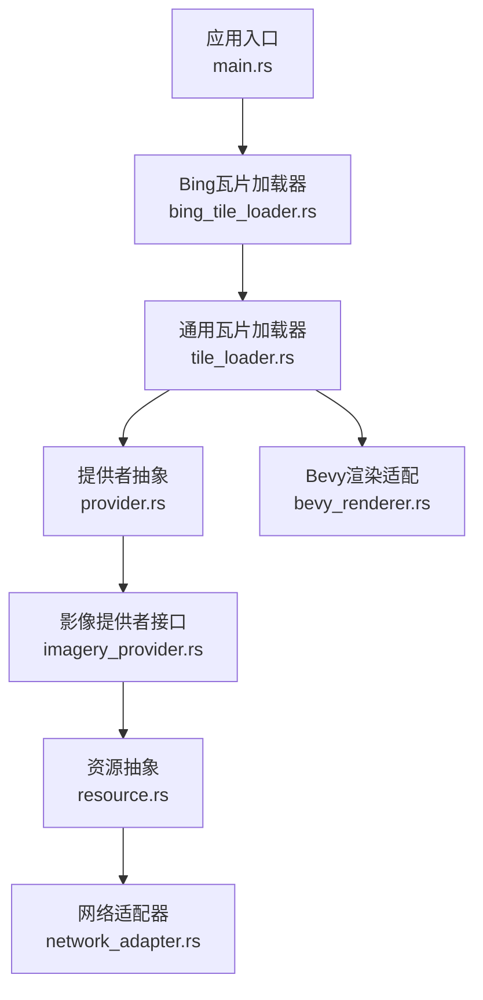
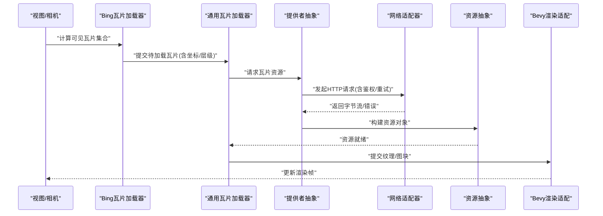
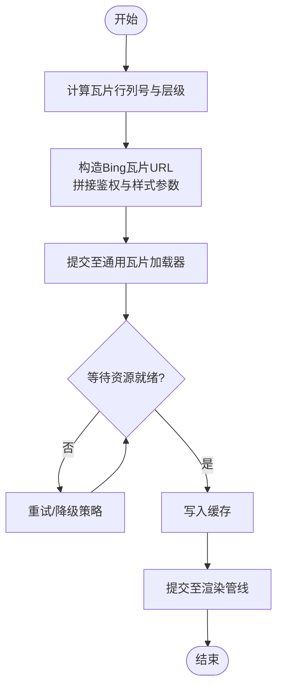
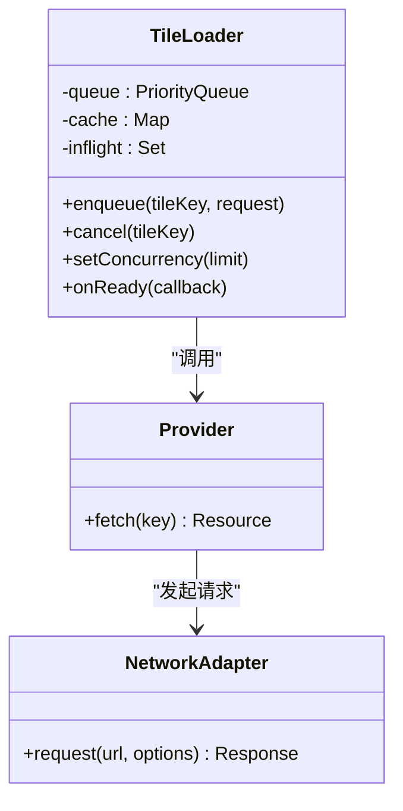
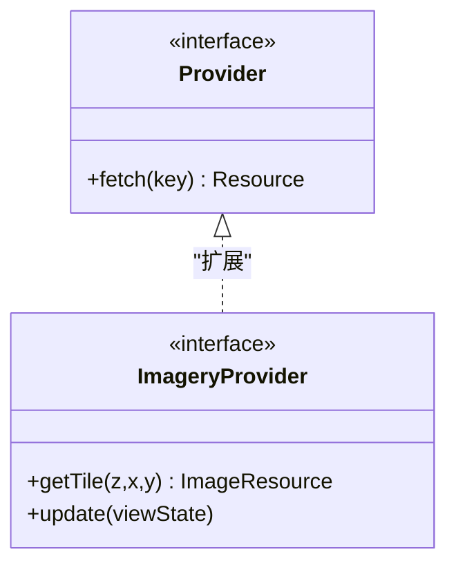
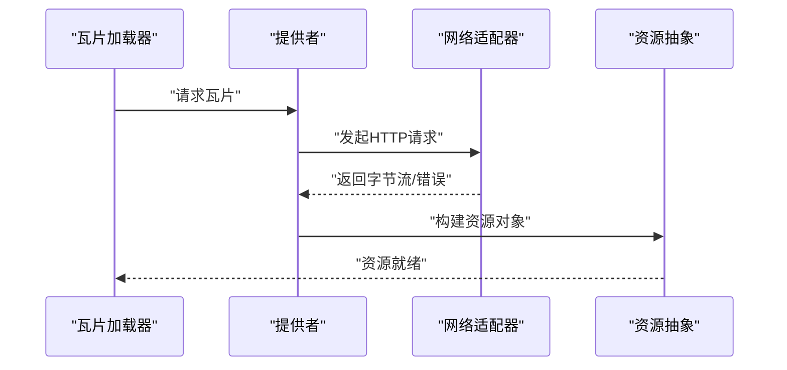
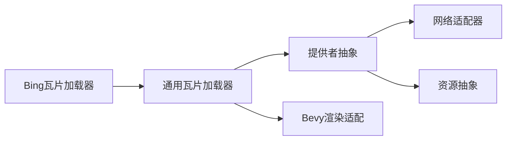

# Bing瓦片加载器

<cite>
**本文引用的文件**
- [bing_tile_loader.rs](file://cesiumrust/application/cesium-app/src/bing_tile_loader.rs)
- [tile_loader.rs](file://cesiumrust/application/cesium-app/src/tile_loader.rs)
- [main.rs](file://cesiumrust/application/cesium-app/src/main.rs)
- [imagery_provider.rs](file://cesiumrust/domain/imagery/src/imagery_provider.rs)
- [provider.rs](file://cesiumrust/domain/provider/src/provider.rs)
- [resource.rs](file://cesiumrust/domain/resource/src/resource.rs)
- [network_adapter.rs](file://cesiumrust/adapters/network/src/network_adapter.rs)
- [bevy_renderer.rs](file://cesiumrust/adapters/bevy-render/src/renderer.rs)
</cite>

## 目录
1. [简介](#简介)
2. [项目结构](#项目结构)
3. [核心组件](#核心组件)
4. [架构总览](#架构总览)
5. [详细组件分析](#详细组件分析)
6. [依赖关系分析](#依赖关系分析)
7. [性能考量](#性能考量)
8. [故障排查指南](#故障排查指南)
9. [结论](#结论)
10. [附录](#附录)

## 简介
本文件聚焦于“Bing瓦片加载器”的实现与集成，说明其在Cesium Rust应用中的职责、数据流、错误处理与性能特征。该加载器负责：
- 根据视口与缩放级别计算需要请求的Bing地图瓦片坐标
- 构造并发起网络请求（可带鉴权）
- 将返回的图像数据转换为渲染可用的纹理或图块资源
- 与场景/渲染管线对接，完成按需加载与缓存

## 项目结构
围绕Bing瓦片加载的关键代码位于Rust应用层与领域层：
- 应用层：cesium-app/src/bing_tile_loader.rs、tile_loader.rs、main.rs
- 领域层：domain/imagery、domain/provider、domain/resource
- 适配器层：adapters/network、adapters/bevy-render

图表来源
- [main.rs](file://cesiumrust/application/cesium-app/src/main.rs)
- [bing_tile_loader.rs](file://cesiumrust/application/cesium-app/src/bing_tile_loader.rs)
- [tile_loader.rs](file://cesiumrust/application/cesium-app/src/tile_loader.rs)
- [provider.rs](file://cesiumrust/domain/provider/src/provider.rs)
- [imagery_provider.rs](file://cesiumrust/domain/imagery/src/imagery_provider.rs)
- [resource.rs](file://cesiumrust/domain/resource/src/resource.rs)
- [network_adapter.rs](file://cesiumrust/adapters/network/src/network_adapter.rs)
- [bevy_renderer.rs](file://cesiumrust/adapters/bevy-render/src/renderer.rs)

章节来源
- [main.rs](file://cesiumrust/application/cesium-app/src/main.rs)
- [bing_tile_loader.rs](file://cesiumrust/application/cesium-app/src/bing_tile_loader.rs)
- [tile_loader.rs](file://cesiumrust/application/cesium-app/src/tile_loader.rs)

## 核心组件
- Bing瓦片加载器：封装Bing地图特有的瓦片规则、URL生成、鉴权参数注入与重试策略。
- 通用瓦片加载器：提供通用的瓦片生命周期管理（请求、缓存、去重、取消）。
- 提供者抽象：定义统一的资源获取接口，屏蔽具体实现差异。
- 影像提供者接口：面向影像数据的抽象，便于扩展其他影像源。
- 资源抽象：对网络响应进行统一建模（如图片、二进制等），供渲染使用。
- 网络适配器：封装HTTP/HTTPS请求、超时、并发控制与错误映射。
- Bevy渲染适配：将加载完成的瓦片纹理提交到渲染管线。

章节来源
- [bing_tile_loader.rs](file://cesiumrust/application/cesium-app/src/bing_tile_loader.rs)
- [tile_loader.rs](file://cesiumrust/application/cesium-app/src/tile_loader.rs)
- [provider.rs](file://cesiumrust/domain/provider/src/provider.rs)
- [imagery_provider.rs](file://cesiumrust/domain/imagery/src/imagery_provider.rs)
- [resource.rs](file://cesiumrust/domain/resource/src/resource.rs)
- [network_adapter.rs](file://cesiumrust/adapters/network/src/network_adapter.rs)
- [bevy_renderer.rs](file://cesiumrust/adapters/bevy-render/src/renderer.rs)

## 架构总览
下图展示了从视口变化到瓦片渲染的端到端流程，突出Bing瓦片加载器的关键角色。

图表来源
- [bing_tile_loader.rs](file://cesiumrust/application/cesium-app/src/bing_tile_loader.rs)
- [tile_loader.rs](file://cesiumrust/application/cesium-app/src/tile_loader.rs)
- [provider.rs](file://cesiumrust/domain/provider/src/provider.rs)
- [network_adapter.rs](file://cesiumrust/adapters/network/src/network_adapter.rs)
- [resource.rs](file://cesiumrust/domain/resource/src/resource.rs)
- [bevy_renderer.rs](file://cesiumrust/adapters/bevy-render/src/renderer.rs)

## 详细组件分析

### Bing瓦片加载器
- 职责
  - 根据当前相机状态与缩放级别，计算Bing瓦片的行列号与层级
  - 生成Bing地图瓦片URL，附加鉴权令牌与语言/样式参数
  - 协调通用瓦片加载器进行并发请求、去重与缓存
  - 处理网络错误与重试，保证加载稳定性
- 关键流程
  - 输入：视口范围、缩放级别、样式偏好
  - 输出：一组瓦片键与对应的资源句柄
  - 异常：无效坐标、网络失败、鉴权失败

图表来源
- [bing_tile_loader.rs](file://cesiumrust/application/cesium-app/src/bing_tile_loader.rs)
- [tile_loader.rs](file://cesiumrust/application/cesium-app/src/tile_loader.rs)

章节来源
- [bing_tile_loader.rs](file://cesiumrust/application/cesium-app/src/bing_tile_loader.rs)

### 通用瓦片加载器
- 职责
  - 维护瓦片队列、去重与取消机制
  - 管理并发度与背压，避免过载
  - 统一缓存键策略与失效策略
- 关键流程
  - 入队：接收来自上层（如Bing加载器）的瓦片请求
  - 调度：按优先级与可见性调度执行
  - 完成：回调通知渲染层更新

图表来源
- [tile_loader.rs](file://cesiumrust/application/cesium-app/src/tile_loader.rs)
- [provider.rs](file://cesiumrust/domain/provider/src/provider.rs)
- [network_adapter.rs](file://cesiumrust/adapters/network/src/network_adapter.rs)

章节来源
- [tile_loader.rs](file://cesiumrust/application/cesium-app/src/tile_loader.rs)
- [provider.rs](file://cesiumrust/domain/provider/src/provider.rs)

### 提供者抽象与影像提供者接口
- 提供者抽象：定义统一的资源获取契约，屏蔽不同数据源的差异
- 影像提供者接口：面向影像数据的抽象，便于接入多种影像服务（包括Bing）

图表来源
- [provider.rs](file://cesiumrust/domain/provider/src/provider.rs)
- [imagery_provider.rs](file://cesiumrust/domain/imagery/src/imagery_provider.rs)

章节来源
- [provider.rs](file://cesiumrust/domain/provider/src/provider.rs)
- [imagery_provider.rs](file://cesiumrust/domain/imagery/src/imagery_provider.rs)

### 资源抽象与网络适配器
- 资源抽象：将网络响应包装为统一资源类型（如图片、二进制），便于后续解码与上传
- 网络适配器：封装HTTP请求、超时、重试、错误映射与并发控制

图表来源
- [network_adapter.rs](file://cesiumrust/adapters/network/src/network_adapter.rs)
- [resource.rs](file://cesiumrust/domain/resource/src/resource.rs)
- [provider.rs](file://cesiumrust/domain/provider/src/provider.rs)

章节来源
- [network_adapter.rs](file://cesiumrust/adapters/network/src/network_adapter.rs)
- [resource.rs](file://cesiumrust/domain/resource/src/resource.rs)

### Bevy渲染适配
- 职责：将加载完成的瓦片纹理提交到Bevy渲染管线，参与场景绘制
- 关键点：纹理格式转换、内存拷贝优化、异步提交

章节来源
- [bevy_renderer.rs](file://cesiumrust/adapters/bevy-render/src/renderer.rs)

## 依赖关系分析
- 松耦合设计：通过Provider与ImageryProvider抽象，使Bing瓦片加载器与具体网络实现解耦
- 内聚性：TileLoader集中管理瓦片生命周期；NetworkAdapter专注网络细节；Resource抽象统一数据形态
- 外部依赖：HTTP客户端、图像处理库、渲染后端（Bevy）

图表来源
- [bing_tile_loader.rs](file://cesiumrust/application/cesium-app/src/bing_tile_loader.rs)
- [tile_loader.rs](file://cesiumrust/application/cesium-app/src/tile_loader.rs)
- [provider.rs](file://cesiumrust/domain/provider/src/provider.rs)
- [network_adapter.rs](file://cesiumrust/adapters/network/src/network_adapter.rs)
- [resource.rs](file://cesiumrust/domain/resource/src/resource.rs)
- [bevy_renderer.rs](file://cesiumrust/adapters/bevy-render/src/renderer.rs)

章节来源
- [bing_tile_loader.rs](file://cesiumrust/application/cesium-app/src/bing_tile_loader.rs)
- [tile_loader.rs](file://cesiumrust/application/cesium-app/src/tile_loader.rs)
- [provider.rs](file://cesiumrust/domain/provider/src/provider.rs)

## 性能考量
- 并发控制：限制同时进行的瓦片请求数量，避免带宽与CPU抖动
- 去重与缓存：基于瓦片键去重，命中缓存直接复用，减少重复下载
- 背压与取消：在相机快速移动时取消不再需要的请求，降低无用开销
- 批量化提交：将多个瓦片纹理批量提交到渲染管线，减少同步点
- 压缩与解码：优先使用高效编码格式，并在必要时进行解码优化

[本节为通用指导，不直接分析具体文件]

## 故障排查指南
- 常见错误
  - 鉴权失败：检查令牌有效期与权限范围
  - 网络超时/中断：调整超时与重试策略，检查代理与防火墙
  - 瓦片坐标越界：校验缩放级别与边界条件
  - 渲染卡顿：检查纹理上传路径与并发设置
- 定位方法
  - 启用详细日志，记录请求URL、状态码与耗时
  - 监控缓存命中率与未命中原因
  - 使用性能剖析工具定位热点（网络I/O、解码、GPU上传）

章节来源
- [network_adapter.rs](file://cesiumrust/adapters/network/src/network_adapter.rs)
- [tile_loader.rs](file://cesiumrust/application/cesium-app/src/tile_loader.rs)

## 结论
Bing瓦片加载器通过清晰的抽象与分层，实现了高内聚、低耦合的瓦片加载流程。结合通用瓦片加载器、提供者抽象与网络/渲染适配器，能够在复杂场景下稳定高效地加载Bing地图瓦片。建议在生产环境中关注并发、缓存与错误恢复策略，以获得更优的用户体验。

[本节为总结，不直接分析具体文件]

## 附录
- 配置项建议
  - 并发数：根据设备能力与网络状况动态调整
  - 缓存大小：平衡内存占用与命中率
  - 重试次数与退避策略：避免雪崩效应
- 扩展点
  - 新增影像源：实现ImageryProvider接口
  - 替换网络栈：实现NetworkAdapter接口
  - 自定义缓存策略：在TileLoader中扩展

[本节为补充信息，不直接分析具体文件]