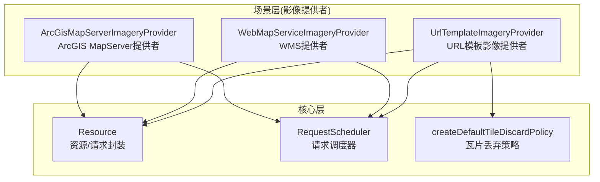
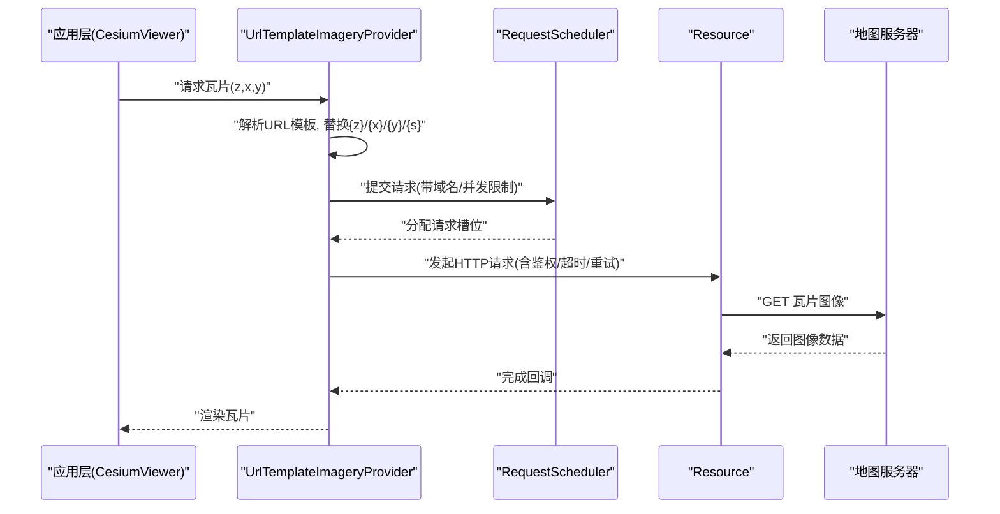
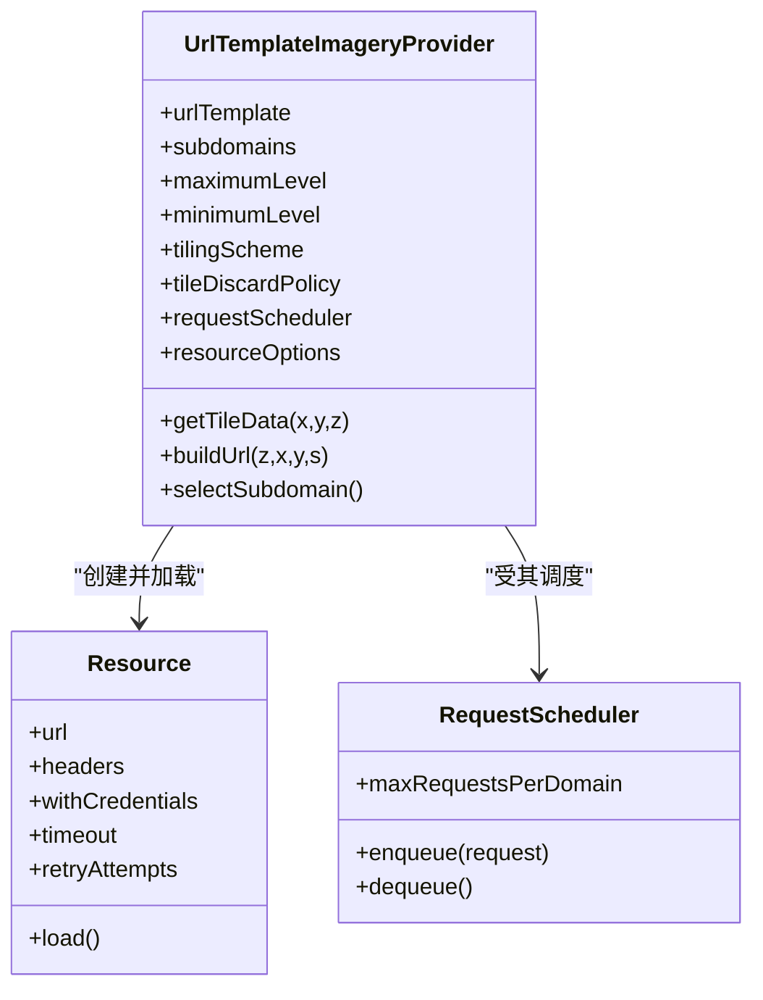
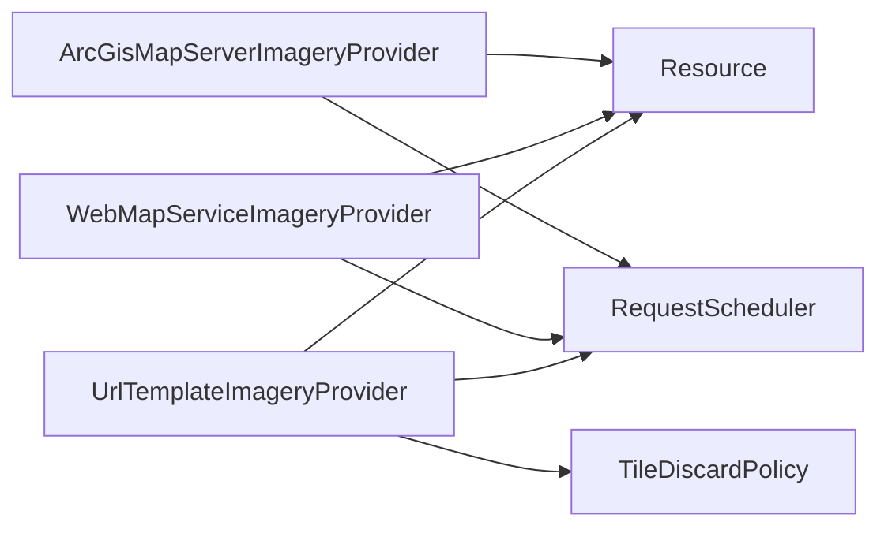

# URL模板提供者

<cite>
**本文引用的文件**   
- [OpenStreetMap.js](file://Source/Scene/GoogleEarthEnterprise/GoogleEarthEnterpriseMapsProvider.js)
- [UrlTemplateImageryProvider.js](file://Source/Scene/UrlTemplateImageryProvider.js)
- [ArcGisMapServerImageryProvider.js](file://Source/Scene/ArcGisMapServerImageryProvider.js)
- [WebMapServiceImageryProvider.js](file://Source/Scene/WebMapServiceImageryProvider.js)
- [createDefaultTileDiscardPolicy.js](file://Source/Scene/createDefaultTileDiscardPolicy.js)
- [RequestScheduler.js](file://Source/Core/RequestScheduler.js)
- [Resource.js](file://Source/Core/Resource.js)
- [CesiumViewer.js](file://Apps/CesiumViewer/CesiumViewer.js)
</cite>

## 目录
1. [简介](#简介)
2. [项目结构](#项目结构)
3. [核心组件](#核心组件)
4. [架构总览](#架构总览)
5. [详细组件分析](#详细组件分析)
6. [依赖关系分析](#依赖关系分析)
7. [性能考虑](#性能考虑)
8. [故障排查指南](#故障排查指南)
9. [结论](#结论)
10. [附录](#附录)

## 简介
本技术文档聚焦于“URL模板影像提供者”的实现与使用，围绕瓦片坐标变量替换、多源地图服务集成（如OpenStreetMap、Google Maps、Bing Maps等）、子域负载均衡、多源叠加与切换、API密钥管理、访问限制处理以及错误重试机制展开。文档旨在帮助开发者在Cesium中高效、稳定地接入各类标准地图服务，并实现高可用、可扩展的影像加载方案。

## 项目结构
与URL模板影像提供者相关的核心代码主要位于Scene模块与Core模块：
- Scene层提供面向不同数据源的影像提供者实现，包括通用URL模板提供者、WMS、ArcGIS MapServer等。
- Core层提供请求调度、资源构建、瓦片丢弃策略等基础能力。

图表来源
- [UrlTemplateImageryProvider.js:1-200](file://Source/Scene/UrlTemplateImageryProvider.js#L1-L200)
- [WebMapServiceImageryProvider.js:1-200](file://Source/Scene/WebMapServiceImageryProvider.js#L1-L200)
- [ArcGisMapServerImageryProvider.js:1-200](file://Source/Scene/ArcGisMapServerImageryProvider.js#L1-L200)
- [Resource.js:1-200](file://Source/Core/Resource.js#L1-L200)
- [RequestScheduler.js:1-200](file://Source/Core/RequestScheduler.js#L1-L200)
- [createDefaultTileDiscardPolicy.js:1-200](file://Source/Scene/createDefaultTileDiscardPolicy.js#L1-L200)

章节来源
- [UrlTemplateImageryProvider.js:1-200](file://Source/Scene/UrlTemplateImageryProvider.js#L1-L200)
- [WebMapServiceImageryProvider.js:1-200](file://Source/Scene/WebMapServiceImageryProvider.js#L1-L200)
- [ArcGisMapServerImageryProvider.js:1-200](file://Source/Scene/ArcGisMapServerImageryProvider.js#L1-L200)
- [Resource.js:1-200](file://Source/Core/Resource.js#L1-L200)
- [RequestScheduler.js:1-200](file://Source/Core/RequestScheduler.js#L1-L200)
- [createDefaultTileDiscardPolicy.js:1-200](file://Source/Scene/createDefaultTileDiscardPolicy.js#L1-L200)

## 核心组件
- UrlTemplateImageryProvider：基于URL模板生成瓦片地址，支持{z}、{x}、{y}、{s}等变量替换，可配置子域列表以实现负载均衡。
- WebMapServiceImageryProvider：遵循OGC WMS协议，通过GetMap请求获取影像，支持版本、图层、样式、投影、宽高、格式等参数。
- ArcGisMapServerImageryProvider：对接ArcGIS MapServer，支持动态图层、缓存切片、授权令牌等。
- Resource：统一封装HTTP请求、跨域、鉴权、缓存、重试等。
- RequestScheduler：全局并发控制、域名级限流、队列调度。
- createDefaultTileDiscardPolicy：根据可见性、优先级、内存占用等策略丢弃瓦片。

章节来源
- [UrlTemplateImageryProvider.js:1-200](file://Source/Scene/UrlTemplateImageryProvider.js#L1-L200)
- [WebMapServiceImageryProvider.js:1-200](file://Source/Scene/WebMapServiceImageryProvider.js#L1-L200)
- [ArcGisMapServerImageryProvider.js:1-200](file://Source/Scene/ArcGisMapServerImageryProvider.js#L1-L200)
- [Resource.js:1-200](file://Source/Core/Resource.js#L1-L200)
- [RequestScheduler.js:1-200](file://Source/Core/RequestScheduler.js#L1-L200)
- [createDefaultTileDiscardPolicy.js:1-200](file://Source/Scene/createDefaultTileDiscardPolicy.js#L1-L200)

## 架构总览
下图展示了从应用层到网络层的调用链路与关键职责划分。

图表来源
- [UrlTemplateImageryProvider.js:1-200](file://Source/Scene/UrlTemplateImageryProvider.js#L1-L200)
- [RequestScheduler.js:1-200](file://Source/Core/RequestScheduler.js#L1-L200)
- [Resource.js:1-200](file://Source/Core/Resource.js#L1-L200)
- [CesiumViewer.js:1-200](file://Apps/CesiumViewer/CesiumViewer.js#L1-L200)

## 详细组件分析

### URL模板语法与变量替换机制
- 支持的常用变量
  - {z}：缩放级别
  - {x}：列号
  - {y}：行号
  - {s}：子域索引（用于负载均衡）
  - 其他：部分服务可能支持自定义变量或固定查询参数
- 替换流程
  - 输入瓦片键(z,x,y)
  - 选择子域（轮询或哈希）
  - 将变量注入模板字符串
  - 生成最终URL并发起请求
- 注意事项
  - 某些服务对x/y范围有边界限制，需做裁剪或回退
  - 子域数量应与服务器配置一致，避免404
  - 模板中可包含路径、查询串、协议、主机名等任意片段

章节来源
- [UrlTemplateImageryProvider.js:1-200](file://Source/Scene/UrlTemplateImageryProvider.js#L1-L200)

#### 类图（URL模板提供者）

图表来源
- [UrlTemplateImageryProvider.js:1-200](file://Source/Scene/UrlTemplateImageryProvider.js#L1-L200)
- [Resource.js:1-200](file://Source/Core/Resource.js#L1-L200)
- [RequestScheduler.js:1-200](file://Source/Core/RequestScheduler.js#L1-L200)

### 标准地图服务集成要点
- OpenStreetMap
  - 典型模板包含{z}/{x}/{y}
  - 建议启用子域以分散请求
  - 注意版权信息与使用条款
- Google Maps
  - 需要API密钥与配额管理
  - 通常要求HTTPS与Referer限制
  - 建议使用专用子域与独立Key
- Bing Maps
  - 需要访问令牌
  - 支持多种样式（道路、航拍等）
  - 注意区域与合规要求
- 通用实践
  - 为每个服务维护独立的提供者实例
  - 合理设置最大并发与超时
  - 针对失败率高的服务增加重试与降级

章节来源
- [UrlTemplateImageryProvider.js:1-200](file://Source/Scene/UrlTemplateImageryProvider.js#L1-L200)
- [Resource.js:1-200](file://Source/Core/Resource.js#L1-L200)
- [RequestScheduler.js:1-200](file://Source/Core/RequestScheduler.js#L1-L200)

### 子域负载均衡与请求分发
- 子域选择策略
  - 轮询：按顺序循环选择子域
  - 哈希：基于瓦片坐标或服务ID计算子域，保证稳定性
- 与请求调度的配合
  - RequestScheduler按域名限制并发，子域可视为不同域名
  - 结合浏览器同源策略，提升整体吞吐
- 最佳实践
  - 子域数量与服务端一致
  - 监控各子域成功率与延迟
  - 动态剔除异常子域

章节来源
- [UrlTemplateImageryProvider.js:1-200](file://Source/Scene/UrlTemplateImageryProvider.js#L1-L200)
- [RequestScheduler.js:1-200](file://Source/Core/RequestScheduler.js#L1-L200)

### 多源影像叠加与切换
- 叠加
  - 在同一场景中创建多个影像提供者，分别配置透明度、混合模式
  - 利用层级顺序控制显示优先级
- 切换
  - 运行时动态启用/禁用某一层
  - 根据用户偏好或业务规则自动切换底图
- 示例参考
  - CesiumViewer示例展示了如何添加多个影像层并进行交互控制

章节来源
- [CesiumViewer.js:1-200](file://Apps/CesiumViewer/CesiumViewer.js#L1-L200)

### API密钥管理与访问限制
- 密钥注入
  - 通过请求头或URL参数注入Key/Token
  - 使用Resource的headers或queryParameters进行集中管理
- 访问限制
  - 设置Referer、Origin白名单
  - 按域名限制并发，避免触发限流
- 安全建议
  - 前端仅暴露最小权限Key
  - 服务端代理聚合敏感参数
  - 定期轮换密钥并审计日志

章节来源
- [Resource.js:1-200](file://Source/Core/Resource.js#L1-L200)
- [RequestScheduler.js:1-200](file://Source/Core/RequestScheduler.js#L1-L200)

### 错误重试与容错机制
- 重试策略
  - 针对瞬时错误（网络抖动、5xx）进行指数退避重试
  - 区分可重试与不可重试错误
- 超时与取消
  - 设置合理的超时时间
  - 在视图快速移动时取消过期请求
- 瓦片丢弃
  - 基于可见性与优先级丢弃低价值瓦片，降低内存压力

章节来源
- [Resource.js:1-200](file://Source/Core/Resource.js#L1-L200)
- [createDefaultTileDiscardPolicy.js:1-200](file://Source/Scene/createDefaultTileDiscardPolicy.js#L1-L200)

## 依赖关系分析
- 组件耦合
  - UrlTemplateImageryProvider依赖Resource进行网络请求，依赖RequestScheduler进行并发控制，依赖瓦片丢弃策略进行内存优化
  - WMS与ArcGIS提供者同样复用Resource与调度器，形成一致的请求模型
- 外部依赖
  - 浏览器网络栈、同源策略、Cookie/证书
  - 第三方地图服务的配额、鉴权、地理编码规范

图表来源
- [UrlTemplateImageryProvider.js:1-200](file://Source/Scene/UrlTemplateImageryProvider.js#L1-L200)
- [WebMapServiceImageryProvider.js:1-200](file://Source/Scene/WebMapServiceImageryProvider.js#L1-L200)
- [ArcGisMapServerImageryProvider.js:1-200](file://Source/Scene/ArcGisMapServerImageryProvider.js#L1-L200)
- [Resource.js:1-200](file://Source/Core/Resource.js#L1-L200)
- [RequestScheduler.js:1-200](file://Source/Core/RequestScheduler.js#L1-L200)
- [createDefaultTileDiscardPolicy.js:1-200](file://Source/Scene/createDefaultTileDiscardPolicy.js#L1-L200)

章节来源
- [UrlTemplateImageryProvider.js:1-200](file://Source/Scene/UrlTemplateImageryProvider.js#L1-L200)
- [WebMapServiceImageryProvider.js:1-200](file://Source/Scene/WebMapServiceImageryProvider.js#L1-L200)
- [ArcGisMapServerImageryProvider.js:1-200](file://Source/Scene/ArcGisMapServerImageryProvider.js#L1-L200)
- [Resource.js:1-200](file://Source/Core/Resource.js#L1-L200)
- [RequestScheduler.js:1-200](file://Source/Core/RequestScheduler.js#L1-L200)
- [createDefaultTileDiscardPolicy.js:1-200](file://Source/Scene/createDefaultTileDiscardPolicy.js#L1-L200)

## 性能考虑
- 并发与限流
  - 合理设置每域名最大并发数，避免阻塞与限流
  - 利用子域扩展并发上限
- 缓存与去重
  - 利用浏览器缓存与HTTP缓存头
  - 避免重复请求相同瓦片
- 瓦片粒度与传输
  - 选择合适的压缩格式与尺寸
  - 按需加载，减少不必要的高倍瓦片
- 监控与指标
  - 统计成功率、延迟、带宽占用
  - 定位热点域名与异常节点

[本节为通用指导，不直接分析具体文件]

## 故障排查指南
- 常见问题
  - 404/空瓦片：检查模板变量与边界、子域是否匹配
  - 鉴权失败：确认Key/Token有效且未被限流
  - 跨域错误：核对CORS与Referer策略
  - 卡顿/掉帧：调整并发、超时与丢弃策略
- 诊断步骤
  - 打开网络面板查看请求URL与响应码
  - 打印调度器状态与重试次数
  - 逐步关闭图层定位问题来源
  - 使用离线数据验证模板正确性

章节来源
- [Resource.js:1-200](file://Source/Core/Resource.js#L1-L200)
- [RequestScheduler.js:1-200](file://Source/Core/RequestScheduler.js#L1-L200)
- [createDefaultTileDiscardPolicy.js:1-200](file://Source/Scene/createDefaultTileDiscardPolicy.js#L1-L200)

## 结论
URL模板影像提供者是连接Cesium与多样化地图服务的关键桥梁。通过规范的模板语法、稳健的请求调度与资源管理、灵活的子域负载均衡、完善的鉴权与重试机制，可以在复杂网络环境下获得稳定高效的影像加载体验。建议在工程实践中建立统一的配置中心与监控体系，持续优化服务质量与用户体验。

[本节为总结性内容，不直接分析具体文件]

## 附录
- 术语
  - 瓦片：按网格切分的地图图片
  - 子域：同一主域下的不同前缀，用于并行请求
  - 鉴权：通过Key/Token等方式验证访问权限
- 参考示例
  - CesiumViewer演示了多源影像叠加与切换的基本用法

章节来源
- [CesiumViewer.js:1-200](file://Apps/CesiumViewer/CesiumViewer.js#L1-L200)