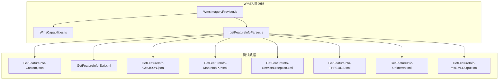
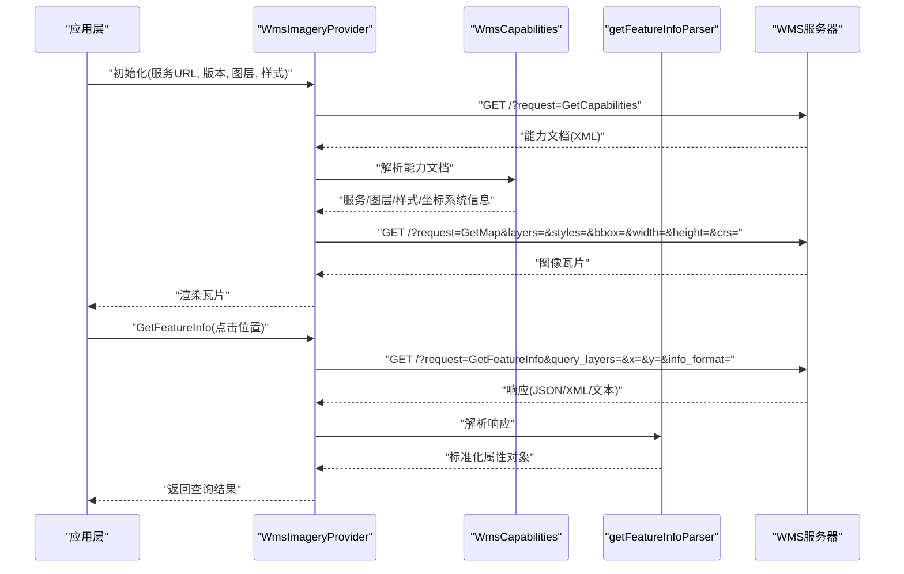
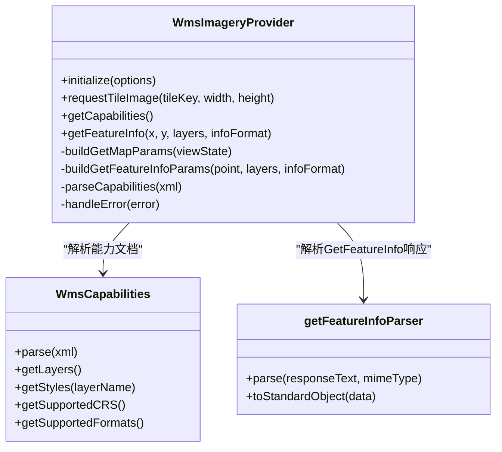
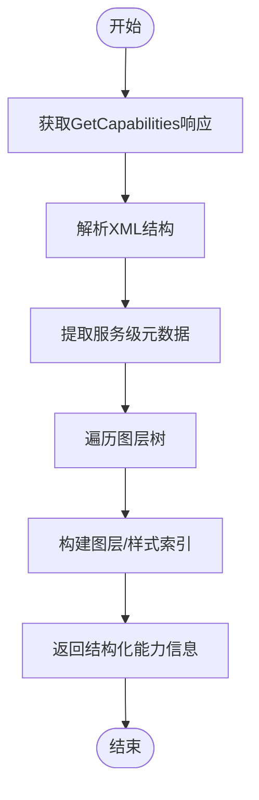
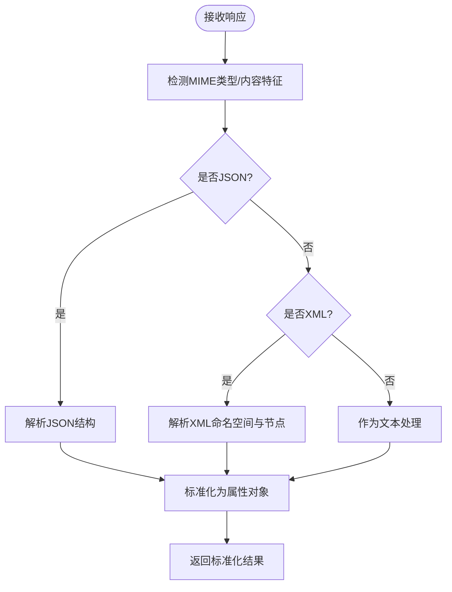
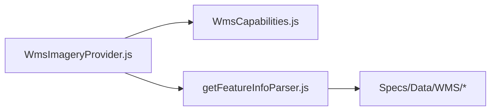

# WMS服务提供者

<cite>
**本文引用的文件**   
- [WmsImageryProvider.js](file://Source/Scene/ImageryProviders/WmsImageryProvider.js)
- [WmsCapabilities.js](file://Source/Scene/ImageryProviders/WmsCapabilities.js)
- [getFeatureInfoParser.js](file://Source/Scene/ImageryProviders/getFeatureInfoParser.js)
- [Specs/Data/WMS/GetFeatureInfo-Custom.json](file://Specs/Data/WMS/GetFeatureInfo-Custom.json)
- [Specs/Data/WMS/GetFeatureInfo-Esri.xml](file://Specs/Data/WMS/GetFeatureInfo-Esri.xml)
- [Specs/Data/WMS/GetFeatureInfo-GeoJSON.json](file://Specs/Data/WMS/GetFeatureInfo-GeoJSON.json)
- [Specs/Data/WMS/GetFeatureInfo-MapInfoMXP.xml](file://Specs/Data/WMS/GetFeatureInfo-MapInfoMXP.xml)
- [Specs/Data/WMS/GetFeatureInfo-ServiceException.xml](file://Specs/Data/WMS/GetFeatureInfo-ServiceException.xml)
- [Specs/Data/WMS/GetFeatureInfo-THREDDS.xml](file://Specs/Data/WMS/GetFeatureInfo-THREDDS.xml)
- [Specs/Data/WMS/GetFeatureInfo-Unknown.xml](file://Specs/Data/WMS/GetFeatureInfo-Unknown.xml)
- [Specs/Data/WMS/GetFeatureInfo-msGMLOutput.xml](file://Specs/Data/WMS/GetFeatureInfo-msGMLOutput.xml)
</cite>

## 目录
1. [简介](#简介)
2. [项目结构](#项目结构)
3. [核心组件](#核心组件)
4. [架构总览](#架构总览)
5. [详细组件分析](#详细组件分析)
6. [依赖分析](#依赖分析)
7. [性能考虑](#性能考虑)
8. [故障排查指南](#故障排查指南)
9. [结论](#结论)
10. [附录](#附录)

## 简介
本技术文档聚焦于Cesium代码库中的WMS（Web Map Service）影像提供者实现，系统性阐述OGC WMS标准在工程中的落地方式，包括：
- GetMap、GetCapabilities、GetFeatureInfo请求的构造与处理流程
- WMS能力文档解析与服务发现机制
- 支持的WMS版本（1.1.1、1.3.0）特性与差异
- 图层选择、样式配置与参数传递机制
- 认证配置、超时处理与错误恢复策略
- 性能优化建议与调试技巧

该实现以模块化方式组织，核心由WMS影像提供者、能力文档解析器以及GetFeatureInfo响应解析器构成。

## 项目结构
围绕WMS功能的相关源码与测试数据分布如下：
- Source/Scene/ImageryProviders/WmsImageryProvider.js：WMS影像提供者的主实现，负责请求构建、缓存、渲染集成等
- Source/Scene/ImageryProviders/WmsCapabilities.js：WMS能力文档解析器，用于解析GetCapabilities返回的服务元信息
- Source/Scene/ImageryProviders/getFeatureInfoParser.js：GetFeatureInfo响应解析器，支持多种输出格式
- Specs/Data/WMS/*：覆盖多厂商与格式的GetFeatureInfo样例数据，用于验证解析逻辑

图表来源
- [WmsImageryProvider.js](file://Source/Scene/ImageryProviders/WmsImageryProvider.js)
- [WmsCapabilities.js](file://Source/Scene/ImageryProviders/WmsCapabilities.js)
- [getFeatureInfoParser.js](file://Source/Scene/ImageryProviders/getFeatureInfoParser.js)
- [Specs/Data/WMS/GetFeatureInfo-Custom.json](file://Specs/Data/WMS/GetFeatureInfo-Custom.json)
- [Specs/Data/WMS/GetFeatureInfo-Esri.xml](file://Specs/Data/WMS/GetFeatureInfo-Esri.xml)
- [Specs/Data/WMS/GetFeatureInfo-GeoJSON.json](file://Specs/Data/WMS/GetFeatureInfo-GeoJSON.json)
- [Specs/Data/WMS/GetFeatureInfo-MapInfoMXP.xml](file://Specs/Data/WMS/GetFeatureInfo-MapInfoMXP.xml)
- [Specs/Data/WMS/GetFeatureInfo-ServiceException.xml](file://Specs/Data/WMS/GetFeatureInfo-ServiceException.xml)
- [Specs/Data/WMS/GetFeatureInfo-THREDDS.xml](file://Specs/Data/WMS/GetFeatureInfo-THREDDS.xml)
- [Specs/Data/WMS/GetFeatureInfo-Unknown.xml](file://Specs/Data/WMS/GetFeatureInfo-Unknown.xml)
- [Specs/Data/WMS/GetFeatureInfo-msGMLOutput.xml](file://Specs/Data/WMS/GetFeatureInfo-msGMLOutput.xml)

章节来源
- [WmsImageryProvider.js](file://Source/Scene/ImageryProviders/WmsImageryProvider.js)
- [WmsCapabilities.js](file://Source/Scene/ImageryProviders/WmsCapabilities.js)
- [getFeatureInfoParser.js](file://Source/Scene/ImageryProviders/getFeatureInfoParser.js)
- [Specs/Data/WMS/GetFeatureInfo-Custom.json](file://Specs/Data/WMS/GetFeatureInfo-Custom.json)
- [Specs/Data/WMS/GetFeatureInfo-Esri.xml](file://Specs/Data/WMS/GetFeatureInfo-Esri.xml)
- [Specs/Data/WMS/GetFeatureInfo-GeoJSON.json](file://Specs/Data/WMS/GetFeatureInfo-GeoJSON.json)
- [Specs/Data/WMS/GetFeatureInfo-MapInfoMXP.xml](file://Specs/Data/WMS/GetFeatureInfo-MapInfoMXP.xml)
- [Specs/Data/WMS/GetFeatureInfo-ServiceException.xml](file://Specs/Data/WMS/GetFeatureInfo-ServiceException.xml)
- [Specs/Data/WMS/GetFeatureInfo-THREDDS.xml](file://Specs/Data/WMS/GetFeatureInfo-THREDDS.xml)
- [Specs/Data/WMS/GetFeatureInfo-Unknown.xml](file://Specs/Data/WMS/GetFeatureInfo-Unknown.xml)
- [Specs/Data/WMS/GetFeatureInfo-msGMLOutput.xml](file://Specs/Data/WMS/GetFeatureInfo-msGMLOutput.xml)

## 核心组件
- WmsImageryProvider：封装WMS服务的调用细节，统一处理GetMap瓦片请求、GetCapabilities能力获取、GetFeatureInfo查询；管理请求参数、坐标系转换、缓存键生成、并发控制与重试策略。
- WmsCapabilities：解析WMS GetCapabilities响应，提取服务级别与图层级别的元数据（如SupportedCRS、Format、Layer列表、Style列表、BBOX限制、时间范围等），并用于自动发现可用图层与样式。
- getFeatureInfoParser：对GetFeatureInfo响应进行多格式解析，支持XML（含多种命名空间）、JSON（GeoJSON或自定义）、文本等，将结果标准化为内部数据结构供上层使用。

章节来源
- [WmsImageryProvider.js](file://Source/Scene/ImageryProviders/WmsImageryProvider.js)
- [WmsCapabilities.js](file://Source/Scene/ImageryProviders/WmsCapabilities.js)
- [getFeatureInfoParser.js](file://Source/Scene/ImageryProviders/getFeatureInfoParser.js)

## 架构总览
下图展示了WMS影像提供者在Cesium中的整体交互关系：应用层通过WmsImageryProvider发起请求，底层根据WMS版本与能力文档动态拼装参数，必要时先拉取能力文档进行服务发现，随后执行GetMap或GetFeatureInfo操作。

图表来源
- [WmsImageryProvider.js](file://Source/Scene/ImageryProviders/WmsImageryProvider.js)
- [WmsCapabilities.js](file://Source/Scene/ImageryProviders/WmsCapabilities.js)
- [getFeatureInfoParser.js](file://Source/Scene/ImageryProviders/getFeatureInfoParser.js)

## 详细组件分析

### WmsImageryProvider组件分析
职责与行为：
- 请求构建：根据WMS版本（1.1.1、1.3.0）与当前视图状态（投影、BBOX、宽高、像素比）组装GetMap参数；针对GetFeatureInfo，按版本差异设置INFO_FORMAT、QUERY_LAYERS、FEATURE_COUNT等。
- 能力文档解析：首次加载时可选拉取GetCapabilities，解析SupportedFormats、SupportedCRS/SRS、Layer树、Style列表、Time维度、BBOX限制等，辅助图层与样式选择。
- 参数传递与覆盖：允许用户传入自定义参数（如transparent、exceptions、time、version），并与默认参数合并，确保兼容性。
- 认证与超时：支持在请求头中注入认证信息（如Authorization、Cookie），并可配置超时与重试策略。
- 错误处理：对网络异常、HTTP错误码、WMS ServiceException等进行捕获与降级，保证渲染稳定性。

图表来源
- [WmsImageryProvider.js](file://Source/Scene/ImageryProviders/WmsImageryProvider.js)
- [WmsCapabilities.js](file://Source/Scene/ImageryProviders/WmsCapabilities.js)
- [getFeatureInfoParser.js](file://Source/Scene/ImageryProviders/getFeatureInfoParser.js)

章节来源
- [WmsImageryProvider.js](file://Source/Scene/ImageryProviders/WmsImageryProvider.js)

### WmsCapabilities组件分析
职责与行为：
- 解析GetCapabilities XML，提取服务级元数据（Title、Abstract、Contact、Keyword、BoundingBox、CRS、Format、Version等）。
- 解析图层级元数据（Layer名称、标题、描述、嵌套层级、SRS/CRS、BBOX、TimeRange、Style列表、Queryable标志等）。
- 提供便捷API用于服务发现：列出可用图层、样式、坐标系统与输出格式，帮助前端自动生成UI或校验配置。

图表来源
- [WmsCapabilities.js](file://Source/Scene/ImageryProviders/WmsCapabilities.js)

章节来源
- [WmsCapabilities.js](file://Source/Scene/ImageryProviders/WmsCapabilities.js)

### getFeatureInfoParser组件分析
职责与行为：
- 支持多种响应格式：GeoJSON JSON、自定义JSON、XML（含Esri、MapInfo MXP、msGMLOutput、THREDDS、未知命名空间等）、纯文本。
- 规范化输出：将不同格式的响应转换为统一的属性对象结构，便于上层展示与交互。
- 容错处理：对无效或残缺响应进行降级处理，返回空对象或提示性字段，避免中断业务流程。

图表来源
- [getFeatureInfoParser.js](file://Source/Scene/ImageryProviders/getFeatureInfoParser.js)
- [Specs/Data/WMS/GetFeatureInfo-Custom.json](file://Specs/Data/WMS/GetFeatureInfo-Custom.json)
- [Specs/Data/WMS/GetFeatureInfo-Esri.xml](file://Specs/Data/WMS/GetFeatureInfo-Esri.xml)
- [Specs/Data/WMS/GetFeatureInfo-GeoJSON.json](file://Specs/Data/WMS/GetFeatureInfo-GeoJSON.json)
- [Specs/Data/WMS/GetFeatureInfo-MapInfoMXP.xml](file://Specs/Data/WMS/GetFeatureInfo-MapInfoMXP.xml)
- [Specs/Data/WMS/GetFeatureInfo-ServiceException.xml](file://Specs/Data/WMS/GetFeatureInfo-ServiceException.xml)
- [Specs/Data/WMS/GetFeatureInfo-THREDDS.xml](file://Specs/Data/WMS/GetFeatureInfo-THREDDS.xml)
- [Specs/Data/WMS/GetFeatureInfo-Unknown.xml](file://Specs/Data/WMS/GetFeatureInfo-Unknown.xml)
- [Specs/Data/WMS/GetFeatureInfo-msGMLOutput.xml](file://Specs/Data/WMS/GetFeatureInfo-msGMLOutput.xml)

章节来源
- [getFeatureInfoParser.js](file://Source/Scene/ImageryProviders/getFeatureInfoParser.js)
- [Specs/Data/WMS/GetFeatureInfo-Custom.json](file://Specs/Data/WMS/GetFeatureInfo-Custom.json)
- [Specs/Data/WMS/GetFeatureInfo-Esri.xml](file://Specs/Data/WMS/GetFeatureInfo-Esri.xml)
- [Specs/Data/WMS/GetFeatureInfo-GeoJSON.json](file://Specs/Data/WMS/GetFeatureInfo-GeoJSON.json)
- [Specs/Data/WMS/GetFeatureInfo-MapInfoMXP.xml](file://Specs/Data/WMS/GetFeatureInfo-MapInfoMXP.xml)
- [Specs/Data/WMS/GetFeatureInfo-ServiceException.xml](file://Specs/Data/WMS/GetFeatureInfo-ServiceException.xml)
- [Specs/Data/WMS/GetFeatureInfo-THREDDS.xml](file://Specs/Data/WMS/GetFeatureInfo-THREDDS.xml)
- [Specs/Data/WMS/GetFeatureInfo-Unknown.xml](file://Specs/Data/WMS/GetFeatureInfo-Unknown.xml)
- [Specs/Data/WMS/GetFeatureInfo-msGMLOutput.xml](file://Specs/Data/WMS/GetFeatureInfo-msGMLOutput.xml)

### OGC WMS标准实现要点
- GetMap：
  - 版本差异：1.1.1使用SRS，1.3.0使用CRS；BBOX顺序在不同版本与投影下存在差异；宽高与像素比影响分辨率与缓存键。
  - 参数组合：layers、styles、format、transparent、exceptions、time、version、url模板替换等。
- GetCapabilities：
  - 解析服务级与图层级元数据，用于自动发现与校验。
- GetFeatureInfo：
  - INFO_FORMAT支持application/json、text/xml、application/vnd.ogc.gml、application/vnd.esri.wms_raw_xml等；不同厂商命名空间需兼容。

章节来源
- [WmsImageryProvider.js](file://Source/Scene/ImageryProviders/WmsImageryProvider.js)
- [WmsCapabilities.js](file://Source/Scene/ImageryProviders/WmsCapabilities.js)
- [getFeatureInfoParser.js](file://Source/Scene/ImageryProviders/getFeatureInfoParser.js)

### 支持的WMS版本（1.1.1、1.3.0）特性与差异
- 坐标系参数：
  - 1.1.1：使用SRS（如EPSG:4326、EPSG:3857）
  - 1.3.0：使用CRS（如urn:ogc:def:crs:EPSG::4326）
- BBOX顺序：
  - 1.1.1：minX,minY,maxX,maxY
  - 1.3.0：minLon,minLat,maxLon,maxLat（取决于CRS定义）
- 输出格式与样式：
  - 两者均支持，但具体可用值需从GetCapabilities中读取
- 时间维度：
  - 若服务暴露Time维度，可在GetMap与GetFeatureInfo中携带time参数

章节来源
- [WmsImageryProvider.js](file://Source/Scene/ImageryProviders/WmsImageryProvider.js)
- [WmsCapabilities.js](file://Source/Scene/ImageryProviders/WmsCapabilities.js)

### 图层选择、样式配置与参数传递机制
- 图层选择：
  - 优先从能力文档中提取Layer列表；若未启用能力文档解析，则依赖用户配置的layers参数
- 样式配置：
  - 从能力文档中获取每个图层的Style列表；若为空，默认使用“default”
- 参数传递：
  - 默认参数与用户自定义参数合并；冲突时以用户配置为准
  - 支持透明背景、异常处理、时间切片、自定义扩展参数

章节来源
- [WmsImageryProvider.js](file://Source/Scene/ImageryProviders/WmsImageryProvider.js)
- [WmsCapabilities.js](file://Source/Scene/ImageryProviders/WmsCapabilities.js)

### 认证配置、超时处理与错误恢复示例
- 认证配置：
  - 在请求头中注入Authorization或Cookie；对于跨域场景需确保服务端CORS正确配置
- 超时处理：
  - 为GetMap与GetFeatureInfo分别设置超时阈值；超时后触发重试或降级
- 错误恢复：
  - 捕获HTTP错误码与WMS ServiceException；对可重试错误进行指数退避重试；对不可恢复错误显示友好提示

章节来源
- [WmsImageryProvider.js](file://Source/Scene/ImageryProviders/WmsImageryProvider.js)

## 依赖分析
WMS模块之间的依赖关系如下：
- WmsImageryProvider依赖WmsCapabilities进行能力文档解析
- WmsImageryProvider依赖getFeatureInfoParser进行查询结果解析
- getFeatureInfoParser依赖测试数据中的多种格式样例进行验证与回归

图表来源
- [WmsImageryProvider.js](file://Source/Scene/ImageryProviders/WmsImageryProvider.js)
- [WmsCapabilities.js](file://Source/Scene/ImageryProviders/WmsCapabilities.js)
- [getFeatureInfoParser.js](file://Source/Scene/ImageryProviders/getFeatureInfoParser.js)
- [Specs/Data/WMS/GetFeatureInfo-Custom.json](file://Specs/Data/WMS/GetFeatureInfo-Custom.json)
- [Specs/Data/WMS/GetFeatureInfo-Esri.xml](file://Specs/Data/WMS/GetFeatureInfo-Esri.xml)
- [Specs/Data/WMS/GetFeatureInfo-GeoJSON.json](file://Specs/Data/WMS/GetFeatureInfo-GeoJSON.json)
- [Specs/Data/WMS/GetFeatureInfo-MapInfoMXP.xml](file://Specs/Data/WMS/GetFeatureInfo-MapInfoMXP.xml)
- [Specs/Data/WMS/GetFeatureInfo-ServiceException.xml](file://Specs/Data/WMS/GetFeatureInfo-ServiceException.xml)
- [Specs/Data/WMS/GetFeatureInfo-THREDDS.xml](file://Specs/Data/WMS/GetFeatureInfo-THREDDS.xml)
- [Specs/Data/WMS/GetFeatureInfo-Unknown.xml](file://Specs/Data/WMS/GetFeatureInfo-Unknown.xml)
- [Specs/Data/WMS/GetFeatureInfo-msGMLOutput.xml](file://Specs/Data/WMS/GetFeatureInfo-msGMLOutput.xml)

章节来源
- [WmsImageryProvider.js](file://Source/Scene/ImageryProviders/WmsImageryProvider.js)
- [WmsCapabilities.js](file://Source/Scene/ImageryProviders/WmsCapabilities.js)
- [getFeatureInfoParser.js](file://Source/Scene/ImageryProviders/getFeatureInfoParser.js)

## 性能考虑
- 瓦片缓存：
  - 基于请求参数（layers、styles、format、crs/srs、bbox、width、height、pixelRatio）生成稳定缓存键，避免重复请求
- 并发控制：
  - 限制同时进行的GetMap与GetFeatureInfo请求数量，防止雪崩
- 压缩与传输：
  - 优先使用PNG/JPEG等高效格式；开启Gzip/Br压缩（服务端配置）
- 能力文档缓存：
  - 对GetCapabilities结果进行短期缓存，减少频繁解析开销
- 增量更新：
  - 利用ETag/Last-Modified等条件请求，降低带宽占用

[本节为通用性能指导，不直接分析具体文件]

## 故障排查指南
- 常见问题定位：
  - 检查WMS版本与CRS/SRS匹配是否正确
  - 确认layers与styles在服务端是否存在且可访问
  - 核对BBOX边界与目标投影的一致性
- 日志与调试：
  - 打印完整的请求URL与响应头，便于比对OGC规范
  - 对GetFeatureInfo响应进行格式识别与解析失败时的回退处理
- 错误恢复策略：
  - 对网络超时与5xx错误进行重试；对4xx错误提示用户修正配置
  - 对ServiceException进行友好提示，并提供替代图层或样式

章节来源
- [WmsImageryProvider.js](file://Source/Scene/ImageryProviders/WmsImageryProvider.js)
- [getFeatureInfoParser.js](file://Source/Scene/ImageryProviders/getFeatureInfoParser.js)

## 结论
本实现以清晰的模块化设计支撑了OGC WMS标准的完整流程：从能力文档解析到瓦片渲染与要素查询，兼顾多版本兼容性与多厂商响应格式。通过合理的参数传递、认证与超时策略，以及完善的错误恢复与性能优化手段，能够在复杂生产环境中稳定运行。

[本节为总结性内容，不直接分析具体文件]

## 附录
- 术语说明：
  - CRS/SRS：坐标参考系统
  - BBOX：边界框
  - INFO_FORMAT：GetFeatureInfo的输出格式
- 参考样例：
  - 多格式GetFeatureInfo响应样例位于Specs/Data/WMS目录下，可用于本地验证与回归测试

[本节为补充信息，不直接分析具体文件]