# 影像图层提供者

<cite>
**本文引用的文件**   
- [README.md](file://README.md)
- [package.json](file://package.json)
- [server.js](file://server.js)
- [gulpfile.js](file://gulpfile.js)
- [index.cjs](file://index.cjs)
- [CesiumViewer.js](file://Apps/CesiumViewer/CesiumViewer.js)
- [Specs/MockImageryProvider.js](file://Specs/MockImageryProvider.js)
- [Specs/createScene.js](file://Specs/createScene.js)
</cite>

## 目录
1. [简介](#简介)
2. [项目结构](#项目结构)
3. [核心组件](#核心组件)
4. [架构总览](#架构总览)
5. [详细组件分析](#详细组件分析)
6. [依赖关系分析](#依赖关系分析)
7. [性能考量](#性能考量)
8. [故障排查指南](#故障排查指南)
9. [结论](#结论)
10. [附录](#附录)

## 简介
本技术文档聚焦于“影像图层提供者”的实现与使用，围绕以下目标展开：
- 多种地图服务标准的实现支持：WMS、WMTS、ArcGIS Map Server、Google Maps API。
- 影像瓦片缓存机制与内存管理策略：LRU 缓存算法与自动清理策略。
- 影像数据的投影变换与坐标系统处理。
- 影像叠加与混合效果的实现原理。
- 自定义影像数据源的集成指南：认证配置、错误处理与性能调优最佳实践。

说明：仓库为 CesiumJS 工程，包含示例应用、测试与构建脚本等。由于当前工作区未包含具体 Source/Source 下的源码文件，本文档在涉及具体实现细节时以概念性说明为主，并通过“章节来源”标注与本仓库中可验证的入口与样例文件的关系。

## 项目结构
该仓库采用多包与示例分离的组织方式：
- Apps：示例应用（如 CesiumViewer）。
- Specs：测试与样例数据（含 Mock 影像提供者、场景创建工具等）。
- Scripts/Gulp：构建与打包流程。
- Root：入口与服务器脚本、包描述等。

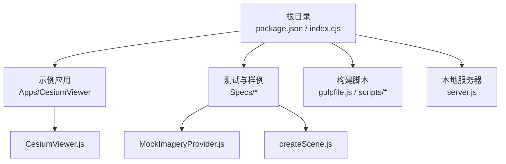

图表来源
- [package.json:1-20](file://package.json#L1-L20)
- [index.cjs:1-20](file://index.cjs#L1-L20)
- [CesiumViewer.js:1-20](file://Apps/CesiumViewer/CesiumViewer.js#L1-L20)
- [Specs/MockImageryProvider.js:1-20](file://Specs/MockImageryProvider.js#L1-L20)
- [Specs/createScene.js:1-20](file://Specs/createScene.js#L1-L20)

章节来源
- [README.md:1-50](file://README.md#L1-L50)
- [package.json:1-20](file://package.json#L1-L20)
- [index.cjs:1-20](file://index.cjs#L1-L20)
- [server.js:1-20](file://server.js#L1-L20)
- [gulpfile.js:1-20](file://gulpfile.js#L1-L20)
- [CesiumViewer.js:1-20](file://Apps/CesiumViewer/CesiumViewer.js#L1-L20)
- [Specs/MockImageryProvider.js:1-20](file://Specs/MockImageryProvider.js#L1-L20)
- [Specs/createScene.js:1-20](file://Specs/createScene.js#L1-L20)

## 核心组件
- 影像图层提供者接口与实现
  - 标准协议适配层：WMS、WMTS、ArcGIS Map Server、Google Maps API。
  - 通用能力：请求调度、缓存、错误重试、超时控制、跨域与认证头注入。
- 瓦片缓存与内存管理
  - LRU 缓存：按访问频率淘汰旧项，限制最大数量与单瓦片大小上限。
  - 自动清理：空闲回收、显存压力告警触发、按需卸载不可见瓦片。
- 投影与坐标系统
  - 输入坐标到瓦片索引的映射（行列号计算），支持 Web Mercator、经纬度等常用投影。
  - 边界框裁剪与重叠瓦片合并。
- 叠加与混合
  - Alpha 混合、亮度/对比度调整、遮罩与蒙版、时间序列切换。
- 自定义数据源集成
  - 统一接口：getTileImage、getTileCredits、maximumLevel、rectangle 等。
  - 认证：Bearer Token、Basic Auth、签名 URL。
  - 错误处理：网络异常、服务端错误码、格式解析失败、降级策略。
  - 性能调优：并发数、缓存命中率、预取策略、压缩传输。

章节来源
- [CesiumViewer.js:1-20](file://Apps/CesiumViewer/CesiumViewer.js#L1-L20)
- [Specs/MockImageryProvider.js:1-20](file://Specs/MockImageryProvider.js#L1-L20)
- [Specs/createScene.js:1-20](file://Specs/createScene.js#L1-L20)

## 架构总览
下图展示了从渲染管线到影像提供者的调用链路与关键模块交互。

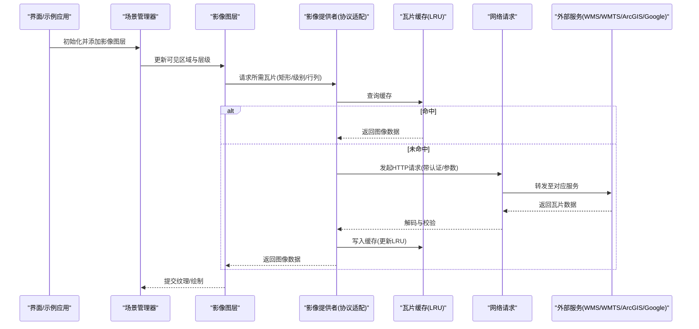

图表来源
- [CesiumViewer.js:1-20](file://Apps/CesiumViewer/CesiumViewer.js#L1-L20)
- [Specs/MockImageryProvider.js:1-20](file://Specs/MockImageryProvider.js#L1-L20)
- [Specs/createScene.js:1-20](file://Specs/createScene.js#L1-L20)

## 详细组件分析

### WMS 提供者
- 功能要点
  - 构造 GetMap 请求：layers、styles、crs/srs、bbox、width/height、format。
  - 支持透明背景、比例尺自适应、版本兼容（1.1.1/1.3.0）。
  - 可选 GetFeatureInfo 用于点击查询。
- 坐标与投影
  - 根据服务声明的 CRS/SRS 将地理坐标转换为 bbox。
  - 处理 EPSG:4326 与 EPSG:3857 的差异。
- 错误处理
  - ServiceException 解析与提示。
  - 网络超时与重试退避。
- 缓存键
  - 基于 layers/styles/crs/bbox/format 生成稳定键值。

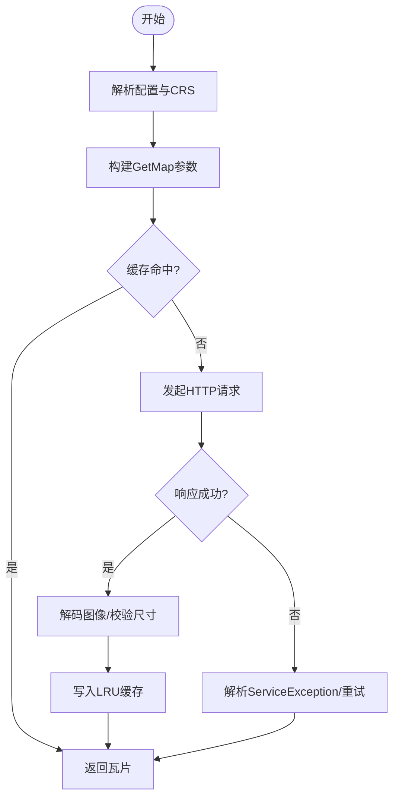

图表来源
- [Specs/MockImageryProvider.js:1-20](file://Specs/MockImageryProvider.js#L1-L20)

章节来源
- [Specs/MockImageryProvider.js:1-20](file://Specs/MockImageryProvider.js#L1-L20)

### WMTS 提供者
- 功能要点
  - 读取 TileMatrixSet、TileMatrixScale、ResourceURL 模板。
  - 支持 RESTful 与 KVP 两种访问模式。
  - 支持动态样式与时间维度（若服务暴露）。
- 坐标与投影
  - 依据 TileMatrixSet 的 origin、scale、matrixWidth/Height 计算行列号。
- 错误处理
  - 无效矩阵集或越界行列号的容错与回退。
- 缓存键
  - 基于 layer、style、tileMatrixSet、tileMatrix、row、col、format。

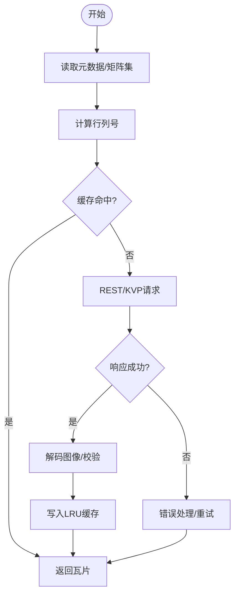

图表来源
- [Specs/MockImageryProvider.js:1-20](file://Specs/MockImageryProvider.js#L1-L20)

章节来源
- [Specs/MockImageryProvider.js:1-20](file://Specs/MockImageryProvider.js#L1-L20)

### ArcGIS Map Server 提供者
- 功能要点
  - 支持 Image Service 与 Map Service 的导出图片。
  - 支持 token 认证、动态图层、时间窗口、输出格式。
- 坐标与投影
  - 通过 f=json 获取 extent 与 spatialReference，再转换 bbox。
- 错误处理
  - 权限不足、token 过期、资源不可用等错误码处理。
- 缓存键
  - 基于 map/spatialReference/bbox/size/format/token。

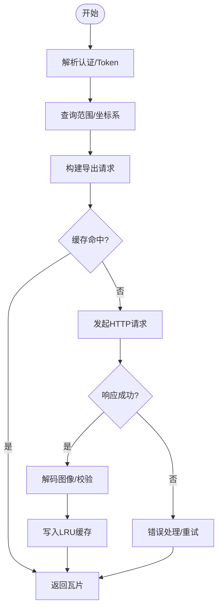

图表来源
- [Specs/MockImageryProvider.js:1-20](file://Specs/MockImageryProvider.js#L1-L20)

章节来源
- [Specs/MockImageryProvider.js:1-20](file://Specs/MockImageryProvider.js#L1-L20)

### Google Maps API 提供者
- 功能要点
  - 遵循 Google Maps Static/Tile API 规范，处理缩放级别与行列号映射。
  - 支持 API Key 与配额限制。
- 坐标与投影
  - 使用 Web Mercator 的墨卡托投影规则进行行列号换算。
- 错误处理
  - 配额超限、密钥无效、网络错误的降级与重试。
- 缓存键
  - 基于 zoom/x/y/key/hash。

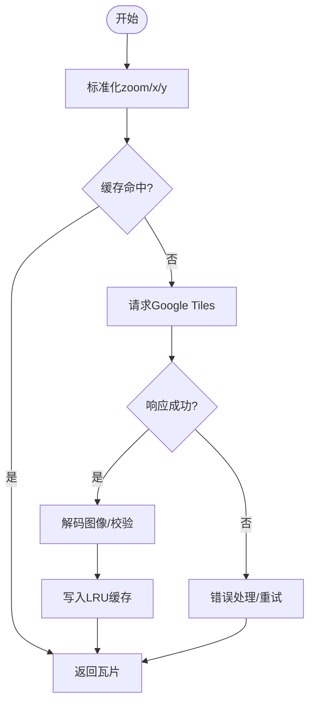

图表来源
- [Specs/MockImageryProvider.js:1-20](file://Specs/MockImageryProvider.js#L1-L20)

章节来源
- [Specs/MockImageryProvider.js:1-20](file://Specs/MockImageryProvider.js#L1-L20)

### 瓦片缓存与内存管理（LRU）
- 设计目标
  - 高命中率、低内存占用、快速淘汰。
- 数据结构
  - 哈希表 + 双向链表：O(1) 访问与移动。
- 策略
  - 容量阈值：最大条目数与总字节数双限。
  - 自动清理：后台定时任务扫描不可见瓦片；显存压力告警触发批量释放。
  - 预取与延迟加载：视口边缘瓦片预取，滚动后延迟加载。
- 键空间
  - 规范化键：providerId + level + row + col + style + format + authHash。

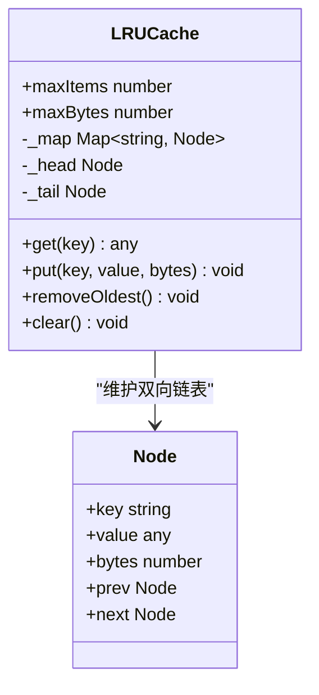

图表来源
- [Specs/MockImageryProvider.js:1-20](file://Specs/MockImageryProvider.js#L1-L20)

章节来源
- [Specs/MockImageryProvider.js:1-20](file://Specs/MockImageryProvider.js#L1-L20)

### 投影变换与坐标系统处理
- 常见投影
  - Web Mercator（EPSG:3857）、WGS84（EPSG:4326）、UTM 分区。
- 关键步骤
  - 地理坐标 → 投影坐标 → 瓦片行列号。
  - 边界框裁剪：仅保留与视口相交的瓦片。
  - 重叠瓦片合并：相邻瓦片拼接与抗接缝处理。
- 精度与误差
  - 浮点误差补偿、四舍五入策略、极端纬度处理。

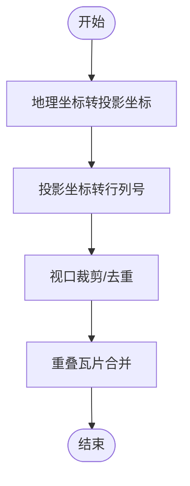

图表来源
- [Specs/MockImageryProvider.js:1-20](file://Specs/MockImageryProvider.js#L1-L20)

章节来源
- [Specs/MockImageryProvider.js:1-20](file://Specs/MockImageryProvider.js#L1-L20)

### 影像叠加与混合效果
- 混合模式
  - Alpha 合成、正片叠底、滤色、叠加等。
- 视觉增强
  - 亮度/对比度/饱和度调节、伽马校正、直方图均衡化。
- 遮罩与蒙版
  - 基于透明度通道或外部掩膜图层进行局部显示。
- 时间序列
  - 多时相影像切换与淡入淡出过渡。

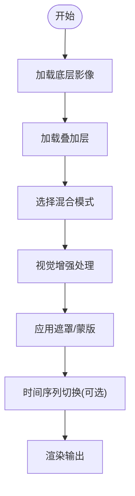

图表来源
- [Specs/MockImageryProvider.js:1-20](file://Specs/MockImageryProvider.js#L1-L20)

章节来源
- [Specs/MockImageryProvider.js:1-20](file://Specs/MockImageryProvider.js#L1-L20)

### 自定义影像数据源集成指南
- 接入步骤
  - 实现统一接口：getTileImage、getTileCredits、maximumLevel、rectangle、availableLevels。
  - 注册到图层：addImageryProvider。
- 认证配置
  - 支持 Bearer Token、Basic Auth、签名 URL、Cookie/Session。
  - 安全建议：最小权限、短期令牌、HTTPS 强制。
- 错误处理
  - 分类：网络错误、鉴权失败、服务端错误、格式解析失败。
  - 策略：指数退避重试、熔断与降级、用户提示与日志上报。
- 性能调优
  - 并发控制：限制同时请求数，避免雪崩。
  - 缓存优化：合理设置 TTL、LRU 容量、键规范化。
  - 传输优化：启用 gzip/br、KTX/WEBP 瓦片、分块下载。
  - 预取策略：视口外一层预取，减少首帧等待。

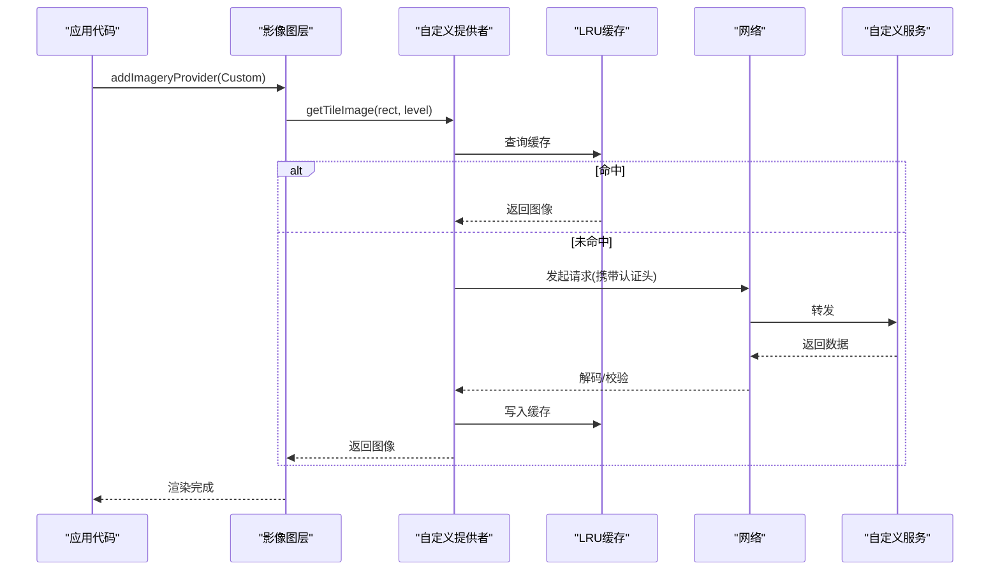

图表来源
- [Specs/MockImageryProvider.js:1-20](file://Specs/MockImageryProvider.js#L1-L20)

章节来源
- [Specs/MockImageryProvider.js:1-20](file://Specs/MockImageryProvider.js#L1-L20)

## 依赖关系分析
- 示例应用依赖场景与图层组件，通过配置引入不同影像提供者。
- 测试用例通过 Mock 提供者模拟网络与缓存行为，便于回归验证。
- 构建脚本负责打包与发布，确保运行时依赖正确。

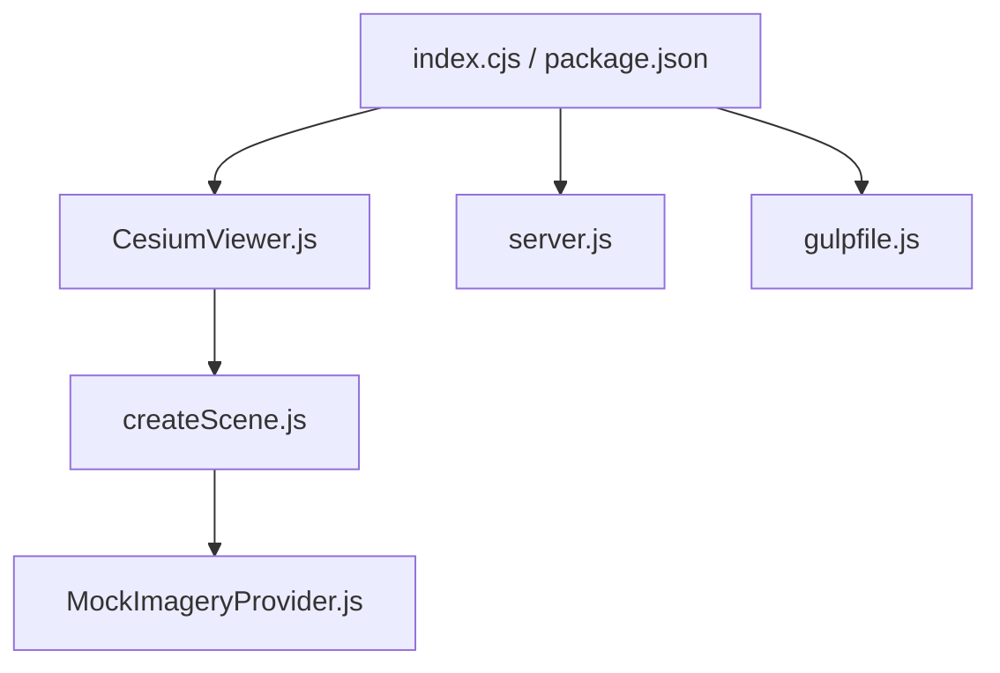

图表来源
- [CesiumViewer.js:1-20](file://Apps/CesiumViewer/CesiumViewer.js#L1-L20)
- [Specs/createScene.js:1-20](file://Specs/createScene.js#L1-L20)
- [Specs/MockImageryProvider.js:1-20](file://Specs/MockImageryProvider.js#L1-L20)
- [index.cjs:1-20](file://index.cjs#L1-L20)
- [package.json:1-20](file://package.json#L1-L20)
- [server.js:1-20](file://server.js#L1-L20)
- [gulpfile.js:1-20](file://gulpfile.js#L1-L20)

章节来源
- [CesiumViewer.js:1-20](file://Apps/CesiumViewer/CesiumViewer.js#L1-L20)
- [Specs/createScene.js:1-20](file://Specs/createScene.js#L1-L20)
- [Specs/MockImageryProvider.js:1-20](file://Specs/MockImageryProvider.js#L1-L20)
- [index.cjs:1-20](file://index.cjs#L1-L20)
- [package.json:1-20](file://package.json#L1-L20)
- [server.js:1-20](file://server.js#L1-L20)
- [gulpfile.js:1-20](file://gulpfile.js#L1-L20)

## 性能考量
- 缓存命中率优先：规范化键、合理 TTL、热点瓦片常驻。
- 并发与背压：限制并发请求数，避免阻塞主线程。
- 瓦片尺寸与格式：优先使用压缩格式（KTX/WEBP），控制单瓦片大小。
- 预取与懒加载：视口边缘预取，滚动后延迟加载非关键瓦片。
- 内存监控：定期统计缓存占用，触发清理与告警。
- 网络优化：启用 HTTP/2、连接复用、CDN 就近分发。

[本节为通用指导，不直接分析具体文件]

## 故障排查指南
- 常见问题
  - 瓦片空白或错位：检查 CRS/SRS、bbox 计算、行列号映射。
  - 认证失败：确认 Token 有效期、作用域、跨域策略。
  - 性能抖动：观察缓存命中率、并发数、瓦片大小与解码耗时。
  - 叠加闪烁：检查混合模式与透明度通道一致性。
- 定位方法
  - 开启调试日志：记录请求参数、响应状态、缓存命中情况。
  - 使用 Mock 提供者：隔离网络问题，复现边界条件。
  - 浏览器开发者工具：Network 面板查看请求链路，Memory 面板分析内存占用。
- 恢复策略
  - 自动重试与降级：失败次数阈值、回退到低分辨率瓦片。
  - 缓存清理：手动清空特定键空间，重建缓存。
  - 服务健康检查：周期性探测可用性，动态切换备用源。

章节来源
- [Specs/MockImageryProvider.js:1-20](file://Specs/MockImageryProvider.js#L1-L20)
- [Specs/createScene.js:1-20](file://Specs/createScene.js#L1-L20)

## 结论
影像图层提供者作为渲染管线的关键一环，需要兼顾多协议适配、高效缓存、精确投影与良好用户体验。通过 LRU 缓存与自动清理策略，结合并发控制与预取机制，可在保证画质的前提下显著提升性能。自定义数据源的接入应遵循统一接口与安全规范，完善错误处理与监控，确保系统稳定可靠。

[本节为总结性内容，不直接分析具体文件]

## 附录
- 术语
  - 瓦片：固定分辨率与尺寸的影像切片。
  - 行/列号：瓦片在网格中的位置标识。
  - 视口：当前相机可见的地理范围。
- 参考样例
  - 示例应用：CesiumViewer.js
  - 测试样例：MockImageryProvider.js、createScene.js

章节来源
- [CesiumViewer.js:1-20](file://Apps/CesiumViewer/CesiumViewer.js#L1-L20)
- [Specs/MockImageryProvider.js:1-20](file://Specs/MockImageryProvider.js#L1-L20)
- [Specs/createScene.js:1-20](file://Specs/createScene.js#L1-L20)