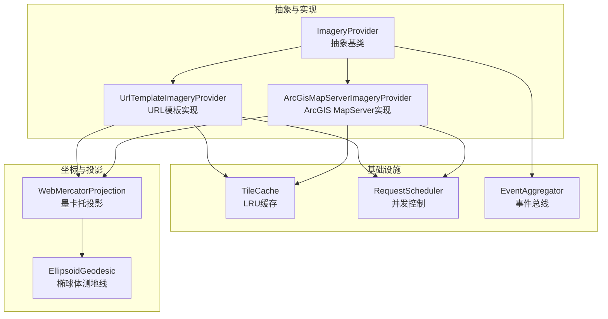
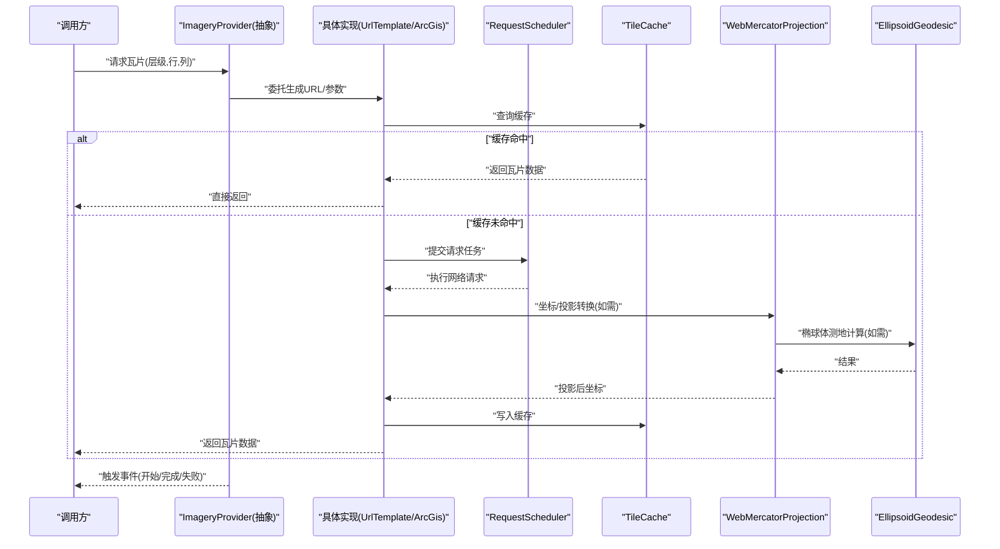
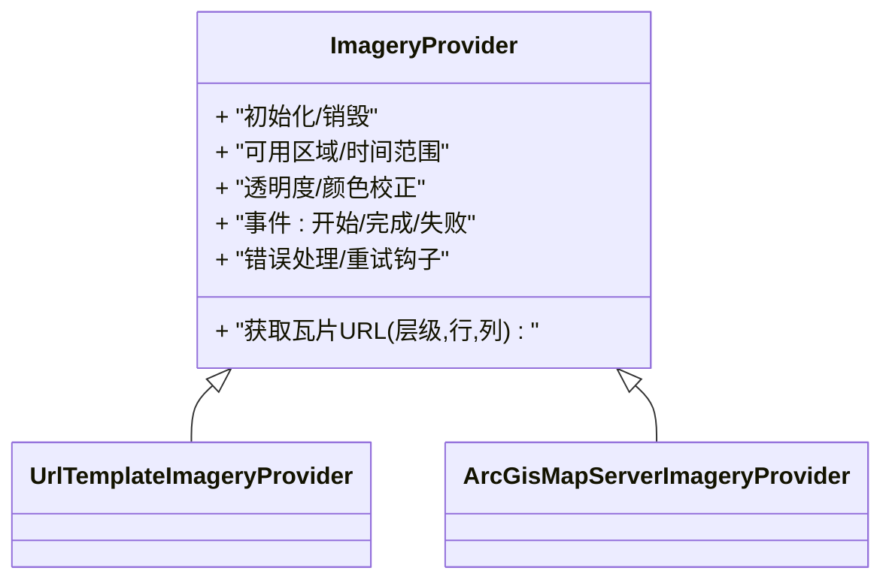
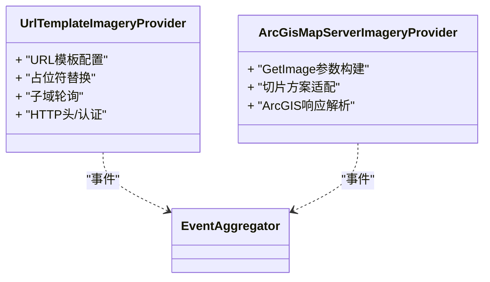
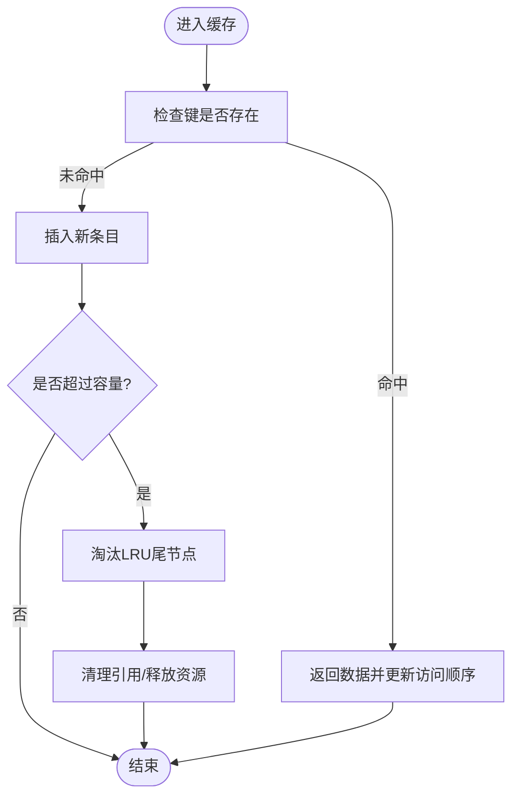
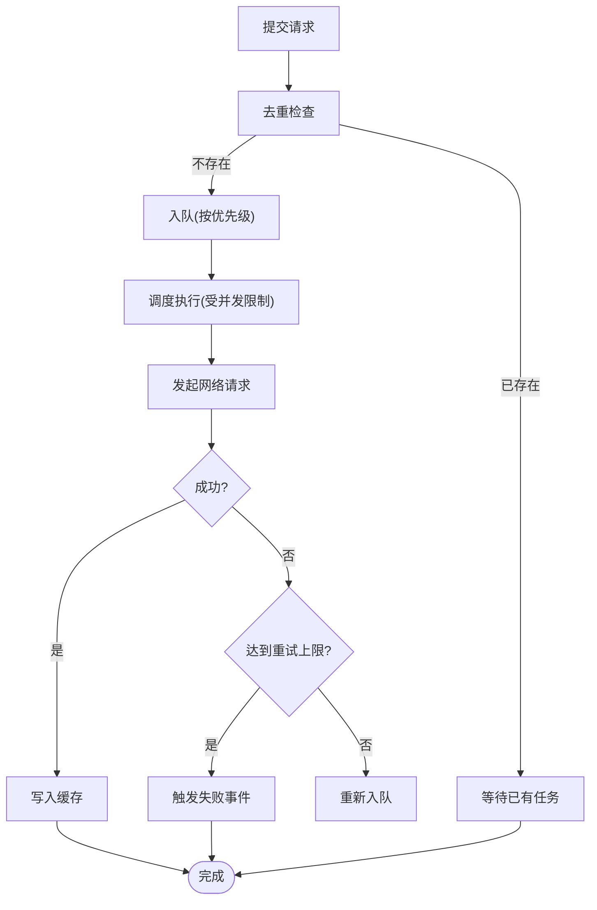
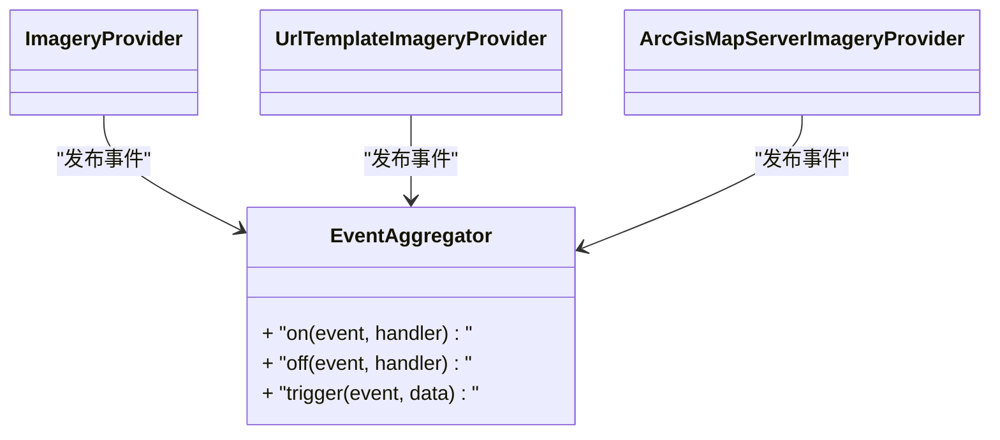
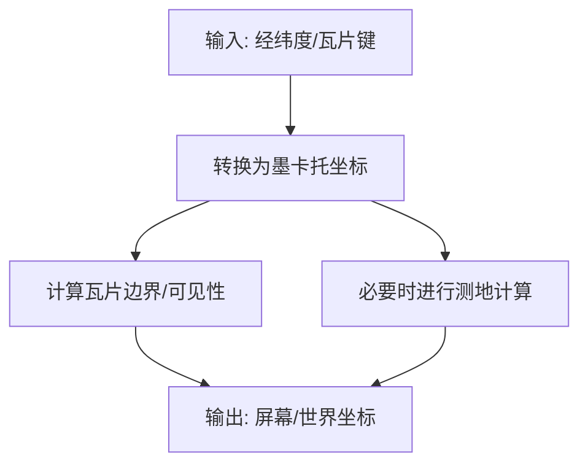
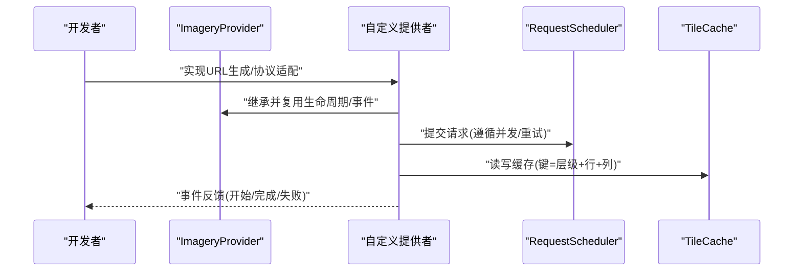
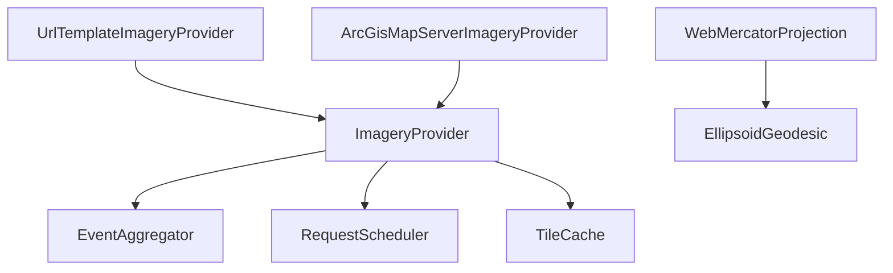

# 影像提供者基础架构

<cite>
**本文引用的文件**   
- [ImageryProvider.js](file://Source/Core/ImageryProvider.js)
- [UrlTemplateImageryProvider.js](file://Source/Core/UrlTemplateImageryProvider.js)
- [ArcGisMapServerImageryProvider.js](file://Source/Core/ArcGisMapServerImageryProvider.js)
- [TileCache.js](file://Source/Core/TileCache.js)
- [RequestScheduler.js](file://Source/Core/RequestScheduler.js)
- [EventAggregator.js](file://Source/Core/EventAggregator.js)
- [WebMercatorProjection.js](file://Source/Core/WebMercatorProjection.js)
- [EllipsoidGeodesic.js](file://Source/Core/EllipsoidGeodesic.js)
- [MockImageryProvider.js](file://Specs/MockImageryProvider.js)
</cite>

## 目录
1. [简介](#简介)
2. [项目结构](#项目结构)
3. [核心组件](#核心组件)
4. [架构总览](#架构总览)
5. [详细组件分析](#详细组件分析)
6. [依赖关系分析](#依赖关系分析)
7. [性能考量](#性能考量)
8. [故障排查指南](#故障排查指南)
9. [结论](#结论)
10. [附录](#附录)

## 简介
本技术文档聚焦于 CesiumJS 中的“影像提供者”基础架构，围绕以下目标展开：
- 深入解释 ImageryProvider 抽象基类的设计模式与核心接口定义，包括请求生命周期管理、错误处理机制和事件系统。
- 阐述瓦片缓存系统的实现原理，包括 LRU 缓存算法、内存管理和自动清理策略。
- 说明影像数据的投影变换与坐标系统处理机制。
- 解释瓦片加载队列管理与并发控制策略。
- 提供自定义影像提供者的开发指南，包含必要的接口实现与最佳实践。

## 项目结构
CesiumJS 的影像体系位于 Source/Core 目录中，关键模块如下：
- 抽象层：ImageryProvider 定义了统一的影像数据源接口。
- 具体实现：UrlTemplateImageryProvider、ArcGisMapServerImageryProvider 等基于不同协议或服务的实现。
- 基础设施：TileCache（瓦片缓存）、RequestScheduler（请求调度器）、EventAggregator（事件聚合）。
- 坐标与投影：WebMercatorProjection、EllipsoidGeodesic 等用于坐标系统与投影变换。
- 测试与示例：Specs/MockImageryProvider 提供了最小可运行的模拟实现，便于理解接口契约。

图表来源
- [ImageryProvider.js](file://Source/Core/ImageryProvider.js)
- [UrlTemplateImageryProvider.js](file://Source/Core/UrlTemplateImageryProvider.js)
- [ArcGisMapServerImageryProvider.js](file://Source/Core/ArcGisMapServerImageryProvider.js)
- [TileCache.js](file://Source/Core/TileCache.js)
- [RequestScheduler.js](file://Source/Core/RequestScheduler.js)
- [EventAggregator.js](file://Source/Core/EventAggregator.js)
- [WebMercatorProjection.js](file://Source/Core/WebMercatorProjection.js)
- [EllipsoidGeodesic.js](file://Source/Core/EllipsoidGeodesic.js)

章节来源
- [ImageryProvider.js](file://Source/Core/ImageryProvider.js)
- [UrlTemplateImageryProvider.js](file://Source/Core/UrlTemplateImageryProvider.js)
- [ArcGisMapServerImageryProvider.js](file://Source/Core/ArcGisMapServerImageryProvider.js)
- [TileCache.js](file://Source/Core/TileCache.js)
- [RequestScheduler.js](file://Source/Core/RequestScheduler.js)
- [EventAggregator.js](file://Source/Core/EventAggregator.js)
- [WebMercatorProjection.js](file://Source/Core/WebMercatorProjection.js)
- [EllipsoidGeodesic.js](file://Source/Core/EllipsoidGeodesic.js)

## 核心组件
本节从设计模式与接口契约角度，解析 ImageryProvider 抽象基类的职责边界与扩展点。

- 抽象基类职责
  - 统一接口：为上层渲染管线提供一致的瓦片元数据、请求 URL 生成、可用范围与时间范围等能力。
  - 生命周期管理：初始化、销毁、更新周期与资源释放。
  - 事件系统：通过事件聚合器发布/订阅加载进度、错误、状态变更等事件。
  - 错误处理：标准化错误类型与重试策略入口。
  - 并发与缓存协作：与 RequestScheduler 和 TileCache 协同工作。

- 关键接口要点（概念性描述）
  - 瓦片键到 URL 的映射：根据瓦片层级与行列号生成网络请求地址。
  - 可用区域与时间范围：限制瓦片请求的地理范围与时间窗口。
  - 透明度与颜色校正：支持每瓦片的透明度与色彩调整。
  - 事件回调：如加载开始、完成、失败等。

- 设计模式
  - 模板方法：在基类中定义通用流程，子类仅实现差异化的 URL 生成与协议细节。
  - 观察者模式：通过事件聚合器解耦生产者与消费者。
  - 策略模式：不同的具体提供者作为策略替换底层协议逻辑。

章节来源
- [ImageryProvider.js](file://Source/Core/ImageryProvider.js)
- [EventAggregator.js](file://Source/Core/EventAggregator.js)

## 架构总览
下图展示了从调用方到影像数据返回的整体流程，涵盖请求调度、缓存命中、网络请求、投影变换与事件通知。

图表来源
- [UrlTemplateImageryProvider.js](file://Source/Core/UrlTemplateImageryProvider.js)
- [ArcGisMapServerImageryProvider.js](file://Source/Core/ArcGisMapServerImageryProvider.js)
- [RequestScheduler.js](file://Source/Core/RequestScheduler.js)
- [TileCache.js](file://Source/Core/TileCache.js)
- [WebMercatorProjection.js](file://Source/Core/WebMercatorProjection.js)
- [EllipsoidGeodesic.js](file://Source/Core/EllipsoidGeodesic.js)

## 详细组件分析

### ImageryProvider 抽象基类
- 设计目标
  - 将“瓦片元数据 + URL 生成 + 事件 + 生命周期”抽象化，屏蔽具体协议差异。
- 核心职责
  - 定义统一的瓦片键与 URL 映射接口。
  - 暴露事件通道（开始、完成、失败、状态变化）。
  - 提供默认的错误处理与重试钩子。
  - 与缓存与调度器协作的约定。
- 扩展点
  - 子类需实现 URL 生成、可选的认证头拼接、特定协议的参数构造。
  - 可覆盖事件行为以适配业务需求。

图表来源
- [ImageryProvider.js](file://Source/Core/ImageryProvider.js)
- [UrlTemplateImageryProvider.js](file://Source/Core/UrlTemplateImageryProvider.js)
- [ArcGisMapServerImageryProvider.js](file://Source/Core/ArcGisMapServerImageryProvider.js)

章节来源
- [ImageryProvider.js](file://Source/Core/ImageryProvider.js)

### UrlTemplateImageryProvider 与 ArcGisMapServerImageryProvider
- UrlTemplateImageryProvider
  - 通过 URL 模板字符串动态拼装请求地址，支持占位符替换（层级、行列、子域等）。
  - 适合标准 XYZ/TMS 服务。
- ArcGisMapServerImageryProvider
  - 针对 ArcGIS MapServer 的 GetImage 接口进行参数封装与响应解析。
  - 处理 ArcGIS 特有的切片方案与坐标系。

图表来源
- [UrlTemplateImageryProvider.js](file://Source/Core/UrlTemplateImageryProvider.js)
- [ArcGisMapServerImageryProvider.js](file://Source/Core/ArcGisMapServerImageryProvider.js)
- [EventAggregator.js](file://Source/Core/EventAggregator.js)

章节来源
- [UrlTemplateImageryProvider.js](file://Source/Core/UrlTemplateImageryProvider.js)
- [ArcGisMapServerImageryProvider.js](file://Source/Core/ArcGisMapServerImageryProvider.js)

### 瓦片缓存系统（TileCache）
- 缓存策略
  - LRU（最近最少使用）：淘汰最久未使用的条目，保证热点瓦片常驻内存。
  - 容量上限：按最大条目数或内存阈值进行裁剪。
  - 自动清理：当超过阈值时，周期性或触发式清理冷数据。
- 数据结构与复杂度
  - 哈希表 + 双向链表：O(1) 访问与插入，O(1) 移动至头部；淘汰尾部节点 O(1)。
- 一致性
  - 键空间由“层级+行+列+其他维度（如时间）”组成，确保唯一性。
  - 与请求去重结合，避免重复网络请求。

图表来源
- [TileCache.js](file://Source/Core/TileCache.js)

章节来源
- [TileCache.js](file://Source/Core/TileCache.js)

### 请求调度器（RequestScheduler）
- 并发控制
  - 全局并发上限：限制同时进行的网络请求数量，防止拥塞。
  - 域名级并发：对同一域名设置独立配额，避免单域瓶颈。
- 优先级与队列
  - 高优先级优先调度（如当前视口内瓦片）。
  - 超时与重试：可配置超时时间与重试次数。
- 与缓存协作
  - 提交前检查缓存命中，减少无效请求。
  - 成功后回写缓存，失败时记录错误并触发事件。

图表来源
- [RequestScheduler.js](file://Source/Core/RequestScheduler.js)

章节来源
- [RequestScheduler.js](file://Source/Core/RequestScheduler.js)

### 事件系统（EventAggregator）
- 角色
  - 作为事件总线，解耦影像提供者与监听者。
- 典型事件
  - 开始、完成、失败、状态变化、内存警告等。
- 使用建议
  - 订阅关键事件以监控性能与错误。
  - 避免在事件回调中进行阻塞操作。

图表来源
- [EventAggregator.js](file://Source/Core/EventAggregator.js)
- [ImageryProvider.js](file://Source/Core/ImageryProvider.js)
- [UrlTemplateImageryProvider.js](file://Source/Core/UrlTemplateImageryProvider.js)
- [ArcGisMapServerImageryProvider.js](file://Source/Core/ArcGisMapServerImageryProvider.js)

章节来源
- [EventAggregator.js](file://Source/Core/EventAggregator.js)

### 投影变换与坐标系统
- WebMercatorProjection
  - 负责经纬度与墨卡托平面坐标之间的互转，支撑 XYZ/TMS 瓦片索引。
- EllipsoidGeodesic
  - 提供椭球体上的距离、方位角等测地计算，辅助精度校验与可视化。
- 使用场景
  - 瓦片边界计算、视锥剔除、跨投影融合时的坐标对齐。

图表来源
- [WebMercatorProjection.js](file://Source/Core/WebMercatorProjection.js)
- [EllipsoidGeodesic.js](file://Source/Core/EllipsoidGeodesic.js)

章节来源
- [WebMercatorProjection.js](file://Source/Core/WebMercatorProjection.js)
- [EllipsoidGeodesic.js](file://Source/Core/EllipsoidGeodesic.js)

### 自定义影像提供者开发指南
- 必要步骤
  - 继承 ImageryProvider 抽象基类，实现 URL 生成与协议适配。
  - 接入事件系统，发布开始、完成、失败等事件。
  - 与 RequestScheduler 协作，遵守并发与重试策略。
  - 利用 TileCache 提升命中率，注意键空间唯一性与过期策略。
- 最佳实践
  - 合理设置并发上限与超时，避免雪崩。
  - 对大分辨率瓦片进行分块与渐进加载。
  - 使用子域轮询与压缩传输降低延迟。
  - 在事件回调中避免阻塞，采用异步批处理。
- 参考实现
  - 参见 MockImageryProvider 的最小实现，快速验证接口契约。

图表来源
- [ImageryProvider.js](file://Source/Core/ImageryProvider.js)
- [RequestScheduler.js](file://Source/Core/RequestScheduler.js)
- [TileCache.js](file://Source/Core/TileCache.js)
- [MockImageryProvider.js](file://Specs/MockImageryProvider.js)

章节来源
- [MockImageryProvider.js](file://Specs/MockImageryProvider.js)

## 依赖关系分析
- 耦合与内聚
  - ImageryProvider 抽象层保持低耦合，具体实现仅关注协议细节。
  - 事件聚合器与调度器作为横切关注点，被多个提供者共享。
- 外部依赖
  - 网络栈（浏览器 fetch/XMLHttpRequest）由调度器封装。
  - 投影与测地库用于坐标转换与几何计算。
- 潜在循环依赖
  - 通过事件与接口解耦，避免直接相互引用导致的循环。

图表来源
- [ImageryProvider.js](file://Source/Core/ImageryProvider.js)
- [UrlTemplateImageryProvider.js](file://Source/Core/UrlTemplateImageryProvider.js)
- [ArcGisMapServerImageryProvider.js](file://Source/Core/ArcGisMapServerImageryProvider.js)
- [EventAggregator.js](file://Source/Core/EventAggregator.js)
- [RequestScheduler.js](file://Source/Core/RequestScheduler.js)
- [TileCache.js](file://Source/Core/TileCache.js)
- [WebMercatorProjection.js](file://Source/Core/WebMercatorProjection.js)
- [EllipsoidGeodesic.js](file://Source/Core/EllipsoidGeodesic.js)

章节来源
- [ImageryProvider.js](file://Source/Core/ImageryProvider.js)
- [UrlTemplateImageryProvider.js](file://Source/Core/UrlTemplateImageryProvider.js)
- [ArcGisMapServerImageryProvider.js](file://Source/Core/ArcGisMapServerImageryProvider.js)
- [EventAggregator.js](file://Source/Core/EventAggregator.js)
- [RequestScheduler.js](file://Source/Core/RequestScheduler.js)
- [TileCache.js](file://Source/Core/TileCache.js)
- [WebMercatorProjection.js](file://Source/Core/WebMercatorProjection.js)
- [EllipsoidGeodesic.js](file://Source/Core/EllipsoidGeodesic.js)

## 性能考量
- 缓存命中率优化
  - 合理设置 LRU 容量与淘汰策略，避免频繁抖动。
  - 使用稳定的键空间，减少重复计算。
- 并发与带宽
  - 根据网络条件动态调整并发上限，避免拥塞。
  - 启用压缩与子域轮询，降低 RTT。
- 投影与几何计算
  - 批量处理坐标转换，减少函数调用开销。
  - 仅在必要时进行测地计算。
- 事件与主线程
  - 事件回调轻量，避免阻塞渲染帧。
  - 使用节流/防抖合并高频事件。

[本节为通用指导，不直接分析具体文件]

## 故障排查指南
- 常见问题
  - 缓存未命中：检查键空间一致性与过期策略。
  - 请求超时：调整超时与重试参数，检查服务端可用性。
  - 投影错位：确认输入坐标与目标投影匹配。
  - 事件丢失：确认订阅时机与事件触发路径。
- 定位手段
  - 订阅开始/完成/失败事件，打印关键日志。
  - 观察调度器队列长度与并发占用。
  - 检查缓存大小与淘汰频率。

章节来源
- [EventAggregator.js](file://Source/Core/EventAggregator.js)
- [RequestScheduler.js](file://Source/Core/RequestScheduler.js)
- [TileCache.js](file://Source/Core/TileCache.js)

## 结论
ImageryProvider 抽象基类通过清晰的接口与事件模型，将复杂的多协议影像加载流程标准化。配合 LRU 缓存、并发调度与投影工具，形成高性能、可扩展的影像基础架构。遵循本文的开发指南与最佳实践，可快速构建稳定可靠的自定义影像提供者。

[本节为总结性内容，不直接分析具体文件]

## 附录
- 术语
  - 瓦片键：层级+行+列+可选维度的唯一标识。
  - 并发上限：同时允许的网络请求数量。
  - LRU：最近最少使用淘汰策略。
- 参考实现路径
  - 最小可运行示例：Specs/MockImageryProvider.js

[本节为补充信息，不直接分析具体文件]