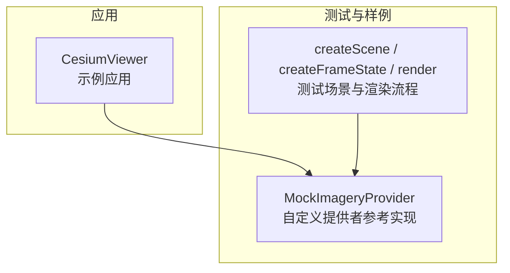
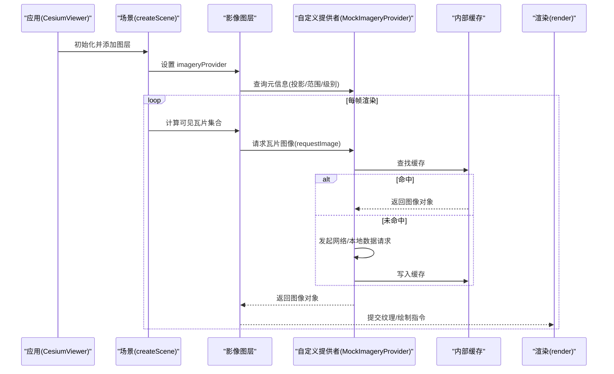
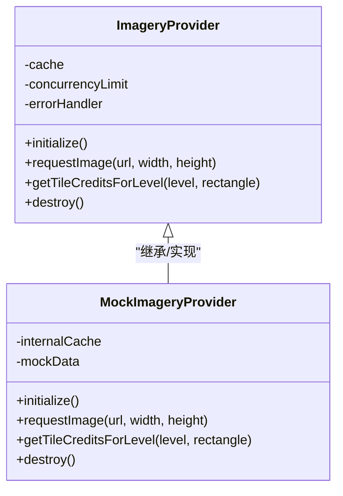
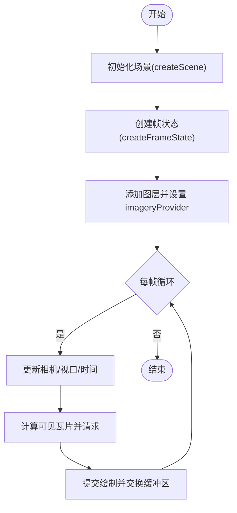
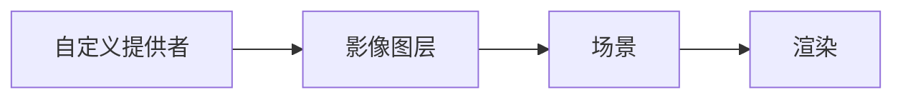

# 自定义影像提供者

<cite>
**本文引用的文件**   
- [MockImageryProvider.js](file://Specs/MockImageryProvider.js)
- [createScene.js](file://Specs/createScene.js)
- [createFrameState.js](file://Specs/createFrameState.js)
- [render.js](file://Specs/render.js)
- [CesiumViewer.js](file://Apps/CesiumViewer/CesiumViewer.js)
</cite>

## 目录
1. [简介](#简介)
2. [项目结构](#项目结构)
3. [核心组件](#核心组件)
4. [架构总览](#架构总览)
5. [详细组件分析](#详细组件分析)
6. [依赖关系分析](#依赖关系分析)
7. [性能考虑](#性能考虑)
8. [故障排查指南](#故障排查指南)
9. [结论](#结论)
10. [附录](#附录)

## 简介
本指南面向希望为 CesiumJS 实现自定义 ImageryProvider 的开发者，系统阐述接口契约、请求处理、瓦片生成与缓存管理、异步数据加载与错误处理模式、性能优化技巧（预加载、内存管理与 GPU 资源释放）、从静态图片到实时数据流的完整示例路径，以及单元测试与调试方法。文档同时说明与 Cesium 其他组件的集成模式与最佳实践，帮助你在保证稳定性的前提下获得良好的渲染性能。

## 项目结构
仓库采用“源码 + 应用 + 规范测试”的分层组织：
- Source：引擎源码（未在本节直接引用）
- Apps：示例应用与演示入口
- Specs：测试用例与测试辅助工具，包含 MockImageryProvider 等关键参考实现
- Documentation：贡献与构建相关文档

下图展示了与本指南相关的顶层结构与角色分工：

图表来源
- [CesiumViewer.js:1-200](file://Apps/CesiumViewer/CesiumViewer.js#L1-L200)
- [MockImageryProvider.js:1-200](file://Specs/MockImageryProvider.js#L1-L200)
- [createScene.js:1-200](file://Specs/createScene.js#L1-L200)
- [createFrameState.js:1-200](file://Specs/createFrameState.js#L1-L200)
- [render.js:1-200](file://Specs/render.js#L1-L200)

章节来源
- [CesiumViewer.js:1-200](file://Apps/CesiumViewer/CesiumViewer.js#L1-L200)
- [MockImageryProvider.js:1-200](file://Specs/MockImageryProvider.js#L1-L200)
- [createScene.js:1-200](file://Specs/createScene.js#L1-L200)
- [createFrameState.js:1-200](file://Specs/createFrameState.js#L1-L200)
- [render.js:1-200](file://Specs/render.js#L1-L200)

## 核心组件
- 自定义影像提供者（ImageryProvider）
  - 职责：对外暴露统一的影像瓦片访问接口，包括元信息（如投影、范围、级别）、瓦片请求与解析、缓存策略、状态与事件通知。
  - 关键能力：
    - 提供 getTileCreditsForLevel/rectangle 等元信息接口
    - 通过 requestImage(url, width, height) 或等价方式获取图像数据
    - 维护内部缓存（URL -> Image/Texture），避免重复请求
    - 在层级变化时更新 maximumLevel、minimumLevel、rectangle、tilingScheme 等
- 测试场景与渲染管线
  - 通过 createScene 创建场景，createFrameState 构造帧状态，render 驱动渲染循环
  - 将自定义提供者注入图层后，由渲染管线按视锥裁剪与 LOD 调度触发请求

章节来源
- [MockImageryProvider.js:1-200](file://Specs/MockImageryProvider.js#L1-L200)
- [createScene.js:1-200](file://Specs/createScene.js#L1-L200)
- [createFrameState.js:1-200](file://Specs/createFrameState.js#L1-L200)
- [render.js:1-200](file://Specs/render.js#L1-L200)

## 架构总览
下图展示自定义提供者与 Cesium 渲染管线的交互关系：

图表来源
- [CesiumViewer.js:1-200](file://Apps/CesiumViewer/CesiumViewer.js#L1-L200)
- [MockImageryProvider.js:1-200](file://Specs/MockImageryProvider.js#L1-L200)
- [createScene.js:1-200](file://Specs/createScene.js#L1-L200)
- [createFrameState.js:1-200](file://Specs/createFrameState.js#L1-L200)
- [render.js:1-200](file://Specs/render.js#L1-L200)

## 详细组件分析

### 自定义影像提供者（接口与实现要点）
- 接口契约
  - 元信息：projection、rectangle、tilingScheme、maximumLevel、minimumLevel、credit 等
  - 请求：requestImage(url, width, height) 或等价方法，返回可被渲染的图像对象
  - 缓存：内部以 URL 为键缓存图像对象，避免重复下载与解码
  - 生命周期：initialize()、destroy() 用于资源申请与释放
- 请求处理
  - 根据 tileKey 与 tilingScheme 拼接 URL
  - 支持并发控制与重试机制
  - 对失败请求进行降级（占位图/空瓦片）
- 瓦片生成
  - 若后端不提供图像，可在客户端合成（Canvas/WebGL）
  - 注意尺寸对齐与像素格式，减少转码开销
- 缓存管理
  - LRU/容量上限策略，防止内存膨胀
  - 区分“正在请求中”和“已就绪”状态，避免重复请求
- 错误处理
  - 统一错误类型与消息，向上抛出或回调
  - 记录日志与统计指标（请求耗时、失败率）
- 线程模型
  - 主线程负责 UI 与调度，重计算可放入 Web Worker
  - 大对象使用 Transferable 传输，降低拷贝成本

图表来源
- [MockImageryProvider.js:1-200](file://Specs/MockImageryProvider.js#L1-L200)

章节来源
- [MockImageryProvider.js:1-200](file://Specs/MockImageryProvider.js#L1-L200)

### 测试场景与渲染流程
- 场景创建
  - 使用 createScene 初始化 WebGL 上下文与基础配置
  - 通过 createFrameState 准备每帧所需的相机、视口、时间等状态
- 渲染循环
  - render 驱动每一帧的更新与绘制
  - 图层根据当前视锥与 LOD 向提供者拉取瓦片
- 集成自定义提供者
  - 将 MockImageryProvider 实例注入图层
  - 验证不同级别、矩形区域下的瓦片请求与缓存命中

图表来源
- [createScene.js:1-200](file://Specs/createScene.js#L1-L200)
- [createFrameState.js:1-200](file://Specs/createFrameState.js#L1-L200)
- [render.js:1-200](file://Specs/render.js#L1-L200)

章节来源
- [createScene.js:1-200](file://Specs/createScene.js#L1-L200)
- [createFrameState.js:1-200](file://Specs/createFrameState.js#L1-L200)
- [render.js:1-200](file://Specs/render.js#L1-L200)

### 开发示例路径
- 简单静态图片服务
  - 目标：基于固定 URL 模板返回静态图片
  - 关键点：URL 拼接规则、最小/最大级别、矩形范围、缓存命中率
  - 参考路径：[MockImageryProvider.js](file://Specs/MockImageryProvider.js)
- 动态合成瓦片
  - 目标：服务端无瓦片时，在客户端用 Canvas 合成
  - 关键点：Canvas 尺寸与像素格式、批量绘制优化、Web Worker 离屏渲染
  - 参考路径：[MockImageryProvider.js](file://Specs/MockImageryProvider.js)
- 实时数据流
  - 目标：WebSocket/SSE 推送增量更新，按需刷新受影响瓦片
  - 关键点：增量合并、去抖与节流、失效与重建策略、GPU 纹理更新
  - 参考路径：[MockImageryProvider.js](file://Specs/MockImageryProvider.js)

章节来源
- [MockImageryProvider.js:1-200](file://Specs/MockImageryProvider.js#L1-L200)

### 单元测试编写指南
- 测试目标
  - 接口契约：元信息正确性、请求参数合法性、返回值类型
  - 缓存行为：命中/未命中、过期与清理
  - 错误处理：超时、网络异常、无效响应
  - 并发与背压：限制并发数、队列积压时的行为
- 测试环境
  - 使用 createScene/createFrameState 搭建最小可用场景
  - 使用 render 驱动单帧或多次帧，断言渲染结果或调用次数
- 断言建议
  - 请求 URL 列表、缓存大小、错误计数、耗时分布
  - 边界条件：零级、最大级、越界矩形、空数据
- 参考路径
  - 场景与帧状态：[createScene.js](file://Specs/createScene.js)、[createFrameState.js](file://Specs/createFrameState.js)
  - 渲染驱动：[render.js](file://Specs/render.js)
  - 自定义提供者样例：[MockImageryProvider.js](file://Specs/MockImageryProvider.js)

章节来源
- [createScene.js:1-200](file://Specs/createScene.js#L1-L200)
- [createFrameState.js:1-200](file://Specs/createFrameState.js#L1-L200)
- [render.js:1-200](file://Specs/render.js#L1-L200)
- [MockImageryProvider.js:1-200](file://Specs/MockImageryProvider.js#L1-L200)

### 调试工具使用方法
- 浏览器开发者工具
  - Network：观察瓦片请求 URL、状态码、耗时
  - Performance：定位卡顿点，检查主线程阻塞
  - Memory：监控堆增长，识别内存泄漏
- 应用内调试
  - 在自定义提供者中增加日志输出（请求/缓存/错误）
  - 暴露统计指标（请求总数、失败率、缓存命中率）
- 参考路径
  - 示例应用入口：[CesiumViewer.js](file://Apps/CesiumViewer/CesiumViewer.js)

章节来源
- [CesiumViewer.js:1-200](file://Apps/CesiumViewer/CesiumViewer.js#L1-L200)

## 依赖关系分析
- 组件耦合
  - 自定义提供者与图层松耦合，通过标准接口通信
  - 场景与渲染管线仅依赖提供者的公开 API
- 外部依赖
  - 网络请求库（可选）
  - 图像处理库（可选）
  - Web Worker（可选）
- 潜在循环依赖
  - 避免在提供者中反向引用场景或图层实例

图表来源
- [MockImageryProvider.js:1-200](file://Specs/MockImageryProvider.js#L1-L200)
- [createScene.js:1-200](file://Specs/createScene.js#L1-L200)
- [render.js:1-200](file://Specs/render.js#L1-L200)

章节来源
- [MockImageryProvider.js:1-200](file://Specs/MockImageryProvider.js#L1-L200)
- [createScene.js:1-200](file://Specs/createScene.js#L1-L200)
- [render.js:1-200](file://Specs/render.js#L1-L200)

## 性能考虑
- 瓦片预加载
  - 基于相机运动预测，提前请求相邻或下一级别的瓦片
  - 结合视锥裁剪与距离阈值，避免无效预取
- 内存管理
  - 设置缓存上限与淘汰策略（LRU/LFU）
  - 及时销毁不再使用的图像对象与中间缓冲
- GPU 资源释放
  - 在 destroy 或不可见时释放纹理与着色器资源
  - 避免频繁创建/销毁大对象，复用缓冲区
- 并发与带宽
  - 限制并发请求数，避免拥塞
  - 启用压缩与缓存头（ETag/If-None-Match）
- 计算卸载
  - 复杂合成逻辑放入 Web Worker
  - 使用 Transferable 对象减少拷贝

## 故障排查指南
- 常见问题
  - 瓦片不显示：检查 URL 拼接、跨域、MIME 类型、图像尺寸
  - 闪烁或抖动：确认层级切换时机与矩形边界一致性
  - 内存泄漏：追踪未释放的图像/纹理对象与定时器
  - 性能瓶颈：定位主线程阻塞点，减少同步 I/O
- 定位手段
  - 在请求前后打点，统计耗时与失败率
  - 使用浏览器性能面板录制关键帧，对比优化前后差异
- 参考路径
  - 示例应用与测试辅助：[CesiumViewer.js](file://Apps/CesiumViewer/CesiumViewer.js)、[createScene.js](file://Specs/createScene.js)、[createFrameState.js](file://Specs/createFrameState.js)、[render.js](file://Specs/render.js)

章节来源
- [CesiumViewer.js:1-200](file://Apps/CesiumViewer/CesiumViewer.js#L1-L200)
- [createScene.js:1-200](file://Specs/createScene.js#L1-L200)
- [createFrameState.js:1-200](file://Specs/createFrameState.js#L1-L200)
- [render.js:1-200](file://Specs/render.js#L1-L200)

## 结论
实现高性能、可维护的自定义 ImageryProvider 需要遵循清晰的接口契约、稳健的错误处理与缓存策略，并结合预加载、内存与 GPU 资源管理进行整体优化。借助仓库中的测试辅助与示例应用，可以快速搭建验证环境、编写覆盖全面的单元测试，并在真实场景中持续调优。

## 附录
- 术语
  - 瓦片：按网格划分的影像块
  - 层级：分辨率/缩放级别
  - 视锥裁剪：仅请求与当前视角相关的瓦片
- 最佳实践清单
  - 明确最小/最大层级与矩形范围
  - 统一错误处理与降级策略
  - 合理设置并发与缓存上限
  - 在 destroy 中释放所有资源
  - 使用 Web Worker 处理重型计算
  - 通过单元测试与性能回归保障质量