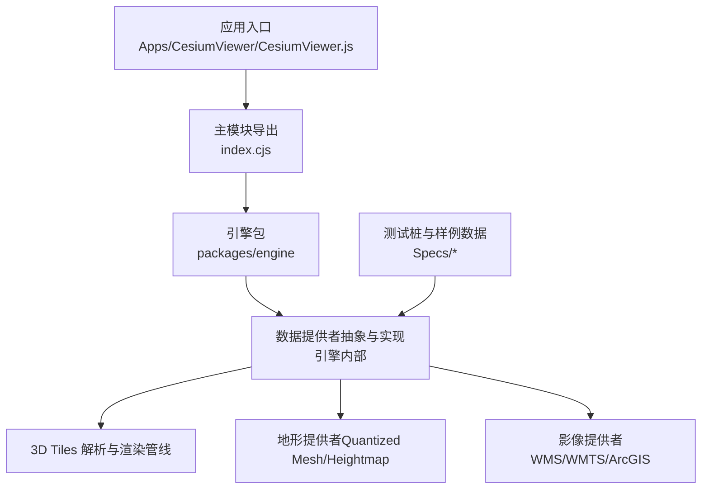
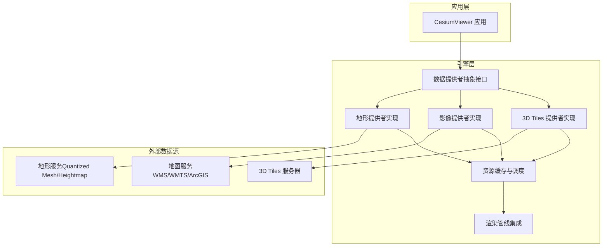
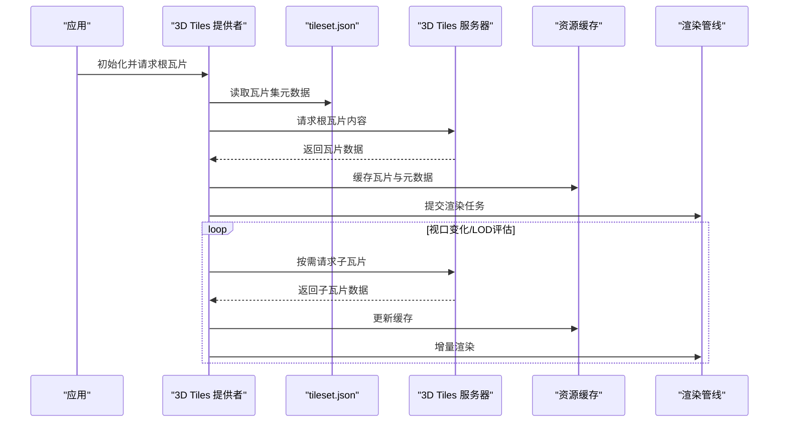
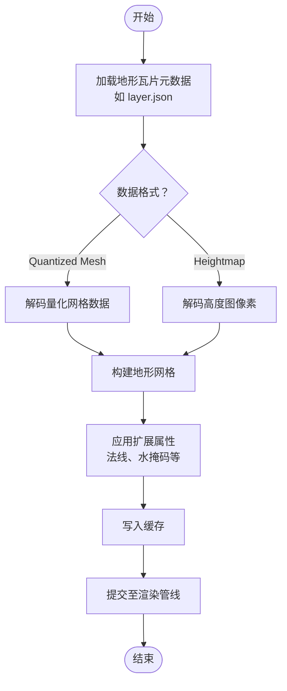
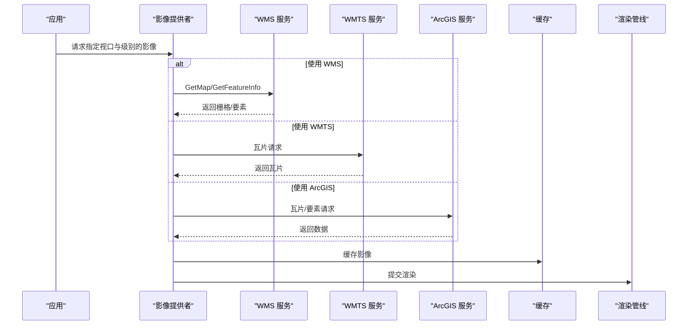
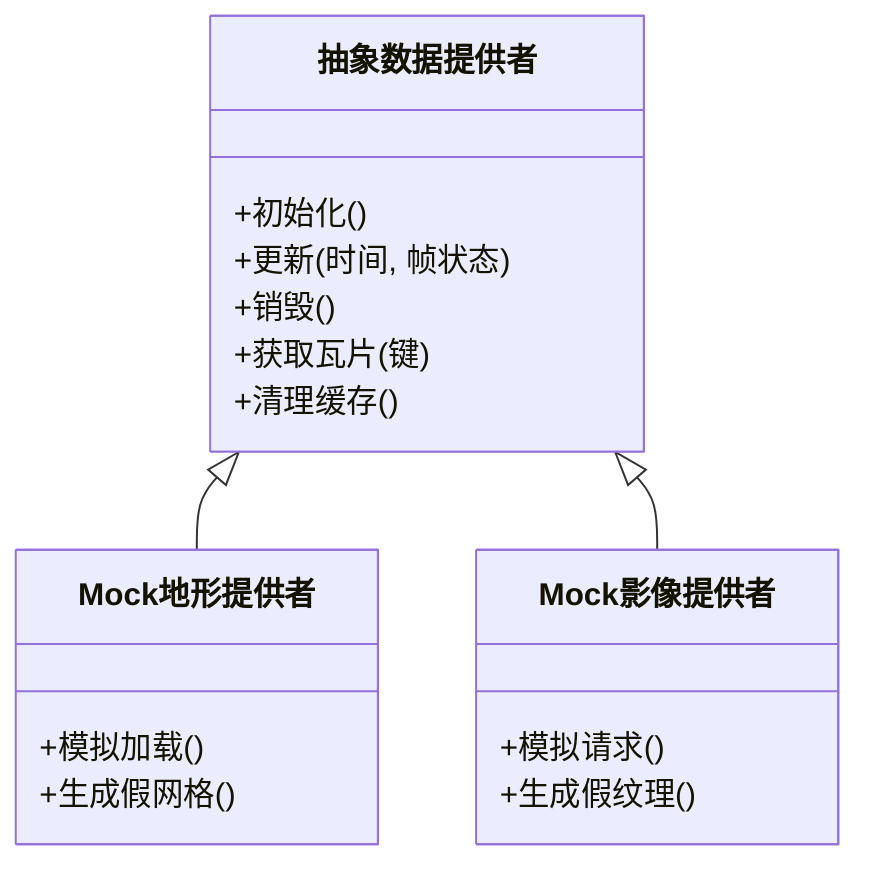
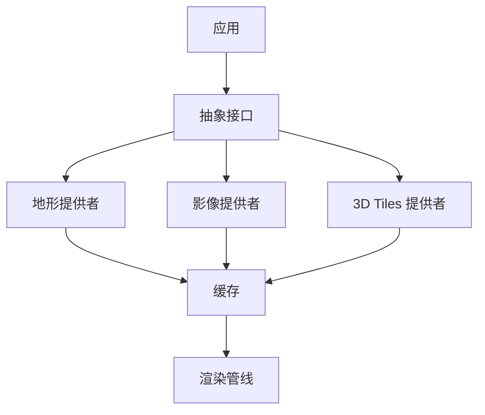

# 数据提供者

<cite>
**本文引用的文件**   
- [README.md](file://README.md)
- [package.json](file://package.json)
- [index.cjs](file://index.cjs)
- [Apps/CesiumViewer/CesiumViewer.js](file://Apps/CesiumViewer/CesiumViewer.js)
- [Apps/CesiumViewer/index.html](file://Apps/CesiumViewer/index.html)
- [Specs/MockTerrainProvider.js](file://Specs/MockTerrainProvider.js)
- [Specs/MockImageryProvider.js](file://Specs/MockImageryProvider.js)
- [Specs/TerrainTileProcessor.js](file://Specs/TerrainTileProcessor.js)
- [Specs/Data/CesiumTerrainTileJson/QuantizedMesh/layer.json](file://Specs/Data/CesiumTerrainTileJson/QuantizedMesh/layer.json)
- [Specs/Data/CesiumTerrainTileJson/Heightmap/layer.json](file://Specs/Data/CesiumTerrainTileJson/Heightmap/layer.json)
- [Specs/Data/Cesium3DTiles/Tilesets/Tileset/tileset.json](file://Specs/Data/Cesium3DTiles/Tilesets/Tileset/tileset.json)
- [Specs/Data/Cesium3DTiles/Batched/BatchedColors/tileset.json](file://Specs/Data/Cesium3DTiles/Batched/BatchedColors/tileset.json)
- [Specs/Data/Cesium3DTiles/PointCloud/PointCloudRGB/tileset.json](file://Specs/Data/Cesium3DTiles/PointCloud/PointCloudRGB/tileset.json)
- [Specs/Data/WMS/GetFeatureInfo-Custom.json](file://Specs/Data/WMS/GetFeatureInfo-Custom.json)
</cite>

## 目录
1. [简介](#简介)
2. [项目结构](#项目结构)
3. [核心组件](#核心组件)
4. [架构总览](#架构总览)
5. [详细组件分析](#详细组件分析)
6. [依赖分析](#依赖分析)
7. [性能考虑](#性能考虑)
8. [故障排查指南](#故障排查指南)
9. [结论](#结论)
10. [附录](#附录)

## 简介
本技术文档围绕 Cesium 的数据提供者体系展开，聚焦以下目标：
- 抽象接口设计与扩展机制：解释地形、影像与三维瓦片等数据提供者的统一抽象与扩展点。
- 3D Tiles 支持实现：层级结构、批处理（Batching）与动态加载流程。
- 地形数据提供者：Quantized Mesh 格式与高度图（Heightmap）处理原理。
- 影像图层提供者：对 WMS、WMTS、ArcGIS 等地图服务标准的适配。
- 自定义数据提供者开发指南：基于仓库示例与测试桩的完整实践路径与最佳实践。

## 项目结构
Cesium 仓库采用多包组织方式，核心引擎位于 packages/engine，应用与示例位于 Apps，测试与样例数据位于 Specs。数据提供者相关能力主要分布在引擎层，并通过应用入口与测试桩进行验证与演示。

图表来源
- [index.cjs:1-200](file://index.cjs#L1-L200)
- [Apps/CesiumViewer/CesiumViewer.js:1-200](file://Apps/CesiumViewer/CesiumViewer.js#L1-L200)

章节来源
- [README.md:1-200](file://README.md#L1-L200)
- [package.json:1-200](file://package.json#L1-L200)
- [index.cjs:1-200](file://index.cjs#L1-L200)
- [Apps/CesiumViewer/CesiumViewer.js:1-200](file://Apps/CesiumViewer/CesiumViewer.js#L1-L200)

## 核心组件
本节概述数据提供者在 Cesium 中的角色与职责划分：
- 抽象接口：为不同数据源（地形、影像、三维瓦片）定义统一的加载、更新与生命周期管理契约。
- 具体实现：针对 3D Tiles、Quantized Mesh、Heightmap、WMS/WMTS/ArcGIS 等标准的具体适配。
- 资源调度：负责按需加载、缓存、失效与内存回收。
- 渲染集成：将数据转换为可渲染的几何、纹理或着色器输入。

章节来源
- [index.cjs:1-200](file://index.cjs#L1-L200)
- [Apps/CesiumViewer/CesiumViewer.js:1-200](file://Apps/CesiumViewer/CesiumViewer.js#L1-L200)

## 架构总览
下图展示数据提供者体系在整体系统中的位置与交互关系。

图表来源
- [index.cjs:1-200](file://index.cjs#L1-L200)
- [Apps/CesiumViewer/CesiumViewer.js:1-200](file://Apps/CesiumViewer/CesiumViewer.js#L1-L200)

## 详细组件分析

### 3D Tiles 数据提供者
3D Tiles 是 Cesium 的三维瓦片标准，支持分层级、分区域、按需加载的大规模三维场景。其关键特性包括：
- 层级结构：通过 tileset.json 描述根瓦片与子瓦片树，结合几何误差与视距控制 LOD。
- 批处理：批量几何（Batched）与实例化（Instanced）减少绘制调用，提升渲染效率。
- 动态加载：根据相机位置与可视性计算，动态请求与卸载瓦片内容。

图表来源
- [Specs/Data/Cesium3DTiles/Tilesets/Tileset/tileset.json:1-200](file://Specs/Data/Cesium3DTiles/Tilesets/Tileset/tileset.json#L1-L200)
- [Specs/Data/Cesium3DTiles/Batched/BatchedColors/tileset.json:1-200](file://Specs/Data/Cesium3DTiles/Batched/BatchedColors/tileset.json#L1-L200)
- [Specs/Data/Cesium3DTiles/PointCloud/PointCloudRGB/tileset.json:1-200](file://Specs/Data/Cesium3DTiles/PointCloud/PointCloudRGB/tileset.json#L1-L200)

章节来源
- [Specs/Data/Cesium3DTiles/Tilesets/Tileset/tileset.json:1-200](file://Specs/Data/Cesium3DTiles/Tilesets/Tileset/tileset.json#L1-L200)
- [Specs/Data/Cesium3DTiles/Batched/BatchedColors/tileset.json:1-200](file://Specs/Data/Cesium3DTiles/Batched/BatchedColors/tileset.json#L1-L200)
- [Specs/Data/Cesium3DTiles/PointCloud/PointCloudRGB/tileset.json:1-200](file://Specs/Data/Cesium3DTiles/PointCloud/PointCloudRGB/tileset.json#L1-L200)

### 地形数据提供者（Quantized Mesh 与 Heightmap）
地形数据提供者负责加载与处理地形瓦片，常见格式包括：
- Quantized Mesh：压缩网格表示，包含顶点坐标、索引与可选的法线、水掩码等扩展。
- Heightmap：基于灰度图像的高度场，需解码像素值并构建网格。

图表来源
- [Specs/Data/CesiumTerrainTileJson/QuantizedMesh/layer.json:1-200](file://Specs/Data/CesiumTerrainTileJson/QuantizedMesh/layer.json#L1-L200)
- [Specs/Data/CesiumTerrainTileJson/Heightmap/layer.json:1-200](file://Specs/Data/CesiumTerrainTileJson/Heightmap/layer.json#L1-L200)
- [Specs/TerrainTileProcessor.js:1-200](file://Specs/TerrainTileProcessor.js#L1-L200)

章节来源
- [Specs/Data/CesiumTerrainTileJson/QuantizedMesh/layer.json:1-200](file://Specs/Data/CesiumTerrainTileJson/QuantizedMesh/layer.json#L1-L200)
- [Specs/Data/CesiumTerrainTileJson/Heightmap/layer.json:1-200](file://Specs/Data/CesiumTerrainTileJson/Heightmap/layer.json#L1-L200)
- [Specs/TerrainTileProcessor.js:1-200](file://Specs/TerrainTileProcessor.js#L1-L200)

### 影像图层提供者（WMS、WMTS、ArcGIS）
影像图层提供者对接多种地图服务标准，按视口与缩放级别请求切片或合成影像：
- WMS：通过 GetMap/GetFeatureInfo 等请求获取栅格或要素信息。
- WMTS：基于预切片瓦片的 RESTful 访问。
- ArcGIS：兼容 ArcGIS MapServer/FeatureServer 的瓦片与要素服务。

图表来源
- [Specs/Data/WMS/GetFeatureInfo-Custom.json:1-200](file://Specs/Data/WMS/GetFeatureInfo-Custom.json#L1-200)

章节来源
- [Specs/Data/WMS/GetFeatureInfo-Custom.json:1-200](file://Specs/Data/WMS/GetFeatureInfo-Custom.json#L1-200)

### 自定义数据提供者开发指南
为实现自定义数据提供者，建议遵循以下步骤与最佳实践：
- 明确抽象契约：参考现有测试桩（MockTerrainProvider、MockImageryProvider），理解加载、更新、销毁等生命周期方法。
- 设计数据模型：定义瓦片键、边界框、几何误差、可用性与缓存策略。
- 实现网络与解码：封装 HTTP 请求、错误重试、超时与并发控制；实现数据解码与缓冲。
- 集成渲染：将数据转换为引擎可识别的几何、纹理或着色器输入。
- 测试与验证：使用仓库提供的测试桩与样例数据进行端到端验证。

图表来源
- [Specs/MockTerrainProvider.js:1-200](file://Specs/MockTerrainProvider.js#L1-L200)
- [Specs/MockImageryProvider.js:1-200](file://Specs/MockImageryProvider.js#L1-L200)

章节来源
- [Specs/MockTerrainProvider.js:1-200](file://Specs/MockTerrainProvider.js#L1-L200)
- [Specs/MockImageryProvider.js:1-200](file://Specs/MockImageryProvider.js#L1-L200)

## 依赖分析
数据提供者之间的耦合与协作关系如下：
- 应用层通过统一接口与数据提供者交互，避免直接依赖具体实现。
- 各提供者共享缓存与调度逻辑，降低重复 IO 与内存占用。
- 渲染管线仅消费标准化数据对象，解耦数据源与可视化表现。

图表来源
- [index.cjs:1-200](file://index.cjs#L1-L200)
- [Apps/CesiumViewer/CesiumViewer.js:1-200](file://Apps/CesiumViewer/CesiumViewer.js#L1-L200)

章节来源
- [index.cjs:1-200](file://index.cjs#L1-L200)
- [Apps/CesiumViewer/CesiumViewer.js:1-200](file://Apps/CesiumViewer/CesiumViewer.js#L1-L200)

## 性能考虑
- 瓦片粒度与几何误差：合理设置 LOD 阈值，避免过细或过粗的瓦片导致带宽与渲染压力失衡。
- 批处理与实例化：优先使用 Batched/Instanced 以减少绘制调用。
- 缓存策略：LRU 或基于时间的缓存，配合显存与内存监控。
- 并发与限流：限制并行请求数，避免雪崩效应。
- 增量更新：仅在视口变化或数据失效时触发重绘。

[本节为通用指导，不直接分析具体文件]

## 故障排查指南
常见问题与定位思路：
- 瓦片加载失败：检查网络请求、跨域配置与服务端响应；查看缓存命中情况。
- 渲染异常：确认数据解码正确性、坐标系与变换矩阵；核对几何误差与可见性计算。
- 性能瓶颈：分析请求并发、解码耗时与 GPU 提交量；优化瓦片大小与纹理分辨率。
- 服务兼容性：校验 WMS/WMTS/ArcGIS 参数与协议版本；使用样例数据对比行为。

章节来源
- [Specs/MockTerrainProvider.js:1-200](file://Specs/MockTerrainProvider.js#L1-L200)
- [Specs/MockImageryProvider.js:1-200](file://Specs/MockImageryProvider.js#L1-L200)
- [Specs/TerrainTileProcessor.js:1-200](file://Specs/TerrainTileProcessor.js#L1-L200)

## 结论
Cesium 的数据提供者体系以抽象接口为核心，通过模块化实现覆盖 3D Tiles、地形与影像等多类数据源。借助批处理、动态加载与缓存策略，系统在大场景与高并发下仍保持良好性能。开发者可通过测试桩与样例数据快速实现自定义提供者，满足多样化业务需求。

[本节为总结性内容，不直接分析具体文件]

## 附录
- 样例数据与测试桩路径：
  - 3D Tiles 瓦片集与批处理样例：[Specs/Data/Cesium3DTiles](file://Specs/Data/Cesium3DTiles)
  - 地形瓦片元数据（Quantized Mesh/Heightmap）：[Specs/Data/CesiumTerrainTileJson](file://Specs/Data/CesiumTerrainTileJson)
  - WMS 样例与 GetFeatureInfo 响应：[Specs/Data/WMS](file://Specs/Data/WMS)
  - 测试桩与处理器：[Specs/MockTerrainProvider.js](file://Specs/MockTerrainProvider.js)、[Specs/MockImageryProvider.js](file://Specs/MockImageryProvider.js)、[Specs/TerrainTileProcessor.js](file://Specs/TerrainTileProcessor.js)

章节来源
- [Specs/Data/Cesium3DTiles/Tilesets/Tileset/tileset.json:1-200](file://Specs/Data/Cesium3DTiles/Tilesets/Tileset/tileset.json#L1-L200)
- [Specs/Data/Cesium3DTiles/Batched/BatchedColors/tileset.json:1-200](file://Specs/Data/Cesium3DTiles/Batched/BatchedColors/tileset.json#L1-L200)
- [Specs/Data/Cesium3DTiles/PointCloud/PointCloudRGB/tileset.json:1-200](file://Specs/Data/Cesium3DTiles/PointCloud/PointCloudRGB/tileset.json#L1-L200)
- [Specs/Data/CesiumTerrainTileJson/QuantizedMesh/layer.json:1-200](file://Specs/Data/CesiumTerrainTileJson/QuantizedMesh/layer.json#L1-L200)
- [Specs/Data/CesiumTerrainTileJson/Heightmap/layer.json:1-200](file://Specs/Data/CesiumTerrainTileJson/Heightmap/layer.json#L1-L200)
- [Specs/Data/WMS/GetFeatureInfo-Custom.json:1-200](file://Specs/Data/WMS/GetFeatureInfo-Custom.json#L1-200)
- [Specs/MockTerrainProvider.js:1-200](file://Specs/MockTerrainProvider.js#L1-L200)
- [Specs/MockImageryProvider.js:1-200](file://Specs/MockImageryProvider.js#L1-L200)
- [Specs/TerrainTileProcessor.js:1-200](file://Specs/TerrainTileProcessor.js#L1-L200)