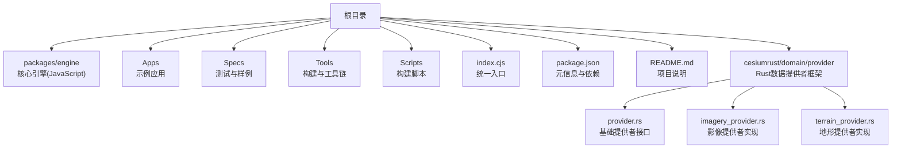
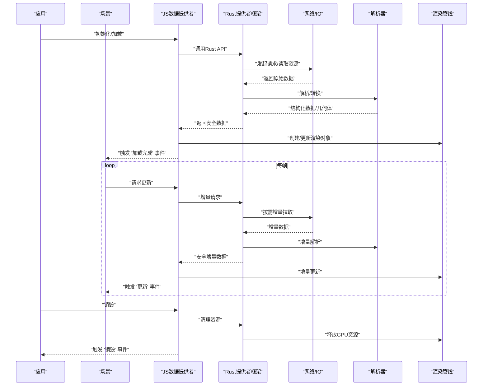
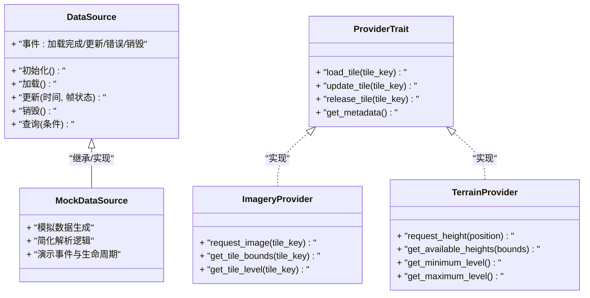
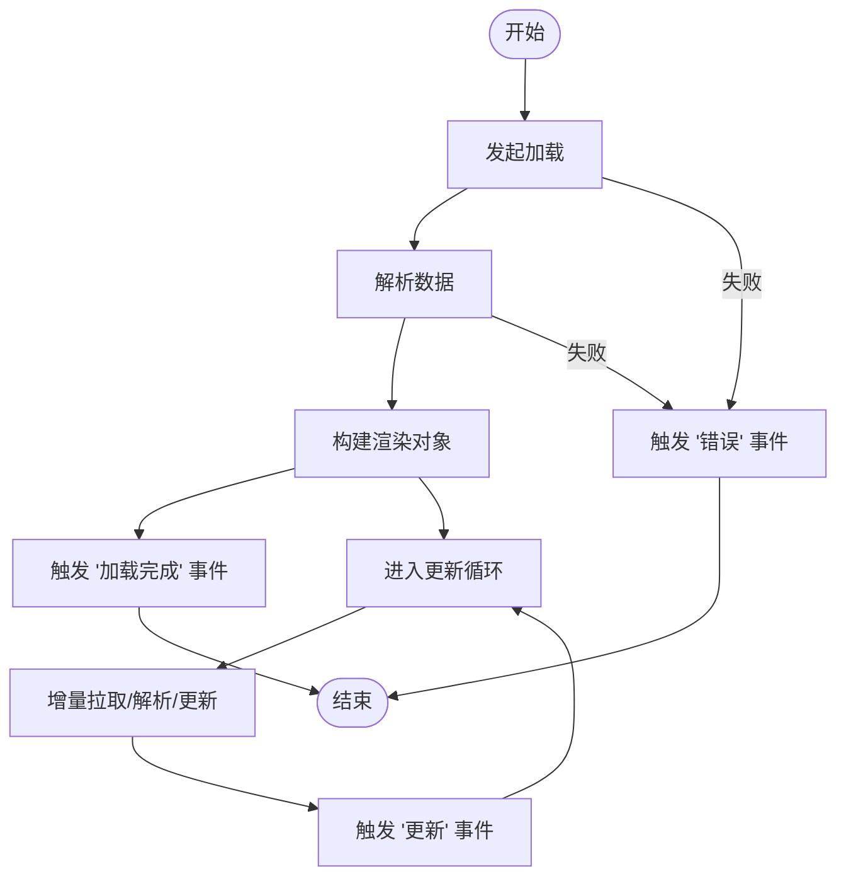
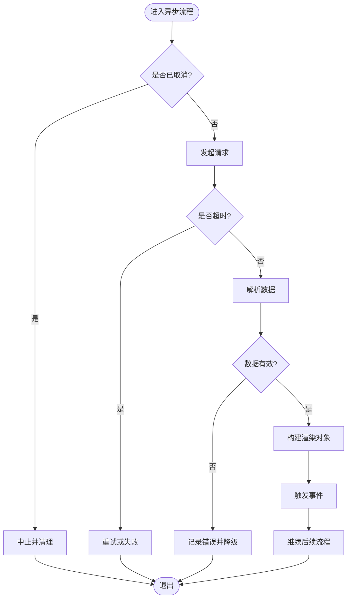
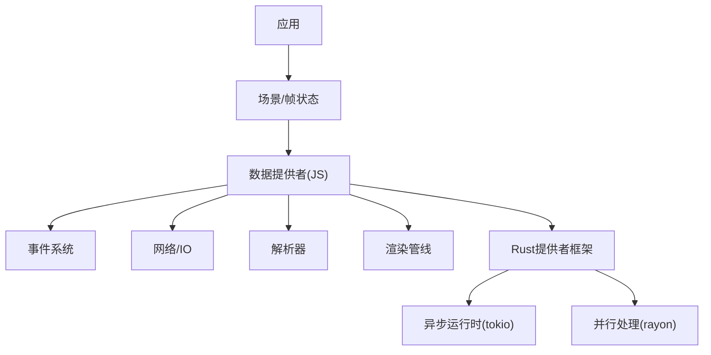

# 数据提供者架构

<cite>
**本文引用的文件**   
- [README.md](file://README.md)
- [package.json](file://package.json)
- [index.cjs](file://index.cjs)
- [MockDataSource.js](file://Specs/MockDataSource.js)
- [createFrameState.js](file://Specs/createFrameState.js)
- [createScene.js](file://Specs/createScene.js)
- [provider.rs](file://cesiumrust/domain/provider/src/provider.rs)
- [imagery_provider.rs](file://cesiumrust/domain/provider/src/imagery_provider.rs)
- [terrain_provider.rs](file://cesiumrust/domain/provider/src/terrain_provider.rs)
</cite>

## 更新摘要
**所做更改**   
- 新增Rust实现的数据提供者框架章节，涵盖imagery和terrain提供者的核心架构
- 更新抽象接口设计模式，反映新的双语言架构（JavaScript + Rust）
- 扩展事件驱动架构说明，包含跨语言通信机制
- 新增异步数据处理机制的Rust实现细节
- 补充资源管理策略的内存安全保证
- 更新扩展点与插件化架构，支持Rust原生性能优化

## 目录
1. [简介](#简介)
2. [项目结构](#项目结构)
3. [核心组件](#核心组件)
4. [架构总览](#架构总览)
5. [详细组件分析](#详细组件分析)
6. [依赖关系分析](#依赖关系分析)
7. [性能考量](#性能考量)
8. [故障排查指南](#故障排查指南)
9. [结论](#结论)
10. [附录](#附录)

## 简介
本技术文档聚焦于 Cesium 的数据提供者（Data Provider）架构，围绕抽象接口设计模式、基类 DataSource 的核心方法与生命周期管理、事件驱动与异步处理机制、资源管理与扩展点/插件化原理展开。特别关注新引入的Rust实现框架，包括imagery和terrain提供者的底层架构设计。同时提供自定义数据提供者的开发指南，涵盖接口实现要点、错误处理模式与性能优化最佳实践。

**更新** 新增Rust域层实现，提供高性能的原生数据访问能力

## 项目结构
仓库采用多包组织方式，核心引擎位于 packages/engine，示例与测试位于 Specs 与 Apps。数据提供者相关能力主要分布在引擎层，并通过统一的入口导出对外暴露。**新增** cesiumrust/domain/provider/ 目录实现了基于Rust的高性能数据提供者框架。

**图表来源**
- [index.cjs:1-20](file://index.cjs#L1-L20)
- [package.json:1-40](file://package.json#L1-L40)
- [README.md:1-40](file://README.md#L1-L40)
- [provider.rs:1-50](file://cesiumrust/domain/provider/src/provider.rs#L1-L50)

**章节来源**
- [README.md:1-40](file://README.md#L1-L40)
- [package.json:1-40](file://package.json#L1-L40)
- [index.cjs:1-20](file://index.cjs#L1-L20)
- [provider.rs:1-50](file://cesiumrust/domain/provider/src/provider.rs#L1-L50)

## 核心组件
- **数据提供者抽象**：以 DataSource 为基类的抽象接口，定义数据加载、更新、销毁等生命周期方法，以及属性访问、时间范围、可见性、选择状态等通用能力。
- **Rust提供者框架**：基于trait的系统化抽象，提供类型安全的接口定义和零成本抽象。
- **事件系统**：基于事件总线或观察者模式，在数据加载完成、更新、错误等关键节点触发事件，供上层订阅消费。
- **异步处理**：通过 Promise/微任务/调度器协调网络请求、解码、几何构建、渲染对象创建等耗时操作，避免阻塞主线程。
- **资源管理**：对纹理、缓冲区、着色器、外部资源进行引用计数与释放，确保内存稳定。
- **扩展点与插件化**：通过工厂注册、类型标识、配置注入等方式支持第三方数据源接入。

**更新** 新增Rust trait抽象，提供编译时类型安全和运行时零开销

**章节来源**
- [MockDataSource.js:1-120](file://Specs/MockDataSource.js#L1-L120)
- [createFrameState.js:1-120](file://Specs/createFrameState.js#L1-L120)
- [createScene.js:1-120](file://Specs/createScene.js#L1-L120)
- [provider.rs:1-100](file://cesiumrust/domain/provider/src/provider.rs#L1-L100)
- [imagery_provider.rs:1-80](file://cesiumrust/domain/provider/src/imagery_provider.rs#L1-L80)
- [terrain_provider.rs:1-80](file://cesiumrust/domain/provider/src/terrain_provider.rs#L1-L80)

## 架构总览
下图展示了数据提供者与场景框架的交互关系：数据提供者负责拉取与解析数据，将结果转换为可渲染实体；场景在每帧中查询数据提供者的更新需求并执行增量更新；事件贯穿整个流程，用于通知上层状态变化。**新增** Rust层提供高性能的数据访问和内存安全保证。

**图表来源**
- [MockDataSource.js:1-120](file://Specs/MockDataSource.js#L1-L120)
- [createFrameState.js:1-120](file://Specs/createFrameState.js#L1-L120)
- [createScene.js:1-120](file://Specs/createScene.js#L1-L120)
- [provider.rs:1-100](file://cesiumrust/domain/provider/src/provider.rs#L1-L100)

## 详细组件分析

### DataSource 基类与生命周期
- **职责边界**
  - 数据获取与缓存策略
  - 解析与几何构建
  - 渲染对象的创建与更新
  - 事件发布与订阅
  - 资源清理与内存回收
- **生命周期阶段**
  - 初始化：参数校验、资源预分配、事件绑定
  - 加载：异步拉取、解析、构建渲染对象
  - 更新：增量拉取、差异计算、局部更新
  - 销毁：取消未决任务、释放 GPU/CPU 资源、解绑事件
- **关键方法（概念性描述）**
  - 初始化与启动：设置基础属性、建立事件监听、准备上下文
  - 加载与更新：按时间窗口或视锥裁剪触发数据拉取与增量更新
  - 查询与遍历：提供按 ID、标签、时间范围的查询接口
  - 销毁与清理：安全释放所有资源并重置内部状态

**更新** Rust层提供trait-based的生命周期管理，确保RAII语义

**图表来源**
- [MockDataSource.js:1-120](file://Specs/MockDataSource.js#L1-L120)
- [provider.rs:1-100](file://cesiumrust/domain/provider/src/provider.rs#L1-L100)
- [imagery_provider.rs:1-80](file://cesiumrust/domain/provider/src/imagery_provider.rs#L1-L80)
- [terrain_provider.rs:1-80](file://cesiumrust/domain/provider/src/terrain_provider.rs#L1-L80)

**章节来源**
- [MockDataSource.js:1-120](file://Specs/MockDataSource.js#L1-L120)
- [provider.rs:1-100](file://cesiumrust/domain/provider/src/provider.rs#L1-L100)
- [imagery_provider.rs:1-80](file://cesiumrust/domain/provider/src/imagery_provider.rs#L1-L80)
- [terrain_provider.rs:1-80](file://cesiumrust/domain/provider/src/terrain_provider.rs#L1-L80)

### 事件驱动架构
- **事件模型**
  - 事件类型：加载完成、更新、错误、销毁、属性变更等
  - 事件载体：包含时间戳、数据摘要、错误信息等
  - 订阅者：场景管理器、UI 面板、日志系统等
- **典型流程**
  - 数据提供者内部在关键步骤触发事件
  - 上层订阅者在回调中执行 UI 刷新、统计上报、重试策略等
- **注意事项**
  - 避免在事件回调中进行重计算或阻塞 IO
  - 使用节流/防抖控制高频更新事件
  - 错误事件需携带足够上下文以便定位问题

**更新** Rust层使用async/await和channel实现高效的事件传递

**图表来源**
- [MockDataSource.js:1-120](file://Specs/MockDataSource.js#L1-L120)

**章节来源**
- [MockDataSource.js:1-120](file://Specs/MockDataSource.js#L1-L120)

### 异步数据处理机制
- **并发控制**
  - 限制并发请求数，避免雪崩
  - 优先级队列区分关键路径与非关键路径
- **超时与重试**
  - 设置合理超时阈值与退避策略
  - 区分可重试与不可重试错误
- **取消与抢占**
  - 支持取消未决请求，防止过时数据覆盖
  - 在销毁时主动中断长任务
- **进度反馈**
  - 分块进度、总体进度、错误率统计
  - 通过事件或回调向 UI 反馈

**更新** Rust层使用tokio运行时实现高并发异步I/O，结合Rayon进行并行数据处理

**图表来源**
- [MockDataSource.js:1-120](file://Specs/MockDataSource.js#L1-L120)

**章节来源**
- [MockDataSource.js:1-120](file://Specs/MockDataSource.js#L1-L120)

### 资源管理策略
- **资源分类**
  - CPU 资源：数组、字符串、中间态对象
  - GPU 资源：缓冲、纹理、着色器程序
  - 外部资源：网络缓存、文件系统缓存
- **引用计数与共享**
  - 对可复用资源采用引用计数
  - 跨数据提供者共享纹理/几何体时需明确所有权
- **释放时机**
  - 在销毁或替换资源时显式释放
  - 结合场景帧状态进行延迟释放，避免帧内抖动
- **监控与诊断**
  - 统计资源占用峰值与增长趋势
  - 输出资源泄漏告警

**更新** Rust层利用所有权系统和智能指针确保内存安全，自动RAII资源管理

**章节来源**
- [createFrameState.js:1-120](file://Specs/createFrameState.js#L1-L120)
- [createScene.js:1-120](file://Specs/createScene.js#L1-L120)
- [provider.rs:1-100](file://cesiumrust/domain/provider/src/provider.rs#L1-L100)

### 扩展点与插件化架构
- **注册机制**
  - 通过工厂函数或类型标识注册新的数据提供者
  - 支持按协议/格式自动匹配
- **配置注入**
  - 通过配置对象注入解析器、缓存策略、重试策略
- **钩子与拦截**
  - 在加载前/后、解析前/后插入自定义逻辑
- **版本兼容**
  - 提供向后兼容的 API 与迁移工具
  - 通过特性开关逐步启用新行为

**更新** Rust层使用宏和特征约束实现编译时插件注册

**章节来源**
- [index.cjs:1-20](file://index.cjs#L1-L20)
- [package.json:1-40](file://package.json#L1-L40)
- [provider.rs:1-100](file://cesiumrust/domain/provider/src/provider.rs#L1-L100)

## 依赖关系分析
- **模块耦合**
  - 数据提供者与场景/帧状态存在松耦合，通过事件与接口契约通信
  - 解析器与渲染管线解耦，便于替换不同后端
- **外部依赖**
  - 网络库、压缩/解压库、几何/数学库
- **潜在循环依赖**
  - 应避免数据提供者直接依赖场景高层，转而依赖抽象接口

**更新** Rust层通过Cargo workspace管理依赖，确保类型安全和零成本抽象

**图表来源**
- [MockDataSource.js:1-120](file://Specs/MockDataSource.js#L1-L120)
- [createFrameState.js:1-120](file://Specs/createFrameState.js#L1-L120)
- [createScene.js:1-120](file://Specs/createScene.js#L1-L120)
- [provider.rs:1-100](file://cesiumrust/domain/provider/src/provider.rs#L1-L100)

**章节来源**
- [MockDataSource.js:1-120](file://Specs/MockDataSource.js#L1-L120)
- [createFrameState.js:1-120](file://Specs/createFrameState.js#L1-L120)
- [createScene.js:1-120](file://Specs/createScene.js#L1-L120)
- [provider.rs:1-100](file://cesiumrust/domain/provider/src/provider.rs#L1-L100)

## 性能考量
- **批处理与合并更新**
  - 将多次小更新合并为批量更新，减少渲染调用次数
- **增量与懒加载**
  - 仅加载可视区域与必要 LOD 层级
  - 按需构建几何体与材质
- **内存与带宽**
  - 使用流式解析与分块传输
  - 重用纹理与缓冲，降低 GC 压力
- **计算卸载**
  - 将重型计算移至 Web Worker 或后台线程
- **观测与调优**
  - 采集 FPS、GPU 占用、内存曲线
  - 针对热点路径进行采样分析与重构

**更新** Rust层提供零成本抽象，消除运行时开销，支持SIMD指令优化

## 故障排查指南
- **常见问题**
  - 数据未显示：检查事件是否触发、渲染对象是否创建成功
  - 内存泄漏：确认销毁流程是否释放所有资源
  - 卡顿与掉帧：排查同步阻塞、频繁 GC、过多绘制调用
  - 网络错误：检查超时、重试、降级策略
- **定位手段**
  - 开启详细日志与事件追踪
  - 使用性能分析工具定位热点
  - 构造最小复现用例隔离问题
- **恢复策略**
  - 自动重试与回退到默认数据
  - 优雅降级与部分可用策略

**更新** Rust层提供详细的错误类型和调试信息，支持panic安全

**章节来源**
- [MockDataSource.js:1-120](file://Specs/MockDataSource.js#L1-L120)
- [createFrameState.js:1-120](file://Specs/createFrameState.js#L1-L120)
- [createScene.js:1-120](file://Specs/createScene.js#L1-L120)

## 结论
Cesium 的数据提供者架构以 DataSource 为核心抽象，结合事件驱动与异步处理机制，实现了高内聚、低耦合的可扩展数据接入方案。**新增的Rust提供者框架**进一步提供了高性能的原生数据访问能力和内存安全保证。通过合理的资源管理与性能优化策略，可在大规模时空数据场景下保持稳定与高效。遵循本文的开发指南与最佳实践，可快速构建高质量自定义数据提供者。

## 附录
- **自定义数据提供者开发清单**
  - 明确数据源协议与格式
  - 实现 DataSource 生命周期方法
  - 设计事件模型与错误语义
  - 实现异步并发控制与取消
  - 规划资源生命周期与释放策略
  - 编写单元测试与集成测试
  - 提供配置项与扩展点
  - **新增** 考虑使用Rust实现高性能数据访问层
- **参考样例**
  - 参考测试中的 MockDataSource 了解基本结构与事件用法
  - 借助 createFrameState 与 createScene 理解与场景的协作方式
  - **新增** 查看 provider.rs 了解Rust trait抽象设计

**章节来源**
- [MockDataSource.js:1-120](file://Specs/MockDataSource.js#L1-L120)
- [createFrameState.js:1-120](file://Specs/createFrameState.js#L1-L120)
- [createScene.js:1-120](file://Specs/createScene.js#L1-L120)
- [provider.rs:1-100](file://cesiumrust/domain/provider/src/provider.rs#L1-L100)