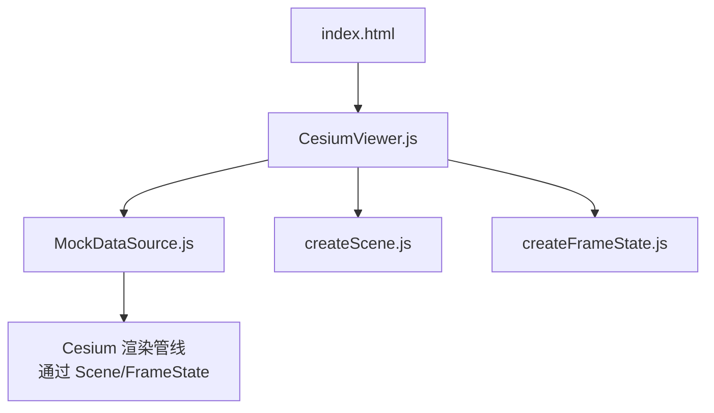
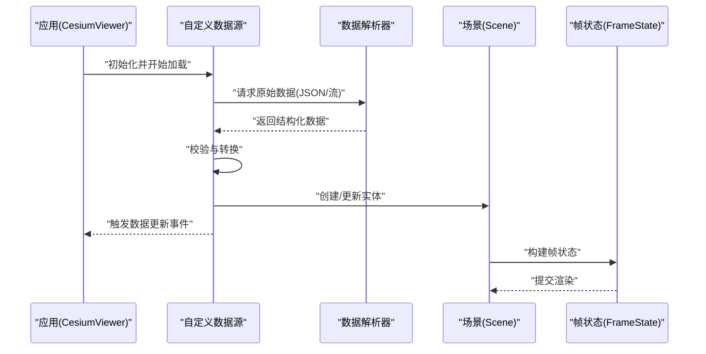
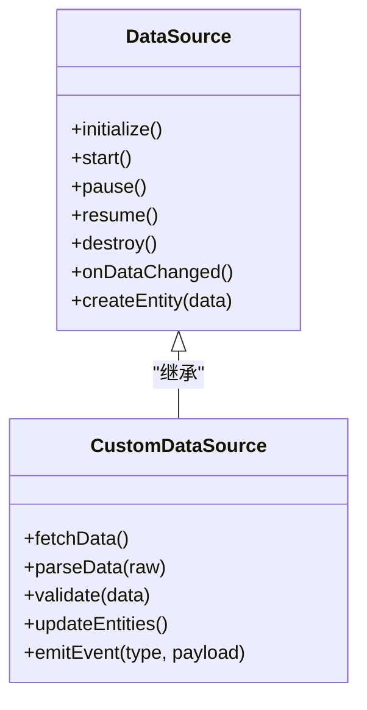
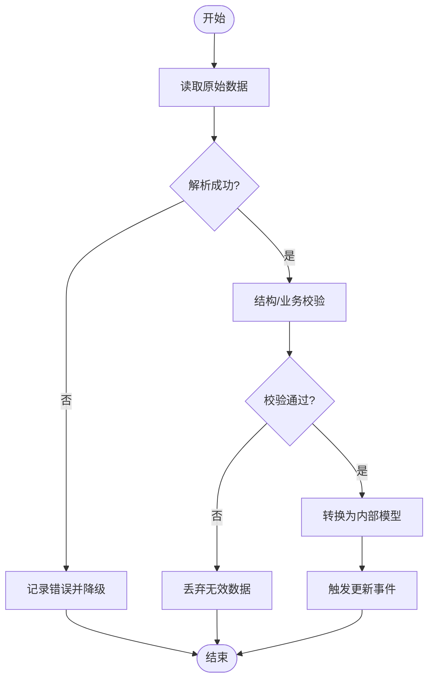
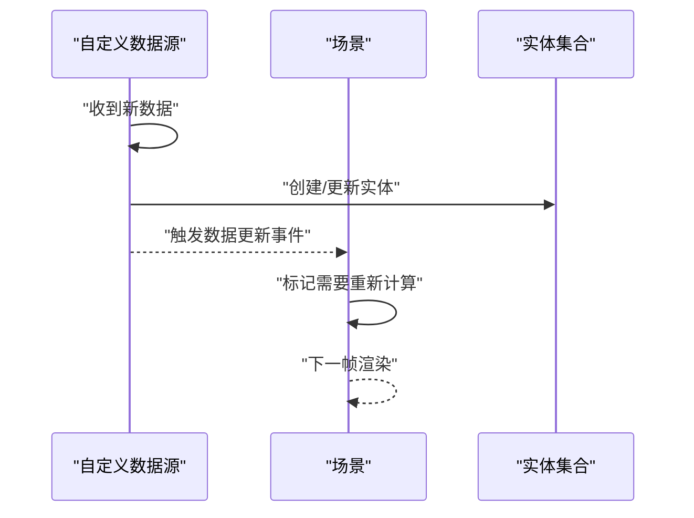
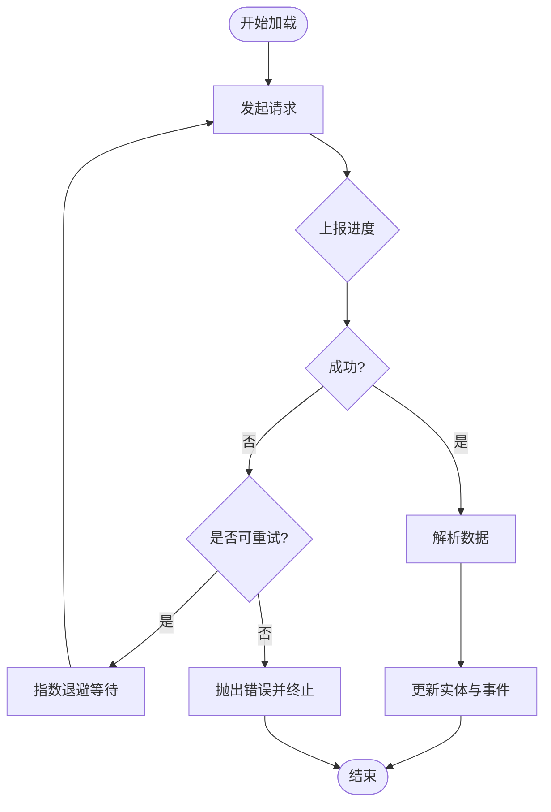
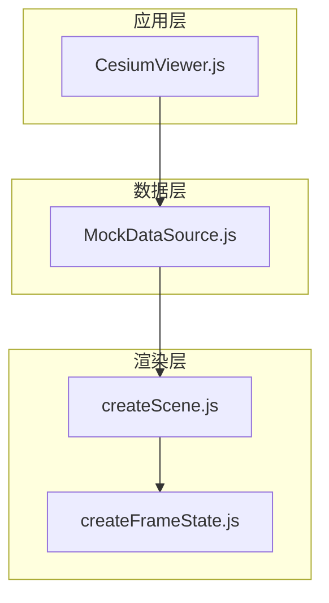

# 自定义数据提供者

<cite>
**本文引用的文件**   
- [MockDataSource.js](file://Specs/MockDataSource.js)
- [createFrameState.js](file://Specs/createFrameState.js)
- [createScene.js](file://Specs/createScene.js)
- [CesiumViewer.js](file://Apps/CesiumViewer/CesiumViewer.js)
- [index.html](file://index.html)
</cite>

## 目录
1. [简介](#简介)
2. [项目结构](#项目结构)
3. [核心组件](#核心组件)
4. [架构总览](#架构总览)
5. [详细组件分析](#详细组件分析)
6. [依赖关系分析](#依赖关系分析)
7. [性能考虑](#性能考虑)
8. [故障排查指南](#故障排查指南)
9. [结论](#结论)
10. [附录](#附录) 

## 简介
本指南面向希望基于 Cesium 扩展数据加载能力的开发者，系统讲解如何继承 DataSource 基类实现自定义数据源。内容覆盖：
- 数据解析、实体创建与事件通知机制
- 异步数据加载的最佳实践（进度跟踪、错误重试、取消操作）
- 数据格式转换与验证的实现方法
- 从简单 JSON 到复杂实时数据流的完整示例思路
- 性能优化技巧（批处理、增量更新、内存泄漏防护）

本仓库提供了用于测试与参考的 MockDataSource 以及场景/帧状态构造工具，可作为理解与扩展 DataSource 行为的切入点。

## 项目结构
与“自定义数据提供者”主题直接相关的代码主要位于 Specs 与 Apps 目录中：
- Specs/MockDataSource.js：一个可复用的模拟数据源实现，便于在测试中注入数据并观察渲染行为
- Specs/createFrameState.js / createScene.js：构建测试所需的帧状态与场景对象，帮助验证数据源对渲染管线的影响
- Apps/CesiumViewer/CesiumViewer.js：应用入口逻辑，演示如何在应用中集成数据源
- index.html：页面入口，承载应用初始化流程

**图表来源** 
- [index.html](file://index.html)
- [CesiumViewer.js](file://Apps/CesiumViewer/CesiumViewer.js)
- [MockDataSource.js](file://Specs/MockDataSource.js)
- [createScene.js](file://Specs/createScene.js)
- [createFrameState.js](file://Specs/createFrameState.js)

**章节来源**
- [MockDataSource.js](file://Specs/MockDataSource.js)
- [createFrameState.js](file://Specs/createFrameState.js)
- [createScene.js](file://Specs/createScene.js)
- [CesiumViewer.js](file://Apps/CesiumViewer/CesiumViewer.js)
- [index.html](file://index.html)

## 核心组件
- DataSource 基类：定义数据源的统一接口，包括生命周期管理、数据变更事件、实体集合管理等。自定义数据源应继承该类，实现关键方法与事件回调。
- MockDataSource：在 Specs 中提供的一个最小化数据源实现，用于演示如何向场景添加/更新实体、触发事件，以及与帧状态交互。
- Scene/FrameState：渲染上下文与帧状态对象，数据源通过它们将实体纳入渲染管线。

要点：
- 数据源的生命周期通常包含初始化、开始、暂停、恢复、销毁等阶段
- 数据变更通过事件通知（如数据更新、实体增删），由上层订阅并驱动渲染
- 实体创建需遵循 Cesium 的数据模型规范，确保几何、属性、时间动态等正确映射

**章节来源**
- [MockDataSource.js](file://Specs/MockDataSource.js)
- [createFrameState.js](file://Specs/createFrameState.js)
- [createScene.js](file://Specs/createScene.js)

## 架构总览
下图展示了自定义数据源在 Cesium 中的位置与交互关系：应用层通过 Viewer/App 初始化数据源，数据源负责拉取/解析数据、创建实体，并通过事件通知框架进行增量更新；渲染管线基于 Scene/FrameState 将实体绘制到屏幕。

**图表来源** 
- [CesiumViewer.js](file://Apps/CesiumViewer/CesiumViewer.js)
- [MockDataSource.js](file://Specs/MockDataSource.js)
- [createScene.js](file://Specs/createScene.js)
- [createFrameState.js](file://Specs/createFrameState.js)

## 详细组件分析

### 自定义数据源实现要点
- 继承 DataSource 基类，实现以下职责：
  - 数据获取：支持 HTTP、WebSocket、轮询或流式读取
  - 数据解析：将原始字节/文本转换为内部数据结构
  - 实体创建：根据解析结果创建 Cesium 实体，设置几何、材质、属性、时间动态等
  - 事件通知：在数据变化时发出更新事件，驱动增量渲染
  - 生命周期：正确处理 start/pause/resume/destroy，避免资源泄露
- 使用 MockDataSource 作为参考，观察其如何与 Scene/FrameState 协作，以及如何触发事件以更新渲染

**图表来源** 
- [MockDataSource.js](file://Specs/MockDataSource.js)

**章节来源**
- [MockDataSource.js](file://Specs/MockDataSource.js)

### 数据解析与验证
- 解析策略：
  - JSON：使用标准解析器，结合 schema 校验字段类型与必填项
  - 二进制/流：分块解码，边读边转，降低内存峰值
- 验证策略：
  - 结构校验：确保必要字段存在且类型正确
  - 业务校验：坐标范围、时间戳顺序、几何有效性等
- 错误处理：
  - 捕获解析异常，记录日志并降级为可用子集
  - 对不可用数据进行隔离，避免污染整体数据集

**图表来源** 
- [MockDataSource.js](file://Specs/MockDataSource.js)

**章节来源**
- [MockDataSource.js](file://Specs/MockDataSource.js)

### 实体创建与事件通知
- 实体创建：
  - 根据解析后的数据生成 Cesium 实体，设置位置、几何、材质、属性等
  - 对于时间动态数据，绑定时间轴与插值策略
- 事件通知：
  - 在数据变更后调用数据源的事件接口，通知上层进行增量更新
  - 区分新增、修改、删除三类事件，减少不必要的重绘

**图表来源** 
- [MockDataSource.js](file://Specs/MockDataSource.js)
- [createScene.js](file://Specs/createScene.js)

**章节来源**
- [MockDataSource.js](file://Specs/MockDataSource.js)
- [createScene.js](file://Specs/createScene.js)

### 异步数据加载最佳实践
- 进度跟踪：
  - 暴露 progress 事件，上报已加载字节数、总字节数或批次完成比例
  - 前端 UI 展示进度条或加载指示器
- 错误重试：
  - 对网络错误实施指数退避重试，限制最大重试次数
  - 区分可重试与不可重试错误，及时失败快速反馈
- 取消操作：
  - 支持 AbortController 或自定义取消信号，在用户切换或页面卸载时中断请求
  - 清理未完成的 I/O 与定时器，防止内存泄漏

**图表来源** 
- [MockDataSource.js](file://Specs/MockDataSource.js)

**章节来源**
- [MockDataSource.js](file://Specs/MockDataSource.js)

### 完整开发示例思路
- 简单 JSON 数据源：
  - 从静态 JSON 文件读取点/线/面数据，解析后批量创建实体
  - 适用于离线数据或一次性加载的场景
- 复杂实时数据流：
  - 使用 WebSocket/SSE 接收实时数据，按批次增量更新实体
  - 结合时间轴实现动画效果，注意节流与去抖
- 混合模式：
  - 初始加载缓存数据，后续通过增量流更新，提升首屏性能

[本节为概念性说明，不直接分析具体文件]

## 依赖关系分析
自定义数据源与 Cesium 渲染管线的依赖关系如下：
- 数据源依赖 Scene/FrameState 进行实体管理与渲染提交
- 应用层依赖数据源的事件接口进行 UI 更新与状态同步
- 测试环境通过 createScene/createFrameState 构造最小运行环境

**图表来源** 
- [CesiumViewer.js](file://Apps/CesiumViewer/CesiumViewer.js)
- [MockDataSource.js](file://Specs/MockDataSource.js)
- [createScene.js](file://Specs/createScene.js)
- [createFrameState.js](file://Specs/createFrameState.js)

**章节来源**
- [CesiumViewer.js](file://Apps/CesiumViewer/CesiumViewer.js)
- [MockDataSource.js](file://Specs/MockDataSource.js)
- [createScene.js](file://Specs/createScene.js)
- [createFrameState.js](file://Specs/createFrameState.js)

## 性能考虑
- 数据批处理：
  - 将多条数据合并为一批次更新，减少事件触发与渲染开销
  - 对高频数据流采用节流策略，控制更新频率
- 增量更新：
  - 仅更新变化的实体与属性，避免全量重建
  - 使用差异算法识别新增、修改、删除，精准推送
- 内存泄漏防护：
  - 在 destroy 中释放所有引用，断开事件监听
  - 避免闭包持有大对象，及时清空临时数组与缓冲区
- 网络优化：
  - 启用压缩与缓存策略，减少重复请求
  - 合理分片与并行下载，提高吞吐

[本节为通用指导，不直接分析具体文件]

## 故障排查指南
- 常见问题：
  - 数据解析失败：检查字段类型与必填项，输出详细错误日志
  - 实体未渲染：确认实体已添加到场景，且可见性与层级正确
  - 内存增长：排查未释放的监听器与大对象引用
- 调试建议：
  - 使用浏览器开发者工具监控网络与内存占用
  - 在数据源中插入日志，追踪事件触发与实体生命周期

**章节来源**
- [MockDataSource.js](file://Specs/MockDataSource.js)

## 结论
通过继承 DataSource 基类并结合 MockDataSource 的参考实现，开发者可以构建高效、可靠的自定义数据源。关键在于：
- 清晰的解析与验证流程
- 稳定的事件通知机制
- 完善的异步加载与错误处理
- 严格的性能优化与内存管理

借助本指南的思路与实践，您可以从简单的 JSON 数据源起步，逐步演进到复杂的实时数据流处理，满足多样化业务需求。

[本节为总结性内容，不直接分析具体文件]

## 附录
- 参考文件路径：
  - [MockDataSource.js](file://Specs/MockDataSource.js)
  - [createFrameState.js](file://Specs/createFrameState.js)
  - [createScene.js](file://Specs/createScene.js)
  - [CesiumViewer.js](file://Apps/CesiumViewer/CesiumViewer.js)
  - [index.html](file://index.html)

[本节为索引信息，不直接分析具体文件]