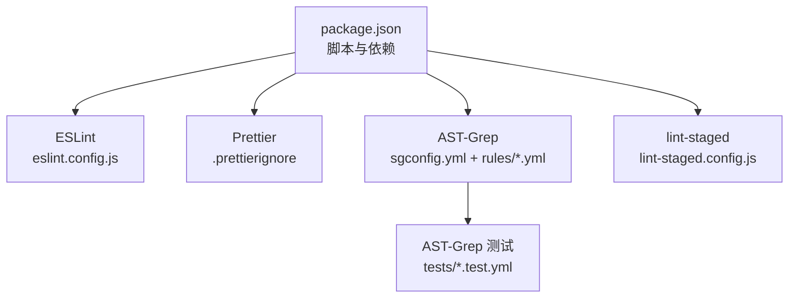
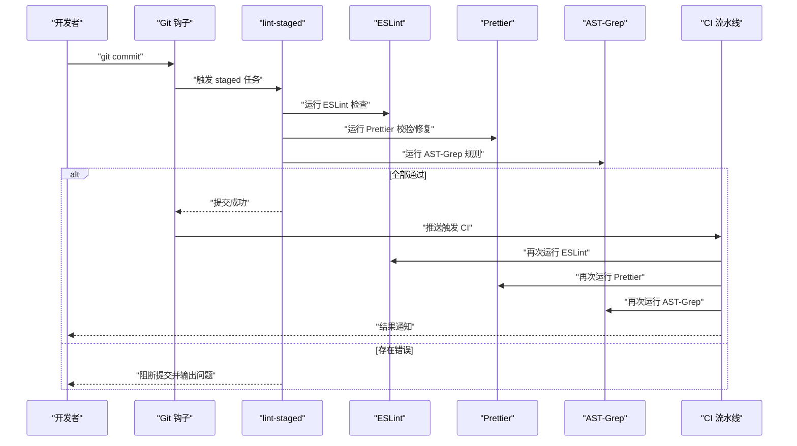
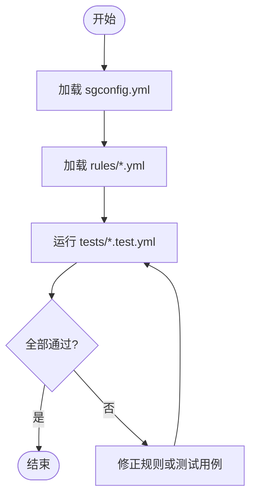
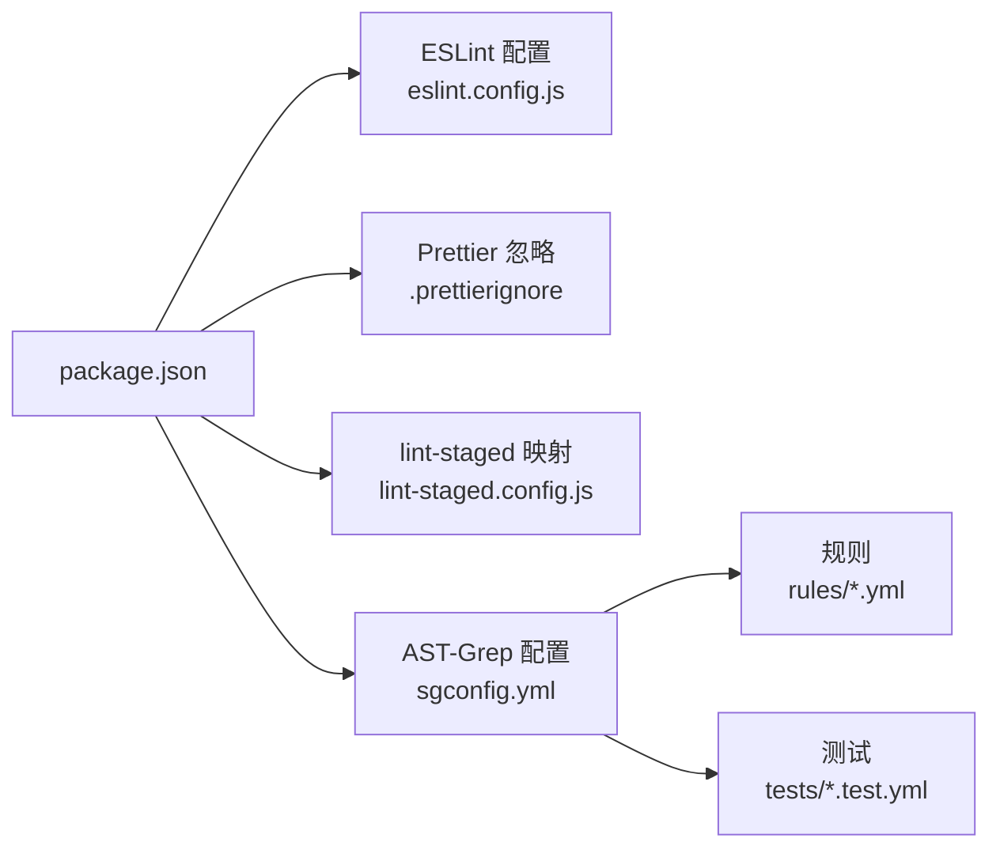

# 代码质量与规范

<cite>
**本文引用的文件**   
- [package.json](file://package.json)
- [eslint.config.js](file://eslint.config.js)
- [.prettierignore](file://.prettierignore)
- [lint-staged.config.js](file://lint-staged.config.js)
- [sgconfig.yml](file://sgconfig.yml)
- [Tools/ast-grep/rules/no-export-object-freeze.yml](file://Tools/ast-grep/rules/no-export-object-freeze.yml)
- [Tools/ast-grep/rules/no-jsdoc-class-declaration-params.yml](file://Tools/ast-grep/rules/no-jsdoc-class-declaration-params.yml)
- [Tools/ast-grep/rules/no-jsdoc-constructor.yml](file://Tools/ast-grep/rules/no-jsdoc-constructor.yml)
- [Tools/ast-grep/rules/no-jsdoc-memberof.yml](file://Tools/ast-grep/rules/no-jsdoc-memberof.yml)
- [Tools/ast-grep/rules/no-package-types-for-local-declarations.yml](file://Tools/ast-grep/rules/no-package-types-for-local-declarations.yml)
- [Tools/ast-grep/rules/no-public-static-fields.yml](file://Tools/ast-grep/rules/no-public-static-fields.yml)
- [Tools/ast-grep/rules/require-jsdoc-memberof.yml](file://Tools/ast-grep/rules/require-jsdoc-memberof.yml)
- [Tools/ast-grep/rules/require-jsdoc-readonly-and-constant.yml](file://Tools/ast-grep/rules/require-jsdoc-readonly-and-constant.yml)
- [Tools/ast-grep/tests/no-export-object-freeze.test.yml](file://Tools/ast-grep/tests/no-export-object-freeze.test.yml)
- [Tools/ast-grep/tests/no-jsdoc-class-declaration-params.test.yml](file://Tools/ast-grep/tests/no-jsdoc-class-declaration-params.test.yml)
- [Tools/ast-grep/tests/no-jsdoc-constructor.test.yml](file://Tools/ast-grep/tests/no-jsdoc-constructor.test.yml)
- [Tools/ast-grep/tests/no-jsdoc-memberof.test.yml](file://Tools/ast-grep/tests/no-jsdoc-memberof.test.yml)
- [Tools/ast-grep/tests/no-package-types-for-local-declarations.test.yml](file://Tools/ast-grep/tests/no-package-types-for-local-declarations.test.yml)
- [Tools/ast-grep/tests/no-public-static-fields.test.yml](file://Tools/ast-grep/tests/no-public-static-fields.test.yml)
- [Tools/ast-grep/tests/require-jsdoc-memberof.test.yml](file://Tools/ast-grep/tests/require-jsdoc-memberof.test.yml)
- [Tools/ast-grep/tests/require-jsdoc-readonly-and-constant.test.yml](file://Tools/ast-grep/tests/require-jsdoc-readonly-and-constant.test.yml)
</cite>

## 目录
1. [简介](#简介)
2. [项目结构](#项目结构)
3. [核心组件](#核心组件)
4. [架构总览](#架构总览)
5. [详细组件分析](#详细组件分析)
6. [依赖分析](#依赖分析)
7. [性能考虑](#性能考虑)
8. [故障排查指南](#故障排查指南)
9. [结论](#结论)
10. [附录](#附录)

## 简介
本文件面向 Cesium 项目的贡献者与维护者，系统化说明代码质量与规范配置，包括：
- ESLint 规则与自定义规则的启用方式
- Prettier 格式化配置与自动格式化工作流
- AST-Grep 静态分析规则与测试方法
- Git 钩子与 lint-staged 集成、提交前检查流程
- 代码审查清单与最佳实践
- 常见问题解决方案与迁移指南

目标是通过一致的规范与自动化检查，提升代码可读性、可维护性与稳定性。

## 项目结构
与代码质量相关的根级配置文件与工具目录如下：
- 根级配置
  - package.json：脚本入口与依赖声明
  - eslint.config.js：ESLint Flat Config 主配置
  - .prettierignore：Prettier 忽略列表
  - sgconfig.yml：AST-Grep 全局配置
  - lint-staged.config.js：lint-staged 任务映射
- AST-Grep 规则与测试
  - Tools/ast-grep/rules/*.yml：规则定义
  - Tools/ast-grep/tests/*.test.yml：规则测试用例

图表来源
- [package.json](file://package.json)
- [eslint.config.js](file://eslint.config.js)
- [.prettierignore](file://.prettierignore)
- [sgconfig.yml](file://sgconfig.yml)
- [lint-staged.config.js](file://lint-staged.config.js)
- [Tools/ast-grep/rules/no-export-object-freeze.yml](file://Tools/ast-grep/rules/no-export-object-freeze.yml)
- [Tools/ast-grep/tests/no-export-object-freeze.test.yml](file://Tools/ast-grep/tests/no-export-object-freeze.test.yml)

章节来源
- [package.json](file://package.json)
- [eslint.config.js](file://eslint.config.js)
- [.prettierignore](file://.prettierignore)
- [sgconfig.yml](file://sgconfig.yml)
- [lint-staged.config.js](file://lint-staged.config.js)

## 核心组件
本节概述各质量工具的职责与协作关系：
- ESLint：语法与风格检查，支持插件与自定义规则
- Prettier：统一代码格式，提供编辑器集成与命令行修复
- AST-Grep：基于 AST 的轻量静态分析，适合团队定制规则与回归测试
- lint-staged：在暂存阶段执行检查，减少无效提交
- Git 钩子：通过 husky（或类似机制）触发 lint-staged

章节来源
- [package.json](file://package.json)
- [eslint.config.js](file://eslint.config.js)
- [.prettierignore](file://.prettierignore)
- [sgconfig.yml](file://sgconfig.yml)
- [lint-staged.config.js](file://lint-staged.config.js)

## 架构总览
下图展示了从开发者提交到 CI 的质量门禁链路，以及本地开发时的自动化工具链。

图表来源
- [package.json](file://package.json)
- [lint-staged.config.js](file://lint-staged.config.js)
- [eslint.config.js](file://eslint.config.js)
- [.prettierignore](file://.prettierignore)
- [sgconfig.yml](file://sgconfig.yml)

## 详细组件分析

### ESLint 规则与自定义规则
- 配置文件位置：eslint.config.js
- 主要职责
  - 启用语言与框架相关规则集
  - 针对 Cesium 项目特性扩展或覆盖默认行为
  - 集成自定义规则（如内部安全策略、API 使用约束等）
- 建议用法
  - 本地开发时配合编辑器实时提示
  - 在 lint-staged 中仅对变更文件进行检查以提升速度
  - 在 CI 中对全量代码进行一致性校验

章节来源
- [eslint.config.js](file://eslint.config.js)
- [package.json](file://package.json)

### Prettier 代码格式化与自动工作流
- 忽略列表：.prettierignore
- 主要职责
  - 统一缩进、引号、分号、换行等格式细节
  - 与编辑器集成实现保存即格式化
  - 在提交前对暂存文件进行修复
- 建议用法
  - 将 Prettier 作为“唯一事实来源”的格式器，避免多格式器冲突
  - 在 IDE 中开启保存时自动格式化
  - 在 CI 中仅做校验，不写入磁盘，保证构建产物稳定

章节来源
- [.prettierignore](file://.prettierignore)
- [package.json](file://package.json)

### AST-Grep 静态分析与测试
- 全局配置：sgconfig.yml
- 规则目录：Tools/ast-grep/rules/*.yml
- 测试用例：Tools/ast-grep/tests/*.test.yml
- 典型规则示例（文件名即主题）
  - no-export-object-freeze.yml：禁止导出被 Object.freeze 的对象
  - no-jsdoc-class-declaration-params.yml：JSDoc 类声明参数规范
  - no-jsdoc-constructor.yml：构造函数 JSDoc 规范
  - no-jsdoc-memberof.yml：成员 JSDoc memberof 使用规范
  - no-package-types-for-local-declarations.yml：本地声明不使用包类型
  - no-public-static-fields.yml：禁止公开静态字段
  - require-jsdoc-memberof.yml：要求成员使用 JSDoc memberof
  - require-jsdoc-readonly-and-constant.yml：只读与常量需标注 JSDoc
- 测试方法
  - 每个规则对应一个 test.yml，包含匹配与不匹配样例
  - 使用 AST-Grep CLI 运行测试，确保规则与预期一致
  - 新增或修改规则后，务必同步更新测试用例

图表来源
- [sgconfig.yml](file://sgconfig.yml)
- [Tools/ast-grep/rules/no-export-object-freeze.yml](file://Tools/ast-grep/rules/no-export-object-freeze.yml)
- [Tools/ast-grep/tests/no-export-object-freeze.test.yml](file://Tools/ast-grep/tests/no-export-object-freeze.test.yml)

章节来源
- [sgconfig.yml](file://sgconfig.yml)
- [Tools/ast-grep/rules/no-export-object-freeze.yml](file://Tools/ast-grep/rules/no-export-object-freeze.yml)
- [Tools/ast-grep/rules/no-jsdoc-class-declaration-params.yml](file://Tools/ast-grep/rules/no-jsdoc-class-declaration-params.yml)
- [Tools/ast-grep/rules/no-jsdoc-constructor.yml](file://Tools/ast-grep/rules/no-jsdoc-constructor.yml)
- [Tools/ast-grep/rules/no-jsdoc-memberof.yml](file://Tools/ast-grep/rules/no-jsdoc-memberof.yml)
- [Tools/ast-grep/rules/no-package-types-for-local-declarations.yml](file://Tools/ast-grep/rules/no-package-types-for-local-declarations.yml)
- [Tools/ast-grep/rules/no-public-static-fields.yml](file://Tools/ast-grep/rules/no-public-static-fields.yml)
- [Tools/ast-grep/rules/require-jsdoc-memberof.yml](file://Tools/ast-grep/rules/require-jsdoc-memberof.yml)
- [Tools/ast-grep/rules/require-jsdoc-readonly-and-constant.yml](file://Tools/ast-grep/rules/require-jsdoc-readonly-and-constant.yml)
- [Tools/ast-grep/tests/no-export-object-freeze.test.yml](file://Tools/ast-grep/tests/no-export-object-freeze.test.yml)
- [Tools/ast-grep/tests/no-jsdoc-class-declaration-params.test.yml](file://Tools/ast-grep/tests/no-jsdoc-class-declaration-params.test.yml)
- [Tools/ast-grep/tests/no-jsdoc-constructor.test.yml](file://Tools/ast-grep/tests/no-jsdoc-constructor.test.yml)
- [Tools/ast-grep/tests/no-jsdoc-memberof.test.yml](file://Tools/ast-grep/tests/no-jsdoc-memberof.test.yml)
- [Tools/ast-grep/tests/no-package-types-for-local-declarations.test.yml](file://Tools/ast-grep/tests/no-package-types-for-local-declarations.test.yml)
- [Tools/ast-grep/tests/no-public-static-fields.test.yml](file://Tools/ast-grep/tests/no-public-static-fields.test.yml)
- [Tools/ast-grep/tests/require-jsdoc-memberof.test.yml](file://Tools/ast-grep/tests/require-jsdoc-memberof.test.yml)
- [Tools/ast-grep/tests/require-jsdoc-readonly-and-constant.test.yml](file://Tools/ast-grep/tests/require-jsdoc-readonly-and-constant.test.yml)

### Git 钩子与 lint-staged 集成
- 任务映射：lint-staged.config.js
- 作用范围：仅对已暂存文件执行检查，缩短反馈时间
- 常见任务
  - 运行 ESLint 检查变更文件
  - 运行 Prettier 修复变更文件
  - 运行 AST-Grep 规则验证变更文件
- 建议
  - 在 IDE 中启用保存时自动修复，减少提交失败率
  - 在 CI 中执行全量检查，确保分支一致性

章节来源
- [lint-staged.config.js](file://lint-staged.config.js)
- [package.json](file://package.json)

### 代码审查清单与最佳实践
- 提交前自检
  - 是否已通过本地 ESLint、Prettier、AST-Grep 检查
  - 是否更新了必要的测试与文档
- 审查要点
  - 逻辑正确性与边界条件
  - 命名与注释清晰可读
  - 是否存在潜在性能问题或内存泄漏风险
  - 是否符合 JSDoc 与 API 设计约定
- 持续改进
  - 将常见问题沉淀为 AST-Grep 规则
  - 定期回顾并优化规则与任务映射

[本节为通用指导，不直接分析具体文件]

## 依赖分析
- 脚本与依赖集中在 package.json，用于编排 ESLint、Prettier、AST-Grep、lint-staged 等工具
- 规则与测试位于 Tools/ast-grep 目录，便于独立演进与回归验证
- 根级配置文件保持最小化，聚焦于“如何组合工具”，而非“工具的具体规则”

图表来源
- [package.json](file://package.json)
- [eslint.config.js](file://eslint.config.js)
- [.prettierignore](file://.prettierignore)
- [lint-staged.config.js](file://lint-staged.config.js)
- [sgconfig.yml](file://sgconfig.yml)
- [Tools/ast-grep/rules/no-export-object-freeze.yml](file://Tools/ast-grep/rules/no-export-object-freeze.yml)
- [Tools/ast-grep/tests/no-export-object-freeze.test.yml](file://Tools/ast-grep/tests/no-export-object-freeze.test.yml)

章节来源
- [package.json](file://package.json)
- [eslint.config.js](file://eslint.config.js)
- [.prettierignore](file://.prettierignore)
- [lint-staged.config.js](file://lint-staged.config.js)
- [sgconfig.yml](file://sgconfig.yml)

## 性能考虑
- 仅在 lint-staged 中检查变更文件，避免全量扫描带来的延迟
- 在 CI 中使用缓存与并行任务，缩短构建时间
- 合理划分规则粒度，将耗时规则放在 CI 侧，本地侧重快速反馈

[本节为通用指导，不直接分析具体文件]

## 故障排查指南
- 提交被阻断
  - 查看 lint-staged 输出的具体错误信息
  - 优先修复 Prettier 与 ESLint 报错，再处理 AST-Grep 规则问题
- 规则误报
  - 检查 AST-Grep 规则与测试用例是否覆盖真实场景
  - 必要时调整规则匹配范围或添加例外
- 编辑器与命令行不一致
  - 确认编辑器使用的 Prettier/ESLint 版本与项目一致
  - 使用项目提供的脚本命令复现问题

章节来源
- [lint-staged.config.js](file://lint-staged.config.js)
- [eslint.config.js](file://eslint.config.js)
- [sgconfig.yml](file://sgconfig.yml)

## 结论
通过将 ESLint、Prettier、AST-Grep 与 lint-staged 有机结合，并在 CI 中重复执行，Cesium 项目在本地与远程均能获得一致、高效的代码质量保障。建议持续完善 AST-Grep 规则库，并将常见问题转化为自动化检查，降低人工审查成本。

[本节为总结性内容，不直接分析具体文件]

## 附录
- 常用命令（以 package.json 脚本为准）
  - 运行 ESLint 检查
  - 运行 Prettier 修复
  - 运行 AST-Grep 规则与测试
  - 通过 lint-staged 执行暂存任务
- 规则与测试维护建议
  - 新增规则必须配套测试用例
  - 规则变更需评估影响面，必要时分批合并

[本节为补充说明，不直接分析具体文件]