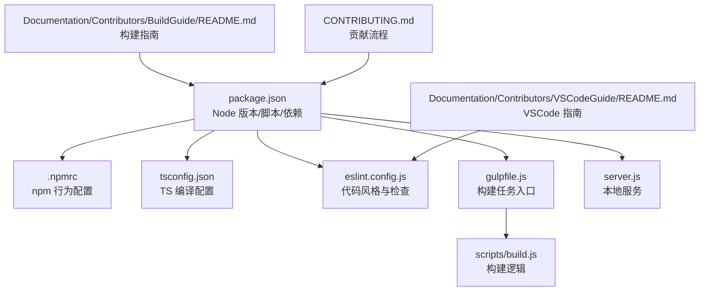
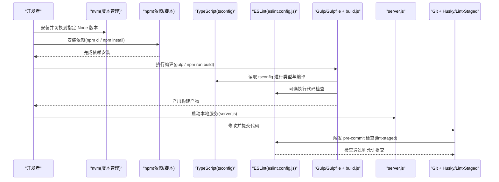
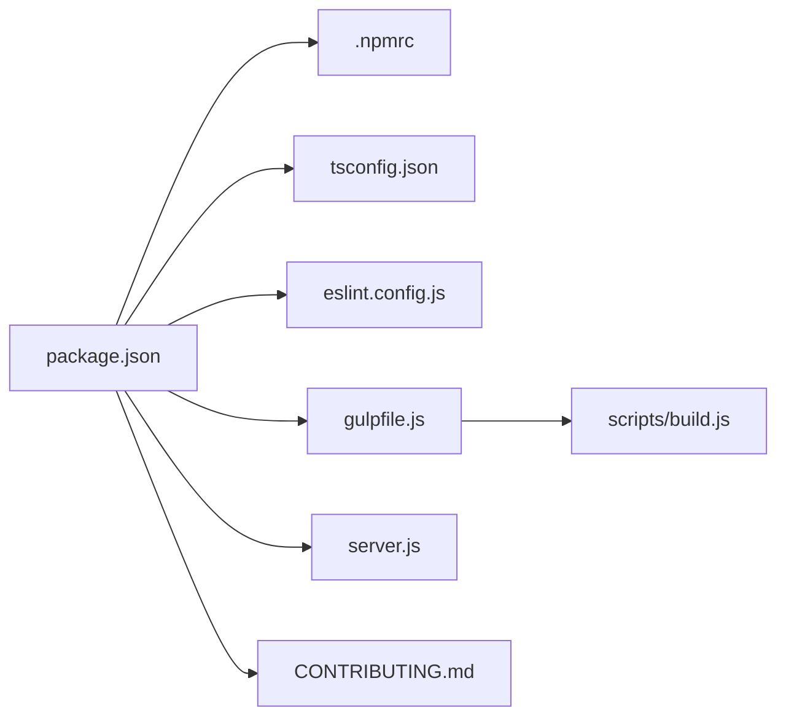

# 开发环境搭建

<cite>
**本文引用的文件**   
- [package.json](file://package.json)
- [.npmrc](file://.npmrc)
- [tsconfig.json](file://tsconfig.json)
- [eslint.config.js](file://eslint.config.js)
- [lint-staged.config.js](file://lint-staged.config.js)
- [gulpfile.js](file://gulpfile.js)
- [scripts/build.js](file://scripts/build.js)
- [server.js](file://server.js)
- [Documentation/Contributors/BuildGuide/README.md](file://Documentation/Contributors/BuildGuide/README.md)
- [Documentation/Contributors/VSCodeGuide/README.md](file://Documentation/Contributors/VSCodeGuide/README.md)
- [CONTRIBUTING.md](file://CONTRIBUTING.md)
</cite>

## 目录
1. [简介](#简介)
2. [项目结构](#项目结构)
3. [核心组件](#核心组件)
4. [架构总览](#架构总览)
5. [详细组件分析](#详细组件分析)
6. [依赖分析](#依赖分析)
7. [性能考虑](#性能考虑)
8. [故障排查指南](#故障排查指南)
9. [结论](#结论)
10. [附录](#附录)

## 简介
本指南面向首次参与 Cesium 前端开发的工程师，目标是帮助你在本地快速、稳定地搭建可构建、可调试、可提交的环境。内容覆盖 Node.js 版本与安装（含 nvm）、npm 依赖管理与镜像缓存优化、TypeScript 编译配置、代码编辑器与 ESLint 集成、Git 工作流（husky 钩子与 pre-commit 检查），以及常见环境问题的定位与解决思路。

## 项目结构
Cesium 仓库采用多包与脚本驱动的工程化组织方式：
- 顶层 package.json 定义 Node 版本要求、脚本命令与依赖；
- .npmrc 管理 npm 行为（如缓存、镜像等）；
- tsconfig.json 提供 TypeScript 编译选项；
- eslint.config.js 统一代码风格与静态检查；
- gulpfile.js 与 scripts/build.js 负责构建流程；
- server.js 提供本地开发服务器；
- Documentation/Contributors 下包含官方构建与 VSCode 使用指南；
- CONTRIBUTING.md 描述贡献流程与规范。

**图示来源**
- [package.json](file://package.json)
- [.npmrc](file://.npmrc)
- [tsconfig.json](file://tsconfig.json)
- [eslint.config.js](file://eslint.config.js)
- [gulpfile.js](file://gulpfile.js)
- [scripts/build.js](file://scripts/build.js)
- [server.js](file://server.js)
- [Documentation/Contributors/BuildGuide/README.md](file://Documentation/Contributors/BuildGuide/README.md)
- [Documentation/Contributors/VSCodeGuide/README.md](file://Documentation/Contributors/VSCodeGuide/README.md)
- [CONTRIBUTING.md](file://CONTRIBUTING.md)

**章节来源**
- [package.json](file://package.json)
- [.npmrc](file://.npmrc)
- [tsconfig.json](file://tsconfig.json)
- [eslint.config.js](file://eslint.config.js)
- [gulpfile.js](file://gulpfile.js)
- [scripts/build.js](file://scripts/build.js)
- [server.js](file://server.js)
- [Documentation/Contributors/BuildGuide/README.md](file://Documentation/Contributors/BuildGuide/README.md)
- [Documentation/Contributors/VSCodeGuide/README.md](file://Documentation/Contributors/VSCodeGuide/README.md)
- [CONTRIBUTING.md](file://CONTRIBUTING.md)

## 核心组件
- Node.js 与版本管理
  - 通过 package.json 的 engines 字段声明所需 Node 版本范围，建议使用 nvm 在本地切换并锁定版本，避免团队差异导致的构建失败。
- npm 依赖与缓存
  - 使用 .npmrc 统一管理缓存路径、网络超时、镜像源等；结合国内镜像加速依赖安装与构建。
- TypeScript 编译
  - 基于 tsconfig.json 控制模块解析、目标平台、输出目录、类型检查严格度等关键项。
- 代码质量与编辑器
  - 使用 eslint.config.js 进行规则配置，配合 VSCode 扩展实现保存时自动修复与错误提示。
- 构建与服务
  - gulpfile.js 作为构建入口，scripts/build.js 承载具体构建步骤；server.js 提供本地预览服务。
- Git 工作流
  - 通过 lint-staged 与 husky 在提交前执行检查，保证代码质量基线。

**章节来源**
- [package.json](file://package.json)
- [.npmrc](file://.npmrc)
- [tsconfig.json](file://tsconfig.json)
- [eslint.config.js](file://eslint.config.js)
- [gulpfile.js](file://gulpfile.js)
- [scripts/build.js](file://scripts/build.js)
- [server.js](file://server.js)
- [CONTRIBUTING.md](file://CONTRIBUTING.md)

## 架构总览
下图展示了从“拉取代码”到“本地运行与提交”的关键环节与工具链关系。

**图示来源**
- [package.json](file://package.json)
- [.npmrc](file://.npmrc)
- [tsconfig.json](file://tsconfig.json)
- [eslint.config.js](file://eslint.config.js)
- [gulpfile.js](file://gulpfile.js)
- [scripts/build.js](file://scripts/build.js)
- [server.js](file://server.js)
- [CONTRIBUTING.md](file://CONTRIBUTING.md)

## 详细组件分析

### Node.js 版本与安装（含 nvm）
- 版本要求
  - 以 package.json 中 engines 字段为准，确保本地 Node 版本满足最低/最高限制。
- 推荐安装方式
  - 使用 nvm 管理多版本 Node，避免系统级污染；在项目根目录创建 .nvmrc 或根据 package.json 的 engines 选择对应版本。
- 验证方式
  - 安装完成后，使用 node -v 与 npm -v 确认版本符合预期。

**章节来源**
- [package.json](file://package.json)

### npm 依赖管理与镜像/缓存优化
- 依赖安装
  - 推荐使用 npm ci 以保证可重复安装；若需增量安装可使用 npm install。
- 镜像源设置
  - 在 .npmrc 中配置 registry 指向国内镜像，提升下载速度。
- 缓存与网络优化
  - 在 .npmrc 中设置 cache 目录、网络超时与重试策略，减少因网络波动导致的失败。
- 环境变量
  - 可通过 npm config set 或 .npmrc 持久化配置，便于团队协作一致。

**章节来源**
- [.npmrc](file://.npmrc)
- [package.json](file://package.json)

### TypeScript 编译环境配置
- 关键配置项
  - target/module：决定输出 JS 目标与模块系统；
  - outDir/rootDir：控制输出与源码根目录；
  - strict：开启严格类型检查；
  - paths/baseUrl：模块别名与解析策略；
  - include/exclude：限定参与编译的文件范围。
- 与构建系统集成
  - gulpfile.js 与 scripts/build.js 会调用 TS 编译器或相关插件，遵循 tsconfig.json 的规则。

**章节来源**
- [tsconfig.json](file://tsconfig.json)
- [gulpfile.js](file://gulpfile.js)
- [scripts/build.js](file://scripts/build.js)

### 代码编辑器与 ESLint 集成
- ESLint 配置
  - 使用 eslint.config.js 集中管理规则、忽略文件与插件；建议开启保存时自动修复。
- VSCode 扩展推荐
  - ESLint、Prettier（可选）、EditorConfig for VS Code、TypeScript 语言支持等。
- 保存时自动修复
  - 在 VSCode 设置中启用“保存时执行 ESLint 修复”，并与 .editorconfig 保持一致。

**章节来源**
- [eslint.config.js](file://eslint.config.js)
- [Documentation/Contributors/VSCodeGuide/README.md](file://Documentation/Contributors/VSCodeGuide/README.md)

### Git 工作流与提交前检查
- Husky 与 lint-staged
  - 在提交前对暂存文件执行 ESLint 与格式化检查，阻止不合规代码进入仓库。
- 配置要点
  - 在 .husky 目录下配置 pre-commit 钩子；在 lint-staged.config.js 中匹配文件模式与执行命令。
- 贡献流程
  - 参考 CONTRIBUTING.md 中的分支模型、PR 模板与审查流程。

**章节来源**
- [lint-staged.config.js](file://lint-staged.config.js)
- [CONTRIBUTING.md](file://CONTRIBUTING.md)

### 构建与服务
- 构建入口
  - gulpfile.js 定义任务与依赖顺序；scripts/build.js 封装核心构建逻辑。
- 本地服务
  - server.js 提供静态资源服务，便于本地预览与调试。
- 文档与示例
  - Documentation/Contributors/BuildGuide/README.md 提供官方构建说明与注意事项。

**章节来源**
- [gulpfile.js](file://gulpfile.js)
- [scripts/build.js](file://scripts/build.js)
- [server.js](file://server.js)
- [Documentation/Contributors/BuildGuide/README.md](file://Documentation/Contributors/BuildGuide/README.md)

## 依赖分析
下图展示主要配置文件之间的依赖关系与职责边界。

**图示来源**
- [package.json](file://package.json)
- [.npmrc](file://.npmrc)
- [tsconfig.json](file://tsconfig.json)
- [eslint.config.js](file://eslint.config.js)
- [gulpfile.js](file://gulpfile.js)
- [scripts/build.js](file://scripts/build.js)
- [server.js](file://server.js)
- [CONTRIBUTING.md](file://CONTRIBUTING.md)

**章节来源**
- [package.json](file://package.json)
- [.npmrc](file://.npmrc)
- [tsconfig.json](file://tsconfig.json)
- [eslint.config.js](file://eslint.config.js)
- [gulpfile.js](file://gulpfile.js)
- [scripts/build.js](file://scripts/build.js)
- [server.js](file://server.js)
- [CONTRIBUTING.md](file://CONTRIBUTING.md)

## 性能考虑
- 依赖安装
  - 优先使用 npm ci 以获得更快且可重复的安装体验；合理设置 .npmrc 的缓存目录与并发参数。
- 构建优化
  - 利用增量构建与并行任务；按需关闭不必要的严格检查以提升速度。
- 本地服务
  - 使用 server.js 提供的轻量服务进行预览，避免额外代理层带来的延迟。

[本节为通用指导，无需特定文件引用]

## 故障排查指南
- Node 版本不匹配
  - 现象：构建报错提示 Node 版本过低/过高。
  - 处理：使用 nvm 安装并切换到 package.json engines 指定的版本。
- 依赖安装缓慢或失败
  - 现象：下载超时、连接中断。
  - 处理：在 .npmrc 中配置国内镜像与缓存目录；必要时调整网络超时与重试策略。
- TypeScript 类型错误或编译失败
  - 现象：大量类型错误或找不到模块。
  - 处理：检查 tsconfig.json 的 target/module/paths 配置；清理构建缓存后重试。
- ESLint 报错无法提交
  - 现象：pre-commit 被拦截。
  - 处理：根据 eslint.config.js 提示修复问题；必要时在 VSCode 中启用保存时自动修复。
- 本地服务无法访问
  - 现象：打开页面空白或端口占用。
  - 处理：确认 server.js 启动成功，释放冲突端口；检查浏览器控制台错误。

**章节来源**
- [package.json](file://package.json)
- [.npmrc](file://.npmrc)
- [tsconfig.json](file://tsconfig.json)
- [eslint.config.js](file://eslint.config.js)
- [server.js](file://server.js)

## 结论
通过统一的 Node 版本管理、稳定的 npm 配置、严格的 TypeScript 与 ESLint 规则、以及完善的 Git 提交流程，Cesium 项目的本地开发体验将具备高一致性与高效率。建议在团队内共享 .npmrc 与编辑器配置，确保所有成员在同一基线上协作。

[本节为总结性内容，无需特定文件引用]

## 附录
- 官方构建指南：Documentation/Contributors/BuildGuide/README.md
- VSCode 使用指南：Documentation/Contributors/VSCodeGuide/README.md
- 贡献流程与规范：CONTRIBUTING.md

**章节来源**
- [Documentation/Contributors/BuildGuide/README.md](file://Documentation/Contributors/BuildGuide/README.md)
- [Documentation/Contributors/VSCodeGuide/README.md](file://Documentation/Contributors/VSCodeGuide/README.md)
- [CONTRIBUTING.md](file://CONTRIBUTING.md)