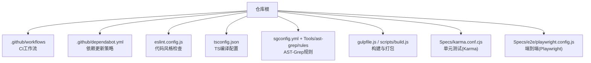
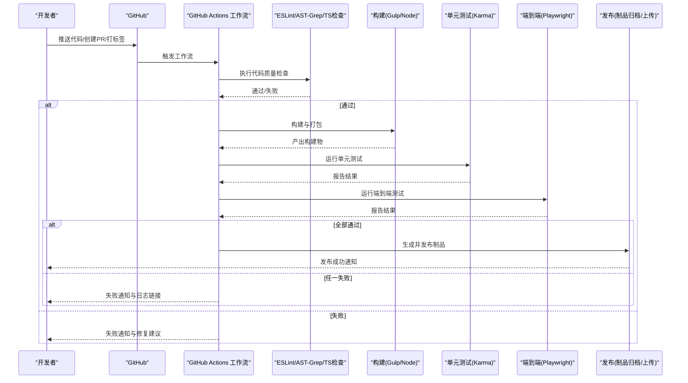
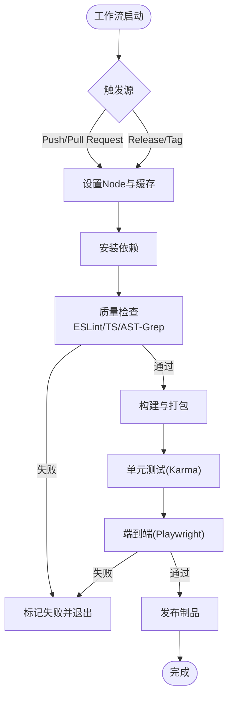
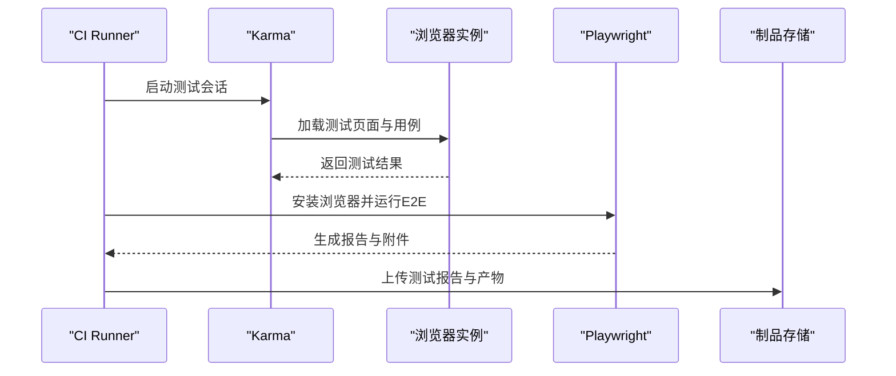
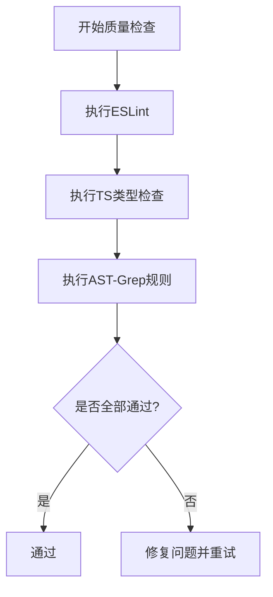
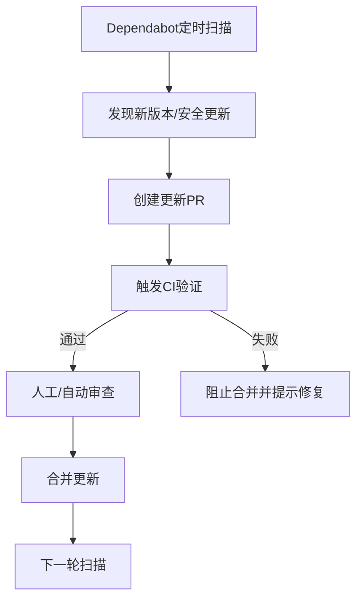
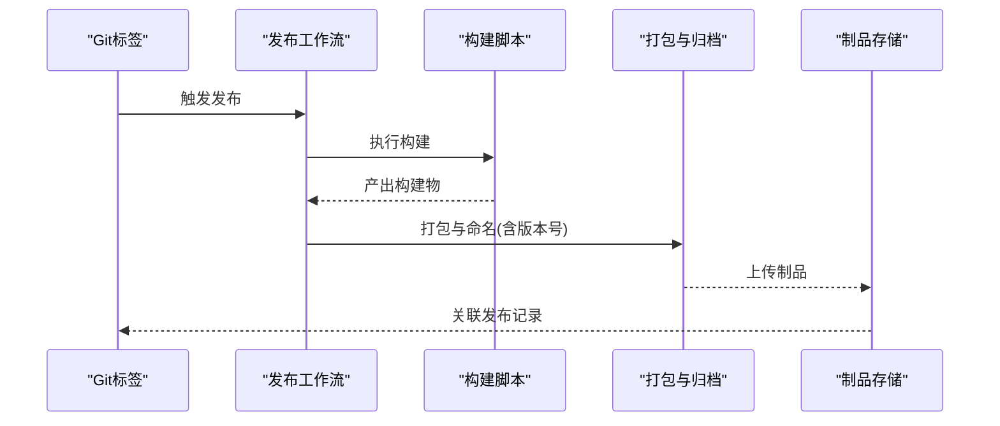
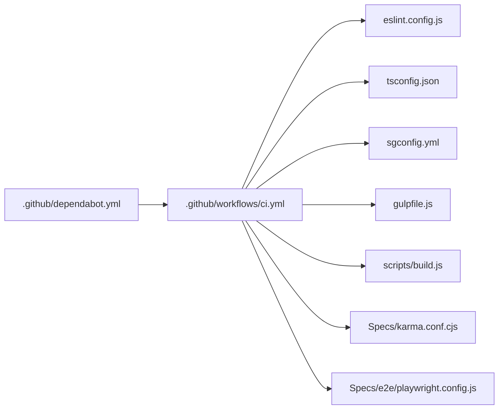

# 持续集成与自动化

<cite>
**本文引用的文件**   
- [package.json](file://package.json)
- [.github/workflows/ci.yml](file://.github/workflows/ci.yml)
- [.github/dependabot.yml](file://.github/dependabot.yml)
- [eslint.config.js](file://eslint.config.js)
- [tsconfig.json](file://tsconfig.json)
- [sgconfig.yml](file://sgconfig.yml)
- [Tools/ast-grep/rules/no-export-object-freeze.yml](file://Tools/ast-grep/rules/no-export-object-freeze.yml)
- [Scripts/build.js](file://scripts/build.js)
- [gulpfile.js](file://gulpfile.js)
- [Specs/karma.conf.cjs](file://Specs/karma.conf.cjs)
- [Specs/e2e/playwright.config.js](file://Specs/e2e/playwright.config.js)
</cite>

## 目录
1. [简介](#简介)
2. [项目结构](#项目结构)
3. [核心组件](#核心组件)
4. [架构总览](#架构总览)
5. [详细组件分析](#详细组件分析)
6. [依赖分析](#依赖分析)
7. [性能考虑](#性能考虑)
8. [故障排除指南](#故障排除指南)
9. [结论](#结论)
10. [附录](#附录)

## 简介
本文件面向Cesium项目的持续集成与自动化，聚焦以下目标：
- GitHub Actions工作流配置与自定义Action的使用说明
- 自动化测试的集成与执行流程（单元测试、集成测试、端到端测试）
- 代码质量检查的自动化流程（ESLint、TypeScript编译检查、AST-Grep规则验证）
- 依赖管理的自动化（Dependabot配置与更新策略）
- 发布流程的自动化（版本号管理与发布产物生成）
- CI/CD管道的监控与故障排除方法

## 项目结构
仓库采用“源码+工具链+测试+CI”的分层组织方式。与CI/CD相关的核心位置如下：
- .github/workflows：GitHub Actions工作流定义
- .github/dependabot.yml：依赖自动更新策略
- eslint.config.js：ESLint规则与任务入口
- tsconfig.json：TypeScript编译配置
- sgconfig.yml：AST-Grep全局配置
- Tools/ast-grep/rules：AST-Grep规则集合
- Scripts/gulpfile.js与scripts/build.js：构建脚本与任务编排
- Specs：Karma（单元测试）与Playwright（E2E）配置与用例

**图表来源**
- [.github/workflows/ci.yml](file://.github/workflows/ci.yml)
- [.github/dependabot.yml](file://.github/dependabot.yml)
- [eslint.config.js](file://eslint.config.js)
- [tsconfig.json](file://tsconfig.json)
- [sgconfig.yml](file://sgconfig.yml)
- [Tools/ast-grep/rules/no-export-object-freeze.yml](file://Tools/ast-grep/rules/no-export-object-freeze.yml)
- [gulpfile.js](file://gulpfile.js)
- [scripts/build.js](file://scripts/build.js)
- [Specs/karma.conf.cjs](file://Specs/karma.conf.cjs)
- [Specs/e2e/playwright.config.js](file://Specs/e2e/playwright.config.js)

**章节来源**
- [.github/workflows/ci.yml](file://.github/workflows/ci.yml)
- [.github/dependabot.yml](file://.github/dependabot.yml)
- [eslint.config.js](file://eslint.config.js)
- [tsconfig.json](file://tsconfig.json)
- [sgconfig.yml](file://sgconfig.yml)
- [gulpfile.js](file://gulpfile.js)
- [scripts/build.js](file://scripts/build.js)
- [Specs/karma.conf.cjs](file://Specs/karma.conf.cjs)
- [Specs/e2e/playwright.config.js](file://Specs/e2e/playwright.config.js)

## 核心组件
本节概述CI/CD管道中的关键构件及其职责：
- 工作流触发器与矩阵：按分支、标签、PR事件触发；可并行运行多节点任务
- 环境准备：Node版本管理、缓存依赖、安装依赖
- 代码质量门禁：ESLint、TypeScript类型检查、AST-Grep规则校验
- 构建与产物：使用Gulp/Node脚本进行构建、打包与压缩
- 测试套件：Karma驱动浏览器内单元测试；Playwright驱动端到端场景
- 依赖治理：Dependabot定期扫描并创建PR
- 发布流水线：基于标签或手动触发，生成版本化产物并上传至发布渠道

**章节来源**
- [package.json](file://package.json)
- [.github/workflows/ci.yml](file://.github/workflows/ci.yml)
- [.github/dependabot.yml](file://.github/dependabot.yml)
- [eslint.config.js](file://eslint.config.js)
- [tsconfig.json](file://tsconfig.json)
- [sgconfig.yml](file://sgconfig.yml)
- [gulpfile.js](file://gulpfile.js)
- [scripts/build.js](file://scripts/build.js)
- [Specs/karma.conf.cjs](file://Specs/karma.conf.cjs)
- [Specs/e2e/playwright.config.js](file://Specs/e2e/playwright.config.js)

## 架构总览
下图展示从提交到发布的端到端流水线，包括质量门禁、构建、测试与发布阶段。

**图表来源**
- [.github/workflows/ci.yml](file://.github/workflows/ci.yml)
- [eslint.config.js](file://eslint.config.js)
- [tsconfig.json](file://tsconfig.json)
- [sgconfig.yml](file://sgconfig.yml)
- [gulpfile.js](file://gulpfile.js)
- [scripts/build.js](file://scripts/build.js)
- [Specs/karma.conf.cjs](file://Specs/karma.conf.cjs)
- [Specs/e2e/playwright.config.js](file://Specs/e2e/playwright.config.js)

## 详细组件分析

### GitHub Actions工作流与自定义Action
- 触发条件：支持push、pull_request、release等事件；可按分支与标签过滤
- 矩阵策略：可在不同Node版本或操作系统上并行执行，提高反馈速度
- 缓存：对npm/yarn缓存目录进行缓存，缩短安装时间
- 步骤编排：顺序执行“准备环境→安装依赖→质量检查→构建→测试→发布”
- 自定义Action：可将重复步骤封装为Reusable Workflow或Composite Action，提升复用性与一致性

**图表来源**
- [.github/workflows/ci.yml](file://.github/workflows/ci.yml)

**章节来源**
- [.github/workflows/ci.yml](file://.github/workflows/ci.yml)

### 自动化测试集成与执行流程
- 单元测试（Karma）
  - 配置文件：Specs/karma.conf.cjs
  - 执行方式：在CI中通过命令调用Karma，加载浏览器环境执行Specs
  - 输出：JUnit/HTML覆盖率报告（视配置而定），便于归档与可视化
- 端到端测试（Playwright）
  - 配置文件：Specs/e2e/playwright.config.js
  - 执行方式：在CI中安装浏览器二进制并运行E2E用例
  - 输出：截图/视频/报告，用于失败定位与回归对比
- 集成测试
  - 可通过Karma或独立脚本承载，结合Mock数据与服务模拟外部依赖

**图表来源**
- [Specs/karma.conf.cjs](file://Specs/karma.conf.cjs)
- [Specs/e2e/playwright.config.js](file://Specs/e2e/playwright.config.js)

**章节来源**
- [Specs/karma.conf.cjs](file://Specs/karma.conf.cjs)
- [Specs/e2e/playwright.config.js](file://Specs/e2e/playwright.config.js)

### 代码质量检查自动化（ESLint、TypeScript、AST-Grep）
- ESLint
  - 入口：eslint.config.js
  - 作用：统一代码风格、检测潜在问题、与编辑器联动
- TypeScript编译检查
  - 入口：tsconfig.json
  - 作用：静态类型检查、路径解析、模块解析策略
- AST-Grep规则验证
  - 全局配置：sgconfig.yml
  - 规则目录：Tools/ast-grep/rules/*.yml
  - 典型规则示例：禁止导出对象冻结、JSDoc约束、公共静态字段限制等

**图表来源**
- [eslint.config.js](file://eslint.config.js)
- [tsconfig.json](file://tsconfig.json)
- [sgconfig.yml](file://sgconfig.yml)
- [Tools/ast-grep/rules/no-export-object-freeze.yml](file://Tools/ast-grep/rules/no-export-object-freeze.yml)

**章节来源**
- [eslint.config.js](file://eslint.config.js)
- [tsconfig.json](file://tsconfig.json)
- [sgconfig.yml](file://sgconfig.yml)
- [Tools/ast-grep/rules/no-export-object-freeze.yml](file://Tools/ast-grep/rules/no-export-object-freeze.yml)

### 依赖管理自动化（Dependabot）
- 配置文件：.github/dependabot.yml
- 功能要点：
  - 定期扫描包管理器依赖（npm/yarn/pnpm等）
  - 自动创建更新PR，支持安全补丁与版本升级
  - 可配置更新频率、目标分支、标签与审批策略
- 最佳实践：
  - 将安全更新设置为高优先级
  - 为依赖更新启用自动合并（仅安全补丁）
  - 配合CI确保每次依赖变更均通过完整测试

**图表来源**
- [.github/dependabot.yml](file://.github/dependabot.yml)

**章节来源**
- [.github/dependabot.yml](file://.github/dependabot.yml)

### 构建与发布流程自动化
- 构建
  - 入口：gulpfile.js与scripts/build.js
  - 能力：模块化构建、资源处理、产物输出
- 发布
  - 触发：基于Git标签或手动触发
  - 产物：压缩包、文档、类型声明等
  - 归档：将构建产物与测试报告上传至制品库或发布页

**图表来源**
- [gulpfile.js](file://gulpfile.js)
- [scripts/build.js](file://scripts/build.js)

**章节来源**
- [gulpfile.js](file://gulpfile.js)
- [scripts/build.js](file://scripts/build.js)

## 依赖分析
下图展示CI相关组件之间的依赖关系与调用方向。

**图表来源**
- [.github/workflows/ci.yml](file://.github/workflows/ci.yml)
- [eslint.config.js](file://eslint.config.js)
- [tsconfig.json](file://tsconfig.json)
- [sgconfig.yml](file://sgconfig.yml)
- [gulpfile.js](file://gulpfile.js)
- [scripts/build.js](file://scripts/build.js)
- [Specs/karma.conf.cjs](file://Specs/karma.conf.cjs)
- [Specs/e2e/playwright.config.js](file://Specs/e2e/playwright.config.js)
- [.github/dependabot.yml](file://.github/dependabot.yml)

**章节来源**
- [.github/workflows/ci.yml](file://.github/workflows/ci.yml)
- [.github/dependabot.yml](file://.github/dependabot.yml)
- [eslint.config.js](file://eslint.config.js)
- [tsconfig.json](file://tsconfig.json)
- [sgconfig.yml](file://sgconfig.yml)
- [gulpfile.js](file://gulpfile.js)
- [scripts/build.js](file://scripts/build.js)
- [Specs/karma.conf.cjs](file://Specs/karma.conf.cjs)
- [Specs/e2e/playwright.config.js](file://Specs/e2e/playwright.config.js)

## 性能考虑
- 缓存策略：对依赖安装目录与构建缓存进行持久化，减少冷启动时间
- 并行执行：将相互独立的检查与测试任务并行化，缩短整体耗时
- 增量构建：仅在变更文件范围内执行检查与测试，降低开销
- 资源隔离：为重型任务分配更大内存/CPU，避免被其他任务抢占
- 产物复用：跨任务共享构建产物，避免重复打包

[本节为通用指导，不直接分析具体文件]

## 故障排除指南
- 工作流失败
  - 查看Actions日志，定位失败步骤与错误堆栈
  - 确认Node版本与系统依赖是否与本地一致
- 测试不稳定
  - 增加重试机制与超时控制
  - 对网络与外部服务进行Mock，减少外部不确定性
- 依赖冲突
  - 使用锁定文件与固定版本范围
  - 借助Dependabot的安全更新优先策略
- 构建缓慢
  - 启用缓存与并行任务
  - 拆分大任务为子任务，按需执行

**章节来源**
- [.github/workflows/ci.yml](file://.github/workflows/ci.yml)
- [Specs/karma.conf.cjs](file://Specs/karma.conf.cjs)
- [Specs/e2e/playwright.config.js](file://Specs/e2e/playwright.config.js)

## 结论
通过将代码质量检查、构建、测试与发布整合到统一的CI/CD管道中，Cesium项目在协作效率、质量保障与交付稳定性方面得到显著提升。建议持续优化缓存与并行策略，完善测试覆盖与报告可视化，并借助Dependabot保持依赖安全与可控。

[本节为总结性内容，不直接分析具体文件]

## 附录
- 常用命令参考（以package.json脚本为准）
  - 安装依赖、执行ESLint、运行Karma与Playwright、构建与打包等
- 配置清单
  - ESLint规则、TS编译选项、AST-Grep规则、Karma与Playwright配置项

**章节来源**
- [package.json](file://package.json)
- [eslint.config.js](file://eslint.config.js)
- [tsconfig.json](file://tsconfig.json)
- [sgconfig.yml](file://sgconfig.yml)
- [Specs/karma.conf.cjs](file://Specs/karma.conf.cjs)
- [Specs/e2e/playwright.config.js](file://Specs/e2e/playwright.config.js)