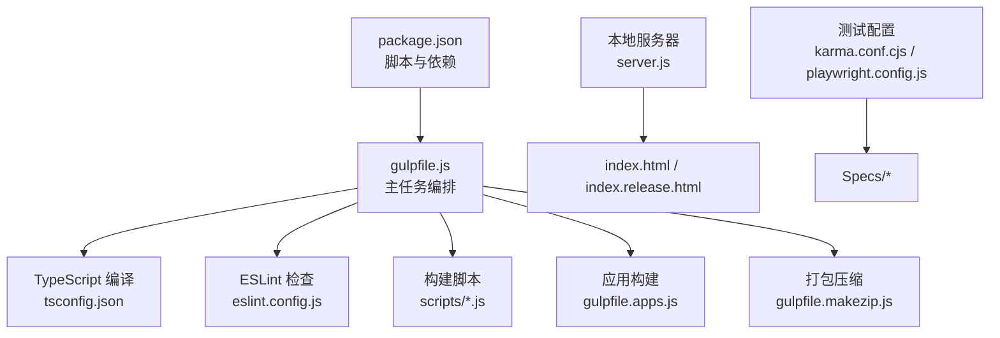
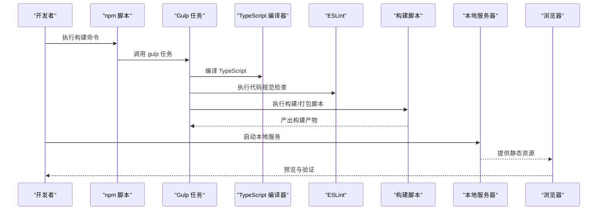
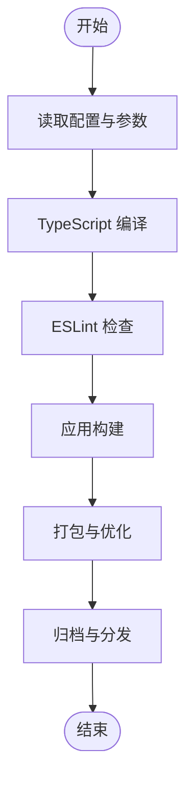
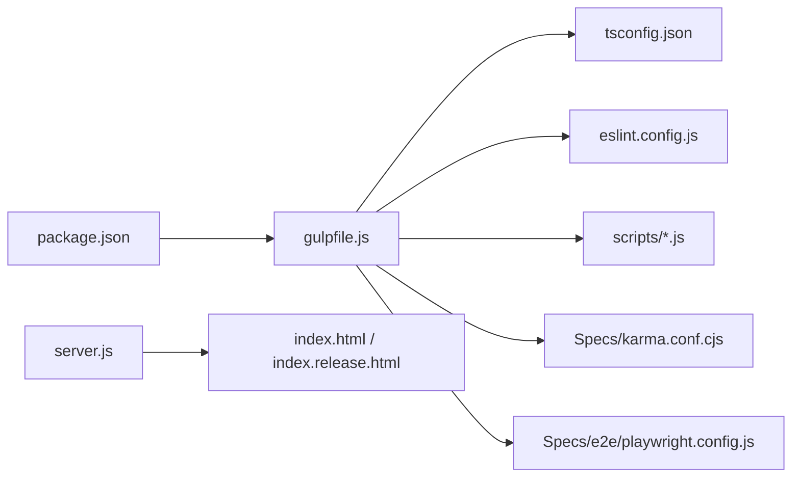

# 构建与部署

<cite>
**本文引用的文件**   
- [package.json](file://package.json)
- [gulpfile.js](file://gulpfile.js)
- [gulpfile.apps.js](file://gulpfile.apps.js)
- [gulpfile.makezip.js](file://gulpfile.makezip.js)
- [tsconfig.json](file://tsconfig.json)
- [eslint.config.js](file://eslint.config.js)
- [server.js](file://server.js)
- [index.html](file://index.html)
- [index.release.html](file://index.release.html)
- [web.config](file://web.config)
- [.npmrc](file://.npmrc)
- [scripts/build.js](file://scripts/build.js)
- [scripts/buildSandcastle.js](file://scripts/buildSandcastle.js)
- [scripts/createRoute.js](file://scripts/createRoute.js)
- [Scripts/rollup-plugin-strip-pragma/index.js](file://Tools/rollup-plugin-strip-pragma/index.js)
- [Documentation/Contributors/BuildGuide/README.md](file://Documentation/Contributors/BuildGuide/README.md)
- [Documentation/Contributors/ContinuousIntegration/README.md](file://Documentation/Contributors/ContinuousIntegration/README.md)
- [Documentation/Contributors/TestingGuide/README.md](file://Documentation/Contributors/TestingGuide/README.md)
- [Specs/karma.conf.cjs](file://Specs/karma.conf.cjs)
- [Specs/e2e/playwright.config.js](file://Specs/e2e/playwright.config.js)
- [launches/build.launch](file://launches/build.launch)
- [launches/runServer.launch](file://launches/runServer.launch)
</cite>

## 目录
1. [简介](#简介)
2. [项目结构](#项目结构)
3. [核心组件](#核心组件)
4. [架构总览](#架构总览)
5. [详细组件分析](#详细组件分析)
6. [依赖关系分析](#依赖关系分析)
7. [性能考虑](#性能考虑)
8. [故障排除指南](#故障排除指南)
9. [结论](#结论)
10. [附录](#附录)

## 简介
本指南面向希望构建、优化并部署 Cesium 项目的开发者，覆盖从本地开发环境搭建到生产打包、持续集成、容器化与云平台部署的全流程。文档基于仓库中的构建脚本、配置文件与贡献者指南进行系统化梳理，帮助读者快速上手并掌握最佳实践。

## 项目结构
Cesium 采用多包与多入口的构建体系：
- 根级 package.json 定义统一脚本与依赖；Gulp 作为任务编排器，串联 TypeScript 编译、ESLint 检查、资源处理与产物输出。
- 应用示例位于 Apps 目录，独立构建与发布。
- 测试套件位于 Specs 目录，包含单元测试（Karma）与端到端测试（Playwright）。
- 工具与插件位于 Tools 目录，包括自定义 Rollup 插件等。
- 启动与调试配置位于 launches 目录，便于 IDE 直接运行构建与服务。

图表来源
- [package.json](file://package.json)
- [gulpfile.js](file://gulpfile.js)
- [tsconfig.json](file://tsconfig.json)
- [eslint.config.js](file://eslint.config.js)
- [scripts/build.js](file://scripts/build.js)
- [gulpfile.apps.js](file://gulpfile.apps.js)
- [gulpfile.makezip.js](file://gulpfile.makezip.js)
- [server.js](file://server.js)
- [index.html](file://index.html)
- [index.release.html](file://index.release.html)
- [Specs/karma.conf.cjs](file://Specs/karma.conf.cjs)
- [Specs/e2e/playwright.config.js](file://Specs/e2e/playwright.config.js)

章节来源
- [package.json](file://package.json)
- [gulpfile.js](file://gulpfile.js)
- [tsconfig.json](file://tsconfig.json)
- [eslint.config.js](file://eslint.config.js)
- [server.js](file://server.js)
- [index.html](file://index.html)
- [index.release.html](file://index.release.html)
- [Specs/karma.conf.cjs](file://Specs/karma.conf.cjs)
- [Specs/e2e/playwright.config.js](file://Specs/e2e/playwright.config.js)

## 核心组件
- 构建系统（Gulp）
  - 主任务编排：gulpfile.js 负责串联编译、检查、打包与产物生成。
  - 应用构建：gulpfile.apps.js 管理示例应用的构建流程。
  - 打包压缩：gulpfile.makezip.js 负责最终产物归档与分发。
- 类型系统与代码质量
  - TypeScript 编译：tsconfig.json 定义模块解析、目标版本与输出路径。
  - ESLint 规范：eslint.config.js 提供统一的代码风格与规则集。
- 构建脚本
  - scripts/build.js、scripts/buildSandcastle.js、scripts/createRoute.js 提供可复用的构建逻辑与路由生成能力。
- 本地服务与页面
  - server.js 提供本地静态服务，index.html 与 index.release.html 为开发与发布入口。
- 测试框架
  - Karma + Jasmine 用于单元与集成测试，Playwright 用于端到端测试。

章节来源
- [gulpfile.js](file://gulpfile.js)
- [gulpfile.apps.js](file://gulpfile.apps.js)
- [gulpfile.makezip.js](file://gulpfile.makezip.js)
- [tsconfig.json](file://tsconfig.json)
- [eslint.config.js](file://eslint.config.js)
- [scripts/build.js](file://scripts/build.js)
- [scripts/buildSandcastle.js](file://scripts/buildSandcastle.js)
- [scripts/createRoute.js](file://scripts/createRoute.js)
- [server.js](file://server.js)
- [index.html](file://index.html)
- [index.release.html](file://index.release.html)
- [Specs/karma.conf.cjs](file://Specs/karma.conf.cjs)
- [Specs/e2e/playwright.config.js](file://Specs/e2e/playwright.config.js)

## 架构总览
下图展示了从源码到产物的关键步骤与组件交互：

图表来源
- [package.json](file://package.json)
- [gulpfile.js](file://gulpfile.js)
- [tsconfig.json](file://tsconfig.json)
- [eslint.config.js](file://eslint.config.js)
- [scripts/build.js](file://scripts/build.js)
- [server.js](file://server.js)
- [index.html](file://index.html)

## 详细组件分析

### 构建系统（Gulp）
- 任务编排
  - 主任务通过 gulpfile.js 组织多个子任务，包括类型编译、代码检查、资源处理与产物输出。
  - 应用构建由 gulpfile.apps.js 管理，支持按应用维度进行构建与清理。
  - 打包压缩由 gulpfile.makezip.js 完成，将构建产物归档以便分发。
- 自定义脚本
  - scripts/build.js 提供通用构建流程封装。
  - scripts/buildSandcastle.js 负责 Sandcastle 示例的构建。
  - scripts/createRoute.js 用于动态生成路由或资源映射。

图表来源
- [gulpfile.js](file://gulpfile.js)
- [gulpfile.apps.js](file://gulpfile.apps.js)
- [gulpfile.makezip.js](file://gulpfile.makezip.js)
- [scripts/build.js](file://scripts/build.js)
- [scripts/buildSandcastle.js](file://scripts/buildSandcastle.js)
- [scripts/createRoute.js](file://scripts/createRoute.js)

章节来源
- [gulpfile.js](file://gulpfile.js)
- [gulpfile.apps.js](file://gulpfile.apps.js)
- [gulpfile.makezip.js](file://gulpfile.makezip.js)
- [scripts/build.js](file://scripts/build.js)
- [scripts/buildSandcastle.js](file://scripts/buildSandcastle.js)
- [scripts/createRoute.js](file://scripts/createRoute.js)

### TypeScript 编译配置
- tsconfig.json 定义了模块系统、目标平台、输出目录与源文件范围，确保跨平台一致性与可维护性。
- 建议结合 Gulp 任务在每次变更时增量编译，提升开发体验。

章节来源
- [tsconfig.json](file://tsconfig.json)

### ESLint 代码规范检查
- eslint.config.js 提供统一的规则集，涵盖语法、命名、注释与第三方库使用限制。
- 建议在提交前自动执行 lint 检查，保证代码质量。

章节来源
- [eslint.config.js](file://eslint.config.js)

### 本地开发与预览
- server.js 提供本地静态服务，配合 index.html 或 index.release.html 进行预览。
- 可通过 npm 脚本或 IDE 的 launches 配置快速启动。

章节来源
- [server.js](file://server.js)
- [index.html](file://index.html)
- [index.release.html](file://index.release.html)
- [launches/runServer.launch](file://launches/runServer.launch)

### 测试配置与执行
- 单元测试与集成测试：Specs/karma.conf.cjs 配置 Karma 与测试运行器。
- 端到端测试：Specs/e2e/playwright.config.js 配置 Playwright 浏览器自动化。
- 参考 TestingGuide 了解测试编写与执行的最佳实践。

章节来源
- [Specs/karma.conf.cjs](file://Specs/karma.conf.cjs)
- [Specs/e2e/playwright.config.js](file://Specs/e2e/playwright.config.js)
- [Documentation/Contributors/TestingGuide/README.md](file://Documentation/Contributors/TestingGuide/README.md)

### 构建脚本与自定义插件
- scripts/build.js、scripts/buildSandcastle.js、scripts/createRoute.js 提供可复用的构建逻辑。
- Tools/rollup-plugin-strip-pragma/index.js 为自定义 Rollup 插件，可用于条件编译与代码裁剪。

章节来源
- [scripts/build.js](file://scripts/build.js)
- [scripts/buildSandcastle.js](file://scripts/buildSandcastle.js)
- [scripts/createRoute.js](file://scripts/createRoute.js)
- [Tools/rollup-plugin-strip-pragma/index.js](file://Tools/rollup-plugin-strip-pragma/index.js)

## 依赖关系分析
- 包管理与脚本
  - package.json 集中定义依赖与脚本入口，驱动 Gulp 与测试工具链。
- 构建与测试链路
  - Gulp 任务依赖 TypeScript 与 ESLint；测试套件依赖 Karma 与 Playwright。
- 本地服务与入口
  - server.js 提供静态服务；index.html 与 index.release.html 作为不同环境的入口。

图表来源
- [package.json](file://package.json)
- [gulpfile.js](file://gulpfile.js)
- [tsconfig.json](file://tsconfig.json)
- [eslint.config.js](file://eslint.config.js)
- [scripts/build.js](file://scripts/build.js)
- [Specs/karma.conf.cjs](file://Specs/karma.conf.cjs)
- [Specs/e2e/playwright.config.js](file://Specs/e2e/playwright.config.js)
- [server.js](file://server.js)
- [index.html](file://index.html)
- [index.release.html](file://index.release.html)

章节来源
- [package.json](file://package.json)
- [gulpfile.js](file://gulpfile.js)
- [tsconfig.json](file://tsconfig.json)
- [eslint.config.js](file://eslint.config.js)
- [scripts/build.js](file://scripts/build.js)
- [Specs/karma.conf.cjs](file://Specs/karma.conf.cjs)
- [Specs/e2e/playwright.config.js](file://Specs/e2e/playwright.config.js)
- [server.js](file://server.js)
- [index.html](file://index.html)
- [index.release.html](file://index.release.html)

## 性能考虑
- 代码分割与按需加载
  - 利用 Gulp 与构建脚本对大模块进行拆分，减少首屏体积。
- 资源压缩与缓存
  - 启用 JS/CSS/图片等资源压缩，合理设置 CDN 缓存策略。
- 条件编译与裁剪
  - 使用自定义插件（如 rollup-plugin-strip-pragma）移除调试与未用代码。
- 构建缓存与增量编译
  - 借助 TypeScript 增量编译与 Gulp 缓存机制缩短构建时间。

[本节为通用指导，不直接分析具体文件]

## 故障排除指南
- 构建失败
  - 检查 Node.js 与 npm 版本是否与 package.json 要求匹配。
  - 确认 .npmrc 中镜像源与代理配置正确。
  - 查看 Gulp 任务日志，定位具体失败步骤。
- 类型错误
  - 根据 tsconfig.json 调整模块解析与目标版本。
  - 使用 TypeScript 诊断信息修复类型问题。
- 代码规范报错
  - 依据 eslint.config.js 的规则说明修正代码风格。
- 本地服务无法访问
  - 确认 server.js 端口未被占用，防火墙允许访问。
  - 检查 index.html 或 index.release.html 的资源路径是否正确。
- 测试失败
  - 检查 Karma 与 Playwright 的配置与环境依赖。
  - 参考 TestingGuide 与 ContinuousIntegration 指南排查环境问题。

章节来源
- [.npmrc](file://.npmrc)
- [gulpfile.js](file://gulpfile.js)
- [tsconfig.json](file://tsconfig.json)
- [eslint.config.js](file://eslint.config.js)
- [server.js](file://server.js)
- [index.html](file://index.html)
- [index.release.html](file://index.release.html)
- [Specs/karma.conf.cjs](file://Specs/karma.conf.cjs)
- [Specs/e2e/playwright.config.js](file://Specs/e2e/playwright.config.js)
- [Documentation/Contributors/TestingGuide/README.md](file://Documentation/Contributors/TestingGuide/README.md)
- [Documentation/Contributors/ContinuousIntegration/README.md](file://Documentation/Contributors/ContinuousIntegration/README.md)

## 结论
通过统一的 Gulp 任务编排、严格的 TypeScript 与 ESLint 配置、完善的测试套件以及灵活的构建脚本，Cesium 项目提供了可扩展且高效的构建与部署体系。遵循本文档的流程与最佳实践，可在本地高效开发，并在生产环境中实现稳定可靠的发布与运维。

[本节为总结性内容，不直接分析具体文件]

## 附录

### 开发环境搭建
- 安装 Node.js 与 npm
  - 选择与 package.json 兼容的版本，建议使用 LTS。
- 安装依赖
  - 在项目根目录执行依赖安装命令，确保所有构建与测试工具就绪。
- 配置镜像源
  - 如需加速下载，可在 .npmrc 中配置国内镜像源。

章节来源
- [package.json](file://package.json)
- [.npmrc](file://.npmrc)

### 构建与运行
- 构建命令
  - 使用 npm 脚本触发 Gulp 任务，执行类型编译、检查与打包。
- 本地预览
  - 启动 server.js 提供的本地服务，打开 index.html 或 index.release.html 进行预览。
- IDE 集成
  - 使用 launches/build.launch 与 launches/runServer.launch 快速运行构建与服务。

章节来源
- [package.json](file://package.json)
- [gulpfile.js](file://gulpfile.js)
- [server.js](file://server.js)
- [index.html](file://index.html)
- [index.release.html](file://index.release.html)
- [launches/build.launch](file://launches/build.launch)
- [launches/runServer.launch](file://launches/runServer.launch)

### 持续集成与自动化测试
- CI 流水线
  - 参考 ContinuousIntegration 指南，在 GitHub Actions 或其他 CI 平台配置构建与测试任务。
- 测试执行
  - 使用 Karma 运行单元与集成测试，使用 Playwright 执行端到端测试。
- 覆盖率与报告
  - 集成覆盖率收集与报告生成，便于质量度量与回归检测。

章节来源
- [Documentation/Contributors/ContinuousIntegration/README.md](file://Documentation/Contributors/ContinuousIntegration/README.md)
- [Specs/karma.conf.cjs](file://Specs/karma.conf.cjs)
- [Specs/e2e/playwright.config.js](file://Specs/e2e/playwright.config.js)

### Docker 容器化部署
- 基础镜像
  - 选择轻量化的 Node.js 镜像作为基础环境。
- 构建阶段
  - 在容器中执行依赖安装与构建脚本，生成静态资源。
- 运行阶段
  - 使用静态服务器（如 nginx 或 node 内置服务）提供资源访问。
- 环境变量与配置
  - 通过环境变量注入 API 地址、CDN 域名等运行时配置。

[本节为通用指导，不直接分析具体文件]

### 云平台部署最佳实践
- 静态站点托管
  - 将构建产物上传至对象存储或静态站点服务，开启 CDN 加速。
- 版本化与回滚
  - 为每个版本生成唯一标识，便于灰度发布与快速回滚。
- 安全与合规
  - 启用 HTTPS、设置安全头、最小权限原则与审计日志。

[本节为通用指导，不直接分析具体文件]

### Windows IIS 部署
- web.config
  - 配置 MIME 类型、URL 重写与缓存策略，确保静态资源正确加载。

章节来源
- [web.config](file://web.config)

### 贡献者构建指南
- 参考 BuildGuide 了解官方推荐的构建流程与注意事项。

章节来源
- [Documentation/Contributors/BuildGuide/README.md](file://Documentation/Contributors/BuildGuide/README.md)