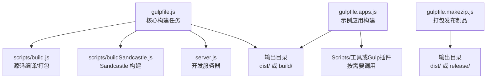
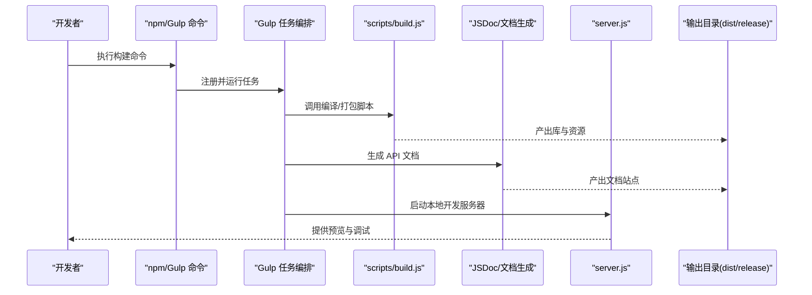
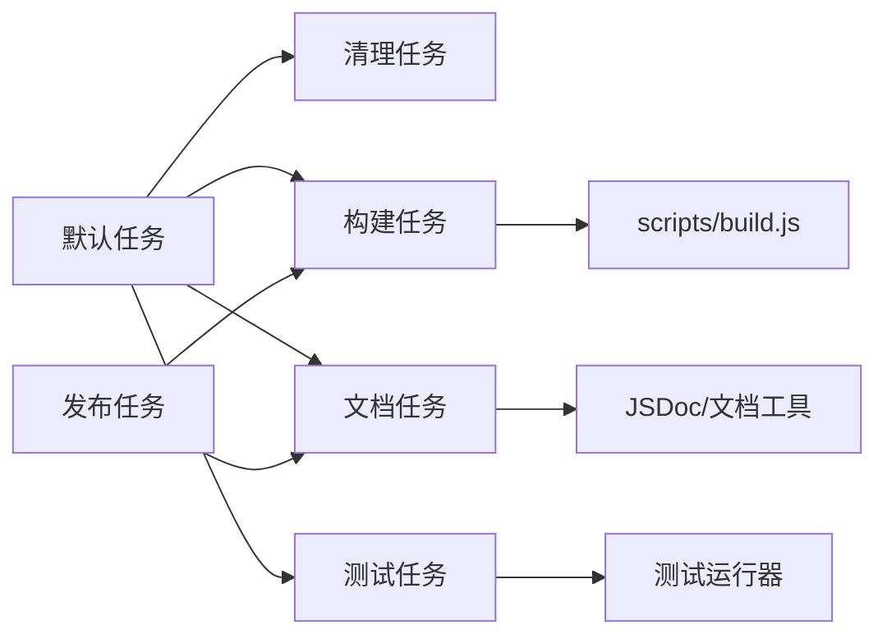

# Gulp构建任务

<cite>
**本文引用的文件**   
- [gulpfile.js](file://gulpfile.js)
- [gulpfile.apps.js](file://gulpfile.apps.js)
- [gulpfile.makezip.js](file://gulpfile.makezip.js)
- [package.json](file://package.json)
- [scripts/build.js](file://scripts/build.js)
- [scripts/buildSandcastle.js](file://scripts/buildSandcastle.js)
- [server.js](file://server.js)
- [launches/runServer.launch](file://launches/runServer.launch)
- [launches/buildApps.launch](file://launches/buildApps.launch)
</cite>

## 目录
1. [简介](#简介)
2. [项目结构](#项目结构)
3. [核心组件](#核心组件)
4. [架构总览](#架构总览)
5. [详细组件分析](#详细组件分析)
6. [依赖关系分析](#依赖关系分析)
7. [性能考虑](#性能考虑)
8. [故障排查指南](#故障排查指南)
9. [结论](#结论)
10. [附录](#附录)

## 简介
本文件面向使用 Cesium 仓库进行本地开发与发布的工程师，系统化梳理基于 Gulp 的构建体系。内容覆盖：
- 主要构建任务的职责与执行顺序（编译、测试、文档生成、打包等）
- 任务间的依赖关系与组合方式
- 多应用构建（Apps 目录）的独立构建流程
- 自定义与扩展构建任务的方法
- 调试方法与性能优化技巧
- 常见构建错误的诊断与解决方案

## 项目结构
仓库采用“根级 Gulp 配置 + 子模块脚本”的组织方式：
- gulpfile.js：定义核心构建任务（编译、打包、文档、发布制品等）
- gulpfile.apps.js：定义 Apps 示例应用的构建任务
- gulpfile.makezip.js：定义发布压缩包构建任务
- scripts/*：由 Gulp 任务调用的 Node 脚本，封装具体实现细节
- server.js：开发服务器入口，配合 Gulp 任务启动本地服务
- launches/*.launch：VS Code 运行配置，便于一键触发常用任务

图表来源
- [gulpfile.js](file://gulpfile.js)
- [gulpfile.apps.js](file://gulpfile.apps.js)
- [gulpfile.makezip.js](file://gulpfile.makezip.js)
- [scripts/build.js](file://scripts/build.js)
- [scripts/buildSandcastle.js](file://scripts/buildSandcastle.js)
- [server.js](file://server.js)

章节来源
- [gulpfile.js](file://gulpfile.js)
- [gulpfile.apps.js](file://gulpfile.apps.js)
- [gulpfile.makezip.js](file://gulpfile.makezip.js)
- [scripts/build.js](file://scripts/build.js)
- [scripts/buildSandcastle.js](file://scripts/buildSandcastle.js)
- [server.js](file://server.js)

## 核心组件
- 核心构建任务（gulpfile.js）
  - 负责整体构建编排，包括：清理产物、编译源码、生成文档、打包库、构建 Sandcastle、启动开发服务器、生成发布包等。
  - 通过 Gulp 的任务组合与并行能力，组织各步骤的执行顺序与并发度。
- 示例应用构建（gulpfile.apps.js）
  - 针对 Apps 目录下的示例应用提供独立构建任务，支持按需构建单个或全部示例应用。
- 发布制品打包（gulpfile.makezip.js）
  - 将构建产物整理为可分发的压缩包，供发布或 CI 使用。
- 构建脚本（scripts/*）
  - 将复杂逻辑下沉到 Node 脚本中，便于复用与测试；Gulp 任务仅做参数传递与错误处理。
- 开发服务器（server.js）
  - 提供本地静态资源服务，配合热重载或浏览器刷新，加速开发迭代。

章节来源
- [gulpfile.js](file://gulpfile.js)
- [gulpfile.apps.js](file://gulpfile.apps.js)
- [gulpfile.makezip.js](file://gulpfile.makezip.js)
- [scripts/build.js](file://scripts/build.js)
- [scripts/buildSandcastle.js](file://scripts/buildSandcastle.js)
- [server.js](file://server.js)

## 架构总览
下图展示了从命令行到最终产物的关键路径与交互关系。

图表来源
- [gulpfile.js](file://gulpfile.js)
- [scripts/build.js](file://scripts/build.js)
- [server.js](file://server.js)

## 详细组件分析

### 核心构建任务（gulpfile.js）
- 职责
  - 定义默认任务与常用任务别名（如构建、测试、文档、打包、发布等）。
  - 管理任务依赖与执行顺序，确保在正确阶段执行相应步骤。
  - 协调并行任务以提升构建速度。
- 典型任务类别
  - 清理与准备：删除旧产物，创建目标目录。
  - 编译与打包：调用 scripts/build.js 完成源码转换、合并与压缩。
  - 文档生成：调用 JSDoc 或相关工具生成 API 文档。
  - 测试：集成单元测试与端到端测试任务。
  - 开发服务器：启动本地服务，便于实时预览。
  - 发布制品：整合产物并生成压缩包。
- 任务组合与依赖
  - 通过 Gulp 的组合函数与串行/并行控制，形成“clean -> build -> docs -> package”的标准流水线。
  - 对耗时任务启用缓存与增量构建策略，减少重复工作。

章节来源
- [gulpfile.js](file://gulpfile.js)

### 示例应用构建（gulpfile.apps.js）
- 职责
  - 为 Apps 目录下的每个示例应用提供独立构建任务。
  - 支持按应用名筛选构建，避免全量构建带来的时间开销。
- 构建流程
  - 扫描 Apps 下应用目录，解析应用配置。
  - 根据配置执行资源复制、脚本编译与样式处理。
  - 输出至 dist 或 build 目录，便于本地预览与测试。
- 与核心构建的关系
  - 可作为独立任务运行，也可被核心构建任务在特定阶段调用。

章节来源
- [gulpfile.apps.js](file://gulpfile.apps.js)

### 发布制品打包（gulpfile.makezip.js）
- 职责
  - 将构建产物（库、文档、示例应用等）统一整理为压缩包。
  - 支持版本信息注入与目录结构规范化。
- 打包流程
  - 收集 dist/release 中的必要文件。
  - 生成 zip/tar 等格式，输出到指定目录。
  - 可选：计算校验和、生成清单文件。

章节来源
- [gulpfile.makezip.js](file://gulpfile.makezip.js)

### 构建脚本（scripts/build.js 与 scripts/buildSandcastle.js）
- scripts/build.js
  - 负责核心库的编译、合并、压缩与类型声明生成。
  - 接收命令行参数以切换模式（开发/生产）、是否开启调试信息等。
- scripts/buildSandcastle.js
  - 专门用于构建 Sandcastle 示例环境，包含资源聚合与页面生成。
- 与 Gulp 的协作
  - Gulp 任务仅负责参数组装与错误传播，实际构建逻辑集中在脚本中，便于复用与测试。

章节来源
- [scripts/build.js](file://scripts/build.js)
- [scripts/buildSandcastle.js](file://scripts/buildSandcastle.js)

### 开发服务器（server.js）
- 职责
  - 提供静态资源服务，支持浏览器访问 dist 或 build 目录。
  - 可与 Gulp 任务联动，实现自动刷新或热更新。
- 使用方式
  - 通过 Gulp 任务启动，或在 VS Code 中使用 launches/runServer.launch 快速启动。

章节来源
- [server.js](file://server.js)
- [launches/runServer.launch](file://launches/runServer.launch)

## 依赖关系分析
- 任务间依赖
  - 默认任务通常依赖 clean、build、docs、test 等子任务。
  - 发布任务依赖 build 与 docs 的输出。
- 外部依赖
  - 构建过程依赖 Node 生态工具链（如 Gulp、JSDoc、压缩与打包工具）。
  - 示例应用构建可能依赖特定插件或模板引擎。
- 耦合与内聚
  - Gulp 任务层保持低耦合，具体实现下沉到 scripts/*，提高内聚性与可维护性。

图表来源
- [gulpfile.js](file://gulpfile.js)
- [scripts/build.js](file://scripts/build.js)

章节来源
- [gulpfile.js](file://gulpfile.js)
- [scripts/build.js](file://scripts/build.js)

## 性能考虑
- 并行化
  - 将相互独立的子任务（如文档生成与示例应用构建）并行执行，缩短总体时长。
- 增量构建
  - 利用缓存与增量策略，仅重新处理变更文件。
- 资源优化
  - 在生产模式下启用压缩与代码分割，减少体积与加载时间。
- 构建产物复用
  - 合理组织输出目录，避免重复拷贝与生成。
- 监控与度量
  - 记录关键任务耗时，定位瓶颈环节。

[本节为通用指导，不直接分析具体文件]

## 故障排查指南
- 常见问题
  - 端口占用：开发服务器启动失败，检查端口冲突并更换端口。
  - 权限问题：写入 dist/release 目录失败，确认文件系统权限。
  - 依赖缺失：Node 模块未安装或版本不匹配，执行依赖安装与版本对齐。
  - 内存不足：大型构建导致进程崩溃，调整 Node 内存限制或拆分任务。
  - 路径错误：相对路径或环境变量配置不正确，核对配置文件与脚本参数。
- 调试方法
  - 使用 Gulp 的日志与断点功能，逐步定位失败节点。
  - 单独运行子任务（如仅构建或仅生成文档），缩小问题范围。
  - 查看构建脚本输出与中间产物，辅助判断问题根源。
- 参考入口
  - 通过 VS Code 的 launches 配置快速复现与调试任务。

章节来源
- [launches/buildApps.launch](file://launches/buildApps.launch)
- [launches/runServer.launch](file://launches/runServer.launch)

## 结论
本仓库的 Gulp 构建体系以“任务编排 + 脚本实现”的模式组织，兼顾灵活性与可维护性。通过清晰的依赖关系与模块化设计，开发者可以高效地定制与扩展构建流程，同时借助并行与增量策略提升构建性能。建议在日常开发中优先使用最小化的任务集，结合调试与度量手段持续优化构建体验。

[本节为总结性内容，不直接分析具体文件]

## 附录
- 常用命令与入口
  - 通过 npm 脚本或 Gulp 命令触发核心任务。
  - 使用 VS Code 的 launches 配置快速运行构建、应用构建与服务。
- 扩展建议
  - 新增构建任务时，尽量将实现下沉到 scripts/*，保持 gulpfile 简洁。
  - 为任务添加参数开关，支持不同环境与模式的构建。

章节来源
- [package.json](file://package.json)
- [launches/buildApps.launch](file://launches/buildApps.launch)
- [launches/runServer.launch](file://launches/runServer.launch)