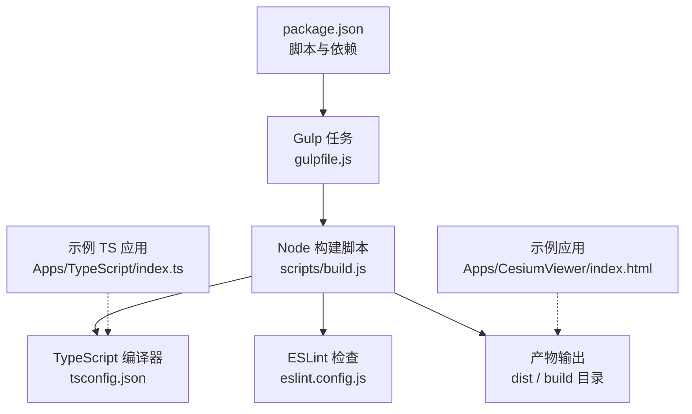
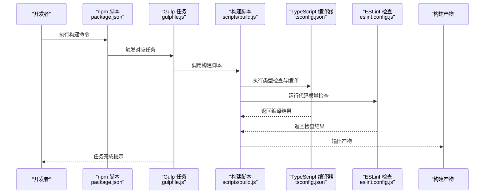
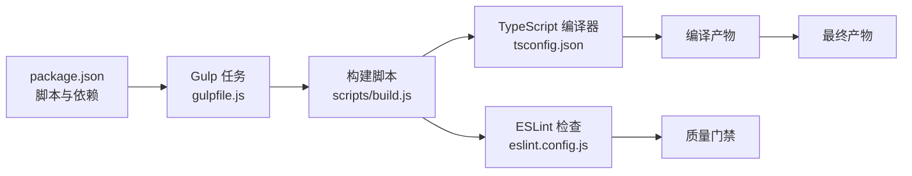

# Webpack配置

<cite>
**本文引用的文件**   
- [package.json](file://package.json)
- [gulpfile.js](file://gulpfile.js)
- [scripts/build.js](file://scripts/build.js)
- [tsconfig.json](file://tsconfig.json)
- [eslint.config.js](file://eslint.config.js)
- [Apps/CesiumViewer/index.html](file://Apps/CesiumViewer/index.html)
- [Apps/TypeScript/index.ts](file://Apps/TypeScript/index.ts)
- [Apps/TypeScript/tsconfig.json](file://Apps/TypeScript/tsconfig.json)
</cite>

## 目录
1. [简介](#简介)
2. [项目结构](#项目结构)
3. [核心组件](#核心组件)
4. [架构总览](#架构总览)
5. [详细组件分析](#详细组件分析)
6. [依赖分析](#依赖分析)
7. [性能考虑](#性能考虑)
8. [故障排查指南](#故障排查指南)
9. [结论](#结论)
10. [附录](#附录)

## 简介
本文件聚焦于该仓库的构建与工具链配置，重点覆盖：
- package.json 中的构建脚本与依赖管理（开发依赖 vs 生产依赖）
- Babel 转译配置（ES6+ 语法转换与兼容性）
- TypeScript 编译配置（类型检查、模块解析、输出格式）
- ESLint 代码质量检查规则配置
- 开发环境与生产环境的差异化策略
- 构建性能优化与调试技巧

说明：经对仓库根目录及关键构建文件的检索与分析，未发现 webpack 配置文件。本项目采用 Gulp + Node 脚本进行构建编排，并通过 TypeScript 与 ESLint 等工具完成类型检查与代码质量保障。下文将基于现有实现提供等价于“Webpack 配置”视角的系统化文档。

## 项目结构
从构建与工具链角度，仓库的关键位置如下：
- 顶层构建入口与任务定义：gulpfile.js
- 构建脚本：scripts/build.js
- 包管理与脚本：package.json
- TypeScript 配置：tsconfig.json（根级）、Apps/TypeScript/tsconfig.json（示例应用）
- ESLint 配置：eslint.config.js
- 示例应用入口：Apps/CesiumViewer/index.html、Apps/TypeScript/index.ts

图表来源
- [package.json](file://package.json)
- [gulpfile.js](file://gulpfile.js)
- [scripts/build.js](file://scripts/build.js)
- [tsconfig.json](file://tsconfig.json)
- [eslint.config.js](file://eslint.config.js)
- [Apps/CesiumViewer/index.html](file://Apps/CesiumViewer/index.html)
- [Apps/TypeScript/index.ts](file://Apps/TypeScript/index.ts)

章节来源
- [package.json](file://package.json)
- [gulpfile.js](file://gulpfile.js)
- [scripts/build.js](file://scripts/build.js)
- [tsconfig.json](file://tsconfig.json)
- [eslint.config.js](file://eslint.config.js)
- [Apps/CesiumViewer/index.html](file://Apps/CesiumViewer/index.html)
- [Apps/TypeScript/index.ts](file://Apps/TypeScript/index.ts)

## 核心组件
- 构建编排器（Gulp）：集中定义开发、打包、压缩、发布等任务，协调各子任务与脚本。
- Node 构建脚本：封装具体构建流程，调用编译器、插件与后处理逻辑。
- TypeScript 编译：负责类型检查、模块解析与目标 JS 生成。
- ESLint 检查：统一代码风格与静态问题检测。
- 示例应用：用于验证构建链路是否打通，并作为开发者上手参考。

章节来源
- [gulpfile.js](file://gulpfile.js)
- [scripts/build.js](file://scripts/build.js)
- [tsconfig.json](file://tsconfig.json)
- [eslint.config.js](file://eslint.config.js)

## 架构总览
下图展示了从 npm 脚本到最终产物的端到端流程，以及各工具的协作关系。

图表来源
- [package.json](file://package.json)
- [gulpfile.js](file://gulpfile.js)
- [scripts/build.js](file://scripts/build.js)
- [tsconfig.json](file://tsconfig.json)
- [eslint.config.js](file://eslint.config.js)

## 详细组件分析

### 构建脚本与依赖管理（package.json）
- 脚本职责
  - 开发相关：启动本地服务、增量构建、监听变更等。
  - 构建相关：清理旧产物、执行编译与检查、生成最终包。
  - 测试与文档：运行测试套件、生成文档等。
- 依赖分类
  - 开发依赖：构建工具、编译器、检查器、测试框架等。
  - 生产依赖：运行时库与第三方资源。
- 使用建议
  - 通过 npm 脚本统一入口，避免直接调用底层工具。
  - 在 CI 中复用同一套脚本，保证环境一致性。

章节来源
- [package.json](file://package.json)

### Gulp 任务编排（gulpfile.js）
- 作用
  - 组织多阶段构建流程（如 clean、build、minify、release）。
  - 组合 Node 脚本与外部工具，形成可复用的任务流。
- 典型任务
  - 开发任务：热更新、增量编译、预览服务。
  - 生产任务：全量构建、压缩、资源优化。
- 扩展点
  - 新增构建步骤时，优先以独立任务或子脚本形式接入，保持主任务清晰。

章节来源
- [gulpfile.js](file://gulpfile.js)

### Node 构建脚本（scripts/build.js）
- 职责
  - 串联 TypeScript 编译、ESLint 检查、资源处理与产物输出。
  - 根据环境变量或参数切换开发/生产模式。
- 关键点
  - 错误处理：捕获编译与检查异常，给出明确提示。
  - 并行与串行：合理组织任务顺序，提升构建效率。
  - 可观测性：输出关键日志，便于定位问题。

章节来源
- [scripts/build.js](file://scripts/build.js)

### TypeScript 编译配置（tsconfig.json 与示例 tsconfig）
- 根级 tsconfig.json
  - 全局类型检查与基础选项（如目标版本、模块系统、严格模式等）。
  - 路径映射与排除规则，控制参与编译的文件范围。
- 示例应用 tsconfig（Apps/TypeScript/tsconfig.json）
  - 针对特定应用的编译目标与模块解析策略。
  - 与根配置的继承与覆盖关系。
- 输出与兼容性
  - 目标 ES 版本与模块格式需与应用部署环境匹配。
  - 如需兼容旧浏览器，结合 Babel 进行额外降级。

章节来源
- [tsconfig.json](file://tsconfig.json)
- [Apps/TypeScript/tsconfig.json](file://Apps/TypeScript/tsconfig.json)

### ESLint 代码质量检查（eslint.config.js）
- 规则组织
  - 按语言与场景划分规则集（JS/TS、样式、安全等）。
  - 通过插件扩展能力（如 TypeScript 支持、JSDoc 校验等）。
- 工作流集成
  - 在构建前或提交前运行，阻断不合规代码进入主干。
  - 与编辑器联动，提供实时反馈。
- 最佳实践
  - 团队共享规则，减少分歧。
  - 渐进式启用严格规则，配合自动化修复。

章节来源
- [eslint.config.js](file://eslint.config.js)

### 示例应用与入口（Apps/CesiumViewer/index.html 与 Apps/TypeScript/index.ts）
- 用途
  - 验证构建链路是否完整，快速定位环境问题。
  - 演示如何引入构建产物与第三方资源。
- 注意事项
  - 确保资源路径与构建输出一致。
  - 在开发模式下开启调试信息，在生产模式关闭冗余日志。

章节来源
- [Apps/CesiumViewer/index.html](file://Apps/CesiumViewer/index.html)
- [Apps/TypeScript/index.ts](file://Apps/TypeScript/index.ts)

## 依赖分析
下图展示构建期主要依赖与协作关系。

图表来源
- [package.json](file://package.json)
- [gulpfile.js](file://gulpfile.js)
- [scripts/build.js](file://scripts/build.js)
- [tsconfig.json](file://tsconfig.json)
- [eslint.config.js](file://eslint.config.js)

章节来源
- [package.json](file://package.json)
- [gulpfile.js](file://gulpfile.js)
- [scripts/build.js](file://scripts/build.js)
- [tsconfig.json](file://tsconfig.json)
- [eslint.config.js](file://eslint.config.js)

## 性能考虑
- 增量构建
  - 利用缓存与增量编译，避免重复工作。
  - 将耗时任务拆分，按需执行。
- 并行与串行
  - 无依赖的任务尽量并行；有先后顺序的任务串行执行。
- 产物体积
  - 仅引入必要模块，避免大依赖树。
  - 生产构建启用压缩与 Tree Shaking（由构建脚本与工具链共同完成）。
- 资源优化
  - 图片、字体等资源按需加载与压缩。
  - 合理使用 CDN 与缓存策略。
- 监控与度量
  - 记录构建时长与产物大小变化，纳入回归检测。

[本节为通用指导，无需源码引用]

## 故障排查指南
- 构建失败
  - 检查 npm 脚本是否正确调用 Gulp 任务。
  - 查看构建脚本日志，定位具体失败阶段。
- 类型错误
  - 确认 tsconfig 的目标版本与模块系统与运行环境一致。
  - 逐步放宽严格模式，定位问题根源。
- 代码规范报错
  - 根据 ESLint 提示修复问题，必要时调整规则。
- 资源路径错误
  - 核对构建输出目录与页面引用路径。
- 性能退化
  - 对比历史构建报告，识别新增的大依赖或低效逻辑。

章节来源
- [scripts/build.js](file://scripts/build.js)
- [tsconfig.json](file://tsconfig.json)
- [eslint.config.js](file://eslint.config.js)

## 结论
本项目未使用 Webpack，而是通过 Gulp 与 Node 脚本组织构建流程，并结合 TypeScript 与 ESLint 完成类型检查与代码质量保障。理解现有构建链路有助于在不引入新工具的前提下，高效地进行功能扩展与性能优化。若未来需要迁移至 Webpack，可在当前任务基础上平滑替换相应环节，同时保留 TypeScript 与 ESLint 的配置与规则。

[本节为总结性内容，无需源码引用]

## 附录
- 常用命令
  - 安装依赖：npm install
  - 开发构建：npm run dev（以实际脚本为准）
  - 生产构建：npm run build（以实际脚本为准）
- 相关文件索引
  - 构建入口与任务：gulpfile.js
  - 构建脚本：scripts/build.js
  - 包管理与脚本：package.json
  - TypeScript 配置：tsconfig.json、Apps/TypeScript/tsconfig.json
  - ESLint 配置：eslint.config.js
  - 示例应用：Apps/CesiumViewer/index.html、Apps/TypeScript/index.ts

章节来源
- [package.json](file://package.json)
- [gulpfile.js](file://gulpfile.js)
- [scripts/build.js](file://scripts/build.js)
- [tsconfig.json](file://tsconfig.json)
- [Apps/TypeScript/tsconfig.json](file://Apps/TypeScript/tsconfig.json)
- [eslint.config.js](file://eslint.config.js)
- [Apps/CesiumViewer/index.html](file://Apps/CesiumViewer/index.html)
- [Apps/TypeScript/index.ts](file://Apps/TypeScript/index.ts)