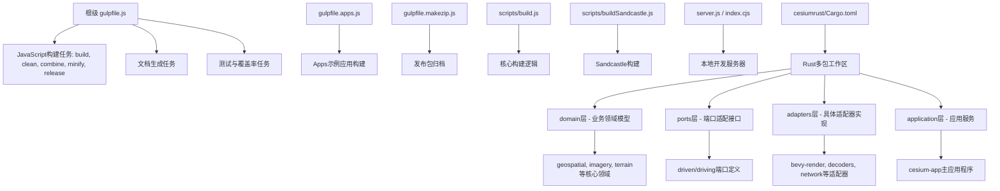
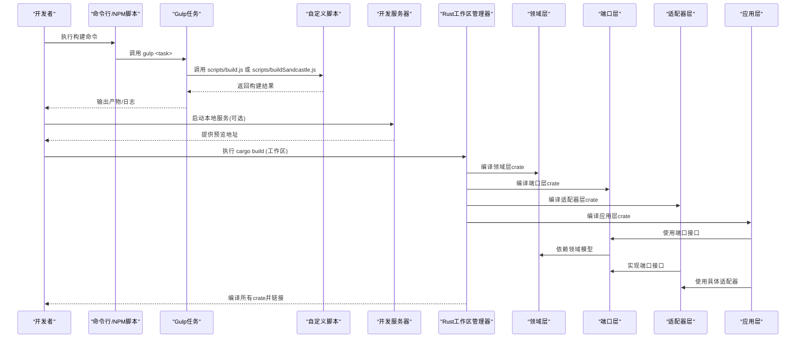
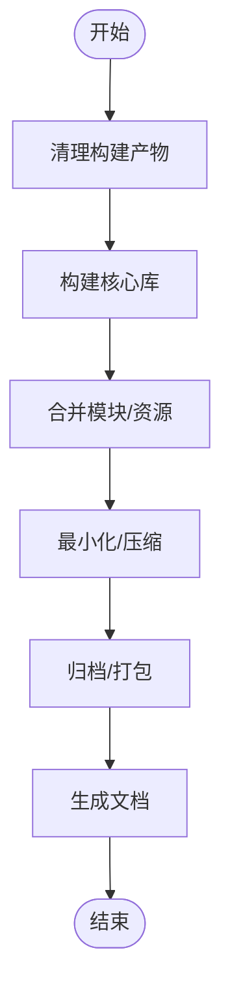
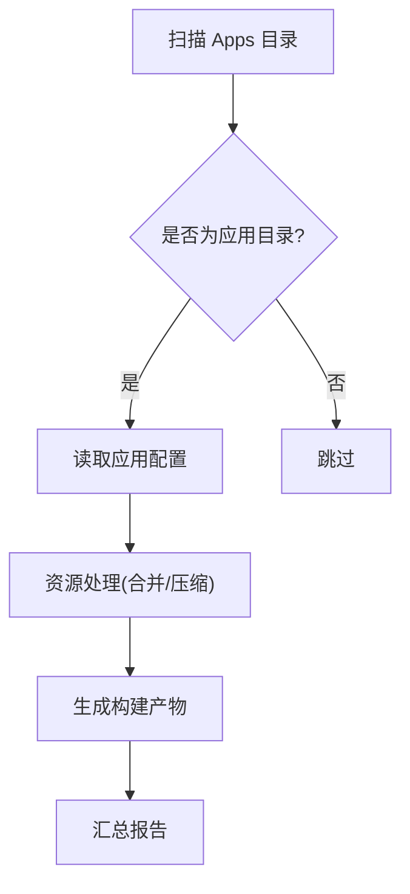
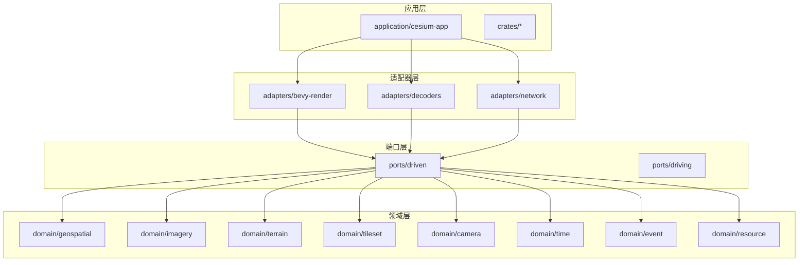
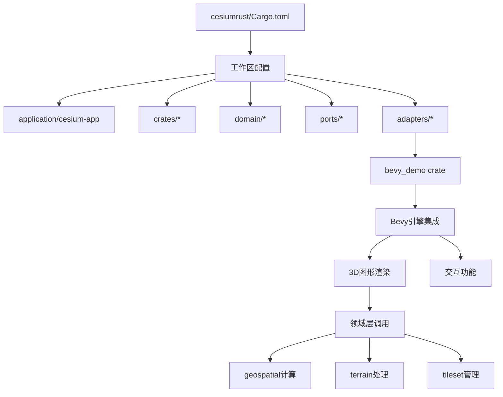
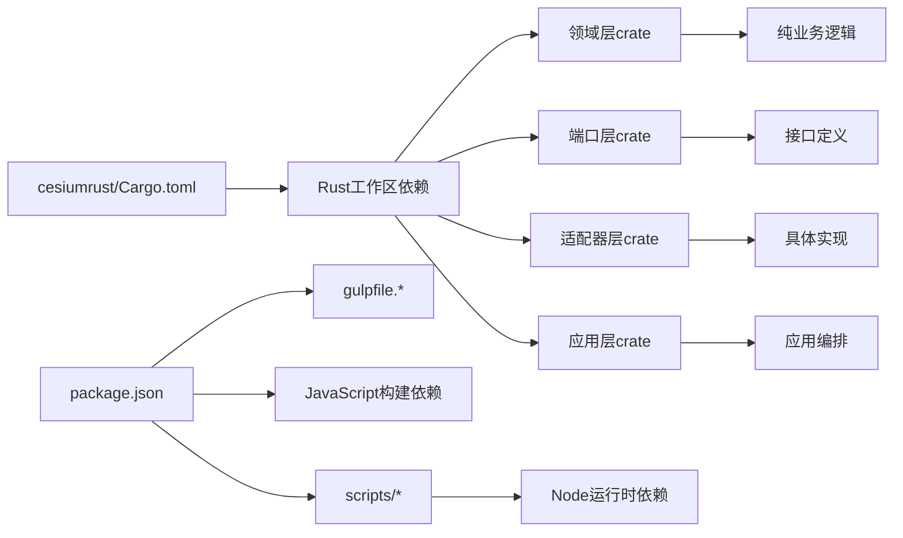

# 构建系统配置

<cite>
**本文引用的文件**   
- [gulpfile.js](file://gulpfile.js)
- [gulpfile.apps.js](file://gulpfile.apps.js)
- [gulpfile.makezip.js](file://gulpfile.makezip.js)
- [package.json](file://package.json)
- [scripts/build.js](file://scripts/build.js)
- [scripts/buildSandcastle.js](file://scripts/buildSandcastle.js)
- [server.js](file://server.js)
- [index.cjs](file://index.cjs)
- [launches/build.launch](file://launches/build.launch)
- [launches/buildApps.launch](file://launches/buildApps.launch)
- [launches/minify.launch](file://launches/minify.launch)
- [launches/release.launch](file://launches/release.launch)
- [launches/clean.launch](file://launches/clean.launch)
- [launches/combine.launch](file://launches/combine.launch)
- [launches/generateDocumentation.launch](file://launches/generateDocumentation.launch)
- [launches/instrumentForCoverage.launch](file://launches/instrumentForCoverage.launch)
- [launches/makeZipFile.launch](file://launches/makeZipFile.launch)
- [launches/runPublicServer.launch](file://launches/runPublicServer.launch)
- [launches/runServer.launch](file://launches/runServer.launch)
- [Cargo.toml](file://cesiumrust/Cargo.toml)
- [bevy_demo/Cargo.toml](file://cesiumrust/crates/bevy_demo/Cargo.toml)
</cite>

## 更新摘要
**变更内容**   
- 重大架构重构：从单包结构迁移到多包工作区，采用领域驱动设计（DDD）和整洁架构原则
- 新增domain层、adapter层、ports层和application层的清晰分层架构
- Cargo.toml完全重写以支持新的多包组织结构和依赖管理
- 扩展了混合语言构建系统，同时支持JavaScript和Rust的多包工作区

## 目录
1. [简介](#简介)
2. [项目结构](#项目结构)
3. [核心组件](#核心组件)
4. [架构总览](#架构总览)
5. [详细组件分析](#详细组件分析)
6. [Rust多包工作区架构](#rust多包工作区架构)
7. [依赖关系分析](#依赖关系分析)
8. [性能考虑](#性能考虑)
9. [故障排查指南](#故障排查指南)
10. [结论](#结论)
11. [附录](#附录)

## 简介
本文件面向Cesium项目的混合构建系统，系统性梳理基于Gulp的JavaScript构建任务、自定义脚本与多应用构建流程，以及全新重构的Rust多包工作区。内容涵盖：
- Gulp任务结构与执行顺序
- 自定义构建脚本的功能与用法（资源处理、合并、优化）
- Apps目录下示例应用的构建方式
- Rust多包工作区的整洁架构实现（domain、adapter、ports、application层）
- 打包优化策略（代码分割、Tree Shaking、资源压缩）
- 构建性能调优与监控方法
- 常见构建错误的诊断与修复建议

## 项目结构
仓库采用"根级Gulp + 子任务脚本 + Rust多包工作区"的混合组织方式：
- 根级gulpfile定义核心JavaScript构建任务（如构建库、文档、清理、打包等）
- gulpfile.apps.js负责Apps下示例应用的构建编排
- gulpfile.makezip.js负责发布包归档
- scripts目录包含自定义Node脚本，用于驱动构建、生成文档、打包等
- cesiumrust目录包含全新的Rust多包工作区，遵循整洁架构原则
- launches目录提供VS Code启动配置，便于本地快速运行构建任务
- server.js与index.cjs为开发服务器入口

**图表来源** 
- [gulpfile.js](file://gulpfile.js)
- [gulpfile.apps.js](file://gulpfile.apps.js)
- [gulpfile.makezip.js](file://gulpfile.makezip.js)
- [scripts/build.js](file://scripts/build.js)
- [scripts/buildSandcastle.js](file://scripts/buildSandcastle.js)
- [server.js](file://server.js)
- [index.cjs](file://index.cjs)
- [Cargo.toml](file://cesiumrust/Cargo.toml)

**章节来源**
- [gulpfile.js](file://gulpfile.js)
- [gulpfile.apps.js](file://gulpfile.apps.js)
- [gulpfile.makezip.js](file://gulpfile.makezip.js)
- [scripts/build.js](file://scripts/build.js)
- [scripts/buildSandcastle.js](file://scripts/buildSandcastle.js)
- [server.js](file://server.js)
- [index.cjs](file://index.cjs)
- [Cargo.toml](file://cesiumrust/Cargo.toml)

## 核心组件
- Gulp任务编排：根级gulpfile集中定义常用任务，apps构建由独立gulpfile管理，makezip负责归档
- 自定义脚本：scripts下的Node脚本封装具体构建步骤，便于复用和扩展
- 开发服务器：server.js/index.cjs提供本地预览能力
- VS Code启动项：launches目录提供一键运行构建、文档、打包、服务等任务的快捷方式
- Rust多包工作区：cesiumrust目录包含完整的整洁架构实现，支持多crate协作

**章节来源**
- [gulpfile.js](file://gulpfile.js)
- [gulpfile.apps.js](file://gulpfile.apps.js)
- [gulpfile.makezip.js](file://gulpfile.makezip.js)
- [scripts/build.js](file://scripts/build.js)
- [scripts/buildSandcastle.js](file://scripts/buildSandcastle.js)
- [server.js](file://server.js)
- [index.cjs](file://index.cjs)
- [Cargo.toml](file://cesiumrust/Cargo.toml)

## 架构总览
下图展示从命令行到Gulp任务再到自定义脚本的执行链路，以及全新的Rust多包工作区架构。

**图表来源** 
- [gulpfile.js](file://gulpfile.js)
- [scripts/build.js](file://scripts/build.js)
- [scripts/buildSandcastle.js](file://scripts/buildSandcastle.js)
- [server.js](file://server.js)
- [Cargo.toml](file://cesiumrust/Cargo.toml)

**章节来源**
- [gulpfile.js](file://gulpfile.js)
- [scripts/build.js](file://scripts/build.js)
- [scripts/buildSandcastle.js](file://scripts/buildSandcastle.js)
- [server.js](file://server.js)
- [Cargo.toml](file://cesiumrust/Cargo.toml)

## 详细组件分析

### Gulp任务与执行流
- 主要任务包括：构建库、合并、最小化、清理、发布、文档生成、测试与覆盖率等
- 任务间存在依赖关系，例如先清理再构建，先构建再打包归档
- 通过NPM脚本统一入口，便于跨平台一致执行

**图表来源** 
- [gulpfile.js](file://gulpfile.js)
- [gulpfile.makezip.js](file://gulpfile.makezip.js)

**章节来源**
- [gulpfile.js](file://gulpfile.js)
- [gulpfile.makezip.js](file://gulpfile.makezip.js)

### 自定义构建脚本
- scripts/build.js：核心构建逻辑，负责读取配置、解析输入、调用工具链、输出产物
- scripts/buildSandcastle.js：专门用于Sandcastle示例的构建，可能涉及模板渲染与资源注入

使用要点：
- 通过命令行参数控制构建模式（开发/生产）、目标路径、是否启用调试等
- 支持增量构建与缓存，减少重复编译时间
- 可与其他脚本组合，形成流水线式构建

**章节来源**
- [scripts/build.js](file://scripts/build.js)
- [scripts/buildSandcastle.js](file://scripts/buildSandcastle.js)

### 多应用构建（Apps目录）
- gulpfile.apps.js负责遍历Apps下的示例应用并逐个构建
- 每个应用通常包含HTML、CSS、JS等资源，构建时会进行合并、压缩与路径替换
- 可通过环境变量或配置文件切换构建目标（如仅构建特定应用）

**图表来源** 
- [gulpfile.apps.js](file://gulpfile.apps.js)

**章节来源**
- [gulpfile.apps.js](file://gulpfile.apps.js)

### 发布与归档
- gulpfile.makezip.js将构建产物打包为ZIP，便于分发与CI上传
- 通常包含版本号、构建时间、平台信息等元数据

**章节来源**
- [gulpfile.makezip.js](file://gulpfile.makezip.js)

### 开发服务器
- server.js与index.cjs提供本地HTTP服务，便于预览构建产物
- 支持热重载与代理转发（视配置而定）

**章节来源**
- [server.js](file://server.js)
- [index.cjs](file://index.cjs)

## Rust多包工作区架构

### 整洁架构实现
Cesium项目现已重构为基于整洁架构原则的多包Rust工作区，位于`cesiumrust`目录下。新架构采用清晰的层次分离：

#### 领域层（Domain Layer）
- `domain/`：包含纯业务逻辑和领域模型，不依赖任何外部框架
- 核心领域模块：
  - `geospatial/`：地理空间计算和坐标转换
  - `imagery/`：影像数据处理和渲染
  - `terrain/`：地形数据处理和分析
  - `tileset/`：3D瓦片集管理和加载
  - `camera/`：相机控制和视角管理
  - `time/`：时间序列处理和动画
  - `event/`：事件系统和消息传递
  - `resource/`：资源管理和生命周期

#### 端口层（Ports Layer）
- `ports/`：定义系统与外部世界的接口契约
- `driven/`：被驱动的端口（外部依赖接口）
- `driving/`：驱动端口（内部对外暴露的接口）

#### 适配器层（Adapter Layer）
- `adapters/`：实现端口接口的具体适配器
- `bevy-render/`：Bevy游戏引擎渲染适配器
- `decoders/`：各种数据格式解码器
- `network/`：网络请求和通信适配器

#### 应用层（Application Layer）
- `application/cesium-app/`：主应用程序，协调各领域服务
- `crates/`：共享工具和通用功能模块

**图表来源** 
- [Cargo.toml](file://cesiumrust/Cargo.toml)

### Bevy Demo Crate
新增的`bevy_demo` crate提供了基于Bevy游戏引擎的3D图形演示功能，展示了如何在整洁架构中使用具体的适配器实现。该crate集成了以下关键依赖：
- bevy：核心游戏引擎框架
- bevy_ecs：实体组件系统
- bevy_render：渲染管线
- bevy_winit：窗口管理
- bevy_input：输入处理

**图表来源** 
- [Cargo.toml](file://cesiumrust/Cargo.toml)
- [bevy_demo/Cargo.toml](file://cesiumrust/crates/bevy_demo/Cargo.toml)

### 依赖管理
新的多包工作区通过Cargo.toml统一管理所有crate的依赖关系，实现了：
- 清晰的依赖方向：应用层 → 适配器层 → 端口层 → 领域层
- 领域层零依赖：纯业务逻辑不依赖任何外部框架
- 端口抽象：通过接口定义解耦具体实现
- 适配器可插拔：可以轻松替换不同的技术实现

**章节来源**
- [Cargo.toml](file://cesiumrust/Cargo.toml)
- [bevy_demo/Cargo.toml](file://cesiumrust/crates/bevy_demo/Cargo.toml)

## 依赖关系分析
- NPM脚本作为JavaScript构建的统一入口，调用Gulp任务或直接执行Node脚本
- Cargo作为Rust多包工作区的统一入口，管理所有crate的依赖和构建
- Gulp任务依赖Node模块（如gulp、gulp-rename、gulp-minify等），具体依赖以package.json为准
- Rust依赖通过Cargo.toml声明，遵循整洁架构的依赖方向约束
- 自定义脚本依赖第三方工具链（如编译器、压缩器、打包器），需确保环境安装完整

**图表来源** 
- [package.json](file://package.json)
- [Cargo.toml](file://cesiumrust/Cargo.toml)
- [gulpfile.js](file://gulpfile.js)
- [scripts/build.js](file://scripts/build.js)

**章节来源**
- [package.json](file://package.json)
- [Cargo.toml](file://cesiumrust/Cargo.toml)
- [gulpfile.js](file://gulpfile.js)
- [scripts/build.js](file://scripts/build.js)

## 性能考虑
- 增量构建：利用缓存与增量编译，避免全量重建
- 并行任务：合理拆分任务，充分利用CPU多核
- 资源优化：启用Tree Shaking、代码分割、图片/字体压缩
- 构建监控：记录关键指标（耗时、内存、产物大小），定位瓶颈
- 缓存策略：合理使用浏览器缓存与服务端缓存，提升二次加载速度
- Rust编译优化：利用cargo的增量编译和并行构建特性，多包工作区支持选择性编译

## 故障排查指南
常见问题与解决思路：
- JavaScript构建失败：检查Node版本与依赖安装；查看控制台错误堆栈；确认输入文件路径正确
- Rust构建失败：检查Rust工具链安装；验证Cargo.toml依赖版本；确认系统依赖（如图形驱动）
- 资源缺失：验证资源路径与引用；检查构建时路径替换规则
- 性能问题：分析构建耗时分布；关闭不必要的插件；增大内存限制
- 服务器无法访问：确认端口占用；检查防火墙与代理设置
- Bevy渲染问题：检查WebGL/WebGPU支持；验证图形驱动兼容性
- 多包依赖问题：检查crate间的依赖声明是否正确；确认依赖方向符合整洁架构原则

**章节来源**
- [gulpfile.js](file://gulpfile.js)
- [scripts/build.js](file://scripts/build.js)
- [server.js](file://server.js)
- [Cargo.toml](file://cesiumrust/Cargo.toml)

## 结论
Cesium构建系统已成功重构为混合语言多包构建平台，以Gulp为核心管理JavaScript构建流程，同时集成基于整洁架构的Rust多包工作区。新的架构通过清晰的层次分离（domain、ports、adapters、application）实现了高内聚低耦合的设计，既满足核心库的高质量构建，也支持多示例应用的快速迭代和3D图形演示功能的开发。配合合理的优化策略与监控手段，可在保证构建质量的同时显著提升开发效率和代码可维护性。

## 附录

### VS Code启动配置说明
- builds.launch：一键执行构建任务
- buildApps.launch：构建Apps下示例应用
- minify.launch：执行最小化任务
- release.launch：执行发布流程
- clean.launch：清理构建产物
- combine.launch：执行合并任务
- generateDocumentation.launch：生成文档
- instrumentForCoverage.launch：注入覆盖率统计
- makeZipFile.launch：打包归档
- runPublicServer.launch：启动公共服务器
- runServer.launch：启动本地开发服务器

### Rust多包工作区命令
- `cargo build`：构建所有crate
- `cargo build -p domain_geospatial`：仅构建特定crate
- `cargo run -p application_cesium_app`：运行主应用程序
- `cargo test`：运行所有测试
- `cargo clippy`：代码质量检查
- `cargo check --workspace`：检查整个工作区

### 整洁架构开发指南
- 领域层只关注业务逻辑，不依赖任何外部框架
- 端口层定义清晰的接口契约，实现松耦合
- 适配器层负责具体技术实现，可灵活替换
- 应用层协调各领域服务，编排业务流程

**章节来源**
- [launches/build.launch](file://launches/build.launch)
- [launches/buildApps.launch](file://launches/buildApps.launch)
- [launches/minify.launch](file://launches/minify.launch)
- [launches/release.launch](file://launches/release.launch)
- [launches/clean.launch](file://launches/clean.launch)
- [launches/combine.launch](file://launches/combine.launch)
- [launches/generateDocumentation.launch](file://launches/generateDocumentation.launch)
- [launches/instrumentForCoverage.launch](file://launches/instrumentForCoverage.launch)
- [launches/makeZipFile.launch](file://launches/makeZipFile.launch)
- [launches/runPublicServer.launch](file://launches/runPublicServer.launch)
- [launches/runServer.launch](file://launches/runServer.launch)
- [Cargo.toml](file://cesiumrust/Cargo.toml)