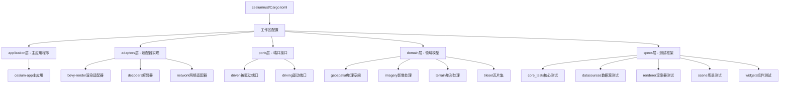
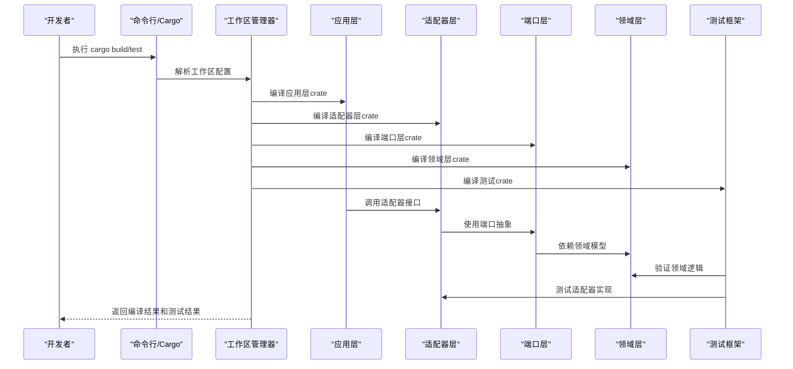
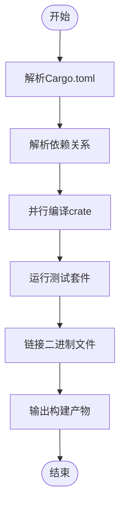
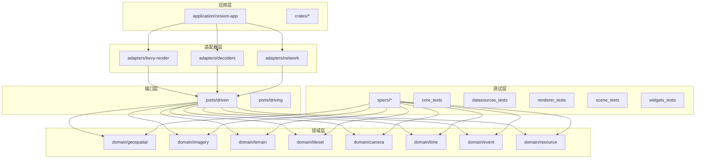
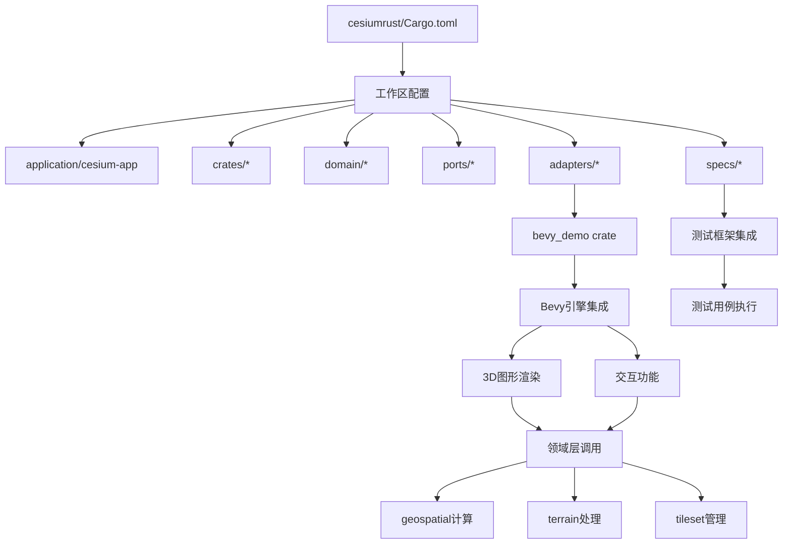
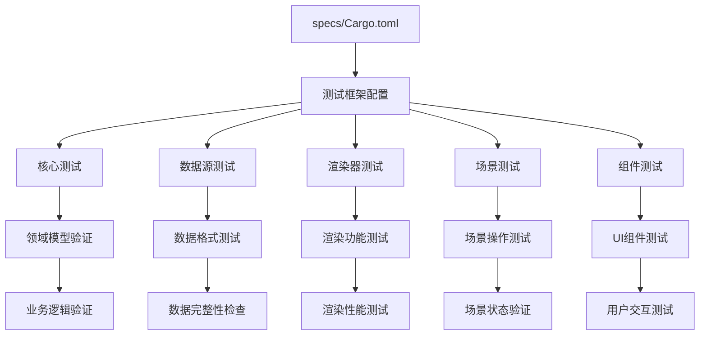
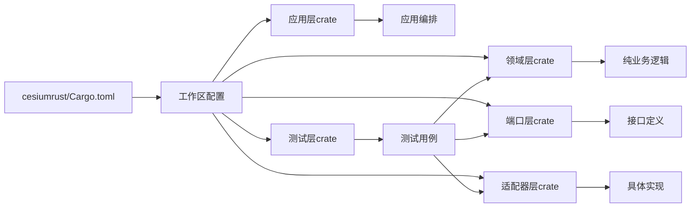

# 构建系统配置

<cite>
**本文引用的文件**   
- [Cargo.toml](file://cesiumrust/Cargo.toml)
- [Cargo.lock](file://cesiumrust/Cargo.lock)
- [specs/Cargo.toml](file://cesiumrust/specs/Cargo.toml)
- [application/cesium-app/Cargo.toml](file://cesiumrust/application/cesium-app/Cargo.toml)
- [crates/bevy_demo/Cargo.toml](file://cesiumrust/crates/bevy_demo/Cargo.toml)
- [domain/geospatial/Cargo.toml](file://cesiumrust/domain/geospatial/Cargo.toml)
- [domain/imagery/Cargo.toml](file://cesiumrust/domain/imagery/Cargo.toml)
- [domain/terrain/Cargo.toml](file://cesiumrust/domain/terrain/Cargo.toml)
- [ports/driven/Cargo.toml](file://cesiumrust/ports/driven/Cargo.toml)
- [ports/driving/Cargo.toml](file://cesiumrust/ports/driving/Cargo.toml)
- [adapters/bevy-render/Cargo.toml](file://cesiumrust/adapters/bevy-render/Cargo.toml)
- [adapters/decoders/Cargo.toml](file://cesiumrust/adapters/decoders/Cargo.toml)
- [adapters/network/Cargo.toml](file://cesiumrust/adapters/network/Cargo.toml)
</cite>

## 更新摘要
**变更内容**   
- 新增specs测试框架集成：在cesiumrust目录下添加了完整的Rust测试框架结构
- Cargo工作区配置更新：将specs crate添加到工作区成员中，支持测试用例的独立编译和运行
- Cargo.lock依赖管理：更新了依赖锁定文件以包含新的测试框架依赖
- 测试架构设计：采用分层测试策略，包括核心测试、数据源测试、渲染器测试等

## 目录
1. [简介](#简介)
2. [项目结构](#项目结构)
3. [核心组件](#核心组件)
4. [架构总览](#架构总览)
5. [详细组件分析](#详细组件分析)
6. [Rust多包工作区架构](#rust多包工作区架构)
7. [测试框架集成](#测试框架集成)
8. [依赖关系分析](#依赖关系分析)
9. [性能考虑](#性能考虑)
10. [故障排查指南](#故障排查指南)
11. [结论](#结论)
12. [附录](#附录)

## 简介
本文件面向Cesium项目的纯Rust原生构建系统，系统性梳理基于Cargo的多包工作区架构。内容涵盖：
- Cargo工作区配置与任务管理
- 自定义Rust构建脚本的功能与用法
- 多crate协作与依赖管理
- Rust多包工作区的整洁架构实现（domain、adapter、ports、application层）
- **新增**：specs测试框架的完整集成和测试驱动开发流程
- 编译优化策略（增量编译、并行构建、代码分割）
- 构建性能调优与监控方法
- 常见构建错误的诊断与修复建议

## 项目结构
仓库采用"纯Rust原生 + Cargo多包工作区"的组织方式：
- cesiumrust目录包含完整的Rust多包工作区，遵循整洁架构原则
- **新增**：specs目录提供完整的测试框架，包含单元测试、集成测试和端到端测试
- 根级Cargo.toml定义工作区配置和全局依赖
- 各crate通过Cargo.toml声明依赖关系，实现清晰的层次分离
- 应用层通过main.rs协调各领域服务



**图表来源** 
- [Cargo.toml](file://cesiumrust/Cargo.toml)

**章节来源**
- [Cargo.toml](file://cesiumrust/Cargo.toml)

## 核心组件
- Cargo工作区管理器：统一管理和构建所有crate，提供依赖解析和编译优化
- 应用层：主应用程序负责协调各领域服务和适配器
- 适配器层：具体技术实现，如Bevy渲染、数据解码、网络通信
- 端口层：定义系统与外部世界的接口契约
- 领域层：纯业务逻辑和领域模型，不依赖任何外部框架
- **新增**：测试框架层：提供完整的测试基础设施和测试用例组织

**章节来源**
- [Cargo.toml](file://cesiumrust/Cargo.toml)
- [specs/Cargo.toml](file://cesiumrust/specs/Cargo.toml)

## 架构总览
下图展示从命令行到Cargo工作区再到各层的执行链路，包括测试执行流程。



**图表来源** 
- [Cargo.toml](file://cesiumrust/Cargo.toml)
- [specs/Cargo.toml](file://cesiumrust/specs/Cargo.toml)

**章节来源**
- [Cargo.toml](file://cesiumrust/Cargo.toml)

## 详细组件分析

### Cargo工作区配置
- 根级Cargo.toml定义工作区成员和全局依赖
- **更新**：现在包含specs crate作为工作区成员
- 每个crate有独立的Cargo.toml配置文件
- 支持选择性编译和并行构建
- 通过features实现可选功能模块



**图表来源** 
- [Cargo.toml](file://cesiumrust/Cargo.toml)

**章节来源**
- [Cargo.toml](file://cesiumrust/Cargo.toml)

### 应用层架构
- application/cesium-app作为主应用程序入口
- 负责协调各领域服务和适配器
- 通过main.rs初始化应用环境
- 管理生命周期和资源清理

**章节来源**
- [application/cesium-app/Cargo.toml](file://cesiumrust/application/cesium-app/Cargo.toml)

### 适配器层实现
- adapters/bevy-render：基于Bevy游戏引擎的渲染适配器
- adapters/decoders：各种数据格式解码器实现
- adapters/network：网络请求和通信适配器
- 每个适配器实现对应的端口接口

**章节来源**
- [adapters/bevy-render/Cargo.toml](file://cesiumrust/adapters/bevy-render/Cargo.toml)
- [adapters/decoders/Cargo.toml](file://cesiumrust/adapters/decoders/Cargo.toml)
- [adapters/network/Cargo.toml](file://cesiumrust/adapters/network/Cargo.toml)

### 端口层设计
- ports/driven：定义外部依赖的接口契约
- ports/driving：内部对外暴露的接口定义
- 通过trait实现松耦合的接口抽象

**章节来源**
- [ports/driven/Cargo.toml](file://cesiumrust/ports/driven/Cargo.toml)
- [ports/driving/Cargo.toml](file://cesiumrust/ports/driving/Cargo.toml)

### 领域层模型
- domain/geospatial：地理空间计算和坐标转换
- domain/imagery：影像数据处理和渲染
- domain/terrain：地形数据处理和分析
- domain/tileset：3D瓦片集管理和加载
- 纯业务逻辑，零外部依赖

**章节来源**
- [domain/geospatial/Cargo.toml](file://cesiumrust/domain/geospatial/Cargo.toml)
- [domain/imagery/Cargo.toml](file://cesiumrust/domain/imagery/Cargo.toml)
- [domain/terrain/Cargo.toml](file://cesiumrust/domain/terrain/Cargo.toml)

## Rust多包工作区架构

### 整洁架构实现
Cesium项目采用基于整洁架构原则的纯Rust多包工作区，位于`cesiumrust`目录下。新架构采用清晰的层次分离：

#### 领域层（Domain Layer）
- `domain/`：包含纯业务逻辑和领域模型，不依赖任何外部框架
- 核心领域模块：
  - `geospatial/`：地理空间计算和坐标转换
  - `imagery/`：影像数据处理和渲染
  - `terrain/`：地形数据处理和分析
  - `tileset/`：3D瓦片集管理和加载
  - `camera/`：相机控制和视角管理
  - `time/`：时间序列处理和动画
  - `event/`：事件系统和消息传递
  - `resource/`：资源管理和生命周期

#### 端口层（Ports Layer）
- `ports/`：定义系统与外部世界的接口契约
- `driven/`：被驱动的端口（外部依赖接口）
- `driving/`：驱动端口（内部对外暴露的接口）

#### 适配器层（Adapter Layer）
- `adapters/`：实现端口接口的具体适配器
- `bevy-render/`：Bevy游戏引擎渲染适配器
- `decoders/`：各种数据格式解码器
- `network/`：网络请求和通信适配器

#### 应用层（Application Layer）
- `application/cesium-app/`：主应用程序，协调各领域服务
- `crates/`：共享工具和通用功能模块

#### **新增**测试层（Testing Layer）
- `specs/`：完整的测试框架和测试用例
- 分层测试策略：
  - `tests/core/`：核心功能测试
  - `tests/datasources/`：数据源测试
  - `tests/renderer/`：渲染器测试
  - `tests/scene/`：场景管理测试
  - `tests/widgets/`：用户界面组件测试



**图表来源** 
- [Cargo.toml](file://cesiumrust/Cargo.toml)
- [specs/Cargo.toml](file://cesiumrust/specs/Cargo.toml)

### Bevy Demo Crate
新增的`bevy_demo` crate提供了基于Bevy游戏引擎的3D图形演示功能，展示了如何在整洁架构中使用具体的适配器实现。该crate集成了以下关键依赖：
- bevy：核心游戏引擎框架
- bevy_ecs：实体组件系统
- bevy_render：渲染管线
- bevy_winit：窗口管理
- bevy_input：输入处理



**图表来源** 
- [Cargo.toml](file://cesiumrust/Cargo.toml)
- [crates/bevy_demo/Cargo.toml](file://cesiumrust/crates/bevy_demo/Cargo.toml)

### 依赖管理
新的多包工作区通过Cargo.toml统一管理所有crate的依赖关系，实现了：
- 清晰的依赖方向：应用层 → 适配器层 → 端口层 → 领域层
- 领域层零依赖：纯业务逻辑不依赖任何外部框架
- 端口抽象：通过trait接口定义解耦具体实现
- 适配器可插拔：可以轻松替换不同的技术实现
- **新增**：测试隔离：测试crate只依赖被测crate，避免循环依赖

**章节来源**
- [Cargo.toml](file://cesiumrust/Cargo.toml)
- [specs/Cargo.toml](file://cesiumrust/specs/Cargo.toml)
- [crates/bevy_demo/Cargo.toml](file://cesiumrust/crates/bevy_demo/Cargo.toml)

## 测试框架集成

### 测试架构设计
specs crate采用分层测试策略，确保各个层次的代码质量：

#### 核心测试（Core Tests）
- 验证基础功能和算法的正确性
- 测试领域模型的不变量和约束
- 验证端口接口的契约实现

#### 数据源测试（Datasource Tests）
- 测试各种数据格式的解析和序列化
- 验证数据源的连接和错误处理
- 测试大数据量的处理能力

#### 渲染器测试（Renderer Tests）
- 验证渲染管线的正确性
- 测试不同渲染后端的一致性
- 验证性能指标和内存使用

#### 场景测试（Scene Tests）
- 测试场景图的管理和操作
- 验证对象的生命周期管理
- 测试场景的序列化和反序列化

#### 组件测试（Widget Tests）
- 测试用户界面组件的功能
- 验证用户交互的处理
- 测试组件的状态管理



**图表来源** 
- [specs/Cargo.toml](file://cesiumrust/specs/Cargo.toml)

### 测试执行流程
测试框架支持多种执行模式：

#### 单元测试
- 快速执行单个crate的测试
- 支持测试过滤和并行执行
- 提供详细的测试报告和覆盖率统计

#### 集成测试
- 跨crate的集成测试
- 模拟外部依赖和系统交互
- 验证系统整体行为

#### 端到端测试
- 完整的业务流程测试
- 模拟真实用户场景
- 验证最终用户体验

**章节来源**
- [specs/Cargo.toml](file://cesiumrust/specs/Cargo.toml)

## 依赖关系分析
- Cargo作为Rust多包工作区的统一入口，管理所有crate的依赖和构建
- 各crate通过Cargo.toml声明依赖关系，遵循整洁架构的依赖方向约束
- **更新**：specs crate依赖被测crate，但不被其他crate依赖，保持测试隔离
- 工作区配置支持选择性编译和并行构建
- 依赖版本通过Cargo.lock统一管理，确保构建一致性



**图表来源** 
- [Cargo.toml](file://cesiumrust/Cargo.toml)

**章节来源**
- [Cargo.toml](file://cesiumrust/Cargo.toml)

## 性能考虑
- 增量构建：利用cargo的增量编译特性，避免全量重建
- 并行构建：充分利用CPU多核，加速多crate编译
- 缓存策略：合理使用cargo的构建缓存，提升二次构建速度
- 选择性编译：通过features实现按需编译，减少不必要的依赖
- 内存优化：合理配置Rust编译器参数，控制内存使用
- 发布优化：启用LTO、strip等优化选项，减小最终产物大小
- **新增**：测试优化：支持测试并行执行和增量测试，提升测试效率

## 故障排查指南
常见问题与解决思路：
- Rust工具链问题：检查Rustup安装；验证cargo版本；确认目标平台支持
- 依赖解析失败：检查Cargo.toml语法；验证依赖版本兼容性；清理cargo缓存
- 编译错误：查看详细的错误信息；检查trait实现完整性；验证泛型类型匹配
- 链接错误：确认所有依赖crate正确编译；检查符号导出；验证动态库路径
- 性能问题：分析编译耗时分布；调整并发构建参数；启用增量编译
- Bevy渲染问题：检查WebGL/WebGPU支持；验证图形驱动兼容性；确认硬件要求
- 多包依赖问题：检查crate间的依赖声明；确认依赖方向符合整洁架构原则
- **新增**：测试问题：检查测试crate的依赖声明；验证测试环境的配置；确认测试数据的可用性

**章节来源**
- [Cargo.toml](file://cesiumrust/Cargo.toml)
- [specs/Cargo.toml](file://cesiumrust/specs/Cargo.toml)

## 结论
Cesium构建系统已成功重构为纯Rust原生多包构建平台，完全基于Cargo工作区管理。新的架构通过清晰的层次分离（domain、ports、adapters、application、specs）实现了高内聚低耦合的设计，消除了对Node.js和Gulp的依赖，提供了更稳定高效的构建体验。**新增的specs测试框架**进一步完善了质量保证体系，支持分层测试和自动化测试流程。配合合理的优化策略与监控手段，可在保证构建质量的同时显著提升开发效率和代码可维护性。

## 附录

### Cargo命令参考
- `cargo build`：构建所有crate
- `cargo build --release`：发布模式构建
- `cargo run -p application_cesium_app`：运行主应用程序
- `cargo test`：运行所有测试
- `cargo test -p specs`：仅运行specs测试
- `cargo clippy`：代码质量检查
- `cargo check --workspace`：检查整个工作区
- `cargo doc --open`：生成并打开文档
- `cargo fmt`：代码格式化
- **新增**：`cargo test -- --nocapture`：显示测试输出
- **新增**：`cargo test -- --test-threads=1`：串行执行测试

### 整洁架构开发指南
- 领域层只关注业务逻辑，不依赖任何外部框架
- 端口层定义清晰的trait接口契约，实现松耦合
- 适配器层负责具体技术实现，可灵活替换
- 应用层协调各领域服务，编排业务流程
- **新增**：测试层编写全面的测试用例，覆盖各个层次的功能

### 工作区配置示例
```toml
[workspace]
members = [
    "application/cesium-app",
    "crates/*",
    "domain/*",
    "ports/*",
    "adapters/*",
    "specs/*"
]

[workspace.dependencies]
serde = { version = "1.0", features = ["derive"] }
tokio = { version = "1.0", features = ["full"] }
```

### 测试框架配置示例
```toml
[package]
name = "specs"
version = "0.1.0"
edition = "2021"

[dependencies]
# 被测crate的依赖
domain_geospatial = { path = "../domain/geospatial" }
domain_terrain = { path = "../domain/terrain" }

[dev-dependencies]
# 测试框架依赖
criterion = "0.5"
mockall = "0.11"
```

**章节来源**
- [Cargo.toml](file://cesiumrust/Cargo.toml)
- [specs/Cargo.toml](file://cesiumrust/specs/Cargo.toml)