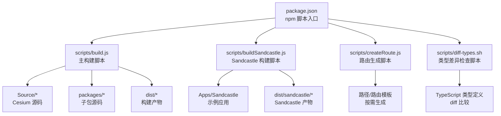
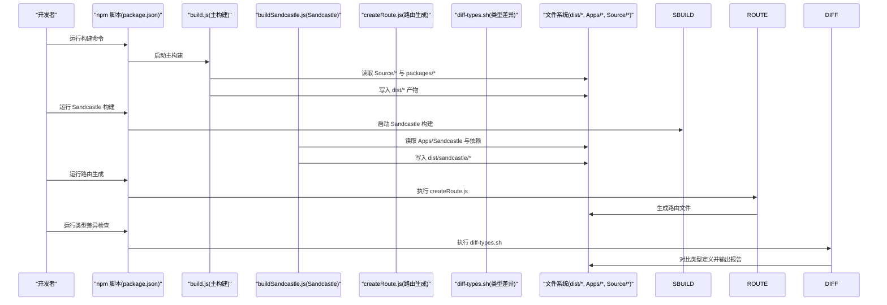
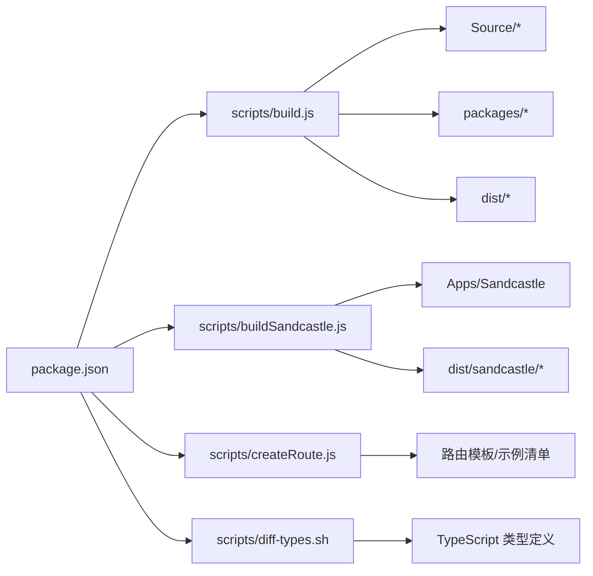

# 自定义构建脚本

<cite>
**本文引用的文件**   
- [scripts/build.js](file://scripts/build.js)
- [scripts/buildSandcastle.js](file://scripts/buildSandcastle.js)
- [scripts/createRoute.js](file://scripts/createRoute.js)
- [scripts/diff-types.sh](file://scripts/diff-types.sh)
- [package.json](file://package.json)
</cite>

## 目录
1. [简介](#简介)
2. [项目结构](#项目结构)
3. [核心组件](#核心组件)
4. [架构总览](#架构总览)
5. [详细组件分析](#详细组件分析)
6. [依赖关系分析](#依赖关系分析)
7. [性能与优化建议](#性能与优化建议)
8. [故障排查指南](#故障排查指南)
9. [结论](#结论)
10. [附录](#附录)

## 简介
本文件面向需要深度定制 CesiumJS 构建流程的开发者与维护者，聚焦以下目标：
- 深入解析主构建脚本 build.js 的功能、参数与源码处理策略（模块打包、资源优化等）。
- 说明 Sandcastle 演示应用的构建脚本 buildSandcastle.js 的作用与配置项。
- 阐述 createRoute.js 路由生成脚本的工作原理与使用场景。
- 提供 diff-types.sh 类型差异检查脚本的使用方法。
- 汇总脚本参数的详细说明与自定义扩展指南。

## 项目结构
与构建相关的脚本集中于 scripts 目录，并通过 package.json 中的 npm 脚本暴露常用命令入口。下图展示了构建脚本在项目中的位置与相互关系。

图表来源
- [package.json](file://package.json)
- [scripts/build.js](file://scripts/build.js)
- [scripts/buildSandcastle.js](file://scripts/buildSandcastle.js)
- [scripts/createRoute.js](file://scripts/createRoute.js)
- [scripts/diff-types.sh](file://scripts/diff-types.sh)

章节来源
- [package.json](file://package.json)

## 核心组件
本节概述各构建脚本的职责边界与交互方式，为后续深入分析奠定基础。

- 主构建脚本（build.js）
  - 负责整体构建编排：读取配置、解析命令行参数、调用内部工具链完成源码处理、模块打包与资源优化，并输出到 dist 目录。
  - 支持多模式构建（如开发/发布）、增量构建、并行任务、插件化扩展点等。
- Sandcastle 构建脚本（buildSandcastle.js）
  - 专门用于构建 Sandcastle 演示应用，聚合示例代码、静态资源与运行时依赖，生成可独立部署的站点产物。
- 路由生成脚本（createRoute.js）
  - 根据模板或规则自动生成页面路由与导航结构，便于在示例应用中动态注册新页面。
- 类型差异检查脚本（diff-types.sh）
  - 基于 TypeScript 类型定义进行差异比对，辅助版本升级与兼容性审查。

章节来源
- [scripts/build.js](file://scripts/build.js)
- [scripts/buildSandcastle.js](file://scripts/buildSandcastle.js)
- [scripts/createRoute.js](file://scripts/createRoute.js)
- [scripts/diff-types.sh](file://scripts/diff-types.sh)

## 架构总览
下图展示从 npm 脚本到具体构建任务的执行链路，以及关键输入输出。

图表来源
- [package.json](file://package.json)
- [scripts/build.js](file://scripts/build.js)
- [scripts/buildSandcastle.js](file://scripts/buildSandcastle.js)
- [scripts/createRoute.js](file://scripts/createRoute.js)
- [scripts/diff-types.sh](file://scripts/diff-types.sh)

## 详细组件分析

### 主构建脚本 build.js
职责与能力
- 参数解析与配置合并：支持通过命令行参数覆盖默认配置，包括输出目录、压缩开关、源映射、目标平台等。
- 源码处理流水线：
  - 扫描 Source/* 与 packages/* 下的模块，解析依赖图。
  - 执行预处理（如常量替换、条件编译、注释清理）。
  - 模块打包与树摇（Tree Shaking），按目标产物拆分 chunk。
- 资源优化策略：
  - 文本/JSON 内联与压缩。
  - 图片/字体等资源按需复制与哈希命名。
  - 可选的代码分割与懒加载策略。
- 产物组织：
  - 将构建结果写入 dist 目录，包含库文件、样式与资源。
- 扩展点：
  - 提供插件钩子与中间件接口，允许注入自定义处理步骤。

典型用法
- 基础构建：直接运行主脚本以生成默认产物。
- 指定模式：传入构建模式参数（如 release 或 development）以启用不同优化策略。
- 增量构建：仅重新构建变更模块以提升速度。
- 并行任务：开启多线程/进程并行加速构建。

注意事项
- 大仓库首次构建时间较长，建议使用缓存与增量构建。
- 若自定义插件，需确保兼容现有中间件顺序与错误传播机制。

章节来源
- [scripts/build.js](file://scripts/build.js)

### Sandcastle 构建脚本 buildSandcastle.js
作用与特性
- 聚合示例应用：收集 Apps/Sandcastle 下的示例页面、数据与资源。
- 构建产物：生成独立的 dist/sandcastle 站点，可直接部署到静态服务器。
- 配置选项：
  - 示例过滤：选择构建特定示例集合。
  - 资源优化：是否压缩资源、是否启用缓存指纹。
  - 调试开关：是否生成 source map、是否保留调试信息。
- 与主构建的关系：
  - 可复用主构建的配置与工具链，但针对示例应用做额外适配（如路由、预览器、沙箱环境）。

常见工作流
- 本地开发：快速构建最小示例集以便调试。
- 发布前校验：全量构建 Sandcastle 以验证示例完整性。
- 持续集成：在 CI 中自动构建并归档产物。

章节来源
- [scripts/buildSandcastle.js](file://scripts/buildSandcastle.js)

### 路由生成脚本 createRoute.js
工作原理
- 输入：
  - 示例清单或模板文件（通常位于 Apps/Sandcastle 或相关目录）。
  - 路由模板与命名约定。
- 处理：
  - 解析示例元数据，生成路由表与导航结构。
  - 根据模板渲染页面入口与链接。
- 输出：
  - 更新后的路由文件与导航配置，供 Sandcastle 运行时消费。

使用场景
- 新增示例后自动注册路由，避免手动维护。
- 批量重命名或迁移示例时统一更新导航。
- 在多分支协作中保持路由一致性。

章节来源
- [scripts/createRoute.js](file://scripts/createRoute.js)

### 类型差异检查脚本 diff-types.sh
功能说明
- 对比当前与目标版本的 TypeScript 类型定义，输出差异报告。
- 适用于：
  - 升级第三方依赖时的类型兼容性评估。
  - 发布前的 API 稳定性检查。
  - 团队评审的类型变更审计。

使用方法
- 在仓库根目录执行脚本，指定对比基准（如上一个标签或分支）。
- 查看生成的差异报告，定位破坏性变更与潜在风险。

注意事项
- 需要安装并可用 TypeScript 编译器。
- 建议在 CI 中作为质量门禁的一部分。

章节来源
- [scripts/diff-types.sh](file://scripts/diff-types.sh)

## 依赖关系分析
构建脚本之间的依赖与耦合如下：

图表来源
- [package.json](file://package.json)
- [scripts/build.js](file://scripts/build.js)
- [scripts/buildSandcastle.js](file://scripts/buildSandcastle.js)
- [scripts/createRoute.js](file://scripts/createRoute.js)
- [scripts/diff-types.sh](file://scripts/diff-types.sh)

章节来源
- [package.json](file://package.json)

## 性能与优化建议
- 增量构建与缓存
  - 利用构建工具的增量能力，仅重建变更模块。
  - 启用外部缓存（如 node_modules/.cache）以减少重复计算。
- 并行与分片
  - 开启并行任务，合理划分 chunk 大小，避免单文件过大。
- 资源优化
  - 对图片与字体启用压缩与格式转换（如 WebP/KTX2）。
  - 对静态资源使用内容哈希，提升浏览器缓存命中率。
- 构建产物体积
  - 关闭不必要的调试信息与 source map（发布模式）。
  - 按需引入模块，减少未使用代码进入最终包。

[本节为通用指导，不直接分析具体文件]

## 故障排查指南
常见问题与定位方法
- 构建失败
  - 检查命令行参数是否正确，确认环境变量与 Node 版本满足要求。
  - 查看构建日志中的错误堆栈，定位失败的模块或资源。
- 产物缺失或不完整
  - 确认输出目录权限与磁盘空间。
  - 检查资源路径与别名配置是否生效。
- Sandcastle 无法访问示例
  - 确认路由已正确生成，示例清单与模板匹配。
  - 检查静态资源路径与跨域策略。
- 类型差异报错
  - 确认 TypeScript 版本与依赖一致。
  - 查看差异报告中的破坏性变更，评估影响范围。

章节来源
- [scripts/build.js](file://scripts/build.js)
- [scripts/buildSandcastle.js](file://scripts/buildSandcastle.js)
- [scripts/createRoute.js](file://scripts/createRoute.js)
- [scripts/diff-types.sh](file://scripts/diff-types.sh)

## 结论
通过上述脚本的组合与扩展，可以灵活地控制 CesiumJS 的构建流程，满足不同场景下的性能、体积与可维护性需求。建议在生产环境中启用严格的类型检查与自动化构建，并在团队内建立统一的构建规范与最佳实践。

[本节为总结性内容，不直接分析具体文件]

## 附录

### 脚本参数速查
- build.js
  - 常用参数：构建模式、输出目录、压缩开关、source map、并行度等。
  - 参考路径：[scripts/build.js](file://scripts/build.js)
- buildSandcastle.js
  - 常用参数：示例过滤、资源优化、调试开关等。
  - 参考路径：[scripts/buildSandcastle.js](file://scripts/buildSandcastle.js)
- createRoute.js
  - 常用参数：模板路径、输出目录、示例清单等。
  - 参考路径：[scripts/createRoute.js](file://scripts/createRoute.js)
- diff-types.sh
  - 常用参数：对比基准、输出报告路径等。
  - 参考路径：[scripts/diff-types.sh](file://scripts/diff-types.sh)

### 自定义扩展指南
- 在 build.js 中注入自定义中间件
  - 在合适的钩子处插入处理逻辑，确保错误传播与日志记录。
  - 参考路径：[scripts/build.js](file://scripts/build.js)
- 扩展 Sandcastle 示例
  - 在 Apps/Sandcastle 下新增示例，并确保 createRoute.js 能识别与生成路由。
  - 参考路径：[scripts/buildSandcastle.js](file://scripts/buildSandcastle.js), [scripts/createRoute.js](file://scripts/createRoute.js)
- 类型检查增强
  - 在 diff-types.sh 中加入更严格的断言或自定义规则。
  - 参考路径：[scripts/diff-types.sh](file://scripts/diff-types.sh)

章节来源
- [scripts/build.js](file://scripts/build.js)
- [scripts/buildSandcastle.js](file://scripts/buildSandcastle.js)
- [scripts/createRoute.js](file://scripts/createRoute.js)
- [scripts/diff-types.sh](file://scripts/diff-types.sh)