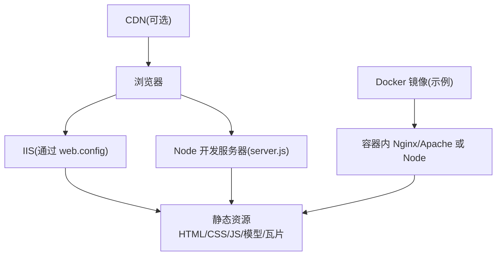
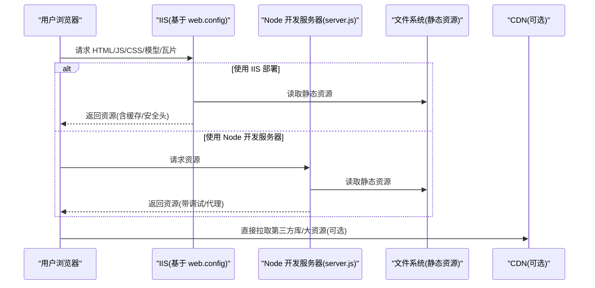
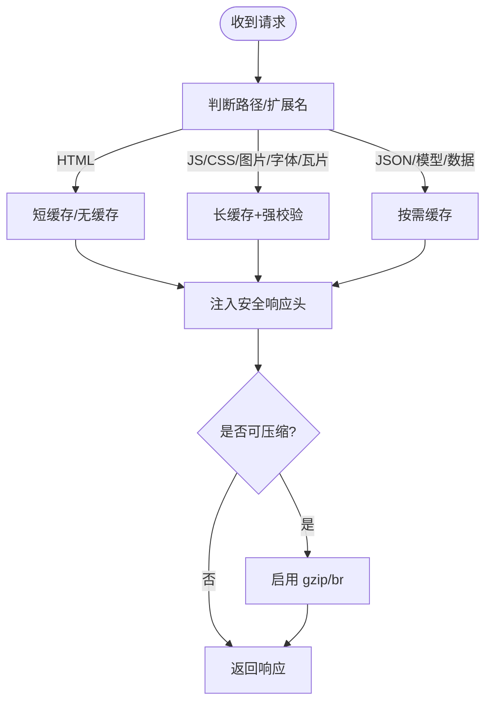
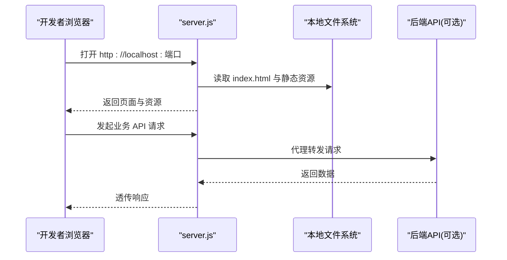
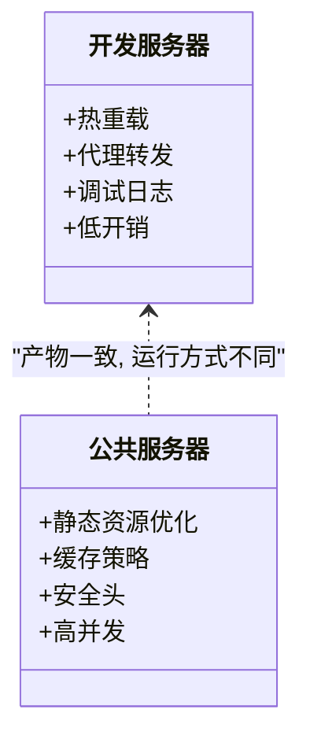
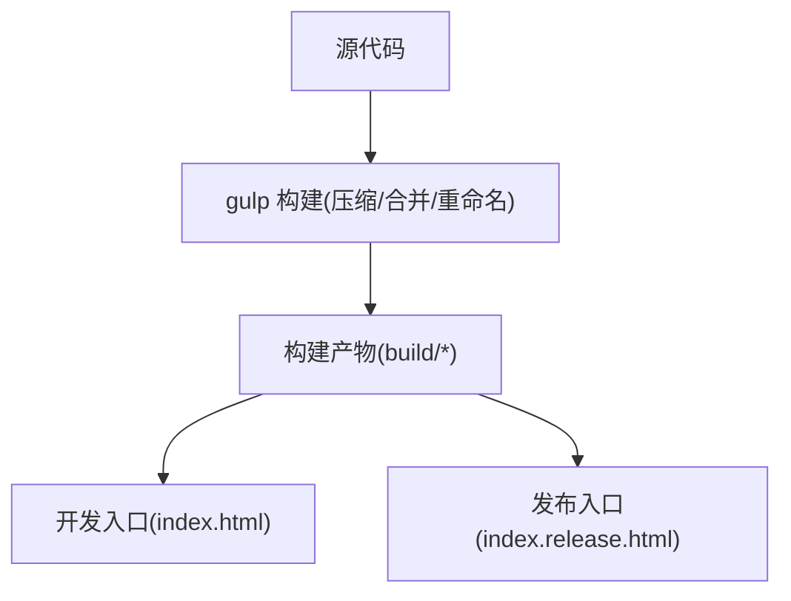
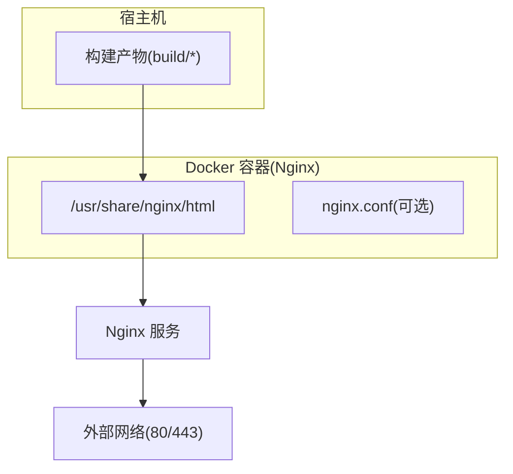
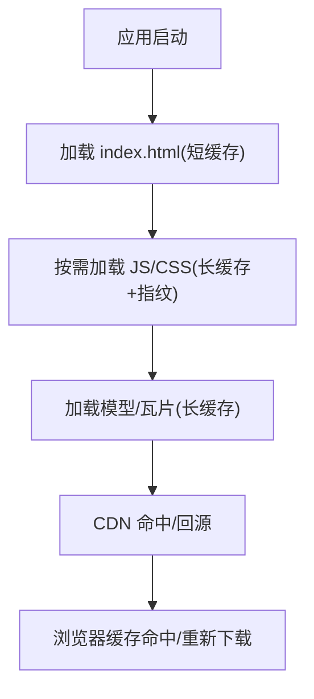
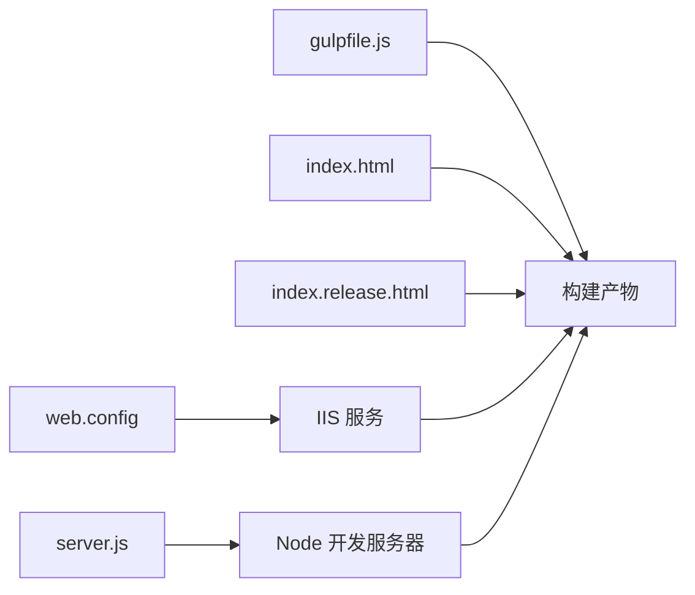

# 部署配置

<cite>
**本文引用的文件**   
- [web.config](file://web.config)
- [server.js](file://server.js)
- [package.json](file://package.json)
- [gulpfile.js](file://gulpfile.js)
- [launches/runPublicServer.launch](file://launches/runPublicServer.launch)
- [launches/runServer.launch](file://launches/runServer.launch)
- [index.html](file://index.html)
- [index.release.html](file://index.release.html)
</cite>

## 目录
1. [简介](#简介)
2. [项目结构](#项目结构)
3. [核心组件](#核心组件)
4. [架构总览](#架构总览)
5. [详细组件分析](#详细组件分析)
6. [依赖关系分析](#依赖关系分析)
7. [性能考虑](#性能考虑)
8. [故障排查指南](#故障排查指南)
9. [结论](#结论)
10. [附录](#附录)

## 简介
本文件面向将 Cesium 应用部署到 IIS、Node 本地开发服务器以及容器化环境的读者，聚焦以下目标：
- 解析 web.config 中 IIS 的静态资源处理、缓存策略与安全设置
- 说明 server.js 本地开发服务器的配置与启动选项
- 对比不同运行环境（开发服务器 vs 公共服务器）的启动差异
- 提供 Docker 容器化部署的配置示例
- 阐述 CDN 集成与静态资源优化策略
- 给出生产环境的安全加固与性能调优建议

## 项目结构
仓库根目录包含用于构建与运行的关键配置文件与脚本。与部署相关的主要文件包括：
- web.config：IIS 站点静态资源与缓存规则
- server.js：Node 本地开发服务器
- package.json：npm 脚本与环境变量入口
- gulpfile.js：构建与发布流程（压缩、合并等）
- launches/*.launch：VS Code 启动配置（本地/公共服务器）
- index.html / index.release.html：开发与发布入口页面

[此图为概念性结构图，无需来源标注]

## 核心组件
- IIS 静态资源与缓存：由 web.config 控制 MIME 类型、压缩、缓存头、访问限制等
- 本地开发服务器：server.js 提供热重载、代理、跨域调试能力
- 构建产物与入口：gulpfile.js 负责打包与优化；index.html/index.release.html 作为应用入口
- 启动脚本：package.json 中的 npm scripts 与 VS Code launch 配置统一了开发体验

章节来源
- [web.config](file://web.config)
- [server.js](file://server.js)
- [package.json](file://package.json)
- [gulpfile.js](file://gulpfile.js)
- [launches/runPublicServer.launch](file://launches/runPublicServer.launch)
- [launches/runServer.launch](file://launches/runServer.launch)
- [index.html](file://index.html)
- [index.release.html](file://index.release.html)

## 架构总览
下图展示了从浏览器到静态资源的请求路径，以及 IIS 与 Node 两种运行方式的差异。

图表来源
- [web.config](file://web.config)
- [server.js](file://server.js)

章节来源
- [web.config](file://web.config)
- [server.js](file://server.js)

## 详细组件分析

### IIS 部署与 web.config 详解
web.config 是 IIS 的核心站点配置，通常涵盖：
- 静态资源处理
  - MIME 类型映射：确保 .gltf/.glb、.ktx2、.czml、.json、.css、.js 等正确识别
  - 静态内容压缩：启用 gzip/br 以减少带宽
  - 目录浏览与默认文档：便于快速预览与首页加载
- 缓存策略
  - 针对 HTML 短缓存或无缓存，避免旧版本残留
  - 针对 JS/CSS/图片/字体/瓦片长缓存，配合文件名哈希提升命中率
  - 条件缓存：按扩展名或路径匹配设置 Cache-Control/Expires
- 安全设置
  - 禁止目录遍历与敏感文件访问
  - 强制 HTTPS、HSTS、CSP、X-Frame-Options、Referrer-Policy 等响应头
  - 请求过滤与大小限制，防止恶意请求
- 错误页与日志
  - 自定义 404/500 页面
  - 输出失败请求日志以便排障

图表来源
- [web.config](file://web.config)

章节来源
- [web.config](file://web.config)

### 本地开发服务器 server.js
server.js 提供本地开发所需的 HTTP 服务，常见能力包括：
- 静态资源托管：自动读取并返回 build 目录下的资源
- 热重载与增量更新：监听文件变化，触发刷新或模块替换
- 代理与跨域：转发 API 请求至后端，解决 CORS 问题
- 环境变量注入：根据 NODE_ENV 切换调试开关、日志级别、端口等
- 启动参数：支持命令行参数覆盖端口、根目录、代理地址等

图表来源
- [server.js](file://server.js)

章节来源
- [server.js](file://server.js)

### 运行环境差异：开发服务器 vs 公共服务器
- 开发服务器（Node）
  - 优点：热重载、源码直出、代理方便、调试友好
  - 适用：本地联调、快速迭代
- 公共服务器（IIS/Nginx/Apache）
  - 优点：高并发、静态资源高效分发、CDN 友好、安全可控
  - 适用：对外发布的稳定版本

[此图为概念性类图，无需来源标注]

章节来源
- [launches/runServer.launch](file://launches/runServer.launch)
- [launches/runPublicServer.launch](file://launches/runPublicServer.launch)
- [package.json](file://package.json)

### 构建与入口页面
- 构建流程
  - gulpfile.js 负责合并、压缩、重命名与产物输出
  - 产物目录通常为 build/Cesium 或类似结构，供 IIS/Node 托管
- 入口页面
  - index.html：开发入口，引用未压缩资源，便于调试
  - index.release.html：发布入口，引用压缩/哈希后的资源，利于缓存

图表来源
- [gulpfile.js](file://gulpfile.js)
- [index.html](file://index.html)
- [index.release.html](file://index.release.html)

章节来源
- [gulpfile.js](file://gulpfile.js)
- [index.html](file://index.html)
- [index.release.html](file://index.release.html)

### Docker 容器化部署示例
以下为通用思路与步骤（以 Nginx 为例），可根据实际产物调整：
- 准备阶段
  - 在宿主机执行构建，产出静态资源目录（如 build/Cesium）
- 编写 Dockerfile
  - 基础镜像选择 nginx:alpine
  - 将构建产物复制到 /usr/share/nginx/html
  - 可选：挂载外部配置覆盖默认行为
- 运行容器
  - 映射 80/443 端口
  - 挂载证书与日志目录
- 反向代理与 HTTPS
  - 使用 Ingress 或反向代理（如 Traefik/HAProxy）统一出口
  - 开启 HSTS、TLS 1.2+、现代密码套件

[此图为概念性架构图，无需来源标注]

章节来源
- [gulpfile.js](file://gulpfile.js)

### CDN 集成与静态资源优化
- 资源拆分与指纹
  - 对 JS/CSS/字体/瓦片进行文件名哈希，实现长期缓存
  - HTML 保持短缓存或无缓存，确保新版本及时生效
- 预加载与优先级
  - 对首屏关键资源使用 preload/prefetch
  - 合理设置 fetchpriority 与资源优先级
- 传输优化
  - 启用 gzip/br 压缩
  - 使用 HTTP/2 多路复用
- 缓存一致性
  - 通过版本号或查询字符串控制缓存失效
  - 结合 ETag/Last-Modified 减少重复传输

[此图为概念性流程图，无需来源标注]

章节来源
- [web.config](file://web.config)
- [index.html](file://index.html)
- [index.release.html](file://index.release.html)

### 生产环境安全配置与性能调优建议
- 安全
  - 强制 HTTPS，启用 HSTS
  - 设置 CSP、X-Frame-Options、Referrer-Policy、Permissions-Policy
  - 禁用不必要的 HTTP 方法，限制请求体大小
  - 隐藏服务器版本信息，最小化暴露面
- 性能
  - 启用静态压缩与 HTTP/2
  - 合理设置缓存头，区分 HTML 与静态资源
  - 使用连接池与 Keep-Alive
  - 监控带宽与 CPU，必要时扩容或引入边缘节点

章节来源
- [web.config](file://web.config)

## 依赖关系分析
- 运行时依赖
  - IIS：承载静态资源，受 web.config 控制
  - Node：本地开发服务器，由 server.js 驱动
- 构建依赖
  - gulpfile.js：定义构建任务与产物结构
- 入口依赖
  - index.html/index.release.html：决定加载的资源集合与顺序

图表来源
- [web.config](file://web.config)
- [server.js](file://server.js)
- [gulpfile.js](file://gulpfile.js)
- [index.html](file://index.html)
- [index.release.html](file://index.release.html)

章节来源
- [web.config](file://web.config)
- [server.js](file://server.js)
- [gulpfile.js](file://gulpfile.js)
- [index.html](file://index.html)
- [index.release.html](file://index.release.html)

## 性能考虑
- 静态资源分层缓存：HTML 短缓存，其他长缓存
- 压缩与传输：gzip/br、HTTP/2、Keep-Alive
- 资源体积：按需加载、懒加载、分块加载
- 缓存命中：文件名哈希、ETag/Last-Modified
- 服务端优化：连接池、线程池、内存映射、磁盘 IO 优化
- 观测与度量：首字节时间、TTFB、LCP、FCP、缓存命中率

[本节为通用指导，无需来源标注]

## 故障排查指南
- IIS 常见问题
  - 404：检查 MIME 映射与路径重写
  - 403：检查目录浏览与权限
  - 500：查看 IIS 日志与自定义错误页
- Node 开发服务器
  - 端口占用：更换端口或释放占用进程
  - 代理失败：检查后端可达性与 CORS 配置
  - 热重载不生效：确认监听目录与忽略规则
- 缓存相关问题
  - 版本未更新：清理浏览器缓存或强制刷新
  - 瓦片/模型加载异常：核对 URL 与跨域策略

章节来源
- [web.config](file://web.config)
- [server.js](file://server.js)

## 结论
通过将 web.config 与 server.js 分别用于生产与开发场景，并结合构建产物与入口页面的差异化配置，可实现高效的 Cesium 应用部署。配合 CDN、压缩与缓存策略，以及严格的安全头与 HTTPS 策略，可在保证性能的同时提升安全性与稳定性。容器化部署则进一步提升了可移植性与一致性。

[本节为总结性内容，无需来源标注]

## 附录
- 常用命令与脚本
  - 使用 npm scripts 启动开发服务器或执行构建任务
  - 使用 VS Code launch 配置一键启动本地/公共服务器
- 参考入口
  - 开发入口：index.html
  - 发布入口：index.release.html

章节来源
- [package.json](file://package.json)
- [launches/runServer.launch](file://launches/runServer.launch)
- [launches/runPublicServer.launch](file://launches/runPublicServer.launch)
- [index.html](file://index.html)
- [index.release.html](file://index.release.html)