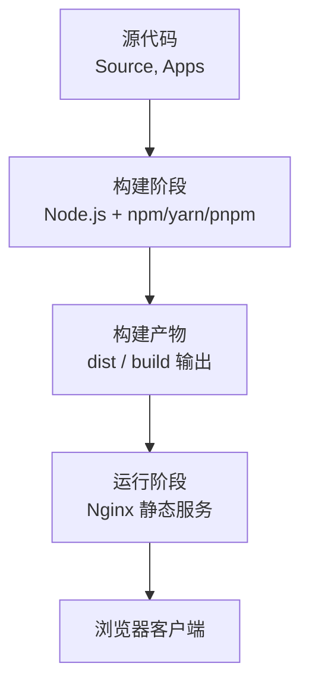
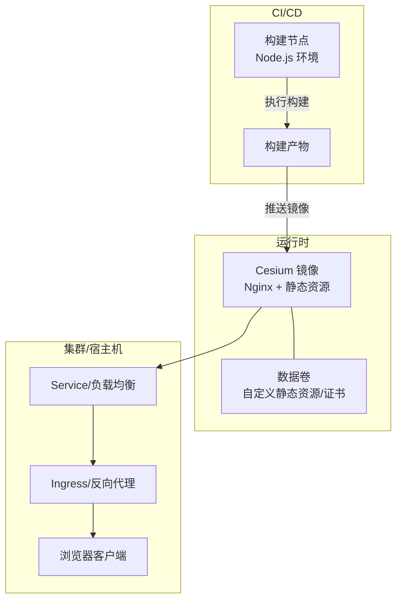
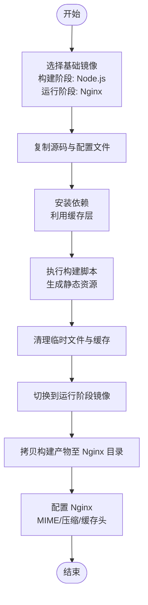
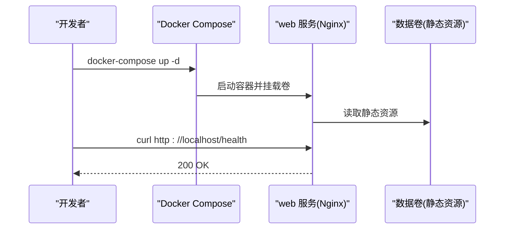
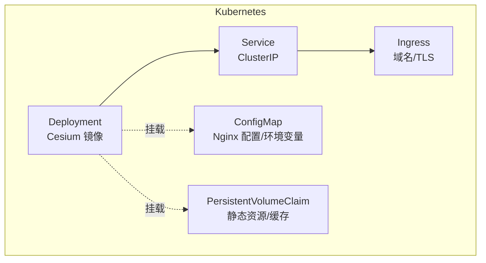
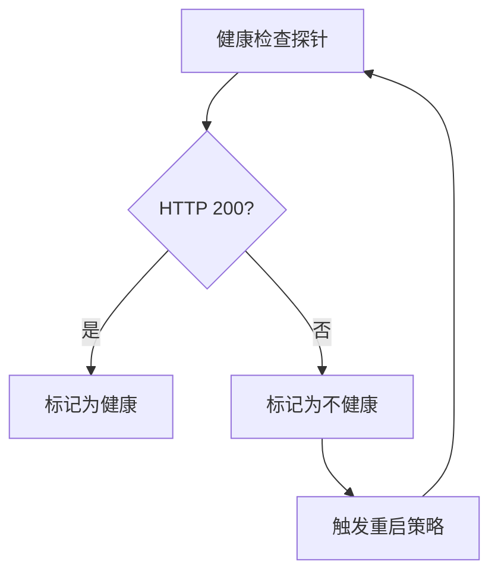
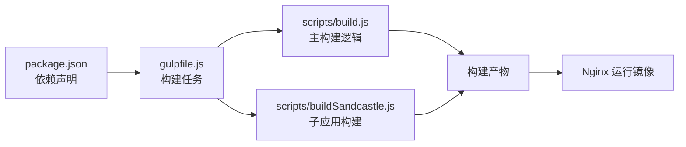

# Docker容器化部署

<cite>
**本文引用的文件**   
- [README.md](file://README.md)
- [package.json](file://package.json)
- [server.js](file://server.js)
- [index.html](file://index.html)
- [index.release.html](file://index.release.html)
- [gulpfile.js](file://gulpfile.js)
- [gulpfile.apps.js](file://gulpfile.apps.js)
- [scripts/build.js](file://scripts/build.js)
- [scripts/buildSandcastle.js](file://scripts/buildSandcastle.js)
</cite>

## 目录
1. [简介](#简介)
2. [项目结构](#项目结构)
3. [核心组件](#核心组件)
4. [架构总览](#架构总览)
5. [详细组件分析](#详细组件分析)
6. [依赖分析](#依赖分析)
7. [性能考虑](#性能考虑)
8. [故障排查指南](#故障排查指南)
9. [结论](#结论)
10. [附录](#附录)

## 简介
本指南面向希望在生产环境中以容器方式运行 Cesium 静态资源与示例应用的团队，提供从镜像构建、编排、安全加固到可观测性与高可用的完整实践。仓库本身为前端工程，包含构建脚本与本地开发服务器；本文将基于现有构建产物与服务入口，给出多阶段构建优化、Docker Compose 编排、Kubernetes 部署、监控日志与健康检查的落地方案。

## 项目结构
Cesium 仓库采用典型的前端工程组织：源码位于 Source、示例与应用位于 Apps、构建与工具位于 Tools 与 scripts，根目录包含 package.json、gulpfile 与 server.js 等关键入口。容器化主要围绕以下目标：
- 使用 Node.js 环境执行构建流程，产出静态资源（HTML/CSS/JS/媒体）
- 将静态资源交由轻量 HTTP 服务器（如 Nginx）对外提供服务
- 通过环境变量与数据卷实现配置与数据的解耦

[本节为概念性说明，不直接分析具体文件]

## 核心组件
- 构建系统
  - 使用 gulpfile.js 与 scripts/build.js 驱动构建流程，生成最终静态资源
  - 支持应用级构建脚本（如 scripts/buildSandcastle.js），用于特定子应用或文档站点的构建
- 本地服务
  - server.js 提供本地开发服务器能力，便于调试与预览
- 入口页面
  - index.html 与 index.release.html 作为默认访问入口，容器化后由 Nginx 指向构建后的对应文件

**章节来源**
- [gulpfile.js](file://gulpfile.js)
- [scripts/build.js](file://scripts/build.js)
- [scripts/buildSandcastle.js](file://scripts/buildSandcastle.js)
- [server.js](file://server.js)
- [index.html](file://index.html)
- [index.release.html](file://index.release.html)

## 架构总览
下图展示推荐的容器化架构：构建阶段在 CI/CD 中完成，运行阶段仅包含静态资源与 Nginx，外部通过 Ingress 暴露。

[本节为概念性架构图，未映射到具体源文件]

## 详细组件分析

### 构建阶段与多阶段镜像优化
- 构建阶段
  - 使用 Node.js 基础镜像安装依赖并执行构建命令，产出静态资源
  - 利用缓存层（依赖包、中间产物）提升重复构建速度
- 运行阶段
  - 使用精简型 Nginx 镜像，仅拷贝构建产物，避免携带构建工具链
- 体积优化策略
  - 多阶段构建：仅在构建阶段保留 Node.js 与构建工具，运行阶段仅含 Nginx 与产物
  - 清理缓存：在单条 RUN 指令内完成安装、构建与清理，减少镜像层数
  - 选择最小基础镜像：例如 alpine 变体，禁用不必要的模块
  - 合理设置 .dockerignore：排除 node_modules、测试数据、文档与无关目录
  - 预编译与并行构建：根据项目脚本启用并行选项（若可用）

[本节为通用构建流程示意，未映射到具体源文件]

### Docker Compose 编排
- 服务定义
  - web：基于 Cesium 镜像，暴露 80 端口，挂载自定义静态资源或证书卷
  - 可选 reverse-proxy：如需 HTTPS 终止或更复杂路由，可在 compose 中引入反向代理服务
- 网络配置
  - 使用默认桥接网络，必要时创建自定义网络隔离
- 数据卷管理
  - 将外部静态资源、地图瓦片、模型等放入卷，便于热更新与共享
- 环境变量
  - 通过环境变量注入 API 地址、CORS 白名单、日志级别等
- 健康检查与重启策略
  - 对 web 服务添加 HTTP 健康检查，失败自动重启

[本节为概念性编排流程，未映射到具体源文件]

### Kubernetes 部署
- Deployment
  - 指定镜像、副本数、资源限制与探针（就绪/存活）
- Service
  - ClusterIP 类型，暴露内部端口供 Ingress 使用
- Ingress
  - 配置域名、TLS 与路径转发
- 配置与数据
  - 使用 ConfigMap 注入 Nginx 配置与环境变量
  - 使用 PersistentVolumeClaim 挂载静态资源或缓存目录
- 滚动更新与回滚
  - 利用 kubectl rollout 进行灰度发布与快速回滚

[本节为概念性 K8s 架构图，未映射到具体源文件]

### 安全最佳实践
- 用户权限
  - 运行阶段使用非 root 用户，最小权限原则
- 环境变量与敏感信息
  - 使用 Secrets 管理密钥与令牌，避免硬编码
  - 通过环境变量注入运行时配置
- 镜像安全
  - 定期扫描镜像漏洞，使用受信任的基础镜像
  - 固定基础镜像版本标签，避免 latest
- 网络安全
  - 仅暴露必要端口，结合 Ingress 做 TLS 终止与访问控制
- 文件系统
  - 只读根文件系统，需要写入的路径使用空目录卷

[本节为通用安全建议，未映射到具体源文件]

### 监控与日志收集
- 指标采集
  - 暴露 Nginx stub_status 或通过 Sidecar 采集请求量、延迟、错误率
- 日志收集
  - 将 Nginx access/error 日志输出到 stdout/stderr，由容器运行时统一收集
- 告警规则
  - 针对 5xx 比例、P99 延迟、磁盘使用率设置阈值告警

[本节为通用可观测性建议，未映射到具体源文件]

### 健康检查与自动重启
- 健康检查
  - 在容器层面增加 HTTP 探针，检查根路径或专用 /health 接口
- 自动重启
  - 配置 restart policy（如 always 或 on-failure），确保异常退出时自动恢复
- 就绪探针
  - 在 K8s 中使用 readinessProbe 控制流量接入时机

[本节为概念性健康检查流程，未映射到具体源文件]

## 依赖分析
- 构建依赖
  - Node.js 运行时与包管理器（npm/yarn/pnpm）
  - Gulp 任务系统与相关插件（由 gulpfile.js 驱动）
  - 构建脚本（scripts/build.js、scripts/buildSandcastle.js）
- 运行依赖
  - Nginx（静态资源服务）
  - 可选：反向代理、TLS 证书、外部静态资源卷

**章节来源**
- [package.json](file://package.json)
- [gulpfile.js](file://gulpfile.js)
- [scripts/build.js](file://scripts/build.js)
- [scripts/buildSandcastle.js](file://scripts/buildSandcastle.js)

## 性能考虑
- 构建期
  - 启用依赖缓存与增量构建，减少冷构建时间
  - 并行任务与分阶段构建，降低 I/O 压力
- 运行期
  - 开启 gzip/brotli 压缩，合理设置缓存头
  - 使用 CDN 分发静态资源，降低中心负载
  - 调整 Nginx worker 进程与连接池参数，匹配实例规格
- 存储
  - 将热点静态资源置于高性能卷或对象存储，配合缓存策略

[本节为通用性能建议，未映射到具体源文件]

## 故障排查指南
- 构建失败
  - 检查 Node.js 版本与包管理器一致性
  - 确认依赖安装是否成功，查看构建日志定位错误栈
- 服务不可用
  - 验证健康检查路径是否可达
  - 检查 Nginx 配置与静态资源路径是否正确挂载
- 权限问题
  - 确认运行用户具备读取静态资源的权限
  - 检查卷挂载点与 SELinux/AppArmor 策略
- 网络与证书
  - 校验 Ingress 域名解析与 TLS 证书有效性
  - 检查 CORS 配置与跨域白名单

[本节为通用排障建议，未映射到具体源文件]

## 结论
通过将 Cesium 的构建与运行解耦，采用多阶段镜像与轻量 Nginx 运行环境，可以在保证安全与可维护性的同时获得良好的性能与可扩展性。结合 Compose 与 Kubernetes 的编排能力，可实现从本地到生产的一体化交付与运维体验。

[本节为总结性内容，未映射到具体源文件]

## 附录
- 参考入口与脚本
  - README.md：项目概览与使用说明
  - package.json：依赖与脚本入口
  - server.js：本地开发服务器
  - index.html/index.release.html：默认访问入口

**章节来源**
- [README.md](file://README.md)
- [package.json](file://package.json)
- [server.js](file://server.js)
- [index.html](file://index.html)
- [index.release.html](file://index.release.html)