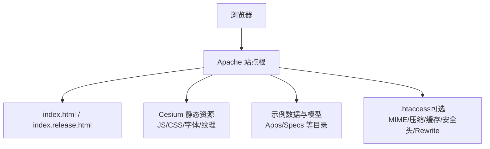
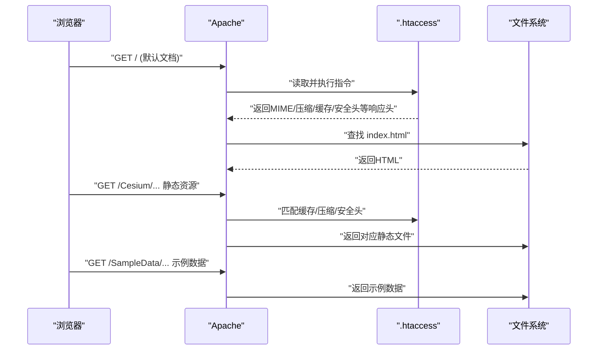
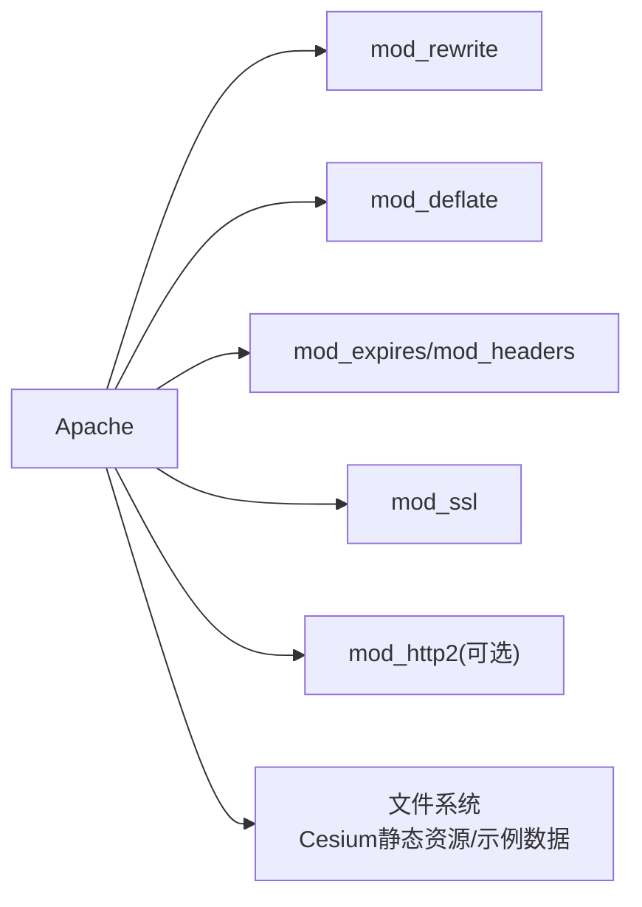

# Apache服务器配置

<cite>
**本文引用的文件**   
- [README.md](file://README.md)
- [server.js](file://server.js)
- [index.html](file://index.html)
- [index.release.html](file://index.release.html)
- [web.config](file://web.config)
</cite>

## 目录
1. [简介](#简介)
2. [项目结构](#项目结构)
3. [核心组件](#核心组件)
4. [架构总览](#架构总览)
5. [详细组件分析](#详细组件分析)
6. [依赖分析](#依赖分析)
7. [性能考虑](#性能考虑)
8. [故障排查指南](#故障排查指南)
9. [结论](#结论)
10. [附录](#附录)

## 简介
本指南面向在Apache上部署Cesium静态资源的运维与开发者，提供从MIME类型、压缩、缓存、安全头到Rewrite路由、虚拟主机与SSL、大文件传输与并发优化、错误日志与调试的完整实践。内容基于仓库中已存在的Web入口与示例配置文件进行说明，确保与实际资源路径和构建产物保持一致。

## 项目结构
Cesium仓库包含可直接用于本地或生产部署的静态资源入口与示例：
- 应用入口页面位于根目录，便于直接作为站点根发布
- 示例数据与模型分布在Apps与Specs等目录，供演示与测试使用
- 提供Node开发服务器脚本，便于本地快速验证
- 提供IIS web.config示例，可作为Apache配置的参考对照

[本节为概念性概述，不直接分析具体文件]

## 核心组件
- 站点根入口：index.html 与 index.release.html 作为默认文档，适合将站点根指向仓库根目录
- 静态资源：Cesium库、示例数据、模型、瓦片等均为静态文件，由Apache直接响应
- 开发服务器：server.js 提供本地HTTP服务，可用于验证资源路径与跨域行为
- IIS示例：web.config 展示了常见MIME与安全头的设置思路，可迁移至Apache

章节来源
- [README.md:1-200](file://README.md#L1-L200)
- [server.js:1-200](file://server.js#L1-L200)
- [index.html:1-200](file://index.html#L1-L200)
- [index.release.html:1-200](file://index.release.html#L1-L200)
- [web.config:1-200](file://web.config#L1-L200)

## 架构总览
下图展示浏览器访问Cesium站点时的典型请求路径与关键处理点，包括静态资源、示例数据与可能的重写规则。

图表来源
- [index.html:1-200](file://index.html#L1-L200)
- [index.release.html:1-200](file://index.release.html#L1-L200)
- [web.config:1-200](file://web.config#L1-L200)

## 详细组件分析

### .htaccess 配置要点
- MIME类型定义
  - 目标：确保Cesium所需的扩展名被正确识别，避免浏览器以未知类型下载
  - 建议覆盖：glTF/glb、KTX2/Basis、3DTiles相关JSON与二进制、WASM、CSS/JS、字体、图片、视频等
  - 参考：web.config 中的MIME映射思路可迁移至Apache的AddType/AddEncoding
- Gzip压缩启用
  - 目标：对文本类资源启用压缩，降低带宽占用
  - 建议：启用mod_deflate，针对JS/CSS/JSON/XML/HTML/字体等；注意不要对已压缩的二进制重复压缩
- 浏览器缓存控制
  - 目标：提升二次访问速度，减少服务器压力
  - 建议：对带指纹的静态资源设置长期缓存；对动态或频繁更新的资源设置较短缓存
  - 工具：mod_expires 或 mod_headers 设置Cache-Control/Expires
- HTTP安全头
  - 目标：增强安全性，防止常见攻击面
  - 建议：X-Content-Type-Options、X-Frame-Options/X-Frame-Mode、Referrer-Policy、Permissions-Policy、Strict-Transport-Security（HTTPS下）
- RewriteRule 路由与静态资源
  - 目标：支持SPA式路由或统一入口；同时保证静态资源优先命中
  - 建议：先匹配已知静态资源与示例数据目录，再回退到默认文档；避免循环重写
  - 注意：保持与Cesium内部相对路径一致，避免404

章节来源
- [web.config:1-200](file://web.config#L1-L200)
- [index.html:1-200](file://index.html#L1-L200)
- [index.release.html:1-200](file://index.release.html#L1-L200)

### 虚拟主机与SSL配置
- 基本VirtualHost
  - 监听端口：80（HTTP）、443（HTTPS）
  - DocumentRoot：指向仓库根目录或构建输出目录
  - Directory权限：允许读取静态资源，必要时限制目录浏览
- SSL证书配置
  - 启用mod_ssl，加载证书与私钥
  - 建议开启HSTS，强制HTTPS访问
- HTTPS重定向
  - 将HTTP请求301重定向到HTTPS
  - 可通过.htaccess或VirtualHost级别实现
- 反向代理（可选）
  - 如需与后端API同域部署，可在同一域名下通过路径区分，避免跨域问题

章节来源
- [web.config:1-200](file://web.config#L1-L200)
- [index.html:1-200](file://index.html#L1-L200)

### 大文件传输与并发访问优化
- 大文件传输
  - 调整客户端最大请求体大小（如上传场景）
  - 合理设置KeepAlive与连接复用，减少握手开销
  - 对瓦片与模型等资源启用分块传输与范围请求（Range），提升断点续传体验
- 并发与吞吐
  - 根据CPU与内存调整Apache工作进程/线程模型（prefork/worker/event）
  - 启用HTTP/2，提升多路复用能力
  - 结合CDN缓存热点资源，减轻源站压力
- 磁盘与IO
  - 将静态资源放置于高性能磁盘或对象存储
  - 利用操作系统页缓存与预读策略

章节来源
- [README.md:1-200](file://README.md#L1-L200)
- [server.js:1-200](file://server.js#L1-L200)

### 错误日志与调试技巧
- 日志级别与轮转
  - 设置合理的LogLevel（warn/error/info/debug）
  - 配置错误日志与访问日志分离，定期轮转
- 常见问题定位
  - 404：检查DocumentRoot与Rewrite规则是否遗漏静态资源路径
  - 403：确认目录权限与AllowOverride设置
  - 413：检查请求体大小限制
  - 跨域失败：核对CORS与安全头配置
- 浏览器侧调试
  - 查看网络面板的MIME类型、缓存命中情况与压缩状态
  - 使用开发者工具的“禁用缓存”对比首屏与二次渲染差异

章节来源
- [README.md:1-200](file://README.md#L1-L200)

## 依赖分析
- 运行时依赖
  - Apache模块：mod_rewrite、mod_deflate、mod_expires、mod_headers、mod_ssl、mod_http2（可选）
  - 浏览器特性：HTTP/2、缓存、安全头解析
- 资源依赖
  - Cesium静态资源与示例数据需与入口HTML路径一致
  - 若使用自定义域名或子路径，需在Rewrite与资源引用中保持一致

图表来源
- [web.config:1-200](file://web.config#L1-L200)
- [index.html:1-200](file://index.html#L1-L200)

章节来源
- [web.config:1-200](file://web.config#L1-L200)
- [index.html:1-200](file://index.html#L1-L200)

## 性能考虑
- 启用Gzip/Br压缩，优先对文本类资源生效
- 合理设置缓存策略，对带版本号的静态资源设置长期缓存
- 使用HTTP/2与KeepAlive，减少连接建立成本
- 对大体积模型与瓦片启用Range请求，提升加载体验
- 结合CDN缓存热点资源，降低源站负载
- 监控与压测：关注首字节时间、TTFB、缓存命中率与带宽占用

[本节为通用指导，不直接分析具体文件]

## 故障排查指南
- 症状：页面空白或资源404
  - 检查DocumentRoot与入口文件路径
  - 核查Rewrite规则是否误拦截静态资源
- 症状：跨域报错
  - 核对CORS与安全头配置，确保同源或显式授权
- 症状：大文件加载缓慢
  - 检查压缩与缓存策略，确认HTTP/2与KeepAlive启用
  - 评估网络带宽与服务器并发参数
- 症状：HTTPS无法访问
  - 确认SSL证书有效且链完整，检查HSTS与重定向逻辑

章节来源
- [README.md:1-200](file://README.md#L1-L200)

## 结论
通过在Apache上正确配置MIME类型、压缩、缓存、安全头与Rewrite规则，并结合虚拟主机与SSL、HTTP/2与大文件优化，可以稳定高效地部署Cesium静态资源。配合完善的日志与调试手段，能够快速定位并解决常见问题，保障用户体验与系统稳定性。

[本节为总结性内容，不直接分析具体文件]

## 附录
- 常用Apache模块清单
  - mod_rewrite：URL重写与路由
  - mod_deflate：Gzip压缩
  - mod_expires/mod_headers：缓存控制
  - mod_ssl：HTTPS与证书
  - mod_http2：HTTP/2支持（可选）
- 参考对照
  - web.config 提供了MIME与安全头的示例思路，可迁移至Apache配置
  - server.js 可用于本地快速验证资源路径与跨域行为

章节来源
- [web.config:1-200](file://web.config#L1-L200)
- [server.js:1-200](file://server.js#L1-L200)