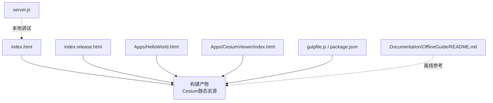
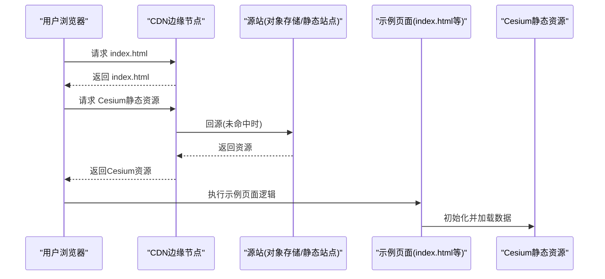
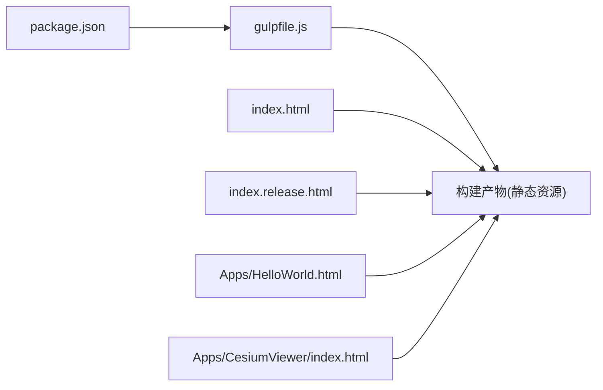

# CDN集成配置

<cite>
**本文引用的文件**   
- [README.md](file://README.md)
- [index.html](file://index.html)
- [index.release.html](file://index.release.html)
- [server.js](file://server.js)
- [gulpfile.js](file://gulpfile.js)
- [package.json](file://package.json)
- [Apps/HelloWorld.html](file://Apps/HelloWorld.html)
- [Apps/CesiumViewer/index.html](file://Apps/CesiumViewer/index.html)
- [Apps/CesiumViewer/CesiumViewer.js](file://Apps/CesiumViewer/CesiumViewer.js)
- [Documentation/OfflineGuide/README.md](file://Documentation/OfflineGuide/README.md)
</cite>

## 目录
1. [简介](#简介)
2. [项目结构](#项目结构)
3. [核心组件](#核心组件)
4. [架构总览](#架构总览)
5. [详细组件分析](#详细组件分析)
6. [依赖分析](#依赖分析)
7. [性能考虑](#性能考虑)
8. [故障排查指南](#故障排查指南)
9. [结论](#结论)
10. [附录](#附录)

## 简介
本指南面向将Cesium静态资源部署到主流CDN（CloudFlare、AWS CloudFront、Azure CDN等）的工程团队，提供从构建产物组织、版本化与缓存策略、跨域资源共享(CORS)、资源加载优化到监控与性能分析的完整实践。文档基于仓库中的示例页面与构建脚本进行分析，确保建议与现有工程结构一致。

## 项目结构
仓库包含用于演示的HTML入口与构建脚本，便于理解如何产出可分发至CDN的静态资源：
- 根级入口与发布入口：index.html、index.release.html
- 示例应用：Apps/HelloWorld.html、Apps/CesiumViewer/index.html
- 构建与打包：gulpfile.js、package.json
- 本地开发服务器：server.js
- 离线使用指南：Documentation/OfflineGuide/README.md

图表来源
- [index.html:1-200](file://index.html#L1-L200)
- [index.release.html:1-200](file://index.release.html#L1-L200)
- [Apps/HelloWorld.html:1-200](file://Apps/HelloWorld.html#L1-L200)
- [Apps/CesiumViewer/index.html:1-200](file://Apps/CesiumViewer/index.html#L1-L200)
- [gulpfile.js:1-200](file://gulpfile.js#L1-L200)
- [package.json:1-200](file://package.json#L1-L200)
- [server.js:1-200](file://server.js#L1-L200)
- [Documentation/OfflineGuide/README.md:1-200](file://Documentation/OfflineGuide/README.md#L1-L200)

章节来源
- [README.md:1-200](file://README.md#L1-L200)
- [index.html:1-200](file://index.html#L1-L200)
- [index.release.html:1-200](file://index.release.html#L1-L200)
- [Apps/HelloWorld.html:1-200](file://Apps/HelloWorld.html#L1-L200)
- [Apps/CesiumViewer/index.html:1-200](file://Apps/CesiumViewer/index.html#L1-L200)
- [gulpfile.js:1-200](file://gulpfile.js#L1-L200)
- [package.json:1-200](file://package.json#L1-L200)
- [server.js:1-200](file://server.js#L1-L200)
- [Documentation/OfflineGuide/README.md:1-200](file://Documentation/OfflineGuide/README.md#L1-L200)

## 核心组件
- 构建与发布产物
  - gulpfile.js与package.json定义了构建流程与依赖，输出可用于CDN分发的静态资源。
- 示例页面
  - index.html、index.release.html为根级入口；Apps/HelloWorld.html与Apps/CesiumViewer/index.html为示例应用入口，展示如何引入Cesium资源。
- 本地服务
  - server.js提供本地HTTP服务，便于在接入CDN前进行联调与验证。
- 离线指南
  - Documentation/OfflineGuide/README.md提供了离线部署思路，有助于理解资源路径与CDN部署的一致性。

章节来源
- [gulpfile.js:1-200](file://gulpfile.js#L1-L200)
- [package.json:1-200](file://package.json#L1-L200)
- [index.html:1-200](file://index.html#L1-L200)
- [index.release.html:1-200](file://index.release.html#L1-L200)
- [Apps/HelloWorld.html:1-200](file://Apps/HelloWorld.html#L1-L200)
- [Apps/CesiumViewer/index.html:1-200](file://Apps/CesiumViewer/index.html#L1-L200)
- [server.js:1-200](file://server.js#L1-L200)
- [Documentation/OfflineGuide/README.md:1-200](file://Documentation/OfflineGuide/README.md#L1-L200)

## 架构总览
下图展示了浏览器通过CDN访问Cesium静态资源的典型链路，以及示例页面与构建产物的关系。

图表来源
- [index.html:1-200](file://index.html#L1-L200)
- [index.release.html:1-200](file://index.release.html#L1-L200)
- [Apps/HelloWorld.html:1-200](file://Apps/HelloWorld.html#L1-L200)
- [Apps/CesiumViewer/index.html:1-200](file://Apps/CesiumViewer/index.html#L1-L200)

## 详细组件分析

### 构建与版本化
- 构建产物组织
  - 通过gulpfile.js与package.json定义的构建任务，生成稳定的静态资源目录结构，便于按版本发布到CDN。
- 版本化策略
  - 建议在构建阶段对文件名或目录加入版本号或哈希值，使浏览器与CDN能长期缓存且支持快速失效。
- 发布入口
  - index.release.html可作为生产入口，指向版本化的Cesium资源路径。

章节来源
- [gulpfile.js:1-200](file://gulpfile.js#L1-L200)
- [package.json:1-200](file://package.json#L1-L200)
- [index.release.html:1-200](file://index.release.html#L1-L200)

### 示例页面与资源引入
- 根级入口
  - index.html作为默认入口，便于本地与CDN环境统一测试。
- 示例应用
  - Apps/HelloWorld.html与Apps/CesiumViewer/index.html展示了如何在页面中引入Cesium资源并进行初始化。
- 资源路径一致性
  - 确保示例页面中的资源路径与CDN部署路径一致，避免跨域与404问题。

章节来源
- [index.html:1-200](file://index.html#L1-L200)
- [Apps/HelloWorld.html:1-200](file://Apps/HelloWorld.html#L1-L200)
- [Apps/CesiumViewer/index.html:1-200](file://Apps/CesiumViewer/index.html#L1-L200)

### 本地开发与CDN联调
- 本地服务
  - server.js提供本地HTTP服务，可在接入CDN前验证资源加载、缓存头与跨域行为。
- 联调建议
  - 在本地模拟CDN响应头（如Cache-Control、ETag），以提前发现缓存与失效问题。

章节来源
- [server.js:1-200](file://server.js#L1-L200)

### 离线部署参考
- 离线指南
  - Documentation/OfflineGuide/README.md提供了离线部署的思路与注意事项，有助于理解资源路径与CDN部署的一致性。

章节来源
- [Documentation/OfflineGuide/README.md:1-200](file://Documentation/OfflineGuide/README.md#L1-L200)

## 依赖分析
- 构建依赖
  - package.json声明了构建与打包所需的依赖，配合gulpfile.js完成资源处理与输出。
- 运行时依赖
  - 示例页面依赖Cesium静态资源，需确保CDN上存在对应版本与路径。

图表来源
- [package.json:1-200](file://package.json#L1-L200)
- [gulpfile.js:1-200](file://gulpfile.js#L1-L200)
- [index.html:1-200](file://index.html#L1-L200)
- [index.release.html:1-200](file://index.release.html#L1-L200)
- [Apps/HelloWorld.html:1-200](file://Apps/HelloWorld.html#L1-L200)
- [Apps/CesiumViewer/index.html:1-200](file://Apps/CesiumViewer/index.html#L1-L200)

章节来源
- [package.json:1-200](file://package.json#L1-L200)
- [gulpfile.js:1-200](file://gulpfile.js#L1-L200)

## 性能考虑
- 缓存策略
  - 对Cesium静态资源设置长缓存时间，并通过版本化或内容哈希实现精准失效。
- 预取与预连接
  - 在示例页面中对关键资源使用预取与预连接，降低首屏延迟。
- 懒加载与按需加载
  - 对非首屏模块采用懒加载，减少初始包体与网络开销。
- 资源分片与并行
  - 合理拆分大资源，利用浏览器并发限制提升整体吞吐。
- 压缩与传输优化
  - 启用Gzip/Brotli压缩，开启HTTP/2或多路复用，减少RTT与头部开销。
- 边缘缓存优化
  - 根据地域与用户分布调整缓存TTL与热点预热策略，提升命中率。

[本节为通用性能建议，不直接分析具体文件]

## 故障排查指南
- 常见问题定位
  - 检查示例页面是否引用正确的CDN资源路径，确认无404错误。
  - 验证CDN缓存头是否正确设置，避免旧版本资源被长期缓存。
  - 若涉及跨域数据或服务，检查CORS响应头是否允许当前域名与方法。
- 本地复现与验证
  - 使用server.js启动本地服务，模拟CDN响应头与跨域场景，逐步缩小问题范围。
- 日志与指标
  - 结合浏览器开发者工具与CDN访问日志，关注首次字节时间(FCT)、缓存命中率与错误率。

章节来源
- [server.js:1-200](file://server.js#L1-L200)
- [index.html:1-200](file://index.html#L1-L200)
- [index.release.html:1-200](file://index.release.html#L1-L200)
- [Apps/HelloWorld.html:1-200](file://Apps/HelloWorld.html#L1-L200)
- [Apps/CesiumViewer/index.html:1-200](file://Apps/CesiumViewer/index.html#L1-L200)

## 结论
通过将Cesium静态资源与示例页面统一部署到CDN，并结合版本化、缓存策略与跨域配置，可获得稳定高效的全球分发体验。建议在构建阶段固化资源路径与版本信息，在发布后持续监控性能指标并及时优化缓存与加载策略。

[本节为总结性内容，不直接分析具体文件]

## 附录
- 相关参考
  - README.md提供项目概览与使用说明，可作为进一步了解的起点。

章节来源
- [README.md:1-200](file://README.md#L1-L200)