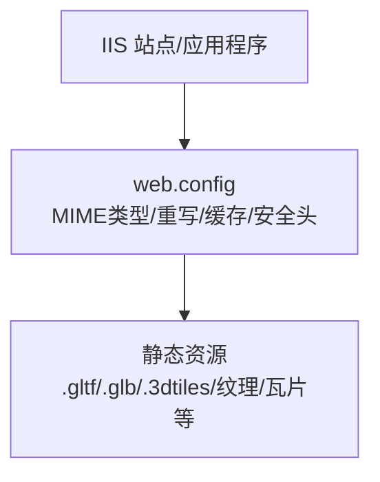
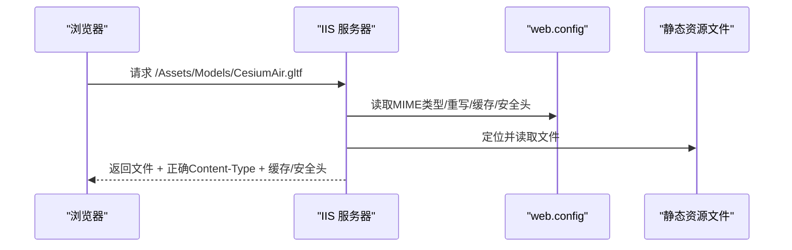
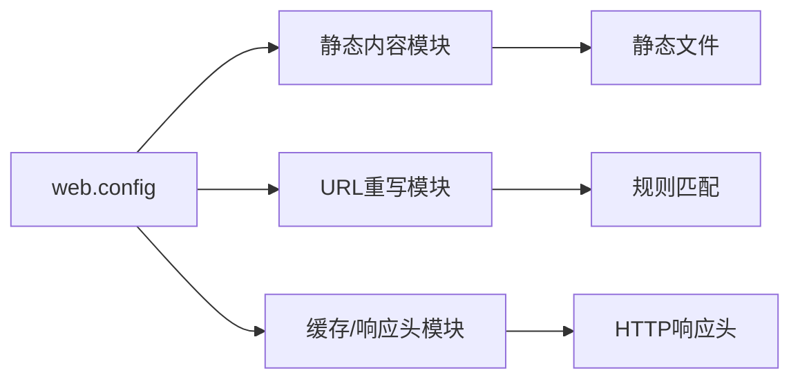

# IIS服务器配置

<cite>
**本文引用的文件**   
- [web.config](file://web.config)
</cite>

## 目录
1. [简介](#简介)
2. [项目结构](#项目结构)
3. [核心组件](#核心组件)
4. [架构总览](#架构总览)
5. [详细组件分析](#详细组件分析)
6. [依赖分析](#依赖分析)
7. [性能考虑](#性能考虑)
8. [故障排除指南](#故障排除指南)
9. [结论](#结论)
10. [附录](#附录)

## 简介
本指南面向在IIS上部署Cesium静态资源（如gltf、glb、3dtiles、纹理、瓦片等）的运维与开发人员，提供基于web.config的完整配置说明。内容涵盖MIME类型映射、URL重写规则、缓存控制策略与安全响应头配置，并给出针对Cesium静态资源的最佳实践与常见问题排查方法。

## 项目结构
仓库根目录包含一个用于IIS的配置文件 web.config，用于定义MIME类型、URL重写、缓存与安全头等站点级行为。该文件可直接放入IIS站点的根目录或子应用目录中生效。

图表来源
- [web.config:1-200](file://web.config#L1-L200)

章节来源
- [web.config:1-200](file://web.config#L1-L200)

## 核心组件
- MIME类型映射：为Cesium常用扩展名注册正确的Content-Type，避免浏览器将二进制模型或瓦片当作文本处理。
- URL重写：统一资源路径、隐藏技术细节、支持跨域或代理场景下的路径规范化。
- 缓存控制：通过Cache-Control与ETag提升首屏与后续加载性能。
- 安全响应头：设置X-Frame-Options、X-Content-Type-Options、Referrer-Policy等，增强安全性。

章节来源
- [web.config:1-200](file://web.config#L1-L200)

## 架构总览
下图展示了浏览器请求Cesium静态资源时，IIS如何依据web.config进行解析与响应。

图表来源
- [web.config:1-200](file://web.config#L1-L200)

## 详细组件分析

### MIME类型映射
- 目标：确保IIS对Cesium相关扩展名返回正确的Content-Type，避免404或错误解析。
- 建议覆盖的扩展名（示例）：
  - glTF/glb：.gltf、.glb
  - 3D Tiles：.3dtiles、.json（tileset.json）、.bin（可选）
  - 纹理：.png、.jpg、.jpeg、.ktx2、.webp
  - 地形/矢量瓦片：.quantized-mesh、.mvt、.geojson
  - 其他：.css、.js、.woff2、.ttf、.svg
- 配置要点：
  - 使用静态MIME映射条目，按扩展名指定MIME类型。
  - 若存在同名但不同用途的扩展，需分别映射。
  - 对于未预置的扩展，优先采用标准IANA MIME类型。

章节来源
- [web.config:1-200](file://web.config#L1-L200)

### URL重写规则
- 目标：
  - 将外部数据源路径重写到内部目录，便于权限与缓存管理。
  - 统一API前缀，屏蔽后端实现细节。
  - 支持跨域或反向代理时的路径归一化。
- 常见模式：
  - 将 /data/** 重写到 /static/data/**
  - 将 /api/tilesets/** 重写到 /static/3dtiles/**
  - 将 /models/** 重写到 /static/models/**
- 注意事项：
  - 保持重写顺序，避免冲突。
  - 对大体积资源（glb、3dtiles）启用压缩与缓存。
  - 避免对JSON元数据（tileset.json）开启强缓存导致更新不生效。

章节来源
- [web.config:1-200](file://web.config#L1-L200)

### 缓存控制策略
- 目标：减少重复下载，提升首屏与交互流畅度。
- 策略建议：
  - 版本化文件名（如带哈希），对静态资源设置长期缓存（如一年）。
  - 对频繁更新的元数据（tileset.json、layer.json）设置较短缓存或禁用缓存。
  - 启用ETag以支持条件请求，降低带宽占用。
- 关键响应头：
  - Cache-Control: public, max-age=...
  - ETag: 由IIS自动生成或自定义
  - Last-Modified: 可选，配合ETag使用

章节来源
- [web.config:1-200](file://web.config#L1-L200)

### 安全响应头配置
- 目标：防止点击劫持、MIME嗅探、泄露Referer等风险。
- 建议设置：
  - X-Frame-Options: DENY 或 SAMEORIGIN
  - X-Content-Type-Options: nosniff
  - Referrer-Policy: strict-origin-when-cross-origin
  - Content-Security-Policy: 按需限制脚本与资源来源
- 注意：
  - 若页面需要嵌入第三方地图或调试工具，谨慎放宽X-Frame-Options。
  - CSP应结合业务实际白名单逐步收紧。

章节来源
- [web.config:1-200](file://web.config#L1-L200)

### 静态资源服务最佳实践
- 纹理与材质：
  - 使用KTX2/WebP等现代格式减小体积。
  - 对纹理启用Gzip/Brotli压缩（若可接受CPU开销）。
- 模型（gltf/glb）：
  - 优先使用glb以减少请求数。
  - 对glb启用压缩传输；必要时使用Draco压缩（客户端解码）。
- 3D Tiles与地形：
  - tileset.json等元数据短缓存或无缓存。
  - .bin与瓦片数据长缓存+ETag。
- 字体与样式：
  - woff2/ttf等字体长缓存。
  - CSS/JS版本化后长缓存。

章节来源
- [web.config:1-200](file://web.config#L1-L200)

## 依赖分析
- web.config作为IIS站点级配置入口，影响所有静态资源访问路径与响应行为。
- 与IIS模块的关系：
  - 静态内容模块：负责MIME类型与静态文件服务。
  - URL重写模块：提供规则引擎，用于路径重写。
  - 输出缓存/响应头模块：用于缓存与安全头注入。

图表来源
- [web.config:1-200](file://web.config#L1-L200)

章节来源
- [web.config:1-200](file://web.config#L1-L200)

## 性能考虑
- 压缩传输：
  - 启用Gzip/Brotli压缩，尤其对JSON、CSS、JS与文本类资源。
  - 对二进制大文件（glb、3dtiles.bin）评估压缩收益与CPU成本。
- 浏览器缓存：
  - 使用版本化文件名与长max-age，减少回源。
  - 对元数据短缓存或no-cache，保证更新及时。
- 连接池与并发：
  - 调整IIS最大并发连接数与线程池大小，避免高并发下队列堆积。
  - 合理设置Keep-Alive，减少握手开销。
- 磁盘与IO：
  - 将静态资源放置于高性能磁盘或SSD。
  - 避免在同一目录下混合热更新与冷数据，利于缓存命中。

[本节为通用性能建议，无需特定文件引用]

## 故障排除指南
- 404 Not Found：
  - 检查MIME类型是否已注册，扩展名是否正确。
  - 确认URL重写规则未误拦截静态资源。
- 403 Forbidden：
  - 检查IIS身份与文件系统NTFS权限。
  - 确认匿名访问已启用且账户具备读取权限。
- 405 Method Not Allowed：
  - 确认仅允许GET/HEAD访问静态资源。
- 跨域问题（CORS）：
  - 如需跨域访问，需在IIS层添加Access-Control-Allow-*响应头。
- 缓存不生效：
  - 检查浏览器开发者工具的Network面板，确认Cache-Control与ETag。
  - 对元数据使用短缓存或no-store。
- 模型无法加载：
  - 确认Content-Type正确（gltf/glbin等）。
  - 检查网络请求是否被重写规则改变路径。
- 瓦片加载缓慢：
  - 评估压缩与缓存策略，检查磁盘IO瓶颈。
  - 适当增加IIS并发与线程池上限。

章节来源
- [web.config:1-200](file://web.config#L1-L200)

## 结论
通过在web.config中完善MIME类型映射、URL重写、缓存与安全头配置，可在IIS上稳定高效地服务Cesium所需的各类静态资源。结合版本化与合理的缓存策略，能显著提升首屏与交互体验；同时，遵循安全最佳实践可降低潜在风险。

[本节为总结性内容，无需特定文件引用]

## 附录
- 快速核对清单：
  - MIME类型：gltf、glb、3dtiles、json、bin、png、jpg、jpeg、ktx2、webp、css、js、woff2、ttf、svg
  - 重写规则：/data、/api、/models 等路径映射到静态目录
  - 缓存：元数据短缓存/无缓存；二进制与媒体长缓存+ETag
  - 安全头：X-Frame-Options、X-Content-Type-Options、Referrer-Policy、CSP
  - 性能：Gzip/Brotli、Keep-Alive、线程池与连接数调优

[本节为补充信息，无需特定文件引用]