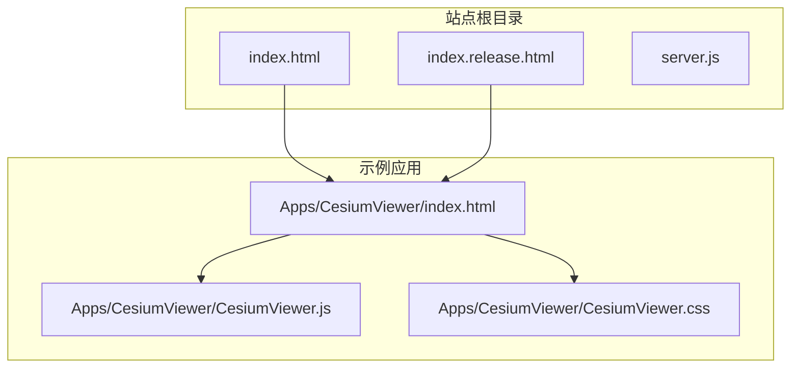
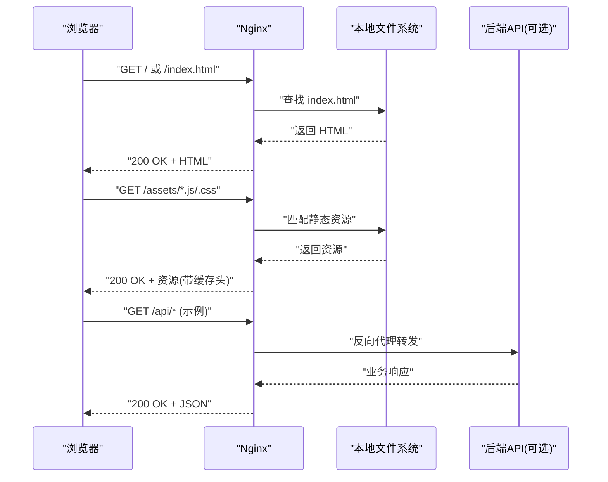
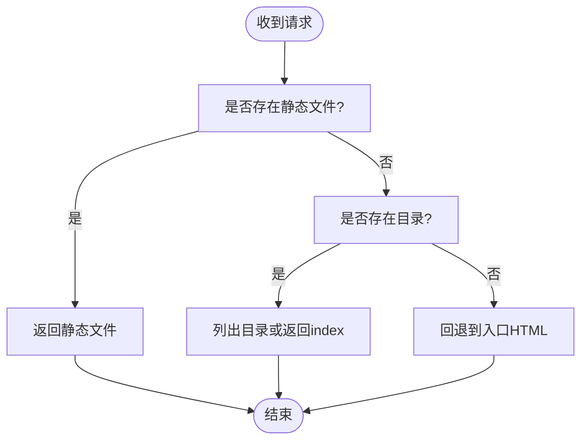
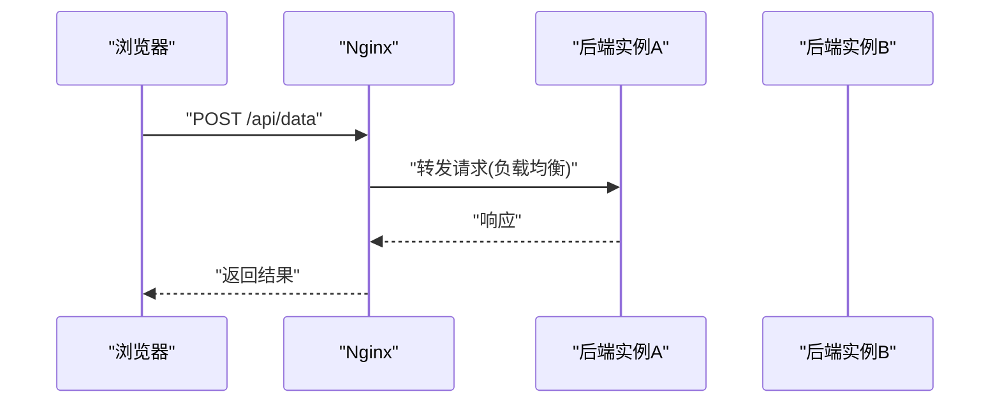
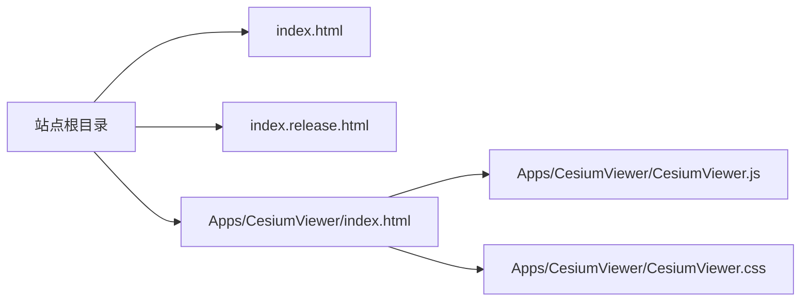

# Nginx服务器配置

<cite>
**本文引用的文件**   
- [server.js](file://server.js)
- [index.html](file://index.html)
- [index.release.html](file://index.release.html)
- [CesiumViewer/index.html](file://Apps/CesiumViewer/index.html)
- [CesiumViewer/CesiumViewer.js](file://Apps/CesiumViewer/CesiumViewer.js)
- [CesiumViewer/CesiumViewer.css](file://Apps/CesiumViewer/CesiumViewer.css)
</cite>

## 目录
1. [简介](#简介)
2. [项目结构](#项目结构)
3. [核心组件](#核心组件)
4. [架构总览](#架构总览)
5. [详细组件分析](#详细组件分析)
6. [依赖分析](#依赖分析)
7. [性能考虑](#性能考虑)
8. [故障排查指南](#故障排查指南)
9. [结论](#结论)
10. [附录](#附录)

## 简介
本指南面向在Nginx上部署Cesium应用（含静态资源与示例页面）的运维与开发者，提供完整的nginx.conf配置要点与实践建议。内容涵盖：
- location块设置、MIME类型映射、gzip压缩与缓存策略
- 使用try_files处理SPA路由与静态资源请求
- HTTPS配置、SSL会话复用与HTTP/2启用
- 负载均衡与反向代理示例
- 性能调优参数（worker进程数、缓冲区大小、连接超时等）

说明：本仓库未包含现成的nginx.conf示例，以下配置为通用最佳实践，结合仓库中Cesium应用的静态资源组织方式给出。

## 项目结构
Cesium仓库包含示例应用与静态资源，典型用于前端部署的文件包括：
- 根级入口页面：index.html、index.release.html
- 示例应用：Apps/CesiumViewer/index.html 及其脚本与样式
- 服务端启动脚本：server.js（开发用，生产环境通常由Nginx直接提供静态资源）

图示来源
- [index.html:1-20](file://index.html#L1-L20)
- [index.release.html:1-20](file://index.release.html#L1-L20)
- [Apps/CesiumViewer/index.html:1-20](file://Apps/CesiumViewer/index.html#L1-L20)
- [Apps/CesiumViewer/CesiumViewer.js:1-20](file://Apps/CesiumViewer/CesiumViewer.js#L1-L20)
- [Apps/CesiumViewer/CesiumViewer.css:1-20](file://Apps/CesiumViewer/CesiumViewer.css#L1-L20)

章节来源
- [server.js:1-50](file://server.js#L1-L50)
- [index.html:1-20](file://index.html#L1-L20)
- [index.release.html:1-20](file://index.release.html#L1-L20)
- [Apps/CesiumViewer/index.html:1-20](file://Apps/CesiumViewer/index.html#L1-L20)
- [Apps/CesiumViewer/CesiumViewer.js:1-20](file://Apps/CesiumViewer/CesiumViewer.js#L1-L20)
- [Apps/CesiumViewer/CesiumViewer.css:1-20](file://Apps/CesiumViewer/CesiumViewer.css#L1-L20)

## 核心组件
- 静态资源服务：Nginx作为高性能静态资源服务器，负责HTML、JS、CSS、模型与瓦片等文件的响应。
- SPA路由支持：通过try_files将未知路径回退到入口HTML，使前端路由接管。
- 安全与协议：HTTPS、HTTP/2、SSL会话复用提升安全性与性能。
- 压缩与缓存：gzip/brotli压缩与合理的Cache-Control策略减少带宽与延迟。
- 反向代理与负载均衡：对后端API或数据源进行代理与多实例均衡。

章节来源
- [server.js:1-50](file://server.js#L1-L50)
- [index.html:1-20](file://index.html#L1-L20)
- [index.release.html:1-20](file://index.release.html#L1-L20)
- [Apps/CesiumViewer/index.html:1-20](file://Apps/CesiumViewer/index.html#L1-L20)

## 架构总览
下图展示浏览器访问Cesium站点时的整体流程，从Nginx接收请求到返回静态资源或转发至后端。

图示来源
- [index.html:1-20](file://index.html#L1-L20)
- [index.release.html:1-20](file://index.release.html#L1-L20)
- [Apps/CesiumViewer/index.html:1-20](file://Apps/CesiumViewer/index.html#L1-L20)

## 详细组件分析

### 静态资源与MIME类型映射
- 目标：确保所有常见前端资源（HTML、JS、CSS、字体、图片、瓦片、模型等）被正确识别并高效传输。
- 建议：
  - 在http或server级别定义常用MIME类型映射，避免默认缺失导致浏览器行为异常。
  - 针对Cesium相关扩展名（如gltf、glb、ktx2、czml、3dtiles等）显式声明MIME类型。
  - 若使用自定义扩展名，务必在mime.types或conf中补充映射。

章节来源
- [index.html:1-20](file://index.html#L1-L20)
- [index.release.html:1-20](file://index.release.html#L1-L20)
- [Apps/CesiumViewer/index.html:1-20](file://Apps/CesiumViewer/index.html#L1-L20)

### gzip与brotli压缩
- 目标：降低传输体积，提高首屏与资源加载速度。
- 建议：
  - 启用gzip，对文本类资源（HTML、JS、CSS、JSON、XML、SVG、WASM等）进行压缩。
  - 若Nginx编译了brotli模块，优先使用brotli以获得更高压缩比。
  - 合理设置压缩级别与最小长度阈值，平衡CPU与带宽。

章节来源
- [index.html:1-20](file://index.html#L1-L20)
- [index.release.html:1-20](file://index.release.html#L1-L20)
- [Apps/CesiumViewer/index.html:1-20](file://Apps/CesiumViewer/index.html#L1-L20)

### 缓存策略
- 目标：利用浏览器与CDN缓存减少重复请求与网络开销。
- 建议：
  - 对HTML入口文件设置较短的缓存时间或no-cache，便于快速发布更新。
  - 对带版本号的静态资源（如带哈希的JS/CSS）设置长期缓存（如一年）。
  - 对瓦片、模型等大体积资源设置合适的缓存与条件请求（ETag/Last-Modified）。
  - 注意跨域资源与第三方CDN的缓存一致性。

章节来源
- [index.html:1-20](file://index.html#L1-L20)
- [index.release.html:1-20](file://index.release.html#L1-L20)
- [Apps/CesiumViewer/index.html:1-20](file://Apps/CesiumViewer/index.html#L1-L20)

### try_files与SPA路由
- 目标：在不改变前端路由的前提下，让Nginx正确处理深度链接与刷新。
- 建议：
  - 在location /下使用try_files，按顺序尝试精确匹配文件、目录，最终回退到入口HTML。
  - 避免对已存在的静态资源路径误回退。
  - 对于子路径部署（如/app），需调整root与try_files路径。

章节来源
- [index.html:1-20](file://index.html#L1-L20)
- [index.release.html:1-20](file://index.release.html#L1-L20)
- [Apps/CesiumViewer/index.html:1-20](file://Apps/CesiumViewer/index.html#L1-L20)

### HTTPS、SSL会话复用与HTTP/2
- 目标：保障传输安全并提升连接效率。
- 建议：
  - 启用TLS 1.2/1.3，禁用过时协议与弱密码套件。
  - 配置证书与私钥路径，必要时启用OCSP装订。
  - 开启SSL会话复用与会话缓存，减少握手开销。
  - 启用HTTP/2以提升多路复用能力与头部压缩效果。
  - 可配合HSTS强制HTTPS访问。

章节来源
- [index.html:1-20](file://index.html#L1-L20)
- [index.release.html:1-20](file://index.release.html#L1-L20)
- [Apps/CesiumViewer/index.html:1-20](file://Apps/CesiumViewer/index.html#L1-L20)

### 反向代理与负载均衡
- 目标：将特定路径的请求转发至后端服务，并对多个后端实例进行均衡。
- 建议：
  - 使用upstream定义后端集群，选择合适算法（轮询、最少连接、IP哈希等）。
  - 在location中通过proxy_pass转发，并设置必要的代理头（Host、X-Forwarded-*等）。
  - 配置超时、缓冲与重试策略，保证稳定性与用户体验。
  - 对WebSocket场景（如实时数据流）启用升级与相应超时。

章节来源
- [server.js:1-50](file://server.js#L1-L50)

### 性能调优参数
- worker进程数：设置为CPU核心数或根据负载经验值调整。
- 连接与超时：
  - 调整keepalive_timeout、client_body_timeout、client_header_timeout等以适应大文件上传与慢客户端。
  - 对长连接与WebSocket场景单独设置超时。
- 缓冲区：
  - 调整proxy_buffer_size、proxy_buffers、proxy_busy_buffers_size以优化大响应体转发。
  - 对静态资源可适当增大sendfile与tcp_nopush/tcp_nodelay。
- I/O与并发：
  - 启用sendfile、tcp_nopush、tcp_nodelay。
  - 合理设置worker_connections与multi_accept。

章节来源
- [server.js:1-50](file://server.js#L1-L50)

## 依赖分析
- 前端入口与资源依赖关系：
  - index.html与index.release.html作为站点入口，可能引用示例应用或主应用资源。
  - Apps/CesiumViewer/index.html作为示例应用入口，依赖其同目录下的JS与CSS。
- Nginx角色：
  - 作为静态资源服务器与反向代理，不直接依赖应用代码，但需遵循资源路径约定。

图示来源
- [index.html:1-20](file://index.html#L1-L20)
- [index.release.html:1-20](file://index.release.html#L1-L20)
- [Apps/CesiumViewer/index.html:1-20](file://Apps/CesiumViewer/index.html#L1-L20)
- [Apps/CesiumViewer/CesiumViewer.js:1-20](file://Apps/CesiumViewer/CesiumViewer.js#L1-L20)
- [Apps/CesiumViewer/CesiumViewer.css:1-20](file://Apps/CesiumViewer/CesiumViewer.css#L1-L20)

章节来源
- [index.html:1-20](file://index.html#L1-L20)
- [index.release.html:1-20](file://index.release.html#L1-L20)
- [Apps/CesiumViewer/index.html:1-20](file://Apps/CesiumViewer/index.html#L1-L20)
- [Apps/CesiumViewer/CesiumViewer.js:1-20](file://Apps/CesiumViewer/CesiumViewer.js#L1-L20)
- [Apps/CesiumViewer/CesiumViewer.css:1-20](file://Apps/CesiumViewer/CesiumViewer.css#L1-L20)

## 性能考虑
- 静态资源：
  - 启用sendfile与tcp_nopush，减少内核态拷贝与系统调用。
  - 对大文件（模型、瓦片）启用分块传输与合理缓冲。
- 压缩：
  - 优先brotli，其次gzip；对动态生成内容谨慎压缩。
- 缓存：
  - 对不可变资源设置长期缓存与强校验；对HTML短缓存或no-store。
- 连接与并发：
  - 根据内存与CPU调整worker_processes与worker_connections。
  - 合理设置keepalive以减少频繁握手。
- 代理：
  - 对后端接口设置合适的超时与重试，避免雪崩。
  - 对大响应体调整proxy缓冲，避免磁盘落盘。

[本节为通用指导，无需具体文件来源]

## 故障排查指南
- 常见问题定位：
  - 404错误：检查root与location路径、try_files回退逻辑是否正确。
  - MIME类型错误：确认mime.types是否包含所需扩展名映射。
  - 跨域问题：检查Access-Control-Allow-*头与后端CORS配置。
  - 缓存不一致：清理浏览器缓存或强制刷新，检查Cache-Control与Etag。
  - HTTPS握手失败：核对证书链、域名匹配与协议版本。
  - HTTP/2未生效：确认Nginx编译支持且listen指令正确。
- 日志与调试：
  - 开启access_log与error_log，定位请求路径与错误原因。
  - 对代理场景记录上游状态码与耗时，辅助定位后端瓶颈。

章节来源
- [server.js:1-50](file://server.js#L1-L50)

## 结论
通过在Nginx上合理配置静态资源服务、MIME类型、压缩与缓存、try_files回退、HTTPS与HTTP/2、反向代理与负载均衡，以及关键的性能调优参数，可以显著提升Cesium应用在公网环境中的安全性、可用性与性能表现。建议在生产环境结合监控与压测持续优化。

[本节为总结性内容，无需具体文件来源]

## 附录
- 部署清单：
  - 准备证书与私钥，配置监听端口与HTTP/2。
  - 设置站点根目录与入口文件。
  - 配置MIME类型、压缩与缓存策略。
  - 配置try_files以支持SPA路由。
  - 如需代理，配置upstream与location规则。
  - 调整worker与连接、缓冲、超时等性能参数。
  - 验证HTTPS、HTTP/2与跨域策略。
  - 开启日志并建立监控告警。

[本节为操作清单，无需具体文件来源]