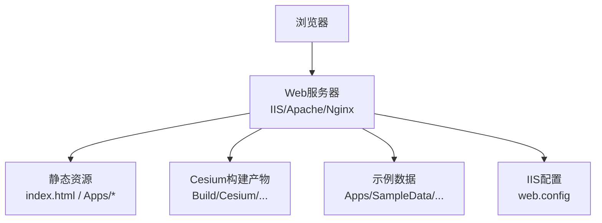
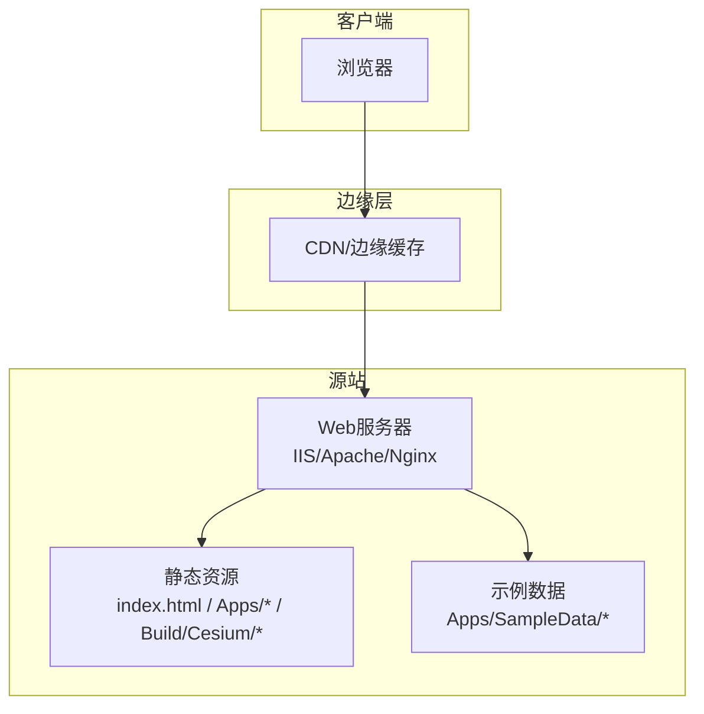
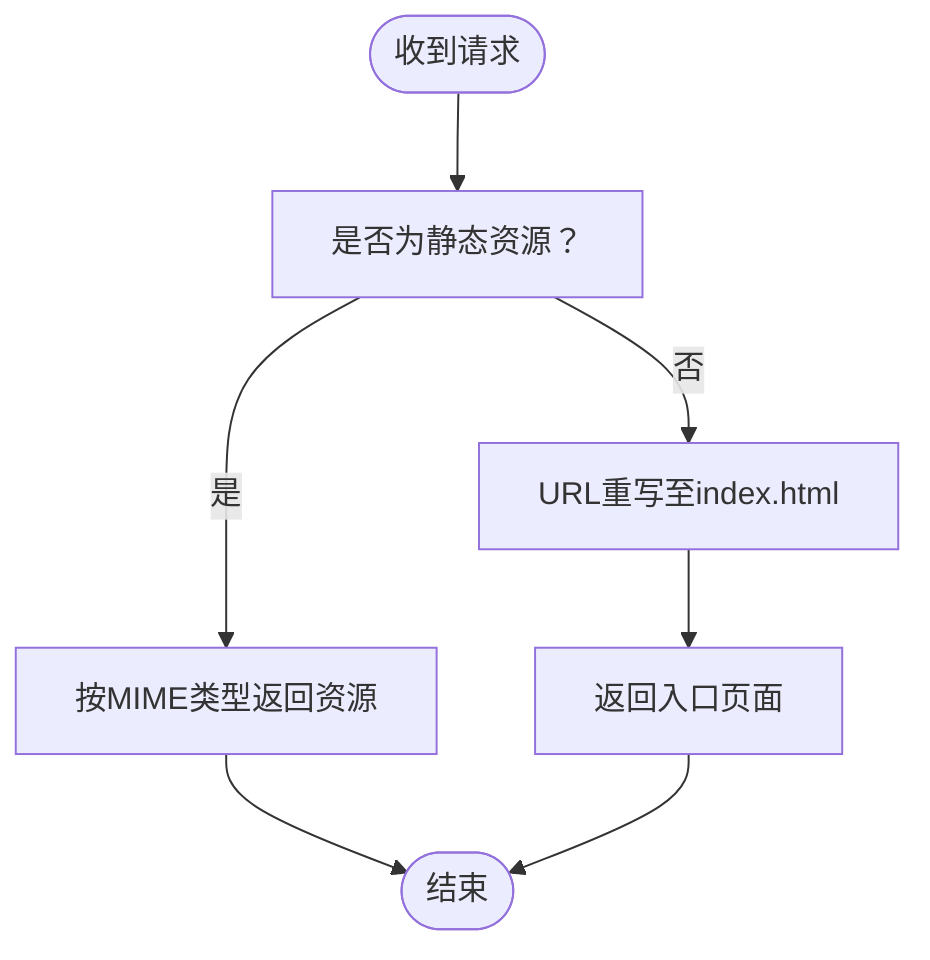
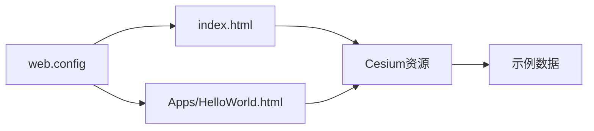

# Web服务器配置

<cite>
**本文引用的文件**   
- [web.config](file://web.config)
- [server.js](file://server.js)
- [index.html](file://index.html)
- [Apps/HelloWorld.html](file://Apps/HelloWorld.html)
</cite>

## 目录
1. [简介](#简介)
2. [项目结构](#项目结构)
3. [核心组件](#核心组件)
4. [架构总览](#架构总览)
5. [详细组件分析](#详细组件分析)
6. [依赖分析](#依赖分析)
7. [性能考虑](#性能考虑)
8. [故障排查指南](#故障排查指南)
9. [结论](#结论)
10. [附录](#附录)

## 简介
本指南面向在主流Web服务器上部署Cesium应用（静态资源与示例页面）的运维与开发者，覆盖以下主题：
- IIS服务器的部署配置要点（web.config、MIME类型、URL重写）
- Apache服务器的.htaccess配置要点（缓存控制、压缩传输、安全头）
- Nginx服务器的配置要点（静态资源服务、gzip压缩、HTTPS重定向）
- CDN集成方法与最佳实践
- 跨域资源共享（CORS）的配置与安全考量
- HTTP/2与HTTP/3协议的启用方法

说明：仓库中已包含IIS的web.config示例；Apache与Nginx为通用配置建议，便于直接落地。

## 项目结构
Cesium仓库提供可直接用于演示与部署的静态入口与示例页面，同时包含一个本地开发服务器脚本。关键路径如下：
- 根级入口：index.html（默认站点首页）
- 示例页面：Apps/HelloWorld.html（最小化示例）
- IIS配置：web.config（MIME类型与URL重写等）
- 本地开发服务器：server.js（Node.js简易静态服务器，便于本地验证）

图表来源
- [index.html:1-20](file://index.html#L1-L20)
- [Apps/HelloWorld.html:1-20](file://Apps/HelloWorld.html#L1-L20)
- [web.config:1-200](file://web.config#L1-L200)

章节来源
- [index.html:1-20](file://index.html#L1-L20)
- [Apps/HelloWorld.html:1-20](file://Apps/HelloWorld.html#L1-L20)
- [web.config:1-200](file://web.config#L1-L200)

## 核心组件
- 静态入口与示例
  - index.html：站点默认入口，通常作为根路径返回。
  - Apps/HelloWorld.html：最小化示例，便于快速验证部署是否成功。
- IIS配置
  - web.config：定义MIME类型映射、URL重写规则、响应头等。
- 本地开发服务器
  - server.js：基于Node.js的简单静态文件服务器，适合本地调试与连通性验证。

章节来源
- [index.html:1-20](file://index.html#L1-L20)
- [Apps/HelloWorld.html:1-20](file://Apps/HelloWorld.html#L1-L20)
- [web.config:1-200](file://web.config#L1-L200)
- [server.js:1-200](file://server.js#L1-L200)

## 架构总览
下图展示典型部署架构：浏览器通过CDN或直连访问Web服务器，服务器将静态资源（HTML、JS、CSS、模型、瓦片等）返回给客户端。IIS使用web.config进行MIME与重写控制；Apache/Nginx通过各自配置文件实现相同能力。

[此图为概念性架构图，无需图表来源]

## 详细组件分析

### IIS服务器配置（web.config）
- MIME类型
  - 目的：确保Cesium所需的二进制与文本资源（如glTF、gltf、glb、ktx2、json、css、js、wasm等）被正确识别并返回。
  - 建议：在web.config中添加必要的静态MIME映射，避免404或错误内容类型导致的加载失败。
- URL重写
  - 目的：支持SPA式路由或统一入口，将未知路径回退到index.html，使前端路由接管。
  - 建议：添加“匹配所有未命中”的重写规则，将请求转发至index.html。
- 响应头与安全
  - 建议：设置缓存控制、安全相关响应头（如X-Content-Type-Options、X-Frame-Options等），并根据需要开启HSTS。
- 参考位置
  - web.config中的MIME映射与重写规则定义位置可参考以下行范围。

章节来源
- [web.config:1-200](file://web.config#L1-L200)

#### IIS配置流程图（概念）

[此图为概念性流程图，无需图表来源]

### Apache服务器配置（.htaccess）
- 缓存控制
  - 对静态资源（JS/CSS/图片/字体/瓦片等）设置长期缓存，配合版本号或哈希文件名提升命中率。
  - 对动态或易变资源设置较短缓存时间。
- 压缩传输
  - 启用Gzip或Brotli压缩，减少传输体积，提升首屏与交互速度。
- 安全头
  - 设置X-Content-Type-Options、X-Frame-Options、Referrer-Policy、Permissions-Policy等基础安全头。
- 示例入口
  - 将根目录指向index.html，并将子路径回退到入口页以支持前端路由。

[本节为通用配置建议，不直接分析具体文件，故无章节来源]

### Nginx服务器配置
- 静态资源服务
  - 将站点根目录指向包含index.html与Cesium资源的目录，启用目录索引关闭与正确的MIME类型。
- gzip压缩
  - 启用gzip并对常见类型（text/html、application/javascript、image/svg+xml等）进行压缩。
- HTTPS重定向
  - 将所有HTTP请求重定向至HTTPS，强制加密传输。
- 缓存策略
  - 对静态资源设置长期缓存，对API或易变资源设置短缓存或no-cache。
- 示例入口
  - 将未知路径回退到index.html，以便前端路由处理。

[本节为通用配置建议，不直接分析具体文件，故无章节来源]

### CDN集成方法与最佳实践
- 域名与证书
  - 为CDN分配独立域名并绑定有效TLS证书，避免混合内容问题。
- 缓存策略
  - 对静态资源设置强缓存（Cache-Control: public, max-age=...），结合文件名哈希实现版本化更新。
  - 对入口HTML设置较短缓存或no-store，确保用户获取最新入口。
- 预取与预热
  - 对热点资源进行预热，降低冷启动延迟。
- 安全与合规
  - 启用HSTS、CSP、Referrer-Policy等安全头；限制来源白名单与Referer校验。
- 监控与回滚
  - 建立灰度发布与快速回滚机制，结合CDN日志与A/B测试评估效果。

[本节为通用最佳实践，不直接分析具体文件，故无章节来源]

### 跨域资源共享（CORS）配置与安全考量
- 何时需要CORS
  - 当Cesium从不同域名加载地图服务、模型或数据时，需服务端允许跨域。
- 基本配置
  - Access-Control-Allow-Origin：限定允许的源（建议使用精确域名而非通配符）。
  - Access-Control-Allow-Methods：仅暴露必要的方法（GET/HEAD/POST等）。
  - Access-Control-Allow-Headers：仅暴露必要请求头。
  - Access-Control-Max-Age：合理设置预检缓存时间。
- 安全建议
  - 严格限制Allow-Origin，避免*；对敏感接口启用认证与鉴权。
  - 结合WAF与速率限制，防止滥用。
  - 对上传/下载大文件的接口增加签名与有效期校验。

[本节为通用配置建议，不直接分析具体文件，故无章节来源]

### HTTP/2与HTTP/3协议启用方法
- HTTP/2
  - 条件：启用TLS（SNI）、选择合适的应用层协议（ALPN）。
  - IIS：在站点绑定中启用HTTPS并配置ALPN；在服务器级别启用HTTP/2。
  - Apache：启用mod_http2并在虚拟主机中启用http2。
  - Nginx：编译支持HTTP/2并在listen指令中启用http2。
- HTTP/3（QUIC）
  - 条件：服务器与CDN均支持QUIC；客户端具备相应能力。
  - Nginx：启用quic与http3模块，配置端口与证书。
  - IIS/Apache：根据版本与模块支持情况启用，或使用CDN提供的HTTP/3能力。
- 兼容性
  - 保持HTTP/1.1降级能力；优先使用HTTP/2，逐步引入HTTP/3。

[本节为通用启用建议，不直接分析具体文件，故无章节来源]

## 依赖分析
- 入口与示例
  - index.html与Apps/HelloWorld.html作为站点入口与示例，依赖Cesium构建产物与示例数据。
- IIS配置
  - web.config影响MIME解析与URL重写行为，直接影响静态资源加载与路由回退。
- 本地开发服务器
  - server.js用于本地快速验证，不替代生产环境服务器配置。

图表来源
- [index.html:1-20](file://index.html#L1-L20)
- [Apps/HelloWorld.html:1-20](file://Apps/HelloWorld.html#L1-L20)
- [web.config:1-200](file://web.config#L1-L200)

章节来源
- [index.html:1-20](file://index.html#L1-L20)
- [Apps/HelloWorld.html:1-20](file://Apps/HelloWorld.html#L1-L20)
- [web.config:1-200](file://web.config#L1-L200)

## 性能考虑
- 静态资源优化
  - 启用压缩（gzip/brotli）、合并与按需加载、使用现代格式（KTX2、Draco等）。
- 缓存策略
  - 对静态资源设置长期缓存，入口HTML短缓存或no-store；利用文件名哈希实现增量更新。
- 连接复用与并行
  - 启用HTTP/2多路复用，减少握手开销；合理设置并发连接数。
- 网络与边缘
  - 使用CDN就近分发；对热点资源预热；开启TCP Fast Open与Keep-Alive。
- 监控与度量
  - 采集首字节时间、TTFB、FCP、LCP等指标，持续优化。

[本节为通用性能建议，不直接分析具体文件，故无章节来源]

## 故障排查指南
- 常见问题
  - 404/403：检查静态资源路径、MIME类型映射与目录权限。
  - CORS错误：核对Access-Control-Allow-*头与来源白名单。
  - 混合内容：确保所有资源通过HTTPS加载。
  - 缓存导致不更新：清理浏览器缓存或调整Cache-Control策略。
- 定位步骤
  - 使用浏览器开发者工具查看网络面板，确认状态码、响应头与资源大小。
  - 检查服务器日志与CDN日志，定位异常请求与错误原因。
  - 针对IIS，检查web.config语法与规则优先级；针对Apache/Nginx，检查配置文件语法与模块加载。
- 参考入口
  - 使用Apps/HelloWorld.html进行最小化复现，逐步缩小问题范围。

章节来源
- [Apps/HelloWorld.html:1-20](file://Apps/HelloWorld.html#L1-L20)
- [web.config:1-200](file://web.config#L1-L200)

## 结论
- 在生产环境中，应优先启用HTTPS与HTTP/2，必要时引入HTTP/3；结合CDN提升全球可达性与性能。
- 通过合理的MIME类型、URL重写、缓存与安全头配置，保障Cesium应用的稳定与高效运行。
- 对跨域场景进行精细化CORS策略，遵循最小权限原则，兼顾可用性与安全性。

[本节为总结性内容，不直接分析具体文件，故无章节来源]

## 附录
- 快速验证清单
  - 打开index.html与Apps/HelloWorld.html，确认页面正常渲染。
  - 检查控制台是否有CORS或混合内容错误。
  - 使用网络面板验证静态资源是否被压缩与缓存。
- 参考文件
  - 入口与示例：index.html、Apps/HelloWorld.html
  - IIS配置：web.config
  - 本地开发服务器：server.js

章节来源
- [index.html:1-20](file://index.html#L1-L20)
- [Apps/HelloWorld.html:1-20](file://Apps/HelloWorld.html#L1-L20)
- [web.config:1-200](file://web.config#L1-L200)
- [server.js:1-200](file://server.js#L1-L200)