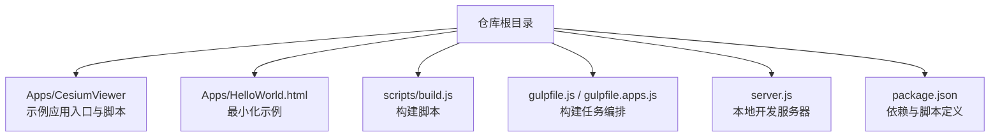
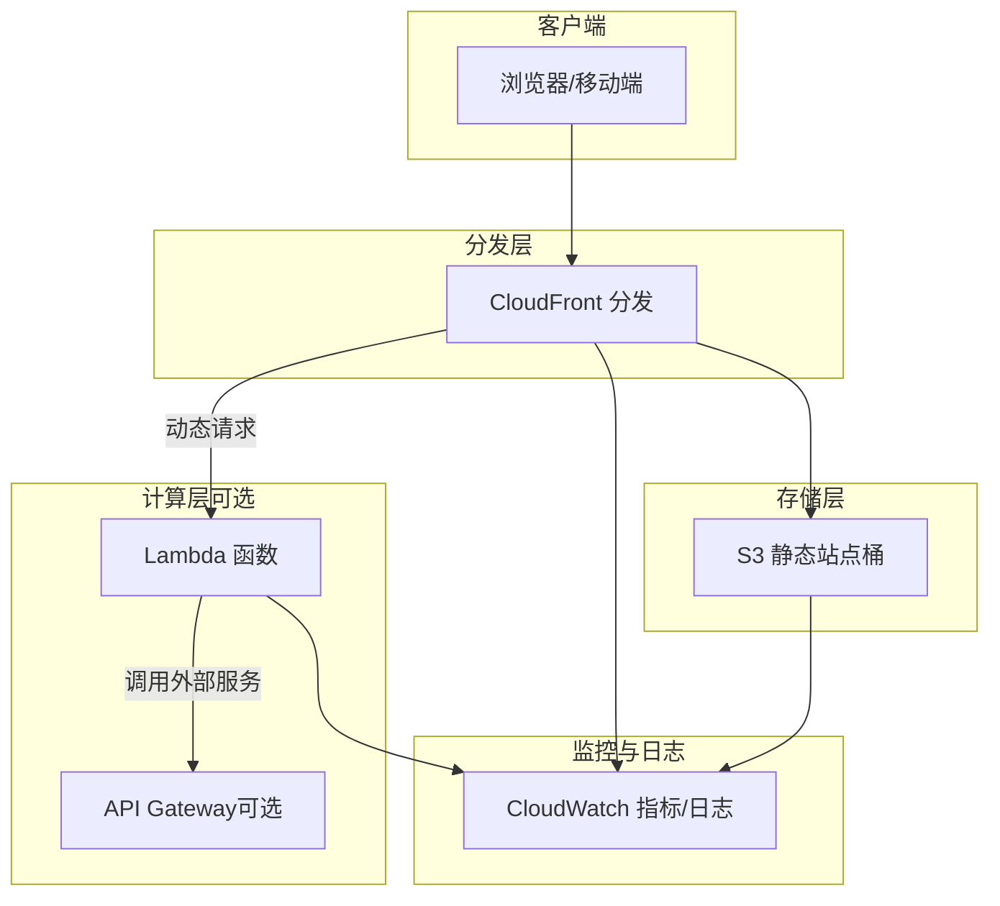
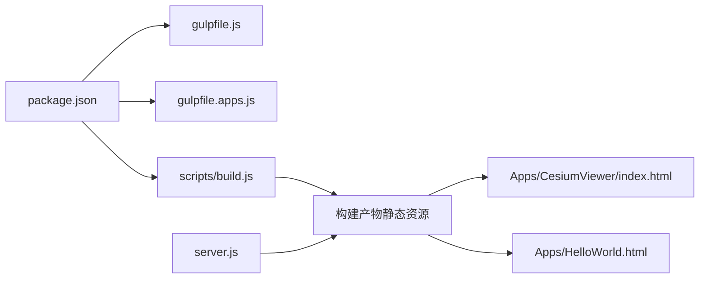

# AWS部署方案

<cite>
**本文引用的文件**   
- [README.md](file://README.md)
- [Apps/CesiumViewer/index.html](file://Apps/CesiumViewer/index.html)
- [Apps/CesiumViewer/CesiumViewer.js](file://Apps/CesiumViewer/CesiumViewer.js)
- [Apps/HelloWorld.html](file://Apps/HelloWorld.html)
- [server.js](file://server.js)
- [gulpfile.js](file://gulpfile.js)
- [gulpfile.apps.js](file://gulpfile.apps.js)
- [scripts/build.js](file://scripts/build.js)
- [package.json](file://package.json)
</cite>

## 目录
1. [简介](#简介)
2. [项目结构](#项目结构)
3. [核心组件](#核心组件)
4. [架构总览](#架构总览)
5. [详细组件分析](#详细组件分析)
6. [依赖分析](#依赖分析)
7. [性能考虑](#性能考虑)
8. [故障排查指南](#故障排查指南)
9. [结论](#结论)
10. [附录](#附录)

## 简介
本指南面向在AWS上部署Cesium静态Web应用的工程团队，提供从S3静态网站托管、CloudFront CDN到Lambda动态处理、IAM权限、CloudWatch监控与日志、成本优化以及基础设施即代码（Terraform/CloudFormation）模板的完整落地方案。文档同时结合仓库中构建产物与示例应用，给出可操作的部署步骤与最佳实践。

## 项目结构
仓库包含Cesium源码、示例应用与构建脚本。用于部署的核心产出为构建后的静态资源（HTML/JS/CSS/模型/瓦片等），通常位于构建输出目录或由示例应用直接使用的静态页面。

图表来源
- [Apps/CesiumViewer/index.html](file://Apps/CesiumViewer/index.html)
- [Apps/HelloWorld.html](file://Apps/HelloWorld.html)
- [scripts/build.js](file://scripts/build.js)
- [gulpfile.js](file://gulpfile.js)
- [gulpfile.apps.js](file://gulpfile.apps.js)
- [server.js](file://server.js)
- [package.json](file://package.json)

章节来源
- [README.md](file://README.md)
- [Apps/CesiumViewer/index.html](file://Apps/CesiumViewer/index.html)
- [Apps/HelloWorld.html](file://Apps/HelloWorld.html)
- [scripts/build.js](file://scripts/build.js)
- [gulpfile.js](file://gulpfile.js)
- [gulpfile.apps.js](file://gulpfile.apps.js)
- [server.js](file://server.js)
- [package.json](file://package.json)

## 核心组件
- 静态站点内容：由构建流程产出的HTML、JavaScript、CSS、模型与数据文件，可直接托管于S3并启用静态网站功能。
- 构建系统：基于Gulp与Node脚本，负责打包、压缩与产物组织，便于生成适合CDN缓存的发布包。
- 示例应用：CesiumViewer与HelloWorld作为演示入口，验证静态资源加载与Cesium运行环境。

章节来源
- [gulpfile.js](file://gulpfile.js)
- [gulpfile.apps.js](file://gulpfile.apps.js)
- [scripts/build.js](file://scripts/build.js)
- [Apps/CesiumViewer/index.html](file://Apps/CesiumViewer/index.html)
- [Apps/CesiumViewer/CesiumViewer.js](file://Apps/CesiumViewer/CesiumViewer.js)
- [Apps/HelloWorld.html](file://Apps/HelloWorld.html)

## 架构总览
推荐采用“S3静态站点 + CloudFront CDN”的无服务器前端架构；如需API或动态渲染，通过CloudFront函数/触发器将请求路由至Lambda，实现按需计算。

图表来源
- [Apps/CesiumViewer/index.html](file://Apps/CesiumViewer/index.html)
- [Apps/HelloWorld.html](file://Apps/HelloWorld.html)
- [scripts/build.js](file://scripts/build.js)
- [gulpfile.js](file://gulpfile.js)
- [gulpfile.apps.js](file://gulpfile.apps.js)

## 详细组件分析

### S3静态网站托管配置
- 创建S3桶并启用“静态网站托管”，设置索引文档与错误文档（例如index.html）。
- 上传构建产物至桶根或子路径，确保所有资源可通过HTTP(S)访问。
- 若仅用于私有访问，建议关闭公共读取并通过CloudFront OAC/OAI进行受控访问。

章节来源
- [Apps/CesiumViewer/index.html](file://Apps/CesiumViewer/index.html)
- [Apps/HelloWorld.html](file://Apps/HelloWorld.html)

### CloudFront CDN配置
- 源站：指向S3桶（或S3静态网站端点），开启默认缓存策略与对象缓存控制。
- 缓存策略：对静态资源使用长缓存时间，配合文件名哈希；对HTML与tileset.json等元数据使用较短缓存或按版本更新。
- HTTPS证书：使用托管证书或自定义证书，绑定自定义域名并开启HSTS与安全头。
- 行为规则：区分静态资源与动态请求，将动态请求转发至Lambda或API Gateway。

章节来源
- [Apps/CesiumViewer/index.html](file://Apps/CesiumViewer/index.html)
- [Apps/HelloWorld.html](file://Apps/HelloWorld.html)

### Lambda集成（动态内容与API）
- 适用场景：服务端渲染、动态令牌签发、地理信息聚合、实时数据接入、3D Tiles代理等。
- 触发方式：CloudFront函数/触发器或API Gateway事件驱动。
- 安全与鉴权：结合JWT/OAuth校验、签名URL、IP白名单等机制保护后端接口。

章节来源
- [server.js](file://server.js)
- [package.json](file://package.json)

### IAM角色与权限
- 最小权限原则：为CI/CD或部署工具授予仅对目标桶的读写权限；为CloudFront OAC/OAI授予只读访问。
- 跨域与CORS：如前端需跨域访问S3或Lambda，需在对应资源上配置允许的源与方法。
- 密钥与凭据：避免硬编码，使用环境变量或Secrets Manager管理敏感信息。

章节来源
- [server.js](file://server.js)
- [package.json](file://package.json)

### CloudWatch监控与日志
- 指标：CloudFront命中率、延迟、带宽、S3请求量与错误率、Lambda并发与错误。
- 日志：启用CloudFront访问日志到S3；收集Lambda执行日志与错误堆栈；S3访问日志用于审计。
- 告警：基于关键指标阈值设置告警，快速定位异常与容量瓶颈。

章节来源
- [server.js](file://server.js)
- [package.json](file://package.json)

### 成本优化策略
- 存储分层：冷数据归档至S3 Glacier/Deep Archive，热数据保留在标准层。
- CDN缓存优化：合理设置Cache-Control与ETag，利用文件名哈希提升缓存命中。
- Lambda冷启动优化：保持最小包体积、使用预置并发或Provisioned Concurrency、合理划分函数粒度。
- 传输优化：启用Gzip/Brotli压缩、选择合适区域与边缘节点、减少首屏资源大小。

章节来源
- [scripts/build.js](file://scripts/build.js)
- [gulpfile.js](file://gulpfile.js)
- [gulpfile.apps.js](file://gulpfile.apps.js)

### 基础设施即代码（IaC）模板要点
- Terraform：定义S3桶、CloudFront分发、Lambda函数、IAM角色与策略、CloudWatch日志组与订阅。
- CloudFormation：使用AWS::S3::Bucket、AWS::CloudFront::Distribution、AWS::Lambda::Function等资源类型。
- 参数化与环境隔离：通过变量与栈命名空间区分dev/stage/prod环境。
- 变更管理与回滚：结合CI/CD流水线进行计划、预览与回滚。

章节来源
- [package.json](file://package.json)
- [scripts/build.js](file://scripts/build.js)

## 依赖分析
- 构建与发布：Gulp任务与Node脚本共同完成打包与产物整理，最终生成可部署的静态资源。
- 示例应用：CesiumViewer与HelloWorld作为静态入口，验证资源加载与运行环境。
- 本地开发：server.js提供本地服务，便于调试与预览。

图表来源
- [package.json](file://package.json)
- [gulpfile.js](file://gulpfile.js)
- [gulpfile.apps.js](file://gulpfile.apps.js)
- [scripts/build.js](file://scripts/build.js)
- [Apps/CesiumViewer/index.html](file://Apps/CesiumViewer/index.html)
- [Apps/HelloWorld.html](file://Apps/HelloWorld.html)
- [server.js](file://server.js)

章节来源
- [package.json](file://package.json)
- [gulpfile.js](file://gulpfile.js)
- [gulpfile.apps.js](file://gulpfile.apps.js)
- [scripts/build.js](file://scripts/build.js)
- [Apps/CesiumViewer/index.html](file://Apps/CesiumViewer/index.html)
- [Apps/HelloWorld.html](file://Apps/HelloWorld.html)
- [server.js](file://server.js)

## 性能考虑
- 首屏加载：拆分大模块、懒加载非关键资源、启用HTTP/2与多路复用。
- 资源压缩：对文本类资源启用Brotli/Gzip，图片与模型使用高效格式（如KTX2、Draco）。
- 缓存策略：静态资源长缓存+文件名哈希，元数据短缓存或按版本更新。
- 网络优化：就近边缘节点、合理的TTL与预取策略、减少跨域请求。
- 运行时优化：按需初始化Cesium模块、限制并发请求、合理使用内存与GPU资源。

[本节为通用指导，不直接分析具体文件]

## 故障排查指南
- 静态资源404：检查S3桶权限与静态网站配置、确认路径与文件名大小写、核对CloudFront缓存失效。
- CORS错误：确认S3/Lambda的CORS策略允许前端域名与方法。
- 证书问题：检查CloudFront证书绑定与域名解析、验证TLS握手与HSTS设置。
- Lambda错误：查看CloudWatch日志与堆栈、检查环境变量与依赖包体积、评估冷启动与超时。
- 性能瓶颈：分析CloudFront命中率与延迟、S3请求分布、Lambda并发与错误率。

章节来源
- [server.js](file://server.js)
- [package.json](file://package.json)

## 结论
通过S3静态站点与CloudFront CDN的组合，可实现高性能、可扩展的Cesium应用交付；在需要动态能力时引入Lambda与API Gateway，并以IAM最小权限与CloudWatch监控保障安全与可观测性。结合IaC模板与成本优化策略，可在保证质量的同时有效控制总体拥有成本。

[本节为总结性内容，不直接分析具体文件]

## 附录
- 部署清单：
  - 构建产物准备与命名规范
  - S3桶与静态网站启用
  - CloudFront分发与缓存策略
  - Lambda函数与触发器配置
  - IAM角色与权限策略
  - CloudWatch日志与告警
  - IaC模板与CI/CD流水线
- 参考入口：
  - 示例应用入口与脚本
  - 构建脚本与任务编排
  - 本地开发服务器

章节来源
- [Apps/CesiumViewer/index.html](file://Apps/CesiumViewer/index.html)
- [Apps/CesiumViewer/CesiumViewer.js](file://Apps/CesiumViewer/CesiumViewer.js)
- [Apps/HelloWorld.html](file://Apps/HelloWorld.html)
- [scripts/build.js](file://scripts/build.js)
- [gulpfile.js](file://gulpfile.js)
- [gulpfile.apps.js](file://gulpfile.apps.js)
- [server.js](file://server.js)
- [package.json](file://package.json)