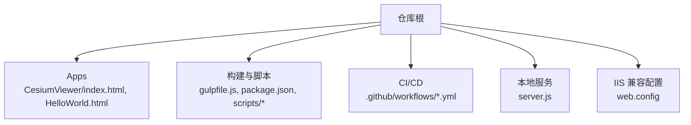
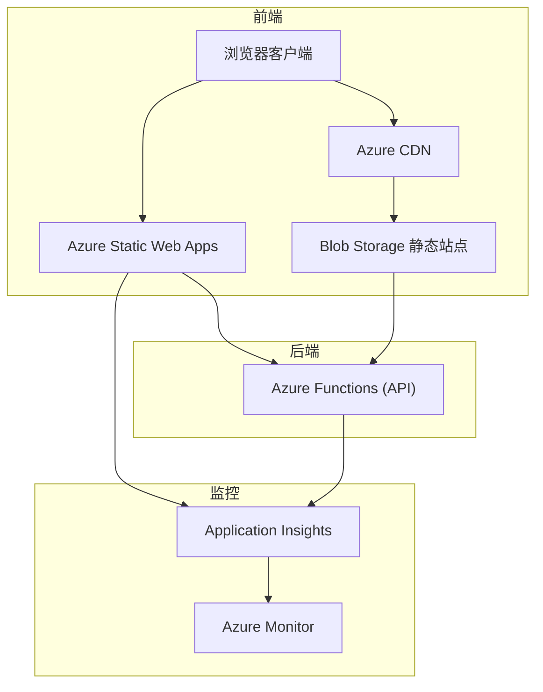
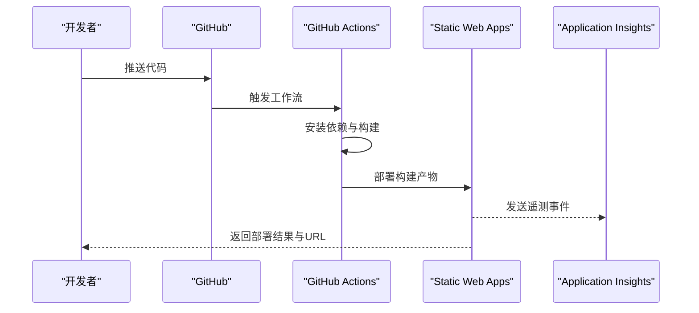
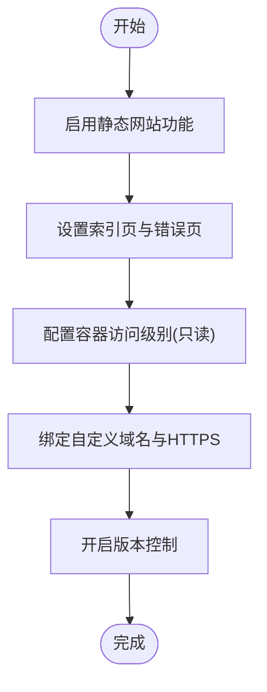
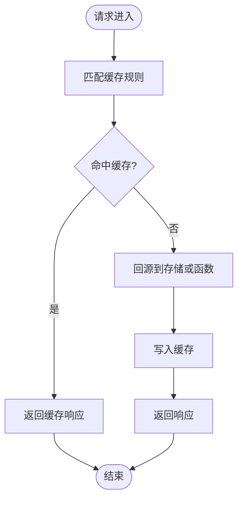
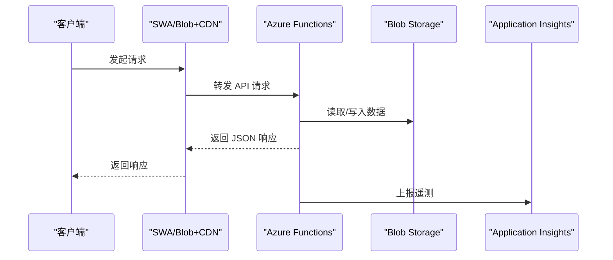
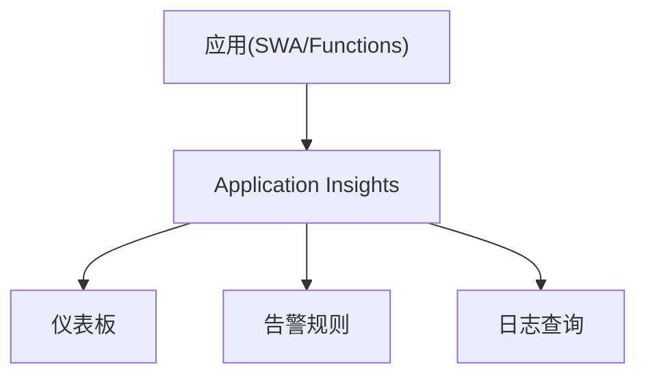
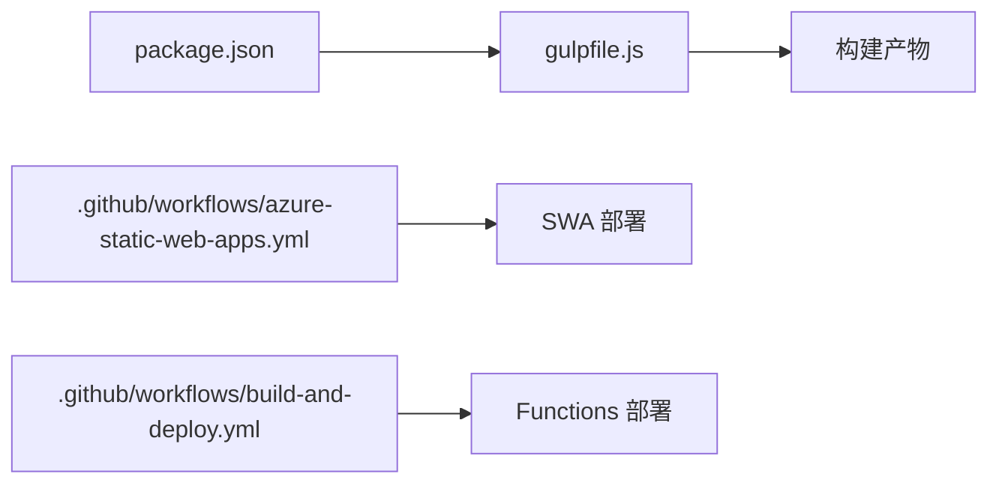

# Azure部署方案

<cite>
**本文引用的文件**   
- [package.json](file://package.json)
- [gulpfile.js](file://gulpfile.js)
- [server.js](file://server.js)
- [.github/workflows/azure-static-web-apps.yml](file://.github/workflows/azure-static-web-apps.yml)
- [.github/workflows/build-and-deploy.yml](file://.github/workflows/build-and-deploy.yml)
- [web.config](file://web.config)
</cite>

## 目录
1. [简介](#简介)
2. [项目结构](#项目结构)
3. [核心组件](#核心组件)
4. [架构总览](#架构总览)
5. [详细组件分析](#详细组件分析)
6. [依赖分析](#依赖分析)
7. [性能考虑](#性能考虑)
8. [故障排查指南](#故障排查指南)
9. [结论](#结论)
10. [附录](#附录)

## 简介
本指南面向在 Microsoft Azure 上部署 Cesium 静态站点与相关后端能力的工程团队，覆盖以下主题：
- Azure Static Web Apps（SWA）的部署流程、GitHub Actions 集成、构建配置与发布管道
- Azure Blob Storage 静态网站托管的配置要点（容器权限、索引页面、自定义域名）
- Azure CDN 缓存规则、压缩与安全策略
- Azure Functions 作为后端 API 的集成方式
- Azure Monitor 与 Application Insights 监控配置
- 资源组管理、标签策略与成本分析最佳实践
- ARM 模板与 Bicep 脚本示例（以概念性说明为主）

本仓库为 Cesium 源码与示例应用集合，包含构建脚本、本地开发服务器与 GitHub Actions 工作流。本文结合仓库现有工件与通用 Azure 平台能力，给出可操作的部署方案与最佳实践。

## 项目结构
从部署视角，与本方案相关的仓库关键位置包括：
- 应用入口与示例：Apps/CesiumViewer/index.html、Apps/HelloWorld.html
- 构建与打包：gulpfile.js、package.json、scripts/*
- 本地开发服务器：server.js
- CI/CD：.github/workflows/*.yml
- IIS 兼容配置（用于演示或迁移场景）：web.config

**图示来源**
- [package.json:1-200](file://package.json#L1-L200)
- [gulpfile.js:1-200](file://gulpfile.js#L1-L200)
- [server.js:1-200](file://server.js#L1-L200)
- [.github/workflows/azure-static-web-apps.yml:1-200](file://.github/workflows/azure-static-web-apps.yml#L1-L200)
- [.github/workflows/build-and-deploy.yml:1-200](file://.github/workflows/build-and-deploy.yml#L1-L200)
- [web.config:1-200](file://web.config#L1-L200)

**章节来源**
- [package.json:1-200](file://package.json#L1-L200)
- [gulpfile.js:1-200](file://gulpfile.js#L1-L200)
- [server.js:1-200](file://server.js#L1-L200)
- [.github/workflows/azure-static-web-apps.yml:1-200](file://.github/workflows/azure-static-web-apps.yml#L1-L200)
- [.github/workflows/build-and-deploy.yml:1-200](file://.github/workflows/build-and-deploy.yml#L1-L200)
- [web.config:1-200](file://web.config#L1-L200)

## 核心组件
- 构建系统：基于 Gulp 与 Node 生态，负责编译、合并、压缩与产物输出。参考 gulpfile.js 与 package.json 中的任务定义与依赖。
- 应用入口：CesiumViewer 与 HelloWorld 示例提供静态 HTML 入口，便于直接部署到静态站点。
- 本地开发服务器：server.js 提供本地预览能力，便于在部署前验证资源加载与跨域行为。
- CI/CD：GitHub Actions 工作流定义了构建与部署步骤，可直接对接 Azure Static Web Apps 或 Blob Storage + CDN。

**章节来源**
- [package.json:1-200](file://package.json#L1-L200)
- [gulpfile.js:1-200](file://gulpfile.js#L1-L200)
- [server.js:1-200](file://server.js#L1-L200)

## 架构总览
下图展示推荐的 Azure 部署架构：前端静态资源通过 SWA 或 Blob Storage + CDN 分发；必要时通过 Azure Functions 提供后端 API；统一由 Application Insights 采集遥测数据。

**图示来源**
- [.github/workflows/azure-static-web-apps.yml:1-200](file://.github/workflows/azure-static-web-apps.yml#L1-L200)
- [.github/workflows/build-and-deploy.yml:1-200](file://.github/workflows/build-and-deploy.yml#L1-L200)

## 详细组件分析

### Azure Static Web Apps 部署流程
- 触发条件：推送或拉取请求至指定分支时，GitHub Actions 自动执行构建与部署。
- 构建阶段：使用 Node 环境安装依赖并运行构建任务（如 Gulp），生成静态产物。
- 发布阶段：将构建产物上传至 SWA 站点，支持路由重写与自定义头设置。
- 环境变量：通过 GitHub Secrets 注入敏感信息（如 API 密钥）。

**图示来源**
- [.github/workflows/azure-static-web-apps.yml:1-200](file://.github/workflows/azure-static-web-apps.yml#L1-L200)

**章节来源**
- [.github/workflows/azure-static-web-apps.yml:1-200](file://.github/workflows/azure-static-web-apps.yml#L1-L200)

### Azure Blob Storage 静态网站托管
- 启用静态网站：在存储账户中开启“静态网站”功能，指定索引页与错误页。
- 容器权限：建议仅启用匿名读取访问，避免写入权限暴露。
- 自定义域名：绑定自定义域名并启用 HTTPS，确保 TLS 证书有效。
- 版本控制：开启版本控制以便回滚与审计。
- 安全：最小化公开范围，配合 CDN 进行访问控制与缓存策略。

[本节为概念性说明，无需图示来源]

**章节来源**
- [web.config:1-200](file://web.config#L1-L200)

### Azure CDN 配置
- 缓存规则：按扩展名与路径设置 TTL，对静态资源启用长期缓存，对动态内容缩短缓存时间。
- 压缩：启用 gzip 与 brotli 压缩以提升传输效率。
- 安全策略：启用 WAF、IP 白名单、Bot 防护与速率限制。
- 刷新与预热：发布后批量刷新缓存，预热热点资源。
- 日志与监控：开启访问日志与指标，结合 Application Insights 进行端到端观测。

[本节为概念性说明，无需图示来源]

**章节来源**
- [web.config:1-200](file://web.config#L1-L200)

### Azure Functions 集成（后端 API）
- 触发器：HTTP 触发器接收来自前端的 REST 请求。
- 鉴权：使用 Azure AD 或 API Key 保护接口。
- 资源访问：通过受管身份访问 Blob Storage、Key Vault 等。
- 监控：集成 Application Insights 记录调用链与异常。
- 部署：通过 GitHub Actions 或 Azure CLI 自动化部署。

**图示来源**
- [.github/workflows/build-and-deploy.yml:1-200](file://.github/workflows/build-and-deploy.yml#L1-L200)

**章节来源**
- [.github/workflows/build-and-deploy.yml:1-200](file://.github/workflows/build-and-deploy.yml#L1-L200)

### Azure Monitor 与 Application Insights
- 启用 Application Insights：为 SWA、Functions 等资源启用采集。
- 自定义事件：在前端与后端埋点，记录关键业务指标与错误。
- 告警：基于延迟、错误率、吞吐等指标创建告警规则。
- 仪表板：聚合关键视图，便于日常巡检与排障。

[本节为概念性说明，无需图示来源]

**章节来源**
- [.github/workflows/azure-static-web-apps.yml:1-200](file://.github/workflows/azure-static-web-apps.yml#L1-L200)
- [.github/workflows/build-and-deploy.yml:1-200](file://.github/workflows/build-and-deploy.yml#L1-L200)

### 资源组管理、标签策略与成本分析
- 资源组：按环境（dev/test/prod）划分资源组，隔离生命周期。
- 标签：统一命名规范（如 env、owner、project、costCenter），便于计费与治理。
- 成本分析：使用 Cost Management 与预算提醒，定期审查资源利用率。
- 合规：结合 Policy 强制标签与访问控制，减少漂移风险。

[本节为概念性说明，无需图示来源]

### ARM 模板与 Bicep 脚本示例（概念性）
- 目标：声明式地创建 SWA、Functions、Storage Account、CDN、App Insights 等资源。
- 参数化：通过参数文件区分环境与变量。
- 模块化：将资源拆分为模块，提升复用性与可维护性。
- 安全：使用受管身份与密钥保管库，避免硬编码凭据。

[本节为概念性说明，无需图示来源]

## 依赖分析
- 构建依赖：package.json 定义了 Node 工具链与构建插件，Gulp 任务驱动产物生成。
- 工作流依赖：GitHub Actions 工作流依赖 Node 环境、Azure 登录与部署工具。
- 运行时依赖：前端静态资源无服务端依赖；若引入 Functions，则需对应运行时与依赖包。

**图示来源**
- [package.json:1-200](file://package.json#L1-L200)
- [gulpfile.js:1-200](file://gulpfile.js#L1-L200)
- [.github/workflows/azure-static-web-apps.yml:1-200](file://.github/workflows/azure-static-web-apps.yml#L1-L200)
- [.github/workflows/build-and-deploy.yml:1-200](file://.github/workflows/build-and-deploy.yml#L1-L200)

**章节来源**
- [package.json:1-200](file://package.json#L1-L200)
- [gulpfile.js:1-200](file://gulpfile.js#L1-L200)
- [.github/workflows/azure-static-web-apps.yml:1-200](file://.github/workflows/azure-static-web-apps.yml#L1-L200)
- [.github/workflows/build-and-deploy.yml:1-200](file://.github/workflows/build-and-deploy.yml#L1-L200)

## 性能考虑
- 静态资源优化：启用 Brotli/Gzip 压缩、长缓存与按需加载。
- 网络优化：使用 CDN 就近分发，减少首屏延迟。
- 渲染优化：合理分块加载模型与瓦片，利用 LOD 与视锥剔除。
- 监控指标：关注 TTFB、FCP、LCP、错误率与函数冷启动时间。

[本节为通用指导，无需图示来源]

## 故障排查指南
- 构建失败：检查 Node 版本与依赖安装日志，确认 Gulp 任务是否成功产出。
- 部署失败：核对 GitHub Secrets 与订阅权限，查看工作流运行详情。
- 404/跨域：确认静态站点索引页与 MIME 类型，检查 CORS 与重定向规则。
- 函数错误：查看 Application Insights 调用链与异常堆栈，定位上游依赖问题。
- 缓存未更新：执行 CDN 刷新，确认缓存键与 TTL 设置。

**章节来源**
- [.github/workflows/azure-static-web-apps.yml:1-200](file://.github/workflows/azure-static-web-apps.yml#L1-L200)
- [.github/workflows/build-and-deploy.yml:1-200](file://.github/workflows/build-and-deploy.yml#L1-L200)

## 结论
通过 SWA 或 Blob Storage + CDN 的组合，可以高效地将 Cesium 静态站点部署到 Azure，并结合 Functions 提供后端能力。借助 Application Insights 与 Azure Monitor，可实现端到端可观测性。遵循资源组与标签策略、实施成本分析与安全加固，有助于在生产环境中稳定运行与持续演进。

[本节为总结性内容，无需图示来源]

## 附录
- 快速清单
  - 准备 GitHub Secrets（订阅、资源组、SWA/Functions 名称等）
  - 选择部署目标（SWA 或 Blob + CDN）
  - 配置 CI/CD 工作流与构建任务
  - 启用监控与告警
  - 绑定自定义域名与 HTTPS
  - 制定标签与成本管理策略

[本节为补充信息，无需图示来源]