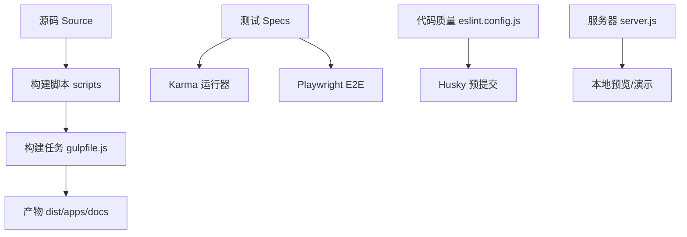
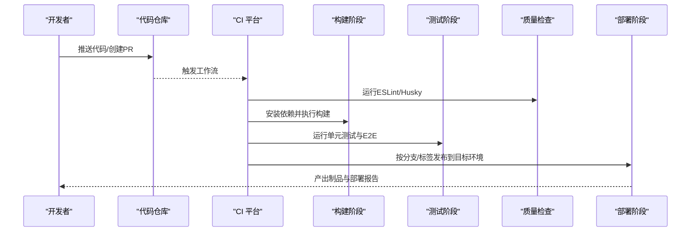
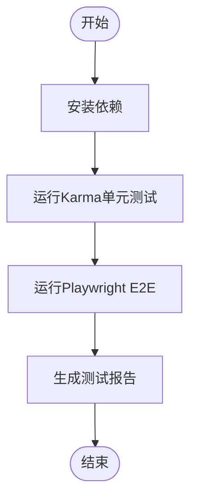
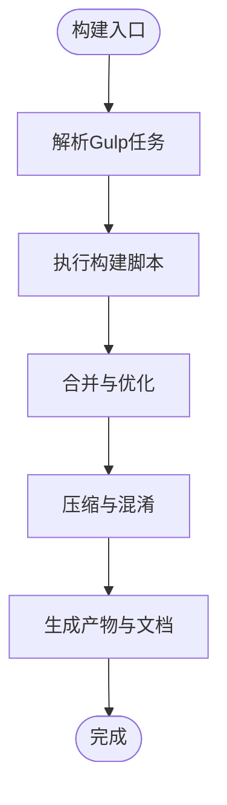
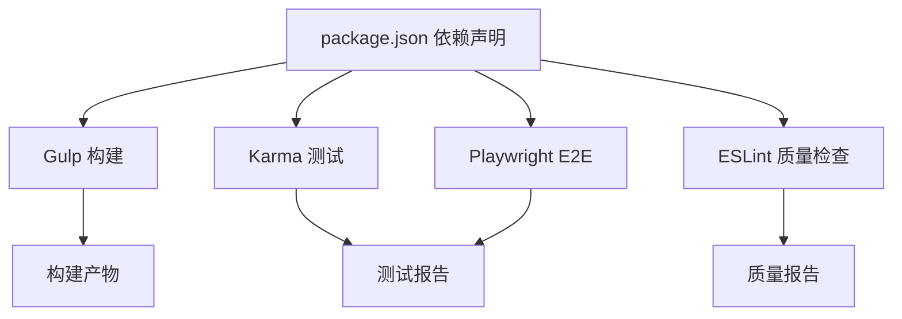

# CI/CD流水线配置

<cite>
**本文引用的文件**
- [package.json](file://package.json)
- [gulpfile.js](file://gulpfile.js)
- [scripts/build.js](file://scripts/build.js)
- [Scripts/buildSandcastle.js](file://scripts/buildSandcastle.js)
- [Specs/karma.conf.cjs](file://Specs/karma.conf.cjs)
- [Specs/spec-main.js](file://Specs/spec-main.js)
- [Specs/e2e/playwright.config.js](file://Specs/e2e/playwright.config.js)
- [Specs/e2e/test.js](file://Specs/e2e/test.js)
- [Specs/e2e/CesiumPage.js](file://Specs/e2e/CesiumPage.js)
- [Specs/e2e/viewer.spec.js](file://Specs/e2e/viewer.spec.js)
- [Specs/e2e/models.spec.js](file://Specs/e2e/models.spec.js)
- [Specs/e2e/sandcastle.spec.js](file://Specs/e2e/sandcastle.spec.js)
- [Specs/e2e/voxel-cameras.spec.js](file://Specs/e2e/voxel-cameras.spec.js)
- [server.js](file://server.js)
- [launches/runServer.launch](file://launches/runServer.launch)
- [launches/build.launch](file://launches/build.launch)
- [launches/buildApps.launch](file://launches/buildApps.launch)
- [launches/clean.launch](file://launches/clean.launch)
- [launches/combine.launch](file://launches/combine.launch)
- [launches/minify.launch](file://launches/minify.launch)
- [launches/release.launch](file://launches/release.launch)
- [launches/makeZipFile.launch](file://launches/makeZipFile.launch)
- [launches/generateDocumentation.launch](file://launches/generateDocumentation.launch)
- [launches/instrumentForCoverage.launch](file://launches/instrumentForCoverage.launch)
- [launches/runPublicServer.launch](file://launches/runPublicServer.launch)
- [eslint.config.js](file://eslint.config.js)
- [lint-staged.config.js](file://lint-staged.config.js)
- [.github/workflows](file://.github/workflows)
- [Documentation/Contributors/ContinuousIntegration/README.md](file://Documentation/Contributors/ContinuousIntegration/README.md)
</cite>

## 目录
1. [简介](#简介)
2. [项目结构](#项目结构)
3. [核心组件](#核心组件)
4. [架构总览](#架构总览)
5. [详细组件分析](#详细组件分析)
6. [依赖分析](#依赖分析)
7. [性能考虑](#性能考虑)
8. [故障排查指南](#故障排查指南)
9. [结论](#结论)
10. [附录](#附录)

## 简介
本指南面向Cesium应用的CI/CD流水线设计与落地，覆盖GitHub Actions、Jenkins与GitLab CI/CD三种主流平台的配置方法。内容包含：
- 自动化测试（单元测试、集成测试、端到端测试）
- 代码质量检查（ESLint、Husky预提交钩子）
- 构建打包（Gulp任务、Rollup插件、产物输出）
- 多环境部署（开发、测试、生产差异化配置）
- 回滚机制、蓝绿部署与金丝雀发布策略
- 完整流水线配置文件示例与最佳实践

## 项目结构
仓库采用“源码+工具链+测试+文档”的分层组织方式：
- Source：引擎与核心模块
- Apps：示例应用与静态资源
- Specs：测试套件（Karma + Jasmine、Playwright E2E）
- Tools：辅助工具与插件（如Rollup插件）
- Scripts：构建脚本与工具函数
- Gulpfile：构建任务编排
- Launches：本地调试与构建的VS Code启动配置
- .github/workflows：GitHub Actions工作流目录（待补充具体文件）

图表来源
- [gulpfile.js](file://gulpfile.js)
- [scripts/build.js](file://scripts/build.js)
- [Specs/karma.conf.cjs](file://Specs/karma.conf.cjs)
- [Specs/e2e/playwright.config.js](file://Specs/e2e/playwright.config.js)
- [eslint.config.js](file://eslint.config.js)
- [server.js](file://server.js)

章节来源
- [package.json](file://package.json)
- [gulpfile.js](file://gulpfile.js)
- [scripts/build.js](file://scripts/build.js)
- [Specs/karma.conf.cjs](file://Specs/karma.conf.cjs)
- [Specs/e2e/playwright.config.js](file://Specs/e2e/playwright.config.js)
- [eslint.config.js](file://eslint.config.js)
- [server.js](file://server.js)

## 核心组件
- 构建系统
  - Gulp任务编排：负责编译、合并、压缩、生成文档与打包等流程
  - 构建脚本：封装通用构建逻辑，供Gulp任务调用
- 测试体系
  - 单元测试：基于Karma+Jasmine，通过karma.conf.cjs与spec-main.js驱动
  - 端到端测试：基于Playwright，提供浏览器级交互验证
- 代码质量
  - ESLint规则集中管理，配合lint-staged在提交前执行
- 本地服务
  - 简易Node服务器用于本地预览与演示

章节来源
- [gulpfile.js](file://gulpfile.js)
- [scripts/build.js](file://scripts/build.js)
- [Specs/karma.conf.cjs](file://Specs/karma.conf.cjs)
- [Specs/spec-main.js](file://Specs/spec-main.js)
- [Specs/e2e/playwright.config.js](file://Specs/e2e/playwright.config.js)
- [eslint.config.js](file://eslint.config.js)
- [server.js](file://server.js)

## 架构总览
下图展示从代码提交到构建、测试、部署的端到端流水线概览。不同平台（GitHub Actions、Jenkins、GitLab CI）可复用相同的构建与测试命令，差异主要在触发条件、缓存与部署目标。

[此图为概念性流程图，不直接映射具体源文件]

## 详细组件分析

### GitHub Actions 工作流配置
- 触发条件
  - push至主分支或发布标签时触发构建与部署
  - pull_request事件触发测试与质量检查
- 关键步骤
  - 设置Node环境与缓存npm依赖
  - 安装依赖并执行构建
  - 运行ESLint与Husky预检
  - 运行Karma单元测试与Playwright E2E
  - 上传构建产物与测试报告
  - 根据分支/标签进行多环境部署（开发、测试、生产）
- 环境变量与密钥
  - 使用GitHub Secrets存储部署凭据与令牌
- 并行策略
  - 将测试与质量检查拆分为独立作业并行执行
  - 对E2E用例按功能域分片并行

章节来源
- [.github/workflows](file://.github/workflows)
- [package.json](file://package.json)
- [eslint.config.js](file://eslint.config.js)
- [Specs/karma.conf.cjs](file://Specs/karma.conf.cjs)
- [Specs/e2e/playwright.config.js](file://Specs/e2e/playwright.config.js)

### Jenkins 流水线配置
- Pipeline脚本要点
  - stages定义：拉取代码、安装依赖、构建、测试、质量检查、部署
  - parallel块：并行执行ESLint、Karma、Playwright
  - post块：失败通知、产物归档、清理工作空间
- 插件建议
  - NodeJS Plugin、Pipeline、Docker、Artifact Archiver、Email Extension
- 并行执行策略
  - 将测试与质量检查并行化，缩短整体耗时
  - 使用共享库统一构建与部署逻辑
- 多环境部署
  - 通过参数化构建选择目标环境
  - 使用凭据管理器注入部署密钥

章节来源
- [package.json](file://package.json)
- [gulpfile.js](file://gulpfile.js)
- [Specs/karma.conf.cjs](file://Specs/karma.conf.cjs)
- [Specs/e2e/playwright.config.js](file://Specs/e2e/playwright.config.js)
- [eslint.config.js](file://eslint.config.js)

### GitLab CI/CD 配置
- .gitlab-ci.yml要点
  - 定义stages：build、test、quality、deploy
  - cache与artifacts：缓存依赖与上传产物
  - rules与only/except：控制触发条件
- Docker镜像构建
  - 使用多阶段构建减小镜像体积
  - 缓存npm包与构建中间产物
- 多环境部署
  - 使用变量与模板实现差异化配置
  - 结合GitLab Pages或对象存储发布静态资源

章节来源
- [package.json](file://package.json)
- [gulpfile.js](file://gulpfile.js)
- [Specs/karma.conf.cjs](file://Specs/karma.conf.cjs)
- [Specs/e2e/playwright.config.js](file://Specs/e2e/playwright.config.js)
- [eslint.config.js](file://eslint.config.js)

### 自动化测试集成
- 单元测试（Karma + Jasmine）
  - 通过karma.conf.cjs配置测试入口与浏览器环境
  - spec-main.js加载测试规范与断言匹配器
- 端到端测试（Playwright）
  - playwright.config.js定义浏览器实例与基址
  - test.js作为E2E测试入口，CesiumPage封装页面操作
  - viewer.spec.js、models.spec.js、sandcastle.spec.js、voxel-cameras.spec.js覆盖核心场景
- 测试执行顺序与并行
  - 先运行单元测试，再运行E2E
  - E2E按功能域拆分并行执行，提升吞吐

章节来源
- [Specs/karma.conf.cjs](file://Specs/karma.conf.cjs)
- [Specs/spec-main.js](file://Specs/spec-main.js)
- [Specs/e2e/playwright.config.js](file://Specs/e2e/playwright.config.js)
- [Specs/e2e/test.js](file://Specs/e2e/test.js)
- [Specs/e2e/CesiumPage.js](file://Specs/e2e/CesiumPage.js)
- [Specs/e2e/viewer.spec.js](file://Specs/e2e/viewer.spec.js)
- [Specs/e2e/models.spec.js](file://Specs/e2e/models.spec.js)
- [Specs/e2e/sandcastle.spec.js](file://Specs/e2e/sandcastle.spec.js)
- [Specs/e2e/voxel-cameras.spec.js](file://Specs/e2e/voxel-cameras.spec.js)

### 构建与打包
- Gulp任务
  - build、minify、combine、release、makezip等任务由gulpfile.js编排
  - 构建脚本scripts/build.js封装通用逻辑，供任务调用
- Sandcastle构建
  - scripts/buildSandcastle.js负责示例站点构建
- 产物输出
  - 构建产物通常位于dist目录，包含压缩后的JS/CSS与文档站点

章节来源
- [gulpfile.js](file://gulpfile.js)
- [scripts/build.js](file://scripts/build.js)
- [scripts/buildSandcastle.js](file://scripts/buildSandcastle.js)

### 多环境部署策略
- 环境差异化配置
  - 开发：启用调试日志与热重载
  - 测试：关闭不必要特性，聚焦稳定性
  - 生产：启用最小化与缓存策略
- 回滚机制
  - 保留历史版本制品，支持一键回滚
- 蓝绿部署
  - 同时维护两套环境，切换流量指向新版本
- 金丝雀发布
  - 小流量灰度验证，逐步放量

章节来源
- [package.json](file://package.json)
- [gulpfile.js](file://gulpfile.js)
- [server.js](file://server.js)

### 本地开发与调试
- VS Code启动配置
  - runServer.launch：启动本地服务器
  - build.launch：执行构建任务
  - buildApps.launch：构建示例应用
  - clean.launch：清理构建产物
  - combine.launch：合并资源
  - minify.launch：压缩资源
  - release.launch：发布流程
  - makeZipFile.launch：打包压缩包
  - generateDocumentation.launch：生成文档
  - instrumentForCoverage.launch：覆盖率采集
  - runPublicServer.launch：公开服务器模式

章节来源
- [launches/runServer.launch](file://launches/runServer.launch)
- [launches/build.launch](file://launches/build.launch)
- [launches/buildApps.launch](file://launches/buildApps.launch)
- [launches/clean.launch](file://launches/clean.launch)
- [launches/combine.launch](file://launches/combine.launch)
- [launches/minify.launch](file://launches/minify.launch)
- [launches/release.launch](file://launches/release.launch)
- [launches/makeZipFile.launch](file://launches/makeZipFile.launch)
- [launches/generateDocumentation.launch](file://launches/generateDocumentation.launch)
- [launches/instrumentForCoverage.launch](file://launches/instrumentForCoverage.launch)
- [launches/runPublicServer.launch](file://launches/runPublicServer.launch)

## 依赖分析
- 构建与测试依赖
  - Gulp任务依赖Node生态工具链
  - Karma与Playwright分别承担单元与E2E测试
- 代码质量依赖
  - ESLint规则集中管理，lint-staged在提交前执行
- 外部服务集成
  - 部署阶段可能对接云存储、CDN或容器平台

图表来源
- [package.json](file://package.json)
- [gulpfile.js](file://gulpfile.js)
- [Specs/karma.conf.cjs](file://Specs/karma.conf.cjs)
- [Specs/e2e/playwright.config.js](file://Specs/e2e/playwright.config.js)
- [eslint.config.js](file://eslint.config.js)

章节来源
- [package.json](file://package.json)
- [gulpfile.js](file://gulpfile.js)
- [Specs/karma.conf.cjs](file://Specs/karma.conf.cjs)
- [Specs/e2e/playwright.config.js](file://Specs/e2e/playwright.config.js)
- [eslint.config.js](file://eslint.config.js)

## 性能考虑
- 依赖缓存
  - 在CI中缓存node_modules与构建中间产物，显著缩短构建时间
- 并行执行
  - 将测试与质量检查并行化，E2E按功能域分片
- 产物优化
  - 启用压缩与按需加载，减少首屏加载时间
- 资源隔离
  - 为不同环境准备独立的资源与配置，避免运行时切换开销

[本节为通用指导，不直接分析具体文件]

## 故障排查指南
- 构建失败
  - 检查Node版本与依赖安装日志
  - 确认Gulp任务与构建脚本路径正确
- 测试失败
  - 查看Karma与Playwright测试报告定位问题
  - 确认浏览器环境与网络依赖可用
- 质量检查失败
  - 依据ESLint报告修复代码风格与潜在问题
- 部署失败
  - 核对环境变量与密钥配置
  - 检查目标平台权限与网络连通性

章节来源
- [Specs/karma.conf.cjs](file://Specs/karma.conf.cjs)
- [Specs/e2e/playwright.config.js](file://Specs/e2e/playwright.config.js)
- [eslint.config.js](file://eslint.config.js)
- [gulpfile.js](file://gulpfile.js)

## 结论
通过统一的构建与测试命令，可在GitHub Actions、Jenkins与GitLab CI/CD中快速搭建一致的CI/CD流水线。结合并行执行、缓存与多环境部署策略，能够显著提升交付效率与稳定性。建议在团队内沉淀标准模板与最佳实践，持续优化流水线性能与可靠性。

[本节为总结性内容，不直接分析具体文件]

## 附录
- 参考文档
  - 持续集成贡献指南：[Documentation/Contributors/ContinuousIntegration/README.md](file://Documentation/Contributors/ContinuousIntegration/README.md)
- 常用命令
  - 构建：参考Gulp任务与构建脚本
  - 测试：参考Karma与Playwright配置
  - 质量检查：参考ESLint配置与lint-staged

章节来源
- [Documentation/Contributors/ContinuousIntegration/README.md](file://Documentation/Contributors/ContinuousIntegration/README.md)
- [gulpfile.js](file://gulpfile.js)
- [Specs/karma.conf.cjs](file://Specs/karma.conf.cjs)
- [Specs/e2e/playwright.config.js](file://Specs/e2e/playwright.config.js)
- [eslint.config.js](file://eslint.config.js)