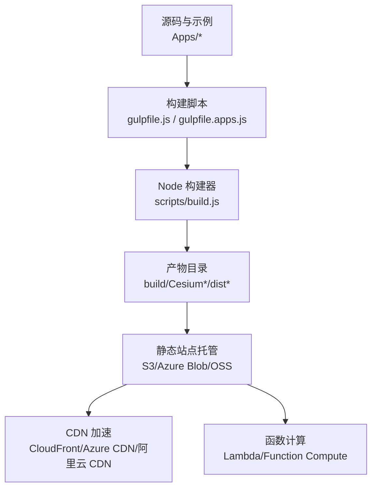
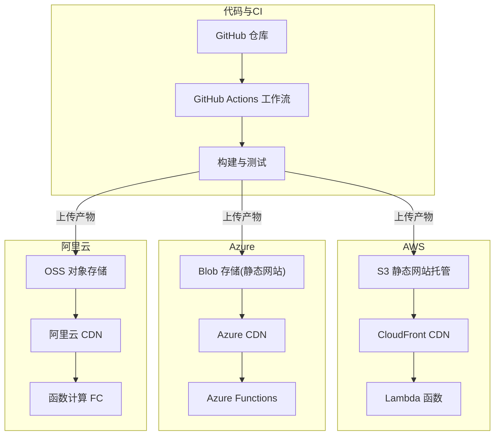
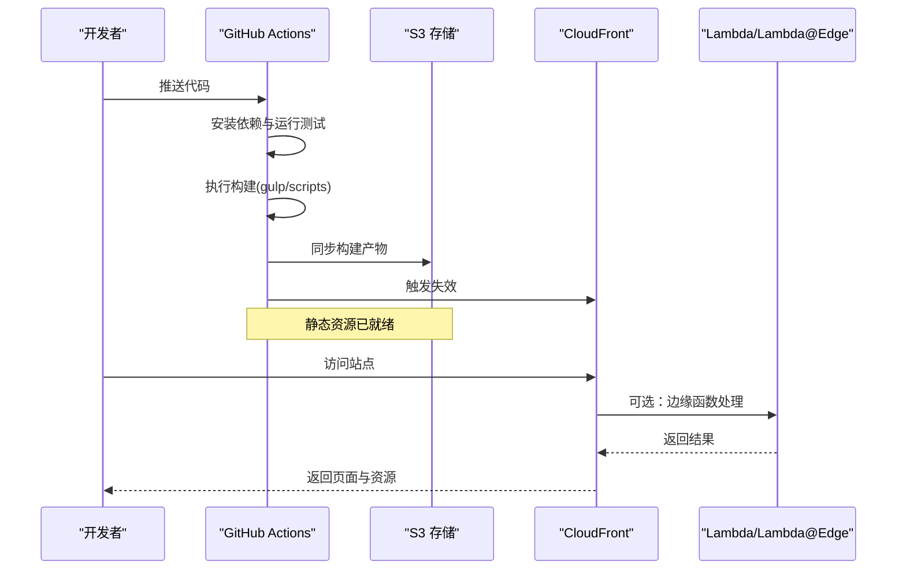
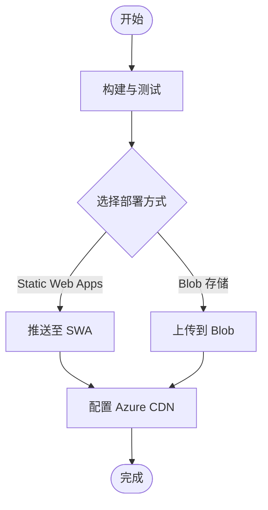
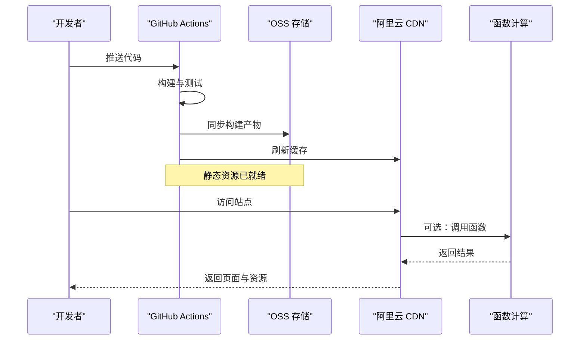
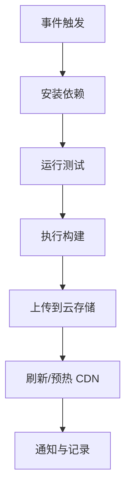
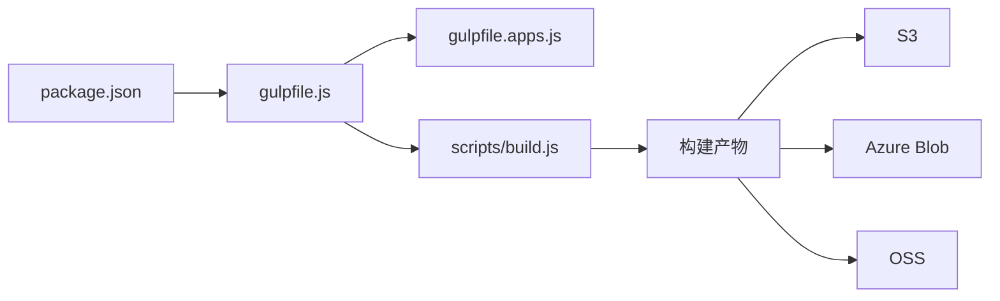

# 云平台部署

<cite>
**本文引用的文件**   
- [README.md](file://README.md)
- [package.json](file://package.json)
- [gulpfile.js](file://gulpfile.js)
- [gulpfile.apps.js](file://gulpfile.apps.js)
- [scripts/build.js](file://scripts/build.js)
- [server.js](file://server.js)
- [.github/workflows/ci.yml](file://.github/workflows/ci.yml)
- [Apps/CesiumViewer/index.html](file://Apps/CesiumViewer/index.html)
- [Apps/HelloWorld.html](file://Apps/HelloWorld.html)
</cite>

## 目录
1. [简介](#简介)
2. [项目结构](#项目结构)
3. [核心组件](#核心组件)
4. [架构总览](#架构总览)
5. [详细组件分析](#详细组件分析)
6. [依赖分析](#依赖分析)
7. [性能考虑](#性能考虑)
8. [故障排查指南](#故障排查指南)
9. [结论](#结论)
10. [附录](#附录)

## 简介
本指南面向在主流云平台上部署 Cesium 静态站点与示例应用（如 Apps/CesiumViewer）的工程团队，提供 AWS、Azure、阿里云的完整部署方案，涵盖对象存储、CDN、函数计算集成、CI/CD 流水线、监控告警以及成本优化实践。文档同时结合仓库中的构建脚本与 GitHub Actions 工作流，给出可落地的自动化流程建议。

## 项目结构
Cesium 仓库包含示例应用与构建工具链：
- 示例应用位于 Apps 目录，可直接作为静态站点托管
- 构建与打包由 Gulp 与 Node 脚本驱动
- CI 通过 GitHub Actions 编排测试、构建与发布任务

图表来源
- [gulpfile.js:1-200](file://gulpfile.js#L1-L200)
- [gulpfile.apps.js:1-200](file://gulpfile.apps.js#L1-L200)
- [scripts/build.js:1-200](file://scripts/build.js#L1-L200)

章节来源
- [README.md:1-200](file://README.md#L1-L200)
- [package.json:1-200](file://package.json#L1-L200)
- [gulpfile.js:1-200](file://gulpfile.js#L1-L200)
- [gulpfile.apps.js:1-200](file://gulpfile.apps.js#L1-L200)
- [scripts/build.js:1-200](file://scripts/build.js#L1-L200)

## 核心组件
- 构建系统
  - Gulp 任务负责编译、合并、压缩与资源处理
  - scripts/build.js 提供底层构建能力，供 Gulp 调用
- 示例应用
  - Apps/CesiumViewer/index.html 为典型入口页面
  - Apps/HelloWorld.html 为最小化示例
- 本地开发服务器
  - server.js 提供本地预览服务，便于调试

章节来源
- [gulpfile.js:1-200](file://gulpfile.js#L1-L200)
- [gulpfile.apps.js:1-200](file://gulpfile.apps.js#L1-L200)
- [scripts/build.js:1-200](file://scripts/build.js#L1-L200)
- [Apps/CesiumViewer/index.html:1-200](file://Apps/CesiumViewer/index.html#L1-L200)
- [Apps/HelloWorld.html:1-200](file://Apps/HelloWorld.html#L1-L200)
- [server.js:1-200](file://server.js#L1-L200)

## 架构总览
下图展示 Cesium 静态站点在云平台的通用架构：代码提交触发 CI/CD，构建产物上传至对象存储，通过 CDN 分发；必要时通过函数计算实现服务端逻辑或边缘处理。

图表来源
- [.github/workflows/ci.yml:1-200](file://.github/workflows/ci.yml#L1-L200)
- [gulpfile.js:1-200](file://gulpfile.js#L1-L200)
- [scripts/build.js:1-200](file://scripts/build.js#L1-L200)

## 详细组件分析

### AWS 部署方案（S3 + CloudFront + Lambda）
- 静态站点托管
  - 将构建产物上传到 S3 Bucket，并启用“静态网站托管”
  - 配置默认索引文档与错误页，确保 SPA 路由回退
- CDN 加速
  - 创建 CloudFront 分配，源指向 S3 静态网站域名
  - 设置缓存策略与 TTL，开启 gzip/brotli 压缩
  - 配置 HTTPS 证书与自定义域名
- Lambda 集成
  - 使用 CloudFront Functions 或 Lambda@Edge 处理请求重写、鉴权、A/B 分流等
  - 通过 API Gateway 或直接调用后端服务时，注意跨域与安全头配置
- 部署流程
  - CI 中执行测试与构建，生成 build 目录
  - 使用 aws s3 sync 同步产物到 S3
  - 触发 CloudFront 失效以刷新缓存

图表来源
- [.github/workflows/ci.yml:1-200](file://.github/workflows/ci.yml#L1-L200)
- [gulpfile.js:1-200](file://gulpfile.js#L1-L200)
- [scripts/build.js:1-200](file://scripts/build.js#L1-L200)

章节来源
- [README.md:1-200](file://README.md#L1-L200)
- [package.json:1-200](file://package.json#L1-L200)
- [gulpfile.js:1-200](file://gulpfile.js#L1-L200)
- [scripts/build.js:1-200](file://scripts/build.js#L1-L200)
- [.github/workflows/ci.yml:1-200](file://.github/workflows/ci.yml#L1-L200)

### Azure 部署方案（Static Web Apps / Blob + CDN + Functions）
- 静态站点托管
  - 使用 Azure Static Web Apps 直接关联 GitHub 仓库，自动构建与部署
  - 或在 Blob 存储启用静态网站功能，手动上传构建产物
- CDN 加速
  - 为静态网站或 Blob 端点配置 Azure CDN，启用压缩与缓存规则
- 函数计算
  - 使用 Azure Functions 提供后端能力，配合 CORS 与鉴权中间件
- 部署流程
  - 在 GitHub Actions 中调用 az cli 或 Azure SWA CLI 进行部署
  - 或使用 Azure Pipelines 完成构建与发布

图表来源
- [.github/workflows/ci.yml:1-200](file://.github/workflows/ci.yml#L1-L200)
- [gulpfile.js:1-200](file://gulpfile.js#L1-L200)
- [scripts/build.js:1-200](file://scripts/build.js#L1-L200)

章节来源
- [README.md:1-200](file://README.md#L1-L200)
- [package.json:1-200](file://package.json#L1-L200)
- [gulpfile.js:1-200](file://gulpfile.js#L1-L200)
- [scripts/build.js:1-200](file://scripts/build.js#L1-L200)
- [.github/workflows/ci.yml:1-200](file://.github/workflows/ci.yml#L1-L200)

### 阿里云部署方案（OSS + CDN + 函数计算）
- 静态站点托管
  - 将构建产物上传到 OSS Bucket，并启用静态页面访问
  - 配置默认首页与 404 回退，支持单页应用路由
- CDN 加速
  - 为 OSS 域名配置阿里云 CDN，开启压缩、缓存与 HTTPS
- 函数计算
  - 使用函数计算（FC）提供后端接口或边缘逻辑，配合网关与鉴权
- 部署流程
  - 在 CI 中使用 ossutil 或 aliyun CLI 同步构建产物到 OSS
  - 触发 CDN 预热或刷新缓存

图表来源
- [.github/workflows/ci.yml:1-200](file://.github/workflows/ci.yml#L1-L200)
- [gulpfile.js:1-200](file://gulpfile.js#L1-L200)
- [scripts/build.js:1-200](file://scripts/build.js#L1-L200)

章节来源
- [README.md:1-200](file://README.md#L1-L200)
- [package.json:1-200](file://package.json#L1-L200)
- [gulpfile.js:1-200](file://gulpfile.js#L1-L200)
- [scripts/build.js:1-200](file://scripts/build.js#L1-L200)
- [.github/workflows/ci.yml:1-200](file://.github/workflows/ci.yml#L1-L200)

### GitHub Actions CI/CD 流水线
- 触发条件
  - 推送分支或 Pull Request 时触发
- 步骤
  - 安装依赖
  - 运行单元测试与端到端测试
  - 执行构建（Gulp 与 Node 脚本）
  - 上传构建产物到云存储（按平台选择对应 CLI）
  - 触发 CDN 刷新或预热
- 缓存与并行
  - 缓存 node_modules 提升构建速度
  - 多阶段并行执行测试与构建

图表来源
- [.github/workflows/ci.yml:1-200](file://.github/workflows/ci.yml#L1-L200)
- [gulpfile.js:1-200](file://gulpfile.js#L1-L200)
- [scripts/build.js:1-200](file://scripts/build.js#L1-L200)

章节来源
- [.github/workflows/ci.yml:1-200](file://.github/workflows/ci.yml#L1-L200)
- [gulpfile.js:1-200](file://gulpfile.js#L1-L200)
- [scripts/build.js:1-200](file://scripts/build.js#L1-L200)

## 依赖分析
- 构建依赖
  - Gulp 任务与 Node 脚本共同驱动构建过程
  - package.json 声明了构建与测试所需的依赖
- 运行时依赖
  - 示例应用依赖 Cesium 库与浏览器环境
- 外部集成
  - CI 依赖各云厂商 CLI 或 SDK 进行部署与缓存管理

图表来源
- [package.json:1-200](file://package.json#L1-L200)
- [gulpfile.js:1-200](file://gulpfile.js#L1-L200)
- [gulpfile.apps.js:1-200](file://gulpfile.apps.js#L1-L200)
- [scripts/build.js:1-200](file://scripts/build.js#L1-L200)

章节来源
- [package.json:1-200](file://package.json#L1-L200)
- [gulpfile.js:1-200](file://gulpfile.js#L1-L200)
- [gulpfile.apps.js:1-200](file://gulpfile.apps.js#L1-L200)
- [scripts/build.js:1-200](file://scripts/build.js#L1-L200)

## 性能考虑
- 资源压缩与缓存
  - 启用 gzip/brotli 压缩，合理设置 Cache-Control 与 ETag
- 分片与按需加载
  - 对大模型与纹理进行分块与懒加载，减少首屏体积
- CDN 优化
  - 针对热点资源设置更长 TTL，非热点资源短 TTL 并开启版本化
- 边缘计算
  - 使用 Lambda@Edge 或函数计算进行请求改写与鉴权，降低源站压力
- 监控与回滚
  - 建立健康检查与指标采集，快速定位问题并支持灰度与回滚

[本节为通用指导，不直接分析具体文件]

## 故障排查指南
- 常见问题
  - 404 路由回退未生效：检查静态站点默认文档与错误页配置
  - 跨域失败：确认后端或函数计算的 CORS 响应头
  - 缓存未更新：检查 CDN 缓存策略与是否触发刷新
- 日志与诊断
  - 查看对象存储访问日志与 CDN 访问日志
  - 在函数计算中启用结构化日志与错误追踪
- 回滚策略
  - 使用版本化存储与别名域名，快速切换旧版本

章节来源
- [README.md:1-200](file://README.md#L1-L200)
- [server.js:1-200](file://server.js#L1-L200)

## 结论
通过在对象存储上托管构建产物并结合 CDN 加速，Cesium 静态站点可在 AWS、Azure、阿里云获得高性能与高可用。借助 GitHub Actions 实现自动化测试、构建与部署，并在需要时引入函数计算扩展业务逻辑。配合完善的监控与告警机制以及成本优化策略，可保障生产环境的稳定与经济性。

[本节为总结性内容，不直接分析具体文件]

## 附录
- 参考入口页面
  - Apps/CesiumViewer/index.html
  - Apps/HelloWorld.html
- 本地开发
  - 使用 server.js 启动本地服务进行验证

章节来源
- [Apps/CesiumViewer/index.html:1-200](file://Apps/CesiumViewer/index.html#L1-L200)
- [Apps/HelloWorld.html:1-200](file://Apps/HelloWorld.html#L1-L200)
- [server.js:1-200](file://server.js#L1-L200)