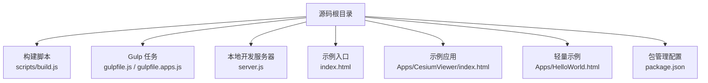
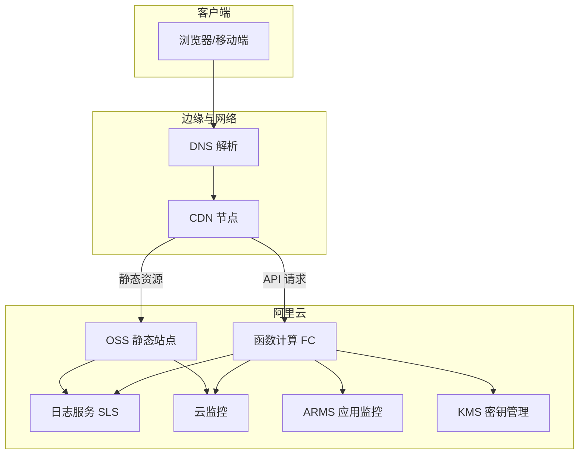
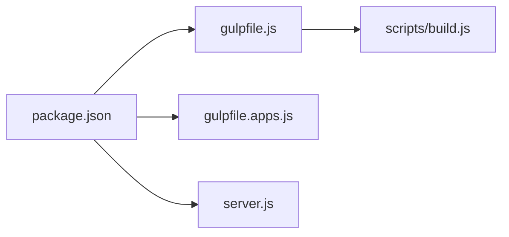

# 阿里云部署方案

<cite>
**本文引用的文件**   
- [index.html](file://index.html)
- [server.js](file://server.js)
- [package.json](file://package.json)
- [gulpfile.js](file://gulpfile.js)
- [gulpfile.apps.js](file://gulpfile.apps.js)
- [build.js](file://scripts/build.js)
- [CesiumViewer/index.html](file://Apps/CesiumViewer/index.html)
- [HelloWorld.html](file://Apps/HelloWorld.html)
</cite>

## 目录
1. [简介](#简介)
2. [项目结构](#项目结构)
3. [核心组件](#核心组件)
4. [架构总览](#架构总览)
5. [详细组件分析](#详细组件分析)
6. [依赖分析](#依赖分析)
7. [性能考虑](#性能考虑)
8. [故障排查指南](#故障排查指南)
9. [结论](#结论)
10. [附录](#附录)

## 简介
本指南面向在阿里云平台部署 Cesium 静态站点与动态能力的工程团队，提供从对象存储、CDN、函数计算、监控到弹性伸缩与安全加固的一体化落地方案。内容覆盖：
- OSS 静态网站托管配置（Bucket 权限、默认首页、跨域）
- CDN 加速配置（源站、缓存规则、HTTPS 证书）
- 函数计算 FC 集成（动态 API、数据处理）
- 监控体系（云监控、日志服务、ARMS）
- 弹性伸缩策略（按访问量自动扩缩容）
- 安全组、访问控制与数据加密最佳实践
- ROS 资源编排模板与 CLI 部署脚本示例

## 项目结构
仓库为 Cesium 源码与示例应用集合，包含构建脚本、本地开发服务器与示例页面。用于部署的产物通常由构建流程生成，最终输出静态资源（HTML/CSS/JS/模型/瓦片等）。

图表来源
- [build.js](file://scripts/build.js)
- [gulpfile.js](file://gulpfile.js)
- [gulpfile.apps.js](file://gulpfile.apps.js)
- [server.js](file://server.js)
- [index.html](file://index.html)
- [CesiumViewer/index.html](file://Apps/CesiumViewer/index.html)
- [HelloWorld.html](file://Apps/HelloWorld.html)
- [package.json](file://package.json)

章节来源
- [index.html](file://index.html)
- [server.js](file://server.js)
- [package.json](file://package.json)
- [gulpfile.js](file://gulpfile.js)
- [gulpfile.apps.js](file://gulpfile.apps.js)
- [build.js](file://scripts/build.js)
- [CesiumViewer/index.html](file://Apps/CesiumViewer/index.html)
- [HelloWorld.html](file://Apps/HelloWorld.html)

## 核心组件
- 构建与打包
  - 使用 Gulp 任务与自定义构建脚本组织构建流程，产出静态资源供托管。
- 本地开发服务器
  - 提供本地预览能力，便于验证资源路径与跨域行为。
- 示例页面
  - 提供最小可运行入口，便于快速验证部署链路。

章节来源
- [gulpfile.js](file://gulpfile.js)
- [gulpfile.apps.js](file://gulpfile.apps.js)
- [build.js](file://scripts/build.js)
- [server.js](file://server.js)
- [index.html](file://index.html)
- [CesiumViewer/index.html](file://Apps/CesiumViewer/index.html)
- [HelloWorld.html](file://Apps/HelloWorld.html)

## 架构总览
推荐采用“OSS + CDN + FC”的混合架构：静态资源通过 OSS 静态网站托管并由 CDN 加速；动态 API 与数据处理通过函数计算承载；统一通过域名与 HTTPS 对外暴露，并接入监控与日志。

图表来源
- [index.html](file://index.html)
- [server.js](file://server.js)
- [package.json](file://package.json)

## 详细组件分析

### OSS 静态网站托管配置
- Bucket 权限
  - 将 Bucket 设置为公共读或开启匿名访问，确保浏览器可直接加载静态资源。
- 静态页面配置
  - 设置默认首页与 404 重定向页，使根路径直接返回应用入口。
- 跨域访问（CORS）
  - 针对 Cesium 可能发起的跨域请求（如外部模型、矢量数据、第三方地图），在 Bucket 上配置允许的来源、方法与头字段，避免跨域拦截。
- 上传与版本化
  - 建议对构建产物启用版本号或哈希命名，配合 CDN 缓存失效策略实现灰度发布。

章节来源
- [index.html](file://index.html)
- [CesiumViewer/index.html](file://Apps/CesiumViewer/index.html)
- [HelloWorld.html](file://Apps/HelloWorld.html)

### CDN 加速配置
- 源站配置
  - 将 CDN 源站指向 OSS 静态站点域名，开启回源跟随与必要头部透传。
- 缓存规则优化
  - 对静态资源（js/css/img/tileset.json/gltf/glb 等）设置较长缓存时间；对 index.html 与 tileset.json 设置较短缓存时间，以便更新生效。
- HTTPS 证书管理
  - 绑定自有域名并上传/申请证书，强制 HTTPS；必要时开启 HSTS 提升安全性。
- 刷新预热
  - 发布后批量刷新缓存，并对热点资源进行预热，降低冷启动延迟。

章节来源
- [index.html](file://index.html)
- [CesiumViewer/index.html](file://Apps/CesiumViewer/index.html)

### 函数计算 FC 集成（动态 API 与数据处理）
- 适用场景
  - 鉴权代理、坐标转换、数据裁剪、临时签名生成、聚合统计等。
- 集成方式
  - 通过 API 网关触发函数，或在浏览器端直调函数 URL（需做好鉴权与限流）。
- 安全与成本
  - 结合 RAM 最小权限原则与 VPC 内网访问，减少公网暴露面；按需计费，适合突发流量。

章节来源
- [server.js](file://server.js)
- [package.json](file://package.json)

### 监控与可观测性
- 云监控
  - 为 OSS 与 FC 创建自定义指标与告警规则（QPS、错误率、延迟、带宽）。
- 日志服务 SLS
  - 采集 OSS 访问日志与 FC 执行日志，建立查询与分析看板。
- ARMS 应用监控
  - 对前端页面注入探针，采集首屏时间、错误堆栈与用户行为。

章节来源
- [index.html](file://index.html)
- [server.js](file://server.js)

### 弹性伸缩配置
- 目标
  - 根据 QPS、CPU 利用率或自定义业务指标自动扩缩容，保障峰值体验同时降低成本。
- 策略建议
  - 基于 FC 实例数或后端服务的 CPU/内存阈值设定扩容/缩容规则；结合 CDN 命中率与 OSS 带宽作为辅助指标。

章节来源
- [package.json](file://package.json)
- [server.js](file://server.js)

### 安全组、访问控制与数据加密
- 访问控制
  - 使用 RAM 子账号与最小权限策略；对敏感操作启用 MFA。
- 网络安全
  - 仅开放必要端口；FC 尽量运行于 VPC 内网；对 API 网关启用 IP 白名单与 WAF。
- 数据加密
  - 传输层强制 HTTPS；服务端与数据库使用 KMS 管理的密钥；OSS 开启服务端加密。

章节来源
- [server.js](file://server.js)
- [package.json](file://package.json)

### 构建与发布流水线
- 构建产物
  - 通过 Gulp 与构建脚本生成静态资源，输出至指定目录。
- 发布步骤
  - 构建 → 上传至 OSS → 刷新 CDN 缓存 → 发布 FC 函数 → 更新监控与告警。

章节来源
- [gulpfile.js](file://gulpfile.js)
- [gulpfile.apps.js](file://gulpfile.apps.js)
- [build.js](file://scripts/build.js)

## 依赖分析
- 构建与运行依赖
  - 通过包管理工具声明依赖，Gulp 任务驱动构建流程。
- 运行时依赖
  - 本地开发服务器用于调试；生产环境无需运行该服务。

图表来源
- [package.json](file://package.json)
- [gulpfile.js](file://gulpfile.js)
- [gulpfile.apps.js](file://gulpfile.apps.js)
- [build.js](file://scripts/build.js)
- [server.js](file://server.js)

章节来源
- [package.json](file://package.json)
- [gulpfile.js](file://gulpfile.js)
- [gulpfile.apps.js](file://gulpfile.apps.js)
- [build.js](file://scripts/build.js)
- [server.js](file://server.js)

## 性能考虑
- 资源压缩与合并
  - 启用 JS/CSS 压缩与图片优化，减少体积。
- 缓存策略
  - 静态资源长缓存，入口与清单短缓存；利用 CDN 边缘缓存。
- 大模型与瓦片
  - 使用 glTF Draco/KTX2 压缩；合理分块与 LOD；按需加载。
- 并发与连接复用
  - 浏览器侧限制并行下载数量；HTTP/2 提升吞吐。
- 前端可观测
  - 接入 ARMS 或自研埋点，关注首帧、交互响应与错误率。

## 故障排查指南
- 常见问题
  - 跨域报错：检查 OSS CORS 规则与请求头是否匹配。
  - 404 未命中：确认默认首页与路径大小写、CDN 缓存未刷新。
  - 模型加载失败：检查资源路径、MIME 类型与网络可达性。
  - 函数调用超时：查看 FC 日志与依赖库体积，优化冷启动。
- 定位手段
  - 浏览器开发者工具 Network/Console；SLS 日志检索；云监控告警事件。

章节来源
- [server.js](file://server.js)
- [index.html](file://index.html)

## 结论
通过 OSS + CDN + FC 的组合，可在阿里云上以低成本、高可用方式交付 Cesium 可视化应用。配合完善的监控、弹性与安全策略，能够兼顾性能、稳定性与合规要求。建议在 CI/CD 中固化构建与发布流程，持续优化缓存与资源体积，完善可观测性与告警闭环。

## 附录

### 部署步骤（概览）
- 准备阶段
  - 创建 OSS Bucket 并开启静态网站托管；配置默认首页与 404 页。
  - 配置 CORS 规则，允许前端域名与方法。
- 构建与上传
  - 执行构建脚本生成静态资源；上传至 OSS。
- CDN 配置
  - 绑定域名与证书；设置缓存规则；刷新缓存。
- 函数计算
  - 编写并部署函数；配置 API 网关或函数 URL；设置环境变量与权限。
- 监控与告警
  - 接入云监控、SLS 与 ARMS；配置关键指标告警。
- 弹性伸缩
  - 基于指标配置扩缩容策略；压测验证效果。

### 安全基线清单
- 强制 HTTPS 与 HSTS
- 最小权限的 RAM 角色与策略
- 敏感信息通过 KMS 管理
- 接口鉴权与限流
- 定期漏洞扫描与依赖升级

### 参考入口与示例
- 示例入口
  - [index.html](file://index.html)
  - [CesiumViewer/index.html](file://Apps/CesiumViewer/index.html)
  - [HelloWorld.html](file://Apps/HelloWorld.html)
- 构建与本地服务
  - [gulpfile.js](file://gulpfile.js)
  - [gulpfile.apps.js](file://gulpfile.apps.js)
  - [build.js](file://scripts/build.js)
  - [server.js](file://server.js)
  - [package.json](file://package.json)