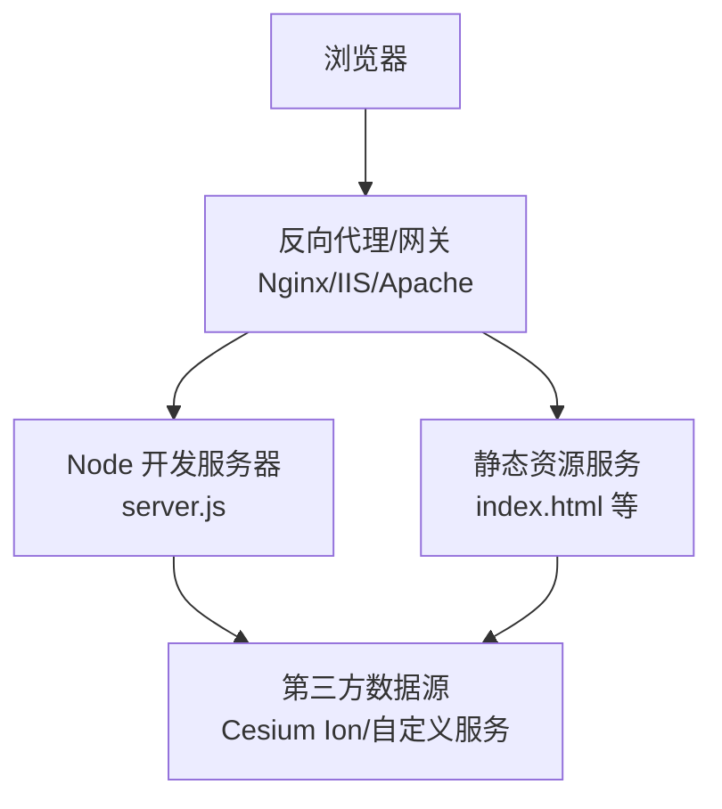
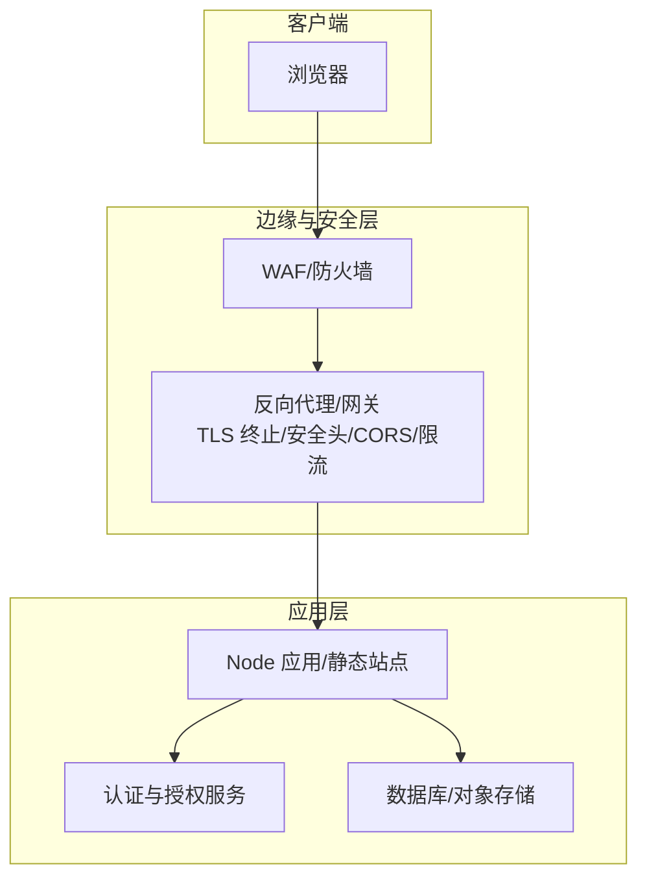
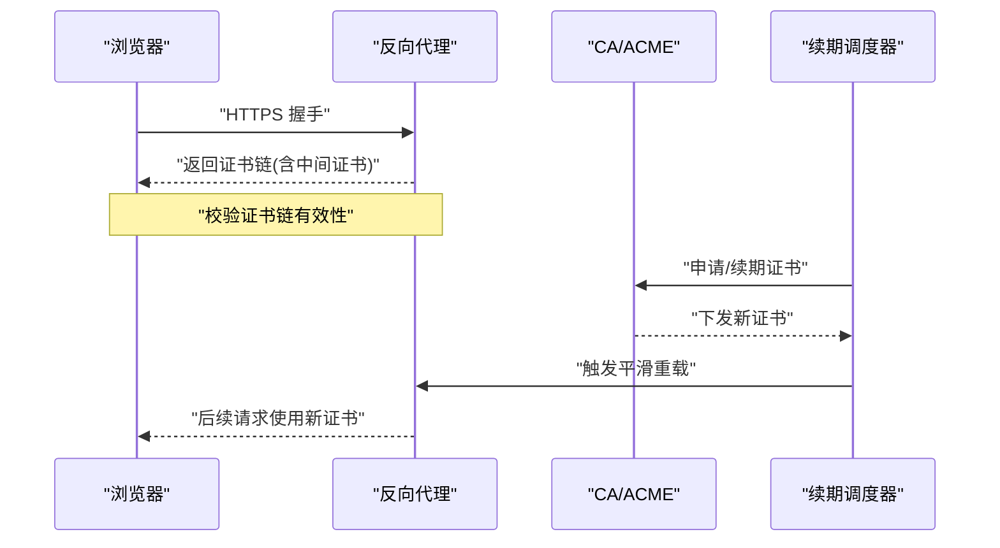
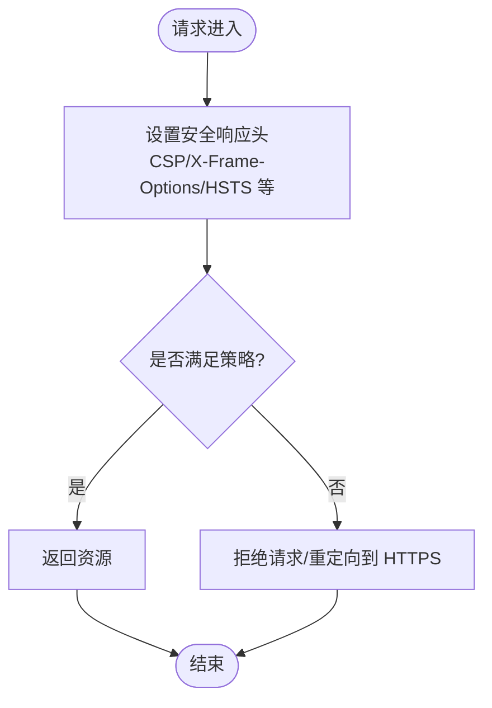
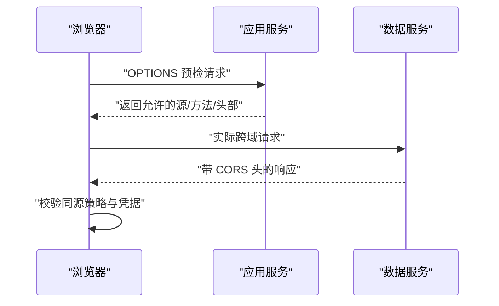
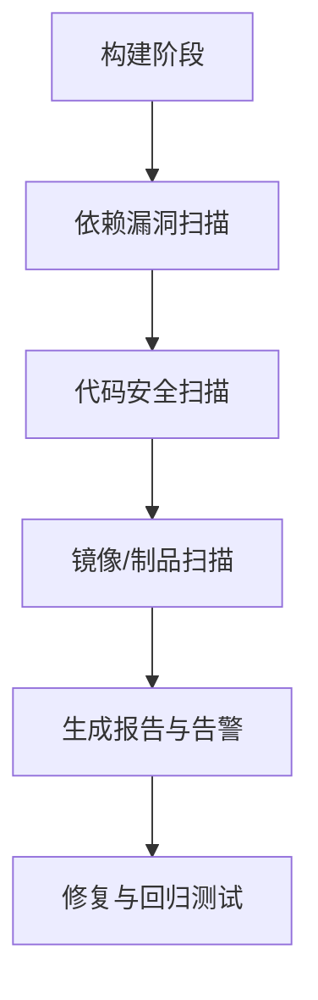
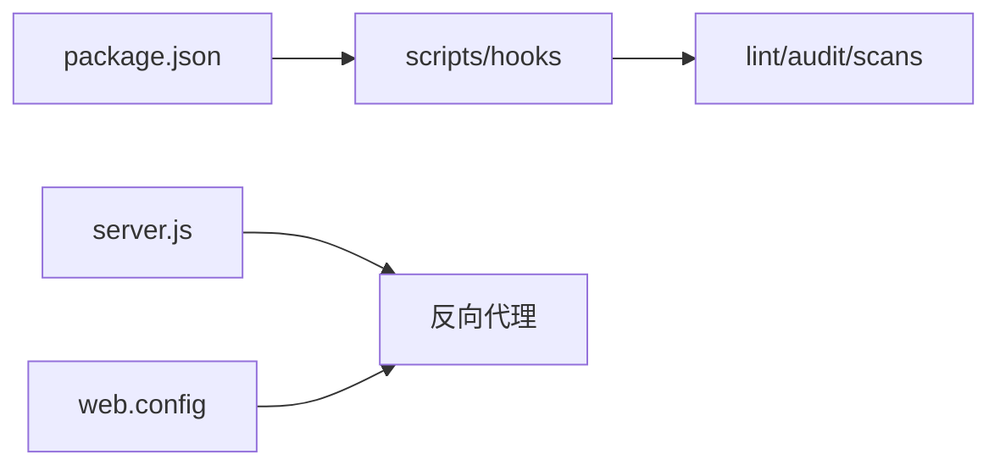

# 安全加固配置

<cite>
**本文引用的文件**   
- [server.js](file://server.js)
- [index.html](file://index.html)
- [package.json](file://package.json)
- [.github/workflows/ci.yml](file://.github/workflows/ci.yml)
- [web.config](file://web.config)
</cite>

## 目录
1. [简介](#简介)
2. [项目结构](#项目结构)
3. [核心组件](#核心组件)
4. [架构总览](#架构总览)
5. [详细组件分析](#详细组件分析)
6. [依赖分析](#依赖分析)
7. [性能考虑](#性能考虑)
8. [故障排查指南](#故障排查指南)
9. [结论](#结论)
10. [附录](#附录)

## 简介
本指南面向在生产环境部署 Cesium 的运维与开发团队，提供端到端的安全加固建议与实践。内容覆盖：
- SSL/TLS 证书配置与管理（含 Let's Encrypt 自动续期与证书链验证）
- HTTP 安全响应头（CSP、X-Frame-Options、HSTS 等）
- 跨域请求（CORS）策略与最佳实践
- API 密钥与敏感信息保护（环境变量与加密存储）
- 输入验证与输出编码
- 常见 Web 攻击防护（XSS、CSRF、SQL 注入）
- 安全审计与漏洞扫描集成

说明：仓库未包含内置的服务器或前端安全中间件实现，因此本节以“生产部署层”（反向代理/网关/容器平台）为主进行指导，并结合仓库中现有入口文件给出最小化落地方案。

## 项目结构
从安全视角关注以下与部署和入口相关的文件：
- server.js：本地开发服务器脚本，便于理解默认行为与扩展点
- index.html：应用主页面，可作为 CSP 策略注入位置之一
- package.json：构建与运行脚本、依赖清单，用于集成安全工具链
- .github/workflows/ci.yml：CI 流水线入口，可嵌入安全扫描任务
- web.config：IIS 站点配置文件，可用于设置 IIS 层的安全响应头

图表来源
- [server.js:1-200](file://server.js#L1-L200)
- [index.html:1-200](file://index.html#L1-L200)

章节来源
- [server.js:1-200](file://server.js#L1-L200)
- [index.html:1-200](file://index.html#L1-L200)
- [package.json:1-200](file://package.json#L1-L200)
- [.github/workflows/ci.yml:1-200](file://.github/workflows/ci.yml#L1-L200)
- [web.config:1-200](file://web.config#L1-L200)

## 核心组件
- 反向代理/网关层：负责 TLS 终止、HTTP 安全头、CORS、限流与访问控制
- Node 开发服务器：仅用于开发与演示；生产应通过反向代理对外提供服务
- 静态资源与页面：在构建产物中注入 CSP 等安全相关元信息
- CI 流水线：集成安全扫描与依赖检查，保障供应链安全

章节来源
- [server.js:1-200](file://server.js#L1-L200)
- [index.html:1-200](file://index.html#L1-L200)
- [package.json:1-200](file://package.json#L1-L200)
- [.github/workflows/ci.yml:1-200](file://.github/workflows/ci.yml#L1-L200)

## 架构总览
下图展示生产环境的典型安全边界与关键组件交互。

[此图为概念性架构图，不直接映射具体源码文件]

## 详细组件分析

### SSL/TLS 证书配置与管理
- 证书来源
  - 推荐使用受信任 CA 签发的证书（如 Let’s Encrypt），并启用自动续期
  - 确保证书链完整，避免缺少中间证书导致握手失败
- 协议与套件
  - 禁用旧版协议（SSLv3、TLS1.0/1.1），仅允许 TLS1.2+
  - 选择强密码套件，优先 AEAD 算法，禁用已知弱套件
- 会话与会话票证
  - 合理设置会话缓存与超时，平衡性能与安全性
- 证书透明度与监控
  - 启用 CT 日志监控，及时发现异常签发
- 自动化续期
  - 使用 ACME 客户端（如 certbot）配合系统定时任务或容器编排平台完成自动续期
  - 在续期后触发平滑重载（如 Nginx reload），避免中断连接

图表来源
- [server.js:1-200](file://server.js#L1-L200)

章节来源
- [server.js:1-200](file://server.js#L1-L200)

### HTTP 安全响应头配置
- Content Security Policy（CSP）
  - 明确白名单域名，限制脚本、样式、字体、图片、WebSocket、帧等来源
  - 禁止内联脚本与 eval，使用 nonce/hash 机制按需放行
  - 将 CSP 作为响应头返回，必要时在 HTML meta 中补充兜底
- X-Frame-Options / Frame-Options
  - 设置为 DENY 或 SAMEORIGIN，防止点击劫持
- HSTS
  - 启用 Strict-Transport-Security，指定 max-age 与 includeSubDomains
  - 预加载 HSTS 列表以提升首访安全性
- 其他头部
  - X-Content-Type-Options: nosniff
  - Referrer-Policy: strict-origin-when-cross-origin
  - Permissions-Policy: 限制不必要能力（如摄像头、麦克风）
  - Cache-Control: 对敏感资源设置私有与短过期时间

图表来源
- [index.html:1-200](file://index.html#L1-L200)
- [web.config:1-200](file://web.config#L1-L200)

章节来源
- [index.html:1-200](file://index.html#L1-L200)
- [web.config:1-200](file://web.config#L1-L200)

### 跨域请求（CORS）策略与最佳实践
- 原则
  - 最小权限：仅开放必要的源、方法、头部与路径
  - 区分公开与受限接口：对需要鉴权的接口严格校验 Origin 与凭据
- 配置要点
  - Access-Control-Allow-Origin：精确匹配，避免通配符
  - Access-Control-Allow-Methods/Headers：限定方法与请求头
  - Access-Control-Allow-Credentials：仅在必要场景开启，且需配合白名单源
  - 预检请求处理：正确响应 OPTIONS，避免泄露内部信息
- 与 CSP 协同
  - 确保 CSP 中的 connect-src/script-src/style-src 等与 CORS 白名单一致

图表来源
- [server.js:1-200](file://server.js#L1-L200)

章节来源
- [server.js:1-200](file://server.js#L1-L200)

### API 密钥与敏感信息管理
- 环境变量
  - 通过环境变量注入密钥，避免硬编码进代码或制品
  - 在 CI/CD 中使用密钥管理服务（KMS/Secrets Manager）注入
- 运行时保护
  - 进程级最小权限，隔离不同服务账户
  - 日志脱敏，禁止打印密钥与令牌
- 加密存储
  - 静态配置使用加密格式（如 KMS 托管的密文）
  - 数据库敏感字段采用透明加密或应用层加密
- 轮换与审计
  - 定期轮换密钥，记录访问与变更审计日志

章节来源
- [package.json:1-200](file://package.json#L1-L200)

### 输入验证与输出编码
- 输入验证
  - 服务端对所有外部输入进行类型、长度、格式与范围校验
  - 使用结构化模式校验（JSON Schema/正则白名单）
- 输出编码
  - 根据上下文进行 HTML/JS/CSS/URL 编码，避免注入
  - 对富文本采用白名单过滤与沙箱渲染
- 数据序列化
  - 避免使用 eval 或动态函数构造，统一使用 JSON.parse 等安全方式

章节来源
- [index.html:1-200](file://index.html#L1-L200)

### 常见 Web 攻击防护
- XSS 防护
  - 启用严格 CSP，禁止内联脚本与不安全来源
  - 输出编码与输入校验双管齐下
- CSRF 防护
  - 使用 SameSite Cookie、双重提交 Token、Referer/Origin 校验
  - 状态变更接口强制 POST 并校验 CSRF Token
- SQL 注入防护
  - 参数化查询与 ORM 绑定参数
  - 最小权限数据库账户，禁止执行动态拼接 SQL

章节来源
- [index.html:1-200](file://index.html#L1-L200)

### 安全审计与漏洞扫描
- 依赖扫描
  - 在 CI 中集成依赖漏洞扫描（如 npm audit、Snyk、Dependabot）
- 代码扫描
  - 引入 SAST 工具（如 ESLint 安全规则、Semgrep）
- 容器与镜像扫描
  - 对构建产物与镜像进行漏洞扫描
- 渗透测试
  - 定期开展黑盒/灰盒渗透测试，修复高危问题

图表来源
- [.github/workflows/ci.yml:1-200](file://.github/workflows/ci.yml#L1-L200)
- [package.json:1-200](file://package.json#L1-L200)

章节来源
- [.github/workflows/ci.yml:1-200](file://.github/workflows/ci.yml#L1-L200)
- [package.json:1-200](file://package.json#L1-L200)

## 依赖分析
- 运行与构建
  - package.json 定义了脚本与依赖，可在其中集成安全工具链（如 lint-staged、audit、pre-commit hooks）
- 本地服务器
  - server.js 为开发用途，生产应通过反向代理承载 TLS 与安全头
- 站点配置
  - web.config 可用于 IIS 层设置安全响应头与访问控制

图表来源
- [package.json:1-200](file://package.json#L1-L200)
- [server.js:1-200](file://server.js#L1-L200)
- [web.config:1-200](file://web.config#L1-L200)

章节来源
- [package.json:1-200](file://package.json#L1-L200)
- [server.js:1-200](file://server.js#L1-L200)
- [web.config:1-200](file://web.config#L1-L200)

## 性能考虑
- 启用 Gzip/Brotli 压缩与静态资源缓存
- 合理设置 CDN 与边缘缓存，减少回源压力
- 使用 HTTP/2 与连接复用，提升并发性能
- 谨慎开启 HSTS 预加载，避免首访延迟
- 对大模型与瓦片数据进行分块与懒加载，结合缓存策略

## 故障排查指南
- TLS 握手失败
  - 检查证书链完整性与中间证书是否缺失
  - 确认协议版本与密码套件兼容
- CSP 拦截资源
  - 核对 CSP 白名单与实际资源域名
  - 逐步放宽策略定位问题，再收紧至最小集
- CORS 预检失败
  - 检查 Origin、Methods、Headers 是否匹配
  - 确认预检响应是否正确携带凭据与允许头
- 依赖漏洞告警
  - 依据包管理器与扫描工具报告升级受影响版本
  - 评估风险并制定临时缓解措施

章节来源
- [server.js:1-200](file://server.js#L1-L200)
- [index.html:1-200](file://index.html#L1-L200)
- [package.json:1-200](file://package.json#L1-L200)

## 结论
生产环境的安全加固应以“纵深防御”为原则，围绕 TLS、HTTP 安全头、CORS、密钥管理、输入输出安全以及持续安全扫描形成闭环。建议在反向代理/网关层集中实施安全策略，并通过 CI/CD 将安全工具链纳入日常流程，持续发现与修复风险。

## 附录
- 参考实践
  - 反向代理安全基线（Nginx/IIS/Apache）
  - CSP 策略生成与校验工具
  - 依赖漏洞扫描与依赖更新自动化
- 合规与标准
  - OWASP Top 10、CIS Benchmarks、NIST 指南