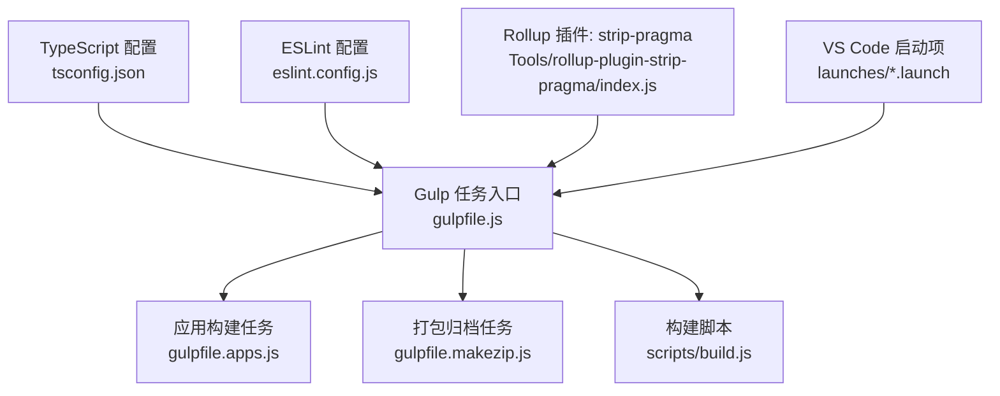
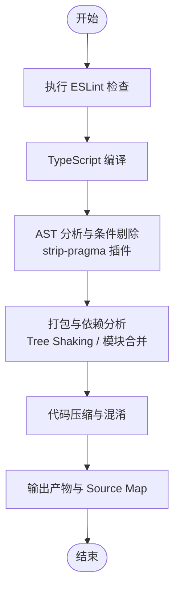
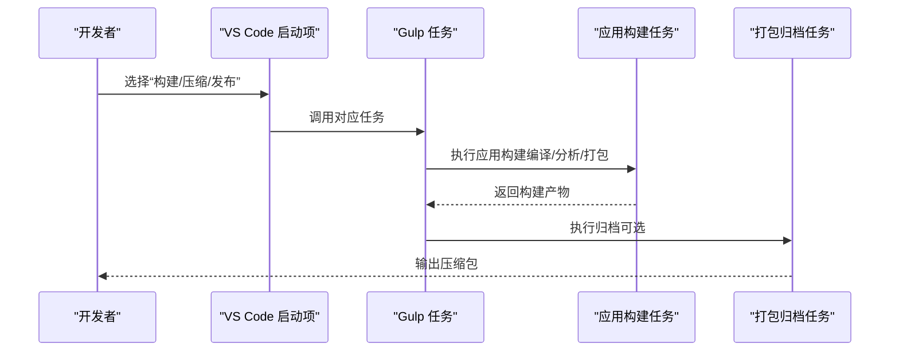
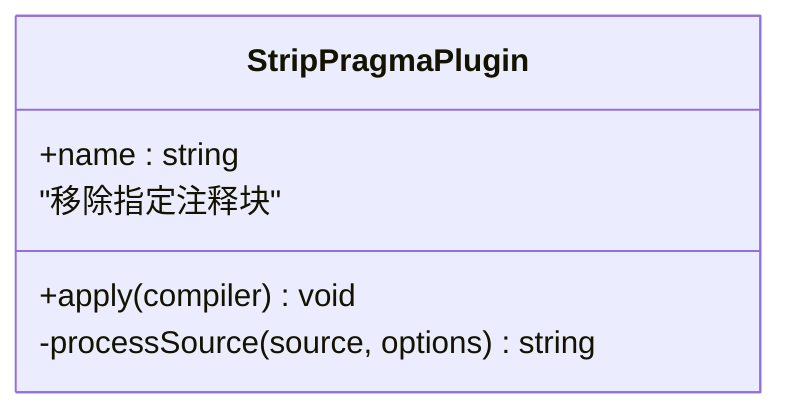
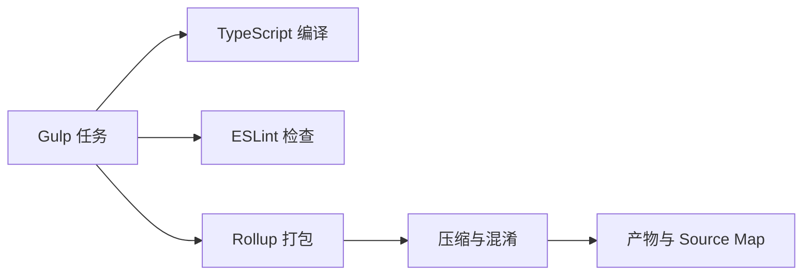

# 构建优化配置

<cite>
**本文引用的文件**   
- [gulpfile.js](file://gulpfile.js)
- [gulpfile.apps.js](file://gulpfile.apps.js)
- [gulpfile.makezip.js](file://gulpfile.makezip.js)
- [package.json](file://package.json)
- [tsconfig.json](file://tsconfig.json)
- [eslint.config.js](file://eslint.config.js)
- [rollup-plugin-strip-pragma/index.js](file://Tools/rollup-plugin-strip-pragma/index.js)
- [rollup-plugin-strip-pragma/package.json](file://Tools/rollup-plugin-strip-pragma/package.json)
- [launches/build.launch](file://launches/build.launch)
- [launches/minify.launch](file://launches/minify.launch)
- [launches/release.launch](file://launches/release.launch)
- [scripts/build.js](file://scripts/build.js)
</cite>

## 目录
1. [简介](#简介)
2. [项目结构](#项目结构)
3. [核心组件](#核心组件)
4. [架构总览](#架构总览)
5. [详细组件分析](#详细组件分析)
6. [依赖分析](#依赖分析)
7. [性能考虑](#性能考虑)
8. [故障排查指南](#故障排查指南)
9. [结论](#结论)
10. [附录](#附录)

## 简介
本指南聚焦于 Cesium 生产环境构建优化的最佳实践，围绕 Gulp 构建系统、TypeScript 编译、ESLint 质量检查、打包与压缩（Webpack/Rollup）、增量构建与缓存、以及 Source Map 生成等主题展开。文档基于仓库中现有的构建脚本与工具链进行说明，并提供可操作的优化建议与可视化流程图，帮助读者在生产环境中获得更小的包体、更快的构建速度与更稳定的发布流程。

## 项目结构
Cesium 的构建体系以 Gulp 为核心编排任务，结合 TypeScript 编译、代码压缩、资源处理与打包插件（如 Rollup 插件）完成从源码到产物的流水线。关键位置包括：
- 根级 Gulp 任务定义与入口
- 应用构建任务
- 打包产物归档任务
- 构建脚本与 VS Code 启动配置
- TypeScript 与 ESLint 配置文件
- 自定义 Rollup 插件用于移除特定注释块

**图表来源**
- [gulpfile.js](file://gulpfile.js)
- [gulpfile.apps.js](file://gulpfile.apps.js)
- [gulpfile.makezip.js](file://gulpfile.makezip.js)
- [scripts/build.js](file://scripts/build.js)
- [tsconfig.json](file://tsconfig.json)
- [eslint.config.js](file://eslint.config.js)
- [rollup-plugin-strip-pragma/index.js](file://Tools/rollup-plugin-strip-pragma/index.js)
- [launches/build.launch](file://launches/build.launch)
- [launches/minify.launch](file://launches/minify.launch)
- [launches/release.launch](file://launches/release.launch)

**章节来源**
- [gulpfile.js](file://gulpfile.js)
- [gulpfile.apps.js](file://gulpfile.apps.js)
- [gulpfile.makezip.js](file://gulpfile.makezip.js)
- [scripts/build.js](file://scripts/build.js)
- [tsconfig.json](file://tsconfig.json)
- [eslint.config.js](file://eslint.config.js)
- [rollup-plugin-strip-pragma/index.js](file://Tools/rollup-plugin-strip-pragma/index.js)
- [launches/build.launch](file://launches/build.launch)
- [launches/minify.launch](file://launches/minify.launch)
- [launches/release.launch](file://launches/release.launch)

## 核心组件
- Gulp 任务编排：负责串联编译、压缩、合并、打包与归档等步骤。
- TypeScript 编译：通过 tsconfig.json 控制模块系统、目标平台与优化参数。
- ESLint 规则：在构建前或并行阶段执行静态检查，确保代码质量。
- 自定义 Rollup 插件：用于移除特定注释块，辅助 Tree Shaking 与体积优化。
- VS Code 启动项：提供一键运行构建、压缩与发布的快捷方式。

**章节来源**
- [gulpfile.js](file://gulpfile.js)
- [tsconfig.json](file://tsconfig.json)
- [eslint.config.js](file://eslint.config.js)
- [rollup-plugin-strip-pragma/index.js](file://Tools/rollup-plugin-strip-pragma/index.js)
- [launches/build.launch](file://launches/build.launch)

## 架构总览
下图展示了生产构建的关键阶段与数据流：从源码输入开始，依次经过类型检查、编译、代码分析与优化、打包与压缩，最终输出产物并生成 Source Map。

[此图为概念性流程图，不直接映射具体源文件，故无图表来源]

## 详细组件分析

### Gulp 构建系统与优化选项
- 任务组织
  - 根级 gulpfile.js 作为任务入口，协调各子任务。
  - gulpfile.apps.js 负责应用层构建任务（例如示例应用的打包）。
  - gulpfile.makezip.js 负责将构建产物打包为压缩包，便于分发。
- 典型优化策略
  - 代码压缩：在压缩阶段启用最小化与混淆，减少体积。
  - Tree Shaking：通过静态分析移除未使用导出，降低包体。
  - 资源合并：对静态资源进行合并与去重，减少请求数。
  - 增量构建：利用 Gulp 缓存机制避免重复工作。
- 与 VS Code 集成
  - launches/build.launch、launches/minify.launch、launches/release.launch 提供快速触发构建、压缩与发布流程的能力。

**图表来源**
- [gulpfile.js](file://gulpfile.js)
- [gulpfile.apps.js](file://gulpfile.apps.js)
- [gulpfile.makezip.js](file://gulpfile.makezip.js)
- [launches/build.launch](file://launches/build.launch)
- [launches/minify.launch](file://launches/minify.launch)
- [launches/release.launch](file://launches/release.launch)

**章节来源**
- [gulpfile.js](file://gulpfile.js)
- [gulpfile.apps.js](file://gulpfile.apps.js)
- [gulpfile.makezip.js](file://gulpfile.makezip.js)
- [launches/build.launch](file://launches/build.launch)
- [launches/minify.launch](file://launches/minify.launch)
- [launches/release.launch](file://launches/release.launch)

### TypeScript 编译配置（生产环境最佳实践）
- 模块系统选择
  - 推荐采用 ES 模块（ESM）以提升 Tree Shaking 效果。
- 目标平台与兼容性
  - 根据目标浏览器设置 target 与 lib，平衡兼容性与性能。
- 优化参数
  - 开启声明文件生成（如需），关闭不必要的调试信息。
  - 合理设置 moduleResolution 与 paths，提升解析效率。
- 与构建系统集成
  - 在 Gulp 任务中调用 TypeScript 编译器，并将结果传递给后续压缩与打包阶段。

**章节来源**
- [tsconfig.json](file://tsconfig.json)

### ESLint 规则与代码质量检查
- 规则组织
  - eslint.config.js 集中管理规则与插件，支持按文件或目录范围应用不同规则集。
- 生产环境建议
  - 启用严格模式与一致性规则，避免运行时错误。
  - 在 CI 中强制检查，阻断不符合规范的提交。
- 与构建流程集成
  - 在构建前执行 ESLint，失败则中断后续步骤，保证产出质量。

**章节来源**
- [eslint.config.js](file://eslint.config.js)

### 自定义 Rollup 插件：strip-pragma
- 作用
  - 在打包阶段移除包含特定注释块的代码段，常用于条件编译与特性开关，有助于进一步缩小体积。
- 使用场景
  - 配合环境变量或构建标志，剔除开发期调试代码或可选功能。
- 与 Tree Shaking 协同
  - 提前剔除无用代码，使后续分析更准确，提高摇树效果。

**图表来源**
- [rollup-plugin-strip-pragma/index.js](file://Tools/rollup-plugin-strip-pragma/index.js)
- [rollup-plugin-strip-pragma/package.json](file://Tools/rollup-plugin-strip-pragma/package.json)

**章节来源**
- [rollup-plugin-strip-pragma/index.js](file://Tools/rollup-plugin-strip-pragma/index.js)
- [rollup-plugin-strip-pragma/package.json](file://Tools/rollup-plugin-strip-pragma/package.json)

### 构建脚本与自动化
- scripts/build.js
  - 封装常用构建逻辑，供 Gulp 任务或其他脚本复用。
- VS Code 启动项
  - builds、minify、release 等启动项简化本地操作，适合日常开发与快速验证。

**章节来源**
- [scripts/build.js](file://scripts/build.js)
- [launches/build.launch](file://launches/build.launch)
- [launches/minify.launch](file://launches/minify.launch)
- [launches/release.launch](file://launches/release.launch)

## 依赖分析
- 内部依赖
  - Gulp 任务之间通过函数调用与事件传递协作。
  - TypeScript 编译结果被后续压缩与打包阶段消费。
- 外部依赖
  - 构建脚本依赖 Node.js 生态中的常见工具（如 Gulp、Terser、Rollup 等）。
- 潜在循环依赖
  - 建议在任务拆分时保持单向依赖，避免循环调用导致构建不稳定。

**图表来源**
- [gulpfile.js](file://gulpfile.js)
- [tsconfig.json](file://tsconfig.json)
- [eslint.config.js](file://eslint.config.js)
- [rollup-plugin-strip-pragma/index.js](file://Tools/rollup-plugin-strip-pragma/index.js)

**章节来源**
- [gulpfile.js](file://gulpfile.js)
- [package.json](file://package.json)

## 性能考虑
- 构建速度
  - 启用增量构建与缓存，避免重复编译与分析。
  - 并行执行独立任务（如 lint 与编译），缩短整体耗时。
- 产物体积
  - 优先使用 ESM 模块，最大化 Tree Shaking。
  - 使用 strip-pragma 插件剔除条件分支与调试代码。
  - 启用压缩与混淆，减少传输大小。
- 稳定性
  - 在 CI 中固定依赖版本，确保构建可重现。
  - 对关键任务添加超时与重试策略，提升鲁棒性。

[本节为通用指导，不直接分析具体文件，故无章节来源]

## 故障排查指南
- 构建失败
  - 检查 ESLint 是否报错，定位问题文件与规则。
  - 查看 TypeScript 编译错误，确认模块路径与类型定义。
- 产物异常
  - 核对 strip-pragma 插件配置，确认注释块匹配是否正确。
  - 检查 Source Map 是否生成，必要时调整映射级别。
- 性能问题
  - 分析 Gulp 任务耗时，识别瓶颈步骤。
  - 评估 Tree Shaking 效果，确认未使用的导出是否被正确剔除。

**章节来源**
- [eslint.config.js](file://eslint.config.js)
- [tsconfig.json](file://tsconfig.json)
- [rollup-plugin-strip-pragma/index.js](file://Tools/rollup-plugin-strip-pragma/index.js)

## 结论
通过合理的 Gulp 任务编排、TypeScript 编译优化、ESLint 质量保障、自定义 Rollup 插件与压缩策略，可以在生产环境中显著降低包体体积、提升构建速度与产物稳定性。建议结合 CI/CD 固化流程，持续监控构建指标与产物质量，逐步迭代优化。

[本节为总结性内容，不直接分析具体文件，故无章节来源]

## 附录
- 相关配置文件与脚本路径
  - 构建任务：[gulpfile.js](file://gulpfile.js)、[gulpfile.apps.js](file://gulpfile.apps.js)、[gulpfile.makezip.js](file://gulpfile.makezip.js)
  - 构建脚本：[scripts/build.js](file://scripts/build.js)
  - 类型与规则：[tsconfig.json](file://tsconfig.json)、[eslint.config.js](file://eslint.config.js)
  - 插件与依赖：[rollup-plugin-strip-pragma/index.js](file://Tools/rollup-plugin-strip-pragma/index.js)、[rollup-plugin-strip-pragma/package.json](file://Tools/rollup-plugin-strip-pragma/package.json)、[package.json](file://package.json)
  - 启动项：[launches/build.launch](file://launches/build.launch)、[launches/minify.launch](file://launches/minify.launch)、[launches/release.launch](file://launches/release.launch)